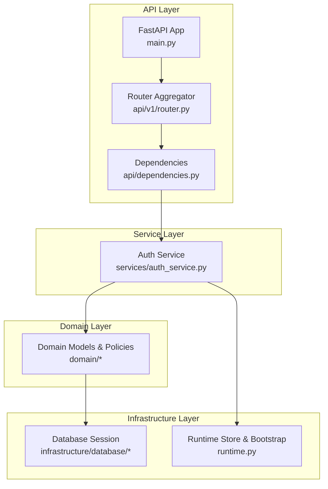
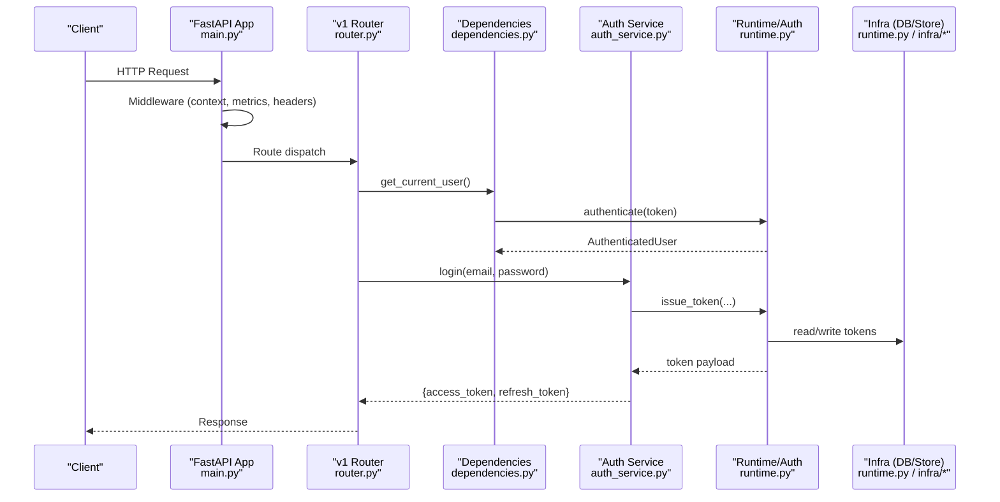
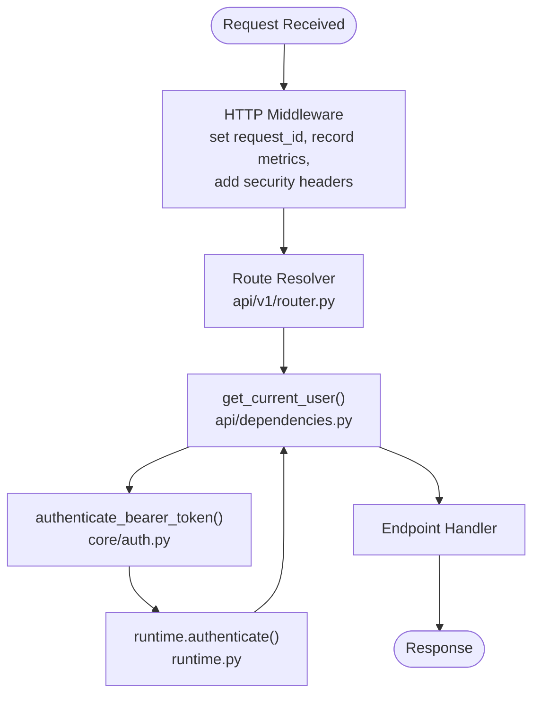
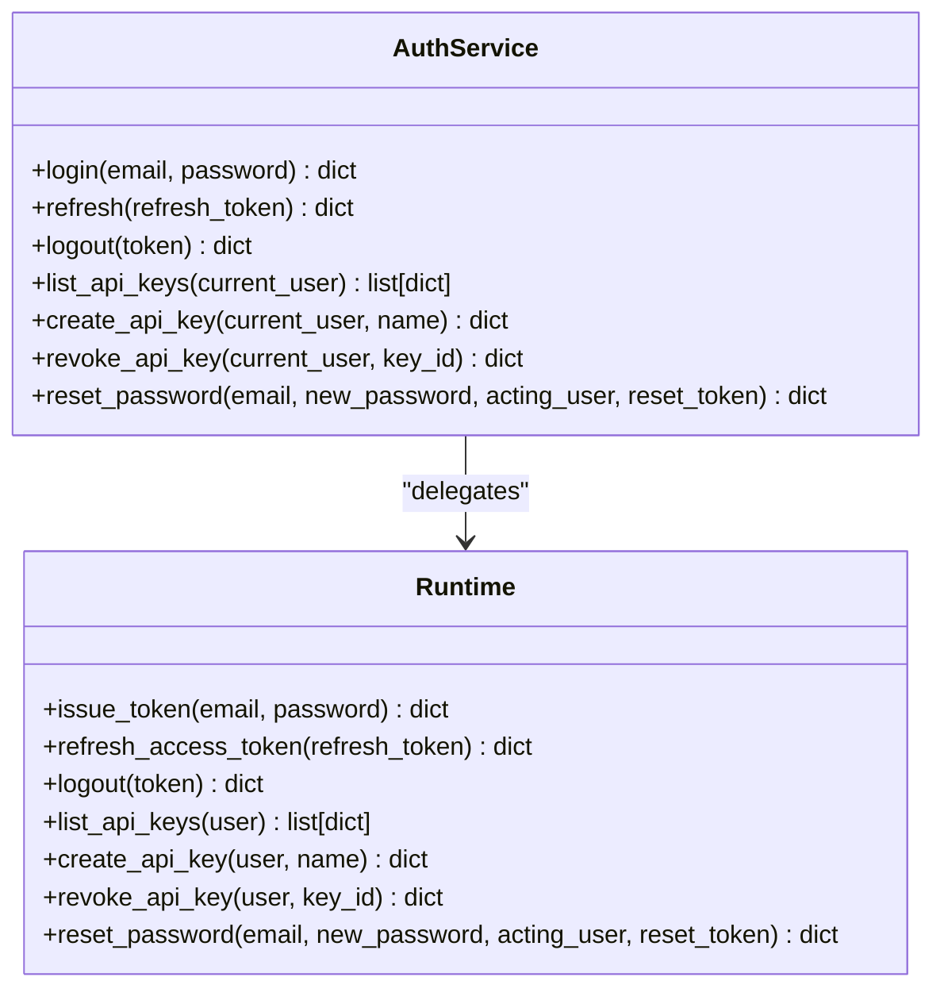
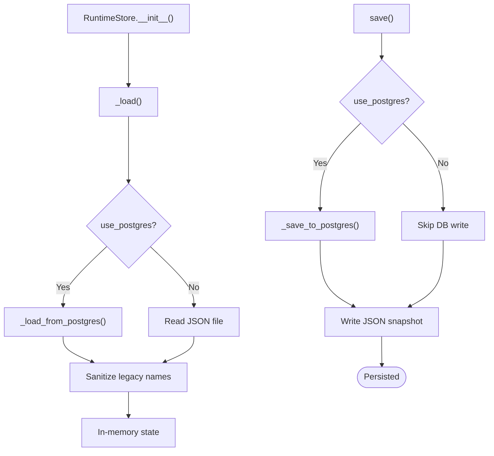
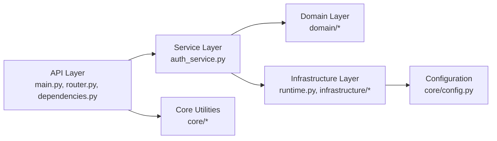

# Layered Architecture

<cite>
**Referenced Files in This Document**
- [main.py](file://backend/app/main.py)
- [router.py](file://backend/app/api/v1/router.py)
- [dependencies.py](file://backend/app/api/dependencies.py)
- [auth.py](file://backend/app/core/auth.py)
- [config.py](file://backend/app/core/config.py)
- [runtime.py](file://backend/app/runtime.py)
- [auth_service.py](file://backend/app/services/auth_service.py)
</cite>

## Table of Contents
1. [Introduction](#introduction)
2. [Project Structure](#project-structure)
3. [Core Components](#core-components)
4. [Architecture Overview](#architecture-overview)
5. [Detailed Component Analysis](#detailed-component-analysis)
6. [Dependency Analysis](#dependency-analysis)
7. [Performance Considerations](#performance-considerations)
8. [Troubleshooting Guide](#troubleshooting-guide)
9. [Conclusion](#conclusion)

## Introduction
This document describes the layered architecture implemented in the backend application. It focuses on four primary layers:
- API Layer (FastAPI endpoints and routing)
- Service Layer (business logic orchestration)
- Domain Layer (core business entities, rules, and policies)
- Infrastructure Layer (data persistence, external integrations)

The design enforces clear separation of concerns with a top-down dependency flow: API depends on Services; Services depend on Domain; Domain may depend on Infrastructure abstractions. Cross-cutting concerns such as authentication, logging, metrics, and error handling are applied consistently across layers via middleware and shared utilities.

## Project Structure
The backend is organized into logical packages that map to the layered architecture:
- api: FastAPI routers, dependencies, and error handlers
- core: Shared cross-cutting concerns (configuration, auth helpers, logging, metrics, permissions, rate limiting)
- domain: Business entities, models, and policy engines
- infrastructure: Data access, external integrations, repositories, queues, vector stores, LLM adapters
- services: Orchestration layer coordinating domain and infrastructure
- schemas: Pydantic request/response contracts used by the API layer
- workers: Background job processors
- runtime: In-process runtime store and bootstrap utilities (used for development and seed data)

**Diagram sources**
- [main.py:1-52](file://backend/app/main.py#L1-L52)
- [router.py:1-47](file://backend/app/api/v1/router.py#L1-L47)
- [dependencies.py:1-18](file://backend/app/api/dependencies.py#L1-L18)
- [auth_service.py:1-30](file://backend/app/services/auth_service.py#L1-L30)
- [runtime.py:258-384](file://backend/app/runtime.py#L258-L384)

**Section sources**
- [main.py:1-52](file://backend/app/main.py#L1-L52)
- [router.py:1-47](file://backend/app/api/v1/router.py#L1-L47)
- [dependencies.py:1-18](file://backend/app/api/dependencies.py#L1-L18)
- [auth_service.py:1-30](file://backend/app/services/auth_service.py#L1-L30)
- [runtime.py:258-384](file://backend/app/runtime.py#L258-L384)

## Core Components
- API Layer
  - FastAPI application initialization, CORS, global HTTP middleware for request context, metrics, security headers, and OpenAPI exposure.
  - Router aggregator mounts feature routers under a common prefix.
  - Dependency injection provides authenticated user and runtime access to endpoints.
- Service Layer
  - Thin orchestrators delegating to runtime/domain while keeping endpoint handlers focused on input/output validation and response shaping.
- Domain Layer
  - Entities, models, and policy engines encapsulating business rules and state transitions.
- Infrastructure Layer
  - Persistence abstraction (Postgres or JSON file fallback), database session management, and runtime bootstrap/seed logic.

Key responsibilities and boundaries:
- API Layer: request parsing, response serialization, cross-cutting concerns (logging, metrics, security headers).
- Service Layer: use cases, transactional boundaries, orchestration across domain and infrastructure.
- Domain Layer: pure business logic without framework coupling.
- Infrastructure Layer: concrete implementations of storage, external APIs, queues, and LLM/vector integrations.

**Section sources**
- [main.py:16-52](file://backend/app/main.py#L16-L52)
- [router.py:26-47](file://backend/app/api/v1/router.py#L26-L47)
- [dependencies.py:9-18](file://backend/app/api/dependencies.py#L9-L18)
- [auth_service.py:4-30](file://backend/app/services/auth_service.py#L4-L30)
- [runtime.py:258-384](file://backend/app/runtime.py#L258-L384)

## Architecture Overview
The system follows a strict top-down dependency model:
- API Layer depends only on Service Layer and shared core utilities.
- Service Layer coordinates Domain operations and calls Infrastructure abstractions.
- Domain Layer contains no framework-specific code and may reference Infrastructure interfaces (not concrete implementations).
- Infrastructure Layer implements persistence and external integrations.

**Diagram sources**
- [main.py:16-52](file://backend/app/main.py#L16-L52)
- [router.py:26-47](file://backend/app/api/v1/router.py#L26-L47)
- [dependencies.py:13-18](file://backend/app/api/dependencies.py#L13-L18)
- [auth_service.py:4-13](file://backend/app/services/auth_service.py#L4-L13)
- [runtime.py:258-384](file://backend/app/runtime.py#L258-L384)

## Detailed Component Analysis

### API Layer
Responsibilities:
- Application lifecycle setup (CORS, error handlers, OpenAPI).
- Global HTTP middleware for request ID propagation, metrics recording, and security headers.
- Feature router aggregation under a versioned prefix.
- Dependency injection for current user and runtime access.

Key interactions:
- The app registers error handlers and includes the v1 router.
- The HTTP middleware sets request-scoped identifiers and records metrics/logging.
- Endpoints obtain the current user via a FastAPI dependency that delegates to the core auth helper.

**Diagram sources**
- [main.py:16-52](file://backend/app/main.py#L16-L52)
- [router.py:26-47](file://backend/app/api/v1/router.py#L26-L47)
- [dependencies.py:13-18](file://backend/app/api/dependencies.py#L13-L18)
- [auth.py:6-8](file://backend/app/core/auth.py#L6-L8)
- [runtime.py:258-384](file://backend/app/runtime.py#L258-L384)

**Section sources**
- [main.py:16-52](file://backend/app/main.py#L16-L52)
- [router.py:26-47](file://backend/app/api/v1/router.py#L26-L47)
- [dependencies.py:9-18](file://backend/app/api/dependencies.py#L9-L18)
- [auth.py:6-8](file://backend/app/core/auth.py#L6-L8)

### Service Layer
Responsibilities:
- Encapsulate use cases and orchestrate domain and infrastructure calls.
- Provide clean method signatures for API endpoints.
- Keep endpoints free from business logic complexity.

Example: Authentication service methods delegate to runtime for token issuance, refresh, logout, and API key management.

**Diagram sources**
- [auth_service.py:4-30](file://backend/app/services/auth_service.py#L4-L30)
- [runtime.py:258-384](file://backend/app/runtime.py#L258-L384)

**Section sources**
- [auth_service.py:4-30](file://backend/app/services/auth_service.py#L4-L30)

### Domain Layer
Responsibilities:
- Define core business entities, models, and policy engines.
- Implement business rules independent of frameworks and storage details.
- Provide stable interfaces for services to operate against.

Note: The domain package contains multiple subdomains (agents, approvals, audit, evaluations, governance, knowledge, memory, processes, workflows). Each subpackage typically includes models, policies, and sometimes lightweight service-like modules.

**Section sources**
- [runtime.py:258-384](file://backend/app/runtime.py#L258-L384)

### Infrastructure Layer
Responsibilities:
- Implement persistence backends (Postgres or JSON file fallback).
- Manage database sessions and migrations.
- Provide bootstrap and seed data loading for development/demo scenarios.

Key implementation highlights:
- RuntimeStore selects Postgres when configured and available; otherwise falls back to a local JSON file.
- On save, it persists to both Postgres (when enabled) and maintains a JSON snapshot for offline backup/migration.
- Database URL normalization ensures sync driver compatibility for the synchronous runtime store.

**Diagram sources**
- [runtime.py:258-384](file://backend/app/runtime.py#L258-L384)
- [config.py:74-83](file://backend/app/core/config.py#L74-L83)

**Section sources**
- [runtime.py:258-384](file://backend/app/runtime.py#L258-L384)
- [config.py:23-34](file://backend/app/core/config.py#L23-L34)
- [config.py:74-83](file://backend/app/core/config.py#L74-L83)

## Dependency Analysis
Top-to-bottom dependency flow:
- API Layer imports from core (auth helpers, config) and depends on Service Layer.
- Service Layer depends on Domain Layer and Infrastructure abstractions.
- Domain Layer remains decoupled from framework specifics.
- Infrastructure Layer depends on configuration and third-party drivers.

**Diagram sources**
- [main.py:16-52](file://backend/app/main.py#L16-L52)
- [router.py:26-47](file://backend/app/api/v1/router.py#L26-L47)
- [dependencies.py:9-18](file://backend/app/api/dependencies.py#L9-L18)
- [auth_service.py:4-30](file://backend/app/services/auth_service.py#L4-L30)
- [runtime.py:258-384](file://backend/app/runtime.py#L258-L384)
- [config.py:74-83](file://backend/app/core/config.py#L74-L83)

**Section sources**
- [main.py:16-52](file://backend/app/main.py#L16-L52)
- [router.py:26-47](file://backend/app/api/v1/router.py#L26-L47)
- [dependencies.py:9-18](file://backend/app/api/dependencies.py#L9-L18)
- [auth_service.py:4-30](file://backend/app/services/auth_service.py#L4-L30)
- [runtime.py:258-384](file://backend/app/runtime.py#L258-L384)
- [config.py:74-83](file://backend/app/core/config.py#L74-L83)

## Performance Considerations
- Metrics collection at the middleware level captures per-request latency and status codes for observability.
- Postgres-backed RuntimeStore reduces contention compared to single-file JSON writes under load.
- Connection pooling parameters are configurable for database performance tuning.
- Security headers and minimal overhead middleware ensure low-latency request processing.

[No sources needed since this section provides general guidance]

## Troubleshooting Guide
Common issues and resolutions:
- Authentication failures: Ensure Bearer token format is correct and tokens exist in runtime store. Verify environment variables for token mapping and API keys.
- Persistence mode: If Postgres is unavailable, the system falls back to JSON file storage. Check DATABASE_URL and force_json_store settings.
- CORS errors: Validate allowed origins configuration.
- Rate limiting: Confirm rate limit flags and thresholds in configuration.

Operational checks:
- Inspect request IDs propagated in response headers for tracing.
- Review metrics recorded by the middleware for anomalies.
- Validate OpenAPI schema availability at the configured prefix.

**Section sources**
- [main.py:16-52](file://backend/app/main.py#L16-L52)
- [config.py:37-83](file://backend/app/core/config.py#L37-L83)
- [runtime.py:258-384](file://backend/app/runtime.py#L258-L384)

## Conclusion
The layered architecture cleanly separates concerns across API, Service, Domain, and Infrastructure layers. Dependencies flow strictly downward, enabling testability, maintainability, and scalability. Cross-cutting concerns are centralized in core utilities and middleware, ensuring consistent behavior across all endpoints. The runtime store’s dual persistence strategy supports both production-grade reliability and developer convenience.

[No sources needed since this section summarizes without analyzing specific files]