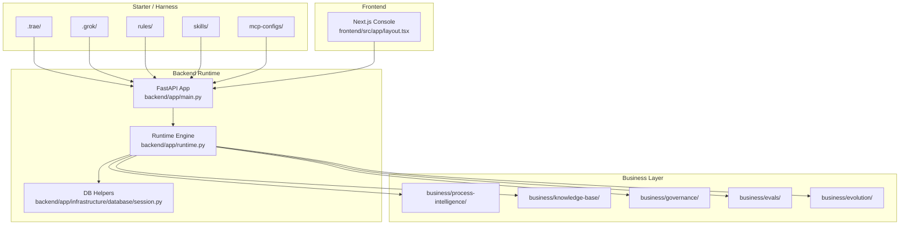
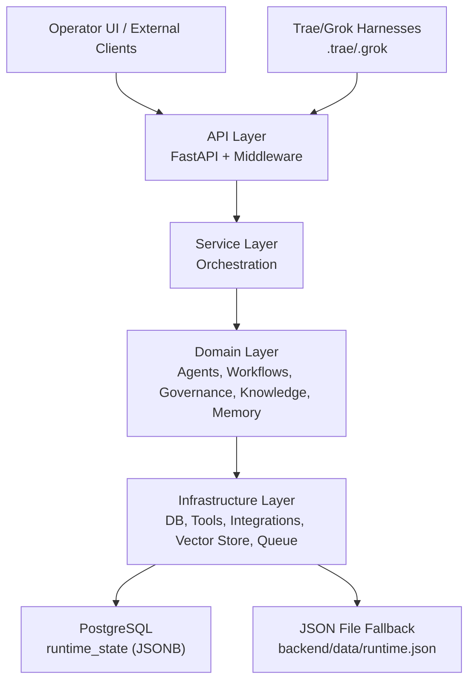
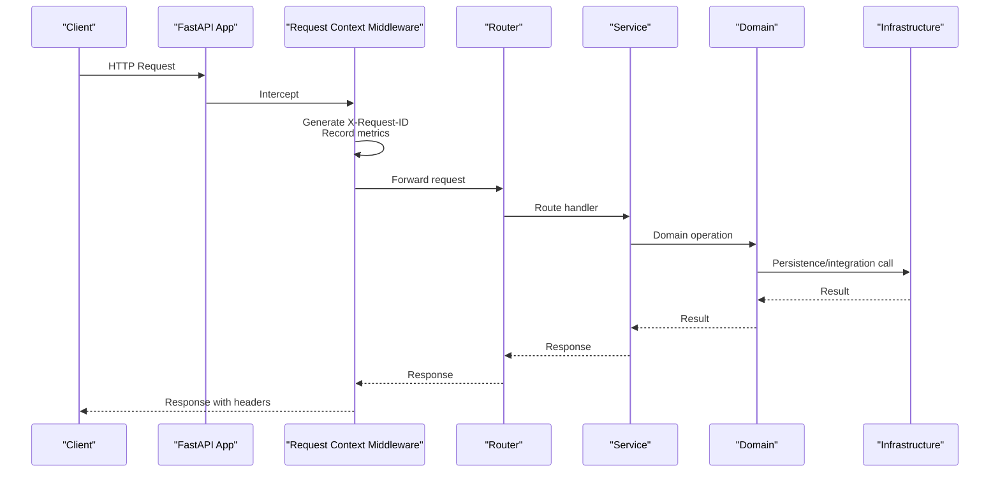
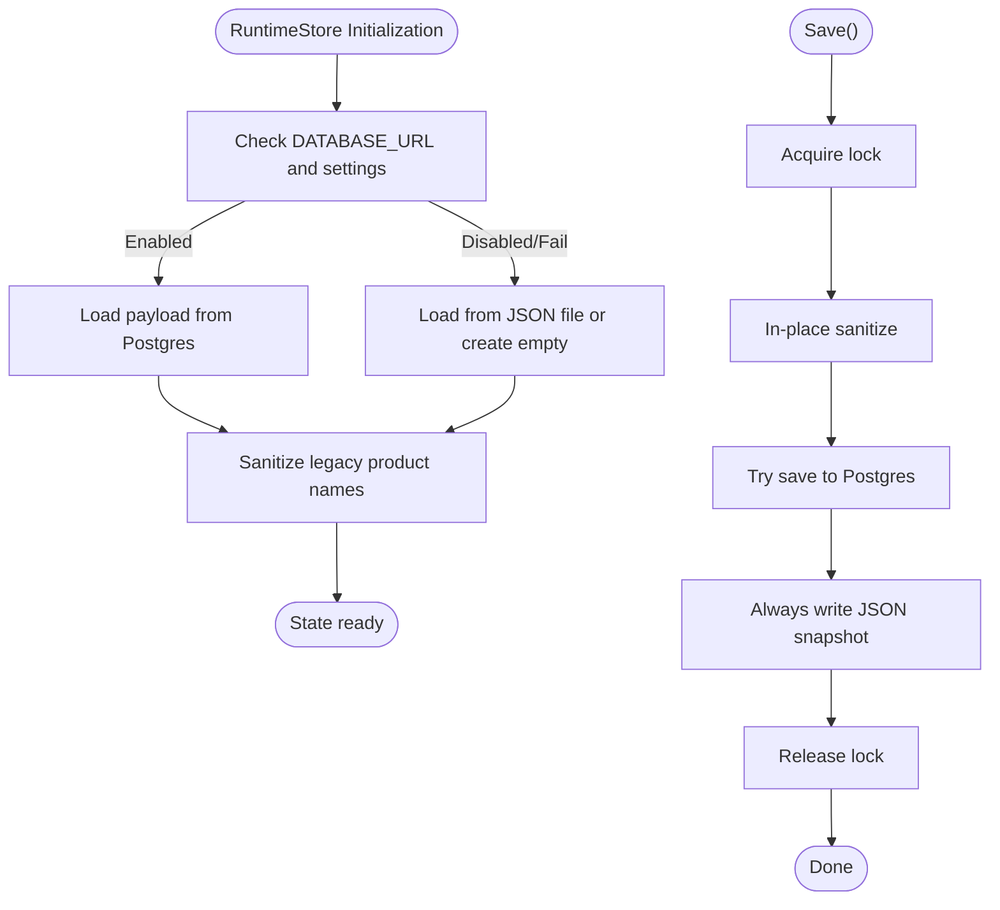
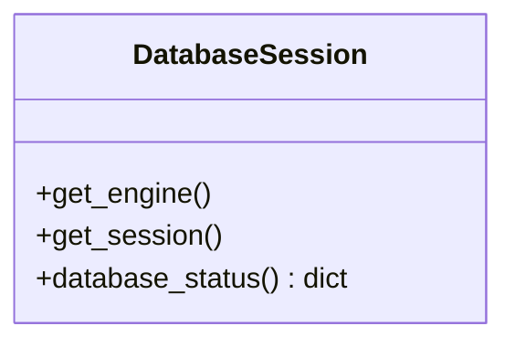
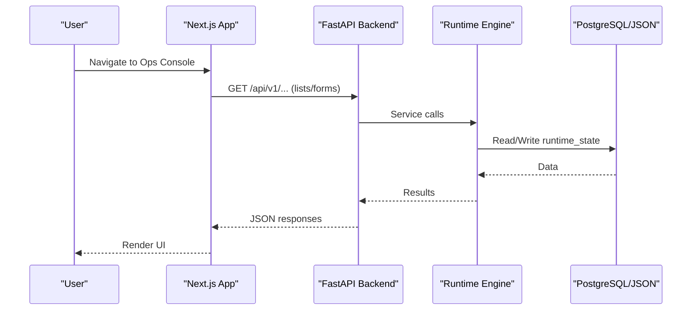
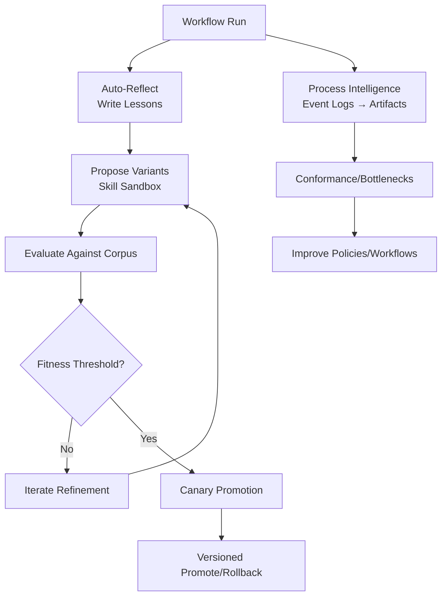
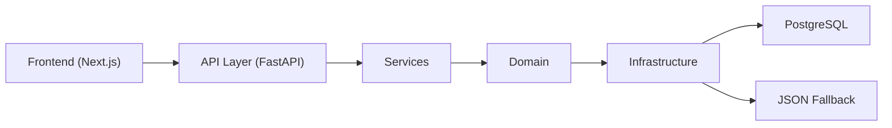

# System Design

<cite>
**Referenced Files in This Document**
- [README.md](file://README.md)
- [architecture.md](file://docs/architecture.md)
- [main.py](file://backend/app/main.py)
- [runtime.py](file://backend/app/runtime.py)
- [session.py](file://backend/app/infrastructure/database/session.py)
- [layout.tsx](file://frontend/src/app/layout.tsx)
</cite>

## Table of Contents
1. Introduction
2. Project Structure
3. Core Components
4. Architecture Overview
5. Detailed Component Analysis
6. Dependency Analysis
7. Performance Considerations
8. Troubleshooting Guide
9. Conclusion

## Introduction
Generic Swarm Ops is a governed, auditable, self-improving multi-agent business operating system with dual-harness support for Trae IDE and Grok Build. It combines:
- A starter/harness layer that generates agent and rules assets for both harnesses
- A business operating-system layer (process intelligence, knowledge/memory, governance, evaluations, evolution sandbox)
- A FastAPI control plane backend
- A Next.js ops console frontend

The system enforces RBAC, human-gated approvals, tool effect auditing, and provides self-improvement loops and process intelligence to continuously refine operations.

**Section sources**
- [README.md:1-129](file://README.md#L1-L129)
- [architecture.md:1-64](file://docs/architecture.md#L1-L64)

## Project Structure
High-level layout:
- Starter/Harness: .trae/, .grok/, scripts/adapters, mcp-configs, skills, rules
- Business: business/* (PI artifacts, knowledge-base, governance, evals, evolution)
- Backend: backend/app (FastAPI app, runtime engine, services, domain, infrastructure)
- Frontend: frontend (Next.js ops console)
- Docs: docs/* (architecture, guides, runbooks)

**Diagram sources**
- [main.py:1-52](file://backend/app/main.py#L1-L52)
- [runtime.py:258-384](file://backend/app/runtime.py#L258-L384)
- [session.py:10-63](file://backend/app/infrastructure/database/session.py#L10-L63)
- [layout.tsx:17-28](file://frontend/src/app/layout.tsx#L17-L28)

**Section sources**
- [README.md:1-129](file://README.md#L1-L129)
- [architecture.md:1-64](file://docs/architecture.md#L1-L64)

## Core Components
- API Layer (FastAPI): request context middleware, CORS, security headers, OpenAPI exposure, router mounting
- Runtime Engine: governed execution, RBAC, store abstraction (Postgres primary, JSON fallback), seed/bootstrap, normalization
- Infrastructure: database session helpers, tool adapters, knowledge retrieval, process intelligence, evolution, self-improvement, loop engineering
- Frontend: Next.js ops console with real forms and live views when demo mode is disabled

Key responsibilities:
- API Layer: HTTP entrypoints, cross-cutting concerns (logging, metrics, security)
- Service Layer: orchestration across domain logic and infrastructure
- Domain Layer: agents, workflows, approvals, governance, knowledge, memory, processes
- Infrastructure Layer: persistence, integrations, vector stores, queues, LLMs, tools

**Section sources**
- [main.py:16-52](file://backend/app/main.py#L16-L52)
- [runtime.py:258-384](file://backend/app/runtime.py#L258-L384)
- [session.py:10-63](file://backend/app/infrastructure/database/session.py#L10-L63)
- [layout.tsx:17-28](file://frontend/src/app/layout.tsx#L17-L28)

## Architecture Overview
The system follows a layered architecture with clear boundaries and integration points:
- API Layer exposes REST endpoints and manages cross-cutting concerns
- Service Layer orchestrates domain operations and coordinates infrastructure
- Domain Layer encapsulates business entities and policies (agents, workflows, approvals, governance, knowledge, memory, processes)
- Infrastructure Layer implements persistence, external integrations, and specialized subsystems (knowledge, evolution, self-improvement, loops, process intelligence)

**Diagram sources**
- [main.py:16-52](file://backend/app/main.py#L16-L52)
- [runtime.py:258-384](file://backend/app/runtime.py#L258-L384)
- [session.py:10-63](file://backend/app/infrastructure/database/session.py#L10-L63)

## Detailed Component Analysis

### API Layer
Responsibilities:
- Initialize FastAPI app with OpenAPI exposure
- Register error handlers and CORS middleware
- Add request context middleware for tracing, metrics, and security headers
- Mount versioned routers under the configured API prefix

Behavior highlights:
- Request ID propagation via header and response
- Metrics recording per endpoint and status code
- Security headers injection (CSP, HSTS in production, etc.)
- Health readiness endpoint exposed by the runtime

**Diagram sources**
- [main.py:16-52](file://backend/app/main.py#L16-L52)

**Section sources**
- [main.py:16-52](file://backend/app/main.py#L16-L52)

### Runtime Engine and Persistence
Responsibilities:
- Provide a governed runtime store with Postgres primary and JSON fallback
- Bootstrap default organization, users, tokens, agents, tools, workflows, knowledge documents
- Normalize legacy state and ensure forward compatibility
- Persist changes atomically with locking and snapshot backup

Key behaviors:
- Postgres schema creation on first use
- Migration from JSON file to Postgres if needed
- In-place sanitization of legacy product names
- Thread-safe save with concurrent access protection

**Diagram sources**
- [runtime.py:258-384](file://backend/app/runtime.py#L258-L384)

**Section sources**
- [runtime.py:258-384](file://backend/app/runtime.py#L258-L384)

### Database Session Helper
Responsibilities:
- Provide SQLAlchemy engine and session management for Postgres
- Expose health check capability for database reachability

Key behaviors:
- Lazy initialization with caching
- Graceful handling when Postgres is not configured
- Pool configuration parameters

**Diagram sources**
- [session.py:10-63](file://backend/app/infrastructure/database/session.py#L10-L63)

**Section sources**
- [session.py:10-63](file://backend/app/infrastructure/database/session.py#L10-L63)

### Frontend Ops Console
Responsibilities:
- Provide Next.js application shell and metadata
- Render operator-facing UI for live operations when demo mode is disabled

Integration:
- Calls backend APIs for agents, workflows, runs, approvals, knowledge, evaluations, processes, improvement pipeline, and evolution archive

**Diagram sources**
- [layout.tsx:17-28](file://frontend/src/app/layout.tsx#L17-L28)
- [main.py:16-52](file://backend/app/main.py#L16-L52)
- [runtime.py:258-384](file://backend/app/runtime.py#L258-L384)

**Section sources**
- [layout.tsx:17-28](file://frontend/src/app/layout.tsx#L17-L28)

### Evolution Sandbox, Self-Improvement Loops, Process Intelligence
Evolution Sandbox:
- Disk corpus evaluation against golden/regression/adversarial sets
- Fitness scoring, canary promotion, versioned promotions and rollbacks
- Sandbox-only mutations until evaluated; never mutate production DNA directly

Self-Improvement Loops:
- Auto-reflect writes lessons learned upon terminal status
- Optional LLM critic and skill sandbox propose variants
- Loop DNA and stop/continue runner manage iterative refinement

Process Intelligence:
- Event ingestion into discovered/conformance/bottleneck artifacts
- Conformance reports and bottleneck analysis drive continuous improvement

**Diagram sources**
- [architecture.md:34-50](file://docs/architecture.md#L34-L50)
- [README.md:63-89](file://README.md#L63-L89)

**Section sources**
- [architecture.md:34-50](file://docs/architecture.md#L34-L50)
- [README.md:63-89](file://README.md#L63-L89)

## Dependency Analysis
Component relationships:
- API depends on middleware and routers; routes delegate to services
- Services depend on domain models and infrastructure abstractions
- Runtime engine centralizes persistence and bootstrap logic
- Database helper abstracts Postgres connectivity and health checks
- Frontend depends on backend APIs for all operational surfaces

**Diagram sources**
- [main.py:16-52](file://backend/app/main.py#L16-L52)
- [runtime.py:258-384](file://backend/app/runtime.py#L258-L384)
- [session.py:10-63](file://backend/app/infrastructure/database/session.py#L10-L63)
- [layout.tsx:17-28](file://frontend/src/app/layout.tsx#L17-L28)

**Section sources**
- [main.py:16-52](file://backend/app/main.py#L16-L52)
- [runtime.py:258-384](file://backend/app/runtime.py#L258-L384)
- [session.py:10-63](file://backend/app/infrastructure/database/session.py#L10-L63)
- [layout.tsx:17-28](file://frontend/src/app/layout.tsx#L17-L28)

## Performance Considerations
- Use Postgres for durability and concurrency; JSON fallback is suitable for local/dev
- Leverage connection pooling parameters for database performance
- Record per-request metrics and durations at the API layer for observability
- Keep runtime saves atomic with locks to avoid contention
- Prefer tiered knowledge retrieval (keyword + embeddings) to reduce latency

[No sources needed since this section provides general guidance]

## Troubleshooting Guide
Common issues and diagnostics:
- Database connectivity: check health endpoint and database status helper
- JSON vs Postgres backend: verify configuration flags and environment variables
- Legacy data migration: ensure sanitization runs on load/save
- Demo mode: confirm frontend env disables demo mode for live ops

Operational tips:
- Inspect X-Request-ID in requests/responses for tracing
- Review audit logs and tool effects for irreversible steps
- Validate evolution artifacts and fitness scores before promotion

**Section sources**
- [session.py:36-63](file://backend/app/infrastructure/database/session.py#L36-L63)
- [runtime.py:258-384](file://backend/app/runtime.py#L258-L384)
- [main.py:27-48](file://backend/app/main.py#L27-L48)

## Conclusion
Generic Swarm Ops delivers a governed, auditable, and self-improving multi-agent business operating system. Its layered architecture cleanly separates API, service, domain, and infrastructure concerns while integrating with PostgreSQL and providing robust fallbacks. The dual-harness setup enables seamless operation within Trae IDE and Grok Build environments. With built-in evolution sandboxing, self-improvement loops, and process intelligence, the system supports continuous refinement and safe promotion of operational improvements.

[No sources needed since this section summarizes without analyzing specific files]