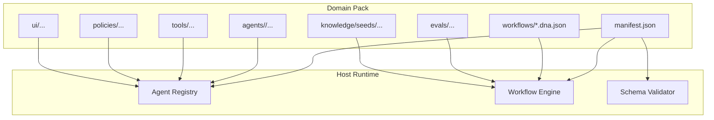
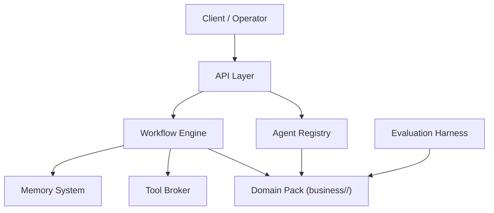
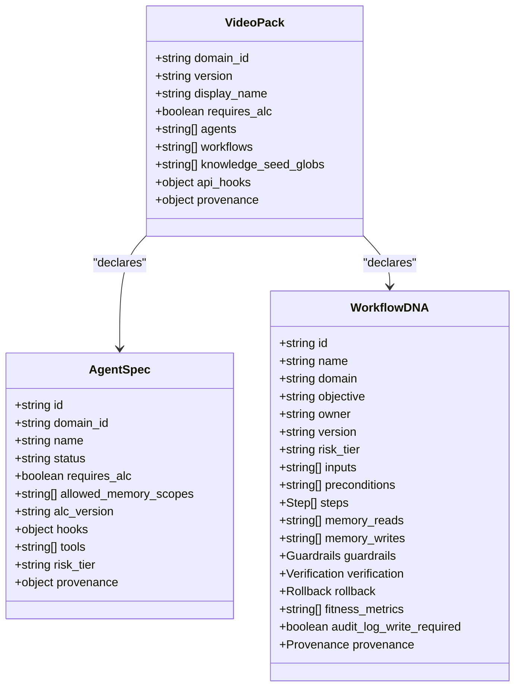
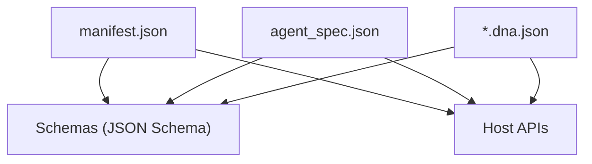

# Business Domain Packs

<cite>
**Referenced Files in This Document**
- [domain-packs.md](file://docs/domain-packs.md)
- [add-domain-pack-runbook.md](file://docs/add-domain-pack-runbook.md)
- [domain-pack-versioning-matrix.md](file://docs/domain-pack-versioning-matrix.md)
- [domain-manifest.schema.json](file://business/schemas/domain-manifest.schema.json)
- [agent-spec.schema.json](file://business/schemas/agent-spec.schema.json)
- [workflow-dna.schema.json](file://business/schemas/workflow-dna.schema.json)
- [manifest.json (video)](file://business/video/manifest.json)
- [README.md (video pack)](file://business/video/README.md)
- [ROSTER.json (video)](file://business/video/ROSTER.json)
- [MAP.md (video)](file://business/video/MAP.md)
- [manifest.json (example_education)](file://business/example_education/manifest.json)
- [manifest.json (example_research)](file://business/example_research/manifest.json)
</cite>

## Table of Contents
1. [Introduction](#introduction)
2. [Project Structure](#project-structure)
3. [Core Components](#core-components)
4. [Architecture Overview](#architecture-overview)
5. [Detailed Component Analysis](#detailed-component-analysis)
6. [Dependency Analysis](#dependency-analysis)
7. [Performance Considerations](#performance-considerations)
8. [Troubleshooting Guide](#troubleshooting-guide)
9. [Conclusion](#conclusion)
10. [Appendices](#appendices)

## Introduction
This document explains how to develop, manage, and share business domain packs within the platform. A domain pack is a self-contained unit under business/<domain_id>/ that plugs into the host runtime without forking core services. It includes agents, workflows, evaluation assets, knowledge seeds, policies, and optional UI components. The video production domain pack serves as a comprehensive example with specialized agents and end-to-end workflows.

## Project Structure
A domain pack follows a consistent layout:
- manifest.json at the root declares metadata, agent IDs, workflow IDs, tool namespace, and provenance.
- agents/<pack_id>/ contains per-agent specifications and documentation.
- workflows/ holds workflow DNA definitions.
- evals/, tools/, knowledge/seeds/, policies/, ui/ are optional but recommended for completeness.

**Diagram sources**
- [domain-packs.md:18-30](file://docs/domain-packs.md#L18-L30)
- [domain-manifest.schema.json:1-77](file://business/schemas/domain-manifest.schema.json#L1-L77)

**Section sources**
- [domain-packs.md:18-30](file://docs/domain-packs.md#L18-L30)

## Core Components
- Manifest: Declares domain identity, version, display name, risk tier, ALC requirements, agent and workflow lists, knowledge seed globs, API hooks, and provenance.
- Agent Spec: Defines agent identity, role, category, status, ALC configuration, memory scopes, hooks, allowed tools, risk tier, critique rubric reference, and provenance.
- Workflow DNA: Describes objective, owner, inputs, preconditions, steps (with agent, tools, gates), memory access, guardrails, verification, rollback, fitness metrics, audit logging, and provenance.

Key schema references:
- Domain manifest schema: required fields include domain_id, version, display_name, requires_alc, agents, workflows; optional fields include default_risk_tier, api_hooks, knowledge_seed_globs, provenance.
- Agent spec schema: required fields include id, domain_id, name, status, requires_alc, allowed_memory_scopes, alc_version; optional fields include hooks.reflect, tools, risk_tier, critique_rubric_ref, provenance.
- Workflow DNA schema: required fields include id, name, domain, objective, owner, version, risk_tier, inputs, preconditions, steps, memory_reads, memory_writes, guardrails, verification, rollback, fitness_metrics, audit_log_write_required, provenance.

**Section sources**
- [domain-manifest.schema.json:1-77](file://business/schemas/domain-manifest.schema.json#L1-L77)
- [agent-spec.schema.json:1-52](file://business/schemas/agent-spec.schema.json#L1-L52)
- [workflow-dna.schema.json:1-258](file://business/schemas/workflow-dna.schema.json#L1-L258)

## Architecture Overview
The domain pack architecture emphasizes isolation and extensibility:
- Host runtime remains universal; domain logic stays within the pack path.
- Agents gain autonomous learning capabilities via ALC when activated.
- Tool namespaces isolate cross-domain interactions.
- Memory scopes enforce boundaries between agent, organization, run, workflow, and public contexts.
- Video pack retains its full roster and process index; inventory CI enforces completeness.

**Diagram sources**
- [domain-packs.md:6-16](file://docs/domain-packs.md#L6-L16)
- [domain-packs.md:92-96](file://docs/domain-packs.md#L92-L96)

**Section sources**
- [domain-packs.md:6-16](file://docs/domain-packs.md#L6-L16)
- [domain-packs.md:92-96](file://docs/domain-packs.md#L92-L96)

## Detailed Component Analysis

### Domain Pack Manifest
- Purpose: Declare domain identity, versioning, risk posture, ALC requirement, and catalog entries for agents and workflows.
- Key fields:
  - domain_id: Unique identifier for the domain.
  - version: Semantic version for the pack.
  - display_name: Human-readable title.
  - default_risk_tier: Default risk level for artifacts in this pack.
  - requires_alc: Whether agents require ALC activation.
  - agents: List of agent identifiers or objects with id/path.
  - workflows: List of workflow identifiers or objects with id/path.
  - knowledge_seed_globs: Paths to knowledge seeds included by the pack.
  - api_hooks.tool_namespace: Namespaced tool prefix for the pack.
  - provenance.source_refs: References to upstream documents.

Example manifests:
- Video production domain pack manifest enumerates all agents and workflows, sets default risk tier, and defines tool namespace.
- Example education and research packs demonstrate minimal configurations for lightweight domains.

**Section sources**
- [manifest.json (video):1-153](file://business/video/manifest.json#L1-L153)
- [manifest.json (example_education):1-14](file://business/example_education/manifest.json#L1-L14)
- [manifest.json (example_research):1-14](file://business/example_research/manifest.json#L1-L14)
- [domain-manifest.schema.json:1-77](file://business/schemas/domain-manifest.schema.json#L1-L77)

### Agent Specification and ALC
- Purpose: Define agent identity, lifecycle status, and autonomous learning contract.
- Required fields:
  - id, domain_id, name, status, requires_alc, allowed_memory_scopes, alc_version.
- Optional fields:
  - hooks.reflect: Enables reflection-based learning.
  - tools: Allowed tool list (namespaced).
  - risk_tier: Per-agent override of default risk.
  - critique_rubric_ref: Reference to evaluation rubrics.
  - provenance: Source attribution.

Activation gate:
- Activation to active state is denied unless ALC fields are satisfied (alc_version set, memory scopes include agent, reflect hook enabled).

**Section sources**
- [agent-spec.schema.json:1-52](file://business/schemas/agent-spec.schema.json#L1-L52)
- [domain-packs.md:57-64](file://docs/domain-packs.md#L57-L64)

### Workflow DNA Definition
- Purpose: Describe an executable workflow with steps, gates, memory access, guardrails, verification, rollback, and metrics.
- Required fields:
  - id, name, domain, objective, owner, version, risk_tier, inputs, preconditions, steps, memory_reads, memory_writes, guardrails, verification, rollback, fitness_metrics, audit_log_write_required, provenance.
- Steps:
  - Each step specifies id, state, next transitions, agent, tools, action_type, human_gate_required, irreversible.
- Guardrails:
  - human_approval_required_if conditions and forbidden_actions.
- Rollback:
  - reversible flag and rollback_steps.
- Provenance:
  - source_refs, captured_by, recorded_at.

Video workflows:
- The video pack includes multiple workflow templates covering viral hooks, UGC ads, animated explainers, personalized content, AI short films, corporate training, music videos, AI avatars, documentaries, feature films, delivery, LQR overview, end-to-end production, and spine orchestration.

**Section sources**
- [workflow-dna.schema.json:1-258](file://business/schemas/workflow-dna.schema.json#L1-L258)
- [manifest.json (video):123-138](file://business/video/manifest.json#L123-L138)

### Video Production Domain Pack
- Scope: Comprehensive MMA system with 114 agents across categories (production, post-production, performance, distribution, education, AI, meta, support).
- Roster and mapping:
  - ROSTER.json enumerates all agents with ids, names, categories, pack_ids, and source references.
  - MAP.md maps original va_ids to pack_ids and provides paths and runtime status.
- Standalone rule:
  - All necessary context is embedded in SPEC.md and sources/ directories; corpus mirror ensures independence from external repositories.
- Namespace:
  - Video meta agents use video.* prefixes; ops domain uses business_orchestrator to avoid conflicts.
- Workflow selection:
  - APIs and scripts recommend appropriate DNA based on briefs; high-touch confirmation is required before launch.

**Diagram sources**
- [manifest.json (video):1-153](file://business/video/manifest.json#L1-L153)
- [agent-spec.schema.json:1-52](file://business/schemas/agent-spec.schema.json#L1-L52)
- [workflow-dna.schema.json:1-258](file://business/schemas/workflow-dna.schema.json#L1-L258)

**Section sources**
- [README.md (video pack):1-77](file://business/video/README.md#L1-L77)
- [ROSTER.json (video):1-800](file://business/video/ROSTER.json#L1-L800)
- [MAP.md (video):1-121](file://business/video/MAP.md#L1-L121)
- [manifest.json (video):1-153](file://business/video/manifest.json#L1-L153)

### Custom Agent Development Within Domain Packs
- Create agent_spec.json under agents/<pack_id>/ with required ALC fields.
- Ensure allowed_memory_scopes includes agent scope if autonomous learning is desired.
- Set hooks.reflect to true to enable reflection-based lessons.
- Restrict tools to namespaced allow-lists to prevent cross-domain misuse.
- Validate using schema validation and register via API or CLI.

**Section sources**
- [agent-spec.schema.json:1-52](file://business/schemas/agent-spec.schema.json#L1-L52)
- [add-domain-pack-runbook.md:39-48](file://docs/add-domain-pack-runbook.md#L39-L48)

### Workflow Templates and Integration Examples
- Use workflow DNA files to define steps, gates, and memory access patterns.
- Integrate with evaluation harnesses by placing golden fixtures under evals/golden/.
- Apply guardrails to enforce human approval and forbid risky actions.
- Provide rollback steps for reversible operations.

**Section sources**
- [workflow-dna.schema.json:1-258](file://business/schemas/workflow-dna.schema.json#L1-L258)
- [add-domain-pack-runbook.md:69-74](file://docs/add-domain-pack-runbook.md#L69-L74)

### Manifest Format, Schema Validation, and Versioning Strategies
- Manifest format:
  - Required fields: domain_id, version, display_name, requires_alc, agents, workflows.
  - Optional fields: default_risk_tier, api_hooks.tool_namespace, knowledge_seed_globs, provenance.
- Schema validation:
  - Use JSON schemas to validate manifests, agent specs, and workflow DNA.
- Versioning strategies:
  - Pack manifest version bumps for agent/workflow changes or risk defaults.
  - Agent ALC version bumps for memory scopes or hook changes.
  - Workflow DNA version bumps for structural changes.
  - Golden/evals fixture id changes for expected behavior updates.
  - Tool permission register schema_version for new tool scopes.
  - Learning log schema consumers for schema-required field changes.
  - Host platform APIs for breaking route/auth changes.
  - Domain pack schemas for required property add/remove.

**Section sources**
- [domain-manifest.schema.json:1-77](file://business/schemas/domain-manifest.schema.json#L1-L77)
- [domain-pack-versioning-matrix.md:1-37](file://docs/domain-pack-versioning-matrix.md#L1-L37)

### Guidelines for Creating Reusable Domain Packs and Sharing Across Organizations
- Scaffold from example packs (example_research or example_education).
- Fill manifest and agent specs; ensure ALC compliance.
- Validate schemas and register draft agents.
- Activate only after ALC gate passes.
- Add golden evals and enforce isolation rules.
- Prefer stub adapters initially; register tool permissions explicitly.
- Use domain-prefixed namespaces for agents and tools.
- Follow versioning matrix to maintain compatibility.

**Section sources**
- [add-domain-pack-runbook.md:19-84](file://docs/add-domain-pack-runbook.md#L19-L84)
- [domain-pack-versioning-matrix.md:17-23](file://docs/domain-pack-versioning-matrix.md#L17-L23)

## Dependency Analysis
Domain packs depend on shared schemas and host APIs:
- Manifest depends on domain-manifest.schema.json.
- Agent specs depend on agent-spec.schema.json.
- Workflows depend on workflow-dna.schema.json.
- Registration and activation flow through host APIs.

**Diagram sources**
- [domain-manifest.schema.json:1-77](file://business/schemas/domain-manifest.schema.json#L1-L77)
- [agent-spec.schema.json:1-52](file://business/schemas/agent-spec.schema.json#L1-L52)
- [workflow-dna.schema.json:1-258](file://business/schemas/workflow-dna.schema.json#L1-L258)
- [domain-packs.md:46-64](file://docs/domain-packs.md#L46-L64)

**Section sources**
- [domain-packs.md:46-64](file://docs/domain-packs.md#L46-L64)

## Performance Considerations
- Keep agent tool allow-lists minimal to reduce overhead and improve security.
- Use memory scopes judiciously to limit data access and improve isolation.
- Prefer stub adapters during early waves to minimize integration costs.
- Batch evaluations and leverage golden fixtures to streamline testing.

[No sources needed since this section provides general guidance]

## Troubleshooting Guide
Common issues and resolutions:
- Invalid manifest or missing ALC fields: Refuse registration or activation; correct schema violations and ALC configuration.
- Inventory failures for video pack: Ensure all 114 agents are present and MAP complete; do not remove agents to reduce scope.
- Cross-domain tool misuse: Enforce tool namespaces and fail closed; never expand allow-lists from user prompts.
- Isolation breaches: Verify memory scopes and lesson ownership; lessons must carry agent_id and remain scoped.

**Section sources**
- [domain-packs.md:82-96](file://docs/domain-packs.md#L82-L96)
- [add-domain-pack-runbook.md:93-101](file://docs/add-domain-pack-runbook.md#L93-L101)

## Conclusion
Business domain packs provide a structured, isolated, and reusable way to encapsulate multi-agent systems and workflows. By adhering to manifest and schema standards, enforcing ALC activation gates, and following versioning strategies, organizations can safely develop, share, and operate domain packs across platforms. The video production domain pack demonstrates a comprehensive implementation with extensive agents and workflows, serving as a blueprint for other domains.

[No sources needed since this section summarizes without analyzing specific files]

## Appendices

### Video Pack Quick Reference
- Roster: 114 agents enumerated with categories and mappings.
- Mapping: Original va_ids mapped to pack_ids and runtime paths.
- Standalone integrity: Embedded SPEC.md and sources ensure independence.
- Workflow selection: Recommend DNA based on briefs; confirm before launch.

**Section sources**
- [ROSTER.json (video):1-800](file://business/video/ROSTER.json#L1-L800)
- [MAP.md (video):1-121](file://business/video/MAP.md#L1-L121)
- [README.md (video pack):18-27](file://business/video/README.md#L18-L27)