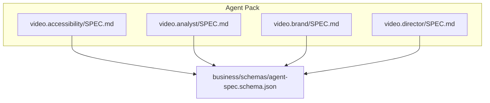
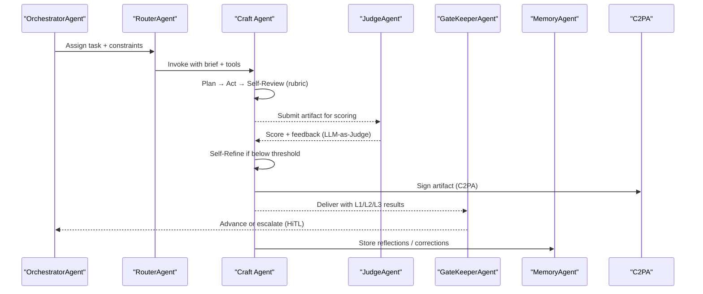
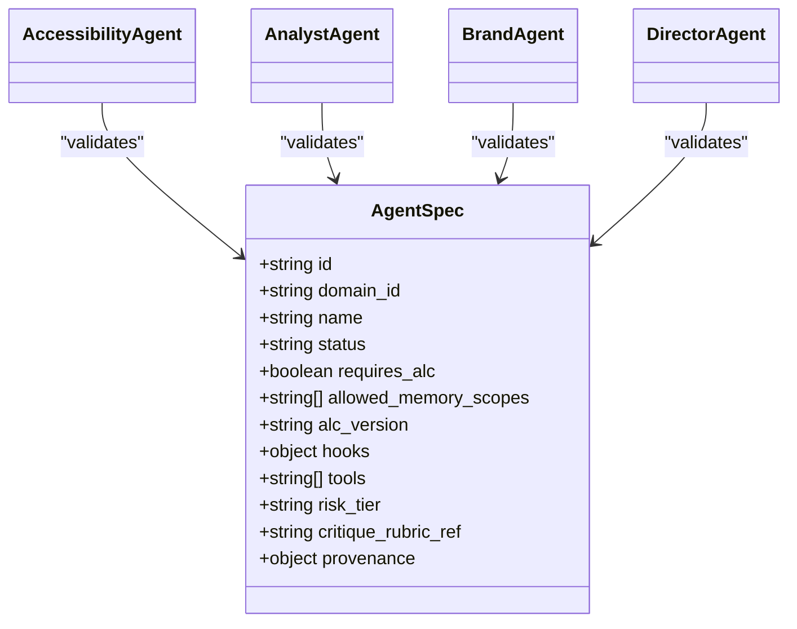

# Agent Documentation Format

<cite>
**Referenced Files in This Document**
- [SPEC.md (AccessibilityAgent)](file://business/video/agents/video.accessibility/SPEC.md)
- [SPEC.md (AnalystAgent)](file://business/video/agents/video.analyst/SPEC.md)
- [SPEC.md (BrandAgent)](file://business/video/agents/video.brand/SPEC.md)
- [SPEC.md (DirectorAgent)](file://business/video/agents/video.director/SPEC.md)
- [agent-spec.schema.json](file://business/schemas/agent-spec.schema.json)
</cite>

## Table of Contents
1. [Introduction](#introduction)
2. [Project Structure](#project-structure)
3. [Core Components](#core-components)
4. [Architecture Overview](#architecture-overview)
5. [Detailed Component Analysis](#detailed-component-analysis)
6. [Dependency Analysis](#dependency-analysis)
7. [Performance Considerations](#performance-considerations)
8. [Troubleshooting Guide](#troubleshooting-guide)
9. [Conclusion](#conclusion)
10. [Appendices](#appendices)

## Introduction
This document defines the SPEC.md format used by agents in this repository and explains how to author effective agent documentation. It covers required sections, prompt engineering patterns, evaluation rubrics structure, knowledge source organization, integration details, and best practices illustrated with video production agents. The goal is to enable consistent, machine-readable, and human-friendly agent specifications that support orchestration, evaluation, and continuous improvement.

## Project Structure
Each agent lives under a dedicated folder with a top-level SPEC.md that serves as the canonical definition. A JSON schema validates core metadata fields for registry and runtime safety.

**Diagram sources**
- [SPEC.md (AccessibilityAgent)](file://business/video/agents/video.accessibility/SPEC.md)
- [SPEC.md (AnalystAgent)](file://business/video/agents/video.analyst/SPEC.md)
- [SPEC.md (BrandAgent)](file://business/video/agents/video.brand/SPEC.md)
- [SPEC.md (DirectorAgent)](file://business/video/agents/video.director/SPEC.md)
- [agent-spec.schema.json](file://business/schemas/agent-spec.schema.json)

**Section sources**
- [SPEC.md (AccessibilityAgent)](file://business/video/agents/video.accessibility/SPEC.md)
- [SPEC.md (AnalystAgent)](file://business/video/agents/video.analyst/SPEC.md)
- [SPEC.md (BrandAgent)](file://business/video/agents/video.brand/SPEC.md)
- [SPEC.md (DirectorAgent)](file://business/video/agents/video.director/SPEC.md)
- [agent-spec.schema.json](file://business/schemas/agent-spec.schema.json)

## Core Components
A SPEC.md must include the following sections:

- Identity
  - Unique identifiers and routing keys (e.g., va_id, pack_id, domain_id, category, folder). These map to registry entries and tool permissions.
- Responsibility
  - One-sentence scope statement describing what the agent owns.
- Knowledge Distillation Sources
  - Licensed or consented corpora, references, and datasets used to ground the agent’s behavior.
- Self-Quality Criteria
  - Measurable success criteria (L1 spec, L2 rubric, L3 preference) tied to craft standards and benchmarks.
- Surpass-Human Signal
  - Pre-registered evidence or thresholds demonstrating parity or superiority over human baselines.
- Critique Bus
  - Who can critique this agent and what topics it comments on; severity model and escalation paths.
- Tools (Design-Time Documentation)
  - External APIs, validators, and DCC bridges intended for use; runtime safety notes clarify allow-lists and stubs.
- Architecture Pattern
  - Reasoning loop(s): Self-Refine, Reflexion, Constitutional AI, Multi-agent debate, ReAct, Agentic Graph, DSPy/OPRO.
- Common Structure of an AI Agent
  - Shared architecture diagram, component reference table, universal critique message schema, and composition diagram.
- References
  - Foundational papers, evaluation benchmarks, tool landscape, and infrastructure standards.

These components ensure each agent is self-contained, auditable, and interoperable within the multi-agent graph.

**Section sources**
- [SPEC.md (AccessibilityAgent)](file://business/video/agents/video.accessibility/SPEC.md)
- [SPEC.md (AnalystAgent)](file://business/video/agents/video.analyst/SPEC.md)
- [SPEC.md (BrandAgent)](file://business/video/agents/video.brand/SPEC.md)
- [SPEC.md (DirectorAgent)](file://business/video/agents/video.director/SPEC.md)

## Architecture Overview
The common agent architecture integrates orchestration, input contracts, knowledge/tool surfaces, internal plan-act-self-review loops, provenance controls, three-layer quality gates, peer critique, human-in-the-loop escalation, and continuous learning.

**Diagram sources**
- [SPEC.md (DirectorAgent)](file://business/video/agents/video.director/SPEC.md)
- [SPEC.md (BrandAgent)](file://business/video/agents/video.brand/SPEC.md)
- [SPEC.md (AccessibilityAgent)](file://business/video/agents/video.accessibility/SPEC.md)
- [SPEC.md (AnalystAgent)](file://business/video/agents/video.analyst/SPEC.md)

## Detailed Component Analysis

### Prompt Engineering Patterns
- Constitutional AI: Agents follow written constitutions/rubrics to self-critique and revise outputs without external labels.
- Self-Refine: Draft → judge against rubric → iterate up to a bounded number of times.
- Reflexion: Verbal self-feedback stored in episodic memory to improve subsequent decisions.
- ReAct: Interleaved reasoning traces with tool-use actions for grounded decisions.
- LLM-as-Judge: Frozen judges score outputs against pre-registered rubrics.
- Pairwise Preference (Arena): Blind comparisons between agent output and human baseline.
- Agentic Graph: DAG orchestration with handoffs, review gates, and human escalations.
- DSPy/OPRO: Meta-optimization of prompts and pipelines.

Best practices:
- Keep constitutions concise, role-specific, and measurable.
- Pin judge models and rubric versions for reproducibility.
- Limit Self-Refine iterations to control cost and latency.
- Log all critiques and artifacts for provenance and auditability.

**Section sources**
- [SPEC.md (DirectorAgent)](file://business/video/agents/video.director/SPEC.md)
- [SPEC.md (BrandAgent)](file://business/video/agents/video.brand/SPEC.md)
- [SPEC.md (AccessibilityAgent)](file://business/video/agents/video.accessibility/SPEC.md)
- [SPEC.md (AnalystAgent)](file://business/video/agents/video.analyst/SPEC.md)

### Evaluation Rubrics Structure
Rubrics should be explicit, role-specific, and testable across three layers:
- L1 Spec: Deterministic checks (schema validation, codec/format specs, loudness targets).
- L2 Rubric: Craft-focused scoring via LLM-as-Judge with a constitution; pass thresholds defined per role.
- L3 Preference: Audience-style pairwise comparison with simulated personas and HiTL samples; win-rate thresholds define parity vs surpass.

Include:
- Scoring dimensions and weights.
- Evidence requirements (timecodes, diffs, metrics).
- Escalation rules when scores are below thresholds.

**Section sources**
- [SPEC.md (DirectorAgent)](file://business/video/agents/video.director/SPEC.md)
- [SPEC.md (BrandAgent)](file://business/video/agents/video.brand/SPEC.md)
- [SPEC.md (AccessibilityAgent)](file://business/video/agents/video.accessibility/SPEC.md)
- [SPEC.md (AnalystAgent)](file://business/video/agents/video.analyst/SPEC.md)

### Knowledge Source Organization
Organize knowledge into:
- Primary corpora: licensed archives, academic papers, expert interviews.
- Secondary references: style guides, standards, playbooks.
- Runtime context: project-specific overrides merged at runtime.
- Continuous distillation: periodic refresh from new data and post-launch telemetry.

Guidelines:
- Prefer consented and licensed sources.
- Maintain versioned references and update cadence.
- Separate global knowledge from project-specific overrides.

**Section sources**
- [SPEC.md (DirectorAgent)](file://business/video/agents/video.director/SPEC.md)
- [SPEC.md (BrandAgent)](file://business/video/agents/video.brand/SPEC.md)
- [SPEC.md (AccessibilityAgent)](file://business/video/agents/video.accessibility/SPEC.md)
- [SPEC.md (AnalystAgent)](file://business/video/agents/video.analyst/SPEC.md)

### Integration Details
- Orchestration: Register agents in a DAG; Planner decomposes briefs; Orchestrator executes; Router selects agent-model pairs.
- Tool Access: Use MCP-based bridges to DCC and external APIs; enforce allow-lists and permission registers.
- Provenance: Sign every artifact with C2PA; append accepted critiques to manifests.
- Memory: Episodic and long-term storage via vector DB; store verbal feedback and correction events.
- Human Gates: Escalate for consent, legal sign-off, ratings, festival eligibility, crisis comms, and cross-cultural sensitivity.

**Section sources**
- [SPEC.md (DirectorAgent)](file://business/video/agents/video.director/SPEC.md)
- [SPEC.md (BrandAgent)](file://business/video/agents/video.brand/SPEC.md)
- [SPEC.md (AccessibilityAgent)](file://business/video/agents/video.accessibility/SPEC.md)
- [SPEC.md (AnalystAgent)](file://business/video/agents/video.analyst/SPEC.md)

### Writing Effective Agent Instructions
- Start with a clear Responsibility statement.
- Define Self-Quality Criteria with measurable thresholds.
- Specify Surpass-Human Signals with benchmark references.
- Enumerate Tools with design-time names and runtime safety notes.
- Choose an Architecture Pattern aligned to the task (Self-Refine, ReAct, Constitutional AI, etc.).
- Provide a Critique Bus mapping peers and topics.
- Include References to foundational papers, benchmarks, and standards.

**Section sources**
- [SPEC.md (DirectorAgent)](file://business/video/agents/video.director/SPEC.md)
- [SPEC.md (BrandAgent)](file://business/video/agents/video.brand/SPEC.md)
- [SPEC.md (AccessibilityAgent)](file://business/video/agents/video.accessibility/SPEC.md)
- [SPEC.md (AnalystAgent)](file://business/video/agents/video.analyst/SPEC.md)

### Defining Success Criteria
- L1: 100% deterministic pass rate on technical specs.
- L2: Rubric score ≥ threshold with bounded Self-Refine iterations.
- L3: Pairwise win-rate ≥ parity threshold; surpass threshold indicates superior performance.
- Surpass-Human: Benchmarks, arena preference, speed × quality, defect rates, certification passes.

**Section sources**
- [SPEC.md (DirectorAgent)](file://business/video/agents/video.director/SPEC.md)
- [SPEC.md (BrandAgent)](file://business/video/agents/video.brand/SPEC.md)
- [SPEC.md (AccessibilityAgent)](file://business/video/agents/video.accessibility/SPEC.md)
- [SPEC.md (AnalystAgent)](file://business/video/agents/video.analyst/SPEC.md)

### Organizing Reference Materials
- Group by type: foundational papers, evaluation benchmarks, tool landscape, infrastructure standards.
- Annotate key contributions and links.
- Keep references current and versioned.

**Section sources**
- [SPEC.md (DirectorAgent)](file://business/video/agents/video.director/SPEC.md)
- [SPEC.md (BrandAgent)](file://business/video/agents/video.brand/SPEC.md)
- [SPEC.md (AccessibilityAgent)](file://business/video/agents/video.accessibility/SPEC.md)
- [SPEC.md (AnalystAgent)](file://business/video/agents/video.analyst/SPEC.md)

### Examples from Video Production Agents
- AccessibilityAgent: Uses constitutional AI with accessibility constitution; focuses on caption accuracy, AD completeness, contrast compliance, and release-readiness.
- AnalystAgent: Applies ReAct over telemetry and regression analysis; emphasizes KPI completeness and insight-to-action turnaround.
- BrandAgent: Enforces brand voice and visual consistency via Self-Refine against a brand constitution.
- DirectorAgent: Owns vision and pacing; uses Self-Refine + LLM-as-Judge with genre priors; sets robust surpass-human signals.

These examples demonstrate consistent section usage, clear rubrics, and well-defined integration points.

**Section sources**
- [SPEC.md (AccessibilityAgent)](file://business/video/agents/video.accessibility/SPEC.md)
- [SPEC.md (AnalystAgent)](file://business/video/agents/video.analyst/SPEC.md)
- [SPEC.md (BrandAgent)](file://business/video/agents/video.brand/SPEC.md)
- [SPEC.md (DirectorAgent)](file://business/video/agents/video.director/SPEC.md)

## Dependency Analysis
Agent specifications depend on shared orchestration and governance components. The schema enforces identity, status, memory scopes, and tool access metadata.

**Diagram sources**
- [agent-spec.schema.json](file://business/schemas/agent-spec.schema.json)
- [SPEC.md (AccessibilityAgent)](file://business/video/agents/video.accessibility/SPEC.md)
- [SPEC.md (AnalystAgent)](file://business/video/agents/video.analyst/SPEC.md)
- [SPEC.md (BrandAgent)](file://business/video/agents/video.brand/SPEC.md)
- [SPEC.md (DirectorAgent)](file://business/video/agents/video.director/SPEC.md)

**Section sources**
- [agent-spec.schema.json](file://business/schemas/agent-spec.schema.json)
- [SPEC.md (AccessibilityAgent)](file://business/video/agents/video.accessibility/SPEC.md)
- [SPEC.md (AnalystAgent)](file://business/video/agents/video.analyst/SPEC.md)
- [SPEC.md (BrandAgent)](file://business/video/agents/video.brand/SPEC.md)
- [SPEC.md (DirectorAgent)](file://business/video/agents/video.director/SPEC.md)

## Performance Considerations
- Constrain Self-Refine iterations to balance quality and cost.
- Pin judge models and rubric versions to reduce variance.
- Use parallelization and caching where possible (e.g., batch rendering, speculative decoding).
- Monitor latency and throughput; optimize routing based on cost-quality frontiers.
- Track regressions continuously with evaluation harnesses.

[No sources needed since this section provides general guidance]

## Troubleshooting Guide
Common issues and resolutions:
- Missing environment variables for LLM clients: Ensure API keys and model settings are configured; provide .env resolution guidance.
- Invalid URLs or timeouts during source fetching: Validate schemes and hosts; split connect/read timeouts; handle failures gracefully.
- Empty or malformed curated sources: Implement fallback heuristics to recover URLs and continue workflow.
- Phase prerequisites not met: Print explicit messages instructing users to resume from earlier phases.
- Auto-mode interactions: Avoid blocking input calls; default selections should be safe and deterministic.

**Section sources**
- [SPEC.md (AnalystAgent)](file://business/video/agents/video.analyst/SPEC.md)

## Conclusion
The SPEC.md format standardizes agent definitions across domains, enabling consistent orchestration, evaluation, and continuous improvement. By adhering to the required sections, adopting proven prompt engineering patterns, structuring rubrics rigorously, organizing knowledge sources responsibly, and integrating with shared infrastructure, teams can build reliable, high-performing agents—illustrated here through video production examples.

[No sources needed since this section summarizes without analyzing specific files]

## Appendices

### Appendix A: Universal CritiqueMessage Schema
Use a consistent JSON structure for inter-agent critiques, including severity, category, evidence, suggested action, rubric reference, and resolution deadlines.

**Section sources**
- [SPEC.md (DirectorAgent)](file://business/video/agents/video.director/SPEC.md)
- [SPEC.md (BrandAgent)](file://business/video/agents/video.brand/SPEC.md)
- [SPEC.md (AccessibilityAgent)](file://business/video/agents/video.accessibility/SPEC.md)
- [SPEC.md (AnalystAgent)](file://business/video/agents/video.analyst/SPEC.md)