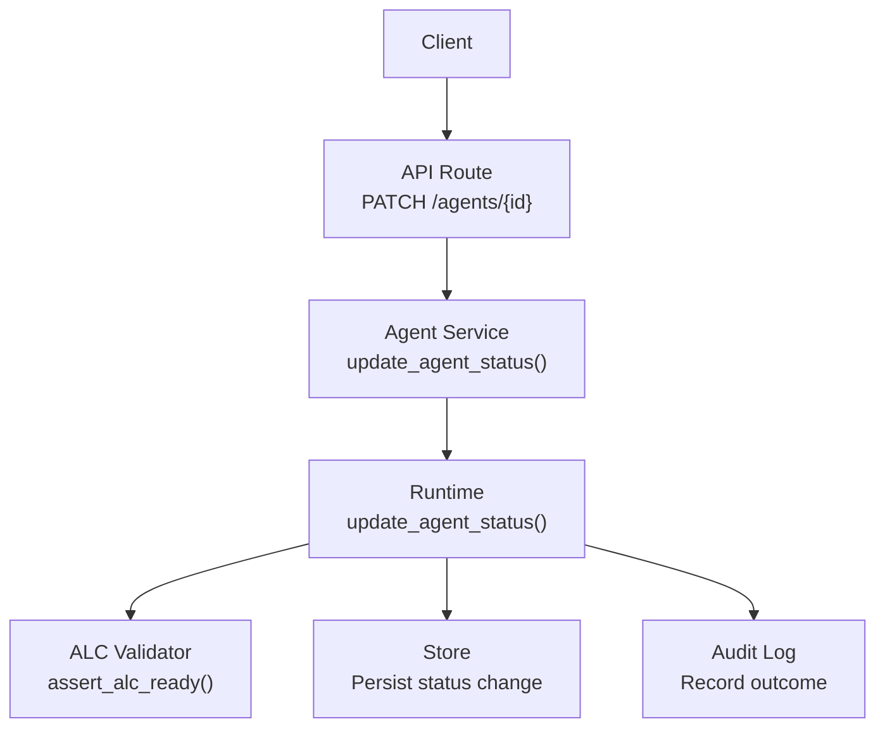
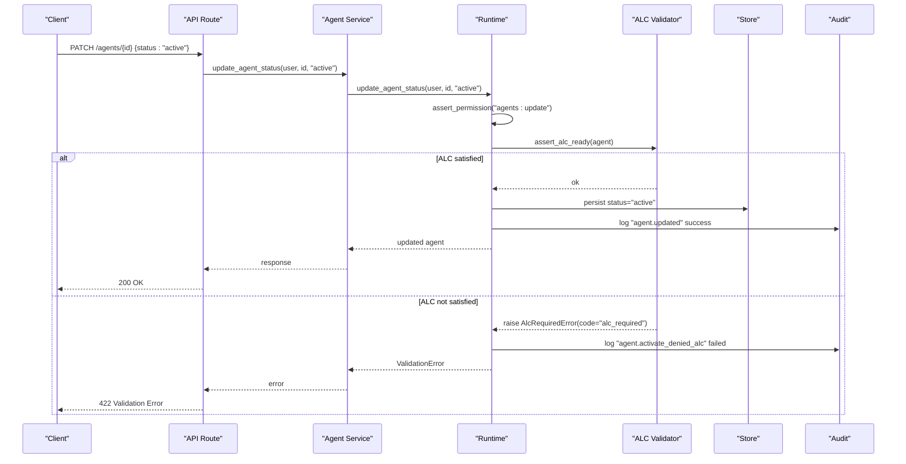
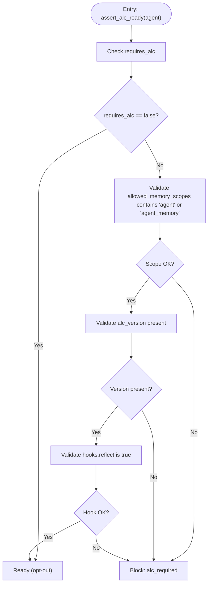
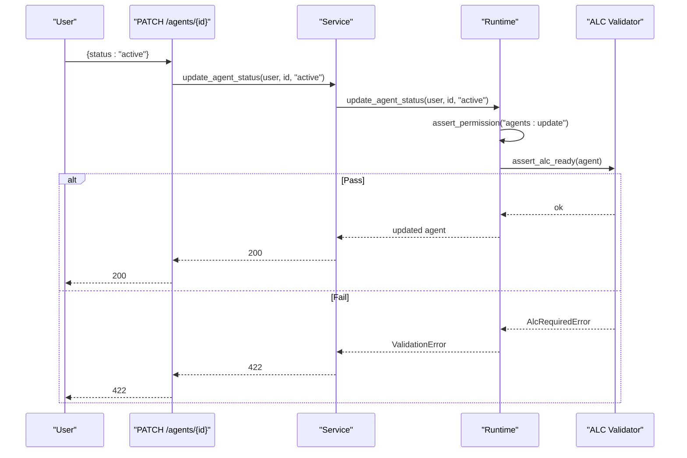

# ALC Activation Gates

<cite>
**Referenced Files in This Document**
- [agents.py](file://backend/app/api/v1/routes/agents.py)
- [agent_service.py](file://backend/app/services/agent_service.py)
- [runtime.py](file://backend/app/runtime.py)
- [alc_validator.py](file://backend/app/infrastructure/governance/alc_validator.py)
- [test_alc_and_domains.py](file://backend/app/tests/unit/test_alc_and_domains.py)
</cite>

## Table of Contents
1. [Introduction](#introduction)
2. [Project Structure](#project-structure)
3. [Core Components](#core-components)
4. [Architecture Overview](#architecture-overview)
5. [Detailed Component Analysis](#detailed-component-analysis)
6. [Dependency Analysis](#dependency-analysis)
7. [Performance Considerations](#performance-considerations)
8. [Troubleshooting Guide](#troubleshooting-guide)
9. [Conclusion](#conclusion)

## Introduction
This document explains the Autonomous Learning Capability (ALC) activation gates, approval workflows, and governance policies that control when an agent can transition to active state with autonomous learning enabled. It covers:
- When ALC is required for activation
- Approval criteria and safety checks enforced before enabling autonomous learning
- The update_agent_status API behavior for transitioning to active state
- How errors are surfaced and audited when ALC requirements are not met

## Project Structure
The ALC activation gate spans a small set of components:
- API route handling PATCH requests to update agent status
- Service layer forwarding calls to runtime
- Runtime enforcing permissions and invoking ALC readiness checks
- ALC validator implementing policy rules and raising explicit errors when requirements are missing

**Diagram sources**
- [agents.py:28-30](file://backend/app/api/v1/routes/agents.py#L28-L30)
- [agent_service.py:16-17](file://backend/app/services/agent_service.py#L16-L17)
- [runtime.py:1346-1372](file://backend/app/runtime.py#L1346-L1372)
- [alc_validator.py:43-49](file://backend/app/infrastructure/governance/alc_validator.py#L43-L49)

**Section sources**
- [agents.py:1-48](file://backend/app/api/v1/routes/agents.py#L1-L48)
- [agent_service.py:1-30](file://backend/app/services/agent_service.py#L1-L30)
- [runtime.py:1346-1372](file://backend/app/runtime.py#L1346-L1372)
- [alc_validator.py:1-50](file://backend/app/infrastructure/governance/alc_validator.py#L1-L50)

## Core Components
- API Layer: Exposes PATCH /agents/{agent_id} to update status; forwards to service layer.
- Service Layer: Thin wrapper delegating to runtime.update_agent_status.
- Runtime: Enforces RBAC permission, performs ALC readiness check when status is "active", persists changes, and records audit events.
- ALC Validator: Encapsulates policy logic determining whether an agent satisfies ALC requirements.

Key responsibilities:
- Permission enforcement before any state mutation
- Conditional gating on "active" transitions based on ALC policy
- Clear error signaling via AlcRequiredError with code "alc_required"
- Auditing both successful updates and denied activations due to ALC

**Section sources**
- [agents.py:28-30](file://backend/app/api/v1/routes/agents.py#L28-L30)
- [agent_service.py:16-17](file://backend/app/services/agent_service.py#L16-L17)
- [runtime.py:1346-1372](file://backend/app/runtime.py#L1346-L1372)
- [alc_validator.py:7-15](file://backend/app/infrastructure/governance/alc_validator.py#L7-L15)
- [alc_validator.py:17-40](file://backend/app/infrastructure/governance/alc_validator.py#L17-L40)
- [alc_validator.py:43-49](file://backend/app/infrastructure/governance/alc_validator.py#L43-L49)

## Architecture Overview
End-to-end flow for activating an agent with ALC enabled:

**Diagram sources**
- [agents.py:28-30](file://backend/app/api/v1/routes/agents.py#L28-L30)
- [agent_service.py:16-17](file://backend/app/services/agent_service.py#L16-L17)
- [runtime.py:1346-1372](file://backend/app/runtime.py#L1346-L1372)
- [alc_validator.py:43-49](file://backend/app/infrastructure/governance/alc_validator.py#L43-L49)

## Detailed Component Analysis

### ALC Readiness Policy
An agent must satisfy all of the following to be considered ready for activation under ALC:
- requires_alc flag semantics:
  - If explicitly False, ALC is not required (legacy/platform seed opt-out).
  - If True or absent, default behavior applies per implementation.
- allowed_memory_scopes must include either "agent" or "agent_memory".
- alc_version must be present.
- hooks.reflect must be true (explicitly set to true; if omitted but requires_alc is true, defaults to true per policy notes).

If any condition fails, activation is blocked and an error with code "alc_required" is raised.

**Diagram sources**
- [alc_validator.py:17-40](file://backend/app/infrastructure/governance/alc_validator.py#L17-L40)
- [alc_validator.py:43-49](file://backend/app/infrastructure/governance/alc_validator.py#L43-L49)

**Section sources**
- [alc_validator.py:17-40](file://backend/app/infrastructure/governance/alc_validator.py#L17-L40)
- [alc_validator.py:43-49](file://backend/app/infrastructure/governance/alc_validator.py#L43-L49)

### Update Agent Status API Flow
- Endpoint: PATCH /agents/{agent_id}
- Request body includes status field; setting it to "active" triggers ALC gate.
- Permissions: Requires agents:update.
- On success: status persisted and audit event recorded.
- On failure due to ALC: audit event "agent.activate_denied_alc" recorded and validation error returned.

**Diagram sources**
- [agents.py:28-30](file://backend/app/api/v1/routes/agents.py#L28-L30)
- [agent_service.py:16-17](file://backend/app/services/agent_service.py#L16-L17)
- [runtime.py:1346-1372](file://backend/app/runtime.py#L1346-L1372)
- [alc_validator.py:43-49](file://backend/app/infrastructure/governance/alc_validator.py#L43-L49)

**Section sources**
- [agents.py:28-30](file://backend/app/api/v1/routes/agents.py#L28-L30)
- [agent_service.py:16-17](file://backend/app/services/agent_service.py#L16-L17)
- [runtime.py:1346-1372](file://backend/app/runtime.py#L1346-L1372)

### Governance Policies and Safety Checks
- Permission gating: Only users with agents:update may attempt activation.
- ALC readiness: Enforced only when transitioning to "active"; other statuses bypass this gate.
- Auditability: Both successful updates and denied activations are logged with distinct event names.
- Error signaling: Errors carry a machine-readable code "alc_required" to guide clients and operators.

Operational implications:
- Ensure agents intended for production have requires_alc=true, alc_version set, appropriate memory scopes, and hooks.reflect=true.
- Legacy or platform seed agents can opt out by setting requires_alc=false.

**Section sources**
- [runtime.py:1346-1372](file://backend/app/runtime.py#L1346-L1372)
- [alc_validator.py:7-15](file://backend/app/infrastructure/governance/alc_validator.py#L7-L15)
- [alc_validator.py:17-40](file://backend/app/infrastructure/governance/alc_validator.py#L17-L40)

### Approval Workflows
- The current implementation enforces a deterministic policy gate rather than a multi-step human approval workflow at activation time.
- Operators should use governance processes outside the system (e.g., review boards) to ensure agents meet ALC prerequisites before calling the activation endpoint.
- Audit logs provide traceability for activation attempts and denials.

[No sources needed since this section provides general guidance]

## Dependency Analysis
High-level dependencies among components involved in ALC activation:

**Diagram sources**
- [agents.py:28-30](file://backend/app/api/v1/routes/agents.py#L28-L30)
- [agent_service.py:16-17](file://backend/app/services/agent_service.py#L16-L17)
- [runtime.py:1346-1372](file://backend/app/runtime.py#L1346-L1372)
- [alc_validator.py:43-49](file://backend/app/infrastructure/governance/alc_validator.py#L43-L49)

**Section sources**
- [agents.py:1-48](file://backend/app/api/v1/routes/agents.py#L1-L48)
- [agent_service.py:1-30](file://backend/app/services/agent_service.py#L1-L30)
- [runtime.py:1346-1372](file://backend/app/runtime.py#L1346-L1372)
- [alc_validator.py:1-50](file://backend/app/infrastructure/governance/alc_validator.py#L1-L50)

## Performance Considerations
- ALC readiness checks are lightweight validations over in-memory agent attributes; overhead is minimal.
- The gate runs only during "active" transitions, avoiding unnecessary checks for other status updates.
- Auditing writes occur after persistence; consider batching or async logging if high throughput is expected.

[No sources needed since this section provides general guidance]

## Troubleshooting Guide
Common issues and resolutions:
- Error code "alc_required": Indicates missing ALC bindings. Verify:
  - requires_alc is true (or absent), alc_version is set, allowed_memory_scopes includes "agent" or "agent_memory", and hooks.reflect is true.
- Permission denied: Ensure the caller has agents:update permission.
- Audit investigation: Look for events "agent.updated" (success) and "agent.activate_denied_alc" (failure) to diagnose activation outcomes.

Relevant tests demonstrate expected behavior for activation denial and success paths.

**Section sources**
- [alc_validator.py:7-15](file://backend/app/infrastructure/governance/alc_validator.py#L7-L15)
- [alc_validator.py:17-40](file://backend/app/infrastructure/governance/alc_validator.py#L17-L40)
- [runtime.py:1346-1372](file://backend/app/runtime.py#L1346-L1372)
- [test_alc_and_domains.py:79-98](file://backend/app/tests/unit/test_alc_and_domains.py#L79-L98)

## Conclusion
The ALC activation gate ensures that only agents meeting defined learning contracts can be activated. The policy is enforced at the runtime layer with clear error signaling and comprehensive auditing. Operators should prepare agents by satisfying ALC prerequisites and using governance processes to approve readiness before invoking the activation API.