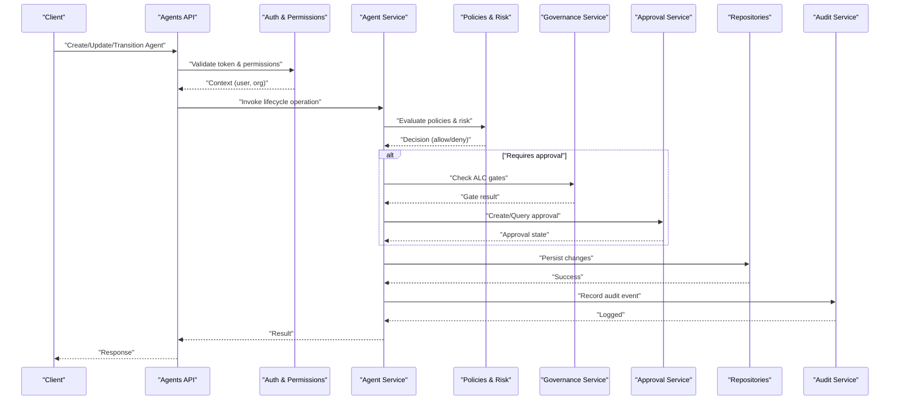
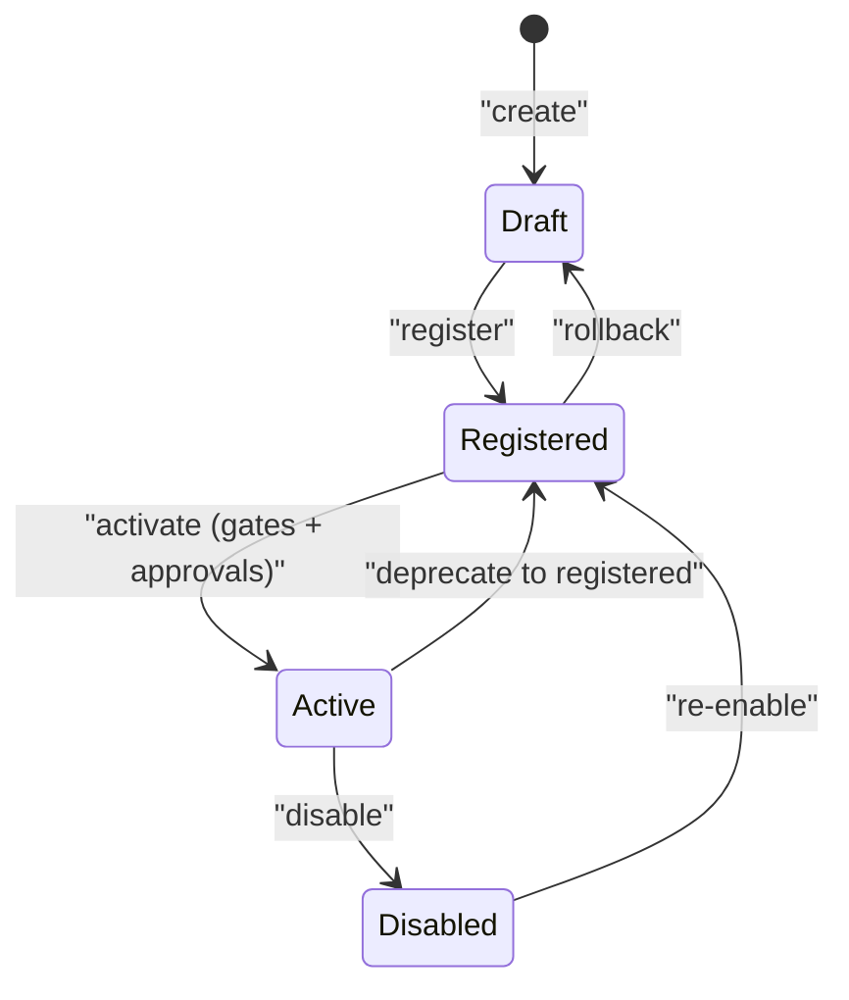
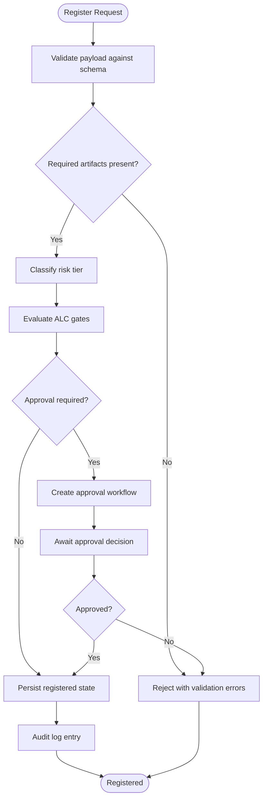
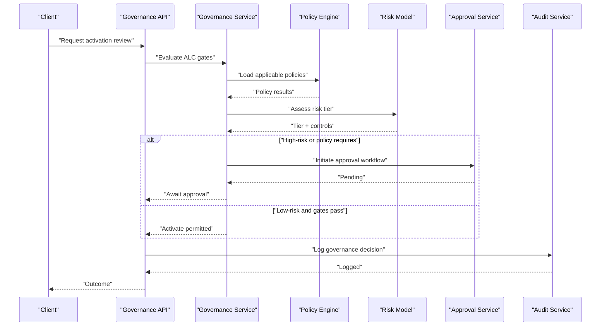
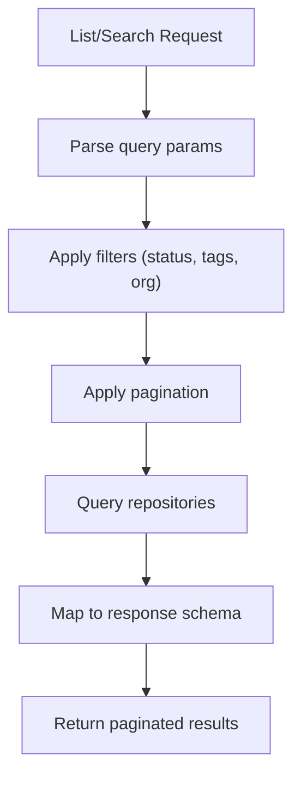
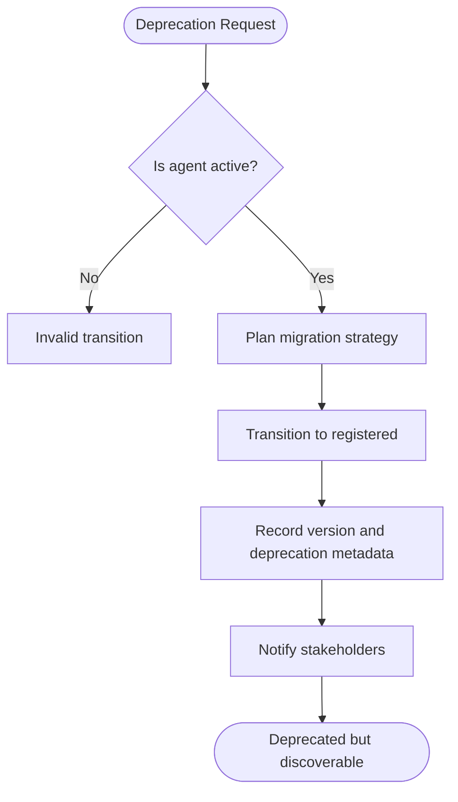
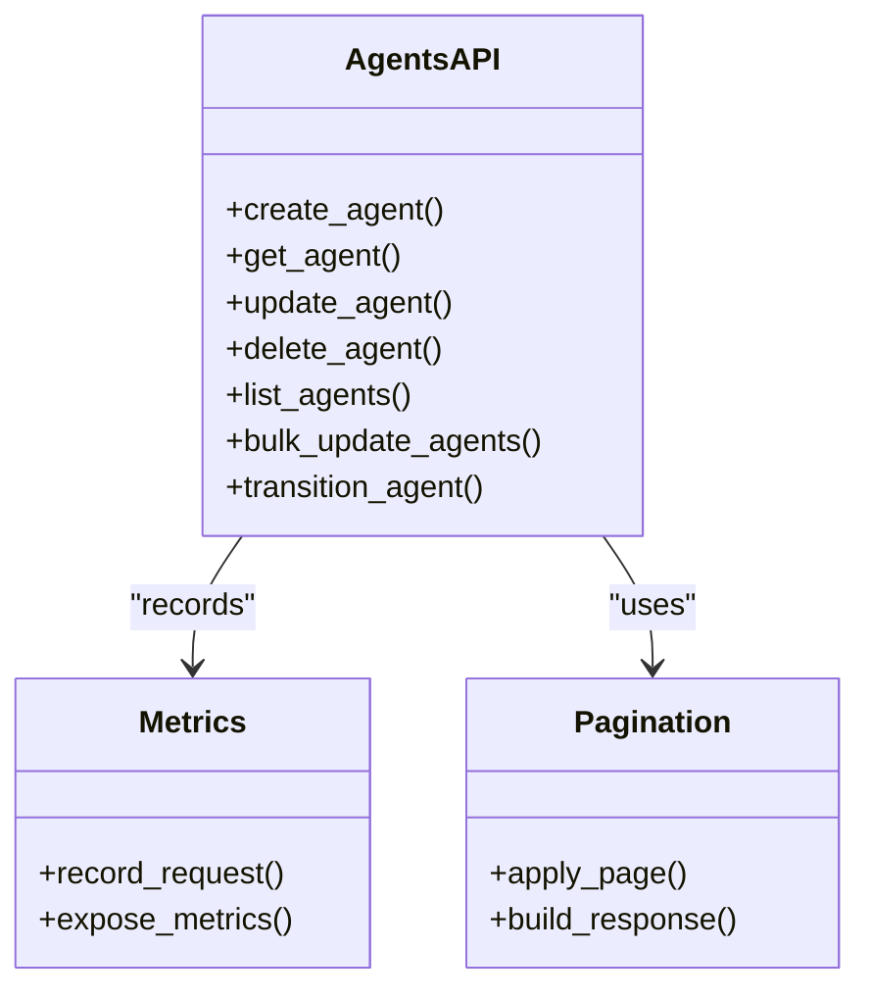
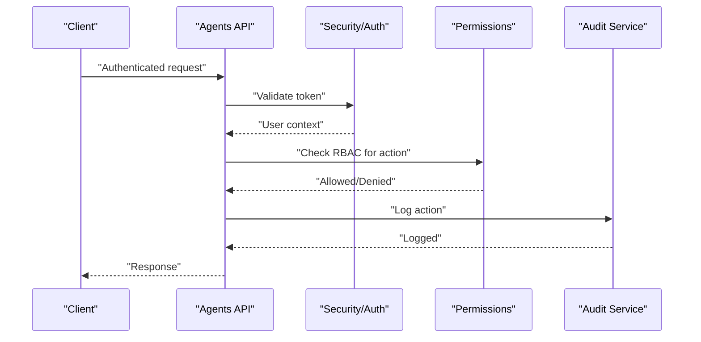
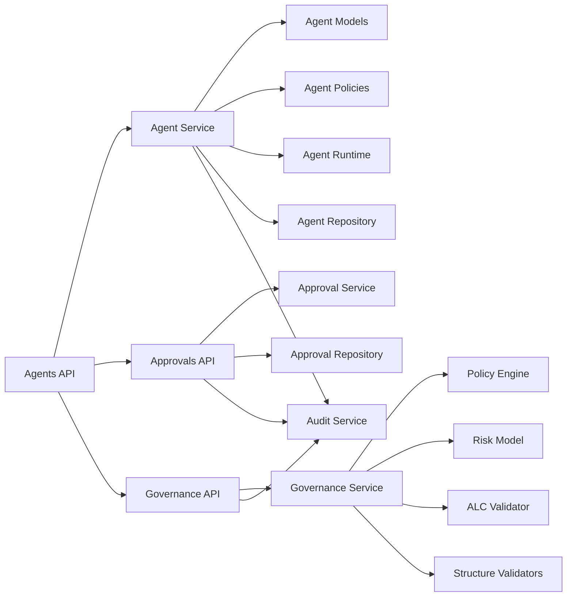

# Agent Lifecycle Management

<cite>
**Referenced Files in This Document**
- [agents.py](file://backend/app/api/v1/routes/agents.py)
- [models.py](file://backend/app/domain/agents/models.py)
- [policies.py](file://backend/app/domain/agents/policies.py)
- [runtime.py](file://backend/app/domain/agents/runtime.py)
- [agent_repository.py](file://backend/app/infrastructure/repositories/agent_repository.py)
- [agents.py](file://backend/app/schemas/agents.py)
- [agent_service.py](file://backend/app/services/agent_service.py)
- [governance.py](file://backend/app/api/v1/routes/governance.py)
- [models.py](file://backend/app/domain/governance/models.py)
- [policy_engine.py](file://backend/app/domain/governance/policy_engine.py)
- [risk.py](file://backend/app/domain/governance/risk.py)
- [alc_validator.py](file://backend/app/infrastructure/governance/alc_validator.py)
- [structure_validators.py](file://backend/app/infrastructure/governance/structure_validators.py)
- [governance.py](file://backend/app/schemas/governance.py)
- [governance_service.py](file://backend/app/services/governance_service.py)
- [approvals.py](file://backend/app/api/v1/routes/approvals.py)
- [models.py](file://backend/app/domain/approvals/models.py)
- [service.py](file://backend/app/domain/approvals/service.py)
- [approval_repository.py](file://backend/app/infrastructure/repositories/approval_repository.py)
- [approvals.py](file://backend/app/schemas/approvals.py)
- [approval_service.py](file://backend/app/services/approval_service.py)
- [security.py](file://backend/app/core/security.py)
- [permissions.py](file://backend/app/core/permissions.py)
- [auth.py](file://backend/app/core/auth.py)
- [audit_logs.py](file://backend/app/schemas/audit_logs.py)
- [audit_service.py](file://backend/app/services/audit_service.py)
- [metrics.py](file://backend/app/core/metrics.py)
- [pagination.py](file://backend/app/core/pagination.py)
</cite>

## Table of Contents
1. [Introduction](#introduction)
2. [Project Structure](#project-structure)
3. [Core Components](#core-components)
4. [Architecture Overview](#architecture-overview)
5. [Detailed Component Analysis](#detailed-component-analysis)
6. [Dependency Analysis](#dependency-analysis)
7. [Performance Considerations](#performance-considerations)
8. [Troubleshooting Guide](#troubleshooting-guide)
9. [Conclusion](#conclusion)
10. [Appendices](#appendices)

## Introduction
This document explains the end-to-end lifecycle management of agents, from creation to retirement. It covers registration, status transitions (draft, registered, active, disabled), activation gates and approval workflows, governance policies, discovery mechanisms, versioning strategies, deprecation handling, API endpoints for CRUD and bulk operations, monitoring capabilities, security considerations, permission models, and audit logging. The content is grounded in the repository’s backend implementation across domain, services, infrastructure, schemas, and API routes.

## Project Structure
The agent lifecycle spans multiple layers:
- API layer exposes REST endpoints for agents, approvals, and governance.
- Service layer orchestrates business logic and cross-cutting concerns.
- Domain layer defines models, policies, runtime state, and governance rules.
- Infrastructure provides persistence, validation, and integrations.
- Schemas define request/response contracts.
- Core modules provide security, permissions, metrics, pagination, and audit utilities.

```mermaid
graph TB
subgraph "API Layer"
A1["Agents Routes<br/>agents.py"]
A2["Approvals Routes<br/>approvals.py"]
A3["Governance Routes<br/>governance.py"]
end
subgraph "Service Layer"
S1["Agent Service<br/>agent_service.py"]
S2["Approval Service<br/>approval_service.py"]
S3["Governance Service<br/>governance_service.py"]
S4["Audit Service<br/>audit_service.py"]
end
subgraph "Domain Layer"
D1["Agent Models<br/>domain/agents/models.py"]
D2["Agent Policies<br/>domain/agents/policies.py"]
D3["Agent Runtime<br/>domain/agents/runtime.py"]
D4["Governance Models<br/>domain/governance/models.py"]
D5["Policy Engine<br/>domain/governance/policy_engine.py"]
D6["Risk Model<br/>domain/governance/risk.py"]
D7["Approval Models & Service<br/>domain/approvals/*"]
end
subgraph "Infrastructure"
I1["Agent Repository<br/>repositories/agent_repository.py"]
I2["Approval Repository<br/>repositories/approval_repository.py"]
I3["ALC Validator<br/>governance/alc_validator.py"]
I4["Structure Validators<br/>governance/structure_validators.py"]
end
subgraph "Schemas"
SC1["Agent Schemas<br/>schemas/agents.py"]
SC2["Approval Schemas<br/>schemas/approvals.py"]
SC3["Governance Schemas<br/>schemas/governance.py"]
SC4["Audit Logs Schema<br/>schemas/audit_logs.py"]
end
subgraph "Core"
C1["Security & Auth<br/>core/security.py, core/auth.py"]
C2["Permissions<br/>core/permissions.py"]
C3["Metrics<br/>core/metrics.py"]
C4["Pagination<br/>core/pagination.py"]
end
A1 --> S1
A2 --> S2
A3 --> S3
S1 --> D1
S1 --> D2
S1 --> D3
S1 --> I1
S2 --> D7
S2 --> I2
S3 --> D4
S3 --> D5
S3 --> D6
S3 --> I3
S3 --> I4
S1 --> SC1
S2 --> SC2
S3 --> SC3
S4 --> SC4
A1 --> C1
A1 --> C2
A1 --> C3
A1 --> C4
```

**Diagram sources**
- [agents.py](file://backend/app/api/v1/routes/agents.py)
- [approvals.py](file://backend/app/api/v1/routes/approvals.py)
- [governance.py](file://backend/app/api/v1/routes/governance.py)
- [agent_service.py](file://backend/app/services/agent_service.py)
- [approval_service.py](file://backend/app/services/approval_service.py)
- [governance_service.py](file://backend/app/services/governance_service.py)
- [audit_service.py](file://backend/app/services/audit_service.py)
- [models.py](file://backend/app/domain/agents/models.py)
- [policies.py](file://backend/app/domain/agents/policies.py)
- [runtime.py](file://backend/app/domain/agents/runtime.py)
- [models.py](file://backend/app/domain/governance/models.py)
- [policy_engine.py](file://backend/app/domain/governance/policy_engine.py)
- [risk.py](file://backend/app/domain/governance/risk.py)
- [models.py](file://backend/app/domain/approvals/models.py)
- [service.py](file://backend/app/domain/approvals/service.py)
- [agent_repository.py](file://backend/app/infrastructure/repositories/agent_repository.py)
- [approval_repository.py](file://backend/app/infrastructure/repositories/approval_repository.py)
- [alc_validator.py](file://backend/app/infrastructure/governance/alc_validator.py)
- [structure_validators.py](file://backend/app/infrastructure/governance/structure_validators.py)
- [agents.py](file://backend/app/schemas/agents.py)
- [approvals.py](file://backend/app/schemas/approvals.py)
- [governance.py](file://backend/app/schemas/governance.py)
- [audit_logs.py](file://backend/app/schemas/audit_logs.py)
- [security.py](file://backend/app/core/security.py)
- [auth.py](file://backend/app/core/auth.py)
- [permissions.py](file://backend/app/core/permissions.py)
- [metrics.py](file://backend/app/core/metrics.py)
- [pagination.py](file://backend/app/core/pagination.py)

**Section sources**
- [agents.py](file://backend/app/api/v1/routes/agents.py)
- [agent_service.py](file://backend/app/services/agent_service.py)
- [models.py](file://backend/app/domain/agents/models.py)
- [policies.py](file://backend/app/domain/agents/policies.py)
- [runtime.py](file://backend/app/domain/agents/runtime.py)
- [agent_repository.py](file://backend/app/infrastructure/repositories/agent_repository.py)
- [agents.py](file://backend/app/schemas/agents.py)
- [approvals.py](file://backend/app/api/v1/routes/approvals.py)
- [approval_service.py](file://backend/app/services/approval_service.py)
- [models.py](file://backend/app/domain/approvals/models.py)
- [service.py](file://backend/app/domain/approvals/service.py)
- [approval_repository.py](file://backend/app/infrastructure/repositories/approval_repository.py)
- [approvals.py](file://backend/app/schemas/approvals.py)
- [governance.py](file://backend/app/api/v1/routes/governance.py)
- [governance_service.py](file://backend/app/services/governance_service.py)
- [models.py](file://backend/app/domain/governance/models.py)
- [policy_engine.py](file://backend/app/domain/governance/policy_engine.py)
- [risk.py](file://backend/app/domain/governance/risk.py)
- [alc_validator.py](file://backend/app/infrastructure/governance/alc_validator.py)
- [structure_validators.py](file://backend/app/infrastructure/governance/structure_validators.py)
- [governance.py](file://backend/app/schemas/governance.py)
- [audit_service.py](file://backend/app/services/audit_service.py)
- [audit_logs.py](file://backend/app/schemas/audit_logs.py)
- [security.py](file://backend/app/core/security.py)
- [auth.py](file://backend/app/core/auth.py)
- [permissions.py](file://backend/app/core/permissions.py)
- [metrics.py](file://backend/app/core/metrics.py)
- [pagination.py](file://backend/app/core/pagination.py)

## Core Components
- Agents API routes expose endpoints for creating, updating, deleting, listing, and transitioning agent states. They integrate with authentication, authorization, pagination, and metrics.
- Agent service encapsulates lifecycle orchestration: validation, policy checks, approval gating, persistence, and audit logging.
- Agent domain models represent the canonical data structure for an agent, including identifiers, metadata, versioning fields, and status.
- Agent policies enforce constraints such as allowed transitions, required artifacts, and risk-based requirements.
- Agent runtime manages operational aspects like health, readiness, and execution context.
- Governance routes and service implement ALC activation gates, policy evaluation, and risk assessment.
- Approvals routes and service manage human-in-the-loop decisions that gate transitions to active or production-like states.
- Repositories abstract persistence for agents and approvals.
- Schemas define strict input/output contracts for APIs.
- Core security and auth modules protect endpoints and enforce RBAC.
- Audit service and schema record immutable logs for compliance and traceability.
- Metrics and pagination support observability and scalable listing.

**Section sources**
- [agents.py](file://backend/app/api/v1/routes/agents.py)
- [agent_service.py](file://backend/app/services/agent_service.py)
- [models.py](file://backend/app/domain/agents/models.py)
- [policies.py](file://backend/app/domain/agents/policies.py)
- [runtime.py](file://backend/app/domain/agents/runtime.py)
- [governance.py](file://backend/app/api/v1/routes/governance.py)
- [governance_service.py](file://backend/app/services/governance_service.py)
- [models.py](file://backend/app/domain/governance/models.py)
- [policy_engine.py](file://backend/app/domain/governance/policy_engine.py)
- [risk.py](file://backend/app/domain/governance/risk.py)
- [approvals.py](file://backend/app/api/v1/routes/approvals.py)
- [approval_service.py](file://backend/app/services/approval_service.py)
- [models.py](file://backend/app/domain/approvals/models.py)
- [service.py](file://backend/app/domain/approvals/service.py)
- [agent_repository.py](file://backend/app/infrastructure/repositories/agent_repository.py)
- [approval_repository.py](file://backend/app/infrastructure/repositories/approval_repository.py)
- [agents.py](file://backend/app/schemas/agents.py)
- [approvals.py](file://backend/app/schemas/approvals.py)
- [governance.py](file://backend/app/schemas/governance.py)
- [audit_service.py](file://backend/app/services/audit_service.py)
- [audit_logs.py](file://backend/app/schemas/audit_logs.py)
- [security.py](file://backend/app/core/security.py)
- [auth.py](file://backend/app/core/auth.py)
- [permissions.py](file://backend/app/core/permissions.py)
- [metrics.py](file://backend/app/core/metrics.py)
- [pagination.py](file://backend/app/core/pagination.py)

## Architecture Overview
The agent lifecycle architecture integrates API, service, domain, and infrastructure layers with governance and approvals as first-class citizens. Security and audit are applied at the API boundary and persisted throughout.

**Diagram sources**
- [agents.py](file://backend/app/api/v1/routes/agents.py)
- [agent_service.py](file://backend/app/services/agent_service.py)
- [policies.py](file://backend/app/domain/agents/policies.py)
- [risk.py](file://backend/app/domain/governance/risk.py)
- [governance_service.py](file://backend/app/services/governance_service.py)
- [approval_service.py](file://backend/app/services/approval_service.py)
- [agent_repository.py](file://backend/app/infrastructure/repositories/agent_repository.py)
- [audit_service.py](file://backend/app/services/audit_service.py)
- [security.py](file://backend/app/core/security.py)
- [permissions.py](file://backend/app/core/permissions.py)

## Detailed Component Analysis

### Agent State Machine and Transitions
The agent state machine supports draft, registered, active, and disabled states. Transitions are enforced by policies and may require governance gates and approvals.

**Diagram sources**
- [models.py](file://backend/app/domain/agents/models.py)
- [policies.py](file://backend/app/domain/agents/policies.py)
- [runtime.py](file://backend/app/domain/agents/runtime.py)

**Section sources**
- [models.py](file://backend/app/domain/agents/models.py)
- [policies.py](file://backend/app/domain/agents/policies.py)
- [runtime.py](file://backend/app/domain/agents/runtime.py)

### Registration Process
Registration converts a draft agent into a registered state after validating required artifacts, schema conformance, and initial risk classification.

**Diagram sources**
- [agents.py](file://backend/app/api/v1/routes/agents.py)
- [agent_service.py](file://backend/app/services/agent_service.py)
- [agents.py](file://backend/app/schemas/agents.py)
- [alc_validator.py](file://backend/app/infrastructure/governance/alc_validator.py)
- [approval_service.py](file://backend/app/services/approval_service.py)
- [audit_service.py](file://backend/app/services/audit_service.py)

**Section sources**
- [agents.py](file://backend/app/api/v1/routes/agents.py)
- [agent_service.py](file://backend/app/services/agent_service.py)
- [agents.py](file://backend/app/schemas/agents.py)
- [alc_validator.py](file://backend/app/infrastructure/governance/alc_validator.py)
- [approval_service.py](file://backend/app/services/approval_service.py)
- [audit_service.py](file://backend/app/services/audit_service.py)

### Activation Gates, Approval Workflows, and Governance Policies
Activation requires passing ALC gates and potentially obtaining approvals based on risk tier and policy configuration.

**Diagram sources**
- [governance.py](file://backend/app/api/v1/routes/governance.py)
- [governance_service.py](file://backend/app/services/governance_service.py)
- [policy_engine.py](file://backend/app/domain/governance/policy_engine.py)
- [risk.py](file://backend/app/domain/governance/risk.py)
- [approval_service.py](file://backend/app/services/approval_service.py)
- [audit_service.py](file://backend/app/services/audit_service.py)

**Section sources**
- [governance.py](file://backend/app/api/v1/routes/governance.py)
- [governance_service.py](file://backend/app/services/governance_service.py)
- [policy_engine.py](file://backend/app/domain/governance/policy_engine.py)
- [risk.py](file://backend/app/domain/governance/risk.py)
- [approval_service.py](file://backend/app/services/approval_service.py)
- [audit_service.py](file://backend/app/services/audit_service.py)

### Agent Discovery Mechanisms
Discovery is supported via list and search endpoints exposed through the agents API, leveraging pagination and filtering.

**Diagram sources**
- [agents.py](file://backend/app/api/v1/routes/agents.py)
- [agent_repository.py](file://backend/app/infrastructure/repositories/agent_repository.py)
- [pagination.py](file://backend/app/core/pagination.py)
- [agents.py](file://backend/app/schemas/agents.py)

**Section sources**
- [agents.py](file://backend/app/api/v1/routes/agents.py)
- [agent_repository.py](file://backend/app/infrastructure/repositories/agent_repository.py)
- [pagination.py](file://backend/app/core/pagination.py)
- [agents.py](file://backend/app/schemas/agents.py)

### Versioning Strategies and Deprecation Handling
Versioned artifacts are tracked alongside agent records. Deprecation flows move active agents to a registered state while preserving history and enabling migration paths.

**Diagram sources**
- [agent_service.py](file://backend/app/services/agent_service.py)
- [models.py](file://backend/app/domain/agents/models.py)
- [audit_service.py](file://backend/app/services/audit_service.py)

**Section sources**
- [agent_service.py](file://backend/app/services/agent_service.py)
- [models.py](file://backend/app/domain/agents/models.py)
- [audit_service.py](file://backend/app/services/audit_service.py)

### API Endpoints for Agent CRUD, Bulk Operations, and Monitoring
- CRUD endpoints: create, read, update, delete, and list agents.
- Bulk operations: batch updates and transitions where supported.
- Monitoring: metrics exposure and health indicators integrated at the API layer.

**Diagram sources**
- [agents.py](file://backend/app/api/v1/routes/agents.py)
- [metrics.py](file://backend/app/core/metrics.py)
- [pagination.py](file://backend/app/core/pagination.py)

**Section sources**
- [agents.py](file://backend/app/api/v1/routes/agents.py)
- [metrics.py](file://backend/app/core/metrics.py)
- [pagination.py](file://backend/app/core/pagination.py)

### Security Considerations, Permission Models, and Audit Logging
- Authentication and authorization guard all endpoints using tokens and role-based access control.
- Permission checks ensure users can only operate within their organization and roles.
- Audit events are recorded for every lifecycle change, including who did what and when.

**Diagram sources**
- [agents.py](file://backend/app/api/v1/routes/agents.py)
- [security.py](file://backend/app/core/security.py)
- [auth.py](file://backend/app/core/auth.py)
- [permissions.py](file://backend/app/core/permissions.py)
- [audit_service.py](file://backend/app/services/audit_service.py)
- [audit_logs.py](file://backend/app/schemas/audit_logs.py)

**Section sources**
- [agents.py](file://backend/app/api/v1/routes/agents.py)
- [security.py](file://backend/app/core/security.py)
- [auth.py](file://backend/app/core/auth.py)
- [permissions.py](file://backend/app/core/permissions.py)
- [audit_service.py](file://backend/app/services/audit_service.py)
- [audit_logs.py](file://backend/app/schemas/audit_logs.py)

## Dependency Analysis
The following diagram highlights key dependencies among components involved in the agent lifecycle.

**Diagram sources**
- [agents.py](file://backend/app/api/v1/routes/agents.py)
- [agent_service.py](file://backend/app/services/agent_service.py)
- [models.py](file://backend/app/domain/agents/models.py)
- [policies.py](file://backend/app/domain/agents/policies.py)
- [runtime.py](file://backend/app/domain/agents/runtime.py)
- [agent_repository.py](file://backend/app/infrastructure/repositories/agent_repository.py)
- [approvals.py](file://backend/app/api/v1/routes/approvals.py)
- [approval_service.py](file://backend/app/services/approval_service.py)
- [approval_repository.py](file://backend/app/infrastructure/repositories/approval_repository.py)
- [governance.py](file://backend/app/api/v1/routes/governance.py)
- [governance_service.py](file://backend/app/services/governance_service.py)
- [policy_engine.py](file://backend/app/domain/governance/policy_engine.py)
- [risk.py](file://backend/app/domain/governance/risk.py)
- [alc_validator.py](file://backend/app/infrastructure/governance/alc_validator.py)
- [structure_validators.py](file://backend/app/infrastructure/governance/structure_validators.py)
- [audit_service.py](file://backend/app/services/audit_service.py)

**Section sources**
- [agents.py](file://backend/app/api/v1/routes/agents.py)
- [agent_service.py](file://backend/app/services/agent_service.py)
- [models.py](file://backend/app/domain/agents/models.py)
- [policies.py](file://backend/app/domain/agents/policies.py)
- [runtime.py](file://backend/app/domain/agents/runtime.py)
- [agent_repository.py](file://backend/app/infrastructure/repositories/agent_repository.py)
- [approvals.py](file://backend/app/api/v1/routes/approvals.py)
- [approval_service.py](file://backend/app/services/approval_service.py)
- [approval_repository.py](file://backend/app/infrastructure/repositories/approval_repository.py)
- [governance.py](file://backend/app/api/v1/routes/governance.py)
- [governance_service.py](file://backend/app/services/governance_service.py)
- [policy_engine.py](file://backend/app/domain/governance/policy_engine.py)
- [risk.py](file://backend/app/domain/governance/risk.py)
- [alc_validator.py](file://backend/app/infrastructure/governance/alc_validator.py)
- [structure_validators.py](file://backend/app/infrastructure/governance/structure_validators.py)
- [audit_service.py](file://backend/app/services/audit_service.py)

## Performance Considerations
- Use pagination for list operations to avoid large payloads.
- Cache frequently accessed agent metadata where appropriate.
- Defer heavy validations to background jobs if needed.
- Instrument endpoints with metrics to identify bottlenecks.
- Optimize repository queries with selective fields and indexes.

[No sources needed since this section provides general guidance]

## Troubleshooting Guide
Common issues and diagnostics:
- Validation failures: check schema definitions and payload structure.
- Permission denied: verify user roles and organization scoping.
- Approval pending: inspect approval workflow state and decisions.
- Governance gate failure: review policy engine outputs and risk tier.
- Audit gaps: confirm audit service integration and event emission.

**Section sources**
- [agents.py](file://backend/app/api/v1/routes/agents.py)
- [agents.py](file://backend/app/schemas/agents.py)
- [permissions.py](file://backend/app/core/permissions.py)
- [approval_service.py](file://backend/app/services/approval_service.py)
- [governance_service.py](file://backend/app/services/governance_service.py)
- [audit_service.py](file://backend/app/services/audit_service.py)

## Conclusion
The agent lifecycle is governed by clear state transitions, robust policy and governance checks, and comprehensive auditability. Security and permissions are enforced at the API boundary, while approvals and ALC gates ensure responsible activation. Versioning and deprecation strategies preserve continuity and enable safe evolution. Monitoring and pagination support operational scalability.

[No sources needed since this section summarizes without analyzing specific files]

## Appendices

### API Reference Summary
- Agents API: CRUD, list/search with pagination, transitions, and bulk updates.
- Approvals API: create, list, approve/reject, and query approval workflows.
- Governance API: evaluate ALC gates, policy checks, and risk assessments.

**Section sources**
- [agents.py](file://backend/app/api/v1/routes/agents.py)
- [approvals.py](file://backend/app/api/v1/routes/approvals.py)
- [governance.py](file://backend/app/api/v1/routes/governance.py)

### Data Models Overview
- Agent model includes identity, metadata, versioning, and status fields.
- Approval model captures workflow state, decisions, and timestamps.
- Governance models define policy structures and risk tiers.

**Section sources**
- [models.py](file://backend/app/domain/agents/models.py)
- [models.py](file://backend/app/domain/approvals/models.py)
- [models.py](file://backend/app/domain/governance/models.py)

### Schemas and Contracts
- Agent schemas define request/response shapes for all agent endpoints.
- Approval schemas define workflow inputs and outcomes.
- Governance schemas define policy and risk payloads.
- Audit logs schema standardizes event recording.

**Section sources**
- [agents.py](file://backend/app/schemas/agents.py)
- [approvals.py](file://backend/app/schemas/approvals.py)
- [governance.py](file://backend/app/schemas/governance.py)
- [audit_logs.py](file://backend/app/schemas/audit_logs.py)