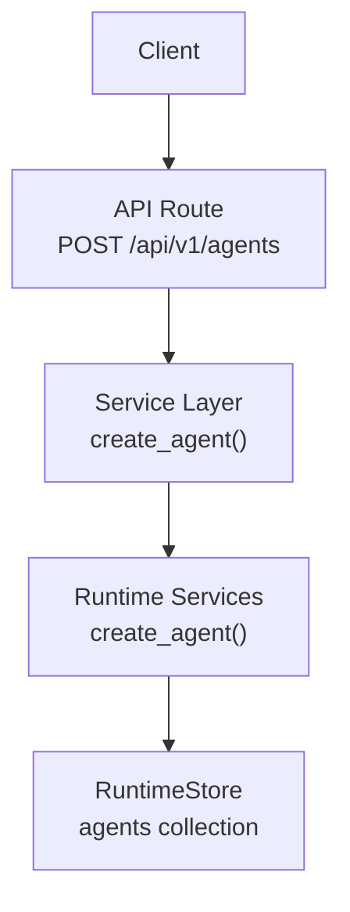
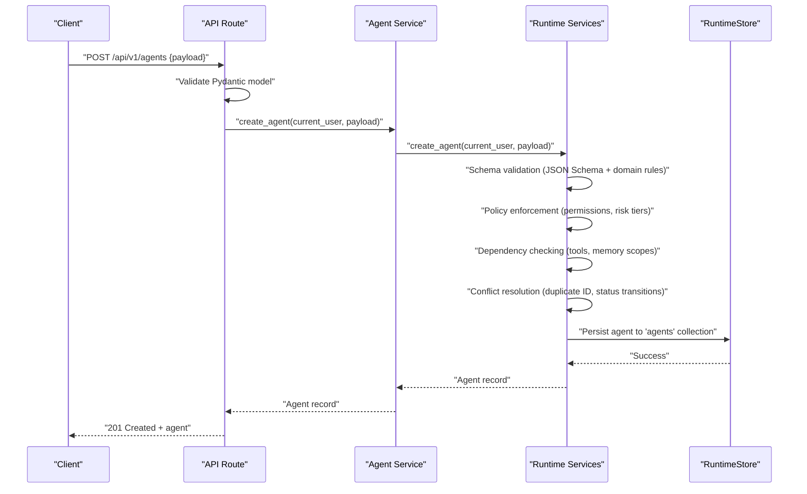
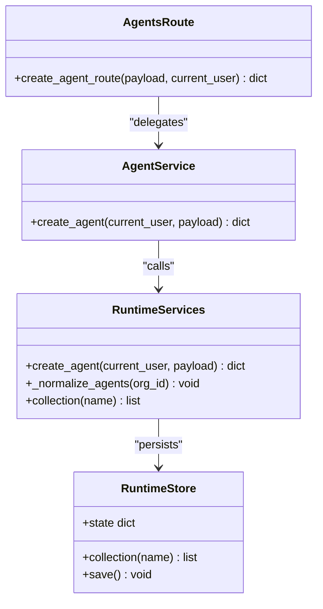

# Agent Registration & Validation

<cite>
**Referenced Files in This Document**
- [agents.py](file://backend/app/api/v1/routes/agents.py)
- [agent_service.py](file://backend/app/services/agent_service.py)
- [runtime.py](file://backend/app/runtime.py)
- [agent-spec.schema.json](file://business/schemas/agent-spec.schema.json)
- [test_alc_and_domains.py](file://backend/app/tests/unit/test_alc_and_domains.py)
</cite>

## Table of Contents
1. [Introduction](#introduction)
2. [Project Structure](#project-structure)
3. [Core Components](#core-components)
4. [Architecture Overview](#architecture-overview)
5. [Detailed Component Analysis](#detailed-component-analysis)
6. [Dependency Analysis](#dependency-analysis)
7. [Performance Considerations](#performance-considerations)
8. [Troubleshooting Guide](#troubleshooting-guide)
9. [Conclusion](#conclusion)

## Introduction
This document explains the agent registration process, focusing on schema validation, policy enforcement, and initial setup procedures. It covers the create_agent API endpoint, payload structure, validation rules, dependency checking, conflict resolution, and error handling. It also provides examples of valid agent specifications and common validation failures to help developers integrate correctly.

## Project Structure
The agent registration flow spans three layers:
- API layer: HTTP route that receives the request and validates the input model.
- Service layer: Thin adapter delegating to runtime orchestration.
- Runtime layer: Core business logic for creating agents, enforcing policies, and persisting state.

**Diagram sources**
- [agents.py](file://backend/app/api/v1/routes/agents.py)
- [agent_service.py](file://backend/app/services/agent_service.py)
- [runtime.py](file://backend/app/runtime.py)

**Section sources**
- [agents.py](file://backend/app/api/v1/routes/agents.py)
- [agent_service.py](file://backend/app/services/agent_service.py)
- [runtime.py](file://backend/app/runtime.py)

## Core Components
- API Route: Exposes POST /api/v1/agents and maps the request body to a Pydantic model before calling the service.
- Service Layer: Forwards authenticated user context and payload to runtime.create_agent.
- Runtime Services: Implements create_agent with validation, policy checks, dependency verification, conflict resolution, and persistence.

Key responsibilities:
- Validate incoming payload against JSON Schema and domain constraints.
- Enforce permissions based on roles.
- Check dependencies (tools, memory scopes).
- Resolve conflicts (e.g., duplicate IDs).
- Persist agent record and update related collections.

**Section sources**
- [agents.py](file://backend/app/api/v1/routes/agents.py)
- [agent_service.py](file://backend/app/services/agent_service.py)
- [runtime.py](file://backend/app/runtime.py)

## Architecture Overview
The end-to-end sequence for agent registration is shown below.

**Diagram sources**
- [agents.py](file://backend/app/api/v1/routes/agents.py)
- [agent_service.py](file://backend/app/services/agent_service.py)
- [runtime.py](file://backend/app/runtime.py)

## Detailed Component Analysis

### API Endpoint: create_agent
- Method and path: POST /api/v1/agents
- Request body: Validated by a Pydantic model (AgentCreateRequest) defined in the route file. The model enforces required fields and types at the HTTP boundary.
- Authentication and authorization: Current user is resolved via dependency injection; permission checks are enforced within runtime services.
- Response: Returns the created agent record on success.

Payload structure (high level):
- id: string, unique identifier for the agent.
- domain_id: string, identifies the domain the agent belongs to.
- name: string, human-readable name.
- status: enum, one of draft, registered, active, disabled.
- requires_alc: boolean, indicates if an Application Lifecycle Control is required.
- allowed_memory_scopes: array of strings from a fixed set.
- alc_version: string, version of the ALV/ALC specification used.
- Optional fields include role, category, tools, risk_tier, hooks, critique_rubric_ref, provenance.

Validation rules:
- JSON Schema validation ensures required fields are present and types match.
- Enum constraints enforce allowed values for status and memory scope items.
- Additional properties are permitted but not required.

Error handling:
- Invalid payloads return 422 with validation errors.
- Permission or policy violations return appropriate codes (e.g., 403, 409).
- Not found or missing dependencies return 404 or 422 depending on the rule.

Examples of valid agent specifications:
- Minimal spec with all required fields and a single memory scope.
- Extended spec including optional fields like tools, hooks, and provenance.

Common validation failures:
- Missing required fields (id, domain_id, name, status, requires_alc, allowed_memory_scopes, alc_version).
- Invalid status value (not one of the allowed enums).
- Disallowed memory scope item (must be from the predefined set).
- Empty allowed_memory_scopes array (minItems constraint).

**Section sources**
- [agents.py](file://backend/app/api/v1/routes/agents.py)
- [agent-service.py](file://backend/app/services/agent_service.py)
- [agent-spec.schema.json](file://business/schemas/agent-spec.schema.json)

### Service Layer: create_agent
- Delegates to runtime.create_agent with current_user and payload.
- No additional transformation; keeps the API thin and focused on I/O.

**Section sources**
- [agent_service.py](file://backend/app/services/agent_service.py)

### Runtime Services: create_agent
Responsibilities:
- Schema validation: Applies JSON Schema and domain-specific checks.
- Policy enforcement: Validates permissions and risk-tier alignment.
- Dependency checking: Ensures referenced tools and memory scopes exist and are enabled.
- Conflict resolution: Handles duplicate IDs and incompatible status transitions.
- Persistence: Writes the agent into the runtime store’s agents collection.

Data structures:
- AuthenticatedUser: Represents the caller’s identity and role.
- RuntimeStore: Provides access to persistent collections (agents, tools, memory items).

Complexity considerations:
- Validation and dependency checks are O(n) over referenced resources.
- Conflict detection uses set lookups for O(1) average-time checks.

Error handling:
- ValidationError for invalid payloads or failed constraints.
- PermissionDeniedError for insufficient privileges.
- ApprovalRequiredError when governance gates block creation.
- NotFoundError for missing dependencies.

Initial setup procedures:
- On first bootstrap, default organization, users, tokens, and seed agents/tools/workflows are created.
- Normalization routines ensure consistent fields across existing records.

**Section sources**
- [runtime.py](file://backend/app/runtime.py)

### Schema Validation Rules (AgentSpec)
- Required fields: id, domain_id, name, status, requires_alc, allowed_memory_scopes, alc_version.
- Type constraints:
  - id, domain_id, name: non-empty strings.
  - status: enum ["draft", "registered", "active", "disabled"].
  - requires_alc: boolean.
  - allowed_memory_scopes: array with minItems=1; each item must be one of ["agent", "organization", "run", "workflow", "public"].
  - alc_version: non-empty string.
- Optional fields: role, category, tools (array of strings), risk_tier, hooks, critique_rubric_ref, provenance.
- Additional properties are allowed.

These rules are enforced during create_agent validation.

**Section sources**
- [agent-spec.schema.json](file://business/schemas/agent-spec.schema.json)
- [runtime.py](file://backend/app/runtime.py)

### Dependency Checking and Conflict Resolution
- Dependency checking:
  - Tools: Ensure referenced tool IDs exist and are enabled.
  - Memory scopes: Ensure requested scopes are supported and aligned with policy.
- Conflict resolution:
  - Duplicate agent id: Reject with a conflict error.
  - Incompatible status transitions: Enforce lifecycle rules (e.g., cannot move directly to active without prerequisites).

Implementation references:
- RuntimeServices.create_agent performs these checks before persisting.

**Section sources**
- [runtime.py](file://backend/app/runtime.py)

### Error Handling Summary
- 422 Validation Error: Payload fails JSON Schema or domain constraints.
- 403 Permission Denied: Caller lacks required permissions.
- 409 Conflict: Duplicate agent id or incompatible state transition.
- 404 Not Found: Referenced dependency (tool, scope) not found.
- 409 Approval Required: Governance gate blocks creation pending approval.

**Section sources**
- [runtime.py](file://backend/app/runtime.py)

### Examples and Test Coverage
- Unit tests exercise create_agent with various payloads to validate schema and policy behavior.
- Tests cover successful registration and failure scenarios such as invalid fields and missing dependencies.

**Section sources**
- [test_alc_and_domains.py](file://backend/app/tests/unit/test_alc_and_domains.py)

## Dependency Analysis
The following diagram shows how components depend on each other during agent registration.

**Diagram sources**
- [agents.py](file://backend/app/api/v1/routes/agents.py)
- [agent_service.py](file://backend/app/services/agent_service.py)
- [runtime.py](file://backend/app/runtime.py)

**Section sources**
- [agents.py](file://backend/app/api/v1/routes/agents.py)
- [agent_service.py](file://backend/app/services/agent_service.py)
- [runtime.py](file://backend/app/runtime.py)

## Performance Considerations
- Keep payload minimal to reduce validation overhead.
- Avoid referencing large numbers of tools or scopes in a single request.
- Use idempotency keys where applicable to prevent duplicate registrations under load.
- Prefer batch operations for bulk agent imports if supported by higher-level APIs.

[No sources needed since this section provides general guidance]

## Troubleshooting Guide
Common issues and resolutions:
- Validation errors (422):
  - Verify all required fields are present and types match.
  - Ensure status is one of the allowed enums.
  - Confirm allowed_memory_scopes contains only valid values and is non-empty.
- Permission denied (403):
  - Ensure the caller has agents:create permission for their role.
- Conflict (409):
  - Choose a unique agent id.
  - Follow lifecycle transitions (e.g., register before activating).
- Not found (404):
  - Ensure referenced tools and memory scopes exist and are enabled.
- Approval required (409):
  - Submit for governance review if the agent’s risk tier mandates it.

Operational tips:
- Inspect runtime logs around RuntimeServices.create_agent calls.
- Validate payloads against the AgentSpec schema before sending requests.
- Use test fixtures to reproduce failures locally.

**Section sources**
- [runtime.py](file://backend/app/runtime.py)
- [agent-spec.schema.json](file://business/schemas/agent-spec.schema.json)

## Conclusion
Agent registration combines strict schema validation, policy enforcement, dependency checks, and conflict resolution to ensure safe and consistent agent lifecycle management. By adhering to the AgentSpec requirements and understanding the error responses, clients can reliably create and manage agents through the create_agent endpoint.