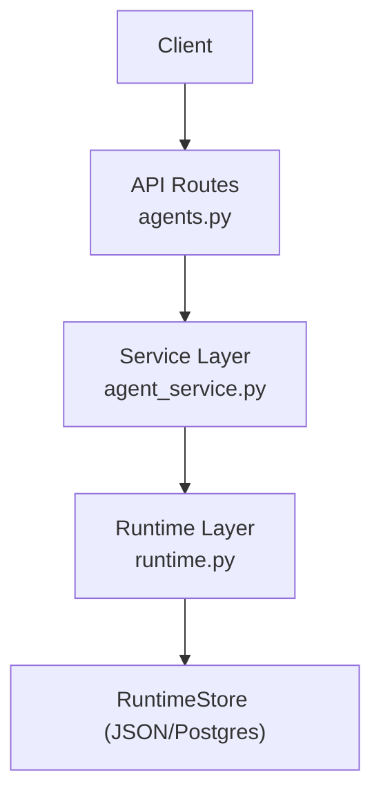
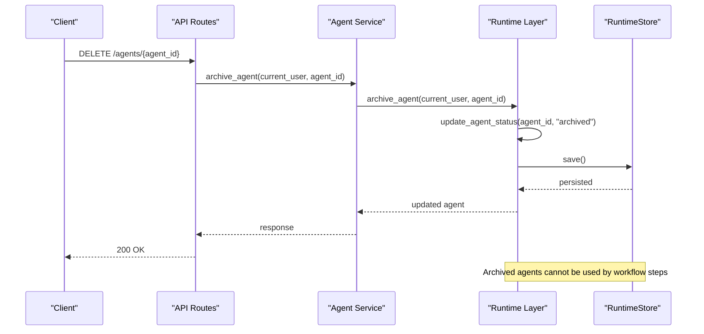
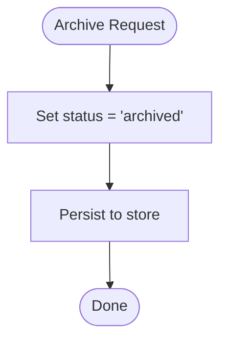
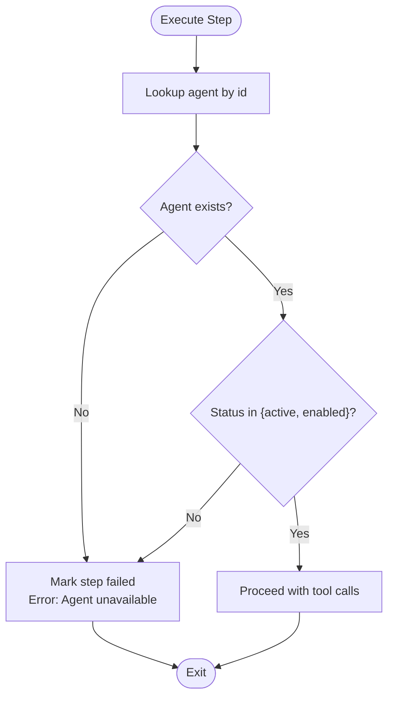
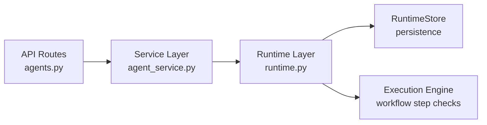

# Agent Versioning & Deprecation

<cite>
**Referenced Files in This Document**
- [runtime.py](file://backend/app/runtime.py)
- [agents.py](file://backend/app/api/v1/routes/agents.py)
- [agent_service.py](file://backend/app/services/agent_service.py)
</cite>

## Table of Contents
1. [Introduction](#introduction)
2. [Project Structure](#project-structure)
3. [Core Components](#core-components)
4. [Architecture Overview](#architecture-overview)
5. [Detailed Component Analysis](#detailed-component-analysis)
6. [Dependency Analysis](#dependency-analysis)
7. [Performance Considerations](#performance-considerations)
8. [Troubleshooting Guide](#troubleshooting-guide)
9. [Conclusion](#conclusion)
10. [Appendices](#appendices)

## Introduction
This document explains how agent versioning, backward compatibility, and deprecation are handled in the system. It focuses on:
- How agents are modeled with a version field and lifecycle states
- How multiple agent versions coexist and are selected at runtime
- Backward compatibility mechanisms for legacy records
- Deprecation workflows including archival and retirement
- The archive_agent functionality and status transitions for retired agents

The goal is to provide clear guidance for operators and developers managing agent lifecycles across environments.

## Project Structure
Agent-related capabilities are implemented primarily in the backend runtime layer and exposed via API routes and service functions:
- API routes define endpoints for listing, creating, updating, and archiving agents
- Service functions delegate to the runtime layer
- Runtime layer implements persistence, normalization, validation, and execution-time checks

**Diagram sources**
- [agents.py:1-48](file://backend/app/api/v1/routes/agents.py#L1-L48)
- [agent_service.py:1-30](file://backend/app/services/agent_service.py#L1-L30)
- [runtime.py:1308-1397](file://backend/app/runtime.py#L1308-L1397)

**Section sources**
- [agents.py:1-48](file://backend/app/api/v1/routes/agents.py#L1-L48)
- [agent_service.py:1-30](file://backend/app/services/agent_service.py#L1-L30)
- [runtime.py:1308-1397](file://backend/app/runtime.py#L1308-L1397)

## Core Components
- API routes expose CRUD and archival operations for agents
- Service layer provides thin wrappers around runtime methods
- Runtime layer manages:
  - Agent creation with a version field
  - Status updates and archival
  - Execution-time enforcement that considers agent status
  - Backward compatibility normalization for legacy fields

Key behaviors:
- Agents carry a version string during creation
- Status transitions include draft, active, archived
- Archived agents are not executable by workflow steps
- Legacy agent records without certain fields are normalized at load time

**Section sources**
- [agents.py:11-47](file://backend/app/api/v1/routes/agents.py#L11-L47)
- [agent_service.py:4-30](file://backend/app/services/agent_service.py#L4-L30)
- [runtime.py:1319-1397](file://backend/app/runtime.py#L1319-L1397)

## Architecture Overview
The end-to-end flow for agent archival and execution-time behavior is as follows:

**Diagram sources**
- [agents.py:33-35](file://backend/app/api/v1/routes/agents.py#L33-L35)
- [agent_service.py:19-22](file://backend/app/services/agent_service.py#L19-L22)
- [runtime.py:1374-1376](file://backend/app/runtime.py#L1374-L1376)
- [runtime.py:1346-1372](file://backend/app/runtime.py#L1346-L1372)

## Detailed Component Analysis

### Agent Lifecycle and Versioning
- Creation includes a version field; if omitted, defaults to a standard value
- Status can be set explicitly or defaulted to draft
- Active agents are eligible for execution; archived agents are not
- Workflow steps check agent availability before executing

Operational implications:
- To introduce a new agent version, create a new agent record with an incremented version
- Keep older versions available for rollback by leaving them active until migration completes
- Use archival to retire versions after confirming stability

**Section sources**
- [runtime.py:1319-1344](file://backend/app/runtime.py#L1319-L1344)
- [runtime.py:1346-1372](file://backend/app/runtime.py#L1346-L1372)
- [runtime.py:1962-1972](file://backend/app/runtime.py#L1962-L1972)

### Archive Agent Functionality
Archival sets the agent status to archived and persists the change. Archived agents are treated as unavailable during workflow execution.

**Diagram sources**
- [agents.py:33-35](file://backend/app/api/v1/routes/agents.py#L33-L35)
- [agent_service.py:19-22](file://backend/app/services/agent_service.py#L19-L22)
- [runtime.py:1374-1376](file://backend/app/runtime.py#L1374-L1376)

**Section sources**
- [agents.py:33-35](file://backend/app/api/v1/routes/agents.py#L33-L35)
- [agent_service.py:19-22](file://backend/app/services/agent_service.py#L19-L22)
- [runtime.py:1374-1376](file://backend/app/runtime.py#L1374-L1376)

### Execution-Time Enforcement for Retired Agents
Workflow execution validates agent availability prior to running steps. If an agent is missing or not in an allowed state, the step fails and the run is marked failed.

**Diagram sources**
- [runtime.py:1962-1972](file://backend/app/runtime.py#L1962-L1972)

**Section sources**
- [runtime.py:1962-1972](file://backend/app/runtime.py#L1962-L1972)

### Backward Compatibility and Normalization
Legacy agent records may lack optional fields such as memory scopes or tools. The runtime normalizes these records at startup and during bootstrap to ensure consistent behavior:
- Defaults organization and workflow memory scopes when missing
- Ensures allowed_tools defaults from seed data or step definitions
- Maintains stable identities for collections while updating in place

Migration notes:
- No explicit versioned schema per agent; instead, normalization fills gaps
- Newer features rely on presence of fields; normalization ensures safe operation for older records

**Section sources**
- [runtime.py:730-755](file://backend/app/runtime.py#L730-L755)
- [runtime.py:894-901](file://backend/app/runtime.py#L894-L901)
- [runtime.py:1973-1981](file://backend/app/runtime.py#L1973-L1981)

### Deprecation and Retirement Procedures
Recommended procedure:
- Mark the old agent as archived using the archive endpoint
- Verify no active runs depend on the archived agent
- Promote the new agent version to active
- Monitor audit logs and activity for any residual references

Retirement considerations:
- Archived agents remain queryable for historical analysis
- Workflow steps referencing archived agents will fail at execution time
- Maintain documentation linking agent IDs to their intended roles and versions

**Section sources**
- [agents.py:33-35](file://backend/app/api/v1/routes/agents.py#L33-L35)
- [agent_service.py:19-22](file://backend/app/services/agent_service.py#L19-L22)
- [runtime.py:1374-1376](file://backend/app/runtime.py#L1374-L1376)
- [runtime.py:1962-1972](file://backend/app/runtime.py#L1962-L1972)

## Dependency Analysis
The following diagram shows the dependency chain for agent archival and execution-time checks:

**Diagram sources**
- [agents.py:1-48](file://backend/app/api/v1/routes/agents.py#L1-L48)
- [agent_service.py:1-30](file://backend/app/services/agent_service.py#L1-L30)
- [runtime.py:1308-1397](file://backend/app/runtime.py#L1308-L1397)
- [runtime.py:1962-1972](file://backend/app/runtime.py#L1962-L1972)

**Section sources**
- [agents.py:1-48](file://backend/app/api/v1/routes/agents.py#L1-L48)
- [agent_service.py:1-30](file://backend/app/services/agent_service.py#L1-L30)
- [runtime.py:1308-1397](file://backend/app/runtime.py#L1308-L1397)
- [runtime.py:1962-1972](file://backend/app/runtime.py#L1962-L1972)

## Performance Considerations
- Archival is a lightweight status update and persistence operation
- Execution-time checks add minimal overhead by validating agent existence and status
- Normalization occurs at startup and during bootstrap; it avoids repeated migrations

[No sources needed since this section provides general guidance]

## Troubleshooting Guide
Common issues and resolutions:
- Attempting to run a workflow step with an archived agent results in failure due to unavailability
  - Resolution: Activate a compatible agent version or remove the reference to the archived agent
- Creating an agent without a version uses a default; ensure downstream consumers expect this
  - Resolution: Explicitly set the version field when creating agents
- Legacy agents missing memory scopes or tools are auto-normalized; verify expected permissions
  - Resolution: Confirm normalization has occurred and adjust allowed_memory_scopes or allowed_tools as needed

**Section sources**
- [runtime.py:1962-1972](file://backend/app/runtime.py#L1962-L1972)
- [runtime.py:1319-1344](file://backend/app/runtime.py#L1319-L1344)
- [runtime.py:894-901](file://backend/app/runtime.py#L894-L901)
- [runtime.py:1973-1981](file://backend/app/runtime.py#L1973-L1981)

## Conclusion
Agent versioning in this system centers on simple version strings and lifecycle statuses. Multiple versions can coexist, enabling controlled rollouts and rollbacks. Archival provides a clear retirement path, and execution-time checks enforce that only active agents participate in workflows. Backward compatibility is ensured through normalization, allowing legacy records to operate safely alongside newer ones.

[No sources needed since this section summarizes without analyzing specific files]

## Appendices

### API Endpoints Summary
- List agents: GET /agents
- Create agent: POST /agents
- Get agent: GET /agents/{agent_id}
- Update agent status: PATCH /agents/{agent_id}
- Archive agent: DELETE /agents/{agent_id}
- Agent activity: GET /agents/{agent_id}/activity
- Agent tools: GET /agents/{agent_id}/tools

**Section sources**
- [agents.py:11-47](file://backend/app/api/v1/routes/agents.py#L11-L47)