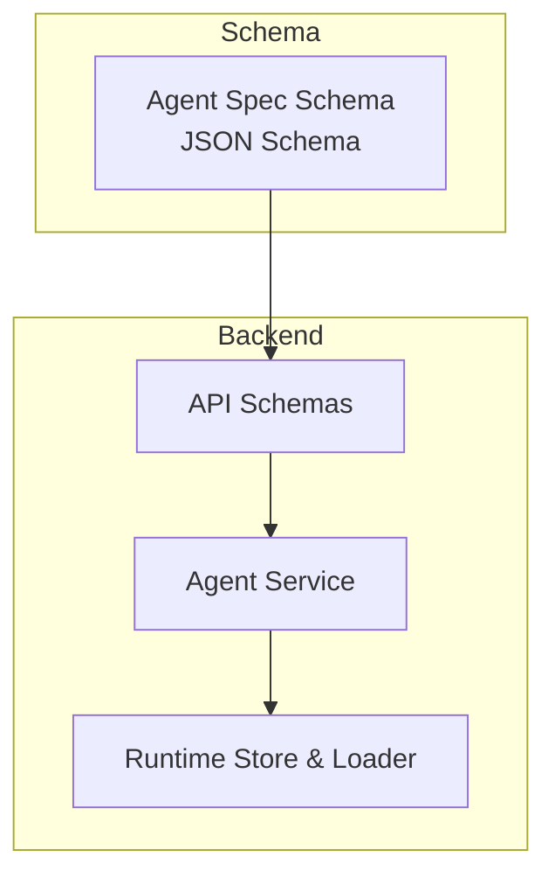
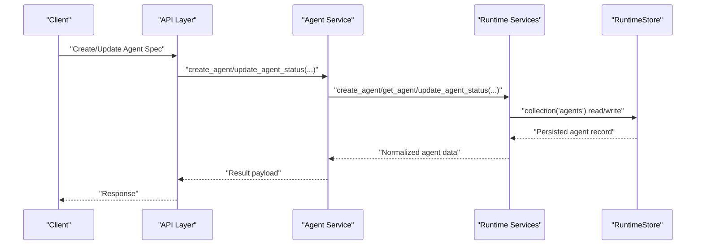
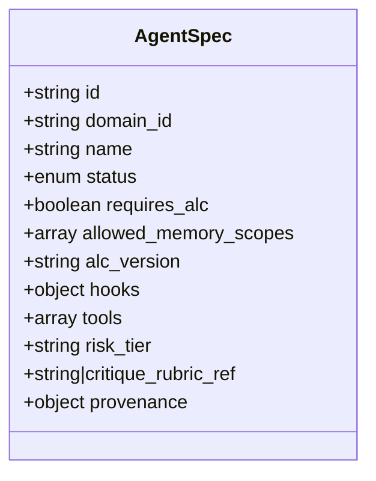
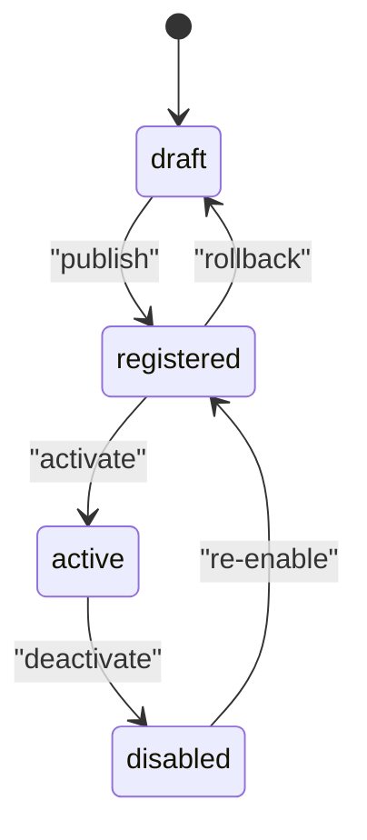
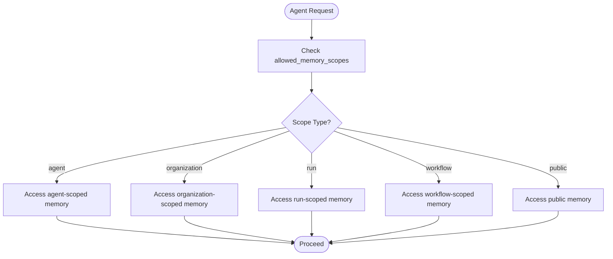
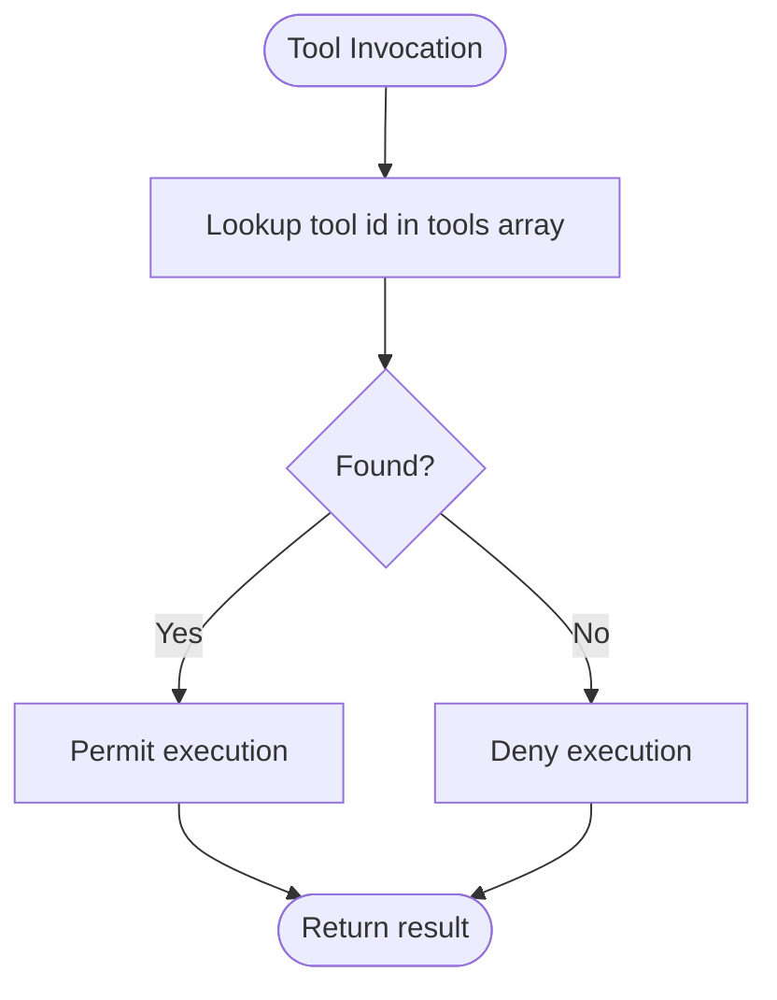
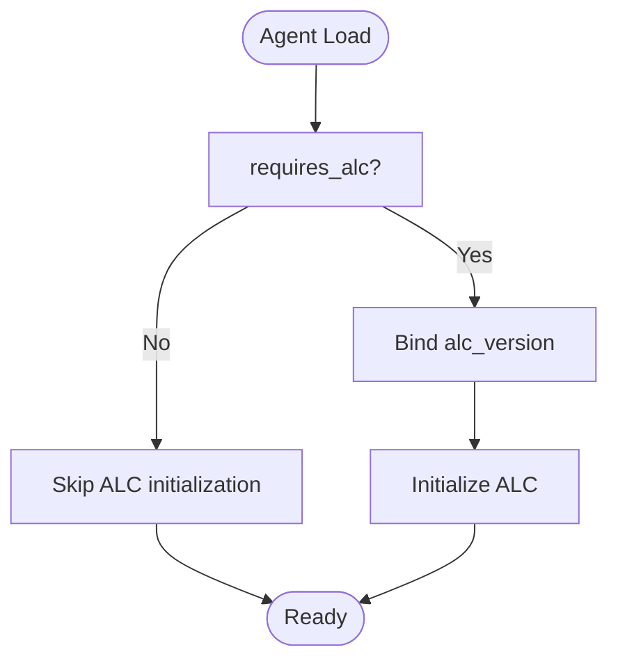
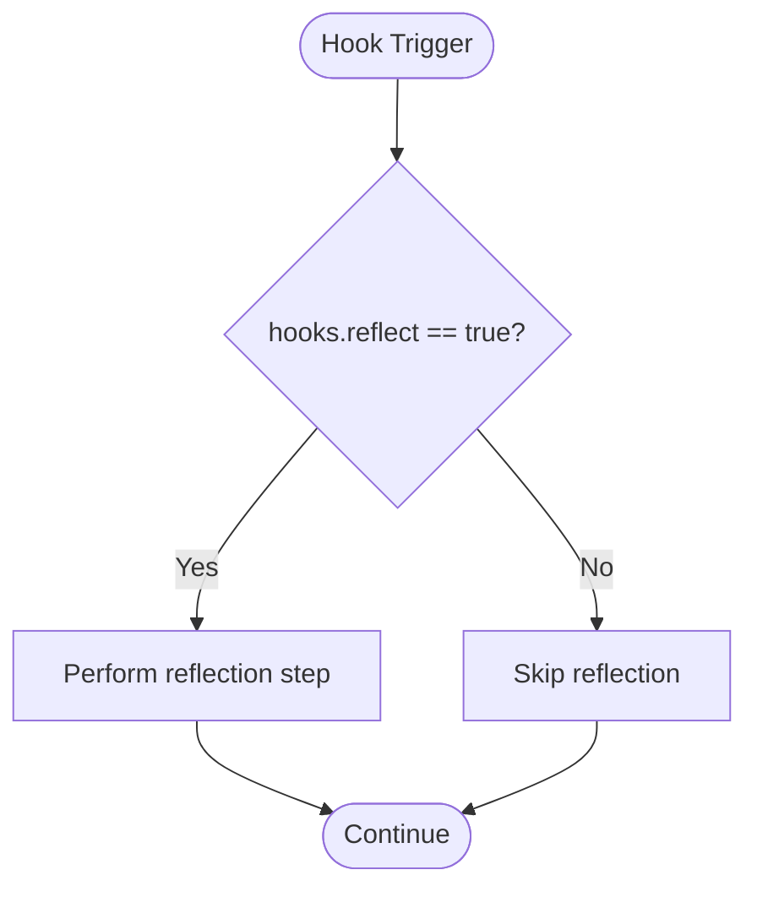
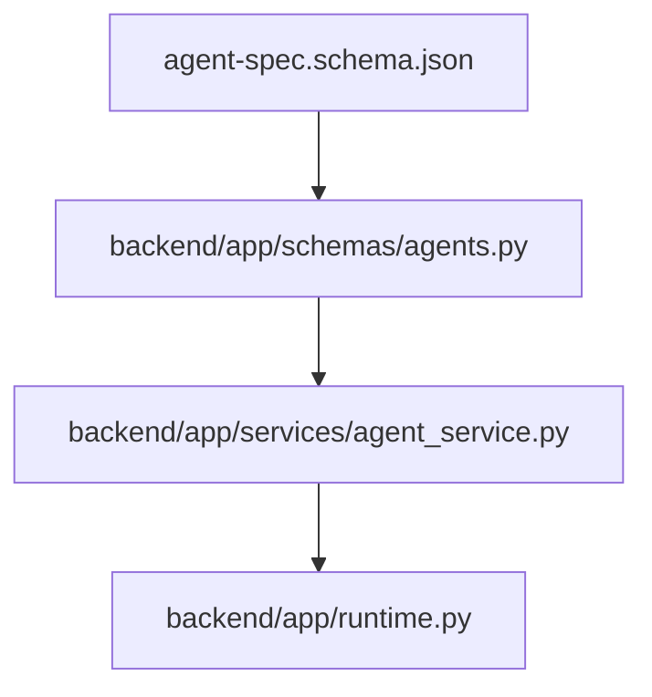

# Agent Specification Schema

<cite>
**Referenced Files in This Document**
- [agent-spec.schema.json](file://business/schemas/agent-spec.schema.json)
- [agents.py](file://backend/app/schemas/agents.py)
- [agent_service.py](file://backend/app/services/agent_service.py)
- [runtime.py](file://backend/app/runtime.py)
</cite>

## Table of Contents
1. [Introduction](#introduction)
2. [Project Structure](#project-structure)
3. [Core Components](#core-components)
4. [Architecture Overview](#architecture-overview)
5. [Detailed Component Analysis](#detailed-component-analysis)
6. [Dependency Analysis](#dependency-analysis)
7. [Performance Considerations](#performance-considerations)
8. [Troubleshooting Guide](#troubleshooting-guide)
9. [Conclusion](#conclusion)
10. [Appendices](#appendices)

## Introduction
This document defines the Agent Specification Schema used to describe agents in the system. It covers all required and optional fields, validation rules, lifecycle states, memory scope permissions, tool access controls, ALC (Autonomous Learning Capability) configuration, hooks, risk tiering, and provenance tracking. It also provides practical examples and guidance for creating complete agent specifications.

## Project Structure
The Agent Specification Schema is defined as a JSON Schema artifact and consumed by backend services and runtime components:
- The canonical schema is stored under business/schemas.
- Backend API schemas and services reference runtime operations that persist and manage agents.
- Runtime normalizes and seeds agent records at startup.

**Diagram sources**
- [agent-spec.schema.json:1-52](file://business/schemas/agent-spec.schema.json#L1-L52)
- [agents.py:1-2](file://backend/app/schemas/agents.py#L1-L2)
- [agent_service.py:1-30](file://backend/app/services/agent_service.py#L1-L30)
- [runtime.py:258-393](file://backend/app/runtime.py#L258-L393)

**Section sources**
- [agent-spec.schema.json:1-52](file://business/schemas/agent-spec.schema.json#L1-L52)
- [agents.py:1-2](file://backend/app/schemas/agents.py#L1-L2)
- [agent_service.py:1-30](file://backend/app/services/agent_service.py#L1-L30)
- [runtime.py:258-393](file://backend/app/runtime.py#L258-L393)

## Core Components
This section enumerates the Agent Specification fields, their types, constraints, and semantics.

- Required fields
  - id: string; must be non-empty. Unique identifier for the agent specification.
  - domain_id: string; must be non-empty. Identifier of the domain the agent belongs to.
  - name: string; must be non-empty. Human-readable agent name.
  - status: enum; one of draft, registered, active, disabled. Lifecycle state of the agent.
  - requires_alc: boolean; indicates whether the agent depends on Autonomous Learning Capability.
  - allowed_memory_scopes: array; non-empty list of allowed memory scopes. Each item must be one of agent, organization, run, workflow, public.
  - alc_version: string; must be non-empty. Version of the ALC implementation the agent targets.

- Optional fields
  - va_id: integer; legacy or external association identifier.
  - role: string; agent role classification.
  - category: string; categorization label.
  - hooks: object; optional hook configuration with reflect flag (boolean).
  - tools: array of strings; identifiers of tools the agent may use.
  - risk_tier: string; risk classification for governance and approvals.
  - critique_rubric_ref: string or null; reference to a critique rubric.
  - provenance: object; metadata about origin, versioning, and lineage.

Validation highlights
- All required fields must be present and satisfy type and length constraints.
- status must be one of the enumerated values.
- allowed_memory_scopes must contain at least one element from the allowed set.
- alc_version must be a non-empty string when present.
- Additional properties are permitted by the schema.

Lifecycle states and transitions
- draft: Initial authoring state.
- registered: Published into registry but not yet live.
- active: Running and available for execution.
- disabled: Temporarily halted or retired.
Transitions are managed through service endpoints that update the status field.

Memory scope permissions
- agent: Scoped to the individual agent instance.
- organization: Scoped to the organization context.
- run: Scoped to a single workflow run.
- workflow: Scoped to a specific workflow definition.
- public: Globally accessible within policy constraints.

Tool access controls
- tools lists the identifiers of tools an agent is permitted to call.
- Tool permissions are enforced at runtime based on tool definitions and policies.

ALC configuration
- requires_alc signals dependency on ALC features.
- alc_version binds the agent to a specific ALC implementation version.

Hooks system
- hooks.reflect enables reflective behaviors for the agent’s lifecycle or learning loop.

Risk tiering
- risk_tier classifies the agent’s operational risk and influences approval gates and monitoring.

Provenance tracking
- provenance captures lineage information such as source, author, and change history.

Practical example references
- See the schema file for a complete, valid structure including all fields.

**Section sources**
- [agent-spec.schema.json:1-52](file://business/schemas/agent-spec.schema.json#L1-L52)

## Architecture Overview
The Agent Specification Schema drives how agents are created, validated, persisted, and operated. The flow below shows how a client request interacts with the backend to create or update an agent specification.

**Diagram sources**
- [agent_service.py:12-17](file://backend/app/services/agent_service.py#L12-L17)
- [runtime.py:258-393](file://backend/app/runtime.py#L258-L393)

## Detailed Component Analysis

### Agent Specification Fields and Constraints
- id: string, minLength 1. Primary key for the spec.
- domain_id: string, minLength 1. Domain association.
- name: string, minLength 1. Display name.
- status: enum ["draft", "registered", "active", "disabled"]. Lifecycle control.
- requires_alc: boolean. ALC dependency flag.
- allowed_memory_scopes: array of enums ["agent", "organization", "run", "workflow", "public"], minItems 1.
- alc_version: string, minLength 1. ALC version binding.
- hooks: object with reflect boolean. Hook toggles.
- tools: array of strings. Allowed tool identifiers.
- risk_tier: string. Risk classification.
- critique_rubric_ref: string | null. Rubric reference.
- provenance: object. Lineage metadata.

**Diagram sources**
- [agent-spec.schema.json:1-52](file://business/schemas/agent-spec.schema.json#L1-L52)

**Section sources**
- [agent-spec.schema.json:1-52](file://business/schemas/agent-spec.schema.json#L1-L52)

### Lifecycle State Transitions
The following diagram illustrates typical transitions between lifecycle states.

[No sources needed since this diagram shows conceptual workflow, not actual code structure]

### Memory Scope Permissions
Allowed scopes define where an agent can read/write memory.

[No sources needed since this diagram shows conceptual workflow, not actual code structure]

### Tool Access Controls
Tools are declared in the spec and enforced at runtime.

[No sources needed since this diagram shows conceptual workflow, not actual code structure]

### ALC Configuration
- requires_alc: boolean flag indicating ALC dependency.
- alc_version: string specifying the target ALC version.

[No sources needed since this diagram shows conceptual workflow, not actual code structure]

### Hooks System
- hooks.reflect: boolean toggle enabling reflection behavior.

[No sources needed since this diagram shows conceptual workflow, not actual code structure]

### Risk Tiering
- risk_tier: string used by governance and approval flows to determine gating requirements.

[No sources needed since this section doesn't analyze specific files]

### Provenance Tracking
- provenance: object capturing origin, authorship, and lineage metadata.

[No sources needed since this section doesn't analyze specific files]

## Dependency Analysis
The schema is consumed by backend services and runtime normalization logic.

**Diagram sources**
- [agent-spec.schema.json:1-52](file://business/schemas/agent-spec.schema.json#L1-L52)
- [agents.py:1-2](file://backend/app/schemas/agents.py#L1-L2)
- [agent_service.py:1-30](file://backend/app/services/agent_service.py#L1-L30)
- [runtime.py:258-393](file://backend/app/runtime.py#L258-L393)

**Section sources**
- [agent-spec.schema.json:1-52](file://business/schemas/agent-spec.schema.json#L1-L52)
- [agents.py:1-2](file://backend/app/schemas/agents.py#L1-L2)
- [agent_service.py:1-30](file://backend/app/services/agent_service.py#L1-L30)
- [runtime.py:258-393](file://backend/app/runtime.py#L258-L393)

## Performance Considerations
- Keep allowed_memory_scopes minimal to reduce permission checks overhead.
- Avoid excessively large tools arrays; prefer grouping via roles or policies when possible.
- Use alc_version to pin compatible ALC implementations and avoid runtime compatibility checks.
- Normalize provenance sparingly; store only essential lineage fields.

[No sources needed since this section provides general guidance]

## Troubleshooting Guide
Common issues and resolutions:
- Missing required fields: Ensure id, domain_id, name, status, requires_alc, allowed_memory_scopes, and alc_version are present and valid.
- Invalid status value: Use one of draft, registered, active, disabled.
- Empty allowed_memory_scopes: Provide at least one valid scope from the allowed set.
- Unknown tool id: Verify tool identifiers exist in the tools array and are permitted by runtime policies.
- ALC mismatch: Align alc_version with the deployed ALC capability if requires_alc is true.

Operational tips:
- Use service endpoints to update agent status safely and consistently.
- Inspect runtime collections for normalized agent records after bootstrap.

**Section sources**
- [agent-service.py:12-17](file://backend/app/services/agent_service.py#L12-L17)
- [runtime.py:730-755](file://backend/app/runtime.py#L730-L755)

## Conclusion
The Agent Specification Schema provides a robust, extensible contract for defining agents, their capabilities, and governance attributes. By adhering to the required fields, lifecycle states, memory scope permissions, and tool access controls, teams can reliably operate agents with clear risk management and provenance tracking.

[No sources needed since this section summarizes without analyzing specific files]

## Appendices

### Complete Example Reference
For a complete, valid agent specification including all fields and constraints, refer to the schema file.

**Section sources**
- [agent-spec.schema.json:1-52](file://business/schemas/agent-spec.schema.json#L1-L52)