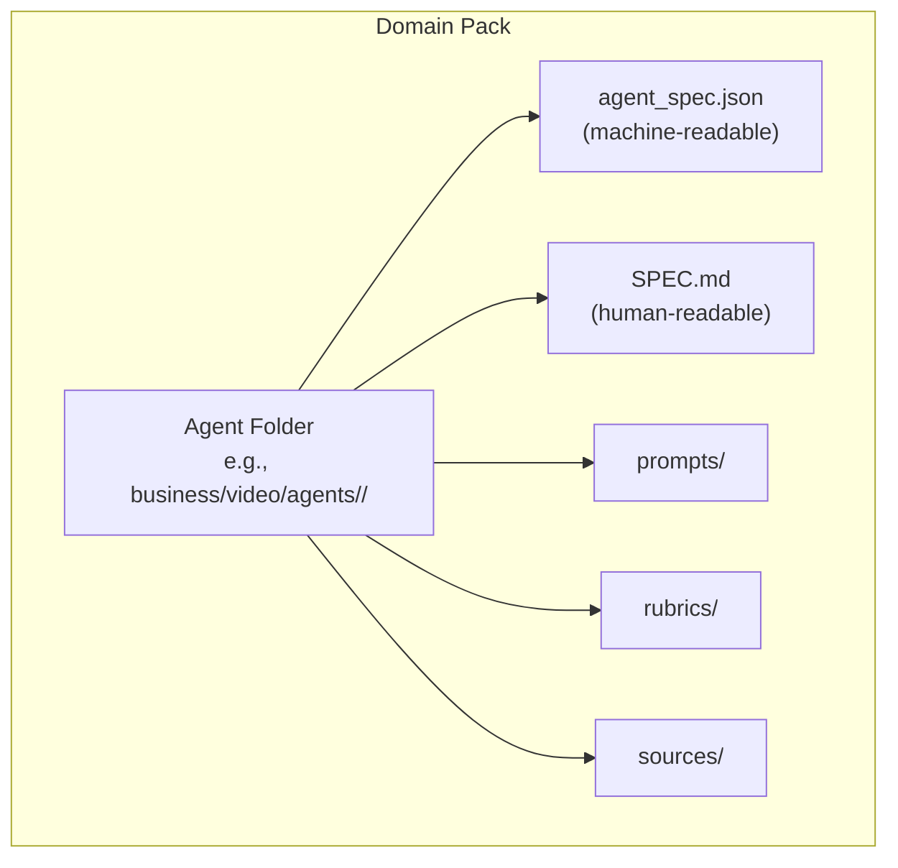
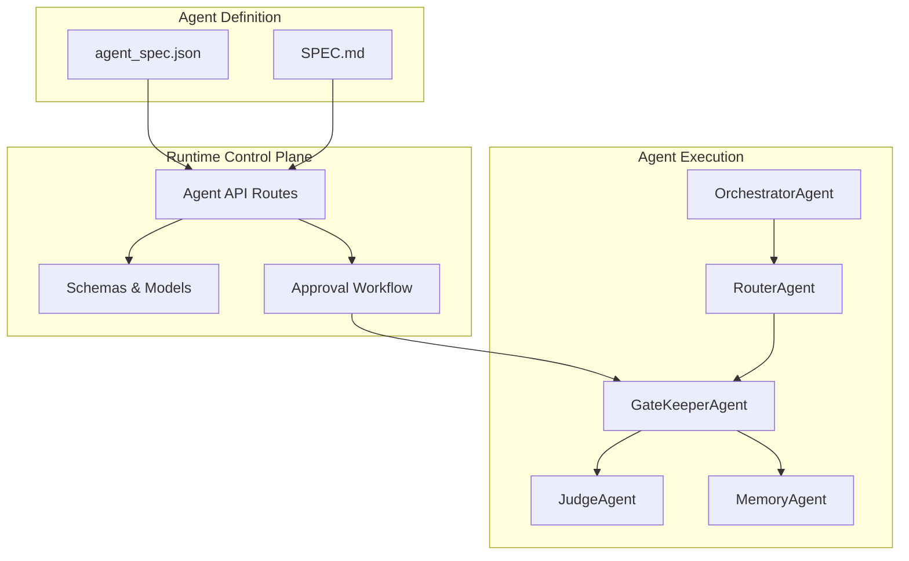
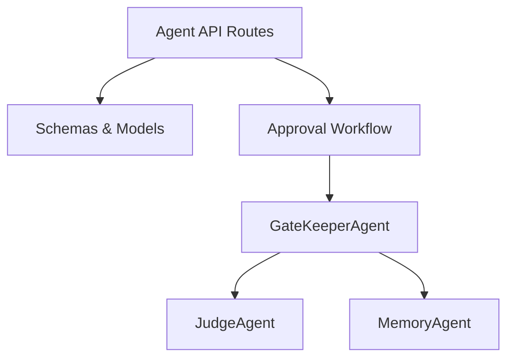

# Custom Agent Development

<cite>
**Referenced Files in This Document**
- [agent-spec.schema.json](file://business/schemas/agent-spec.schema.json)
- [video.accessibility SPEC.md](file://business/video/agents/video.accessibility/SPEC.md)
- [video.director SPEC.md](file://business/video/agents/video.director/SPEC.md)
- [agents.py](file://backend/app/api/v1/routes/agents.py)
- [agents schema](file://backend/app/schemas/agents.py)
- [approvals models](file://backend/app/domain/approvals/models.py)
- [approvals schema](file://backend/app/schemas/approvals.py)
</cite>

## Table of Contents
1. Introduction
2. Project Structure
3. Core Components
4. Architecture Overview
5. Detailed Component Analysis
6. Dependency Analysis
7. Performance Considerations
8. Troubleshooting Guide
9. Conclusion

## Introduction
This document explains how to create custom agents within domain packs, focusing on the agent specification schema, documentation format (SPEC.md), lifecycle management from draft to active, memory scoping and tool permissions, ALC (Autonomous Learning Capability) configuration, and practical examples drawn from video production agents. It is designed for both technical implementers and non-technical stakeholders who need a clear understanding of how agents are defined, governed, and operated.

## Project Structure
Agents are defined as self-contained packages under a domain pack. Each agent folder contains:
- A machine-readable specification (JSON) that validates against the agent spec schema
- A human-readable specification (SPEC.md) documenting identity, responsibilities, knowledge sources, rubrics, critique bus, tools, architecture pattern, and references
- Optional assets such as prompts, rubrics, and sources referenced by the agent’s workflow

[No sources needed since this diagram shows conceptual structure]

## Core Components
- Agent Specification Schema: Defines required fields including id, domain_id, name, status, requires_alc, allowed_memory_scopes, alc_version, plus optional hooks, tools, risk_tier, critique_rubric_ref, and provenance.
- SPEC.md Format: Provides comprehensive documentation for each agent, including identity, category roster section, responsibility, knowledge distillation sources, self-quality criteria, surpass-human signal, critique bus, tools, architecture pattern, shared references, and deep specifications.
- Lifecycle Management: Agents progress through statuses such as draft, registered, active, disabled. Approval workflows and gates control transitions, especially when ALC is enabled.
- Memory Scoping: Controls which memory scopes an agent can access (agent, organization, run, workflow, public).
- Tool Permissions: Runtime safety enforced via allow-lists; only explicitly permitted tools are available at runtime.
- ALC Configuration: Indicates whether an agent uses autonomous learning capabilities and specifies the ALC version used.

**Section sources**
- [agent-spec.schema.json:1-52](file://business/schemas/agent-spec.schema.json#L1-L52)
- [video.accessibility SPEC.md:1-120](file://business/video/agents/video.accessibility/SPEC.md#L1-L120)
- [video.director SPEC.md:1-120](file://business/video/agents/video.director/SPEC.md#L1-L120)

## Architecture Overview
The system integrates agent definitions with orchestration, governance, and runtime controls. The following diagram maps key components and their interactions:

**Diagram sources**
- [agents.py](file://backend/app/api/v1/routes/agents.py)
- [agents schema](file://backend/app/schemas/agents.py)
- [approvals models](file://backend/app/domain/approvals/models.py)
- [approvals schema](file://backend/app/schemas/approvals.py)

## Detailed Component Analysis

### Agent Specification Schema
The agent specification schema enforces a consistent contract for all agents. Required fields include:
- id: Unique identifier for the agent
- domain_id: Domain pack identifier
- name: Human-readable name
- status: Lifecycle state (draft, registered, active, disabled)
- requires_alc: Boolean indicating if autonomous learning capability is required
- allowed_memory_scopes: Array of permissible memory scopes (agent, organization, run, workflow, public)
- alc_version: Version string for ALC configuration

Optional fields include:
- va_id: Vendor-specific identifier
- role, category: Classification metadata
- hooks: Feature toggles (e.g., reflect)
- tools: List of permitted tool identifiers
- risk_tier: Risk classification
- critique_rubric_ref: Reference to evaluation rubric
- provenance: Provenance metadata object

Validation ensures minimal length constraints and enum values for status and memory scopes.

**Section sources**
- [agent-spec.schema.json:1-52](file://business/schemas/agent-spec.schema.json#L1-L52)

### SPEC.md Format and Organization
Each agent’s SPEC.md provides a complete, self-contained definition suitable for review and implementation. Typical sections include:
- Identity: va_id, pack_id, category, domain_id, folder path
- Category roster section: Full table from master roster showing peers and relationships
- Responsibility: One-sentence scope definition
- Knowledge distillation sources: Licensed corpora or datasets used
- Self-quality criteria: Objective metrics for L1/L2/L3 quality gates
- Surpass-human signal: Pre-registered proof of performance advantage
- Critique bus: Accepts critique from and comments on other agents
- Tools (design-time documentation): Design-time vendor names and runtime safety notes
- Architecture pattern: Reasoning/learning loop (Self-Refine, Reflexion, Constitutional AI, etc.)
- Shared references: Links to foundational papers, benchmarks, and infrastructure standards
- Deep specifications: Embedded documents detailing functional specs, workflows, and composition diagrams

Practical example patterns:
- AccessibilityAgent SPEC.md outlines final accessibility acceptance before release, WCAG 2.2 alignment, caption accuracy, AD completeness, contrast compliance, and constitutional AI pattern.
- DirectorAgent SPEC.md defines vision ownership, shot intents, pacing, and multi-agent critique integration.

**Section sources**
- [video.accessibility SPEC.md:1-120](file://business/video/agents/video.accessibility/SPEC.md#L1-L120)
- [video.director SPEC.md:1-120](file://business/video/agents/video.director/SPEC.md#L1-L120)

### Agent Lifecycle Management
Lifecycle states:
- draft: Initial creation and editing phase
- registered: Validated and cataloged but not yet active
- active: Approved and running in production
- disabled: Temporarily or permanently halted

Approval workflows:
- Transitions from draft to registered require schema validation and basic checks
- Registered to active requires approval gates, including ALC activation gates when requires_alc is true
- Active to disabled may be triggered by policy violations or operational decisions

Runtime safety:
- Host allow-lists restrict tools to those declared in agent_spec.json and tool-permission-register.json
- CI uses stubs for design-time vendor names; actual APIs must be explicitly enabled

**Section sources**
- [agent-spec.schema.json:1-52](file://business/schemas/agent-spec.schema.json#L1-L52)
- [video.director SPEC.md:55-60](file://business/video/agents/video.director/SPEC.md#L55-L60)

### Memory Scoping Mechanisms
Allowed memory scopes:
- agent: Scoped to the specific agent instance
- organization: Shared across agents within an organization
- run: Scoped to a single execution run
- workflow: Scoped to a workflow instance
- public: Globally accessible (use with caution)

Scoping ensures data isolation and security boundaries while enabling collaboration where appropriate.

**Section sources**
- [agent-spec.schema.json:27-34](file://business/schemas/agent-spec.schema.json#L27-L34)

### Tool Adapter Integration and Permission Models
Tool permissions:
- Design-time documentation lists intended tools
- Runtime enforcement relies on allow-lists in agent_spec.json and tool-permission-register.json
- CI stubs prevent accidental use of unapproved APIs

Integration points:
- Agents interact with external services via MCP (Model Context Protocol) bridges
- Tool calls are logged and auditable for compliance and provenance

**Section sources**
- [video.director SPEC.md:55-60](file://business/video/agents/video.director/SPEC.md#L55-L60)

### ALC (Autonomous Learning Capability) Configuration
ALC indicators:
- requires_alc: Boolean flag indicating if the agent needs autonomous learning
- alc_version: String specifying the ALC version used

Activation gates:
- When requires_alc is true, additional approval steps ensure safe deployment
- Continuous learning loops are monitored and gated by quality and safety checks

**Section sources**
- [agent-spec.schema.json:26-35](file://business/schemas/agent-spec.schema.json#L26-L35)

### Practical Examples from Video Production Agents
AccessibilityAgent:
- Responsibility: Final accessibility acceptance before release
- Knowledge sources: WCAG 2.2, captioning and AD guidelines, Deaf/HoH review frameworks
- Self-quality criteria: Caption accuracy, AD completeness, contrast compliance, release-readiness
- Architecture pattern: Constitutional AI with accessibility constitution

DirectorAgent:
- Responsibility: Owns vision; issues shot intents, sets pacing, approves takes
- Knowledge sources: Criterion commentary, IMDb Top 250 director interviews, DGA seminars
- Self-quality criteria: Shot-intent fidelity, story-beat coverage, pacing curve match
- Architecture pattern: Self-Refine + LLM-as-Judge with genre priors

These examples demonstrate complete agent development patterns, including critique bus integration, tool access documentation, and reference-backed quality criteria.

**Section sources**
- [video.accessibility SPEC.md:1-120](file://business/video/agents/video.accessibility/SPEC.md#L1-L120)
- [video.director SPEC.md:1-120](file://business/video/agents/video.director/SPEC.md#L1-L120)

## Dependency Analysis
The agent ecosystem depends on several core components:
- Agent API routes handle CRUD operations and lifecycle transitions
- Schemas enforce contracts for requests and responses
- Approval workflows govern state changes and gate approvals
- Orchestration agents manage execution flow and handoffs

**Diagram sources**
- [agents.py](file://backend/app/api/v1/routes/agents.py)
- [agents schema](file://backend/app/schemas/agents.py)
- [approvals models](file://backend/app/domain/approvals/models.py)
- [approvals schema](file://backend/app/schemas/approvals.py)

**Section sources**
- [agents.py](file://backend/app/api/v1/routes/agents.py)
- [agents schema](file://backend/app/schemas/agents.py)
- [approvals models](file://backend/app/domain/approvals/models.py)
- [approvals schema](file://backend/app/schemas/approvals.py)

## Performance Considerations
- Use memory scoping judiciously to minimize cross-agent data transfer overhead
- Enable caching for frequently accessed tools and knowledge bases
- Monitor ALC activation gates to prevent runaway learning loops
- Optimize tool adapter calls with batching and retry policies
- Leverage orchestration agents for parallel execution where possible

[No sources needed since this section provides general guidance]

## Troubleshooting Guide
Common issues and resolutions:
- Schema validation failures: Ensure all required fields are present and valid according to agent-spec.schema.json
- Tool permission errors: Verify tools are listed in agent_spec.json and tool-permission-register.json
- ALC activation blocked: Check approval workflow status and ensure all gates are satisfied
- Memory scope conflicts: Review allowed_memory_scopes and adjust based on agent requirements
- SPEC.md inconsistencies: Cross-check identity fields with registry entries and update category roster sections

**Section sources**
- [agent-spec.schema.json:1-52](file://business/schemas/agent-spec.schema.json#L1-L52)
- [video.director SPEC.md:55-60](file://business/video/agents/video.director/SPEC.md#L55-L60)

## Conclusion
Custom agent development within domain packs follows a structured approach combining machine-readable specifications, comprehensive documentation, strict lifecycle management, and robust governance. By adhering to the agent specification schema, leveraging SPEC.md for detailed documentation, implementing proper memory scoping and tool permissions, and configuring ALC appropriately, teams can build reliable, high-performance agents that integrate seamlessly into production workflows. The video production examples provide concrete patterns for successful agent development and operation.

[No sources needed since this section summarizes without analyzing specific files]