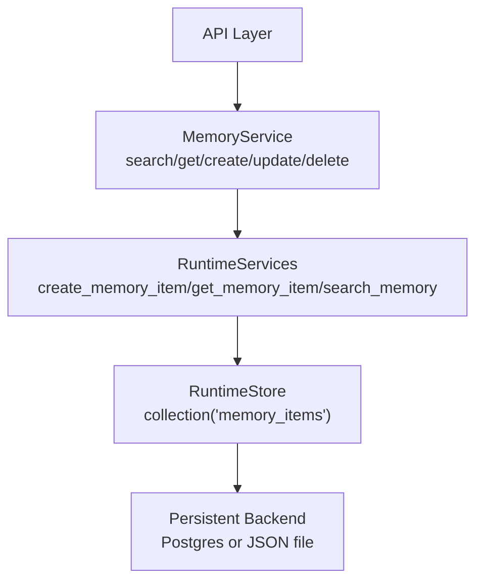
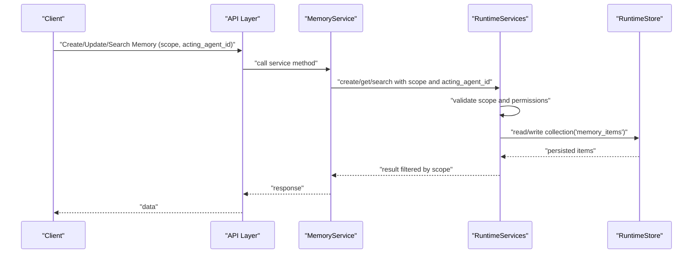

# Memory Scope Types

<cite>
**Referenced Files in This Document**
- [runtime.py](file://backend/app/runtime.py)
- [memory_service.py](file://backend/app/services/memory_service.py)
- [common.py](file://backend/app/schemas/common.py)
</cite>

## Table of Contents
1. [Introduction](#introduction)
2. [Project Structure](#project-structure)
3. [Core Components](#core-components)
4. [Architecture Overview](#architecture-overview)
5. [Detailed Component Analysis](#detailed-component-analysis)
6. [Dependency Analysis](#dependency-analysis)
7. [Performance Considerations](#performance-considerations)
8. [Troubleshooting Guide](#troubleshooting-guide)
9. [Conclusion](#conclusion)

## Introduction
This document explains the memory scope types used by the system to control visibility and lifecycle of memory items. It focuses on:
- agent-scoped: private agent state
- organization-scoped: shared organizational knowledge
- run-scoped: temporary execution context
- workflow-scoped: process-specific data
- public-scoped: shared resources

The implementation is driven by a runtime store that persists memory items and enforces scoping at read/write time, with service-layer helpers exposing simple APIs for search, get, create, update, and delete operations.

## Project Structure
Memory-related functionality relevant to scoping is implemented across:
- Runtime store and business logic for persistence and scoping enforcement
- Service layer methods that accept scope parameters
- Schemas defining request fields including scope

**Diagram sources**
- [memory_service.py:4-27](file://backend/app/services/memory_service.py#L4-L27)
- [runtime.py:258-392](file://backend/app/runtime.py#L258-L392)

**Section sources**
- [memory_service.py:4-27](file://backend/app/services/memory_service.py#L4-L27)
- [runtime.py:258-392](file://backend/app/runtime.py#L258-L392)

## Core Components
- MemoryService: thin wrappers around runtime methods; accepts scope and acting_agent_id for scoping decisions.
- RuntimeServices: orchestrates memory item creation, retrieval, and search; applies scope-based filtering and permissions.
- RuntimeStore: persistent collection backing memory_items; supports Postgres or JSON file backend.
- Schemas: define request payloads including scope field and optional filters like acting_agent_id.

Key responsibilities:
- Enforce scope constraints when creating/updating memory items
- Filter results by scope during search
- Associate memory items with organization context and optional agent identity

**Section sources**
- [memory_service.py:4-27](file://backend/app/services/memory_service.py#L4-L27)
- [common.py:164-186](file://backend/app/schemas/common.py#L164-L186)
- [common.py:206-210](file://backend/app/schemas/common.py#L206-L210)
- [runtime.py:258-392](file://backend/app/runtime.py#L258-L392)

## Architecture Overview
The following sequence shows how scoping is applied during a typical memory operation.

**Diagram sources**
- [memory_service.py:4-27](file://backend/app/services/memory_service.py#L4-L27)
- [runtime.py:258-392](file://backend/app/runtime.py#L258-L392)

## Detailed Component Analysis

### Agent-scoped Memory (Private Agent State)
Purpose:
- Store state that belongs to a specific agent instance and should not be visible to other agents or users unless explicitly allowed.

How it works:
- Create/update requests include scope set to an agent-scoped value and optionally acting_agent_id to bind the item to a particular agent.
- Search can filter by acting_agent_id to retrieve only items belonging to that agent.
- The runtime validates that the requesting user has permission to write to the agent’s scope and that the acting_agent_id matches authorization rules.

Example use cases:
- Temporary reasoning traces, tool call logs, or intermediate artifacts owned by a single agent.
- Per-agent configuration overrides or preferences.

Operational notes:
- Ensure acting_agent_id is provided when writing agent-scoped items so they are discoverable via search.
- Limit exposure by default; grant access only through explicit role or policy if cross-agent sharing is required.

**Section sources**
- [memory_service.py:4-10](file://backend/app/services/memory_service.py#L4-L10)
- [common.py:164-186](file://backend/app/schemas/common.py#L164-L186)
- [common.py:206-210](file://backend/app/schemas/common.py#L206-L210)

### Organization-scoped Memory (Shared Organizational Knowledge)
Purpose:
- Maintain knowledge that is shared across all agents and users within an organization.

How it works:
- Items are created with scope indicating organization-wide visibility.
- Search without a restrictive acting_agent_id returns organization-scoped items to authorized users.
- Role-based permissions determine who can read/write organization-scoped content.

Example use cases:
- Policies, playbooks, reference documents, and reusable templates.
- Cross-workflow insights and best practices.

Operational notes:
- Use sensitivity_level and allowed_roles to further restrict sensitive organization-scoped content.
- Keep metadata consistent to enable effective search and governance.

**Section sources**
- [memory_service.py:4-10](file://backend/app/services/memory_service.py#L4-L10)
- [common.py:164-186](file://backend/app/schemas/common.py#L164-L186)
- [common.py:206-210](file://backend/app/schemas/common.py#L206-L210)

### Run-scoped Memory (Temporary Execution Context)
Purpose:
- Hold transient data tied to a single workflow run, such as step outputs, diagnostics, or short-lived caches.

How it works:
- Items are created with a run-scoped identifier and may be associated with a specific run context.
- These items are typically short-lived and may be cleaned up after the run completes.
- Search can be constrained to the current run context to avoid leaking data across runs.

Example use cases:
- Intermediate results, debug logs, or per-run feature flags.
- Temporary prompts or tool responses that should not persist beyond the run.

Operational notes:
- Implement cleanup policies to remove run-scoped items post-execution.
- Avoid storing long-term or sensitive data in run-scoped memory.

**Section sources**
- [memory_service.py:4-10](file://backend/app/services/memory_service.py#L4-L10)
- [common.py:164-186](file://backend/app/schemas/common.py#L164-L186)
- [common.py:206-210](file://backend/app/schemas/common.py#L206-L210)

### Workflow-scoped Memory (Process-specific Data)
Purpose:
- Persist data relevant to a specific workflow definition or version, enabling reuse across multiple runs of the same workflow.

How it works:
- Items are created with a workflow-scoped identifier and may be bound to a workflow version.
- Authorized users and agents can read/write workflow-scoped items according to roles and policies.
- Search can be filtered by workflow context to retrieve process-specific artifacts.

Example use cases:
- Templates, schemas, and decision trees used by a workflow.
- Versioned artifacts and evaluation results tied to a workflow.

Operational notes:
- Tie metadata to workflow identifiers and versions for traceability.
- Apply retention policies aligned with workflow lifecycle.

**Section sources**
- [memory_service.py:4-10](file://backend/app/services/memory_service.py#L4-L10)
- [common.py:164-186](file://backend/app/schemas/common.py#L164-L186)
- [common.py:206-210](file://backend/app/schemas/common.py#L206-L210)

### Public-scoped Memory (Shared Resources)
Purpose:
- Provide broadly accessible resources that any authorized user or agent can consume, subject to general platform permissions.

How it works:
- Items are created with a public-scoped designation.
- Access is governed by baseline permissions rather than narrow scoping constraints.
- Suitable for reference material, shared catalogs, or common assets.

Example use cases:
- Shared glossaries, standard operating procedures, or public tool registries.
- Reference datasets or curated prompts available to many workflows.

Operational notes:
- Use sensitivity_level and allowed_roles to prevent unintended exposure.
- Monitor usage and maintain quality through governance processes.

**Section sources**
- [memory_service.py:4-10](file://backend/app/services/memory_service.py#L4-L10)
- [common.py:164-186](file://backend/app/schemas/common.py#L164-L186)
- [common.py:206-210](file://backend/app/schemas/common.py#L206-L210)

## Dependency Analysis
The memory scoping flow depends on:
- Service layer accepting scope and acting_agent_id
- Runtime enforcing scope validation and persistence
- Storage backend providing durable collections

**Diagram sources**
- [common.py:164-186](file://backend/app/schemas/common.py#L164-L186)
- [common.py:206-210](file://backend/app/schemas/common.py#L206-L210)
- [memory_service.py:4-27](file://backend/app/services/memory_service.py#L4-L27)
- [runtime.py:258-392](file://backend/app/runtime.py#L258-L392)

**Section sources**
- [common.py:164-186](file://backend/app/schemas/common.py#L164-L186)
- [common.py:206-210](file://backend/app/schemas/common.py#L206-L210)
- [memory_service.py:4-27](file://backend/app/services/memory_service.py#L4-L27)
- [runtime.py:258-392](file://backend/app/runtime.py#L258-L392)

## Performance Considerations
- Prefer scoped searches to reduce result sets and improve latency.
- Use metadata and sensitivity_level to constrain queries early.
- For high-throughput scenarios, ensure the storage backend is configured appropriately (e.g., Postgres) to avoid bottlenecks.

[No sources needed since this section provides general guidance]

## Troubleshooting Guide
Common issues and resolutions:
- Missing scope: Ensure every create/update includes a valid scope value.
- Incorrect acting_agent_id: Verify that the acting_agent_id corresponds to an authorized agent when using agent-scoped memory.
- Permission errors: Confirm the requesting user’s role allows read/write for the target scope.
- Visibility problems: Check sensitivity_level and allowed_roles for overly restrictive settings.

**Section sources**
- [memory_service.py:4-27](file://backend/app/services/memory_service.py#L4-L27)
- [common.py:164-186](file://backend/app/schemas/common.py#L164-L186)
- [common.py:206-210](file://backend/app/schemas/common.py#L206-L210)

## Conclusion
Memory scopes provide a clear model for controlling visibility and lifecycle of information:
- agent-scoped for private agent state
- organization-scoped for shared organizational knowledge
- run-scoped for temporary execution context
- workflow-scoped for process-specific data
- public-scoped for shared resources

By consistently applying scope values and leveraging acting_agent_id where appropriate, teams can build secure, efficient, and maintainable systems that balance isolation with collaboration.