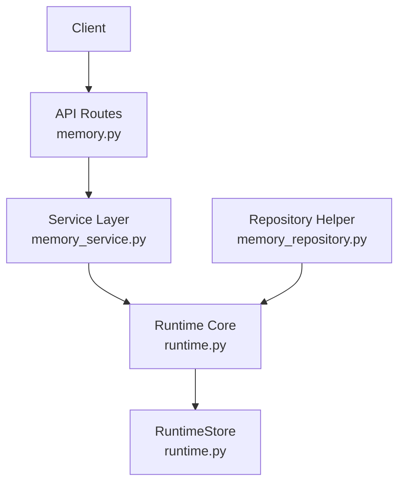
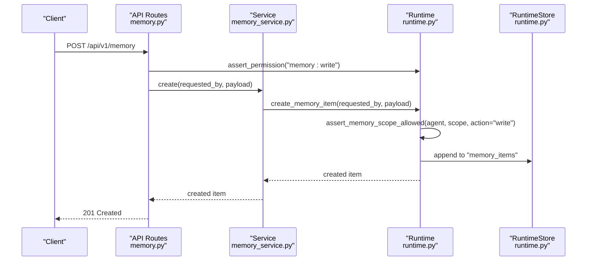
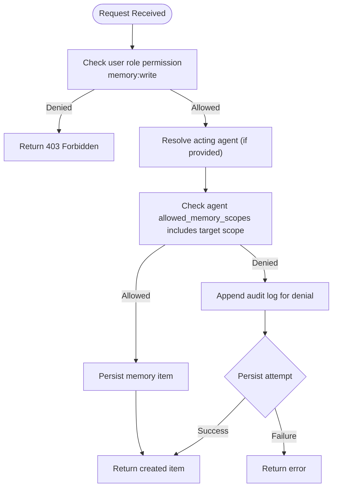
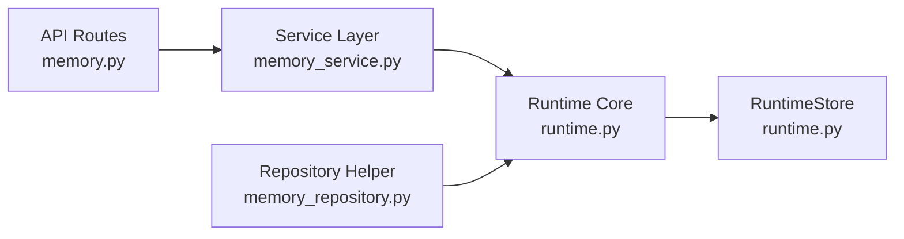

# Memory Scoping & Permissions

<cite>
**Referenced Files in This Document**
- [runtime.py](file://backend/app/runtime.py)
- [memory.py (API routes)](file://backend/app/api/v1/routes/memory.py)
- [memory_service.py](file://backend/app/services/memory_service.py)
- [memory_repository.py](file://backend/app/infrastructure/repositories/memory_repository.py)
- [permissions.py](file://backend/app/core/permissions.py)
</cite>

## Table of Contents
1. Introduction
2. Project Structure
3. Core Components
4. Architecture Overview
5. Detailed Component Analysis
6. Dependency Analysis
7. Performance Considerations
8. Troubleshooting Guide
9. Conclusion

## Introduction
This document explains the agent memory scoping and permission model for the system, focusing on how memory items are isolated by scope, who can access them, and how permissions are enforced across API endpoints and runtime services. It covers:
- Five memory scope types: agent-scoped, organization-scoped, run-scoped, workflow-scoped, and public
- Isolation boundaries and cross-scope access patterns
- Permission inheritance and enforcement
- Memory item lifecycle and audit trails
- Practical examples for configuring scopes for different agent types and use cases

The implementation is centered around a runtime service that enforces role-based permissions and agent-scoped memory policies, with API routes delegating to service methods that call into runtime logic.

## Project Structure
Memory-related functionality spans API routes, service layer, repository helper, and core runtime authorization/scoping logic:
- API routes define endpoints for listing, creating, updating, deleting, and searching memory items
- Service layer provides thin wrappers over runtime operations
- Repository helper exposes collection listing via runtime
- Runtime contains authentication, role-based permissions, agent scope checks, and memory CRUD/search implementations

**Diagram sources**
- [memory.py (API routes):1-48](file://backend/app/api/v1/routes/memory.py#L1-L48)
- [memory_service.py:1-27](file://backend/app/services/memory_service.py#L1-L27)
- [memory_repository.py:1-6](file://backend/app/infrastructure/repositories/memory_repository.py#L1-L6)
- [runtime.py:827-936](file://backend/app/runtime.py#L827-L936)

**Section sources**
- [memory.py (API routes):1-48](file://backend/app/api/v1/routes/memory.py#L1-L48)
- [memory_service.py:1-27](file://backend/app/services/memory_service.py#L1-L27)
- [memory_repository.py:1-6](file://backend/app/infrastructure/repositories/memory_repository.py#L1-L6)
- [runtime.py:827-936](file://backend/app/runtime.py#L827-L936)

## Core Components
- Role-based permissions: The runtime defines roles and their allowed permissions; an assertion helper enforces them at API entry points.
- Agent memory scopes: Each agent has an allowed set of memory scopes; write/read operations check whether the requested scope is permitted for the acting agent.
- Organization isolation: Items are scoped to an organization_id when applicable.
- Audit logging: Denied operations and key actions are recorded in the runtime store.

Key responsibilities:
- API routes enforce read/write permissions and pass context (user, optional acting agent) to services
- Services delegate to runtime for business logic and policy checks
- Runtime validates permissions, applies scope checks, persists changes, and records audits

**Section sources**
- [runtime.py:862-936](file://backend/app/runtime.py#L862-L936)
- [permissions.py:1-6](file://backend/app/core/permissions.py#L1-L6)
- [memory.py (API routes):11-48](file://backend/app/api/v1/routes/memory.py#L11-L48)
- [memory_service.py:4-27](file://backend/app/services/memory_service.py#L4-L27)

## Architecture Overview
The memory subsystem follows a layered architecture:
- API layer validates request parameters and asserts user-level permissions
- Service layer orchestrates calls to runtime
- Runtime enforces RBAC, agent scope checks, and persistence
- Storage is abstracted behind RuntimeStore (JSON file or Postgres-backed JSONB)

**Diagram sources**
- [memory.py (API routes):22-25](file://backend/app/api/v1/routes/memory.py#L22-L25)
- [memory_service.py:17-18](file://backend/app/services/memory_service.py#L17-L18)
- [runtime.py:2338-2379](file://backend/app/runtime.py#L2338-L2379)
- [runtime.py:903-936](file://backend/app/runtime.py#L903-L936)

## Detailed Component Analysis

### Memory Scope Types and Isolation
The system supports five conceptual memory scope types:
- Agent-scoped: Private to a specific agent instance
- Organization-scoped: Shared within an organization
- Run-scoped: Tied to a single workflow run
- Workflow-scoped: Shared across runs of a given workflow
- Public: Visible to all agents/users within the platform boundary

Isolation rules:
- Agents may only read/write memory items whose scope is included in their allowed_memory_scopes
- When no agent context is provided (e.g., admin API), default organization-scoped behavior applies unless otherwise specified
- Organization isolation ensures items are filtered by organization_id where applicable

Cross-scope access patterns:
- If an agent’s allowed scopes include both organization_memory and workflow_memory, it can access items in those scopes
- Access to other scopes (e.g., agent-scoped or run-scoped) requires explicit allowance in the agent configuration

Permission inheritance:
- User-level permissions (role-based) gate API access (read/write)
- Agent-level permissions (allowed_memory_scopes) gate which scopes an agent can touch
- Both must pass for an operation to succeed

Practical guidance:
- Use organization_memory for shared knowledge across agents in an org
- Use workflow_memory for artifacts relevant to a workflow’s lifetime
- Use agent-scoped for private agent state
- Use run-scoped for ephemeral data tied to a single execution
- Use public sparingly and only for non-sensitive, broadly accessible content

**Section sources**
- [runtime.py:894-936](file://backend/app/runtime.py#L894-L936)
- [runtime.py:827-830](file://backend/app/runtime.py#L827-L830)

### API Endpoints and Permission Enforcement
Endpoints:
- GET /api/v1/memory: Search/list memory items with optional query and scope filters
- POST /api/v1/memory: Create a new memory item
- GET /api/v1/memory/{id}: Retrieve a specific memory item
- PATCH /api/v1/memory/{id}: Update a memory item
- DELETE /api/v1/memory/{id}: Delete a memory item
- POST /api/v1/memory/search: Search with a structured request body

Permissions:
- Read endpoints assert "memory:read"
- Write endpoints rely on service/runtime to validate write permissions and scope allowances

Acting agent support:
- Search endpoint accepts acting_agent_id to evaluate agent-specific scope allowances during search

**Section sources**
- [memory.py (API routes):11-48](file://backend/app/api/v1/routes/memory.py#L11-L48)

### Service Layer Delegation
The service layer provides simple functions that forward requests to runtime:
- search, get, create, update, delete
- These functions accept the authenticated user and optional acting agent context

**Section sources**
- [memory_service.py:4-27](file://backend/app/services/memory_service.py#L4-L27)

### Runtime Authorization and Scope Checks
Core mechanisms:
- Role-based assertions: assert_permission(user, permission)
- Agent scope checks: assert_memory_scope_allowed(agent, scope, action, organization_id, actor_user_id)
- Allowed scopes resolution: _agent_allowed_scopes(agent) returns the union of configured scopes, with defaults for legacy agents

Audit trail:
- On denied operations due to insufficient scope, runtime appends an audit log entry and attempts to persist it

**Section sources**
- [runtime.py:862-866](file://backend/app/runtime.py#L862-L866)
- [runtime.py:894-936](file://backend/app/runtime.py#L894-L936)

### Memory Item Lifecycle
Lifecycle stages:
- Creation: Validated against user permissions and agent scope allowances; persisted to runtime store
- Retrieval: Filtered by organization and scope constraints; returned if authorized
- Update: Requires write permission and scope allowance; updates stored fields
- Deletion: Requires write permission and scope allowance; removes from store
- Search: Applies query and scope filters; respects acting agent’s allowed scopes

Persistence:
- RuntimeStore manages collections including "memory_items"
- Supports JSON file fallback and Postgres-backed JSONB storage

**Section sources**
- [runtime.py:2338-2419](file://backend/app/runtime.py#L2338-L2419)
- [runtime.py:385-392](file://backend/app/runtime.py#L385-L392)

### Access Control Lists and Role Inheritance
- Roles define coarse-grained permissions such as "memory:read" and "memory:write"
- Users inherit permissions based on their role; admins/owners have broader capabilities
- Agent configurations define fine-grained scope permissions via allowed_memory_scopes
- Combined effect: A user must have the required role permission AND the acting agent must be allowed to access the target scope

Note: There is no separate per-item ACL structure in the referenced files; access control is enforced through role-based permissions and agent scope allowances.

**Section sources**
- [runtime.py:140-222](file://backend/app/runtime.py#L140-L222)
- [runtime.py:862-866](file://backend/app/runtime.py#L862-L866)
- [runtime.py:894-936](file://backend/app/runtime.py#L894-L936)

### Audit Trails
- Denials due to insufficient agent scope are logged with details about the attempted action, scope, agent ID, and allowed scopes
- Other operational events (e.g., login, logout, token refresh) are also audited in the runtime

**Section sources**
- [runtime.py:918-936](file://backend/app/runtime.py#L918-L936)
- [runtime.py:957-959](file://backend/app/runtime.py#L957-L959)
- [runtime.py:973-975](file://backend/app/runtime.py#L973-L975)

### Conceptual Overview
The following diagram illustrates the end-to-end flow for a memory creation request, highlighting permission and scope checks.

[No sources needed since this diagram shows conceptual workflow, not actual code structure]

## Dependency Analysis
The memory subsystem depends on:
- API routes depending on service layer
- Service layer depending on runtime
- Runtime depending on RuntimeStore and internal helpers for permissions and auditing

**Diagram sources**
- [memory.py (API routes):1-48](file://backend/app/api/v1/routes/memory.py#L1-L48)
- [memory_service.py:1-27](file://backend/app/services/memory_service.py#L1-L27)
- [memory_repository.py:1-6](file://backend/app/infrastructure/repositories/memory_repository.py#L1-L6)
- [runtime.py:385-392](file://backend/app/runtime.py#L385-L392)

**Section sources**
- [memory.py (API routes):1-48](file://backend/app/api/v1/routes/memory.py#L1-L48)
- [memory_service.py:1-27](file://backend/app/services/memory_service.py#L1-L27)
- [memory_repository.py:1-6](file://backend/app/infrastructure/repositories/memory_repository.py#L1-L6)
- [runtime.py:385-392](file://backend/app/runtime.py#L385-L392)

## Performance Considerations
- Keep allowed_memory_scopes minimal per agent to reduce evaluation overhead
- Prefer organization-scoped memory for frequently accessed shared knowledge to avoid excessive cross-scope lookups
- Use search filters (query, scope) to limit result sets
- Ensure persistence backend (Postgres vs JSON file) is chosen appropriately for scale

[No sources needed since this section provides general guidance]

## Troubleshooting Guide
Common issues and resolutions:
- 403 Forbidden on memory operations: Verify user role includes "memory:read" or "memory:write" as appropriate
- Scope denied errors: Confirm the acting agent’s allowed_memory_scopes includes the target scope; adjust agent configuration accordingly
- Missing organization isolation: Ensure items are tagged with organization_id and queries filter by organization context
- Audit logs missing: Check persistence availability; runtime attempts to save audit entries but may fail silently if storage is unavailable

**Section sources**
- [runtime.py:862-866](file://backend/app/runtime.py#L862-L866)
- [runtime.py:918-936](file://backend/app/runtime.py#L918-L936)

## Conclusion
The memory scoping and permission model combines role-based access control with agent-scoped policies to ensure robust isolation and controlled sharing of memory items. By aligning user permissions with agent scope allowances, the system provides clear boundaries for data access while supporting flexible collaboration patterns across organizations, workflows, and runs. Proper configuration of agent allowed_memory_scopes and careful use of scope types enables secure and efficient memory usage tailored to diverse agent roles and use cases.