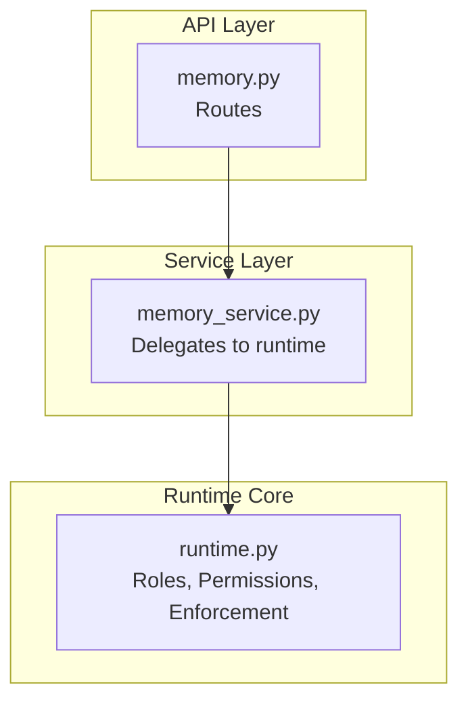
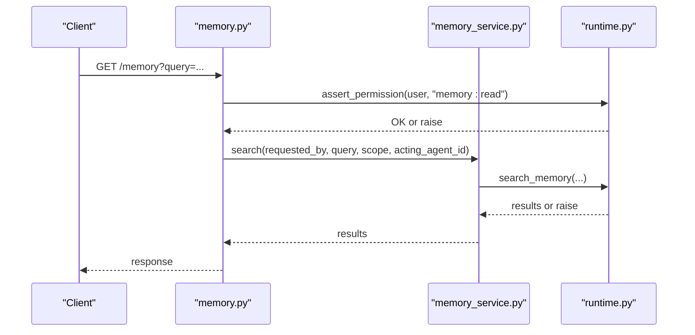
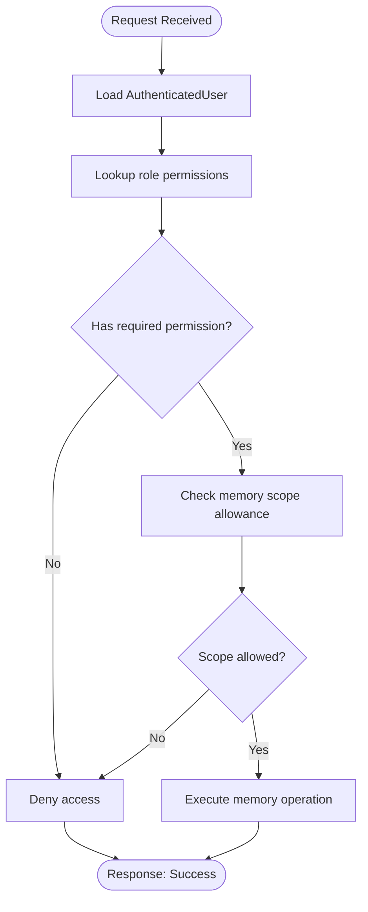
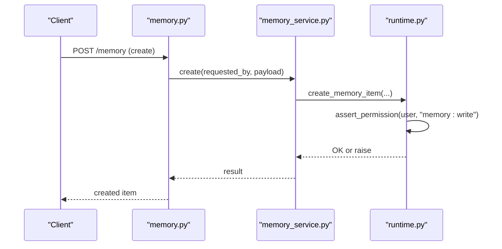
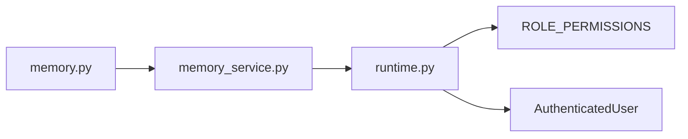

# Permission Model & Access Control

<cite>
**Referenced Files in This Document**
- [runtime.py](file://backend/app/runtime.py)
- [memory.py](file://backend/app/api/v1/routes/memory.py)
- [memory_service.py](file://backend/app/services/memory_service.py)
</cite>

## Table of Contents
1. [Introduction](#introduction)
2. [Project Structure](#project-structure)
3. [Core Components](#core-components)
4. [Architecture Overview](#architecture-overview)
5. [Detailed Component Analysis](#detailed-component-analysis)
6. [Dependency Analysis](#dependency-analysis)
7. [Performance Considerations](#performance-considerations)
8. [Troubleshooting Guide](#troubleshooting-guide)
9. [Conclusion](#conclusion)

## Introduction
This document explains the permission model for memory access, focusing on role-based access control (RBAC), fine-grained permissions, and inheritance patterns. It details how permissions are evaluated, enforced, and scoped across memory operations such as read, write, update, delete, and search. The system uses a centralized runtime to enforce authorization checks at API boundaries and within service methods, ensuring consistent security policies across all memory-related endpoints.

## Project Structure
The memory permission enforcement spans three primary layers:
- API routes that declare required permissions per endpoint
- Service layer that delegates to the runtime for authorization and data operations
- Runtime core that defines roles, permissions, and enforcement logic

**Diagram sources**
- [memory.py:1-48](file://backend/app/api/v1/routes/memory.py#L1-L48)
- [memory_service.py:1-27](file://backend/app/services/memory_service.py#L1-L27)
- [runtime.py:130-222](file://backend/app/runtime.py#L130-L222)

**Section sources**
- [memory.py:1-48](file://backend/app/api/v1/routes/memory.py#L1-L48)
- [memory_service.py:1-27](file://backend/app/services/memory_service.py#L1-L27)
- [runtime.py:130-222](file://backend/app/runtime.py#L130-L222)

## Core Components
- AuthenticatedUser: Represents the identity and role of the caller used for authorization decisions.
- ROLE_PERMISSIONS: Central mapping of roles to sets of fine-grained permissions.
- Runtime assertion helpers: Methods that check whether a user has the required permission before allowing an operation.
- Memory services: Thin wrappers around runtime methods that perform memory operations after permission checks.

Key responsibilities:
- Define roles and their allowed permissions
- Enforce permission checks at API entry points
- Apply scope-based restrictions for memory access
- Provide clear error behavior when permissions are insufficient

**Section sources**
- [runtime.py:130-222](file://backend/app/runtime.py#L130-L222)
- [memory_service.py:1-27](file://backend/app/services/memory_service.py#L1-L27)

## Architecture Overview
The authorization flow for memory operations is layered:
- API routes assert coarse permissions (e.g., memory:read)
- Services delegate to runtime methods that may perform additional checks
- Runtime enforces RBAC and scope constraints before executing memory operations

**Diagram sources**
- [memory.py:11-19](file://backend/app/api/v1/routes/memory.py#L11-L19)
- [memory_service.py:4-10](file://backend/app/services/memory_service.py#L4-L10)
- [runtime.py:2338-2427](file://backend/app/runtime.py#L2338-L2427)

## Detailed Component Analysis

### Role-Based Access Control (RBAC)
- Roles define coarse-grained capabilities. Each role maps to a set of fine-grained permissions.
- Example roles include owner, admin, manager, operator, reviewer, viewer, and service_account.
- Fine-grained permissions follow a resource:action pattern (e.g., memory:read, memory:write).

Memory-specific permissions by role:
- owner: includes "*" which grants all permissions
- admin: includes memory:read and memory:write
- manager: includes memory:read and memory:write
- operator: includes memory:read and memory:write
- reviewer: includes memory:read only
- viewer: includes memory:read only
- service_account: includes memory:read and memory:write

Inheritance patterns:
- The owner role uses a wildcard permission ("*") to implicitly allow all actions.
- Other roles inherit specific permissions via explicit membership in their sets.
- Some enforcement paths also treat certain roles (e.g., owner, admin) specially for privileged operations.

**Section sources**
- [runtime.py:130-222](file://backend/app/runtime.py#L130-L222)

### Fine-Grained Permissions
- Permissions are granular strings like memory:read and memory:write.
- API routes explicitly assert the required permission for each endpoint.
- Read-only endpoints assert memory:read; mutating endpoints rely on service/runtime checks for memory:write.

Examples:
- Search and detail endpoints assert memory:read
- Create/update/delete endpoints proceed through services that enforce write permissions internally

**Section sources**
- [memory.py:11-48](file://backend/app/api/v1/routes/memory.py#L11-L48)
- [memory_service.py:1-27](file://backend/app/services/memory_service.py#L1-L27)

### Scope-Based Access Control for Memory
- Beyond RBAC, memory access can be constrained by scopes.
- The runtime provides a method to assert whether a given scope is allowed for the current actor.
- Agents may have configured allowed memory scopes; attempts to operate outside these scopes are denied.

Typical enforcement:
- Before performing memory writes or reads, the runtime validates that the requested scope is permitted for the actor.
- If the scope is not allowed, the operation is rejected.

**Section sources**
- [runtime.py:902-910](file://backend/app/runtime.py#L902-L910)
- [runtime.py:1973-1973](file://backend/app/runtime.py#L1973-L1973)

### Permission Evaluation Flow
At runtime, permission evaluation follows this sequence:
1. Extract the authenticated user and their role from the request context.
2. Look up the role’s permission set in the central mapping.
3. Check if the required permission is present or if a wildcard applies.
4. For memory operations, additionally validate scope allowances.
5. Proceed with the operation if all checks pass; otherwise, deny.

**Diagram sources**
- [runtime.py:130-222](file://backend/app/runtime.py#L130-L222)
- [runtime.py:902-910](file://backend/app/runtime.py#L902-L910)

### API-Level Enforcement
- Routes assert memory:read for listing, searching, and retrieving memory items.
- Mutating routes (create, update, delete) rely on service/runtime enforcement for memory:write.
- Acting agent context can be passed through requests to support agent-scoped operations.

**Diagram sources**
- [memory.py:22-24](file://backend/app/api/v1/routes/memory.py#L22-L24)
- [memory_service.py:17-18](file://backend/app/services/memory_service.py#L17-L18)
- [runtime.py:2338-2346](file://backend/app/runtime.py#L2338-L2346)

### Inheritance Patterns Across Roles
- Wildcard ownership: owner role includes "*" to implicitly allow all permissions.
- Explicit inclusion: other roles list exact permissions they need.
- Special handling: some enforcement paths treat owner/admin as privileged, bypassing certain checks unless overridden by explicit policy.

Implications:
- Adding new roles requires defining their permission sets explicitly.
- Introducing new resources/actions involves updating the central mapping and route assertions.

**Section sources**
- [runtime.py:130-222](file://backend/app/runtime.py#L130-L222)

## Dependency Analysis
The following diagram shows how components depend on each other for permission enforcement:

**Diagram sources**
- [memory.py:1-48](file://backend/app/api/v1/routes/memory.py#L1-L48)
- [memory_service.py:1-27](file://backend/app/services/memory_service.py#L1-L27)
- [runtime.py:130-222](file://backend/app/runtime.py#L130-L222)

**Section sources**
- [memory.py:1-48](file://backend/app/api/v1/routes/memory.py#L1-L48)
- [memory_service.py:1-27](file://backend/app/services/memory_service.py#L1-L27)
- [runtime.py:130-222](file://backend/app/runtime.py#L130-L222)

## Performance Considerations
- Permission lookups are simple dictionary/set checks against a small in-memory mapping, resulting in O(1) time complexity.
- No persistent caching is implemented for permissions; evaluations occur per request.
- Scope checks add minimal overhead but ensure precise access control.
- To optimize further, consider precomputing effective permissions per user if needed, though current design favors simplicity and correctness.

[No sources needed since this section provides general guidance]

## Troubleshooting Guide
Common issues and resolutions:
- Insufficient permissions: Ensure the user’s role includes the required permission (e.g., memory:read or memory:write).
- Scope violations: Verify that the actor’s allowed memory scopes include the target scope.
- Agent-scoped operations: Confirm that acting_agent_id is correctly provided and that the agent has appropriate permissions and scopes.

Where to inspect:
- Role definitions and permissions in the central mapping
- Route-level permission assertions
- Service-to-runtime delegation for memory operations
- Scope assertion logic in the runtime

**Section sources**
- [runtime.py:130-222](file://backend/app/runtime.py#L130-L222)
- [memory.py:11-48](file://backend/app/api/v1/routes/memory.py#L11-L48)
- [memory_service.py:1-27](file://backend/app/services/memory_service.py#L1-L27)

## Conclusion
The permission model for memory access combines RBAC with fine-grained permissions and scope-based controls. Authorization is enforced at API boundaries and within the runtime, ensuring consistent and secure access across all memory operations. Roles map to explicit permission sets, with owner having wildcard privileges. Scopes provide an additional layer of control, particularly important for agent-driven workflows. This design balances clarity, extensibility, and security while maintaining straightforward performance characteristics.