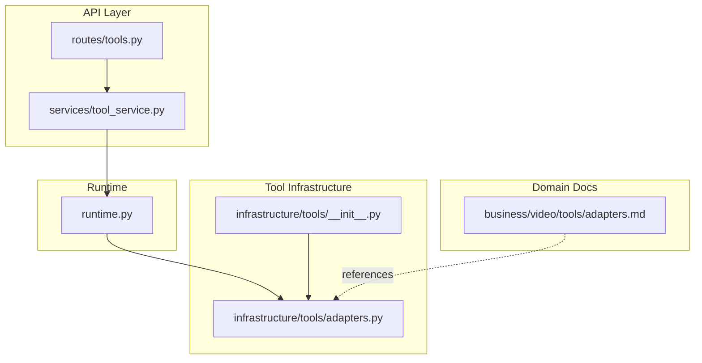
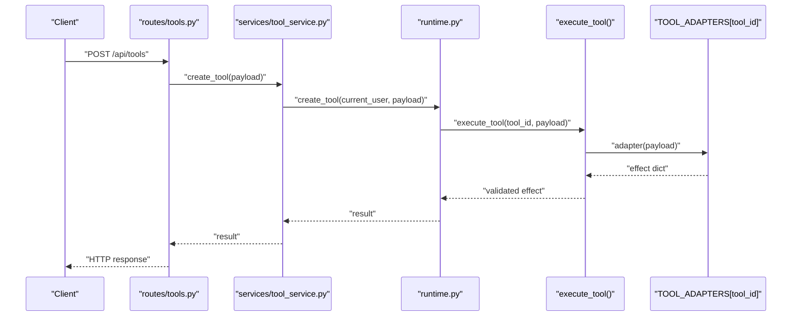
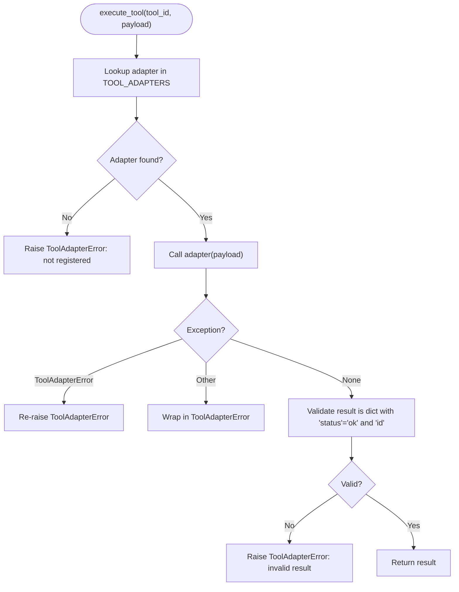
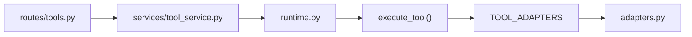

# Custom Tool Development

<cite>
**Referenced Files in This Document**
- [adapters.py](file://backend/app/infrastructure/tools/adapters.py)
- [__init__.py](file://backend/app/infrastructure/tools/__init__.py)
- [tools.py](file://backend/app/api/v1/routes/tools.py)
- [tool_service.py](file://backend/app/services/tool_service.py)
- [runtime.py](file://backend/app/runtime.py)
- [adapters.md](file://business/video/tools/adapters.md)
</cite>

## Table of Contents
1. Introduction
2. Project Structure
3. Core Components
4. Architecture Overview
5. Detailed Component Analysis
6. Dependency Analysis
7. Performance Considerations
8. Troubleshooting Guide
9. Conclusion

## Introduction
This document explains how to create custom tool adapters for the system, including the required function signature, payload handling, result formatting, and registration process. It provides step-by-step examples aligned with existing patterns and demonstrates real-world integration points used by video production agents. You will learn how to:
- Implement a new adapter function that accepts a payload and returns a standardized effect record
- Register your adapter in the TOOL_ADAPTERS dictionary
- Handle authentication and external API calls safely
- Use ToolAdapterError for consistent error signaling
- Ensure consistent effect payload structures consumed by the runtime

## Project Structure
The tooling subsystem is organized around a small set of focused modules:
- Adapters define concrete tool implementations and register them in a central registry
- The runtime invokes adapters through a unified execution entry point
- Services and routes expose management APIs for tools (list, get, create, update status, archive)
- Video domain documentation outlines CI-safe stubs and future integrations

**Diagram sources**
- [tools.py:1-36](file://backend/app/api/v1/routes/tools.py#L1-L36)
- [tool_service.py:1-22](file://backend/app/services/tool_service.py#L1-L22)
- [runtime.py:1397-1408](file://backend/app/runtime.py#L1397-L1408)
- [adapters.py:142-177](file://backend/app/infrastructure/tools/adapters.py#L142-L177)
- [__init__.py:1-4](file://backend/app/infrastructure/tools/__init__.py#L1-L4)
- [adapters.md:1-17](file://business/video/tools/adapters.md#L1-L17)

**Section sources**
- [tools.py:1-36](file://backend/app/api/v1/routes/tools.py#L1-L36)
- [tool_service.py:1-22](file://backend/app/services/tool_service.py#L1-L22)
- [adapters.py:142-177](file://backend/app/infrastructure/tools/adapters.py#L142-L177)
- [__init__.py:1-4](file://backend/app/infrastructure/tools/__init__.py#L1-L4)
- [adapters.md:1-17](file://business/video/tools/adapters.md#L1-L17)

## Core Components
- Adapter functions: Each tool is implemented as a function that takes a payload dict and returns an effect dict with a standardized structure.
- Registry: TOOL_ADAPTERS maps tool_id strings to adapter callables.
- Execution entry point: execute_tool resolves the adapter by tool_id, enforces contracts, and wraps errors.
- Error type: ToolAdapterError signals invalid registrations, failures, or malformed results.
- Effect helper: _effect builds consistent records with id, tool_id, action, status, input, result, created_at.

Key responsibilities:
- Payload handling: Read fields from payload; provide safe defaults where appropriate.
- Result formatting: Return a dict with status "ok" and a unique id field.
- Error handling: Raise ToolAdapterError on contract violations or unexpected exceptions.

**Section sources**
- [adapters.py:18-27](file://backend/app/infrastructure/tools/adapters.py#L18-L27)
- [adapters.py:142-177](file://backend/app/infrastructure/tools/adapters.py#L142-L177)

## Architecture Overview
The runtime orchestrates tool execution via a single entry point. Adapters are resolved from the registry and invoked with a normalized payload. Results are validated against the effect contract before being returned to callers.

**Diagram sources**
- [tools.py:17-19](file://backend/app/api/v1/routes/tools.py#L17-L19)
- [tool_service.py:12-13](file://backend/app/services/tool_service.py#L12-L13)
- [runtime.py:1408-1408](file://backend/app/runtime.py#L1408-L1408)
- [adapters.py:164-176](file://backend/app/infrastructure/tools/adapters.py#L164-L176)

## Detailed Component Analysis

### Adapter Contract and Function Signature
- Input: A Python dict representing the tool’s payload.
- Output: A dict conforming to the effect schema:
  - Required keys: id, tool_id, action, status, input, result, created_at
  - status must be "ok" for successful outcomes
  - id must be present and unique per effect
- Helper: Use the internal _effect helper to build consistent records.

Example patterns in the codebase:
- audit_log_writer, crm, billing_system, email, contract_parser, policy_retriever
- Video domain stubs: video_media_gen_stub, video_script_format, video_qc_stub, video_package_stub

Implementation checklist:
- Accept payload dict
- Extract needed fields with safe defaults
- Build result payload specific to the tool
- Return _effect(...) with correct tool_id and action
- Keep side effects deterministic for CI stubs; external calls should be isolated behind this layer

**Section sources**
- [adapters.py:18-27](file://backend/app/infrastructure/tools/adapters.py#L18-L27)
- [adapters.py:30-141](file://backend/app/infrastructure/tools/adapters.py#L30-L141)

### Registration in TOOL_ADAPTERS
- Add a new mapping entry in TOOL_ADAPTERS keyed by tool_id pointing to your adapter callable.
- Ensure the key matches the tool_id used by workflows and agents.
- Domain documentation indicates registration locations and permissions files.

Best practices:
- Keep tool_id stable and descriptive
- Group related adapters under consistent naming conventions
- Update domain docs when adding new video-related adapters

**Section sources**
- [adapters.py:142-154](file://backend/app/infrastructure/tools/adapters.py#L142-L154)
- [adapters.md:1-17](file://business/video/tools/adapters.md#L1-L17)

### Execution Entry Point and Validation
- execute_tool looks up the adapter by tool_id
- Invokes the adapter with a normalized payload
- Catches and re-raises ToolAdapterError for known issues
- Wraps unexpected exceptions into ToolAdapterError
- Validates the returned dict has status "ok" and contains id

**Diagram sources**
- [adapters.py:164-176](file://backend/app/infrastructure/tools/adapters.py#L164-L176)

**Section sources**
- [adapters.py:156-176](file://backend/app/infrastructure/tools/adapters.py#L156-L176)

### Error Handling with ToolAdapterError
Use ToolAdapterError to signal:
- Missing adapter registration
- Adapter failures (unexpected exceptions)
- Invalid result shapes

Guidelines:
- Prefer raising ToolAdapterError early for validation failures
- Preserve context by wrapping underlying exceptions
- Avoid swallowing errors; ensure they propagate to the runtime

**Section sources**
- [adapters.py:156-176](file://backend/app/infrastructure/tools/adapters.py#L156-L176)

### Authentication and External API Calls
- Authentication is enforced at the API and runtime layers before invoking tool logic.
- For external API calls inside adapters:
  - Isolate network calls within the adapter
  - Handle timeouts and retries outside the adapter if needed
  - Never leak secrets; use environment configuration managed by the runtime
  - Maintain deterministic behavior for CI stubs; replace with real providers later

Integration notes:
- The runtime asserts permissions prior to tool operations
- Services delegate to runtime methods which orchestrate execution

**Section sources**
- [tools.py:11-19](file://backend/app/api/v1/routes/tools.py#L11-L19)
- [tool_service.py:1-22](file://backend/app/services/tool_service.py#L1-L22)
- [runtime.py:1397-1408](file://backend/app/runtime.py#L1397-L1408)

### Consistent Effect Payload Structures
All adapters should return effect records built via the helper to guarantee consistency:
- id: Unique identifier for the effect
- tool_id: The adapter’s tool_id
- action: Human-readable operation name
- status: "ok" for success
- input: The original payload passed to the adapter
- result: Tool-specific output data
- created_at: ISO timestamp

This ensures downstream systems can reliably consume and audit tool effects.

**Section sources**
- [adapters.py:18-27](file://backend/app/infrastructure/tools/adapters.py#L18-L27)

### Step-by-Step Example: Adding a New Tool Adapter
Follow these steps to implement a new tool:

1. Define the adapter function
   - Signature: def my_adapter(payload: dict[str, Any]) -> dict[str, Any]
   - Read fields from payload with safe defaults
   - Build a tool-specific result dict
   - Return _effect("my_tool", "do_something", payload, result)

2. Register the adapter
   - Add "my_tool": my_adapter to TOOL_ADAPTERS

3. Validate the effect shape
   - Ensure returned dict includes id, tool_id, action, status="ok", input, result, created_at

4. Integrate with workflows
   - Reference tool_id in workflow definitions and agent prompts
   - Ensure permissions and governance settings allow usage

5. Test locally and in CI
   - For CI-safe stubs, avoid external calls
   - Replace stubs with real provider calls after validation

6. Update documentation
   - Reflect new tool in domain docs and permission registries as needed

**Section sources**
- [adapters.py:18-27](file://backend/app/infrastructure/tools/adapters.py#L18-L27)
- [adapters.py:142-154](file://backend/app/infrastructure/tools/adapters.py#L142-L154)
- [adapters.md:1-17](file://business/video/tools/adapters.md#L1-L17)

### Real-World Integration Patterns: Video Production Agents
The video domain includes several CI-safe stubs demonstrating common patterns:
- Media generation stub: Produces deterministic asset URIs and metadata
- Script formatting: Normalizes content into a structured format
- Quality control stub: Returns pass/fail and checks performed
- Packaging stub: Aggregates artifacts and sets approval states

These stubs illustrate how to:
- Generate stable IDs and timestamps
- Provide meaningful default values
- Keep outputs consumable by downstream packaging and approval steps

Future work:
- Replace stubs with real providers (e.g., media generation, TTS) while preserving the same effect contract

**Section sources**
- [adapters.py:96-141](file://backend/app/infrastructure/tools/adapters.py#L96-L141)
- [adapters.md:1-17](file://business/video/tools/adapters.md#L1-L17)

## Dependency Analysis
The following diagram shows how components depend on each other during tool execution and management.

**Diagram sources**
- [tools.py:1-36](file://backend/app/api/v1/routes/tools.py#L1-L36)
- [tool_service.py:1-22](file://backend/app/services/tool_service.py#L1-L22)
- [runtime.py:1397-1408](file://backend/app/runtime.py#L1397-L1408)
- [adapters.py:142-177](file://backend/app/infrastructure/tools/adapters.py#L142-L177)

**Section sources**
- [tools.py:1-36](file://backend/app/api/v1/routes/tools.py#L1-L36)
- [tool_service.py:1-22](file://backend/app/services/tool_service.py#L1-L22)
- [runtime.py:1397-1408](file://backend/app/runtime.py#L1397-L1408)
- [adapters.py:142-177](file://backend/app/infrastructure/tools/adapters.py#L142-L177)

## Performance Considerations
- Keep adapter functions lightweight and synchronous; offload long-running tasks to background workers if necessary.
- Avoid heavy computations inside adapters; precompute or cache where possible.
- Use deterministic stubs in CI to speed up tests and reduce flakiness.
- Batch external API calls when feasible and respect rate limits.

## Troubleshooting Guide
Common issues and resolutions:
- No adapter registered for tool: Verify the tool_id exists in TOOL_ADAPTERS and is spelled correctly.
- Adapter failed: Check for unhandled exceptions inside the adapter; wrap expected failures with ToolAdapterError.
- Adapter returned invalid result: Ensure the returned dict includes id and status "ok".
- Permission errors: Confirm the current user has required permissions before invoking tool operations.

Operational tips:
- Log inputs and outputs at the adapter boundary for observability
- Include actionable messages in ToolAdapterError to aid debugging
- Use consistent naming for actions and statuses across adapters

**Section sources**
- [adapters.py:156-176](file://backend/app/infrastructure/tools/adapters.py#L156-L176)
- [tools.py:11-19](file://backend/app/api/v1/routes/tools.py#L11-L19)

## Conclusion
By adhering to the adapter contract, registering tools in TOOL_ADAPTERS, and using ToolAdapterError for robust error signaling, you can integrate new capabilities consistently and safely. The video domain stubs demonstrate practical patterns for building CI-friendly adapters that can evolve into production-grade integrations without changing the control-plane contract.