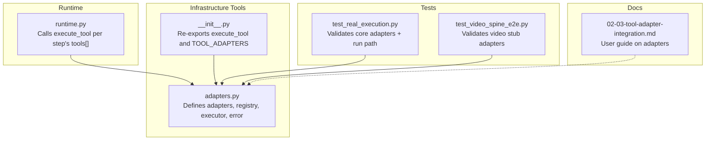
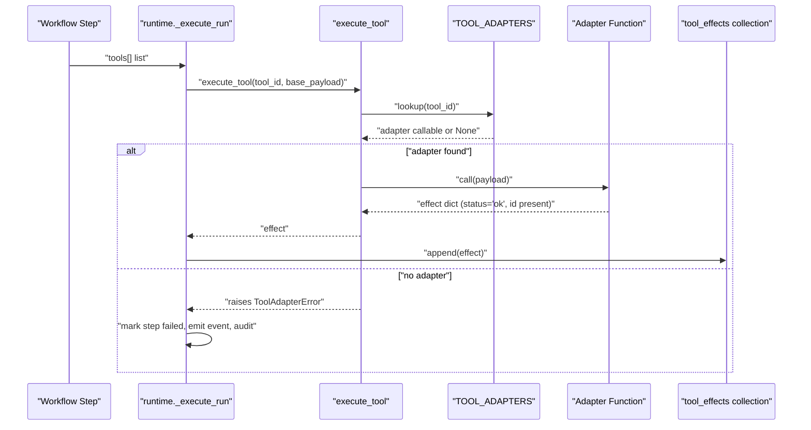
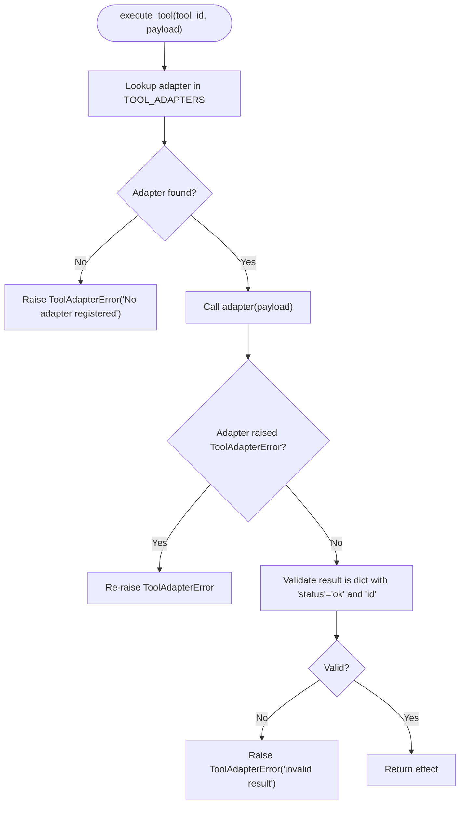
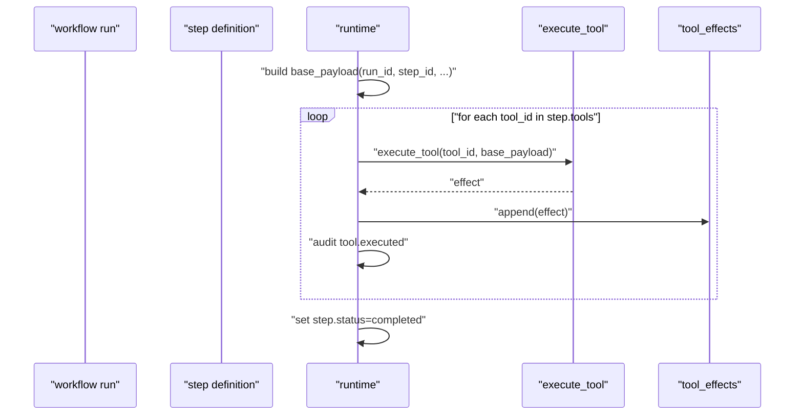
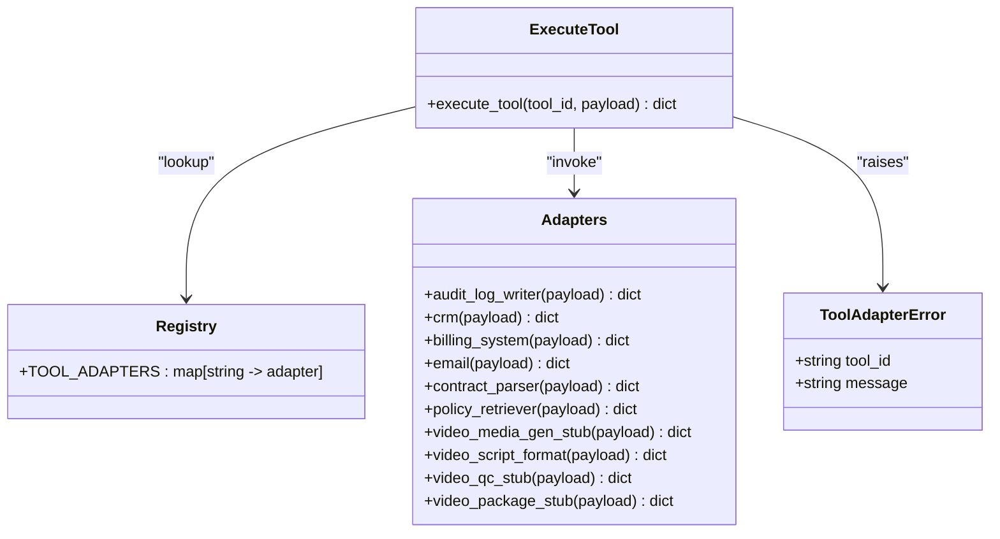
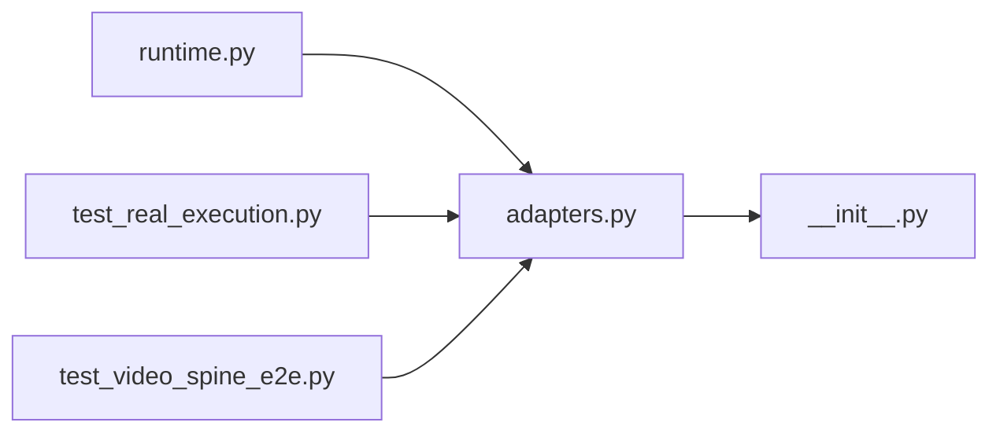

# Tool Adapter Architecture

<cite>
**Referenced Files in This Document**
- [adapters.py](file://backend/app/infrastructure/tools/adapters.py)
- [__init__.py](file://backend/app/infrastructure/tools/__init__.py)
- [runtime.py](file://backend/app/runtime.py)
- [test_real_execution.py](file://backend/app/tests/unit/test_real_execution.py)
- [test_video_spine_e2e.py](file://backend/app/tests/unit/test_video_spine_e2e.py)
- [02-03-tool-adapter-integration.md](file://book/user_guide/chapters/02-03-tool-adapter-integration.md)
</cite>

## Table of Contents
1. Introduction
2. Project Structure
3. Core Components
4. Architecture Overview
5. Detailed Component Analysis
6. Dependency Analysis
7. Performance Considerations
8. Troubleshooting Guide
9. Conclusion

## Introduction
This document explains the tool adapter architecture used to execute side-effecting operations within workflow steps. It covers the adapter pattern implementation, registration via a central registry, execution flow through a single entry point, the effect payload structure, status handling, and error management patterns. Built-in adapters include audit logging, CRM, billing, email, contract parsing, policy retrieval, and video processing stubs. The exception class for adapter errors and its usage patterns are also documented.

## Project Structure
The tool adapter subsystem is implemented under the infrastructure tools module and integrated into the runtime execution engine. Tests validate both core business adapters and video processing stubs.

**Diagram sources**
- [adapters.py:142-177](file://backend/app/infrastructure/tools/adapters.py#L142-L177)
- [__init__.py:1-4](file://backend/app/infrastructure/tools/__init__.py#L1-L4)
- [runtime.py:2093-2141](file://backend/app/runtime.py#L2093-L2141)
- [test_real_execution.py:22-28](file://backend/app/tests/unit/test_real_execution.py#L22-L28)
- [test_video_spine_e2e.py:43-53](file://backend/app/tests/unit/test_video_spine_e2e.py#L43-L53)
- [02-03-tool-adapter-integration.md:27-44](file://book/user_guide/chapters/02-03-tool-adapter-integration.md#L27-L44)

**Section sources**
- [adapters.py:1-177](file://backend/app/infrastructure/tools/adapters.py#L1-177)
- [__init__.py:1-4](file://backend/app/infrastructure/tools/__init__.py#L1-L4)
- [runtime.py:2093-2141](file://backend/app/runtime.py#L2093-L2141)
- [test_real_execution.py:1-73](file://backend/app/tests/unit/test_real_execution.py#L1-L73)
- [test_video_spine_e2e.py:1-166](file://backend/app/tests/unit/test_video_spine_e2e.py#L1-L166)
- [02-03-tool-adapter-integration.md:1-798](file://book/user_guide/chapters/02-03-tool-adapter-integration.md#L1-L798)

## Core Components
- Adapter functions: Each adapter is a function that accepts a payload and returns an effect record with a standardized shape.
- Registry: A dictionary mapping tool IDs to adapter callables.
- Executor: A single function that resolves an adapter by ID, invokes it, validates the result, and raises a typed error on failure.
- Error type: A dedicated exception class carrying context about the failing tool.

Key responsibilities:
- Adapters produce durable effect payloads capturing input, output, timestamps, and identifiers.
- The executor enforces consistent validation and error semantics across all adapters.
- The runtime orchestrates adapter calls per workflow step and persists effects and audit events.

**Section sources**
- [adapters.py:18-27](file://backend/app/infrastructure/tools/adapters.py#L18-L27)
- [adapters.py:142-154](file://backend/app/infrastructure/tools/adapters.py#L142-L154)
- [adapters.py:156-177](file://backend/app/infrastructure/tools/adapters.py#L156-L177)
- [runtime.py:2093-2141](file://backend/app/runtime.py#L2093-L2141)

## Architecture Overview
The adapter pattern decouples workflow steps from external systems. Steps declare allowed tools; the runtime executes them through a centralized executor that looks up registered adapters and records durable effects.

**Diagram sources**
- [runtime.py:2093-2141](file://backend/app/runtime.py#L2093-L2141)
- [adapters.py:142-177](file://backend/app/infrastructure/tools/adapters.py#L142-L177)

## Detailed Component Analysis

### Effect Payload Structure
Every adapter returns a normalized effect record containing:
- Unique identifier
- Tool identifier
- Action label
- Status indicator
- Input snapshot
- Result payload
- Timestamp

This structure ensures durability and auditability across the system.

**Section sources**
- [adapters.py:18-27](file://backend/app/infrastructure/tools/adapters.py#L18-L27)

### Registration Mechanism (TOOL_ADAPTERS)
Adapters are registered in a central dictionary keyed by tool ID. The runtime relies on this registry to resolve and invoke adapters.

- Built-in registrations include:
  - audit_log_writer
  - crm
  - billing_system
  - email
  - contract_parser
  - policy_retriever
  - video_media_gen_stub
  - video_script_format
  - video_qc_stub
  - video_package_stub

Adding a new adapter requires defining a function and registering it under a unique tool ID.

**Section sources**
- [adapters.py:142-154](file://backend/app/infrastructure/tools/adapters.py#L142-L154)

### Execution Flow (execute_tool)
The executor performs:
- Lookup by tool ID
- Invocation of the adapter
- Validation of the returned effect (must be a dict with status and id)
- Raising a typed error on any mismatch or unexpected exception

**Diagram sources**
- [adapters.py:156-177](file://backend/app/infrastructure/tools/adapters.py#L156-L177)

**Section sources**
- [adapters.py:156-177](file://backend/app/infrastructure/tools/adapters.py#L156-L177)

### Built-in Adapters

#### Audit Log Writer
- Purpose: Append immutable audit entries for compliance and governance.
- Behavior: Produces an effect with a generated ID and timestamp.

**Section sources**
- [adapters.py:30-37](file://backend/app/infrastructure/tools/adapters.py#L30-L37)

#### CRM
- Purpose: Create customer records with minimal fields and a created-at timestamp.
- Behavior: Returns an effect describing the created record.

**Section sources**
- [adapters.py:40-48](file://backend/app/infrastructure/tools/adapters.py#L40-L48)

#### Billing System
- Purpose: Activate billing with invoice-like metadata.
- Behavior: Returns an effect indicating activation status and amounts.

**Section sources**
- [adapters.py:50-60](file://backend/app/infrastructure/tools/adapters.py#L50-L60)

#### Email
- Purpose: Queue outbound messages with template references.
- Behavior: Returns an effect with message metadata and queued status.

**Section sources**
- [adapters.py:62-72](file://backend/app/infrastructure/tools/adapters.py#L62-L72)

#### Contract Parser
- Purpose: Parse contracts and extract clauses and exceptions.
- Behavior: Returns an effect summarizing parsed content.

**Section sources**
- [adapters.py:74-83](file://backend/app/infrastructure/tools/adapters.py#L74-L83)

#### Policy Retriever
- Purpose: Retrieve applicable policies and rules.
- Behavior: Returns an effect listing matched rules and sources.

**Section sources**
- [adapters.py:85-93](file://backend/app/infrastructure/tools/adapters.py#L85-L93)

#### Video Processing Tools (Stubs)
- video_media_gen_stub: Generates a media asset artifact reference.
- video_script_format: Formats scripts into a lightweight structure.
- video_qc_stub: Performs quality checks and scoring.
- video_package_stub: Packages deliverables for downstream use.

All return standardized effects suitable for CI-safe testing without external dependencies.

**Section sources**
- [adapters.py:95-140](file://backend/app/infrastructure/tools/adapters.py#L95-L140)

### ToolAdapterError Exception Class
A dedicated exception carries:
- tool_id: The adapter that failed
- message: Human-readable reason

Usage patterns:
- Raised when no adapter is registered for a tool ID
- Re-raised if an adapter explicitly raises it
- Wrapped around unexpected exceptions to preserve original cause
- Used to signal invalid adapter results

**Section sources**
- [adapters.py:156-177](file://backend/app/infrastructure/tools/adapters.py#L156-L177)

### Integration with Workflow Runtime
During step execution:
- The runtime constructs a base payload including run and step identifiers
- For each declared tool, it calls the executor
- On success, it appends the effect to the tool_effects collection and emits audit events
- On failure, it marks the step and run as failed, emits events, and persists changes

**Diagram sources**
- [runtime.py:2093-2141](file://backend/app/runtime.py#L2093-L2141)

**Section sources**
- [runtime.py:2093-2141](file://backend/app/runtime.py#L2093-L2141)

### Conceptual Overview
The adapter pattern here provides:
- Uniform interface for diverse tools
- Centralized registration and discovery
- Strict validation and error signaling
- Durable effect capture for auditing and rollback planning

[No sources needed since this diagram shows conceptual relationships, not direct code mappings]

## Dependency Analysis
- adapters.py defines the adapters, registry, executor, and error type.
- __init__.py re-exports the executor and registry for convenient imports.
- runtime.py imports the executor and error type to orchestrate tool execution during workflow runs.
- Tests import the registry and executor to assert behavior and coverage.

**Diagram sources**
- [adapters.py:142-177](file://backend/app/infrastructure/tools/adapters.py#L142-L177)
- [__init__.py:1-4](file://backend/app/infrastructure/tools/__init__.py#L1-L4)
- [runtime.py:2093-2141](file://backend/app/runtime.py#L2093-L2141)
- [test_real_execution.py:11-28](file://backend/app/tests/unit/test_real_execution.py#L11-L28)
- [test_video_spine_e2e.py:12-53](file://backend/app/tests/unit/test_video_spine_e2e.py#L12-L53)

**Section sources**
- [adapters.py:142-177](file://backend/app/infrastructure/tools/adapters.py#L142-L177)
- [__init__.py:1-4](file://backend/app/infrastructure/tools/__init__.py#L1-L4)
- [runtime.py:2093-2141](file://backend/app/runtime.py#L2093-L2141)
- [test_real_execution.py:1-73](file://backend/app/tests/unit/test_real_execution.py#L1-L73)
- [test_video_spine_e2e.py:1-166](file://backend/app/tests/unit/test_video_spine_e2e.py#L1-L166)

## Performance Considerations
- Keep adapter functions fast and deterministic where possible; they directly impact step duration.
- Prefer read-only adapters for non-critical paths to reduce latency and risk.
- Use stubs for heavy operations (e.g., video generation) in tests to avoid external dependencies and timeouts.
- Monitor effect durations and failure rates to identify bottlenecks and plan rollouts.

[No sources needed since this section provides general guidance]

## Troubleshooting Guide
Common issues and resolutions:
- No adapter registered: Ensure the tool ID exists in the registry and is imported at startup.
- Invalid adapter result: Verify the adapter returns a dict with required fields and status set to ok.
- Unexpected exceptions: Wrap external calls in try/except and raise the typed error to maintain fail-closed behavior.
- Runtime failures: Check that the runtime captures and persists tool_effects and audit logs on both success and failure paths.

Validation references:
- Unit tests verify core adapters are registered and return valid effects.
- End-to-end tests confirm video stubs execute successfully and integrate with workflow runs.

**Section sources**
- [adapters.py:156-177](file://backend/app/infrastructure/tools/adapters.py#L156-L177)
- [test_real_execution.py:22-28](file://backend/app/tests/unit/test_real_execution.py#L22-L28)
- [test_video_spine_e2e.py:43-53](file://backend/app/tests/unit/test_video_spine_e2e.py#L43-L53)
- [runtime.py:2093-2141](file://backend/app/runtime.py#L2093-L2141)

## Conclusion
The tool adapter architecture provides a robust, auditable, and extensible mechanism for executing side-effecting operations within workflows. By standardizing effect payloads, enforcing strict validation, and centralizing registration and execution, the system ensures safety, traceability, and ease of extension. Built-in adapters cover common business needs, while video processing stubs enable safe testing and development. The runtime integrates seamlessly, persisting effects and emitting audit events to support governance and continuous improvement.