# Tool Adapter Integration

<cite>
**Referenced Files in This Document**
- [adapters.py](file://backend/app/infrastructure/tools/adapters.py)
- [tools.py](file://backend/app/api/v1/routes/tools.py)
- [tool_service.py](file://backend/app/services/tool_service.py)
- [runtime.py](file://backend/app/runtime.py)
- [tools.py](file://backend/app/schemas/tools.py)
- [02-03-tool-adapter-integration.md](file://book/user_guide/chapters/02-03-tool-adapter-integration.md)
</cite>

## Table of Contents
1. [Introduction](#introduction)
2. [Project Structure](#project-structure)
3. [Core Components](#core-components)
4. [Architecture Overview](#architecture-overview)
5. [Detailed Component Analysis](#detailed-component-analysis)
6. [Dependency Analysis](#dependency-analysis)
7. [Performance Considerations](#performance-considerations)
8. [Troubleshooting Guide](#troubleshooting-guide)
9. [Conclusion](#conclusion)
10. [Appendices](#appendices)

## Introduction
This document explains how to integrate external tools with custom agents using the tool adapter architecture. It covers registration, permission binding, authentication, rate limiting, error handling, discovery, capability negotiation, and fallback strategies. It also provides concrete examples from existing video production agents that demonstrate complete integration patterns.

## Project Structure
The tooling subsystem is implemented as a thin execution layer over registered adapters, backed by runtime metadata (tool definitions, permissions, risk tiers), and exposed via REST endpoints for management.

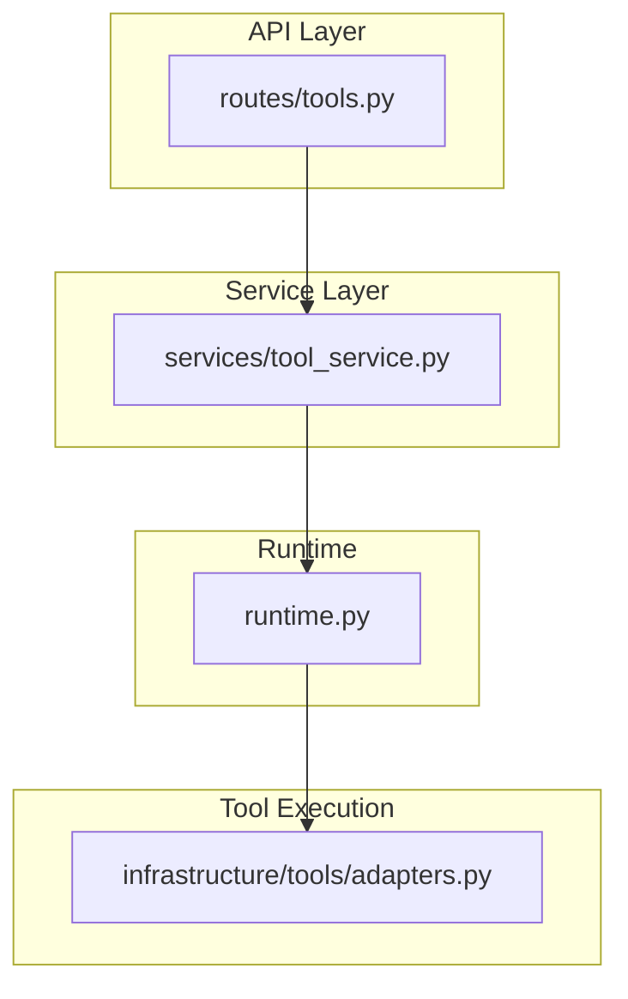

**Diagram sources**
- [tools.py:1-36](file://backend/app/api/v1/routes/tools.py#L1-L36)
- [tool_service.py:1-22](file://backend/app/services/tool_service.py#L1-L22)
- [runtime.py:225-517](file://backend/app/runtime.py#L225-L517)
- [adapters.py:143-177](file://backend/app/infrastructure/tools/adapters.py#L143-L177)

**Section sources**
- [tools.py:1-36](file://backend/app/api/v1/routes/tools.py#L1-L36)
- [tool_service.py:1-22](file://backend/app/services/tool_service.py#L1-L22)
- [runtime.py:225-517](file://backend/app/runtime.py#L225-L517)
- [adapters.py:1-177](file://backend/app/infrastructure/tools/adapters.py#L1-L177)

## Core Components
- Tool Adapters: Pure functions that accept a payload and return a standardized effect record. They are registered in a central registry and executed through a single entry point.
- Runtime Metadata: Tools are defined at runtime with schemas, risk levels, required permissions, timeouts, retry policies, and enabled flags.
- API Routes and Services: Provide CRUD operations for tools and enforce RBAC before delegating to runtime methods.
- Error Handling: A dedicated exception type wraps adapter failures and invalid results.

Key responsibilities:
- Registration: Central dictionary mapping tool IDs to callable adapters.
- Execution: Lookup, call, validate result shape, and wrap errors.
- Discovery: List/get tool definitions from runtime store.
- Permission Binding: Required permissions and approval gates are part of tool metadata.

**Section sources**
- [adapters.py:143-177](file://backend/app/infrastructure/tools/adapters.py#L143-L177)
- [runtime.py:466-517](file://backend/app/runtime.py#L466-L517)
- [tools.py:1-36](file://backend/app/api/v1/routes/tools.py#L1-L36)
- [tool_service.py:1-22](file://backend/app/services/tool_service.py#L1-L22)

## Architecture Overview
The system separates concerns across layers:
- API routes enforce RBAC and delegate to services.
- Services forward calls to runtime methods.
- Runtime manages tool definitions, agent allowances, and persistence.
- Adapters implement side effects and produce durable effect records.

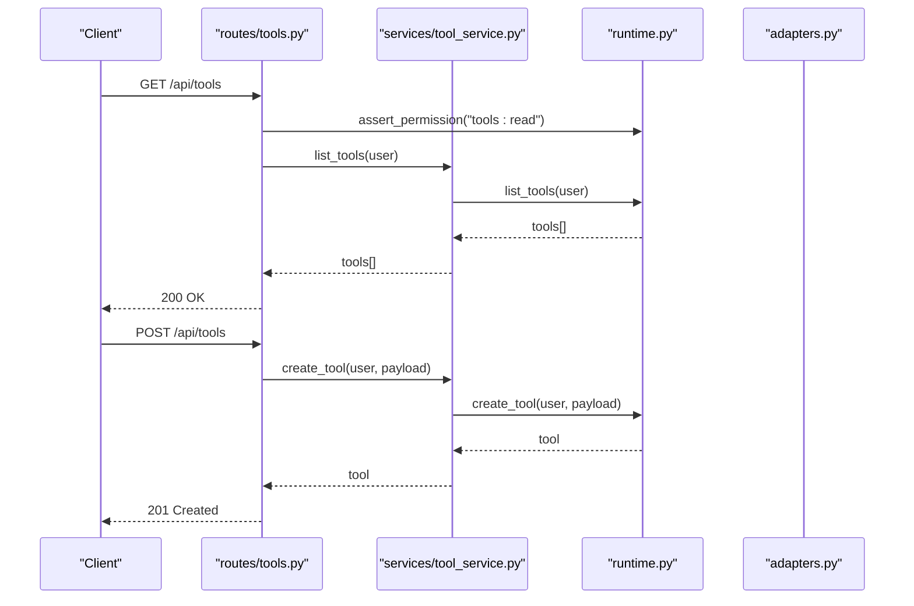

**Diagram sources**
- [tools.py:11-25](file://backend/app/api/v1/routes/tools.py#L11-L25)
- [tool_service.py:4-13](file://backend/app/services/tool_service.py#L4-L13)
- [runtime.py:466-517](file://backend/app/runtime.py#L466-L517)

## Detailed Component Analysis

### Tool Adapter Registry and Execution
Adapters are plain callables returning a normalized effect envelope. The registry maps tool IDs to these callables. The executor validates the adapter exists, invokes it, and enforces a strict result schema.

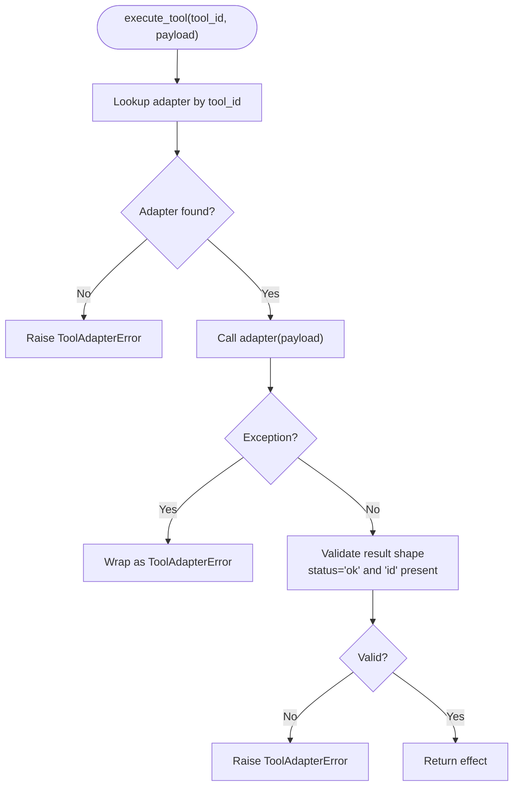

**Diagram sources**
- [adapters.py:164-177](file://backend/app/infrastructure/tools/adapters.py#L164-L177)

**Section sources**
- [adapters.py:143-177](file://backend/app/infrastructure/tools/adapters.py#L143-L177)

### Tool Registration and Discovery
Tools are seeded into runtime from business configuration and augmented with stubs for CI safety. Each tool includes input/output schemas, risk level, required permissions, timeout, retry policy, allowed actions, and scope.

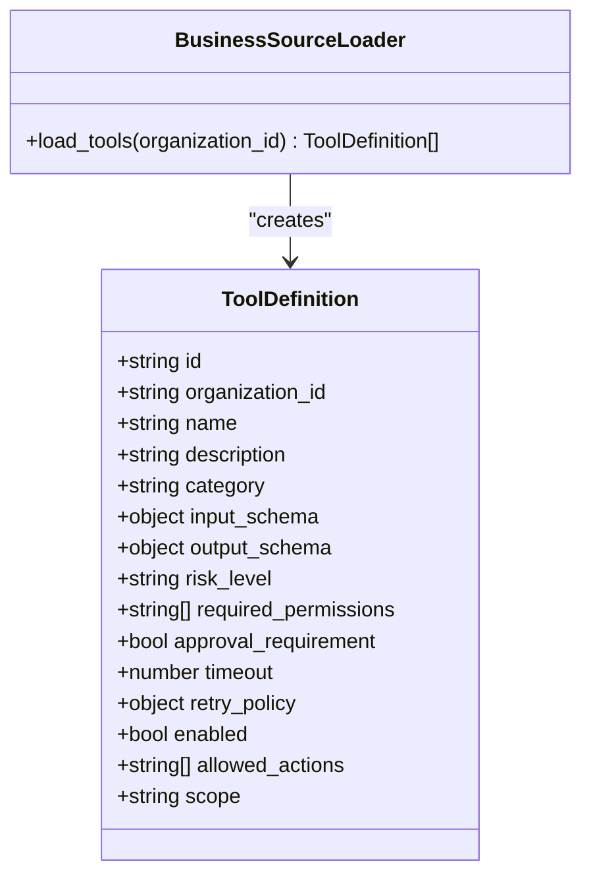

**Diagram sources**
- [runtime.py:466-517](file://backend/app/runtime.py#L466-L517)

**Section sources**
- [runtime.py:466-517](file://backend/app/runtime.py#L466-L517)

### Permission Binding and RBAC
Permissions are enforced at the API layer and encoded per tool. Roles define coarse-grained capabilities; each tool declares required permissions and whether human approval is needed based on its risk tier.

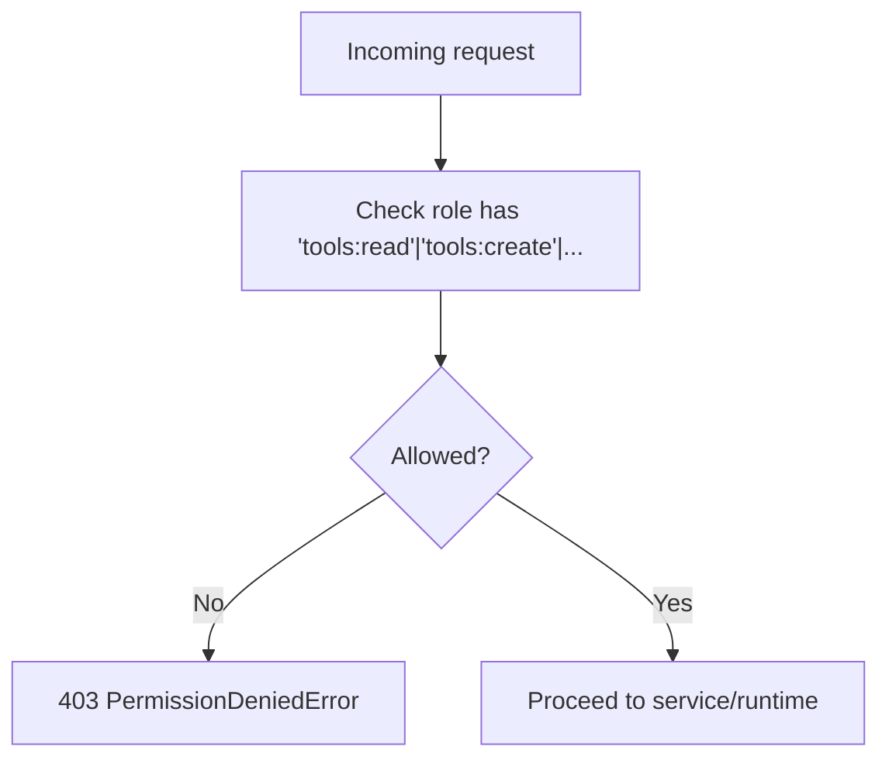

**Diagram sources**
- [tools.py:11-25](file://backend/app/api/v1/routes/tools.py#L11-L25)
- [runtime.py:140-222](file://backend/app/runtime.py#L140-L222)

**Section sources**
- [tools.py:11-25](file://backend/app/api/v1/routes/tools.py#L11-L25)
- [runtime.py:140-222](file://backend/app/runtime.py#L140-L222)

### Authentication Flow
Authentication is handled upstream; the API layer depends on an authenticated user context. The runtime exposes helper types and utilities used throughout the application.

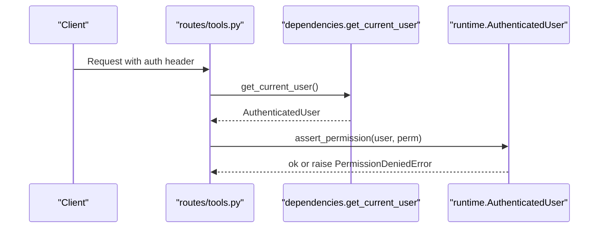

**Diagram sources**
- [tools.py:1-14](file://backend/app/api/v1/routes/tools.py#L1-L14)
- [runtime.py:131-138](file://backend/app/runtime.py#L131-L138)

**Section sources**
- [tools.py:1-14](file://backend/app/api/v1/routes/tools.py#L1-L14)
- [runtime.py:131-138](file://backend/app/runtime.py#L131-L138)

### Rate Limiting Strategy
Rate limiting is modeled as a first-class error type with a retry-after value. While not wired directly into the tool routes here, the pattern is available for use in middleware or service layers to protect downstream adapters.

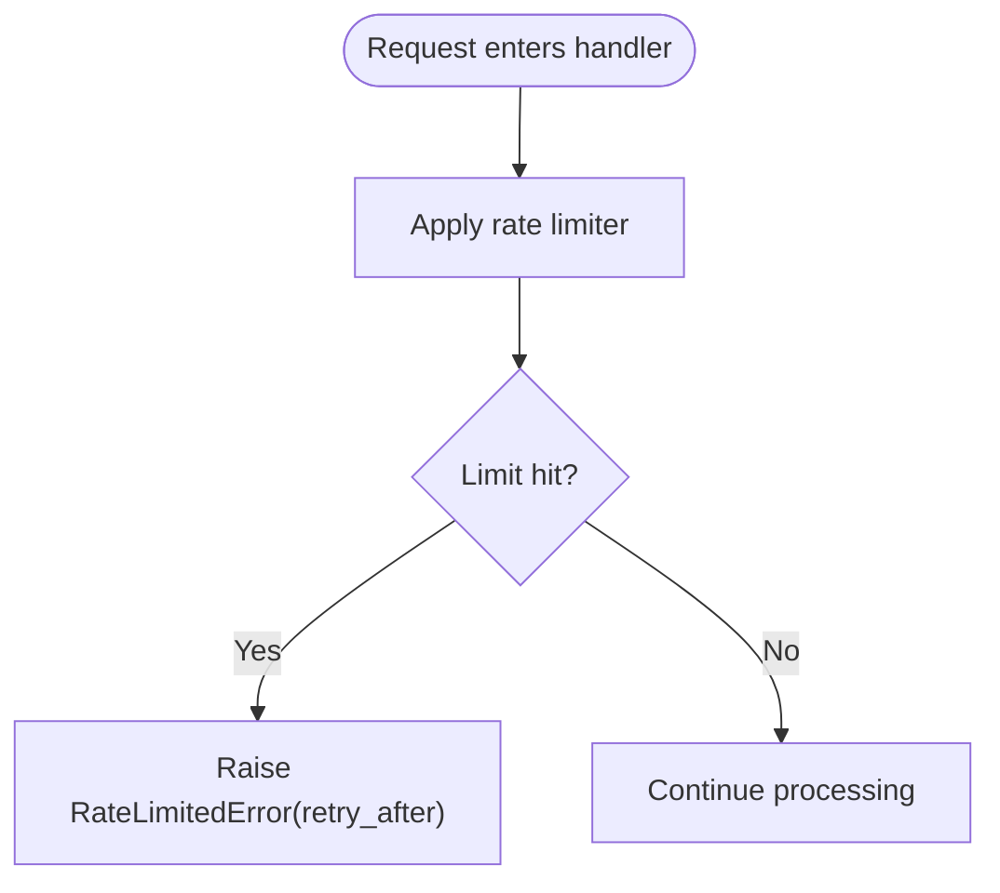

**Diagram sources**
- [runtime.py:122-129](file://backend/app/runtime.py#L122-L129)

**Section sources**
- [runtime.py:122-129](file://backend/app/runtime.py#L122-L129)

### Error Handling Patterns
All adapter invocations are wrapped to normalize failures into a consistent exception type. Invalid adapter outputs are rejected early.

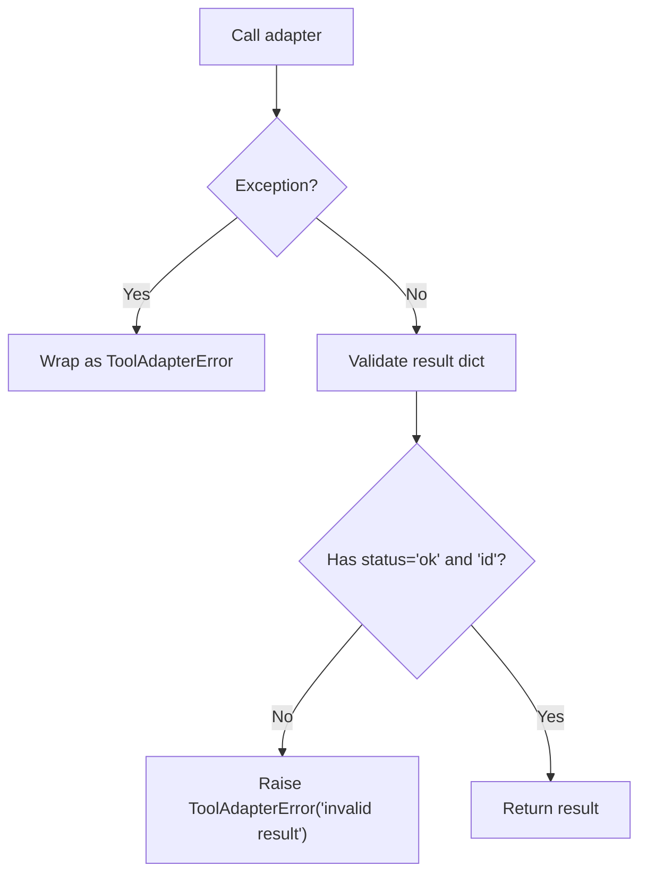

**Diagram sources**
- [adapters.py:164-177](file://backend/app/infrastructure/tools/adapters.py#L164-L177)

**Section sources**
- [adapters.py:157-177](file://backend/app/infrastructure/tools/adapters.py#L157-L177)

### Capability Negotiation and Fallback Strategies
Capability negotiation can be achieved by inspecting tool metadata such as allowed_actions, risk_level, and scope. Fallback strategies include:
- Selecting alternative adapters with compatible capabilities.
- Using stub adapters for CI-safe execution when external providers are unavailable.
- Enforcing human approval for high-risk actions.

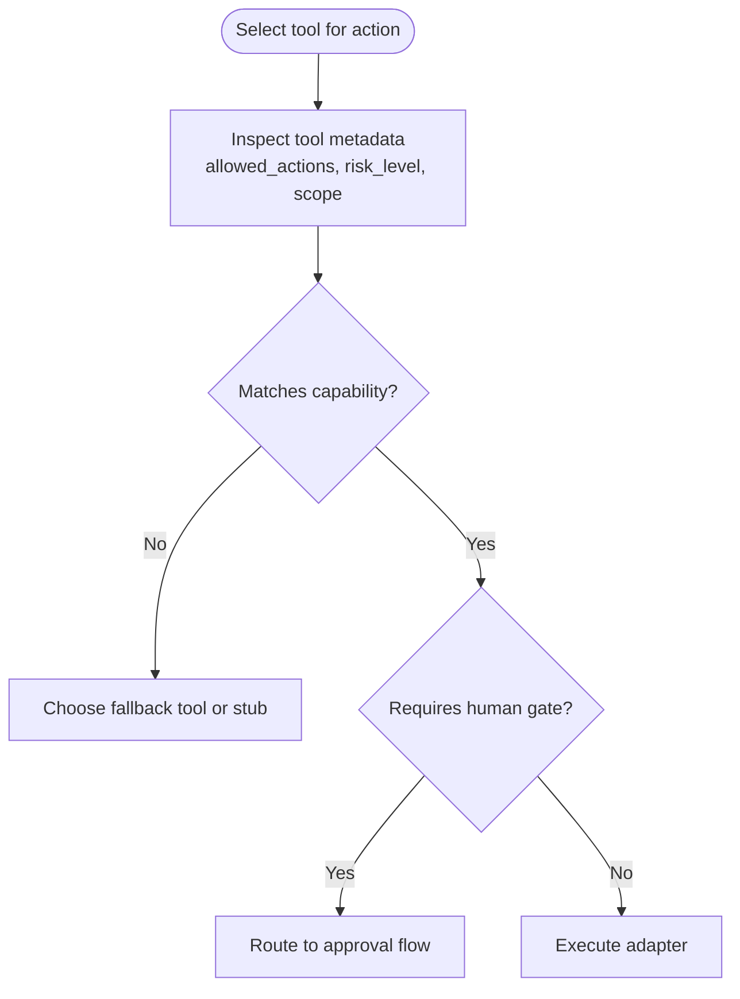

[No sources needed since this diagram shows conceptual workflow, not actual code structure]

### Video Production Agent Examples
Video-related stub adapters provide a complete integration pattern for media generation, script formatting, quality checks, and packaging. These are registered and discoverable like any other tool.

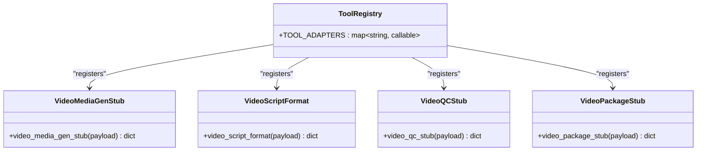

**Diagram sources**
- [adapters.py:96-154](file://backend/app/infrastructure/tools/adapters.py#L96-L154)

**Section sources**
- [adapters.py:96-154](file://backend/app/infrastructure/tools/adapters.py#L96-L154)

## Dependency Analysis
The following diagram shows the primary dependencies between modules involved in tool management and execution.

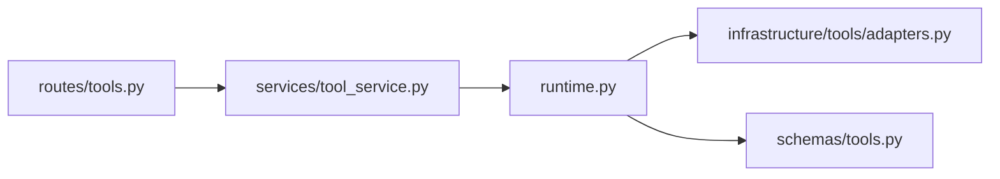

**Diagram sources**
- [tools.py:1-36](file://backend/app/api/v1/routes/tools.py#L1-L36)
- [tool_service.py:1-22](file://backend/app/services/tool_service.py#L1-L22)
- [runtime.py:225-517](file://backend/app/runtime.py#L225-L517)
- [adapters.py:143-177](file://backend/app/infrastructure/tools/adapters.py#L143-L177)
- [tools.py:1-2](file://backend/app/schemas/tools.py#L1-L2)

**Section sources**
- [tools.py:1-36](file://backend/app/api/v1/routes/tools.py#L1-L36)
- [tool_service.py:1-22](file://backend/app/services/tool_service.py#L1-L22)
- [runtime.py:225-517](file://backend/app/runtime.py#L225-L517)
- [adapters.py:143-177](file://backend/app/infrastructure/tools/adapters.py#L143-L177)
- [tools.py:1-2](file://backend/app/schemas/tools.py#L1-L2)

## Performance Considerations
- Keep adapter functions stateless and fast; they should only perform I/O-bound work and return quickly.
- Use tool-level timeout and retry_policy fields to bound execution time and handle transient failures.
- Prefer stub adapters during CI or development to avoid expensive external calls.
- Batch operations where possible and leverage streaming events for long-running tasks.

[No sources needed since this section provides general guidance]

## Troubleshooting Guide
Common issues and resolutions:
- No adapter registered: Ensure the tool ID exists in the registry and is enabled in runtime metadata.
- Invalid adapter result: Verify the adapter returns a dict with status "ok" and a unique "id".
- Permission denied: Confirm the caller’s role includes the required permission (e.g., tools:read).
- Approval required: For high-risk tools, ensure the approval flow is triggered and completed.
- Rate limited: Respect retry_after and backoff strategy.

**Section sources**
- [adapters.py:157-177](file://backend/app/infrastructure/tools/adapters.py#L157-L177)
- [tools.py:11-25](file://backend/app/api/v1/routes/tools.py#L11-L25)
- [runtime.py:122-129](file://backend/app/runtime.py#L122-L129)

## Conclusion
The tool adapter architecture cleanly separates tool implementation from orchestration. By registering adapters, defining robust metadata, enforcing permissions, and standardizing error handling, teams can integrate diverse tools safely and predictably. Video production agents demonstrate practical usage of stub adapters for CI-friendly workflows while preserving the same integration contract.

[No sources needed since this section summarizes without analyzing specific files]

## Appendices

### How to Create a Custom Tool Adapter
- Implement a function that accepts a payload dict and returns a normalized effect dict with status "ok" and a unique "id".
- Register the function under a stable tool_id in the central registry.
- Add tool metadata (schemas, risk level, permissions, timeout, retry policy) to runtime seeds so it appears in discovery.
- Test with the executor to ensure validation passes and errors are wrapped consistently.

**Section sources**
- [adapters.py:143-177](file://backend/app/infrastructure/tools/adapters.py#L143-L177)
- [runtime.py:466-517](file://backend/app/runtime.py#L466-L517)

### Tool Management API Summary
- List tools: GET /api/tools (requires tools:read)
- Get tool detail: GET /api/tools/{tool_id} (requires tools:read)
- Create tool: POST /api/tools (requires tools:create)
- Update tool status: PATCH /api/tools/{tool_id}
- Archive tool: DELETE /api/tools/{tool_id}

**Section sources**
- [tools.py:11-36](file://backend/app/api/v1/routes/tools.py#L11-L36)
- [tool_service.py:4-22](file://backend/app/services/tool_service.py#L4-L22)

### User Guide Reference
For additional context and examples, see the user guide chapter on tool adapter integration.

**Section sources**
- [02-03-tool-adapter-integration.md](file://book/user_guide/chapters/02-03-tool-adapter-integration.md)