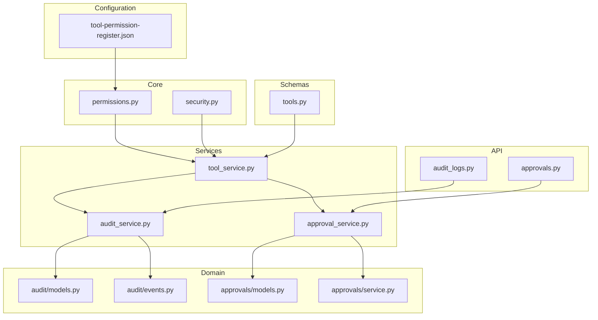
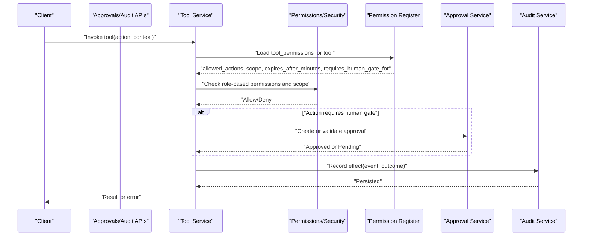
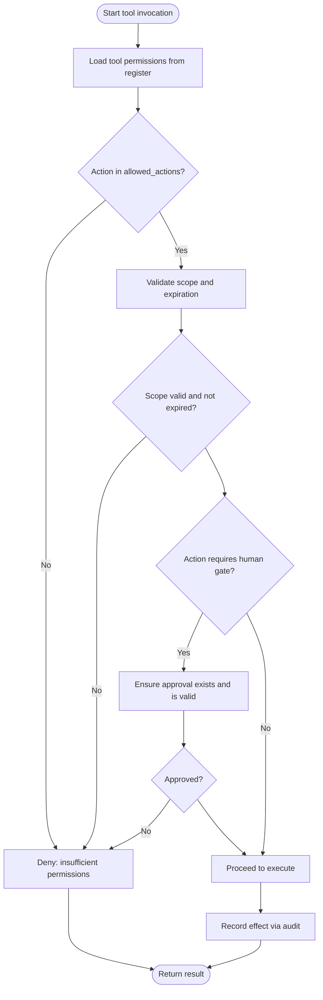
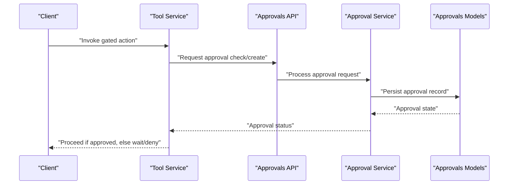
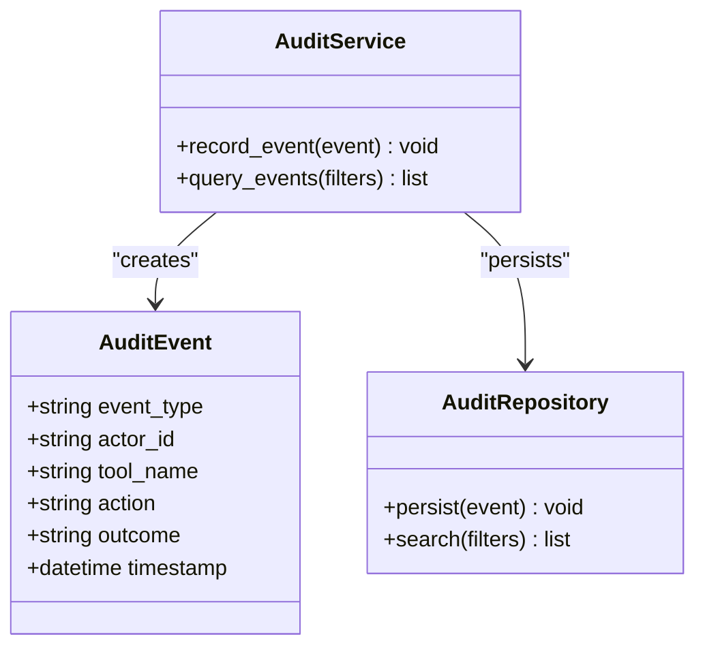
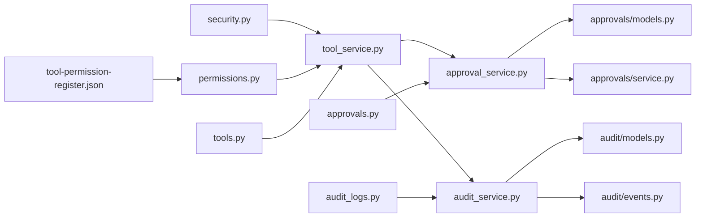

# Tool Permissions & Security

<cite>
**Referenced Files in This Document**
- [tool-permission-register.json](file://business/security/tool-permissions/tool-permission-register.json)
- [permissions.py](file://backend/app/core/permissions.py)
- [security.py](file://backend/app/core/security.py)
- [tools.py](file://backend/app/schemas/tools.py)
- [audit_logs.py](file://backend/app/api/v1/routes/audit_logs.py)
- [audit_service.py](file://backend/app/services/audit_service.py)
- [models.py](file://backend/app/domain/audit/models.py)
- [events.py](file://backend/app/domain/audit/events.py)
- [approvals.py](file://backend/app/api/v1/routes/approvals.py)
- [approval_service.py](file://backend/app/services/approval_service.py)
- [models.py](file://backend/app/domain/approvals/models.py)
- [service.py](file://backend/app/domain/approvals/service.py)
- [tool_service.py](file://backend/app/services/tool_service.py)
</cite>

## Table of Contents
1. [Introduction](#introduction)
2. [Project Structure](#project-structure)
3. [Core Components](#core-components)
4. [Architecture Overview](#architecture-overview)
5. [Detailed Component Analysis](#detailed-component-analysis)
6. [Dependency Analysis](#dependency-analysis)
7. [Performance Considerations](#performance-considerations)
8. [Troubleshooting Guide](#troubleshooting-guide)
9. [Conclusion](#conclusion)
10. [Appendices](#appendices)

## Introduction
This document explains the tool permission model and security boundaries for tool access control. It covers:
- How to configure tool-specific permissions using the tool-permission-register.json schema
- How approval gates are enforced for sensitive operations
- How tool usage is audited through the effect recording system
- Role-based access control integration, permission inheritance, and security best practices
- Examples of configuring permissions for different agent roles and tool categories

The goal is to provide a clear, actionable guide for operators and developers to secure tool usage across agents while maintaining auditability and compliance.

## Project Structure
The tool permission and security features span configuration, core authorization, schemas, services, and domain models:
- Configuration: tool-permission-register.json defines per-tool allowed actions, scopes, expiration, and human gate requirements
- Core authorization: permissions.py and security.py implement policy checks and request-level security
- Schemas: tools.py defines API contracts for tool-related resources
- Services: tool_service.py orchestrates tool execution with permission checks; approval_service.py manages human approvals; audit_service.py records effects
- Domain: audit and approvals domains define models and events for persistence and workflow state
- API routes: audit_logs.py and approvals.py expose endpoints for querying logs and managing approvals

**Diagram sources**
- [tool-permission-register.json:1-74](file://business/security/tool-permissions/tool-permission-register.json#L1-L74)
- [permissions.py](file://backend/app/core/permissions.py)
- [security.py](file://backend/app/core/security.py)
- [tools.py](file://backend/app/schemas/tools.py)
- [tool_service.py](file://backend/app/services/tool_service.py)
- [approval_service.py](file://backend/app/services/approval_service.py)
- [audit_service.py](file://backend/app/services/audit_service.py)
- [models.py](file://backend/app/domain/audit/models.py)
- [events.py](file://backend/app/domain/audit/events.py)
- [models.py](file://backend/app/domain/approvals/models.py)
- [service.py](file://backend/app/domain/approvals/service.py)
- [audit_logs.py](file://backend/app/api/v1/routes/audit_logs.py)
- [approvals.py](file://backend/app/api/v1/routes/approvals.py)

**Section sources**
- [tool-permission-register.json:1-74](file://business/security/tool-permissions/tool-permission-register.json#L1-L74)
- [permissions.py](file://backend/app/core/permissions.py)
- [security.py](file://backend/app/core/security.py)
- [tools.py](file://backend/app/schemas/tools.py)
- [tool_service.py](file://backend/app/services/tool_service.py)
- [approval_service.py](file://backend/app/services/approval_service.py)
- [audit_service.py](file://backend/app/services/audit_service.py)
- [models.py](file://backend/app/domain/audit/models.py)
- [events.py](file://backend/app/domain/audit/events.py)
- [models.py](file://backend/app/domain/approvals/models.py)
- [service.py](file://backend/app/domain/approvals/service.py)
- [audit_logs.py](file://backend/app/api/v1/routes/audit_logs.py)
- [approvals.py](file://backend/app/api/v1/routes/approvals.py)

## Core Components
- Tool Permission Register (tool-permission-register.json): Declares per-tool allowed_actions, scope constraints, expiration windows, and requires_human_gate_for lists. This file is the source of truth for tool capabilities and gating rules.
- Core Authorization (permissions.py, security.py): Implements policy evaluation and request-scoped security checks used by services and routes.
- Tool Service (tool_service.py): Orchestrates tool invocation, enforces permission checks against the register, triggers approval gates when required, and records effects via audit.
- Approval Service (approval_service.py) and Approvals Domain (models.py, service.py): Manages creation, validation, and resolution of human approvals for gated actions.
- Audit Service (audit_service.py) and Audit Domain (models.py, events.py): Records tool usage and outcomes as immutable audit events.
- API Routes (audit_logs.py, approvals.py): Expose endpoints to query audit logs and manage approvals.

**Section sources**
- [tool-permission-register.json:1-74](file://business/security/tool-permissions/tool-permission-register.json#L1-L74)
- [permissions.py](file://backend/app/core/permissions.py)
- [security.py](file://backend/app/core/security.py)
- [tool_service.py](file://backend/app/services/tool_service.py)
- [approval_service.py](file://backend/app/services/approval_service.py)
- [models.py](file://backend/app/domain/approvals/models.py)
- [service.py](file://backend/app/domain/approvals/service.py)
- [audit_service.py](file://backend/app/services/audit_service.py)
- [models.py](file://backend/app/domain/audit/models.py)
- [events.py](file://backend/app/domain/audit/events.py)
- [audit_logs.py](file://backend/app/api/v1/routes/audit_logs.py)
- [approvals.py](file://backend/app/api/v1/routes/approvals.py)

## Architecture Overview
The permission enforcement flow integrates configuration, authorization, approvals, and auditing:

**Diagram sources**
- [tool_service.py](file://backend/app/services/tool_service.py)
- [permissions.py](file://backend/app/core/permissions.py)
- [security.py](file://backend/app/core/security.py)
- [tool-permission-register.json:1-74](file://business/security/tool-permissions/tool-permission-register.json#L1-L74)
- [approval_service.py](file://backend/app/services/approval_service.py)
- [audit_service.py](file://backend/app/services/audit_service.py)

## Detailed Component Analysis

### Tool Permission Register Schema
The tool-permission-register.json defines:
- schema_version: versioning of the permission schema
- tool_permissions: array of entries keyed by tool name
  - tool: identifier for the tool
  - allowed_actions: list of permitted actions
  - scope: constraint describing where the action is valid
  - expires_after_minutes: time-bound validity window
  - requires_human_gate_for: subset of actions that require human approval

Example entries include CRM, billing_system, email, audit_log_writer, and video-related stubs. Actions like activate_billing and package_deliverable are explicitly gated.

Best practices:
- Keep allowed_actions minimal and explicit
- Use narrow scopes tied to business contexts
- Set short expiration windows for sensitive tools
- Gate only truly sensitive actions

**Section sources**
- [tool-permission-register.json:1-74](file://business/security/tool-permissions/tool-permission-register.json#L1-L74)

### Core Authorization and Security
- permissions.py: Provides policy evaluation utilities used by services to enforce RBAC and scope checks
- security.py: Supplies request-level security helpers (e.g., identity extraction, token validation) consumed by routes and services

Integration points:
- tool_service.py calls into permissions and security to validate caller identity, roles, and scope before invoking any tool
- API routes rely on security decorators/factories to protect endpoints

**Section sources**
- [permissions.py](file://backend/app/core/permissions.py)
- [security.py](file://backend/app/core/security.py)
- [tool_service.py](file://backend/app/services/tool_service.py)

### Tool Execution Orchestration
tool_service.py coordinates:
- Loading tool permissions from the register
- Validating requested action against allowed_actions
- Enforcing scope and expiration constraints
- Triggering approval gates when an action is listed in requires_human_gate_for
- Recording effects via audit_service

**Diagram sources**
- [tool_service.py](file://backend/app/services/tool_service.py)
- [tool-permission-register.json:1-74](file://business/security/tool-permissions/tool-permission-register.json#L1-L74)
- [approval_service.py](file://backend/app/services/approval_service.py)
- [audit_service.py](file://backend/app/services/audit_service.py)

**Section sources**
- [tool_service.py](file://backend/app/services/tool_service.py)
- [tool-permission-register.json:1-74](file://business/security/tool-permissions/tool-permission-register.json#L1-L74)

### Approval Gates
approval_service.py and approvals domain models/service coordinate:
- Creating approval requests for gated actions
- Validating approver identity and authority
- Resolving approvals and linking them to tool invocations
- Persisting approval state and metadata

API route approvals.py exposes endpoints to create, query, and resolve approvals.

**Diagram sources**
- [tool_service.py](file://backend/app/services/tool_service.py)
- [approvals.py](file://backend/app/api/v1/routes/approvals.py)
- [approval_service.py](file://backend/app/services/approval_service.py)
- [models.py](file://backend/app/domain/approvals/models.py)
- [service.py](file://backend/app/domain/approvals/service.py)

**Section sources**
- [approvals.py](file://backend/app/api/v1/routes/approvals.py)
- [approval_service.py](file://backend/app/services/approval_service.py)
- [models.py](file://backend/app/domain/approvals/models.py)
- [service.py](file://backend/app/domain/approvals/service.py)

### Audit Effect Recording
audit_service.py and audit domain models/events capture tool usage:
- Event types for tool invocations, outcomes, and side effects
- Immutable persistence for compliance and forensics
- Query interfaces exposed via audit_logs.py

**Diagram sources**
- [audit_service.py](file://backend/app/services/audit_service.py)
- [models.py](file://backend/app/domain/audit/models.py)
- [events.py](file://backend/app/domain/audit/events.py)
- [audit_logs.py](file://backend/app/api/v1/routes/audit_logs.py)

**Section sources**
- [audit_service.py](file://backend/app/services/audit_service.py)
- [models.py](file://backend/app/domain/audit/models.py)
- [events.py](file://backend/app/domain/audit/events.py)
- [audit_logs.py](file://backend/app/api/v1/routes/audit_logs.py)

### Role-Based Access Control Integration
RBAC is integrated at the authorization layer:
- permissions.py provides policy checks for roles and scopes
- security.py ensures authenticated identity and tokens are present
- tool_service.py applies these checks before executing tools

Operational guidance:
- Assign roles based on least privilege
- Bind scopes to specific business contexts (e.g., customer_onboarding_only)
- Combine roles with tool permission register entries to restrict capabilities

**Section sources**
- [permissions.py](file://backend/app/core/permissions.py)
- [security.py](file://backend/app/core/security.py)
- [tool_service.py](file://backend/app/services/tool_service.py)

### Permission Inheritance and Policy Composition
While the repository does not expose a dedicated inheritance mechanism in the analyzed files, the design supports composition:
- Roles can be composed by aggregating multiple permission sets
- Scopes act as contextual filters applied alongside role checks
- The permission register acts as a centralized policy surface for tool capabilities

Recommendation:
- Model role hierarchies in your identity provider and map them to policy checks in permissions.py
- Use scopes to limit tool usage to specific business units or workflows

[No sources needed since this section provides general guidance]

### Security Best Practices for Tool Implementations
- Explicit allowlists: Only enumerate allowed_actions in the register
- Narrow scopes: Tie tool usage to precise business contexts
- Short-lived permissions: Use expires_after_minutes to minimize exposure
- Human gates: Require approvals for destructive or high-risk actions
- Immutable audit trails: Record all effects and outcomes
- Defense in depth: Enforce checks at both service and API layers
- Secret management: Avoid embedding credentials in tool configs; use secure vaults

[No sources needed since this section provides general guidance]

## Dependency Analysis
High-level dependencies among components:

**Diagram sources**
- [tool-permission-register.json:1-74](file://business/security/tool-permissions/tool-permission-register.json#L1-L74)
- [permissions.py](file://backend/app/core/permissions.py)
- [security.py](file://backend/app/core/security.py)
- [tools.py](file://backend/app/schemas/tools.py)
- [tool_service.py](file://backend/app/services/tool_service.py)
- [approval_service.py](file://backend/app/services/approval_service.py)
- [audit_service.py](file://backend/app/services/audit_service.py)
- [models.py](file://backend/app/domain/approvals/models.py)
- [service.py](file://backend/app/domain/approvals/service.py)
- [models.py](file://backend/app/domain/audit/models.py)
- [events.py](file://backend/app/domain/audit/events.py)
- [audit_logs.py](file://backend/app/api/v1/routes/audit_logs.py)
- [approvals.py](file://backend/app/api/v1/routes/approvals.py)

**Section sources**
- [tool-permission-register.json:1-74](file://business/security/tool-permissions/tool-permission-register.json#L1-L74)
- [permissions.py](file://backend/app/core/permissions.py)
- [security.py](file://backend/app/core/security.py)
- [tools.py](file://backend/app/schemas/tools.py)
- [tool_service.py](file://backend/app/services/tool_service.py)
- [approval_service.py](file://backend/app/services/approval_service.py)
- [audit_service.py](file://backend/app/services/audit_service.py)
- [models.py](file://backend/app/domain/approvals/models.py)
- [service.py](file://backend/app/domain/approvals/service.py)
- [models.py](file://backend/app/domain/audit/models.py)
- [events.py](file://backend/app/domain/audit/events.py)
- [audit_logs.py](file://backend/app/api/v1/routes/audit_logs.py)
- [approvals.py](file://backend/app/api/v1/routes/approvals.py)

## Performance Considerations
- Cache tool permission register reads to reduce I/O overhead
- Batch audit writes where possible without compromising immutability guarantees
- Use short-lived scopes and expirations to avoid long-running permission checks
- Offload heavy approval workflows to background jobs if necessary

[No sources needed since this section provides general guidance]

## Troubleshooting Guide
Common issues and resolutions:
- Action denied due to missing allowed_action: Verify tool entry in tool-permission-register.json includes the requested action
- Scope mismatch: Ensure the current context matches the configured scope for the tool
- Expired permissions: Check expires_after_minutes and refresh sessions or re-authenticate
- Missing human gate approval: Create or obtain approval for the gated action before proceeding
- Audit gaps: Confirm audit events are recorded for all tool invocations and outcomes

Operational checks:
- Query audit logs via audit_logs.py endpoints to trace recent tool usage
- Inspect approval states via approvals.py endpoints to ensure pending approvals are resolved

**Section sources**
- [tool-permission-register.json:1-74](file://business/security/tool-permissions/tool-permission-register.json#L1-L74)
- [audit_logs.py](file://backend/app/api/v1/routes/audit_logs.py)
- [approvals.py](file://backend/app/api/v1/routes/approvals.py)

## Conclusion
The tool permission model centers on a declarative register, strict authorization checks, human approval gates for sensitive actions, and comprehensive audit logging. By combining RBAC with scoped, time-bound permissions and immutable effects recording, the system enforces strong security boundaries while remaining flexible for diverse agent roles and tool categories.

[No sources needed since this section summarizes without analyzing specific files]

## Appendices

### Example Configurations by Role and Category
- Developer role (read-only tools):
  - Tools: read_graph, search_nodes, get_editor_state
  - Allowed actions: read-only variants
  - Scope: development_workspace
  - Expiration: 60 minutes
  - Human gate: none

- Analyst role (reporting tools):
  - Tools: analytics_readers, report_generators
  - Allowed actions: generate_report, export_data
  - Scope: analytics_domain
  - Expiration: 30 minutes
  - Human gate: export_data

- Operator role (production tools):
  - Tools: deployer, config_manager
  - Allowed actions: deploy, update_config
  - Scope: production_environment
  - Expiration: 15 minutes
  - Human gate: deploy, update_config

- CI/CD role (automation tools):
  - Tools: ci_runner, artifact_publisher
  - Allowed actions: run_pipeline, publish_artifact
  - Scope: ci_cd_pipeline
  - Expiration: 10 minutes
  - Human gate: publish_artifact

These examples illustrate how to tailor allowed_actions, scopes, expirations, and human gates per role and category.

[No sources needed since this section provides general guidance]