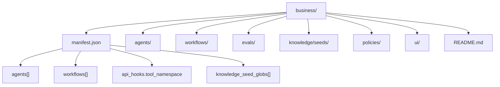
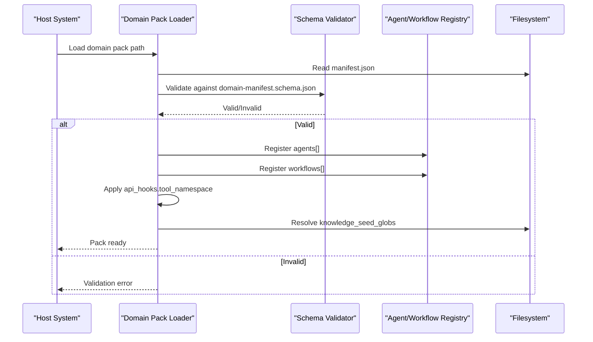
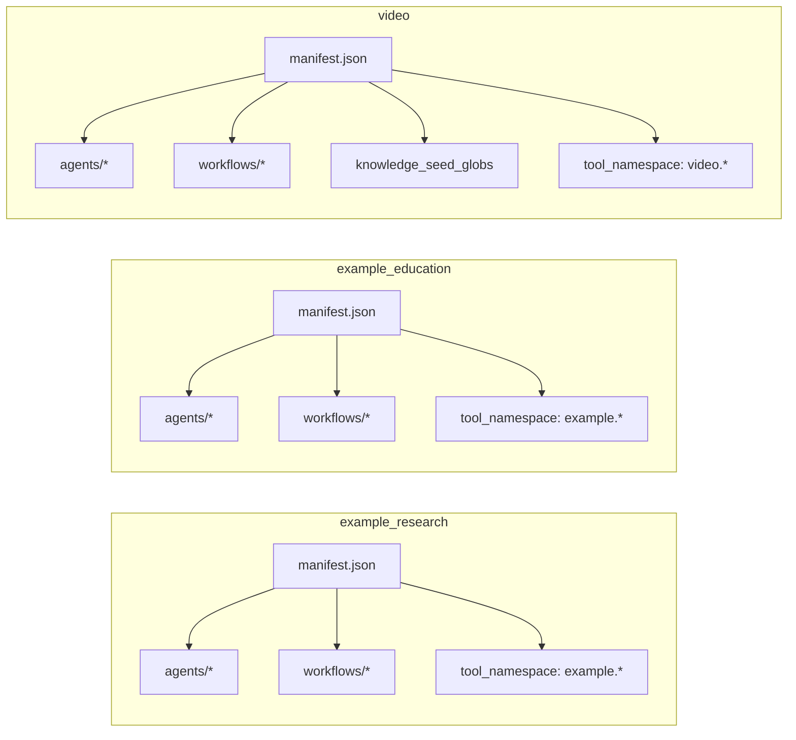

# Domain Pack Structure & Conventions

<cite>
**Referenced Files in This Document**
- [domain-manifest.schema.json](file://business/schemas/domain-manifest.schema.json)
- [manifest.json (example_research)](file://business/example_research/manifest.json)
- [README.md (example_research)](file://business/example_research/README.md)
- [manifest.json (example_education)](file://business/example_education/manifest.json)
- [README.md (example_education)](file://business/example_education/README.md)
- [manifest.json (video)](file://business/video/manifest.json)
</cite>

## Table of Contents
1. [Introduction](#introduction)
2. [Project Structure](#project-structure)
3. [Core Components](#core-components)
4. [Architecture Overview](#architecture-overview)
5. [Detailed Component Analysis](#detailed-component-analysis)
6. [Dependency Analysis](#dependency-analysis)
7. [Performance Considerations](#performance-considerations)
8. [Troubleshooting Guide](#troubleshooting-guide)
9. [Conclusion](#conclusion)
10. [Appendices](#appendices)

## Introduction
This document defines the domain pack structure and conventions for business/<domain_id>/ packs. It specifies the mandatory layout, manifest schema requirements, naming conventions, and organization patterns for agents, workflows, tools, evaluations, knowledge seeds, policies, and UI components. It also provides concrete examples from example_research and example_education to illustrate proper implementation.

## Project Structure
A domain pack is a self-contained unit under business/<domain_id> that declares its runtime assets via a manifest. The canonical top-level elements are:
- manifest.json: required metadata and registration entries
- agents/: agent definitions referenced by the manifest
- workflows/: workflow definitions referenced by the manifest
- evals/: evaluation artifacts (golden tasks, regression sets, etc.)
- knowledge/seeds/: optional knowledge seeds consumed by agents/workflows
- policies/: optional policy documents governing behavior
- ui/: optional UI components or assets exposed to the host application
- README.md: pack overview and quick reference

The following diagram shows the canonical layout and how it maps to the manifest’s declarations.

[No sources needed since this diagram shows conceptual workflow, not actual code structure]

## Core Components
- Domain manifest (manifest.json): Declares identity, versioning, risk posture, runtime dependencies (agents, workflows), tool namespace scoping, optional knowledge seed globs, and provenance.
- Agents: Referenced by id strings or objects with id/path; must exist under agents/.
- Workflows: Referenced by id strings or objects with id/path; must exist under workflows/.
- Tools namespace: Controlled via api_hooks.tool_namespace to scope tool discovery and permissions.
- Knowledge seeds: Optional glob patterns to include seed content at runtime.
- Policies: Optional governance and operational rules stored under policies/.
- UI components: Optional UI assets under ui/ for integration with the host frontend.

Section sources
- [domain-manifest.schema.json:1-77](file://business/schemas/domain-manifest.schema.json#L1-L77)
- [manifest.json (example_research):1-14](file://business/example_research/manifest.json#L1-L14)
- [manifest.json (example_education):1-14](file://business/example_education/manifest.json#L1-L14)
- [manifest.json (video):1-153](file://business/video/manifest.json#L1-L153)

## Architecture Overview
At runtime, the system loads each domain pack by reading its manifest, validates it against the schema, registers declared agents and workflows, binds tool namespaces, and optionally indexes knowledge seeds. The following sequence illustrates the load-and-register flow.

[No sources needed since this diagram shows conceptual workflow, not actual code structure]

## Detailed Component Analysis

### Manifest Schema and Requirements
The domain manifest must conform to the domain-manifest schema. Required fields include:
- domain_id: unique identifier string
- version: semantic version string
- display_name: human-readable name
- requires_alc: boolean flag indicating if an approval/control layer is required
- agents: array of agent identifiers or objects with id/path
- workflows: array of workflow identifiers or objects with id/path

Optional but commonly used fields:
- default_risk_tier: one of tier_0_observe through tier_5_restricted
- knowledge_seed_globs: array of glob patterns for seeding knowledge
- api_hooks: object with on_register and tool_namespace
- provenance: object for source references and lineage

Versioning strategy:
- Use semantic versioning for the version field.
- Keep backward-compatible changes within minor versions; breaking changes should increment major.
- Maintain provenance.source_refs to link manifests to design docs or decisions.

Tool namespace scoping:
- Set api_hooks.tool_namespace to a pattern (e.g., example.* or video.*) to restrict which tools are discoverable and executable by agents in this pack.

Examples:
- example_research and example_education demonstrate minimal manifests with agents, workflows, and tool namespace.
- video demonstrates a large-scale pack with many agents, workflows, knowledge_seed_globs, and provenance.

Section sources
- [domain-manifest.schema.json:1-77](file://business/schemas/domain-manifest.schema.json#L1-L77)
- [manifest.json (example_research):1-14](file://business/example_research/manifest.json#L1-L14)
- [manifest.json (example_education):1-14](file://business/example_education/manifest.json#L1-L14)
- [manifest.json (video):1-153](file://business/video/manifest.json#L1-L153)

### Directory Layout and Naming Conventions
Mandatory layout under business/<domain_id>:
- manifest.json: present and valid
- agents/: contains agent definitions referenced by manifest.agents
- workflows/: contains workflow definitions referenced by manifest.workflows

Recommended layout:
- evals/golden: golden task definitions for evaluation
- knowledge/seeds: seed content for retrieval
- policies: policy documents
- ui: UI components/assets
- README.md: pack overview and quick links

Naming conventions:
- domain_id: lowercase, underscore-separated (e.g., example_research, example_education)
- Agent ids: dot-separated namespaced identifiers (e.g., example.researcher, video.director)
- Workflow ids: prefixed with wf_ and suffixed with _vN (e.g., wf_example_education_v1, wf_video_spine_v1)
- File names: kebab-case for files, snake_case for JSON keys where appropriate

Section sources
- [README.md (example_education):1-19](file://business/example_education/README.md#L1-L19)
- [README.md (example_research):1-15](file://business/example_research/README.md#L1-L15)
- [manifest.json (example_research):1-14](file://business/example_research/manifest.json#L1-L14)
- [manifest.json (example_education):1-14](file://business/example_education/manifest.json#L1-L14)
- [manifest.json (video):1-153](file://business/video/manifest.json#L1-L153)

### Example Packs

#### Example Research Pack
- Purpose: Minimal second pack proving domain shape without video-specific logic.
- Manifest includes:
  - domain_id: example_research
  - version: 0.1.0
  - display_name: Example Research Pack
  - default_risk_tier: tier_1_recommend
  - requires_alc: true
  - agents: ["example.researcher", "example.reviewer"]
  - workflows: ["wf_example_research_v1"]
  - api_hooks.tool_namespace: example.*
- README highlights:
  - Lists agents and notes policy reuse with schemas from video pack.

Section sources
- [manifest.json (example_research):1-14](file://business/example_research/manifest.json#L1-L14)
- [README.md (example_research):1-15](file://business/example_research/README.md#L1-L15)

#### Example Education Pack
- Purpose: Lite third domain pack proving multi-pack hosting.
- Manifest includes:
  - domain_id: example_education
  - version: 0.1.0
  - display_name: Example Education Pack
  - default_risk_tier: tier_1_recommend
  - requires_alc: true
  - agents: ["example.edu_planner", "example.edu_reviewer"]
  - workflows: ["wf_example_education_v1"]
  - api_hooks.tool_namespace: example.*
- README highlights:
  - Documents artifact paths (manifest, agents, DNA, golden).
  - Provides registration command example.

Section sources
- [manifest.json (example_education):1-14](file://business/example_education/manifest.json#L1-L14)
- [README.md (example_education):1-19](file://business/example_education/README.md#L1-L19)

### Tools Namespace and Registration Hooks
- tool_namespace: Restricts tool discovery to a scoped pattern (e.g., example.*, video.*).
- on_register: Hook placeholder for custom registration logic (noop in examples).
- These settings ensure isolation between domains and prevent unintended tool access.

Section sources
- [manifest.json (example_research):1-14](file://business/example_research/manifest.json#L1-L14)
- [manifest.json (example_education):1-14](file://business/example_education/manifest.json#L1-L14)
- [manifest.json (video):1-153](file://business/video/manifest.json#L1-L153)

### Knowledge Seeds
- knowledge_seed_globs: Array of glob patterns to include seed content at runtime.
- Example: video pack uses business/video/knowledge/seeds/** to index all seeds under that path.

Section sources
- [manifest.json (video):1-153](file://business/video/manifest.json#L139-L141)

### Policies and Governance
- Store policy documents under policies/ (e.g., data retention, approval gates).
- Reference policies in pack documentation and link them from manifest provenance when applicable.

Section sources
- [manifest.json (video):1-153](file://business/video/manifest.json#L146-L151)

### UI Components
- Place UI assets under ui/ when exposing domain-specific interfaces.
- Ensure UI assets align with the domain’s tool namespace and agent capabilities.

[No sources needed since this section doesn't analyze specific files]

## Dependency Analysis
The following dependency graph shows how the manifest connects to agents, workflows, and tool namespaces across example packs.

**Diagram sources**
- [manifest.json (example_research):1-14](file://business/example_research/manifest.json#L1-L14)
- [manifest.json (example_education):1-14](file://business/example_education/manifest.json#L1-L14)
- [manifest.json (video):1-153](file://business/video/manifest.json#L1-L153)

**Section sources**
- [manifest.json (example_research):1-14](file://business/example_research/manifest.json#L1-L14)
- [manifest.json (example_education):1-14](file://business/example_education/manifest.json#L1-L14)
- [manifest.json (video):1-153](file://business/video/manifest.json#L1-L153)

## Performance Considerations
- Keep agent and workflow lists concise per pack to reduce registry overhead.
- Use targeted knowledge_seed_globs to avoid indexing unnecessary content.
- Prefer stable semantic versions to minimize re-validation costs during upgrades.

[No sources needed since this section provides general guidance]

## Troubleshooting Guide
Common issues and resolutions:
- Manifest validation errors: Ensure all required fields are present and types match the schema.
- Missing agents/workflows: Verify that referenced ids exist under agents/ and workflows/ respectively.
- Tool namespace conflicts: Confirm api_hooks.tool_namespace does not overlap with other packs unintentionally.
- Knowledge seeds not found: Check glob patterns and file locations relative to the pack root.

Section sources
- [domain-manifest.schema.json:1-77](file://business/schemas/domain-manifest.schema.json#L1-L77)

## Conclusion
Adopting the standardized domain pack structure ensures consistent registration, clear ownership, and safe execution boundaries. Follow the manifest schema, naming conventions, and directory layout to integrate new packs reliably. Use example_research and example_education as templates for minimal packs and video as a comprehensive reference.

[No sources needed since this section summarizes without analyzing specific files]

## Appendices

### Appendix A: Manifest Field Reference
- domain_id: string, required
- version: string, required
- display_name: string, required
- default_risk_tier: enum, optional
- requires_alc: boolean, required
- agents: array of strings or {id,path}, required
- workflows: array of strings or {id,path}, required
- knowledge_seed_globs: array of strings, optional
- api_hooks.on_register: string, optional
- api_hooks.tool_namespace: string, optional
- provenance: object, optional

Section sources
- [domain-manifest.schema.json:1-77](file://business/schemas/domain-manifest.schema.json#L1-L77)