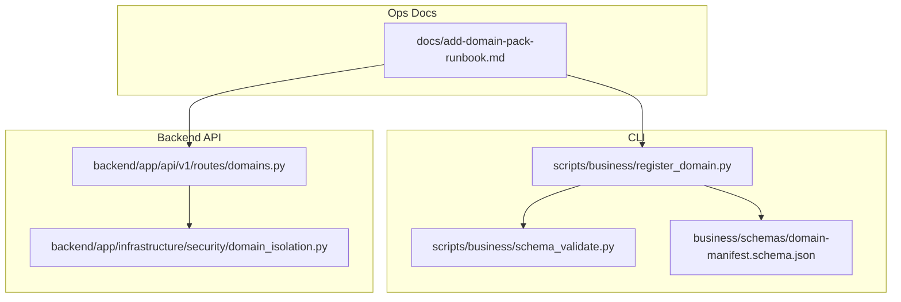
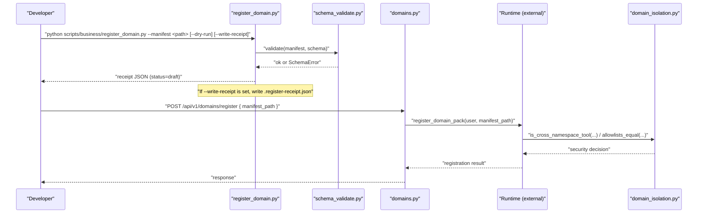
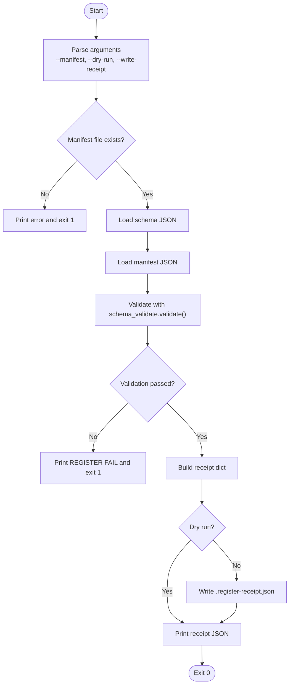
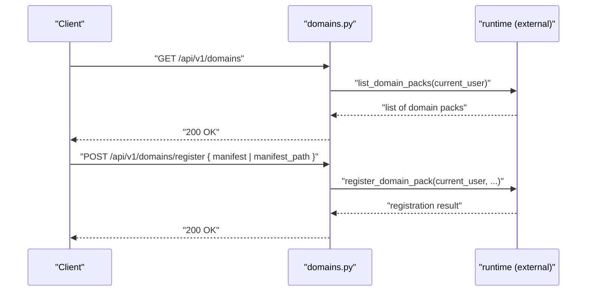
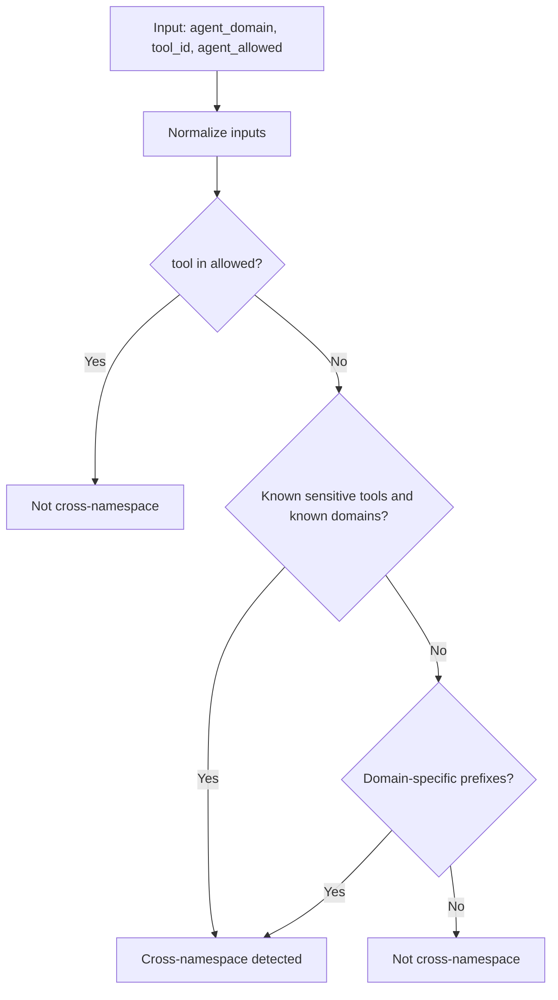
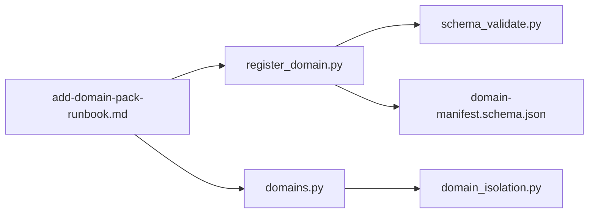

# Domain Registration & Lifecycle Management

<cite>
**Referenced Files in This Document**
- [register_domain.py](file://scripts/business/register_domain.py)
- [schema_validate.py](file://scripts/business/schema_validate.py)
- [domain-manifest.schema.json](file://business/schemas/domain-manifest.schema.json)
- [domains.py](file://backend/app/api/v1/routes/domains.py)
- [domain_isolation.py](file://backend/app/infrastructure/security/domain_isolation.py)
- [add-domain-pack-runbook.md](file://docs/add-domain-pack-runbook.md)
</cite>

## Table of Contents
1. [Introduction](#introduction)
2. [Project Structure](#project-structure)
3. [Core Components](#core-components)
4. [Architecture Overview](#architecture-overview)
5. [Detailed Component Analysis](#detailed-component-analysis)
6. [Dependency Analysis](#dependency-analysis)
7. [Performance Considerations](#performance-considerations)
8. [Troubleshooting Guide](#troubleshooting-guide)
9. [Conclusion](#conclusion)
10. [Appendices](#appendices)

## Introduction
This document explains domain pack registration and lifecycle management across the CLI and API layers. It covers:
- How to register a new domain pack using the CLI script, including validation, dry-run mode, and receipt generation.
- The API endpoints for listing domains and registering domain packs.
- Manifest validation rules enforced by JSON Schema and the custom validator.
- Isolation boundaries between domains and organizations, including tool namespace checks and allow-list immutability.
- Step-by-step guides for registering domains, activating agents, and managing versions across environments.

## Project Structure
The domain registration feature spans three areas:
- CLI tooling under scripts/business for local validation and receipt generation.
- Backend API routes under backend/app/api/v1/routes for runtime registration and listing.
- Security helpers under backend/app/infrastructure/security for cross-pack isolation.



**Diagram sources**
- [register_domain.py:1-58](file://scripts/business/register_domain.py#L1-L58)
- [schema_validate.py:1-86](file://scripts/business/schema_validate.py#L1-L86)
- [domain-manifest.schema.json:1-77](file://business/schemas/domain-manifest.schema.json#L1-L77)
- [domains.py:1-59](file://backend/app/api/v1/routes/domains.py#L1-L59)
- [domain_isolation.py:1-77](file://backend/app/infrastructure/security/domain_isolation.py#L1-L77)
- [add-domain-pack-runbook.md:1-113](file://docs/add-domain-pack-runbook.md#L1-L113)

**Section sources**
- [register_domain.py:1-58](file://scripts/business/register_domain.py#L1-L58)
- [schema_validate.py:1-86](file://scripts/business/schema_validate.py#L1-L86)
- [domain-manifest.schema.json:1-77](file://business/schemas/domain-manifest.schema.json#L1-L77)
- [domains.py:1-59](file://backend/app/api/v1/routes/domains.py#L1-L59)
- [domain_isolation.py:1-77](file://backend/app/infrastructure/security/domain_isolation.py#L1-L77)
- [add-domain-pack-runbook.md:1-113](file://docs/add-domain-pack-runbook.md#L1-L113)

## Core Components
- CLI registration stub: Validates manifest against schema, supports dry-run, and writes a receipt file when requested.
- Custom JSON Schema subset validator: Enforces types, required fields, enums, min length, minimum values, arrays with oneOf items.
- API route for domain operations: Lists domains and registers domain packs via runtime methods.
- Cross-pack isolation helpers: Provides domain prefix extraction, cross-namespace tool detection, and allow-list equality checks.

Key responsibilities:
- Validation: Ensure manifests conform to the domain manifest schema before any runtime changes.
- Receipt generation: Produce an immutable record of the registration attempt (draft or written).
- API exposure: Provide endpoints for listing and registering domain packs.
- Isolation: Prevent cross-pack tool access and enforce allow-list immutability.

**Section sources**
- [register_domain.py:17-53](file://scripts/business/register_domain.py#L17-L53)
- [schema_validate.py:32-86](file://scripts/business/schema_validate.py#L32-L86)
- [domain-manifest.schema.json:1-77](file://business/schemas/domain-manifest.schema.json#L1-L77)
- [domains.py:9-21](file://backend/app/api/v1/routes/domains.py#L9-L21)
- [domain_isolation.py:31-77](file://backend/app/infrastructure/security/domain_isolation.py#L31-L77)

## Architecture Overview
The registration flow combines CLI validation and API-driven runtime registration. The CLI performs strict schema validation locally and can generate a receipt. The API exposes endpoints that delegate to runtime services, which may use isolation helpers to enforce security boundaries.



**Diagram sources**
- [register_domain.py:17-53](file://scripts/business/register_domain.py#L17-L53)
- [schema_validate.py:32-86](file://scripts/business/schema_validate.py#L32-L86)
- [domains.py:14-21](file://backend/app/api/v1/routes/domains.py#L14-L21)
- [domain_isolation.py:43-77](file://backend/app/infrastructure/security/domain_isolation.py#L43-L77)

## Detailed Component Analysis

### CLI Registration Script
Purpose:
- Validate a domain manifest against the schema.
- Support dry-run mode to avoid side effects.
- Optionally write a receipt file summarizing the validation outcome.

Behavior highlights:
- Reads the schema from business/schemas/domain-manifest.schema.json.
- Uses the custom validator to enforce constraints.
- Produces a receipt object with status, identifiers, agent count, and dry-run flag.
- When not in dry-run, writes a receipt file next to the manifest.



**Diagram sources**
- [register_domain.py:37-53](file://scripts/business/register_domain.py#L37-L53)
- [schema_validate.py:32-86](file://scripts/business/schema_validate.py#L32-L86)

**Section sources**
- [register_domain.py:17-53](file://scripts/business/register_domain.py#L17-L53)

### Manifest Schema and Validation
Purpose:
- Define the contract for domain manifests.
- Enforce required fields, enumerations, and nested structures.

Key constraints:
- Required fields include identifiers, version, display name, ALC requirement, agents, and workflows.
- Agents and workflows support both string references and structured objects with id/path.
- Optional fields include default risk tier, knowledge seed globs, API hooks, and provenance.

Validation implementation:
- Custom validator enforces type checks, required properties, enum membership, minLength, minimum numeric bounds, array sizes, and oneOf branches for flexible item schemas.

```mermaid
classDiagram
class DomainManifestSchema {
+required : ["domain_id","version","display_name","requires_alc","agents","workflows"]
+properties : {
domain_id : string(minLength>=1),
version : string(minLength>=1),
display_name : string(minLength>=1),
default_risk_tier : enum[tier_0..tier_5],
requires_alc : boolean,
agents : array(oneOf[string|{id,path}]),
workflows : array(oneOf[string|{id,path}]),
knowledge_seed_globs : array[string],
api_hooks : object{on_register : string, tool_namespace : string},
provenance : object
}
}
class Validator {
+validate(instance, schema, path)
-_type_ok(value, expected) bool
}
DomainManifestSchema <.. Validator : "validated by"
```

**Diagram sources**
- [domain-manifest.schema.json:1-77](file://business/schemas/domain-manifest.schema.json#L1-L77)
- [schema_validate.py:12-86](file://scripts/business/schema_validate.py#L12-L86)

**Section sources**
- [domain-manifest.schema.json:1-77](file://business/schemas/domain-manifest.schema.json#L1-L77)
- [schema_validate.py:32-86](file://scripts/business/schema_validate.py#L32-L86)

### API Endpoints for Domain Operations
Endpoints:
- List domains: GET /api/v1/domains
- Register domain pack: POST /api/v1/domains/register

Notes:
- Both endpoints require authentication via current user context.
- The register endpoint accepts either a manifest payload or a manifest path reference.
- Additional video-specific endpoints exist but are outside the scope of core domain registration.



**Diagram sources**
- [domains.py:9-21](file://backend/app/api/v1/routes/domains.py#L9-L21)

**Section sources**
- [domains.py:9-21](file://backend/app/api/v1/routes/domains.py#L9-L21)

### Domain Isolation and Resource Scoping
Purpose:
- Enforce isolation boundaries between domain packs.
- Detect cross-namespace tool usage and ensure allow-lists remain immutable.

Key functions:
- Extract domain prefix from agent_id or explicit domain_id.
- Determine if a tool is considered cross-namespace based on known domains and sensitive tool sets.
- Compare allow-lists order-insensitively to prevent expansion during injection.



**Diagram sources**
- [domain_isolation.py:31-67](file://backend/app/infrastructure/security/domain_isolation.py#L31-L67)

**Section sources**
- [domain_isolation.py:31-77](file://backend/app/infrastructure/security/domain_isolation.py#L31-L77)

### Relationship Between Domains and Organizations
Conceptual overview:
- Domains represent bounded collections of agents, workflows, and resources.
- Organization-level scoping is typically enforced at the runtime layer; this repository provides isolation helpers to prevent cross-domain tool access and maintain allow-list integrity.
- For organization-specific behavior, consult runtime integration points and authorization modules referenced by the API routes.

[No sources needed since this section doesn't analyze specific files]

## Dependency Analysis
High-level dependencies:
- CLI depends on schema and validator.
- API routes depend on runtime services and isolation helpers.
- Documentation references both CLI and API flows.



**Diagram sources**
- [register_domain.py:1-58](file://scripts/business/register_domain.py#L1-L58)
- [schema_validate.py:1-86](file://scripts/business/schema_validate.py#L1-L86)
- [domain-manifest.schema.json:1-77](file://business/schemas/domain-manifest.schema.json#L1-L77)
- [domains.py:1-59](file://backend/app/api/v1/routes/domains.py#L1-L59)
- [domain_isolation.py:1-77](file://backend/app/infrastructure/security/domain_isolation.py#L1-L77)
- [add-domain-pack-runbook.md:1-113](file://docs/add-domain-pack-runbook.md#L1-L113)

**Section sources**
- [register_domain.py:1-58](file://scripts/business/register_domain.py#L1-L58)
- [schema_validate.py:1-86](file://scripts/business/schema_validate.py#L1-L86)
- [domain-manifest.schema.json:1-77](file://business/schemas/domain-manifest.schema.json#L1-L77)
- [domains.py:1-59](file://backend/app/api/v1/routes/domains.py#L1-L59)
- [domain_isolation.py:1-77](file://backend/app/infrastructure/security/domain_isolation.py#L1-L77)
- [add-domain-pack-runbook.md:1-113](file://docs/add-domain-pack-runbook.md#L1-L113)

## Performance Considerations
- CLI validation is lightweight and suitable for pre-commit checks.
- API registration delegates to runtime services; ensure efficient manifest parsing and caching where applicable.
- Avoid unnecessary schema reloads by loading schema once per process in CLI.

[No sources needed since this section provides general guidance]

## Troubleshooting Guide
Common issues and resolutions:
- Missing manifest file: Ensure the path exists and is readable.
- Schema validation errors: Review required fields, types, enums, and array constraints.
- Dry-run vs receipt: Use --dry-run to preview; add --write-receipt to persist a receipt file.
- Cross-namespace tool errors: Verify tool allow-lists and domain prefixes; ensure no unauthorized tool grants.

Operational tips:
- Run the CLI dry-run before invoking the API to catch manifest issues early.
- Inspect the generated receipt for status and metadata after registration attempts.

**Section sources**
- [register_domain.py:37-53](file://scripts/business/register_domain.py#L37-L53)
- [schema_validate.py:32-86](file://scripts/business/schema_validate.py#L32-L86)
- [domain_isolation.py:43-77](file://backend/app/infrastructure/security/domain_isolation.py#L43-L77)

## Conclusion
The domain registration system combines robust CLI validation with API-driven runtime registration and strong isolation controls. By following the provided steps and leveraging receipts and isolation helpers, teams can safely onboard new domain packs and manage their lifecycles across environments.

[No sources needed since this section summarizes without analyzing specific files]

## Appendices

### Step-by-Step Guides

#### Register a New Domain Pack (CLI)
- Prepare the manifest under business/<domain_id>/manifest.json with required fields.
- Run the CLI in dry-run mode to validate:
  - python scripts/business/register_domain.py --manifest business/<domain_id>/manifest.json --dry-run
- If satisfied, optionally write a receipt:
  - python scripts/business/register_domain.py --manifest business/<domain_id>/manifest.json --write-receipt

**Section sources**
- [add-domain-pack-runbook.md:49-54](file://docs/add-domain-pack-runbook.md#L49-L54)
- [register_domain.py:37-53](file://scripts/business/register_domain.py#L37-L53)

#### Register a Domain Pack (API)
- Send a POST request to /api/v1/domains/register with either a manifest payload or a manifest_path reference.
- Authentication is required; ensure the current user context is valid.

**Section sources**
- [domains.py:14-21](file://backend/app/api/v1/routes/domains.py#L14-L21)
- [add-domain-pack-runbook.md:58-63](file://docs/add-domain-pack-runbook.md#L58-L63)

#### Activate Agents (ALC Gate)
- After registration, agents load as draft/registered.
- Activate agents by PATCHing their resource to active only after ALC fields pass validation.

**Section sources**
- [add-domain-pack-runbook.md:65-67](file://docs/add-domain-pack-runbook.md#L65-L67)

#### Manage Domain Versions Across Environments
- Maintain separate manifests per environment as needed.
- Use the CLI dry-run to validate changes before applying them in staging or production.
- Keep receipts for auditability and traceability.

**Section sources**
- [add-domain-pack-runbook.md:110-113](file://docs/add-domain-pack-runbook.md#L110-L113)
- [register_domain.py:21-34](file://scripts/business/register_domain.py#L21-L34)