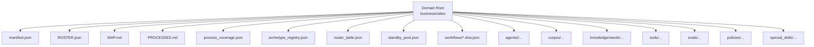
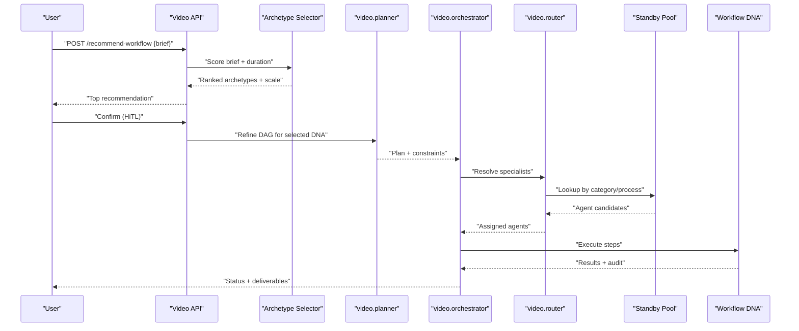
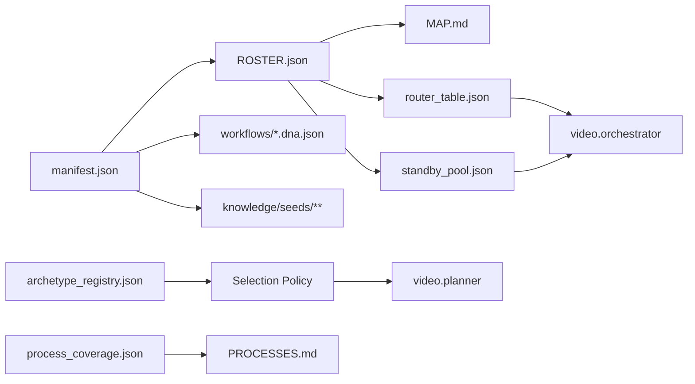

# Video Production Domain Pack

<cite>
**Referenced Files in This Document**
- [README.md](file://business/video/README.md)
- [manifest.json](file://business/video/manifest.json)
- [MAP.md](file://business/video/MAP.md)
- [PROCESSES.md](file://business/video/PROCESSES.md)
- [ROSTER.json](file://business/video/ROSTER.json)
- [archetype_registry.json](file://business/video/archetype_registry.json)
- [router_table.json](file://business/video/router_table.json)
- [standby_pool.json](file://business/video/standby_pool.json)
- [process_coverage.json](file://business/video/process_coverage.json)
</cite>

## Table of Contents
1. [Introduction](#introduction)
2. [Project Structure](#project-structure)
3. [Core Components](#core-components)
4. [Architecture Overview](#architecture-overview)
5. [Detailed Component Analysis](#detailed-component-analysis)
6. [Dependency Analysis](#dependency-analysis)
7. [Performance Considerations](#performance-considerations)
8. [Troubleshooting Guide](#troubleshooting-guide)
9. [Conclusion](#conclusion)
10. [Appendices](#appendices)

## Introduction
This document presents the Video Production Domain Pack as a complete, N3-compliant domain implementation example. It catalogs 114 specialized video agents, explains their roles and interdependencies, and documents the workflow patterns, process intelligence artifacts, and evaluation frameworks that power end-to-end video production. It also covers agent roster management, standby pool configuration, router table functionality, tools, knowledge organization, governance policies, and guidance for extending the domain while maintaining compliance.

The pack is self-contained: all 114 agents are cataloged and reachable via orchestrator-driven routing, with DNA-based workflows defining execution paths and HiTL (Human-in-the-Loop) gates where required.

**Section sources**
- [README.md:1-77](file://business/video/README.md#L1-L77)

## Project Structure
At the top level, the video domain pack includes:
- Agent definitions and mapping to source IDs
- Process index and coverage across DNA and documentation
- Archetype registry for brief-to-workflow selection
- Router table and standby pool for runtime orchestration
- Manifest declaring domain metadata, agents, workflows, and API hooks

**Diagram sources**
- [manifest.json:1-153](file://business/video/manifest.json#L1-L153)
- [ROSTER.json:1-800](file://business/video/ROSTER.json#L1-L800)
- [MAP.md:1-121](file://business/video/MAP.md#L1-L121)
- [PROCESSES.md:1-86](file://business/video/PROCESSES.md#L1-L86)
- [process_coverage.json:1-212](file://business/video/process_coverage.json#L1-L212)
- [archetype_registry.json:1-328](file://business/video/archetype_registry.json#L1-L328)
- [router_table.json:1-314](file://business/video/router_table.json#L1-L314)
- [standby_pool.json:1-921](file://business/video/standby_pool.json#L1-L921)

**Section sources**
- [README.md:46-77](file://business/video/README.md#L46-L77)
- [manifest.json:1-153](file://business/video/manifest.json#L1-L153)

## Core Components
- Domain manifest: declares domain id, version, default risk tier, requires human control, lists all 114 agents, workflows, knowledge seed globs, and API hooks.
- Roster: machine-readable list of 114 agents with ids, names, categories, and source references.
- MAP: maps legacy va_ids to pack_ids and file paths, including runtime status and notes.
- Processes index: enumerates spine, six-phase E2E, archetypes A–J, LQR family, delivery/QC, and links to DNA or pack docs.
- Process coverage: authoritative inventory of processes with representation type (DNA or pack doc), path, and status.
- Archetype registry: defines entry agents, selection policy (including HiTL confirm), scale profiles S1–S7, and archetype definitions with keywords, lead/critic agents, and depth.
- Router table: categorizes agents into 10 categories, maps process_ids to entry agents and participating agents.
- Standby pool: ensures every roster agent is listed with reachability flags and spine membership.

Key responsibilities:
- Orchestration spine: video.orchestrator and video.planner drive planning and execution.
- Selection flow: classifier scores brief → selects archetype + scale → optional HiTL confirm → planner refines DAG → orchestrator executes DNA → router fills specialists from standby/router_table.
- Governance: default risk tiers per archetype; feature film uses higher-risk tier requiring gate.

**Section sources**
- [manifest.json:1-153](file://business/video/manifest.json#L1-L153)
- [ROSTER.json:1-800](file://business/video/ROSTER.json#L1-L800)
- [MAP.md:1-121](file://business/video/MAP.md#L1-L121)
- [PROCESSES.md:1-86](file://business/video/PROCESSES.md#L1-L86)
- [process_coverage.json:1-212](file://business/video/process_coverage.json#L1-L212)
- [archetype_registry.json:1-328](file://business/video/archetype_registry.json#L1-L328)
- [router_table.json:1-314](file://business/video/router_table.json#L1-L314)
- [standby_pool.json:1-921](file://business/video/standby_pool.json#L1-L921)

## Architecture Overview
The video domain follows an orchestrator-down hierarchy with deterministic selection and human oversight.

**Diagram sources**
- [archetype_registry.json:1-328](file://business/video/archetype_registry.json#L1-L328)
- [router_table.json:1-314](file://business/video/router_table.json#L1-L314)
- [standby_pool.json:1-921](file://business/video/standby_pool.json#L1-L921)
- [PROCESSES.md:56-86](file://business/video/PROCESSES.md#L56-L86)

## Detailed Component Analysis

### Agent Roster Management
- The roster enumerates all 114 agents with stable ids, human-readable names, category tags, and source references. Categories align with production phases and support routing and capacity planning.
- The MAP provides a canonical mapping from legacy identifiers to pack ids and filesystem locations, enabling backward compatibility and traceability.

Operational implications:
- Inventory checks enforce presence of all 114 entries.
- Runtime activation may remain draft; catalog presence is mandatory.

**Section sources**
- [ROSTER.json:1-800](file://business/video/ROSTER.json#L1-L800)
- [MAP.md:1-121](file://business/video/MAP.md#L1-L121)
- [README.md:28-34](file://business/video/README.md#L28-L34)

### Standby Pool Configuration
- Every roster agent appears in the standby pool with fields indicating route, spine membership, and N3 reachability.
- Spine agents form the core control plane (e.g., orchestrator, planner, aiqaconsistency). Non-spine agents are on-demand specialists.

Usage:
- Orchestrator consults the standby pool to discover reachable agents for a given process or category.
- Scale profiles influence which branches and agents are activated.

**Section sources**
- [standby_pool.json:1-921](file://business/video/standby_pool.json#L1-L921)

### Router Table Functionality
- Groups agents into 10 categories aligned with production roles (e.g., ATL, Cam, Edit, Snd, Perf, Dist, Edu, AI, Meta, Sup).
- Maps process_ids to entry agents and participating agents, enabling deterministic specialization during execution.

Runtime behavior:
- When a DNA step requires a specialist, the orchestrator queries the router table to select appropriate agents based on process context.

**Section sources**
- [router_table.json:1-314](file://business/video/router_table.json#L1-L314)

### Workflow Patterns and Process Intelligence
- Spine processes define minimal orchestration and planning flows.
- Six-phase E2E process models map to a shared DNA covering intent planning through delivery.
- Archetypes A–J represent common production types with varying depths (runnable spine, phased_v1, thin stubs).
- LQR family supports long-form quality review loops and scene-level iteration.
- Delivery/QC processes package outputs and run consistency checks.

Process intelligence artifacts:
- Process index and coverage files provide authoritative mappings between process_ids, DNA paths, and statuses.
- Documentation-linked maps and deep-spec modules complement executable flows.

**Section sources**
- [PROCESSES.md:1-86](file://business/video/PROCESSES.md#L1-L86)
- [process_coverage.json:1-212](file://business/video/process_coverage.json#L1-L212)

### Evaluation Frameworks
- The domain includes evaluation assets under evals (golden tasks, adversarial tests, regression sets, retrieval benchmarks).
- The EvaluationHarnessAgent is part of the roster and can be invoked by workflows to automate scoring and replay.

Guidance:
- Use golden tasks to validate new workflows.
- Integrate regression suites into CI to guard against regressions.

**Section sources**
- [manifest.json:7-122](file://business/video/manifest.json#L7-L122)

### Tools and Knowledge Organization
- Tools namespace is declared in the manifest for domain-scoped tool access.
- Knowledge seeds are registered via glob patterns to bootstrap retrieval.
- Corpus mirrors upstream research materials for grounding and provenance.

Best practices:
- Keep domain logic within the pack (N1).
- Use shared schemas and manifests (N2).
- Maintain full roster and process index (N3).

**Section sources**
- [manifest.json:139-153](file://business/video/manifest.json#L139-L153)
- [README.md:35-45](file://business/video/README.md#L35-L45)

### Governance Policies
- Default risk tiers vary by archetype; feature film uses a higher-risk tier requiring gates.
- HiTL confirmation is required by default before launching recommended workflows.
- Risk-tiering and approval policies integrate with platform governance.

Compliance:
- All 114 agents must remain cataloged.
- Inventory CI enforces counts and completeness.

**Section sources**
- [archetype_registry.json:5-11](file://business/video/archetype_registry.json#L5-L11)
- [PROCESSES.md:56-86](file://business/video/PROCESSES.md#L56-L86)
- [README.md:28-34](file://business/video/README.md#L28-L34)

### Extending the Video Domain (N3 Compliance)
To add a new agent or workflow:
- Add the agent to ROSTER.json with a unique id, name, category, and source reference.
- Ensure standby_pool.json includes the agent with n3_reachable set appropriately.
- If introducing a new archetype or updating selection rules, update archetype_registry.json (keywords, lead/critic agents, allowed scales).
- Register any new DNA under workflows and update process_coverage.json and PROCESSES.md accordingly.
- Update router_table.json if the new agent participates in existing or new processes.
- Validate with repository scripts and CI checks.

N3 checklist:
- Full roster present (114 agents).
- Process index consistent with coverage.
- Orchestrator-down hierarchy preserved.

**Section sources**
- [ROSTER.json:1-800](file://business/video/ROSTER.json#L1-L800)
- [standby_pool.json:1-921](file://business/video/standby_pool.json#L1-L921)
- [archetype_registry.json:1-328](file://business/video/archetype_registry.json#L1-L328)
- [process_coverage.json:1-212](file://business/video/process_coverage.json#L1-L212)
- [PROCESSES.md:1-86](file://business/video/PROCESSES.md#L1-L86)
- [router_table.json:1-314](file://business/video/router_table.json#L1-L314)
- [README.md:28-34](file://business/video/README.md#L28-L34)

## Dependency Analysis
The following diagram shows how key configuration files depend on each other and guide runtime behavior.

**Diagram sources**
- [manifest.json:1-153](file://business/video/manifest.json#L1-L153)
- [ROSTER.json:1-800](file://business/video/ROSTER.json#L1-L800)
- [MAP.md:1-121](file://business/video/MAP.md#L1-L121)
- [router_table.json:1-314](file://business/video/router_table.json#L1-L314)
- [standby_pool.json:1-921](file://business/video/standby_pool.json#L1-L921)
- [archetype_registry.json:1-328](file://business/video/archetype_registry.json#L1-L328)
- [process_coverage.json:1-212](file://business/video/process_coverage.json#L1-L212)
- [PROCESSES.md:1-86](file://business/video/PROCESSES.md#L1-L86)

**Section sources**
- [manifest.json:1-153](file://business/video/manifest.json#L1-L153)
- [ROSTER.json:1-800](file://business/video/ROSTER.json#L1-L800)
- [archetype_registry.json:1-328](file://business/video/archetype_registry.json#L1-L328)
- [router_table.json:1-314](file://business/video/router_table.json#L1-L314)
- [standby_pool.json:1-921](file://business/video/standby_pool.json#L1-L921)
- [process_coverage.json:1-212](file://business/video/process_coverage.json#L1-L212)
- [PROCESSES.md:1-86](file://business/video/PROCESSES.md#L1-L86)

## Performance Considerations
- Prefer thin stubs for less-critical archetypes until deeper workflows are needed; this reduces orchestration overhead.
- Use scale profiles to limit agent budgets and delivery branches for smaller productions.
- Cache archetype selection results for similar briefs to reduce repeated classification cost.
- Route only necessary specialists using router_table and standby pool to minimize parallel fan-out.

[No sources needed since this section provides general guidance]

## Troubleshooting Guide
Common issues and resolutions:
- Missing agent in standby pool: ensure every roster entry has a corresponding standby pool record with n3_reachable true.
- Router mismatch: verify process_ids in router_table match those referenced by workflows and process coverage.
- Archetype misclassification: adjust keyword/negative_keyword lists in archetype_registry to improve selection accuracy.
- HiTL failures: confirm user approval was recorded before launch; check selection policy require_hitl_confirm settings.
- Process coverage drift: regenerate or reconcile process_coverage.json and PROCESSES.md after adding/removing DNA.

Validation commands and checks:
- Use repository scripts to validate corpus independence and enrich agent specs when needed.
- Run inventory checks to ensure 114-agent count and MAP completeness.

**Section sources**
- [standby_pool.json:1-921](file://business/video/standby_pool.json#L1-L921)
- [router_table.json:1-314](file://business/video/router_table.json#L1-L314)
- [archetype_registry.json:1-328](file://business/video/archetype_registry.json#L1-L328)
- [process_coverage.json:1-212](file://business/video/process_coverage.json#L1-L212)
- [PROCESSES.md:1-86](file://business/video/PROCESSES.md#L1-L86)
- [README.md:25-27](file://business/video/README.md#L25-L27)

## Conclusion
The Video Production Domain Pack provides a comprehensive, N3-compliant foundation for automated video production. With 114 agents, robust orchestration, deterministic workflow selection, and strong governance, it enables scalable, auditable, and extensible video workflows. Following the extension guidelines ensures continued compliance and operational stability.

[No sources needed since this section summarizes without analyzing specific files]

## Appendices

### Appendix A: Archetype Quick Reference
- A: Viral Hook Clip — short, social-first, runnable spine
- B: UGC Ad — performance-oriented, phased_v1
- C: Animated Explainer — instructional focus, thin stub
- D: Personalized Birthday — CRM/personalization, thin stub
- E: AI Short Film — narrative multi-scene, phased_v1
- F: Corporate Training — LMS/compliance, thin stub
- G: Music Video — performance/music, thin stub
- H: AI Avatar — digital human, thin stub
- I: Documentary — journalism/fact-check, thin stub
- J: Feature Film — high-risk tier, gated

**Section sources**
- [archetype_registry.json:56-327](file://business/video/archetype_registry.json#L56-L327)