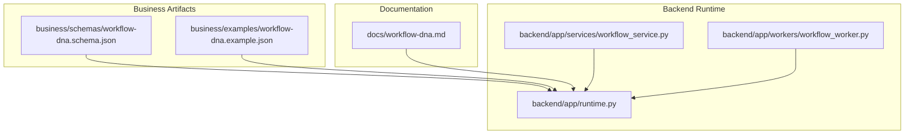
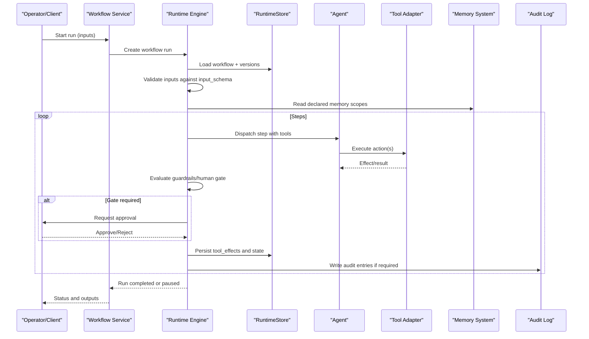
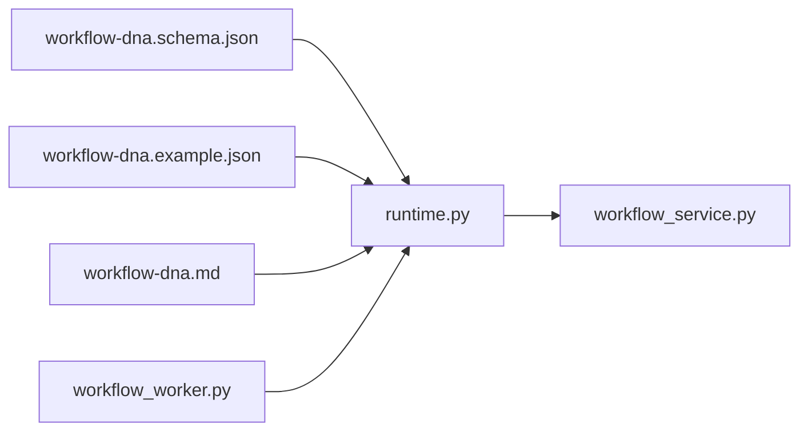

# Workflow Templates & DNA

<cite>
**Referenced Files in This Document**
- [workflow-dna.schema.json](file://business/schemas/workflow-dna.schema.json)
- [workflow-dna.example.json](file://business/examples/workflow-dna.example.json)
- [workflow-dna.md](file://docs/workflow-dna.md)
- [runtime.py](file://backend/app/runtime.py)
- [workflow_service.py](file://backend/app/services/workflow_service.py)
- [workflow_worker.py](file://backend/app/workers/workflow_worker.py)
</cite>

## Table of Contents
1. [Introduction](#introduction)
2. [Project Structure](#project-structure)
3. [Core Components](#core-components)
4. [Architecture Overview](#architecture-overview)
5. [Detailed Component Analysis](#detailed-component-analysis)
6. [Dependency Analysis](#dependency-analysis)
7. [Performance Considerations](#performance-considerations)
8. [Troubleshooting Guide](#troubleshooting-guide)
9. [Conclusion](#conclusion)
10. [Appendices](#appendices)

## Introduction
This document explains workflow templates and DNA definitions within domain packs, focusing on the Workflow DNA schema, step graph semantics, input/output schemas, memory operations, guardrails, verification, rollback, versioning, orchestration patterns (including conditional branching and parallel execution), error handling, testing strategies, and integration with agents, tools, and memory systems. It also provides a comprehensive example drawn from the customer onboarding DNA that demonstrates multi-step processes with human approval gates and evaluation criteria.

## Project Structure
The repository organizes workflow-related artifacts across three primary areas:
- Schema and examples under business/schemas and business/examples
- Documentation under docs
- Runtime implementation under backend/app including runtime engine, services, and workers

**Diagram sources**
- [workflow-dna.schema.json:1-258](file://business/schemas/workflow-dna.schema.json#L1-L258)
- [workflow-dna.example.json:1-153](file://business/examples/workflow-dna.example.json#L1-L153)
- [workflow-dna.md:1-37](file://docs/workflow-dna.md#L1-L37)
- [runtime.py:395-436](file://backend/app/runtime.py#L395-L436)
- [workflow_service.py:1-38](file://backend/app/services/workflow_service.py#L1-L38)
- [workflow_worker.py:1-10](file://backend/app/workers/workflow_worker.py#L1-L10)

**Section sources**
- [workflow-dna.schema.json:1-258](file://business/schemas/workflow-dna.schema.json#L1-L258)
- [workflow-dna.example.json:1-153](file://business/examples/workflow-dna.example.json#L1-L153)
- [workflow-dna.md:1-37](file://docs/workflow-dna.md#L1-L37)
- [runtime.py:395-436](file://backend/app/runtime.py#L395-L436)
- [workflow_service.py:1-38](file://backend/app/services/workflow_service.py#L1-L38)
- [workflow_worker.py:1-10](file://backend/app/workers/workflow_worker.py#L1-L10)

## Core Components
- Workflow DNA schema defines the canonical contract for workflows: identifiers, metadata, risk tier, inputs, preconditions, steps graph, memory reads/writes, guardrails, verification, rollback, fitness metrics, audit requirements, and provenance.
- Example DNA provides a concrete, runnable template demonstrating steps, human gates, memory references, and governance policies.
- Runtime loads and normalizes DNA into executable workflow records, including input/output schemas, versions, and governance policy derived from DNA.
- Services expose CRUD and lifecycle operations over workflows and versions.
- Worker discovers pending runs to drive execution.

Key responsibilities:
- Schema validation and enforcement of required fields and constraints
- Normalization of DNA into runtime-friendly structures
- Version management and activation
- Human gate enforcement and audit logging
- Memory scoping and tool permission checks

**Section sources**
- [workflow-dna.schema.json:1-258](file://business/schemas/workflow-dna.schema.json#L1-L258)
- [workflow-dna.example.json:1-153](file://business/examples/workflow-dna.example.json#L1-L153)
- [runtime.py:395-436](file://backend/app/runtime.py#L395-L436)
- [workflow_service.py:1-38](file://backend/app/services/workflow_service.py#L1-L38)
- [workflow_worker.py:1-10](file://backend/app/workers/workflow_worker.py#L1-L10)

## Architecture Overview
The runtime orchestrates workflow execution by reading DNA definitions, enforcing guardrails and approvals, invoking agents and tools, and persisting effects and audit logs.

**Diagram sources**
- [runtime.py:395-436](file://backend/app/runtime.py#L395-L436)
- [workflow_service.py:1-38](file://backend/app/services/workflow_service.py#L1-L38)
- [workflow-worker.py:1-10](file://backend/app/workers/workflow_worker.py#L1-L10)

## Detailed Component Analysis

### Workflow DNA Schema
The schema enforces a strict contract for production-ready workflows. Highlights:
- Top-level identity and governance: id, name, domain, objective, owner, version, risk_tier, production_ready
- Inputs and preconditions: arrays of strings describing required inputs and boolean conditions
- Steps graph: each step declares id, state, next targets, agent, tools, action_type, human_gate_required, irreversible
- Memory operations: memory_reads and memory_writes declare scoped access
- Guardrails: human_approval_required_if rules, forbidden_actions, decision_requirement_cards
- Verification: required_checks list
- Rollback: reversible flag and ordered rollback_steps
- Fitness metrics: array of measurable outcomes
- Audit and provenance: audit_log_write_required and provenance metadata

Complexity considerations:
- Step graph traversal is O(V+E) where V is number of steps and E is edges defined by next arrays
- Validation is linear in total field count; schema constraints ensure early failure on malformed definitions

Best practices:
- Keep next arrays minimal and explicit to avoid ambiguity
- Use human_gate_required only for irreversible or high-risk actions
- Declare all memory scopes explicitly for clarity and security

**Section sources**
- [workflow-dna.schema.json:1-258](file://business/schemas/workflow-dna.schema.json#L1-L258)

### Example DNA: Customer Onboarding
The example demonstrates:
- Multi-step flow with research, execution, critical gate, notification, and verification states
- Human gate at billing activation due to irreversible action
- Memory reads for contract rules and exceptions; writes to event log and lessons learned
- Guardrails referencing decision requirement cards and forbidden actions
- Verification checks ensuring CRM record creation, billing validation, notifications, and audit completeness
- Rollback plan with specific remediation steps
- Provenance linking to source documents and capture metadata

Operational implications:
- The example’s risk tier triggers human approval conditions
- Evaluation policy can block on failures during verification
- Audit logging is mandatory for compliance

**Section sources**
- [workflow-dna.example.json:1-153](file://business/examples/workflow-dna.example.json#L1-L153)

### Runtime Loading and Normalization
The runtime seeds and normalizes workflows from DNA examples:
- Loads DNA JSON and augments it with execution fields such as input_schema, output_schema, evaluation_policy, governance_policy, active_version, and versions
- Ensures status, description, and versions are present for live operation
- Derives governance policy including human_gate_steps from steps marked with human_gate_required

Normalization guarantees:
- Default input/output schemas when missing
- Active version selection based on production readiness
- Immutable version snapshots of steps for reproducibility

**Section sources**
- [runtime.py:395-436](file://backend/app/runtime.py#L395-L436)
- [runtime.py:674-728](file://backend/app/runtime.py#L674-L728)

### Workflow Services and Workers
Services provide endpoints to manage workflows and versions:
- List, get, create, update, add version, activate version, disable, archive
Workers assist in discovering and processing pending runs:
- Scans runtime store for running workflow runs to continue execution

These components integrate with the runtime engine to enforce permissions and persist state.

**Section sources**
- [workflow_service.py:1-38](file://backend/app/services/workflow_service.py#L1-L38)
- [workflow_worker.py:1-10](file://backend/app/workers/workflow_worker.py#L1-L10)

### Orchestration Patterns
- Conditional branching: modeled via next arrays per step; multiple targets enable branching based on prior results
- Parallel execution: supported by declaring multiple next targets; the engine should schedule independent steps concurrently while respecting dependencies
- Error handling: use verification.required_checks to assert postconditions; guardrails forbid unsafe actions; human gates pause risky transitions
- Reversibility: mark steps irreversible only when necessary; define rollback_steps to restore system state

Implementation guidance:
- Prefer small, composable steps with clear pre/postconditions
- Use evaluation_policy.block_on_fail to halt on verification errors
- Ensure every irreversible path has a documented rollback plan

[No sources needed since this section provides general guidance]

### Versioning and Rollback
- Each workflow maintains versions with immutable snapshots of steps
- Activate a version to switch execution context without mutating historical runs
- Disable/archive workflows to control visibility and availability
- Rollback strategy is defined in DNA via reversible flag and rollback_steps; the runtime can execute these steps upon failure or operator request

Operational notes:
- Promote variants through evaluation before activating in production
- Maintain provenance for traceability across versions

**Section sources**
- [runtime.py:395-436](file://backend/app/runtime.py#L395-L436)
- [workflow_service.py:1-38](file://backend/app/services/workflow_service.py#L1-L38)

### Testing Approaches
- Schema validation: use provided scripts to validate business assets and evolution checks
- Unit tests: verify normalization logic and version management
- Integration tests: simulate runs with sample inputs, assert tool_effects and audit logs
- End-to-end tests: exercise human gates and approval flows using test users and tokens

Recommended fixtures:
- Golden inputs and expected outputs for key workflows
- Negative cases for guardrail violations and missing approvals

**Section sources**
- [workflow-dna.md:25-32](file://docs/workflow-dna.md#L25-L32)

### Integration with Agents, Tools, and Memory
- Agents: assigned per step; must be registered with allowed_tools and allowed_memory_scopes
- Tools: adapters invoked by agents; runtime enforces permissions and approval requirements
- Memory: read/write scopes declared in DNA; runtime ensures agents have authorization for requested scopes

Integration checklist:
- Register agents and tools in runtime seed
- Map step.agent to a valid agent id
- Ensure step.tools are permitted for the agent
- Declare memory_reads/memory_writes and align with agent scopes

**Section sources**
- [runtime.py:438-517](file://backend/app/runtime.py#L438-L517)
- [workflow-dna.schema.json:135-150](file://business/schemas/workflow-dna.schema.json#L135-L150)

## Dependency Analysis
The following diagram shows how core files depend on each other to implement workflow DNA loading, service exposure, and worker-driven execution.

**Diagram sources**
- [workflow-dna.schema.json:1-258](file://business/schemas/workflow-dna.schema.json#L1-L258)
- [workflow-dna.example.json:1-153](file://business/examples/workflow-dna.example.json#L1-L153)
- [workflow-dna.md:1-37](file://docs/workflow-dna.md#L1-L37)
- [runtime.py:395-436](file://backend/app/runtime.py#L395-L436)
- [workflow_service.py:1-38](file://backend/app/services/workflow_service.py#L1-L38)
- [workflow_worker.py:1-10](file://backend/app/workers/workflow_worker.py#L1-L10)

**Section sources**
- [runtime.py:395-436](file://backend/app/runtime.py#L395-L436)
- [workflow_service.py:1-38](file://backend/app/services/workflow_service.py#L1-L38)
- [workflow_worker.py:1-10](file://backend/app/workers/workflow_worker.py#L1-L10)

## Performance Considerations
- Keep step graphs shallow and acyclic to minimize traversal overhead
- Batch memory reads where possible to reduce I/O
- Use parallel scheduling for independent next targets to improve throughput
- Cache frequently accessed memory items within a run scope
- Avoid excessive tool retries; configure retry_policy per tool

[No sources needed since this section provides general guidance]

## Troubleshooting Guide
Common issues and resolutions:
- ApprovalRequiredError: Indicates a human gate was triggered but not approved; route to approval UI or API to approve/reject
- ValidationError: Input does not match input_schema; correct payload according to schema properties and required fields
- PermissionDeniedError: Agent lacks permissions for tools or memory scopes; adjust agent registration and scopes
- RateLimitedError: Throttling from external tools; back off and retry after retry_after seconds

Operational tips:
- Inspect tool_effects and audit logs for step-level diagnostics
- Verify governance_policy.human_gate_steps matches steps marked human_gate_required
- Confirm provenance and audit_log_write_required are set for compliance-sensitive workflows

**Section sources**
- [runtime.py:112-129](file://backend/app/runtime.py#L112-L129)

## Conclusion
Workflow DNA provides a robust, auditable contract for defining bounded, secure, and verifiable processes. The runtime enforces governance, supports versioned promotion, and integrates tightly with agents, tools, and memory systems. By adhering to the schema, leveraging human gates, and implementing thorough verification and rollback plans, teams can operate complex workflows safely and reliably.

[No sources needed since this section summarizes without analyzing specific files]

## Appendices

### Appendix A: Workflow DNA Field Reference
- Identity and governance: id, name, domain, objective, owner, version, risk_tier, production_ready
- Execution contract: inputs, preconditions, steps[], memory_reads[], memory_writes[]
- Safety and compliance: guardrails{}, verification{}, rollback{}, fitness_metrics[], audit_log_write_required, provenance{}

**Section sources**
- [workflow-dna.schema.json:1-258](file://business/schemas/workflow-dna.schema.json#L1-L258)

### Appendix B: Example Walkthrough
- Steps include verification, record creation, billing activation (human gate), notification, and audit closure
- Memory reads cover contract rules and past failures; writes include event logs and lessons learned
- Guardrails reference decision requirement cards and forbid dangerous actions
- Verification asserts CRM, billing, notification, and audit completeness
- Rollback enumerates reversal steps for billing and notifications

**Section sources**
- [workflow-dna.example.json:1-153](file://business/examples/workflow-dna.example.json#L1-L153)