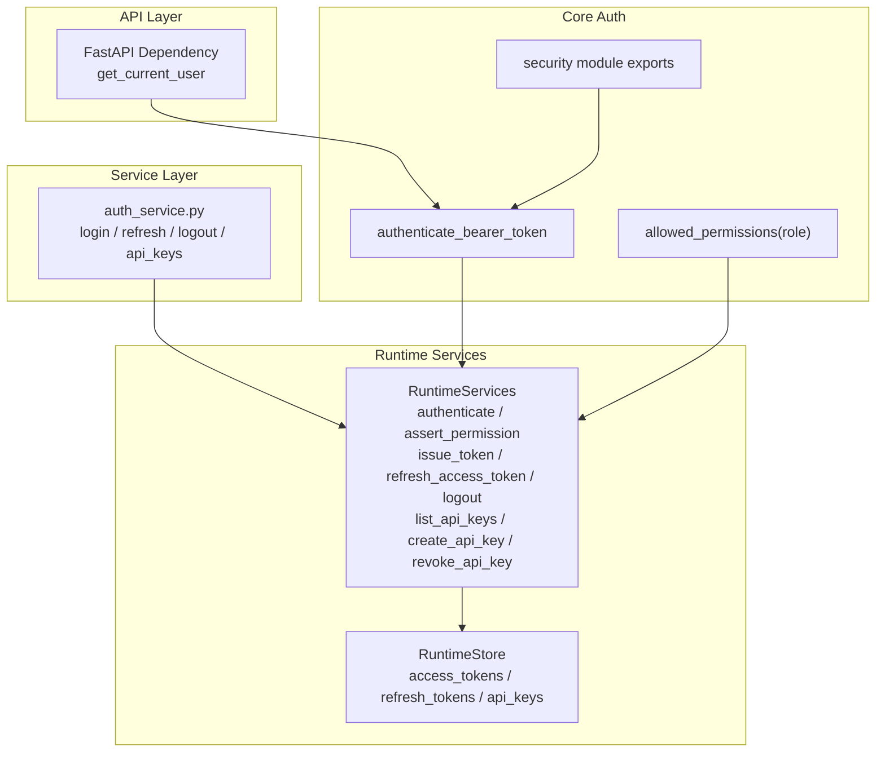
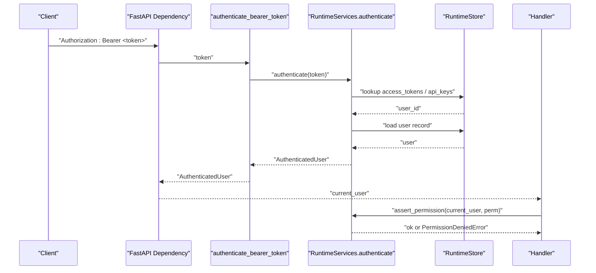
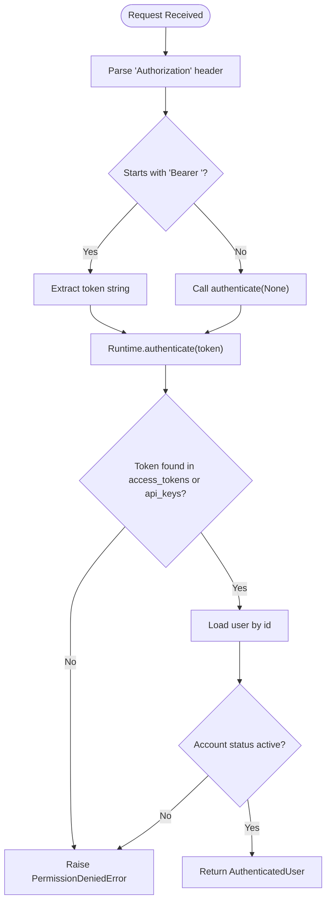
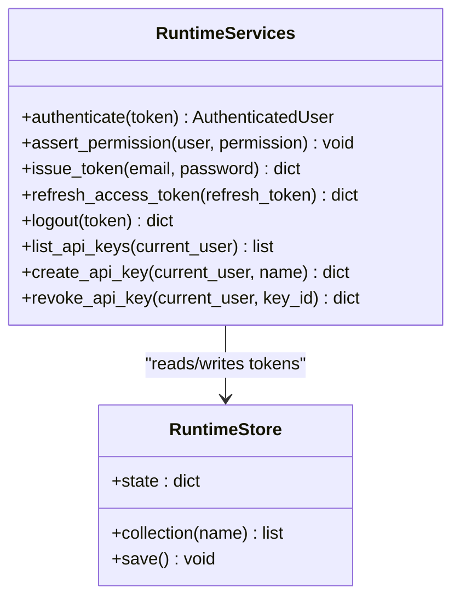
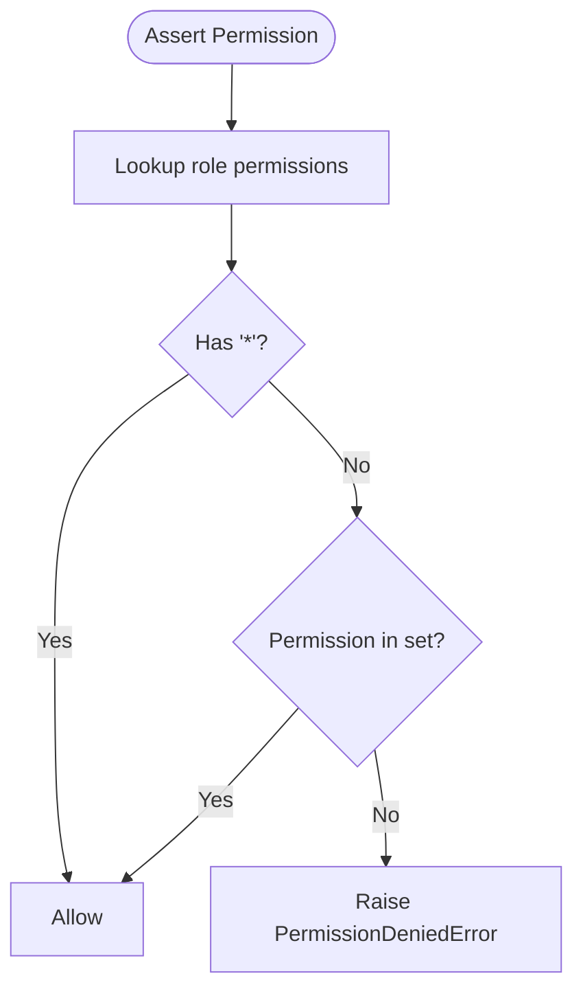
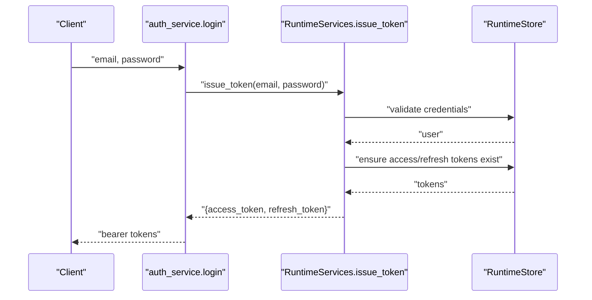
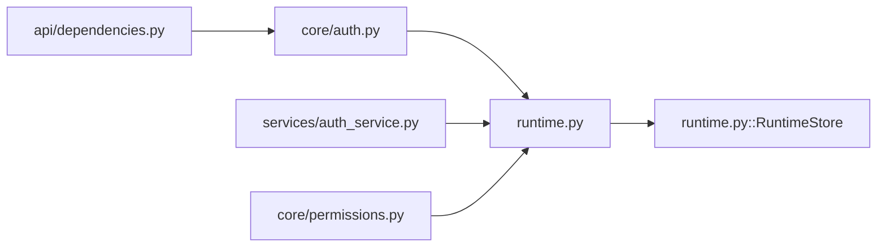

# Authentication & Authorization

<cite>
**Referenced Files in This Document**
- [auth.py](file://backend/app/core/auth.py)
- [security.py](file://backend/app/core/security.py)
- [dependencies.py](file://backend/app/api/dependencies.py)
- [permissions.py](file://backend/app/core/permissions.py)
- [runtime.py](file://backend/app/runtime.py)
- [auth_service.py](file://backend/app/services/auth_service.py)
</cite>

## Table of Contents
1. [Introduction](#introduction)
2. [Project Structure](#project-structure)
3. [Core Components](#core-components)
4. [Architecture Overview](#architecture-overview)
5. [Detailed Component Analysis](#detailed-component-analysis)
6. [Dependency Analysis](#dependency-analysis)
7. [Performance Considerations](#performance-considerations)
8. [Troubleshooting Guide](#troubleshooting-guide)
9. [Conclusion](#conclusion)
10. [Appendices](#appendices)

## Introduction
This document explains the authentication and authorization mechanisms implemented in the backend, focusing on:
- Bearer token authentication (access tokens and API keys)
- Token lifecycle (issue, refresh, logout)
- Role-based access control (RBAC) with a permission model
- Session management via in-memory token stores
- Security best practices and common patterns for securing endpoints

The system uses bearer tokens to identify users or service accounts and enforces permissions based on roles. Tokens are stored in runtime state and validated per request.

## Project Structure
Authentication and authorization span several modules:
- Core auth helpers and FastAPI dependency injection
- RBAC definitions and permission checks
- Runtime services that implement token issuance, validation, and role-based enforcement
- Service layer exposing login, refresh, logout, and API key operations

**Diagram sources**
- [dependencies.py:13-17](file://backend/app/api/dependencies.py#L13-L17)
- [auth.py:6-7](file://backend/app/core/auth.py#L6-L7)
- [security.py:1-3](file://backend/app/core/security.py#L1-L3)
- [permissions.py:4-5](file://backend/app/core/permissions.py#L4-L5)
- [runtime.py:848-866](file://backend/app/runtime.py#L848-L866)
- [auth_service.py:4-29](file://backend/app/services/auth_service.py#L4-L29)

**Section sources**
- [dependencies.py:13-17](file://backend/app/api/dependencies.py#L13-L17)
- [auth.py:6-7](file://backend/app/core/auth.py#L6-L7)
- [security.py:1-3](file://backend/app/core/security.py#L1-L3)
- [permissions.py:4-5](file://backend/app/core/permissions.py#L4-L5)
- [runtime.py:848-866](file://backend/app/runtime.py#L848-L866)
- [auth_service.py:4-29](file://backend/app/services/auth_service.py#L4-L29)

## Core Components
- Bearer token authentication: Validates access tokens or API keys and returns an authenticated user context.
- RBAC: Roles map to sets of permissions; authorization checks enforce these permissions.
- Token lifecycle: Login issues access and refresh tokens; refresh reuses existing access token; logout revokes access token.
- API key management: List, create, and revoke API keys scoped to organization.
- Session management: In-process token stores (access_tokens, refresh_tokens, api_keys) backed by JSON file or Postgres.

Key responsibilities:
- FastAPI dependency extracts bearer token from Authorization header and delegates to core auth.
- Core auth calls runtime authenticate to resolve user and validate token.
- Runtime asserts permissions using ROLE_PERMISSIONS mapping.
- Service layer exposes login, refresh, logout, and API key operations.

**Section sources**
- [dependencies.py:13-17](file://backend/app/api/dependencies.py#L13-L17)
- [auth.py:6-7](file://backend/app/core/auth.py#L6-L7)
- [runtime.py:848-866](file://backend/app/runtime.py#L848-L866)
- [runtime.py:937-975](file://backend/app/runtime.py#L937-L975)
- [runtime.py:977-1009](file://backend/app/runtime.py#L977-L1009)
- [auth_service.py:4-29](file://backend/app/services/auth_service.py#L4-L29)

## Architecture Overview
End-to-end flow for protected API requests:
- Client sends Authorization: Bearer <token>.
- FastAPI dependency parses header and calls authenticate_bearer_token.
- Runtime.authenticate validates token against access_tokens or api_keys and loads user.
- Endpoint handlers call runtime.assert_permission to enforce RBAC.

**Diagram sources**
- [dependencies.py:13-17](file://backend/app/api/dependencies.py#L13-L17)
- [auth.py:6-7](file://backend/app/core/auth.py#L6-L7)
- [runtime.py:848-866](file://backend/app/runtime.py#L848-L866)

## Detailed Component Analysis

### Bearer Token Authentication
- Header parsing: The FastAPI dependency reads the Authorization header, expects "Bearer " prefix, and passes the token to core auth.
- Token resolution: Runtime.authenticate accepts either an access token or an API key, maps it to a user, and ensures the account is active.
- Error handling: Missing or invalid tokens raise a permission error.

**Diagram sources**
- [dependencies.py:13-17](file://backend/app/api/dependencies.py#L13-L17)
- [auth.py:6-7](file://backend/app/core/auth.py#L6-L7)
- [runtime.py:848-866](file://backend/app/runtime.py#L848-L866)

**Section sources**
- [dependencies.py:13-17](file://backend/app/api/dependencies.py#L13-L17)
- [auth.py:6-7](file://backend/app/core/auth.py#L6-L7)
- [runtime.py:848-866](file://backend/app/runtime.py#L848-L866)

### JWT Token Handling
- Implementation note: The current implementation does not use cryptographic JWTs. Tokens are opaque identifiers stored in runtime state.
- Implications: No server-side signature verification; trust is based on token presence in store. Refresh returns the same access token if already issued.

Recommendations for production:
- Replace opaque tokens with signed JWTs to enable stateless verification and short-lived access tokens.
- Implement token rotation and blacklist for logout.

**Section sources**
- [runtime.py:937-975](file://backend/app/runtime.py#L937-L975)

### Session Management
- Access tokens: Map token -> user_id; used for authentication.
- Refresh tokens: Map token -> user_id; used to obtain a new access token without re-authentication.
- Logout: Removes the access token from the store.
- Persistence: Stored in RuntimeStore, which persists to JSON file or Postgres depending on configuration.

**Diagram sources**
- [runtime.py:848-866](file://backend/app/runtime.py#L848-L866)
- [runtime.py:937-975](file://backend/app/runtime.py#L937-L975)
- [runtime.py:977-1009](file://backend/app/runtime.py#L977-L1009)

**Section sources**
- [runtime.py:937-975](file://backend/app/runtime.py#L937-L975)
- [runtime.py:977-1009](file://backend/app/runtime.py#L977-L1009)

### Role-Based Access Control (RBAC)
- Roles and permissions: A central mapping defines allowed permissions per role. Special wildcard "*" grants all permissions.
- Evaluation: Runtime.assert_permission checks if the user’s role includes the required permission or "*".
- Helper: allowed_permissions(role) returns the set of permissions for a given role.

Roles include owner, admin, manager, operator, reviewer, viewer, and service_account. Each role has a defined set of resource-scoped permissions such as users:read, workflows:execute, approvals:approve, etc.

**Diagram sources**
- [runtime.py:862-866](file://backend/app/runtime.py#L862-L866)
- [permissions.py:4-5](file://backend/app/core/permissions.py#L4-L5)

**Section sources**
- [runtime.py:862-866](file://backend/app/runtime.py#L862-L866)
- [permissions.py:4-5](file://backend/app/core/permissions.py#L4-L5)

### API Key Management for Service Accounts
- Listing keys: Requires settings:read; filters keys by organization.
- Creating keys: Requires settings:update; generates a unique token and associates it with the caller’s organization and user.
- Revoking keys: Requires settings:update; marks key revoked and removes from store.

Use cases:
- Automations and CI/CD pipelines authenticate using API keys instead of user credentials.
- Keys are scoped to the organization of the creator.

**Section sources**
- [runtime.py:977-1009](file://backend/app/runtime.py#L977-L1009)
- [auth_service.py:16-25](file://backend/app/services/auth_service.py#L16-L25)

### Token Refresh Mechanism
- Login returns both access and refresh tokens.
- Refresh endpoint validates refresh token and returns the existing access token along with the refresh token.
- Logout removes the access token, effectively ending the session.

**Diagram sources**
- [auth_service.py:4-5](file://backend/app/services/auth_service.py#L4-L5)
- [runtime.py:937-960](file://backend/app/runtime.py#L937-L960)

**Section sources**
- [auth_service.py:4-9](file://backend/app/services/auth_service.py#L4-L9)
- [runtime.py:937-975](file://backend/app/runtime.py#L937-L975)

### Practical Examples

#### Implementing Custom Authentication Middleware
- Use the provided FastAPI dependency to extract and validate bearer tokens.
- For custom flows (e.g., multi-tenant headers), wrap get_current_user and inject additional context before calling authenticate_bearer_token.

Reference paths:
- [FastAPI dependency:13-17](file://backend/app/api/dependencies.py#L13-L17)
- [Core auth function:6-7](file://backend/app/core/auth.py#L6-L7)

**Section sources**
- [dependencies.py:13-17](file://backend/app/api/dependencies.py#L13-L17)
- [auth.py:6-7](file://backend/app/core/auth.py#L6-L7)

#### Defining New Roles and Permissions
- Add a new role entry to the role-permission mapping.
- Ensure any privileged actions check the appropriate permission via assert_permission.

Reference paths:
- [Role permissions mapping:140-222](file://backend/app/runtime.py#L140-L222)
- [Permission assertion:862-866](file://backend/app/runtime.py#L862-L866)

**Section sources**
- [runtime.py:140-222](file://backend/app/runtime.py#L140-L222)
- [runtime.py:862-866](file://backend/app/runtime.py#L862-L866)

#### Securing API Endpoints
- Require authentication by injecting the current user via the FastAPI dependency.
- Enforce specific permissions at the handler level using runtime.assert_permission.

Reference paths:
- [Current user dependency:13-17](file://backend/app/api/dependencies.py#L13-L17)
- [Permission assertion:862-866](file://backend/app/runtime.py#L862-L866)

**Section sources**
- [dependencies.py:13-17](file://backend/app/api/dependencies.py#L13-L17)
- [runtime.py:862-866](file://backend/app/runtime.py#L862-L866)

## Dependency Analysis
High-level dependencies among components:
- API layer depends on core auth and runtime services.
- Core auth delegates to runtime for token validation and permission checks.
- Runtime services depend on runtime store for persistence.

**Diagram sources**
- [dependencies.py:13-17](file://backend/app/api/dependencies.py#L13-L17)
- [auth.py:6-7](file://backend/app/core/auth.py#L6-L7)
- [runtime.py:848-866](file://backend/app/runtime.py#L848-L866)
- [auth_service.py:4-29](file://backend/app/services/auth_service.py#L4-L29)
- [permissions.py:4-5](file://backend/app/core/permissions.py#L4-L5)

**Section sources**
- [dependencies.py:13-17](file://backend/app/api/dependencies.py#L13-L17)
- [auth.py:6-7](file://backend/app/core/auth.py#L6-L7)
- [runtime.py:848-866](file://backend/app/runtime.py#L848-L866)
- [auth_service.py:4-29](file://backend/app/services/auth_service.py#L4-L29)
- [permissions.py:4-5](file://backend/app/core/permissions.py#L4-L5)

## Performance Considerations
- Token lookup is O(1) dictionary lookups in memory, but persistence writes occur on mutations (login, logout, key changes).
- Avoid frequent token churn; reuse access tokens and refresh only when necessary.
- Prefer Postgres-backed storage for concurrent environments to avoid contention on JSON file locks.

[No sources needed since this section provides general guidance]

## Troubleshooting Guide
Common errors and resolutions:
- Invalid or missing bearer token: Ensure Authorization header is present and formatted correctly ("Bearer <token>").
- Account disabled or invited: Verify user status; invitations must be accepted before login.
- Permission denied: Confirm the user’s role includes the required permission or wildcard.
- API key not found: Ensure the key exists and belongs to the same organization as the caller.

Operational tips:
- Use logout to invalidate access tokens immediately.
- Revoke API keys promptly when compromised.
- Audit logs capture authentication events and permission decisions for investigation.

**Section sources**
- [runtime.py:848-866](file://backend/app/runtime.py#L848-L866)
- [runtime.py:937-975](file://backend/app/runtime.py#L937-L975)
- [runtime.py:977-1009](file://backend/app/runtime.py#L977-L1009)

## Conclusion
The system implements bearer token authentication with role-based access control and in-process session management. While suitable for development and controlled environments, production deployments should adopt signed JWTs, short-lived tokens, and robust token revocation strategies. RBAC is centralized and extensible, enabling clear separation of concerns between identity and authorization.

[No sources needed since this section summarizes without analyzing specific files]

## Appendices

### Security Best Practices
- Enforce HTTPS for all endpoints.
- Rotate tokens regularly and limit access token lifetimes.
- Scope API keys to minimal permissions and organizations.
- Monitor audit logs for suspicious activity.
- Validate inputs and reject unknown roles or malformed tokens early.

[No sources needed since this section provides general guidance]