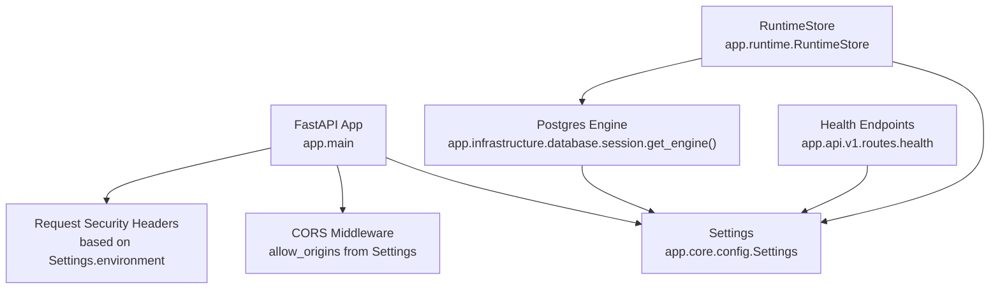
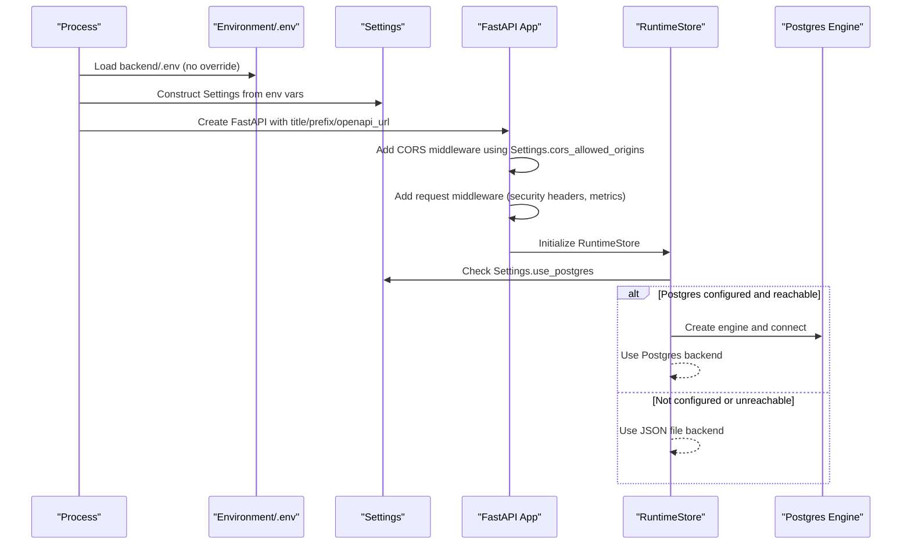
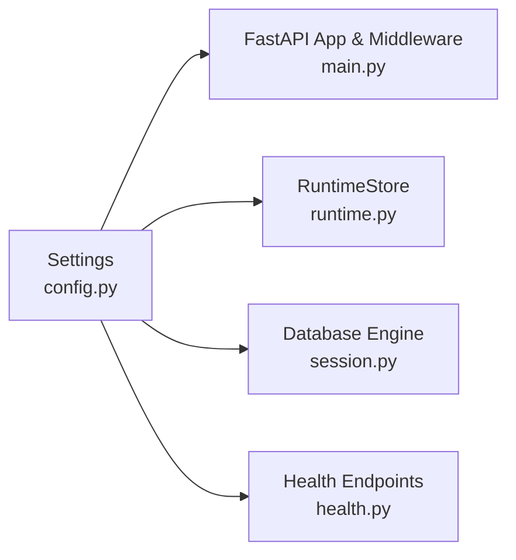

# Configuration Management

<cite>
**Referenced Files in This Document**
- [config.py](file://backend/app/core/config.py)
- [main.py](file://backend/app/main.py)
- [session.py](file://backend/app/infrastructure/database/session.py)
- [runtime.py](file://backend/app/runtime.py)
- [health.py](file://backend/app/api/v1/routes/health.py)
- [README.md](file://backend/README.md)
- [postgres-runbook.md](file://backend/docs/postgres-runbook.md)
- [pyproject.toml](file://backend/pyproject.toml)
</cite>

## Table of Contents
1. Introduction
2. Project Structure
3. Core Components
4. Architecture Overview
5. Detailed Component Analysis
6. Dependency Analysis
7. Performance Considerations
8. Troubleshooting Guide
9. Conclusion

## Introduction
This document explains how the system manages configuration and runtime settings, including environment-based configuration, feature flags, dynamic behavior at startup, configuration hierarchy and precedence, validation mechanisms, and operational guidance for development and production deployments. It covers application settings, database connections, external service integrations, security parameters, and practical examples to help operators configure and troubleshoot reliably.

## Project Structure
Configuration is centralized in a single dataclass that reads from environment variables and provides derived properties used across the application. The FastAPI application wires these settings into middleware and routers. Database connectivity uses a lazy engine factory that respects configuration. Runtime persistence chooses between Postgres and a JSON file based on configuration. Health endpoints expose readiness/liveness with respect to configured dependencies.

**Diagram sources**
- [main.py:16-52](file://backend/app/main.py#L16-L52)
- [config.py:37-84](file://backend/app/core/config.py#L37-L84)
- [session.py:10-22](file://backend/app/infrastructure/database/session.py#L10-L22)
- [runtime.py:258-384](file://backend/app/runtime.py#L258-L384)
- [health.py:29-29](file://backend/app/api/v1/routes/health.py#L29-L29)

**Section sources**
- [config.py:1-84](file://backend/app/core/config.py#L1-L84)
- [main.py:1-52](file://backend/app/main.py#L1-L52)
- [session.py:1-63](file://backend/app/infrastructure/database/session.py#L1-L63)
- [runtime.py:258-384](file://backend/app/runtime.py#L258-L384)
- [health.py:29-29](file://backend/app/api/v1/routes/health.py#L29-L29)

## Core Components
- Environment loading: A helper loads a local .env file without overriding process environment variables.
- Settings dataclass: All configuration values are defined as typed fields with defaults sourced from environment variables. Boolean and list fields parse strings safely.
- Derived properties: Computed values such as sync database URL and whether to use Postgres are provided via properties.
- Database engine factory: Lazily creates a SQLAlchemy engine only when Postgres is enabled and configured.
- Runtime persistence selection: Chooses Postgres or JSON file backend based on configuration and availability.
- Health checks: Readiness depends on configured requirements and database reachability.

Key responsibilities and behaviors:
- Centralized configuration via a single source of truth (Settings).
- Graceful fallbacks (e.g., JSON file when Postgres is unavailable).
- Feature toggles for LLM critic, embeddings, pgvector, Neo4j federation, auto-reflect, and rate limiting.
- Security headers applied conditionally based on environment.

**Section sources**
- [config.py:8-20](file://backend/app/core/config.py#L8-L20)
- [config.py:37-84](file://backend/app/core/config.py#L37-L84)
- [session.py:10-22](file://backend/app/infrastructure/database/session.py#L10-L22)
- [runtime.py:258-384](file://backend/app/runtime.py#L258-L384)
- [main.py:27-48](file://backend/app/main.py#L27-L48)

## Architecture Overview
The configuration architecture follows a simple, robust pattern:
- Startup phase: Load .env if present, then construct Settings from environment variables.
- Application bootstrap: Create FastAPI app using Settings; attach CORS and request middleware.
- Persistence layer: RuntimeStore selects Postgres or JSON based on Settings.
- Health endpoints: Report readiness depending on configuration and dependency status.

**Diagram sources**
- [config.py:8-20](file://backend/app/core/config.py#L8-L20)
- [config.py:37-84](file://backend/app/core/config.py#L37-L84)
- [main.py:16-48](file://backend/app/main.py#L16-L48)
- [runtime.py:258-384](file://backend/app/runtime.py#L258-L384)
- [session.py:10-22](file://backend/app/infrastructure/database/session.py#L10-L22)

## Detailed Component Analysis

### Settings and Environment Variables
- Loading strategy:
  - Loads backend/.env if present, without overriding existing process environment variables.
- Configuration categories:
  - Application: name, API prefix, environment.
  - CORS: allowed origins parsed from comma-separated string.
  - Rate limiting: enable flag and per-minute limits for auth and workflow writes.
  - Persistence: DATABASE_URL, pool size, max overflow, pre-ping, force JSON store.
  - Self-improvement: auto-reflect toggle.
  - LLM critic: enable flag, base URL, API key, model.
  - Embeddings/pgvector: enable flags.
  - Neo4j federation: URI, user, password.
- Derived properties:
  - Sync database URL conversion for synchronous access.
  - use_postgres computed from sync_database_url and force_json_store.

Operational notes:
- Boolean flags are parsed case-insensitively from strings.
- List parsing filters empty entries after splitting by commas.
- Optional external services default to disabled unless explicitly enabled.

**Section sources**
- [config.py:8-20](file://backend/app/core/config.py#L8-L20)
- [config.py:37-84](file://backend/app/core/config.py#L37-L84)

### FastAPI Application Wiring
- App initialization uses Settings for title, API prefix, and OpenAPI URL.
- CORS middleware uses Settings.cors_allowed_origins.
- Request middleware:
  - Adds request ID propagation and metrics recording.
  - Applies security headers; Strict-Transport-Security is added only when environment equals production.
- Router inclusion uses Settings.api_prefix.

Security posture:
- Default CSP and Permissions-Policy headers are set to restrictive values.
- HSTS is enabled in production environments.

**Section sources**
- [main.py:16-52](file://backend/app/main.py#L16-L52)

### Database Connectivity and Session Factory
- Engine creation is cached and lazy:
  - Returns None if Postgres is not configured or forced off.
  - Uses Settings.sync_database_url and pool settings.
- Session factory returns a session bound to the engine or None when disabled.
- database_status reports backend type, configuration, reachability, and error details.

Implications:
- When DATABASE_URL is absent or force_json_store is true, the engine is not created.
- Health checks can rely on this function to determine database reachability.

**Section sources**
- [session.py:10-22](file://backend/app/infrastructure/database/session.py#L10-L22)
- [session.py:36-63](file://backend/app/infrastructure/database/session.py#L36-L63)

### Runtime Persistence Selection
- RuntimeStore chooses backend:
  - If Settings.use_postgres is true, attempts to load/save via Postgres.
  - Falls back to JSON file snapshot if Postgres is unavailable or disabled.
- On save, always writes a JSON snapshot for backup/migration purposes.
- Legacy product name sanitization ensures consistent identifiers across storage backends.

Operational behavior:
- First run seeds default collections and users if none exist.
- Migration path supports seeding from JSON into Postgres when empty.

**Section sources**
- [runtime.py:258-384](file://backend/app/runtime.py#L258-L384)

### Health and Readiness
- Readiness endpoint considers a flag to require Postgres.
- When required, health/ready will fail if Postgres is not reachable.
- Otherwise, it may report success even if Postgres is down, relying on JSON fallback.

**Section sources**
- [health.py:29-29](file://backend/app/api/v1/routes/health.py#L29-L29)

## Dependency Analysis
Configuration flows through the application as follows:
- Settings is consumed by:
  - FastAPI app initialization and middleware.
  - RuntimeStore backend selection.
  - Database engine factory.
  - Health endpoints.

**Diagram sources**
- [config.py:37-84](file://backend/app/core/config.py#L37-L84)
- [main.py:16-52](file://backend/app/main.py#L16-L52)
- [runtime.py:258-384](file://backend/app/runtime.py#L258-L384)
- [session.py:10-22](file://backend/app/infrastructure/database/session.py#L10-L22)
- [health.py:29-29](file://backend/app/api/v1/routes/health.py#L29-L29)

**Section sources**
- [config.py:37-84](file://backend/app/core/config.py#L37-L84)
- [main.py:16-52](file://backend/app/main.py#L16-L52)
- [runtime.py:258-384](file://backend/app/runtime.py#L258-L384)
- [session.py:10-22](file://backend/app/infrastructure/database/session.py#L10-L22)
- [health.py:29-29](file://backend/app/api/v1/routes/health.py#L29-L29)

## Performance Considerations
- Database pooling:
  - Pool size and max overflow are configurable; tune according to workload and connection limits.
  - Pre-ping helps detect stale connections.
- Lazy engine creation avoids unnecessary overhead when Postgres is disabled.
- JSON fallback ensures resilience but may reduce performance under high concurrency compared to Postgres.
- Rate limiting:
  - Auth and workflow write rate limits are configurable; adjust based on expected traffic patterns.

[No sources needed since this section provides general guidance]

## Troubleshooting Guide
Common issues and resolutions:
- Postgres not configured:
  - Ensure DATABASE_URL is set in backend/.env.
  - Verify network reachability and credentials.
- Force JSON store:
  - If GENERIC_SWARM_FORCE_JSON_STORE is true, Postgres will be ignored; unset to use Postgres.
- Readiness failures:
  - Set GENERIC_SWARM_REQUIRE_POSTGRES=true to enforce Postgres availability during readiness checks.
- Missing psycopg driver:
  - Install psycopg binary package as required by dependencies.
- CORS errors:
  - Configure GENERIC_SWARM_CORS_ALLOWED_ORIGINS appropriately for your frontend origin(s).
- LLM critic not working:
  - Enable GENERIC_SWARM_LLM_CRITIC_ENABLED and provide OPENAI_API_BASE/OPENAI_API_KEY or GENERIC_SWARM_LLM_API_BASE/GENERIC_SWARM_LLM_API_KEY.
- Embeddings/pgvector disabled:
  - Enable GENERIC_SWARM_EMBEDDINGS_ENABLED and/or GENERIC_SWARM_PGVECTOR_ENABLED as needed.

Operational references:
- Backend README lists key environment flags and quick start steps.
- Postgres runbook provides detailed setup and troubleshooting guidance.

**Section sources**
- [README.md:67-74](file://backend/README.md#L67-L74)
- [postgres-runbook.md:15-15](file://backend/docs/postgres-runbook.md#L15-L15)
- [postgres-runbook.md:47-47](file://backend/docs/postgres-runbook.md#L47-L47)
- [postgres-runbook.md:71-71](file://backend/docs/postgres-runbook.md#L71-L71)
- [postgres-runbook.md:91-93](file://backend/docs/postgres-runbook.md#L91-L93)

## Conclusion
The configuration system is intentionally simple and resilient:
- Single source of truth via Settings, loaded from environment variables and an optional .env file.
- Clear precedence rules: process environment overrides .env; derived properties compute final behavior.
- Graceful fallbacks ensure operation in both Postgres and JSON modes.
- Feature flags allow fine-grained control over capabilities like LLM critic, embeddings, and federation.
- Security headers and HSTS are applied based on environment, supporting secure production deployments.

For deployment:
- Development: Use JSON fallback or local Postgres with DATABASE_URL; keep SECURITY headers minimal as needed.
- Production: Configure DATABASE_URL, enable HSTS, tune rate limits and database pools, and enforce readiness checks with Postgres requirement.

[No sources needed since this section summarizes without analyzing specific files]