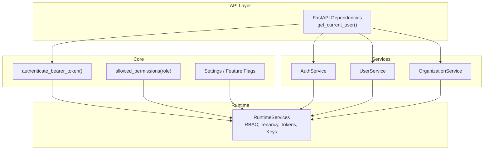
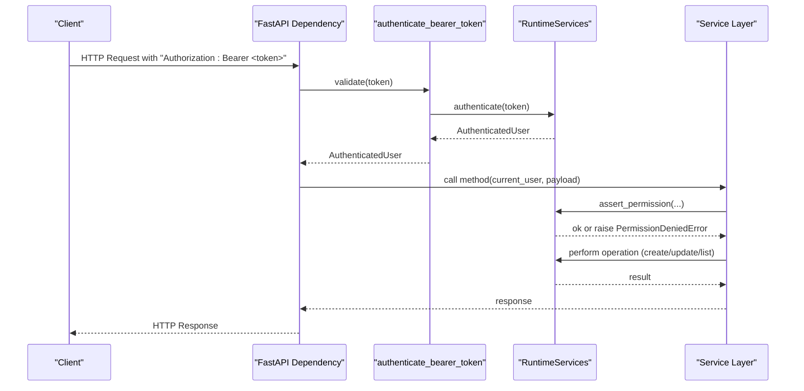
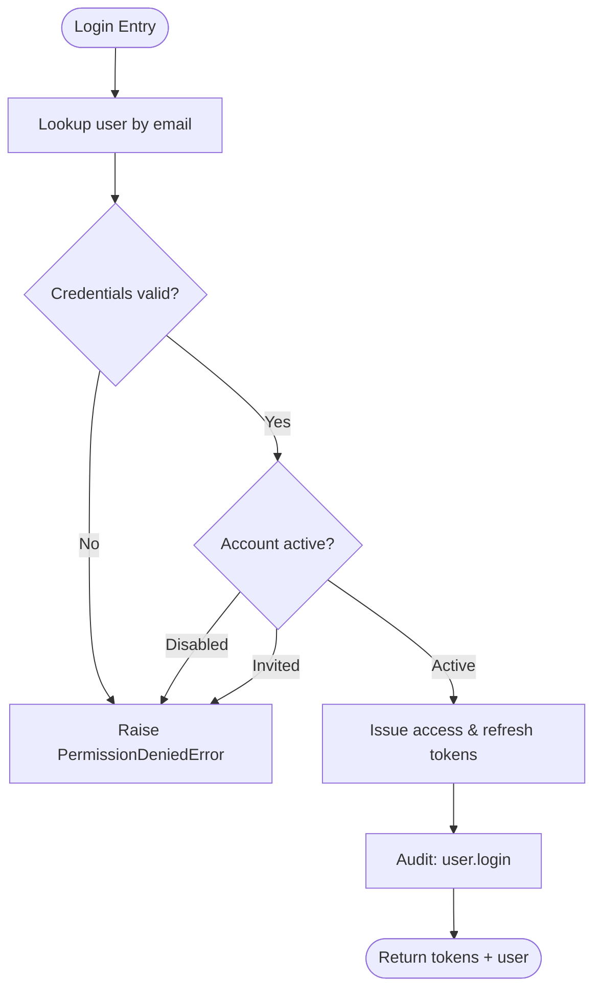
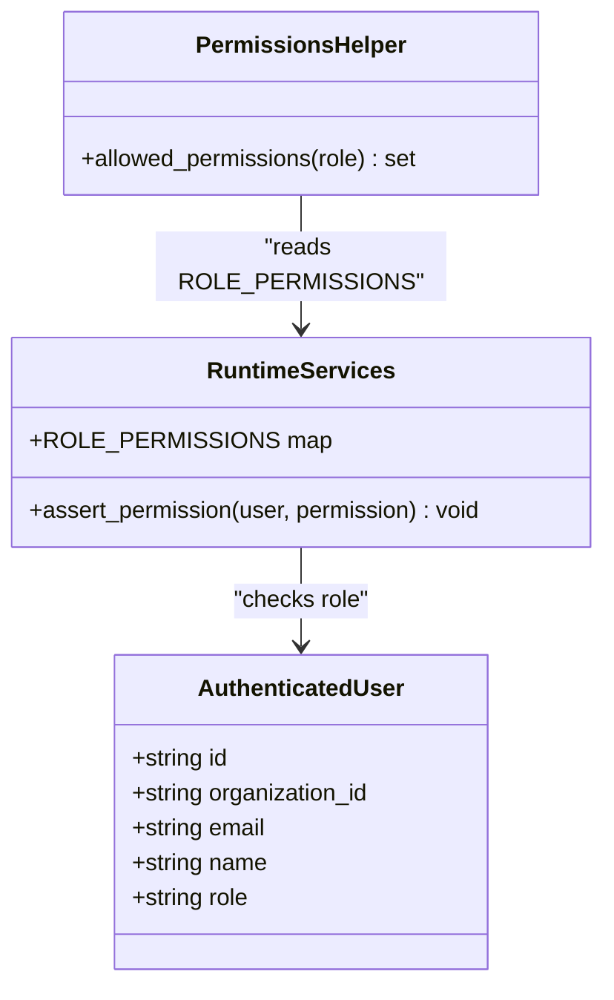
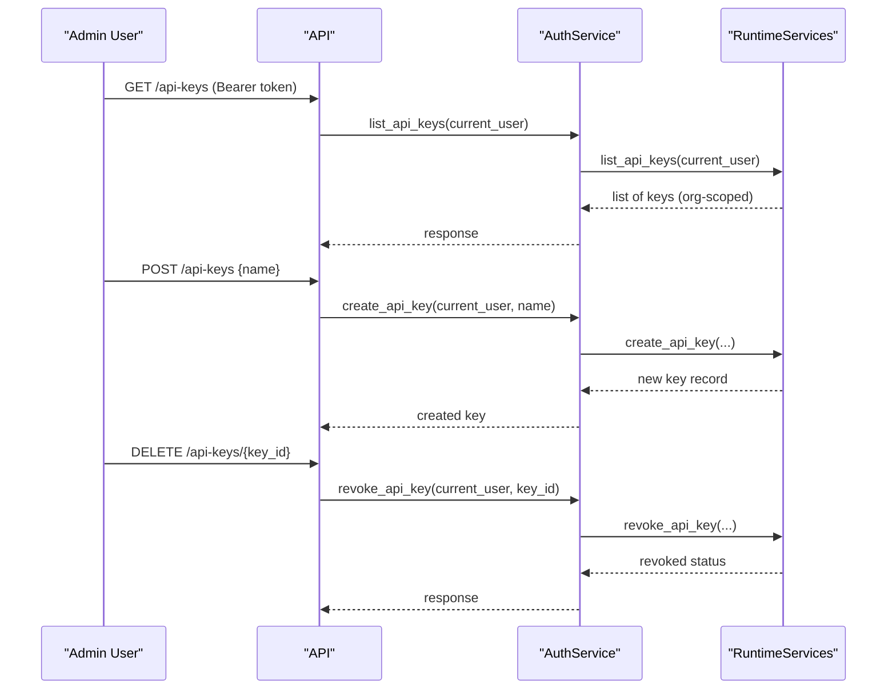
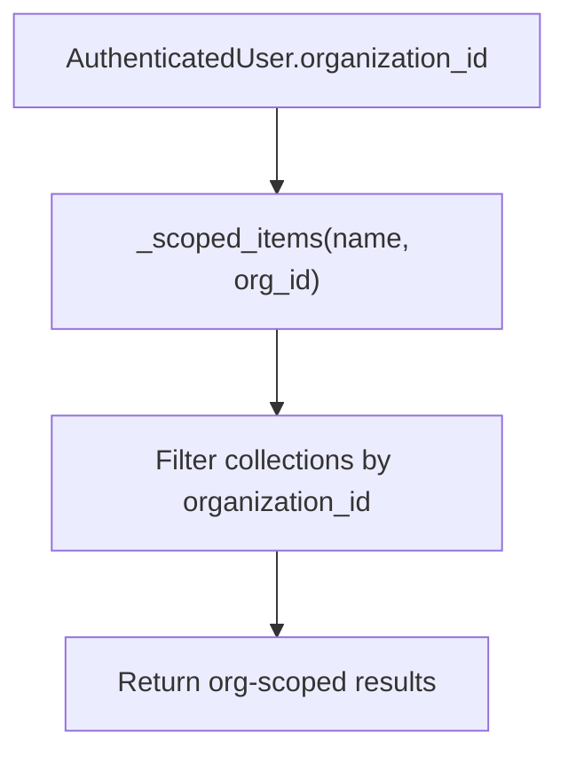
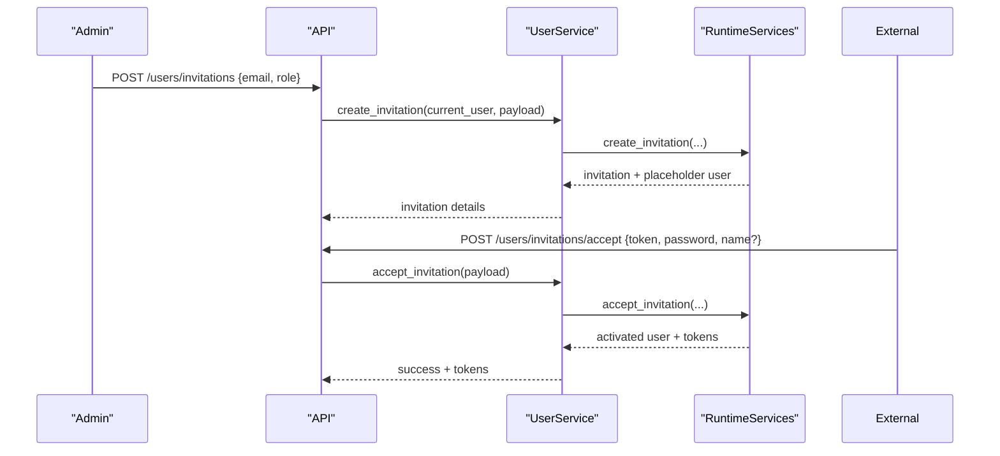
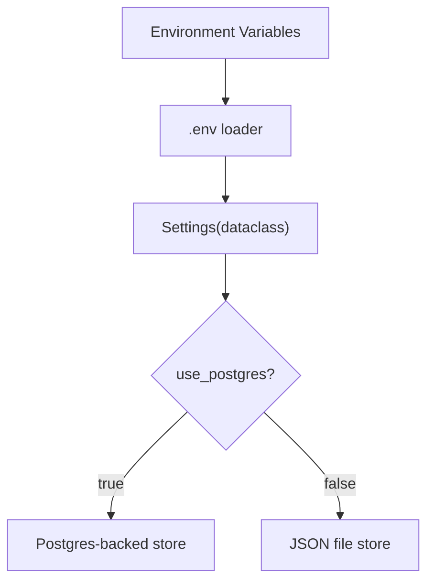
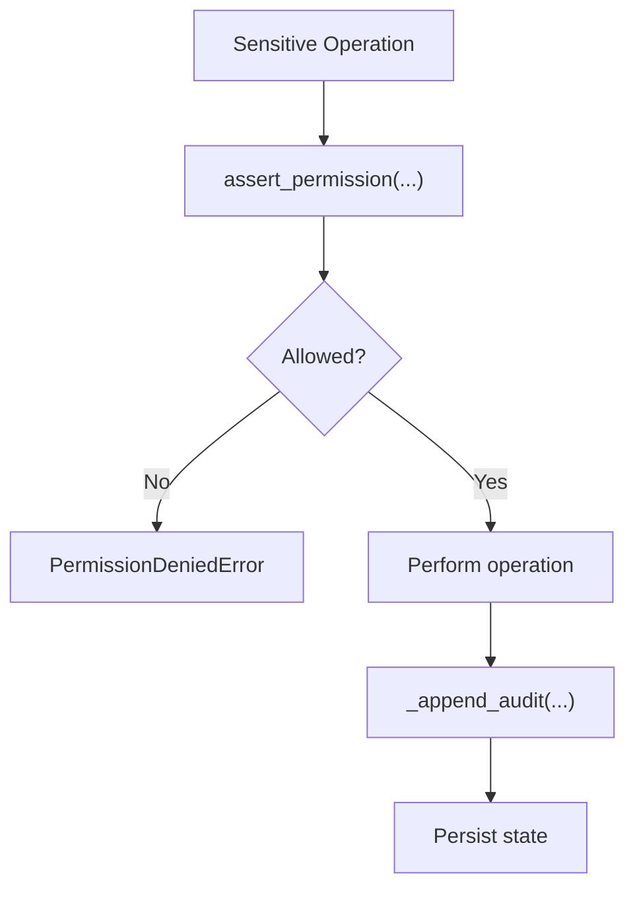
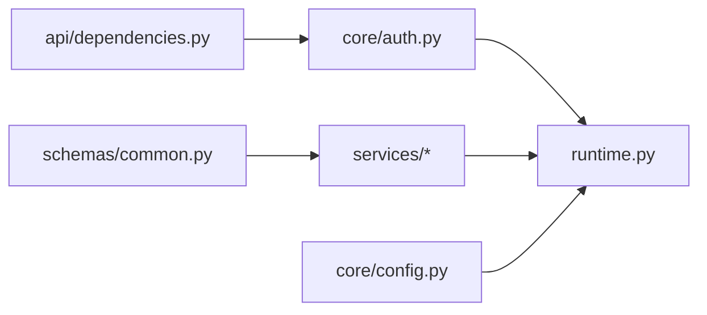

# Core Platform

<cite>
**Referenced Files in This Document**
- [runtime.py](file://backend/app/runtime.py)
- [auth.py](file://backend/app/core/auth.py)
- [security.py](file://backend/app/core/security.py)
- [permissions.py](file://backend/app/core/permissions.py)
- [config.py](file://backend/app/core/config.py)
- [dependencies.py](file://backend/app/api/dependencies.py)
- [auth_service.py](file://backend/app/services/auth_service.py)
- [user_service.py](file://backend/app/services/user_service.py)
- [organization_service.py](file://backend/app/services/organization_service.py)
- [common.py](file://backend/app/schemas/common.py)
</cite>

## Table of Contents
1. [Introduction](#introduction)
2. [Project Structure](#project-structure)
3. [Core Components](#core-components)
4. [Architecture Overview](#architecture-overview)
5. [Detailed Component Analysis](#detailed-component-analysis)
6. [Dependency Analysis](#dependency-analysis)
7. [Performance Considerations](#performance-considerations)
8. [Troubleshooting Guide](#troubleshooting-guide)
9. [Conclusion](#conclusion)
10. [Appendices](#appendices)

## Introduction
This document explains the core platform components that implement authentication, authorization (RBAC), API key management, session handling, multi-tenant organization model, configuration and feature flags, user lifecycle with invitations, security controls, audit logging foundations, and compliance-oriented features. It also provides practical examples for configuring authentication, setting up organizations, and managing user permissions.

## Project Structure
The core platform is implemented primarily in the backend application:
- Authentication and authorization are centralized in runtime services and exposed via thin service layers and FastAPI dependencies.
- Configuration and feature toggles are loaded from environment variables with sensible defaults.
- Multi-tenancy is enforced by scoping all resources to an organization_id.
- Audit logs are recorded for critical operations.

**Diagram sources**
- [dependencies.py:13-17](file://backend/app/api/dependencies.py#L13-L17)
- [auth.py:6-7](file://backend/app/core/auth.py#L6-L7)
- [permissions.py:4-5](file://backend/app/core/permissions.py#L4-L5)
- [config.py:37-83](file://backend/app/core/config.py#L37-L83)
- [auth_service.py:4-29](file://backend/app/services/auth_service.py#L4-L29)
- [user_service.py:4-33](file://backend/app/services/user_service.py#L4-L33)
- [organization_service.py:4-13](file://backend/app/services/organization_service.py#L4-L13)
- [runtime.py:848-866](file://backend/app/runtime.py#L848-L866)

**Section sources**
- [dependencies.py:13-17](file://backend/app/api/dependencies.py#L13-L17)
- [auth.py:6-7](file://backend/app/core/auth.py#L6-L7)
- [permissions.py:4-5](file://backend/app/core/permissions.py#L4-L5)
- [config.py:37-83](file://backend/app/core/config.py#L37-L83)
- [auth_service.py:4-29](file://backend/app/services/auth_service.py#L4-L29)
- [user_service.py:4-33](file://backend/app/services/user_service.py#L4-L33)
- [organization_service.py:4-13](file://backend/app/services/organization_service.py#L4-L13)
- [runtime.py:848-866](file://backend/app/runtime.py#L848-L866)

## Core Components
- RuntimeServices: Central authority for authentication, RBAC, tenancy scoping, token/API key management, user and invitation lifecycle, and audit logging.
- Settings: Environment-driven configuration and feature flags (e.g., rate limiting, LLM critic, embeddings, pgvector).
- Auth dependency: Extracts bearer tokens from Authorization headers and authenticates requests.
- Services: Thin wrappers over RuntimeServices for login, refresh, logout, API keys, users, and organizations.

Key responsibilities:
- Authentication: Bearer token validation against access_tokens or api_keys; password-based login issues tokens.
- Authorization: Role-based permission checks using ROLE_PERMISSIONS map.
- Tenancy: All resource queries filtered by organization_id.
- Session handling: In-memory token stores backed by Postgres or JSON file fallback.
- Audit logging: Critical actions recorded into audit_logs collection.

**Section sources**
- [runtime.py:131-222](file://backend/app/runtime.py#L131-L222)
- [runtime.py:848-866](file://backend/app/runtime.py#L848-L866)
- [runtime.py:937-975](file://backend/app/runtime.py#L937-L975)
- [runtime.py:977-1009](file://backend/app/runtime.py#L977-L1009)
- [runtime.py:1054-1098](file://backend/app/runtime.py#L1054-L1098)
- [runtime.py:1144-1259](file://backend/app/runtime.py#L1144-L1259)
- [runtime.py:1261-1306](file://backend/app/runtime.py#L1261-L1306)
- [config.py:37-83](file://backend/app/core/config.py#L37-L83)
- [auth_service.py:4-29](file://backend/app/services/auth_service.py#L4-L29)
- [user_service.py:4-33](file://backend/app/services/user_service.py#L4-L33)
- [organization_service.py:4-13](file://backend/app/services/organization_service.py#L4-L13)

## Architecture Overview
The request flow for protected endpoints:
- FastAPI dependency extracts the bearer token.
- authenticate_bearer_token validates it against access_tokens or api_keys.
- RuntimeServices returns an AuthenticatedUser with role and organization context.
- Service methods enforce RBAC before performing operations.
- Sensitive operations append audit log entries.

**Diagram sources**
- [dependencies.py:13-17](file://backend/app/api/dependencies.py#L13-L17)
- [auth.py:6-7](file://backend/app/core/auth.py#L6-L7)
- [runtime.py:848-866](file://backend/app/runtime.py#L848-L866)
- [auth_service.py:4-29](file://backend/app/services/auth_service.py#L4-L29)
- [user_service.py:4-33](file://backend/app/services/user_service.py#L4-L33)
- [organization_service.py:4-13](file://backend/app/services/organization_service.py#L4-L13)

## Detailed Component Analysis

### Authentication and Session Handling
- Login issues a pair of tokens (access and refresh) bound to a user.
- Refresh reuses existing access token if present.
- Logout revokes the access token used.
- Password reset requires either authenticated self-service or privileged admin within the same organization, or a valid reset token.

**Diagram sources**
- [runtime.py:937-959](file://backend/app/runtime.py#L937-L959)
- [runtime.py:961-967](file://backend/app/runtime.py#L961-L967)
- [runtime.py:969-975](file://backend/app/runtime.py#L969-L975)
- [runtime.py:1011-1049](file://backend/app/runtime.py#L1011-L1049)

**Section sources**
- [runtime.py:937-975](file://backend/app/runtime.py#L937-L975)
- [runtime.py:1011-1049](file://backend/app/runtime.py#L1011-L1049)
- [auth_service.py:4-13](file://backend/app/services/auth_service.py#L4-L13)

### Authorization and RBAC
- Roles define sets of permissions. The owner role has wildcard access.
- RuntimeServices.assert_permission enforces checks per operation.
- allowed_permissions helper exposes role-to-permission mapping.

**Diagram sources**
- [runtime.py:131-222](file://backend/app/runtime.py#L131-L222)
- [runtime.py:862-866](file://backend/app/runtime.py#L862-L866)
- [permissions.py:4-5](file://backend/app/core/permissions.py#L4-L5)

**Section sources**
- [runtime.py:131-222](file://backend/app/runtime.py#L131-L222)
- [runtime.py:862-866](file://backend/app/runtime.py#L862-L866)
- [permissions.py:4-5](file://backend/app/core/permissions.py#L4-L5)

### API Key Management
- List, create, and revoke API keys scoped to the current organization.
- API keys are validated during authentication alongside access tokens.

**Diagram sources**
- [runtime.py:977-1009](file://backend/app/runtime.py#L977-L1009)
- [auth_service.py:16-25](file://backend/app/services/auth_service.py#L16-L25)

**Section sources**
- [runtime.py:977-1009](file://backend/app/runtime.py#L977-L1009)
- [auth_service.py:16-25](file://backend/app/services/auth_service.py#L16-L25)

### Organization and Tenancy Model
- Default organization is seeded on first run.
- All resources are scoped by organization_id; queries filter by the caller’s organization.
- Organization updates are restricted to the caller’s own org unless privileged.

**Diagram sources**
- [runtime.py:827-829](file://backend/app/runtime.py#L827-L829)
- [runtime.py:1261-1306](file://backend/app/runtime.py#L1261-L1306)

**Section sources**
- [runtime.py:757-805](file://backend/app/runtime.py#L757-L805)
- [runtime.py:827-829](file://backend/app/runtime.py#L827-L829)
- [runtime.py:1261-1306](file://backend/app/runtime.py#L1261-L1306)
- [organization_service.py:4-13](file://backend/app/services/organization_service.py#L4-L13)

### User Lifecycle and Invitations
- Create users with roles and statuses; active users receive seed tokens.
- Update user attributes including role and status; disabling a user revokes live tokens.
- Invitation workflow creates pending invitations and placeholder invited users; acceptance activates accounts and issues tokens.

**Diagram sources**
- [runtime.py:1144-1259](file://backend/app/runtime.py#L1144-L1259)
- [user_service.py:20-33](file://backend/app/services/user_service.py#L20-L33)

**Section sources**
- [runtime.py:1054-1142](file://backend/app/runtime.py#L1054-L1142)
- [runtime.py:1144-1259](file://backend/app/runtime.py#L1144-L1259)
- [user_service.py:4-33](file://backend/app/services/user_service.py#L4-L33)

### Configuration, Feature Flags, and Runtime Settings
- Settings dataclass loads values from environment variables with defaults.
- Database URL normalization supports async drivers and sync fallback.
- Feature flags include rate limiting, LLM critic, embeddings, pgvector, Neo4j federation.

**Diagram sources**
- [config.py:8-20](file://backend/app/core/config.py#L8-L20)
- [config.py:23-34](file://backend/app/core/config.py#L23-L34)
- [config.py:37-83](file://backend/app/core/config.py#L37-L83)

**Section sources**
- [config.py:8-20](file://backend/app/core/config.py#L8-L20)
- [config.py:23-34](file://backend/app/core/config.py#L23-L34)
- [config.py:37-83](file://backend/app/core/config.py#L37-L83)

### Security Controls and Audit Logging Foundations
- Password hashing uses PBKDF2-HMAC-SHA256 with migration support for legacy hashes.
- PermissionDeniedError raised when RBAC fails.
- Audit events appended for auth flows, user changes, API key operations, and memory scope denials.

**Diagram sources**
- [runtime.py:70-90](file://backend/app/runtime.py#L70-L90)
- [runtime.py:107-129](file://backend/app/runtime.py#L107-L129)
- [runtime.py:862-866](file://backend/app/runtime.py#L862-L866)
- [runtime.py:957-959](file://backend/app/runtime.py#L957-L959)
- [runtime.py:996-998](file://backend/app/runtime.py#L996-L998)
- [runtime.py:1007-1008](file://backend/app/runtime.py#L1007-L1008)
- [runtime.py:1047-1048](file://backend/app/runtime.py#L1047-L1048)
- [runtime.py:1242-1251](file://backend/app/runtime.py#L1242-L1251)

**Section sources**
- [runtime.py:70-90](file://backend/app/runtime.py#L70-L90)
- [runtime.py:107-129](file://backend/app/runtime.py#L107-L129)
- [runtime.py:862-866](file://backend/app/runtime.py#L862-L866)
- [runtime.py:957-959](file://backend/app/runtime.py#L957-L959)
- [runtime.py:996-998](file://backend/app/runtime.py#L996-L998)
- [runtime.py:1007-1008](file://backend/app/runtime.py#L1007-L1008)
- [runtime.py:1047-1048](file://backend/app/runtime.py#L1047-L1048)
- [runtime.py:1242-1251](file://backend/app/runtime.py#L1242-L1251)

## Dependency Analysis
High-level dependencies among core modules:
- API layer depends on auth dependency to extract and validate bearer tokens.
- Services depend on RuntimeServices for business logic and persistence.
- Core config drives runtime behavior and storage selection.

**Diagram sources**
- [dependencies.py:13-17](file://backend/app/api/dependencies.py#L13-L17)
- [auth.py:6-7](file://backend/app/core/auth.py#L6-L7)
- [auth_service.py:4-29](file://backend/app/services/auth_service.py#L4-L29)
- [user_service.py:4-33](file://backend/app/services/user_service.py#L4-L33)
- [organization_service.py:4-13](file://backend/app/services/organization_service.py#L4-L13)
- [config.py:37-83](file://backend/app/core/config.py#L37-L83)
- [common.py:12-57](file://backend/app/schemas/common.py#L12-L57)

**Section sources**
- [dependencies.py:13-17](file://backend/app/api/dependencies.py#L13-L17)
- [auth.py:6-7](file://backend/app/core/auth.py#L6-L7)
- [auth_service.py:4-29](file://backend/app/services/auth_service.py#L4-L29)
- [user_service.py:4-33](file://backend/app/services/user_service.py#L4-L33)
- [organization_service.py:4-13](file://backend/app/services/organization_service.py#L4-L13)
- [config.py:37-83](file://backend/app/core/config.py#L37-L83)
- [common.py:12-57](file://backend/app/schemas/common.py#L12-L57)

## Performance Considerations
- Token lookups are dictionary-based for O(1) performance.
- State persistence uses a lock to ensure thread safety; consider scaling out with external token stores if needed.
- Rate limiting settings are configurable at startup; tune thresholds based on workload.

[No sources needed since this section provides general guidance]

## Troubleshooting Guide
Common errors and resolutions:
- Invalid or missing bearer token: Ensure Authorization header contains a valid Bearer token or API key.
- Permission denied: Verify the user’s role includes the required permission.
- Account disabled or invitation not accepted: Activate account or complete invitation acceptance.
- Password reset failures: Provide correct credentials or a valid reset token; ensure minimum password length.

Operational tips:
- Confirm database connectivity when use_postgres is enabled.
- Inspect audit_logs for failed operations and reasons.

**Section sources**
- [runtime.py:848-860](file://backend/app/runtime.py#L848-L860)
- [runtime.py:937-944](file://backend/app/runtime.py#L937-L944)
- [runtime.py:961-967](file://backend/app/runtime.py#L961-L967)
- [runtime.py:1011-1049](file://backend/app/runtime.py#L1011-L1049)
- [runtime.py:1218-1259](file://backend/app/runtime.py#L1218-L1259)

## Conclusion
The core platform implements a robust, multi-tenant identity and access control system with clear separation between API, services, and runtime logic. RBAC, API keys, and session tokens provide flexible authentication and authorization. Configuration and feature flags enable adaptable deployments. Audit logging and security controls form a foundation for compliance and operational visibility.

[No sources needed since this section summarizes without analyzing specific files]

## Appendices

### Practical Examples

- Configure authentication
  - Set environment variables for app name, API prefix, CORS, and rate limits.
  - Enable/disable LLM critic, embeddings, and pgvector via flags.
  - Provide DATABASE_URL to switch to Postgres-backed runtime store.

  **Section sources**
  - [config.py:37-83](file://backend/app/core/config.py#L37-L83)

- Set up organizations
  - On first run, a default organization is created.
  - Users and resources are automatically scoped to the organization.

  **Section sources**
  - [runtime.py:757-805](file://backend/app/runtime.py#L757-L805)
  - [runtime.py:827-829](file://backend/app/runtime.py#L827-L829)

- Manage user permissions
  - Assign roles such as viewer, operator, manager, admin, owner.
  - Use RBAC to restrict sensitive operations like creating workflows or updating tools.

  **Section sources**
  - [runtime.py:131-222](file://backend/app/runtime.py#L131-L222)
  - [runtime.py:862-866](file://backend/app/runtime.py#L862-L866)

- API key usage
  - Create API keys for service accounts.
  - Use API keys as bearer tokens for programmatic access.

  **Section sources**
  - [runtime.py:977-1009](file://backend/app/runtime.py#L977-L1009)
  - [auth_service.py:16-25](file://backend/app/services/auth_service.py#L16-L25)

- Invitation workflow
  - Invite users with a role; they accept via token and set a password.

  **Section sources**
  - [runtime.py:1144-1259](file://backend/app/runtime.py#L1144-L1259)
  - [user_service.py:20-33](file://backend/app/services/user_service.py#L20-L33)