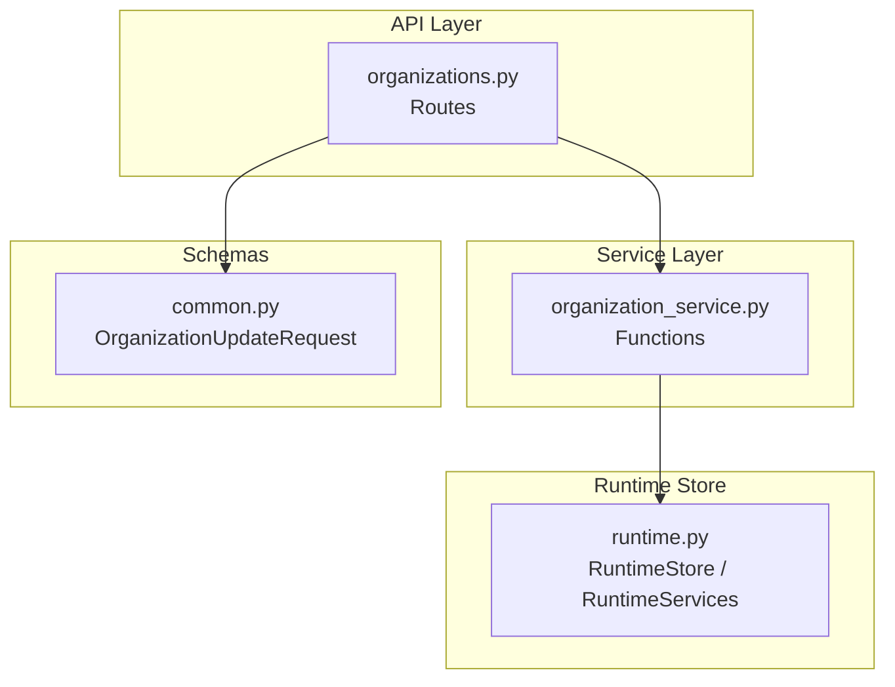
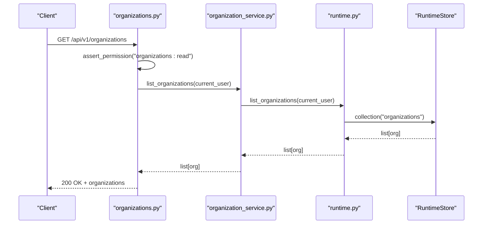
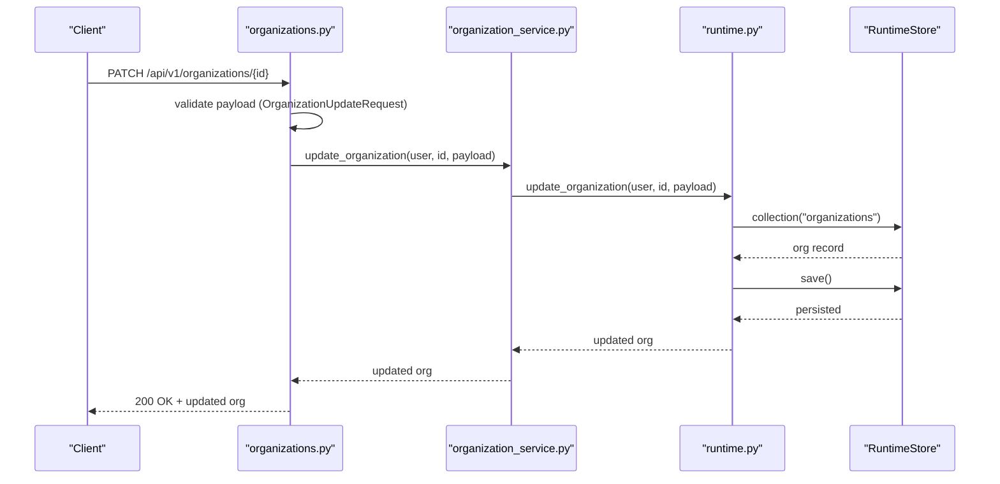
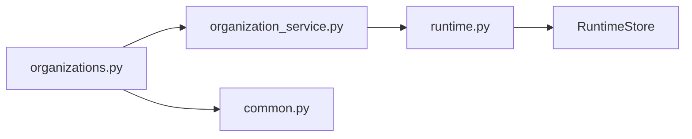

# Organization & Tenancy

<cite>
**Referenced Files in This Document**
- [runtime.py](file://backend/app/runtime.py)
- [organizations.py](file://backend/app/api/v1/routes/organizations.py)
- [organization_service.py](file://backend/app/services/organization_service.py)
- [common.py](file://backend/app/schemas/common.py)
</cite>

## Table of Contents
1. [Introduction](#introduction)
2. [Project Structure](#project-structure)
3. [Core Components](#core-components)
4. [Architecture Overview](#architecture-overview)
5. [Detailed Component Analysis](#detailed-component-analysis)
6. [Dependency Analysis](#dependency-analysis)
7. [Performance Considerations](#performance-considerations)
8. [Troubleshooting Guide](#troubleshooting-guide)
9. [Conclusion](#conclusion)

## Introduction
This document explains the organization and multi-tenant architecture as implemented in the backend. It covers:
- The organization model with hierarchical structure, department scoping, and resource isolation between tenants
- Organization lifecycle management (creation, configuration, deactivation)
- Cross-organization collaboration controls, shared resources, and data segregation strategies
- Practical examples for setting up organizations, managing departments, configuring tenant-specific settings, and implementing cross-tenant operations
- Performance considerations, scalability patterns, and security boundaries between organizations

The implementation centers on a runtime store that persists all domain collections (including organizations, users, agents, tools, workflows, memory items, etc.) and enforces per-organization scoping via an organization_id field present on most entities.

## Project Structure
Organization-related functionality is exposed through API routes, delegated to services, and backed by the runtime store. Key files:
- API route definitions for organizations
- Service layer functions delegating to runtime
- Runtime store and bootstrap logic that initializes default organization and seeds related resources
- Schemas defining request/response shapes used across endpoints

**Diagram sources**
- [organizations.py:1-30](file://backend/app/api/v1/routes/organizations.py#L1-L30)
- [organization_service.py:1-14](file://backend/app/services/organization_service.py#L1-L14)
- [runtime.py:258-384](file://backend/app/runtime.py#L258-L384)
- [common.py:59-63](file://backend/app/schemas/common.py#L59-L63)

**Section sources**
- [organizations.py:1-30](file://backend/app/api/v1/routes/organizations.py#L1-L30)
- [organization_service.py:1-14](file://backend/app/services/organization_service.py#L1-L14)
- [runtime.py:258-384](file://backend/app/runtime.py#L258-L384)
- [common.py:59-63](file://backend/app/schemas/common.py#L59-L63)

## Core Components
- Organizations collection: A list of organization records persisted in the runtime store. Each record includes identifiers, name, slug, status, and timestamps.
- Users and roles: Users are scoped to an organization via organization_id. Roles define permissions within the organization.
- Department scoping: Many entities include a department field to scope access and visibility within an organization.
- Resource isolation: Most domain collections include organization_id to enforce per-tenant data boundaries.
- Bootstrap and seeding: On first run, a default organization is created along with seed users, tokens, agents, tools, workflows, knowledge documents, and memory items—all scoped to the default organization.

Key behaviors:
- Default organization creation during bootstrap if none exists
- Migration and normalization of existing state to ensure consistent fields like organization_id, status, schemas, and versions
- Persistence via Postgres JSONB when available, otherwise JSON file fallback

**Section sources**
- [runtime.py:225-256](file://backend/app/runtime.py#L225-L256)
- [runtime.py:757-800](file://backend/app/runtime.py#L757-L800)
- [runtime.py:572-652](file://backend/app/runtime.py#L572-L652)
- [runtime.py:674-756](file://backend/app/runtime.py#L674-L756)

## Architecture Overview
The organization and tenancy architecture follows a layered approach:
- API routes accept requests and enforce permissions using role-based checks
- Services encapsulate business logic and delegate to runtime methods
- Runtime store manages persistence and provides collections for all domain entities
- Data segregation is enforced by requiring organization_id on entities and filtering queries accordingly

**Diagram sources**
- [organizations.py:11-14](file://backend/app/api/v1/routes/organizations.py#L11-L14)
- [organization_service.py:4-5](file://backend/app/services/organization_service.py#L4-L5)
- [runtime.py:258-384](file://backend/app/runtime.py#L258-L384)

## Detailed Component Analysis

### Organization Model and Hierarchy
- Organization entity fields include id, name, slug, status, created_at, updated_at.
- Hierarchical structure: While there is no explicit parent-child relationship in the current schema, departments provide a logical hierarchy within an organization. Entities such as users, agents, workflows, and memory items carry a department field to scope access and visibility.
- Status lifecycle: Organizations have a status field supporting states such as active and inactive/deactivated.

Practical implications:
- Use department to organize teams and control access within an organization
- Use status to manage lifecycle transitions (e.g., deactivate an organization)

**Section sources**
- [runtime.py:757-786](file://backend/app/runtime.py#L757-L786)
- [common.py:59-63](file://backend/app/schemas/common.py#L59-L63)

### Department Scoping
- Many domain objects include a department field (users, agents, workflows, memory items).
- Access control can be enforced at the service or repository layer by filtering on both organization_id and department.
- Memory items also support sensitivity_level and allowed_roles to further refine access.

Operational guidance:
- Assign users to appropriate departments
- Configure agents and workflows with correct department values
- Apply sensitivity and role filters on memory reads/writes

**Section sources**
- [runtime.py:564-570](file://backend/app/runtime.py#L564-L570)
- [runtime.py:787-800](file://backend/app/runtime.py#L787-L800)
- [common.py:30-36](file://backend/app/schemas/common.py#L30-L36)
- [common.py:164-186](file://backend/app/schemas/common.py#L164-L186)

### Resource Isolation Between Tenants
- Most collections include organization_id to isolate data per tenant.
- Seeders and normalizers ensure new or legacy records get organization_id set correctly.
- Access tokens and refresh tokens map to user_ids; API keys include organization_id to scope service accounts.

Implementation notes:
- Ensure every query filters by organization_id
- Validate that newly created resources inherit the caller’s organization context

**Section sources**
- [runtime.py:572-652](file://backend/app/runtime.py#L572-L652)
- [runtime.py:674-756](file://backend/app/runtime.py#L674-L756)
- [runtime.py:769-781](file://backend/app/runtime.py#L769-L781)

### Organization Lifecycle Management
- Creation: If no organizations exist, bootstrap creates a default organization with id, name, slug, status, and timestamps.
- Configuration: Update endpoints allow changing name, slug, and status.
- Deactivation: Set status to inactive to effectively disable the organization while preserving historical data.

Sequence for updating an organization:

**Diagram sources**
- [organizations.py:22-29](file://backend/app/api/v1/routes/organizations.py#L22-L29)
- [organization_service.py:12-13](file://backend/app/services/organization_service.py#L12-L13)
- [runtime.py:370-384](file://backend/app/runtime.py#L370-L384)

**Section sources**
- [runtime.py:757-786](file://backend/app/runtime.py#L757-L786)
- [common.py:59-63](file://backend/app/schemas/common.py#L59-L63)
- [organizations.py:22-29](file://backend/app/api/v1/routes/organizations.py#L22-L29)
- [organization_service.py:12-13](file://backend/app/services/organization_service.py#L12-L13)

### Cross-Organization Collaboration Controls
- Current design isolates resources by organization_id. Cross-organization sharing is not explicitly modeled in the provided code paths.
- To enable controlled sharing, consider:
  - Introducing a “shared” flag or explicit sharing relationships on resources
  - Enforcing strict authorization checks to prevent accidental cross-org access
  - Auditing cross-org operations for compliance

Recommendation:
- Keep default behavior strictly isolated
- Implement explicit sharing mechanisms with clear ownership and permission models

[No sources needed since this section proposes conceptual enhancements without analyzing specific files]

### Data Segregation Strategies
- Primary strategy: organization_id on all relevant collections
- Secondary strategy: department scoping for intra-org segmentation
- Tertiary strategy: sensitivity_level and allowed_roles for fine-grained access control (especially for memory and knowledge)

Operational checklist:
- Always filter queries by organization_id
- Validate department membership where required
- Respect sensitivity and role constraints on sensitive resources

**Section sources**
- [runtime.py:572-652](file://backend/app/runtime.py#L572-L652)
- [runtime.py:787-800](file://backend/app/runtime.py#L787-L800)

### Practical Examples

- Setting up a new organization
  - Create organization via PATCH endpoint with desired name, slug, and status
  - Verify it appears in the organizations list
  - Invite users and assign them to departments

- Managing departments
  - Assign users to departments during creation/update
  - Tag agents, workflows, and memory items with department values
  - Filter lists by department in UI or service logic

- Configuring tenant-specific settings
  - Adjust organization status to activate/deactivate
  - Customize agent/tool/workflow configurations scoped to the organization

- Implementing cross-tenant operations
  - Avoid direct cross-org access by default
  - If needed, implement explicit sharing with audit logging and strict authorization

[No sources needed since these examples describe usage patterns rather than analyzing specific files]

## Dependency Analysis
The organization feature depends on:
- FastAPI router for HTTP endpoints
- Service functions for business logic delegation
- Runtime store for persistence and collection access
- Schemas for request validation

**Diagram sources**
- [organizations.py:1-30](file://backend/app/api/v1/routes/organizations.py#L1-L30)
- [organization_service.py:1-14](file://backend/app/services/organization_service.py#L1-L14)
- [runtime.py:258-384](file://backend/app/runtime.py#L258-L384)
- [common.py:59-63](file://backend/app/schemas/common.py#L59-L63)

**Section sources**
- [organizations.py:1-30](file://backend/app/api/v1/routes/organizations.py#L1-L30)
- [organization_service.py:1-14](file://backend/app/services/organization_service.py#L1-L14)
- [runtime.py:258-384](file://backend/app/runtime.py#L258-L384)
- [common.py:59-63](file://backend/app/schemas/common.py#L59-L63)

## Performance Considerations
- Persistence backend selection: Postgres JSONB is preferred when available; otherwise, JSON file fallback is used. Prefer Postgres for production workloads.
- Concurrency: RuntimeStore uses a reentrant lock around save operations to avoid concurrent write conflicts.
- State normalization: During bootstrap and migration, large collections are normalized once, reducing repeated processing overhead.
- Query efficiency: Ensure all list/read operations filter by organization_id to minimize scan size.

Recommendations:
- Enable Postgres backend in production
- Index organization_id on frequently queried collections at the database level
- Batch updates to reduce save frequency
- Monitor runtime.json size and consider partitioning strategies if necessary

**Section sources**
- [runtime.py:258-384](file://backend/app/runtime.py#L258-L384)
- [runtime.py:370-384](file://backend/app/runtime.py#L370-L384)
- [runtime.py:572-652](file://backend/app/runtime.py#L572-L652)

## Troubleshooting Guide
Common issues and resolutions:
- Permission errors when listing or updating organizations: Ensure the current user has the required permission (e.g., organizations:read).
- Not found errors for organization_id: Verify the organization exists and is accessible to the current user’s organization context.
- Validation errors on update payloads: Confirm that only allowed fields (name, slug, status) are included and values conform to expected types.

Operational tips:
- Check the organizations list to confirm existence and status
- Validate request payloads against OrganizationUpdateRequest schema
- Review logs for permission assertions and runtime store operations

**Section sources**
- [organizations.py:11-14](file://backend/app/api/v1/routes/organizations.py#L11-L14)
- [organizations.py:22-29](file://backend/app/api/v1/routes/organizations.py#L22-L29)
- [common.py:59-63](file://backend/app/schemas/common.py#L59-L63)

## Conclusion
The organization and tenancy model relies on a simple but effective pattern:
- A single organizations collection with lifecycle fields
- Per-tenant isolation via organization_id on most entities
- Department scoping for intra-org segmentation
- Strict permission checks at the API layer
- Robust persistence with Postgres JSONB preference and JSON fallback

For advanced needs such as cross-organization collaboration, introduce explicit sharing mechanisms with strong authorization and auditing. For scale, prefer Postgres, index organization_id, and optimize save patterns.