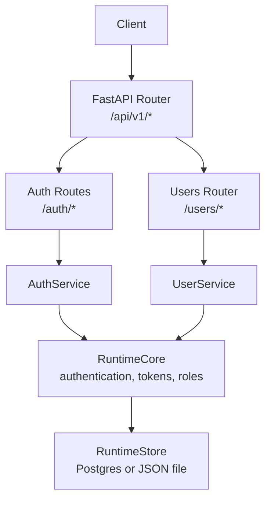
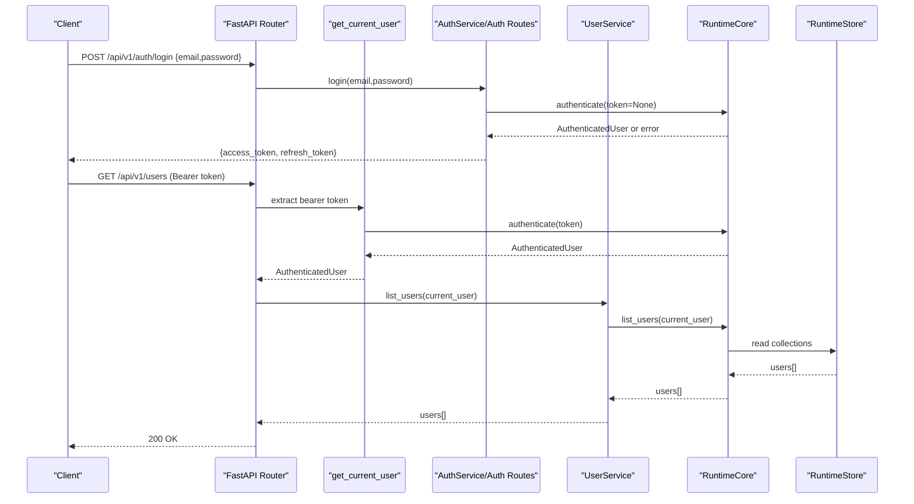
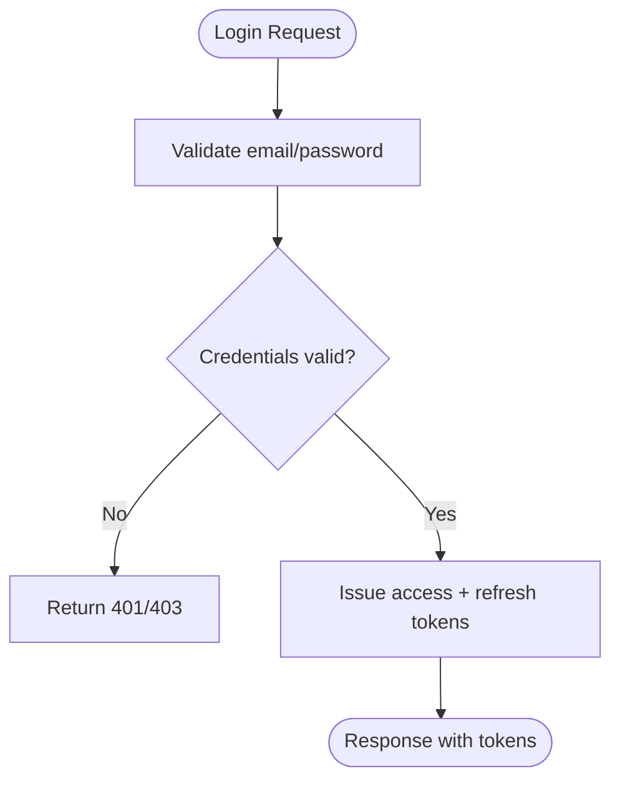
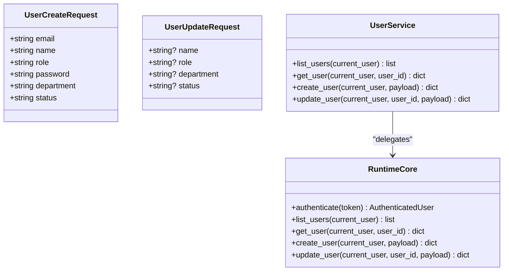
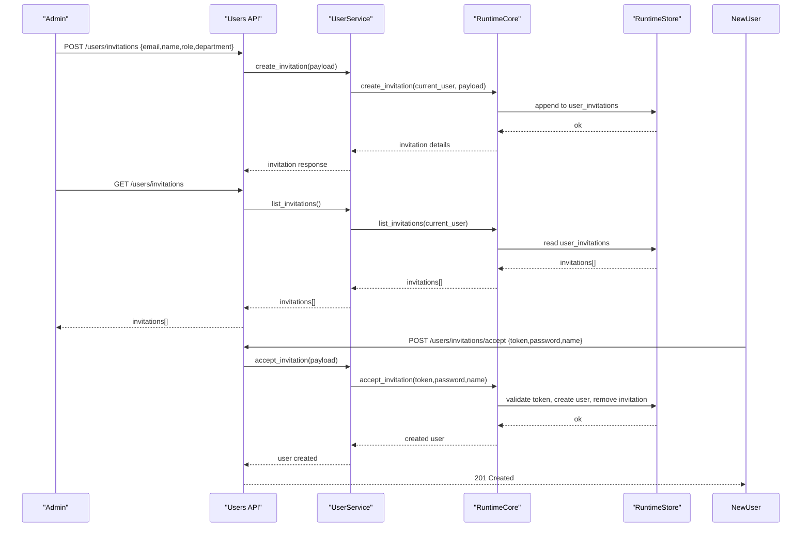
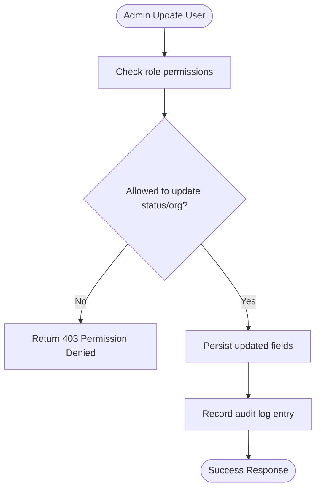
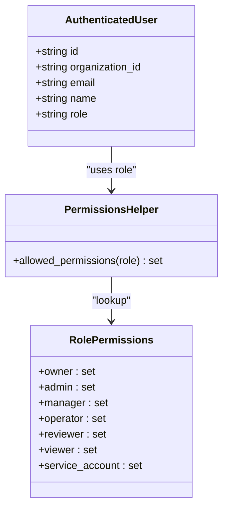
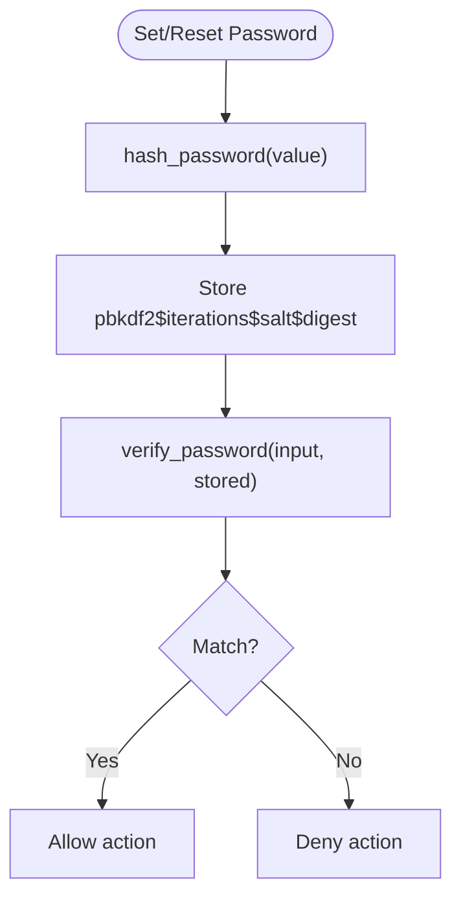
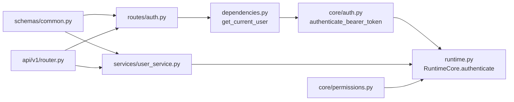

# User Management

<cite>
**Referenced Files in This Document**
- [runtime.py](file://backend/app/runtime.py)
- [user_service.py](file://backend/app/services/user_service.py)
- [auth.py](file://backend/app/core/auth.py)
- [dependencies.py](file://backend/app/api/dependencies.py)
- [router.py](file://backend/app/api/v1/router.py)
- [auth_routes.py](file://backend/app/api/v1/routes/auth.py)
- [common_schemas.py](file://backend/app/schemas/common.py)
- [permissions.py](file://backend/app/core/permissions.py)
</cite>

## Table of Contents
1. Introduction
2. Project Structure
3. Core Components
4. Architecture Overview
5. Detailed Component Analysis
6. Dependency Analysis
7. Performance Considerations
8. Troubleshooting Guide
9. Conclusion

## Introduction
This document explains user lifecycle management and administration for the system, covering registration, invitations, profile management, account status controls, role-based access control (RBAC), organization membership, bulk operations, password policies, security settings, activity tracking, provisioning workflows, audit trails, privacy and compliance considerations, and administrative best practices. It is grounded in the backend implementation that provides authentication, authorization, runtime state persistence, and API endpoints.

## Project Structure
User-related functionality spans several layers:
- API layer: FastAPI routers expose endpoints for authentication and user management.
- Service layer: Thin service functions delegate to the runtime core.
- Core runtime: Implements RBAC, token handling, password hashing, invitation processing, and persistence via Postgres or JSON file fallback.
- Schemas: Pydantic models define request/response contracts for users, invitations, and auth flows.

**Diagram sources**
- [router.py:1-47](file://backend/app/api/v1/router.py#L1-L47)
- [auth_routes.py:1-64](file://backend/app/api/v1/routes/auth.py#L1-L64)
- [user_service.py:1-34](file://backend/app/services/user_service.py#L1-L34)
- [runtime.py:258-384](file://backend/app/runtime.py#L258-L384)

**Section sources**
- [router.py:1-47](file://backend/app/api/v1/router.py#L1-L47)
- [auth_routes.py:1-64](file://backend/app/api/v1/routes/auth.py#L1-L64)
- [user_service.py:1-34](file://backend/app/services/user_service.py#L1-L34)
- [runtime.py:258-384](file://backend/app/runtime.py#L258-L384)

## Core Components
- Authentication and session: Bearer token authentication, refresh/logout, current user extraction.
- RBAC and permissions: Role-to-permission mapping and helper utilities.
- User and invitation services: CRUD for users, invitations, and acceptance flow.
- Persistence: Runtime store with Postgres-backed JSONB or JSON file fallback.
- Password hashing and verification: PBKDF2-HMAC-SHA256 with legacy SHA-256 migration support.

Key responsibilities:
- API routes validate requests and enforce rate limits where applicable.
- Services orchestrate business logic and call into runtime.
- Runtime enforces identity, roles, tokens, invitations, and persistence.

**Section sources**
- [auth.py:1-8](file://backend/app/core/auth.py#L1-L8)
- [dependencies.py:1-18](file://backend/app/api/dependencies.py#L1-L18)
- [permissions.py:1-6](file://backend/app/core/permissions.py#L1-L6)
- [user_service.py:1-34](file://backend/app/services/user_service.py#L1-L34)
- [runtime.py:70-91](file://backend/app/runtime.py#L70-L91)
- [runtime.py:131-222](file://backend/app/runtime.py#L131-L222)
- [runtime.py:258-384](file://backend/app/runtime.py#L258-L384)

## Architecture Overview
The user management architecture follows a layered design:
- Clients call FastAPI endpoints under /api/v1.
- Endpoints use dependency injection to obtain the authenticated user.
- Services encapsulate user and invitation operations.
- The runtime core implements RBAC, token management, password hashing, and persistence.

**Diagram sources**
- [auth_routes.py:15-22](file://backend/app/api/v1/routes/auth.py#L15-L22)
- [auth.py:6-8](file://backend/app/core/auth.py#L6-L8)
- [dependencies.py:13-17](file://backend/app/api/dependencies.py#L13-L17)
- [user_service.py:4-5](file://backend/app/services/user_service.py#L4-L5)
- [runtime.py:258-384](file://backend/app/runtime.py#L258-L384)

## Detailed Component Analysis

### Authentication and Session Management
- Login issues access and refresh tokens; logout invalidates the current token; refresh reissues tokens using a refresh token.
- Current user resolution uses a Bearer token header and delegates to runtime authentication.
- Rate limiting can be applied to sensitive endpoints.

**Diagram sources**
- [auth_routes.py:15-22](file://backend/app/api/v1/routes/auth.py#L15-L22)
- [auth.py:6-8](file://backend/app/core/auth.py#L6-L8)

**Section sources**
- [auth_routes.py:15-22](file://backend/app/api/v1/routes/auth.py#L15-L22)
- [auth_routes.py:25-28](file://backend/app/api/v1/routes/auth.py#L25-L28)
- [auth_routes.py:31-39](file://backend/app/api/v1/routes/auth.py#L31-L39)
- [auth.py:6-8](file://backend/app/core/auth.py#L6-L8)
- [dependencies.py:13-17](file://backend/app/api/dependencies.py#L13-L17)

### User Registration and Profile Management
- User creation accepts email, name, role, password, department, and status.
- User updates allow partial changes to name, role, department, and status.
- Listing and fetching individual users are supported through services backed by runtime.

**Diagram sources**
- [common_schemas.py:30-44](file://backend/app/schemas/common.py#L30-L44)
- [user_service.py:4-17](file://backend/app/services/user_service.py#L4-L17)
- [runtime.py:258-384](file://backend/app/runtime.py#L258-L384)

**Section sources**
- [common_schemas.py:30-44](file://backend/app/schemas/common.py#L30-L44)
- [user_service.py:4-17](file://backend/app/services/user_service.py#L4-L17)

### Invitation System and Acceptance
- Administrators can create invitations specifying target email, optional name, role, and department.
- Invitations are listed for review.
- Accepting an invitation requires a token, a new password, and optionally a display name.

**Diagram sources**
- [user_service.py:20-33](file://backend/app/services/user_service.py#L20-L33)
- [runtime.py:258-384](file://backend/app/runtime.py#L258-L384)

**Section sources**
- [user_service.py:20-33](file://backend/app/services/user_service.py#L20-L33)

### Account Status Controls and Organization Membership
- Users have a status field (e.g., active) and belong to an organization.
- Organization membership is enforced at runtime via organization_id on user records.
- Administrative operations should check permissions before modifying user status or organization membership.

**Diagram sources**
- [runtime.py:131-222](file://backend/app/runtime.py#L131-L222)
- [runtime.py:258-384](file://backend/app/runtime.py#L258-L384)

**Section sources**
- [runtime.py:131-222](file://backend/app/runtime.py#L131-L222)
- [runtime.py:258-384](file://backend/app/runtime.py#L258-L384)

### Role-Based Access Control (RBAC)
- Roles include owner, admin, manager, operator, reviewer, viewer, and service_account.
- Each role maps to a set of permissions used to gate actions across the platform.
- A helper returns allowed permissions for a given role.

**Diagram sources**
- [runtime.py:131-222](file://backend/app/runtime.py#L131-L222)
- [permissions.py:1-6](file://backend/app/core/permissions.py#L1-L6)

**Section sources**
- [runtime.py:131-222](file://backend/app/runtime.py#L131-L222)
- [permissions.py:1-6](file://backend/app/core/permissions.py#L1-L6)

### Bulk User Operations
- Bulk provisioning is not exposed as a dedicated endpoint in the analyzed code. Recommended approach:
  - Iterate over a CSV or batch payload and call user creation endpoints per record.
  - For invitations, create multiple invitations and let recipients self-register via acceptance.
  - Ensure idempotency and transactional boundaries at the orchestrator level if needed.

[No sources needed since this section provides general guidance]

### Password Policies and Security Settings
- Passwords are hashed using PBKDF2-HMAC-SHA256 with configurable iterations and salt.
- Legacy SHA-256 hashes are supported during migration.
- Password reset is available for authenticated users (self or org admin).
- API keys can be created and revoked for programmatic access.

**Diagram sources**
- [runtime.py:70-91](file://backend/app/runtime.py#L70-L91)
- [auth_routes.py:57-64](file://backend/app/api/v1/routes/auth.py#L57-L64)

**Section sources**
- [runtime.py:70-91](file://backend/app/runtime.py#L70-L91)
- [auth_routes.py:57-64](file://backend/app/api/v1/routes/auth.py#L57-L64)

### User Activity Tracking and Audit Trails
- The runtime maintains an audit_logs collection and other operational logs.
- Administrative changes (e.g., user updates, invitations) should emit audit entries for traceability.
- Use the audit logs UI/API to review who did what and when.

**Section sources**
- [runtime.py:225-255](file://backend/app/runtime.py#L225-L255)

### Practical Workflows

#### User Provisioning Workflow
- Create a user directly (requires appropriate permissions) or send an invitation for self-registration.
- Assign role and department at creation time.
- Optionally set initial password or require invite acceptance to set it.

**Section sources**
- [common_schemas.py:30-44](file://backend/app/schemas/common.py#L30-L44)
- [user_service.py:12-17](file://backend/app/services/user_service.py#L12-L17)
- [user_service.py:20-25](file://backend/app/services/user_service.py#L20-L25)

#### Invitation Management
- Create invitations with target email, optional name, role, and department.
- List pending invitations for oversight.
- Accept invitations to complete registration.

**Section sources**
- [user_service.py:20-33](file://backend/app/services/user_service.py#L20-L33)

#### Role Assignment Procedures
- Set role during user creation or update.
- Ensure the acting user has sufficient permissions (e.g., admin or owner).
- Review role-permission mappings before assigning elevated roles.

**Section sources**
- [runtime.py:131-222](file://backend/app/runtime.py#L131-L222)
- [permissions.py:1-6](file://backend/app/core/permissions.py#L1-L6)

#### User Audit Trail
- Record key events such as user creation, updates, invitations, and password resets.
- Query audit logs to investigate incidents and ensure compliance.

**Section sources**
- [runtime.py:225-255](file://backend/app/runtime.py#L225-L255)

### Privacy, Compliance, and Best Practices
- Data minimization: collect only necessary user attributes.
- Least privilege: assign minimal roles required for job functions.
- Secure storage: rely on PBKDF2 hashing; avoid storing plaintext passwords.
- Token hygiene: rotate and revoke tokens and API keys regularly.
- Auditability: enable and retain audit logs according to retention policies.
- Rate limiting: protect authentication and management endpoints from abuse.
- Tenancy isolation: enforce organization scoping on all user operations.

[No sources needed since this section provides general guidance]

## Dependency Analysis
The following diagram shows how components depend on each other for user management:

**Diagram sources**
- [dependencies.py:13-17](file://backend/app/api/dependencies.py#L13-L17)
- [auth.py:6-8](file://backend/app/core/auth.py#L6-L8)
- [auth_routes.py:1-64](file://backend/app/api/v1/routes/auth.py#L1-L64)
- [user_service.py:1-34](file://backend/app/services/user_service.py#L1-L34)
- [common_schemas.py:1-234](file://backend/app/schemas/common.py#L1-L234)
- [permissions.py:1-6](file://backend/app/core/permissions.py#L1-L6)
- [router.py:1-47](file://backend/app/api/v1/router.py#L1-L47)

**Section sources**
- [dependencies.py:13-17](file://backend/app/api/dependencies.py#L13-L17)
- [auth.py:6-8](file://backend/app/core/auth.py#L6-L8)
- [auth_routes.py:1-64](file://backend/app/api/v1/routes/auth.py#L1-L64)
- [user_service.py:1-34](file://backend/app/services/user_service.py#L1-L34)
- [common_schemas.py:1-234](file://backend/app/schemas/common.py#L1-L234)
- [permissions.py:1-6](file://backend/app/core/permissions.py#L1-L6)
- [router.py:1-47](file://backend/app/api/v1/router.py#L1-L47)

## Performance Considerations
- Prefer Postgres-backed persistence for concurrent workloads; the runtime automatically persists to both Postgres and JSON file for resilience.
- Avoid unnecessary user listing calls; paginate or filter where possible.
- Cache frequently accessed role-permission lookups at the application boundary if needed.
- Apply rate limiting to authentication and management endpoints to mitigate brute-force attempts.

**Section sources**
- [runtime.py:258-384](file://backend/app/runtime.py#L258-L384)

## Troubleshooting Guide
- Authentication failures: verify Bearer token format and expiration; check rate limiting configuration.
- Permission denied: confirm the acting user’s role includes required permissions.
- Invitation not found or expired: validate token and ensure invitation exists and is unaccepted.
- Password reset errors: ensure the email exists and the new password meets policy requirements.
- Persistence issues: if Postgres is unavailable, the runtime falls back to JSON file; check environment configuration.

**Section sources**
- [auth_routes.py:15-28](file://backend/app/api/v1/routes/auth.py#L15-L28)
- [runtime.py:107-129](file://backend/app/runtime.py#L107-L129)
- [runtime.py:258-384](file://backend/app/runtime.py#L258-L384)

## Conclusion
The system provides a robust foundation for user lifecycle management with clear separation of concerns: API routes, service layer, and runtime core. RBAC, secure password handling, invitation-driven onboarding, and auditability are implemented consistently. Follow least-privilege principles, maintain strong password policies, and leverage audit logs to ensure secure and compliant user administration.