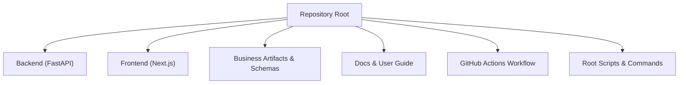
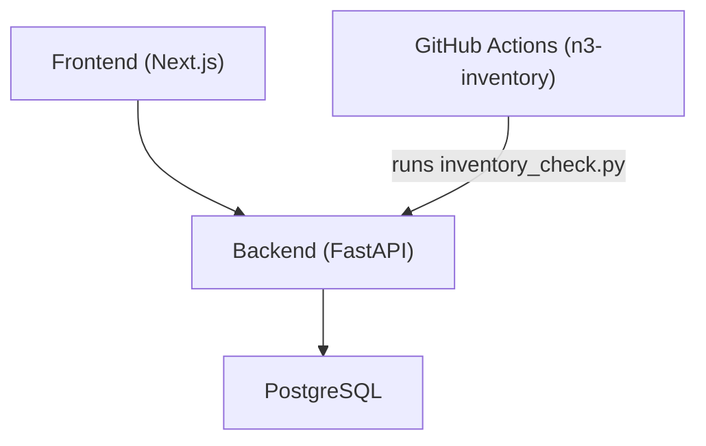
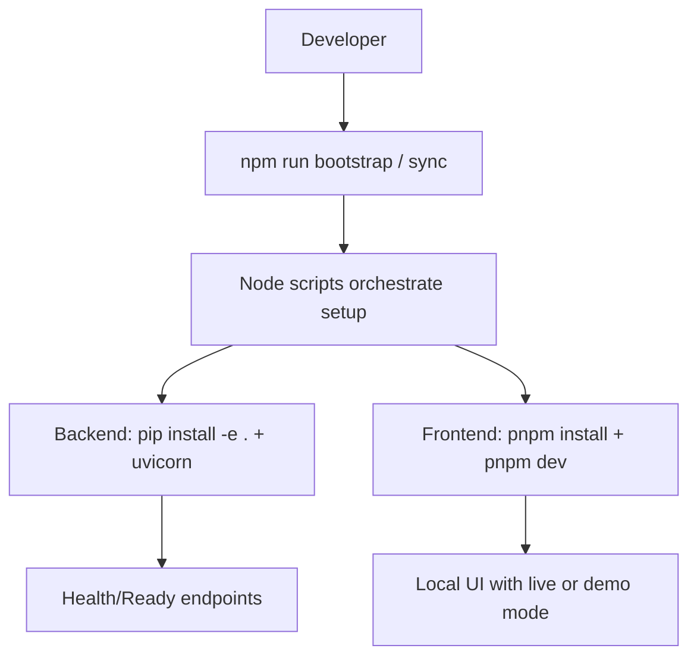
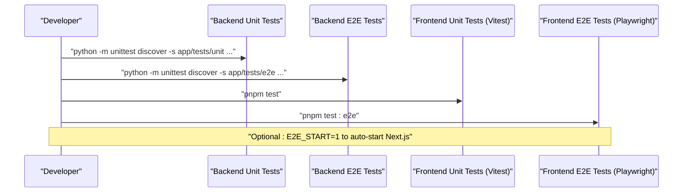
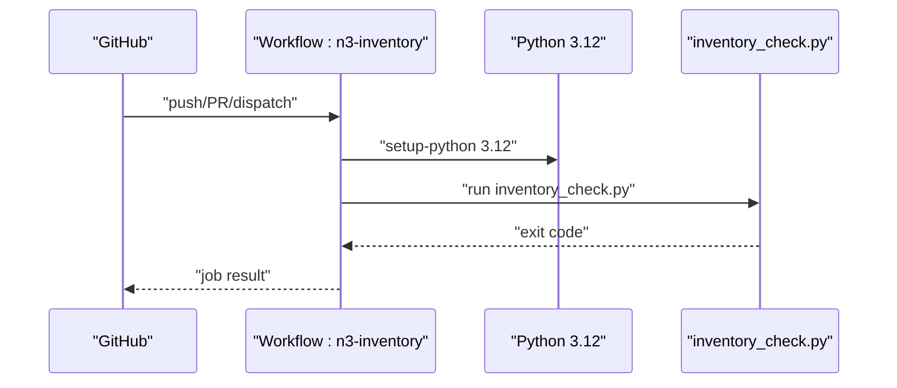
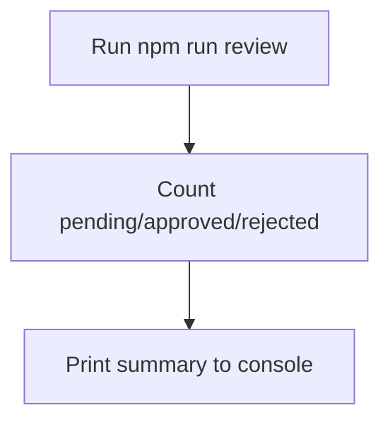
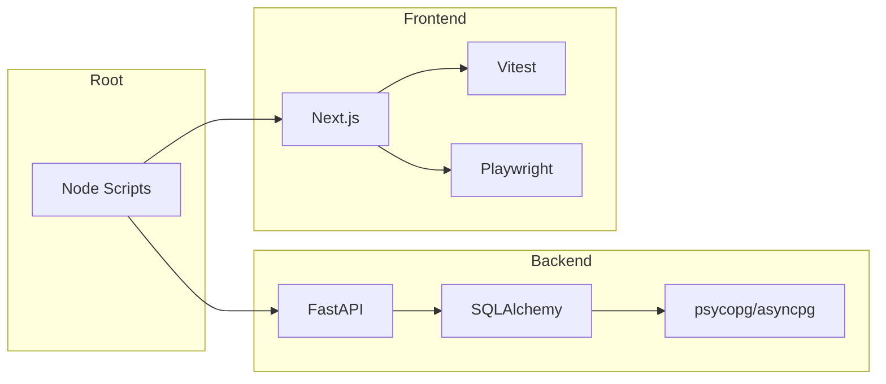

# Development Guide

<cite>
**Referenced Files in This Document**
- [README.md](file://README.md)
- [backend/README.md](file://backend/README.md)
- [frontend/README.md](file://frontend/README.md)
- [package.json](file://package.json)
- [backend/pyproject.toml](file://backend/pyproject.toml)
- [frontend/package.json](file://frontend/package.json)
- [frontend/vitest.config.ts](file://frontend/vitest.config.ts)
- [frontend/playwright.config.ts](file://frontend/playwright.config.ts)
- [.github/workflows/n3-inventory.yml](file://.github/workflows/n3-inventory.yml)
- [rules/00-constitution.md](file://rules/00-constitution.md)
- [rules/40-testing.md](file://rules/40-testing.md)
- [scripts/review.mjs](file://scripts/review.mjs)
</cite>

## Table of Contents
1. Introduction
2. Project Structure
3. Core Components
4. Architecture Overview
5. Detailed Component Analysis
6. Dependency Analysis
7. Performance Considerations
8. Troubleshooting Guide
9. Conclusion
10. Appendices

## Introduction
This guide is for contributors who want to set up the development environment, follow coding standards and architectural principles, implement features, write tests, and understand build, CI/CD, and deployment procedures. It consolidates repository-level commands, runtime configuration, testing strategy, and governance rules into a single reference.

## Project Structure
The repository is a multi-harness, governed business operating system with:
- Root orchestration scripts and shared rules
- Backend (FastAPI) under backend/
- Frontend (Next.js) under frontend/
- Business artifacts, schemas, and evaluation corpus under business/
- Documentation under docs/ and book/
- GitHub Actions workflow under .github/workflows/

[No sources needed since this diagram shows conceptual structure]

**Section sources**
- [README.md](file://README.md)
- [package.json](file://package.json)

## Core Components
- Backend API server (FastAPI) providing authentication, RBAC, workflow execution, governance gates, memory/knowledge retrieval, audit logs, evaluations, process intelligence, evolution sandbox, and self-improvement APIs.
- Frontend dashboard (Next.js) exposing live ops surfaces including agents, workflows, runs, approvals, knowledge, evaluations, processes, audit logs, settings, and evolution archive.
- Shared rules and constitution that govern behavior across harnesses.
- Root scripts orchestrating bootstrap, sync, validation, security checks, and reviews.

Key developer entry points:
- Bootstrap and sync commands at the repository root
- Backend quick start and env flags
- Frontend dev/build/test/e2e commands

**Section sources**
- [README.md](file://README.md)
- [backend/README.md](file://backend/README.md)
- [frontend/README.md](file://frontend/README.md)
- [package.json](file://package.json)

## Architecture Overview
High-level runtime architecture:
- Frontend communicates with the FastAPI backend over HTTP.
- Backend persists state to Postgres and exposes health/readiness endpoints.
- CI pipeline performs an inventory check on push/PR/dispatch.

**Diagram sources**
- [backend/README.md](file://backend/README.md)
- [.github/workflows/n3-inventory.yml](file://.github/workflows/n3-inventory.yml)

**Section sources**
- [backend/README.md](file://backend/README.md)
- [.github/workflows/n3-inventory.yml](file://.github/workflows/n3-inventory.yml)

## Detailed Component Analysis

### Development Environment Setup
- Node.js version requirement and root scripts are defined at the repository level.
- Backend requires Python >=3.11 and uses FastAPI + SQLAlchemy + psycopg/asyncpg.
- Frontend uses pnpm, Next.js, Vitest, and Playwright.

Steps:
- Install Node.js (>=20) and run root bootstrap/sync commands.
- Configure backend/.env with DATABASE_URL and optional feature flags; then install backend dependencies and run uvicorn.
- Configure frontend environment variables (NEXT_PUBLIC_DEMO_MODE, NEXT_PUBLIC_API_BASE_URL), install dependencies, and run dev server.

Environment flags:
- Backend: DATABASE_URL, GENERIC_SWARM_AUTO_REFLECT, LLM_CRITIC_ENABLED, EMBEDDINGS_ENABLED, PGVECTOR_ENABLED, NEO4J_URI.
- Frontend: NEXT_PUBLIC_DEMO_MODE, NEXT_PUBLIC_API_BASE_URL.

**Section sources**
- [package.json](file://package.json)
- [backend/pyproject.toml](file://backend/pyproject.toml)
- [backend/README.md](file://backend/README.md)
- [frontend/README.md](file://frontend/README.md)

### Coding Standards and Architectural Principles
- Follow the Constitution: simple, maintainable solutions; surgical changes; no destructive actions without approval; do not execute untrusted code until audited; run relevant tests or explain why not; update status after major work.
- Testing rule: add focused tests for bootstrap-critical logic; run tests before claiming success; keep tests deterministic and dependency-free.
- Prefer layered separation: API layer, services, domain, infrastructure, and workers as reflected by backend package organization.

**Section sources**
- [rules/00-constitution.md](file://rules/00-constitution.md)
- [rules/40-testing.md](file://rules/40-testing.md)

### Build System
- Root package.json defines bootstrap, doctor, sources management, sync, security, review, business validation, and test commands.
- Backend uses setuptools via pyproject.toml and runs with uvicorn.
- Frontend uses pnpm scripts for dev, build, lint, typecheck, unit tests, and e2e tests.

**Diagram sources**
- [package.json](file://package.json)
- [backend/README.md](file://backend/README.md)
- [frontend/README.md](file://frontend/README.md)

**Section sources**
- [package.json](file://package.json)
- [backend/pyproject.toml](file://backend/pyproject.toml)
- [backend/README.md](file://backend/README.md)
- [frontend/package.json](file://frontend/package.json)

### Testing Strategy
- Unit tests:
  - Backend: unittest discover under app/tests/unit.
  - Frontend: Vitest configured with jsdom environment and include patterns under tests/**/*.{test,spec}.{ts,tsx}.
- Integration/E2E tests:
  - Backend: unittest discover under app/tests/e2e.
  - Frontend: Playwright tests under e2e with optional webServer auto-start when E2E_START=1.

Recommended flow:
- Run backend unit and e2e suites.
- Run frontend unit suite.
- Run frontend e2e smoke against local servers.

**Diagram sources**
- [backend/README.md](file://backend/README.md)
- [frontend/vitest.config.ts](file://frontend/vitest.config.ts)
- [frontend/playwright.config.ts](file://frontend/playwright.config.ts)
- [frontend/package.json](file://frontend/package.json)

**Section sources**
- [backend/README.md](file://backend/README.md)
- [frontend/vitest.config.ts](file://frontend/vitest.config.ts)
- [frontend/playwright.config.ts](file://frontend/playwright.config.ts)
- [frontend/package.json](file://frontend/package.json)

### CI/CD Pipelines
- GitHub Actions workflow n3-inventory.yml runs on push to main/master, pull requests, and manual dispatch.
- The job installs Python 3.12 and executes scripts/business/inventory_check.py.

**Diagram sources**
- [.github/workflows/n3-inventory.yml](file://.github/workflows/n3-inventory.yml)

**Section sources**
- [.github/workflows/n3-inventory.yml](file://.github/workflows/n3-inventory.yml)

### Deployment Procedures
- Backend:
  - Ensure Postgres is running and DATABASE_URL is configured.
  - Install backend dependencies and run uvicorn with reload for development.
  - Verify readiness endpoint returns database status.
- Frontend:
  - Set NEXT_PUBLIC_DEMO_MODE=false and NEXT_PUBLIC_API_BASE_URL to point to backend.
  - Use pnpm dev for local development; pnpm build/start for production-like runs.

Operational notes:
- Demo tokens exist for local smoke only; prefer password login for operations.
- Seed credentials are provided for local development.

**Section sources**
- [backend/README.md](file://backend/README.md)
- [frontend/README.md](file://frontend/README.md)

### Code Review Processes and Quality Gates
- Review summary script counts entries in suggestions/pending, suggestions/approved, and suggestions/rejected directories.
- Use npm run review to get a quick overview of suggestion statuses.
- Governance and security checks can be executed via root scripts (business:governance, business:security).

**Diagram sources**
- [scripts/review.mjs](file://scripts/review.mjs)

**Section sources**
- [scripts/review.mjs](file://scripts/review.mjs)
- [package.json](file://package.json)

### Contribution Guidelines and Examples
- Follow the Constitution and Testing rules strictly.
- When adding new features:
  - Implement minimal, focused changes aligned with layered architecture.
  - Add unit tests for critical logic; ensure determinism and no external dependencies.
  - Update documentation and status where applicable.
- Example flows:
  - Backend: create service + schema + API route; add unit tests; verify with health/readiness.
  - Frontend: add page/component; wire to generated OpenAPI client; add Vitest unit tests; optionally add Playwright e2e if user-facing.

**Section sources**
- [rules/00-constitution.md](file://rules/00-constitution.md)
- [rules/40-testing.md](file://rules/40-testing.md)
- [backend/README.md](file://backend/README.md)
- [frontend/README.md](file://frontend/README.md)

## Dependency Analysis
Runtime and tooling dependencies:
- Backend depends on FastAPI, uvicorn, Pydantic, SQLAlchemy, psycopg, asyncpg.
- Frontend depends on Next.js, React, Zod, react-hook-form, Zustand, Vitest, Playwright.
- Root orchestrates Node-based scripts and Python-based checks.

**Diagram sources**
- [backend/pyproject.toml](file://backend/pyproject.toml)
- [frontend/package.json](file://frontend/package.json)
- [package.json](file://package.json)

**Section sources**
- [backend/pyproject.toml](file://backend/pyproject.toml)
- [frontend/package.json](file://frontend/package.json)
- [package.json](file://package.json)

## Performance Considerations
- Keep unit tests fast and deterministic; avoid network calls and heavy I/O.
- Prefer in-memory fixtures for backend integration tests when possible.
- For frontend, isolate slow components behind mocks and use jsdom for unit tests.
- Use health/readiness endpoints to gate deployments and autoscaling decisions.

[No sources needed since this section provides general guidance]

## Troubleshooting Guide
Common issues and resolutions:
- Backend readiness fails:
  - Verify Postgres is reachable and DATABASE_URL is correct.
  - Check health/readiness endpoint for database status.
- Frontend cannot reach backend:
  - Ensure NEXT_PUBLIC_API_BASE_URL points to the running backend.
  - Confirm CORS and headers are acceptable locally.
- E2E tests skip or fail:
  - If using E2E_START=1, ensure port availability and that Next.js starts successfully.
  - In CI, retries are enabled; inspect traces on first retry.

**Section sources**
- [backend/README.md](file://backend/README.md)
- [frontend/playwright.config.ts](file://frontend/playwright.config.ts)

## Conclusion
This guide consolidates environment setup, coding standards, architecture, testing, build, CI/CD, and contribution practices. Adhering to the Constitution and Testing rules, leveraging the provided scripts, and following the layered design will help you contribute effectively and safely.

[No sources needed since this section summarizes without analyzing specific files]

## Appendices

### Quick Reference: Commands
- Repository:
  - npm run bootstrap
  - npm run sync
  - npm run doctor
  - npm run business:validate
  - npm run business:governance
  - npm run business:security
  - npm run review
- Backend:
  - python -m pip install -e .
  - uvicorn app.main:app --reload
  - Health/ready: GET /api/v1/health/ready
- Frontend:
  - pnpm install
  - pnpm dev
  - pnpm test
  - pnpm test:e2e

**Section sources**
- [package.json](file://package.json)
- [backend/README.md](file://backend/README.md)
- [frontend/README.md](file://frontend/README.md)