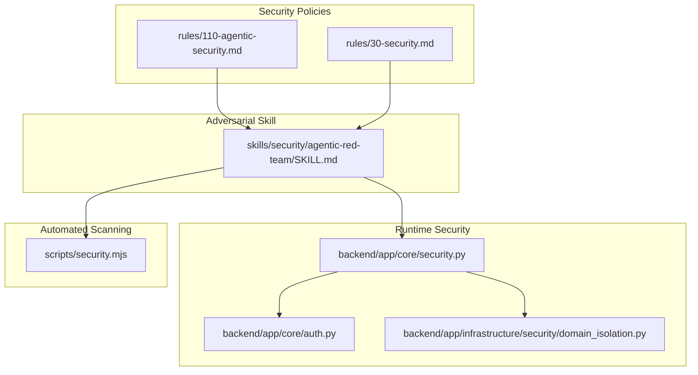
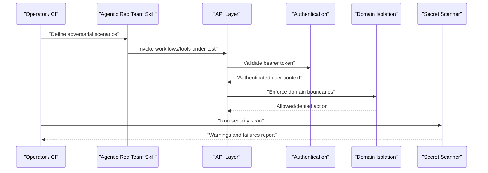
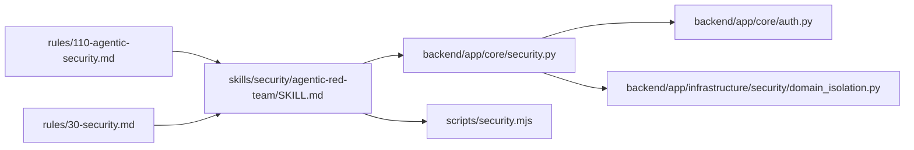

# Adversarial Testing & Security Validation

<cite>
**Referenced Files in This Document**
- [security.py](file://backend/app/core/security.py)
- [auth.py](file://backend/app/core/auth.py)
- [domain_isolation.py](file://backend/app/infrastructure/security/domain_isolation.py)
- [110-agentic-security.md](file://rules/110-agentic-security.md)
- [30-security.md](file://rules/30-security.md)
- [SKILL.md](file://skills/security/agentic-red-team/SKILL.md)
- [security.mjs](file://scripts/security.mjs)
</cite>

## Table of Contents
1. [Introduction](#introduction)
2. [Project Structure](#project-structure)
3. [Core Components](#core-components)
4. [Architecture Overview](#architecture-overview)
5. [Detailed Component Analysis](#detailed-component-analysis)
6. [Dependency Analysis](#dependency-analysis)
7. [Performance Considerations](#performance-considerations)
8. [Troubleshooting Guide](#troubleshooting-guide)
9. [Conclusion](#conclusion)
10. [Appendices](#appendices)

## Introduction
This document provides a comprehensive guide to adversarial testing and security validation for agentic systems. It focuses on prompt injection detection, tool misuse prevention, and security boundary testing. It also covers how to create adversarial test suites, simulate attacks, assess vulnerabilities, integrate with governance policies and risk assessment frameworks, and interpret security reports. The content is grounded in the repository’s security rules, red teaming skill, runtime authentication, domain isolation, and secret scanning utilities.

## Project Structure
The repository organizes security-related concerns across multiple layers:
- Rules and policies define security principles and constraints.
- A red teaming skill describes adversarial probing objectives.
- Runtime components enforce authentication and domain isolation.
- Scripts provide automated security scanning for secrets and suspicious patterns.

**Diagram sources**
- [110-agentic-security.md:1-6](file://rules/110-agentic-security.md#L1-L6)
- [30-security.md:1-6](file://rules/30-security.md#L1-L6)
- [SKILL.md:1-11](file://skills/security/agentic-red-team/SKILL.md#L1-L11)
- [security.py:1-4](file://backend/app/core/security.py#L1-L4)
- [auth.py:1-8](file://backend/app/core/auth.py#L1-L8)
- [domain_isolation.py](file://backend/app/infrastructure/security/domain_isolation.py)
- [security.mjs:1-76](file://scripts/security.mjs#L1-L76)

**Section sources**
- [110-agentic-security.md:1-6](file://rules/110-agentic-security.md#L1-L6)
- [30-security.md:1-6](file://rules/30-security.md#L1-L6)
- [SKILL.md:1-11](file://skills/security/agentic-red-team/SKILL.md#L1-L11)
- [security.py:1-4](file://backend/app/core/security.py#L1-L4)
- [auth.py:1-8](file://backend/app/core/auth.py#L1-L8)
- [domain_isolation.py](file://backend/app/infrastructure/security/domain_isolation.py)
- [security.mjs:1-76](file://scripts/security.mjs#L1-L76)

## Core Components
- Agentic Security Rules: Define untrusted input assumptions, least privilege for tools, and required adversarial tests (indirect prompt injection, memory poisoning, leakage, privilege abuse).
- Red Team Skill: Provides a focused scope for probing prompt injection, tool misuse, privilege abuse, memory poisoning, and unsafe autonomy scenarios.
- Runtime Authentication: Validates bearer tokens via a runtime provider to ensure only authenticated users can access protected operations.
- Domain Isolation: Enforces boundaries between domains to limit cross-domain influence and reduce blast radius.
- Secret and Pattern Scanner: Scans project files for sensitive artifacts and suspicious patterns, including external source package.json checks for dangerous scripts.

Key responsibilities:
- Policy enforcement through rules and skill definitions.
- Identity verification at request boundaries.
- Execution boundary enforcement via domain isolation.
- Automated pre-commit or CI scanning for secrets and risky patterns.

**Section sources**
- [110-agentic-security.md:1-6](file://rules/110-agentic-security.md#L1-L6)
- [SKILL.md:1-11](file://skills/security/agentic-red-team/SKILL.md#L1-L11)
- [security.py:1-4](file://backend/app/core/security.py#L1-L4)
- [auth.py:1-8](file://backend/app/core/auth.py#L1-L8)
- [domain_isolation.py](file://backend/app/infrastructure/security/domain_isolation.py)
- [security.mjs:1-76](file://scripts/security.mjs#L1-L76)

## Architecture Overview
The adversarial testing and security validation architecture integrates policy-driven red teaming with runtime controls and automated scanning.

**Diagram sources**
- [SKILL.md:1-11](file://skills/security/agentic-red-team/SKILL.md#L1-L11)
- [security.py:1-4](file://backend/app/core/security.py#L1-L4)
- [auth.py:1-8](file://backend/app/core/auth.py#L1-L8)
- [domain_isolation.py](file://backend/app/infrastructure/security/domain_isolation.py)
- [security.mjs:1-76](file://scripts/security.mjs#L1-L76)

## Detailed Component Analysis

### Prompt Injection Detection and Mitigation
- Untrusted Input Assumption: Treated retrieved content and downloaded sources as untrusted until audited.
- Indirect Injection Probes: Use the red team skill to craft scenarios that inject instructions via retrieved content or tool outputs.
- Boundary Enforcement: Ensure prompts are validated and sanitized before being used by downstream tools or memory stores.
- Monitoring and Logging: Record suspicious patterns in security and audit outputs for later analysis.

Operational guidance:
- Create adversarial cases that manipulate retrieval pipelines and tool responses.
- Validate that system behavior remains within intended boundaries even when inputs are malicious.
- Integrate pattern-based detectors into evaluation harnesses to flag potential injections.

**Section sources**
- [110-agentic-security.md:1-6](file://rules/110-agentic-security.md#L1-L6)
- [30-security.md:1-6](file://rules/30-security.md#L1-L6)
- [SKILL.md:1-11](file://skills/security/agentic-red-team/SKILL.md#L1-L11)

### Tool Misuse Prevention
- Least Privilege: Restrict tool access to minimal necessary capabilities.
- Permission Checks: Enforce authorization at the API layer using authenticated user context.
- Domain Isolation: Prevent cross-domain tool calls unless explicitly permitted.
- Audit Trails: Log tool invocations and outcomes for compliance and incident response.

Implementation anchors:
- Bearer token authentication ensures requests originate from verified identities.
- Domain isolation enforces execution boundaries to prevent unintended side effects.

**Section sources**
- [110-agentic-security.md:1-6](file://rules/110-agentic-security.md#L1-L6)
- [security.py:1-4](file://backend/app/core/security.py#L1-L4)
- [auth.py:1-8](file://backend/app/core/auth.py#L1-L8)
- [domain_isolation.py](file://backend/app/infrastructure/security/domain_isolation.py)

### Security Boundary Testing
- Scope Definition: Clearly delineate domains and allowed interactions.
- Boundary Cases: Test transitions across domains, especially where data or control flows cross boundaries.
- Failure Modes: Verify that unauthorized actions are denied and logged appropriately.

Integration points:
- API layer uses authentication and domain isolation to enforce boundaries.
- Red team scenarios should exercise boundary crossings intentionally.

**Section sources**
- [security.py:1-4](file://backend/app/core/security.py#L1-L4)
- [auth.py:1-8](file://backend/app/core/auth.py#L1-L8)
- [domain_isolation.py](file://backend/app/infrastructure/security/domain_isolation.py)

### Adversarial Test Case Creation and Attack Simulation
- Scenario Design: Cover indirect prompt injection, tool exfiltration attempts, memory poisoning probes, and unsafe autonomy.
- Automation: Embed adversarial cases into evaluation harnesses and run them regularly.
- Reporting: Capture pass/fail status, severity, and remediation steps.

Red team focus areas:
- Prompt injection vectors via retrieved content and tool outputs.
- Privilege escalation through tool misuse.
- Memory manipulation to alter future behavior.

**Section sources**
- [SKILL.md:1-11](file://skills/security/agentic-red-team/SKILL.md#L1-L11)
- [110-agentic-security.md:1-6](file://rules/110-agentic-security.md#L1-L6)

### Vulnerability Assessment and Security Scoring
- Risk Tiering: Align assessments with governance-defined tiers to prioritize remediation.
- Scoring Criteria: Include likelihood, impact, detectability, and mitigation effectiveness.
- Evidence Collection: Use logs, scan results, and red team findings to substantiate scores.

Compliance linkage:
- Map findings to policy requirements and audit evidence.
- Maintain traceability from threat model to test coverage and scoring.

[No sources needed since this section provides general guidance]

### Threat Modeling Integration
- Asset Identification: Catalog agents, tools, memory stores, and retrieval pipelines.
- Threat Enumeration: Focus on injection, misuse, leakage, and privilege abuse.
- Control Mapping: Tie mitigations to authentication, domain isolation, and scanning.

Operationalization:
- Update threat models when new tools or integrations are introduced.
- Reassess risks after changes to retrieval or memory systems.

[No sources needed since this section provides general guidance]

### Compliance Validation
- Policy Alignment: Ensure all adversarial tests cover mandated attack surfaces.
- Audit Readiness: Produce artifacts that demonstrate adherence to security rules.
- Continuous Verification: Automate scans and evaluations in CI/CD.

**Section sources**
- [30-security.md:1-6](file://rules/30-security.md#L1-L6)
- [110-agentic-security.md:1-6](file://rules/110-agentic-security.md#L1-L6)

### Creating Adversarial Test Suites
- Structure: Organize cases by attack vector (injection, misuse, poisoning, autonomy).
- Inputs: Use realistic but synthetic payloads to avoid exposing real secrets.
- Assertions: Define clear expected behaviors and failure conditions.

Execution:
- Run suites against staging environments with isolated credentials.
- Aggregate results into evaluation reports.

[No sources needed since this section provides general guidance]

### Running Security Scans
- Secret Scanning: Detect private keys, tokens, and environment files committed inadvertently.
- External Sources Review: Inspect package.json for postinstall hooks and remote command execution patterns.
- MCP Access Scope: Flag configurations granting broad filesystem or network access.

CI Integration:
- Fail builds on critical findings; surface warnings for triage.
- Archive reports for audit trails.

**Section sources**
- [security.mjs:1-76](file://scripts/security.mjs#L1-L76)

### Interpreting Security Reports
- Severity Classification: Distinguish failures (blockers) from warnings (review items).
- Remediation Guidance: Provide actionable steps to mitigate identified issues.
- Trend Analysis: Track recurring patterns over time to improve defenses.

[No sources needed since this section provides general guidance]

### Governance Policies and Risk Assessment Integration
- Policy-to-Test Mapping: Ensure each policy has corresponding adversarial coverage.
- Risk Registers: Link findings to risk entries and owners.
- Approval Gates: Require human approval for high-risk changes based on risk tier.

**Section sources**
- [110-agentic-security.md:1-6](file://rules/110-agentic-security.md#L1-L6)
- [30-security.md:1-6](file://rules/30-security.md#L1-L6)

## Dependency Analysis
The following diagram shows key dependencies among security components:

**Diagram sources**
- [110-agentic-security.md:1-6](file://rules/110-agentic-security.md#L1-L6)
- [30-security.md:1-6](file://rules/30-security.md#L1-L6)
- [SKILL.md:1-11](file://skills/security/agentic-red-team/SKILL.md#L1-L11)
- [security.py:1-4](file://backend/app/core/security.py#L1-L4)
- [auth.py:1-8](file://backend/app/core/auth.py#L1-L8)
- [domain_isolation.py](file://backend/app/infrastructure/security/domain_isolation.py)
- [security.mjs:1-76](file://scripts/security.mjs#L1-L76)

**Section sources**
- [110-agentic-security.md:1-6](file://rules/110-agentic-security.md#L1-L6)
- [30-security.md:1-6](file://rules/30-security.md#L1-L6)
- [SKILL.md:1-11](file://skills/security/agentic-red-team/SKILL.md#L1-L11)
- [security.py:1-4](file://backend/app/core/security.py#L1-L4)
- [auth.py:1-8](file://backend/app/core/auth.py#L1-L8)
- [domain_isolation.py](file://backend/app/infrastructure/security/domain_isolation.py)
- [security.mjs:1-76](file://scripts/security.mjs#L1-L76)

## Performance Considerations
- Keep adversarial suites modular to enable parallel execution.
- Limit scan scope to relevant directories to reduce overhead.
- Cache known-good baselines for regression comparisons.
- Avoid heavy I/O during runtime checks; prefer lightweight validations.

[No sources needed since this section provides general guidance]

## Troubleshooting Guide
Common issues and resolutions:
- Authentication failures: Verify bearer token validity and runtime configuration.
- Domain isolation denials: Confirm intended cross-domain permissions and update policies if appropriate.
- Secret scanner failures: Remove or externalize sensitive files; adjust exclusions carefully.
- External source warnings: Inspect package.json for postinstall hooks and remote execution patterns; remediate or quarantine.

**Section sources**
- [security.py:1-4](file://backend/app/core/security.py#L1-L4)
- [auth.py:1-8](file://backend/app/core/auth.py#L1-L8)
- [domain_isolation.py](file://backend/app/infrastructure/security/domain_isolation.py)
- [security.mjs:1-76](file://scripts/security.mjs#L1-L76)

## Conclusion
By combining policy-driven red teaming, runtime authentication and domain isolation, and automated scanning, teams can systematically detect and mitigate adversarial threats such as prompt injection, tool misuse, and privilege abuse. Integrating these practices with governance and risk frameworks ensures continuous compliance and resilience.

[No sources needed since this section summarizes without analyzing specific files]

## Appendices

### Example Workflows

#### Creating an Adversarial Test Suite
- Identify attack surfaces per the red team skill.
- Draft cases covering injection, misuse, poisoning, and autonomy.
- Define assertions and expected outcomes.
- Store cases in a structured directory and link to evaluation harness.

[No sources needed since this section provides general guidance]

#### Running Security Scans in CI
- Invoke the secret scanner on pull requests.
- Treat failures as blocking; review warnings promptly.
- Publish reports and archive artifacts.

**Section sources**
- [security.mjs:1-76](file://scripts/security.mjs#L1-L76)

#### Interpreting Security Reports
- Classify findings by severity.
- Assign owners and due dates.
- Track remediation progress and re-scan to verify fixes.

[No sources needed since this section provides general guidance]