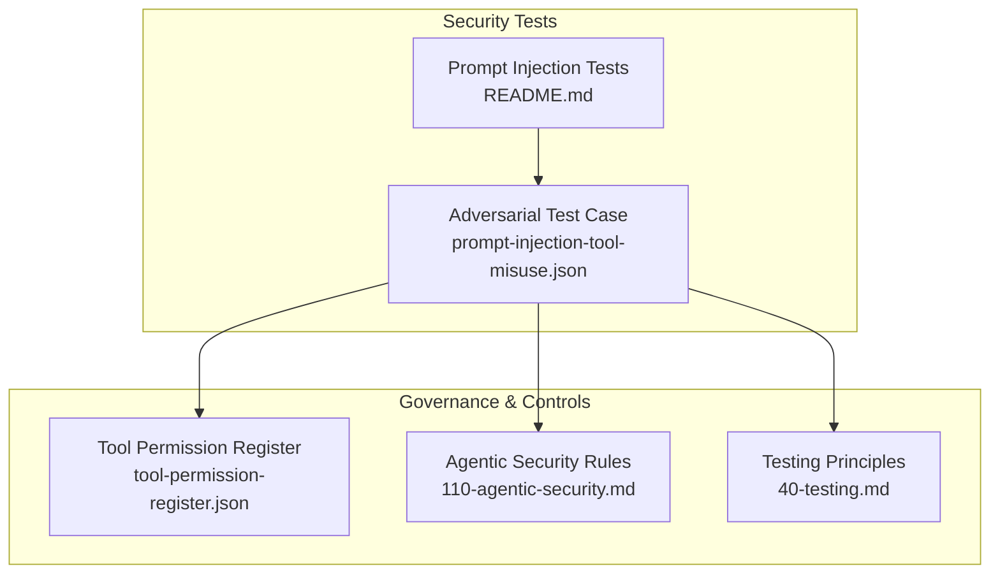
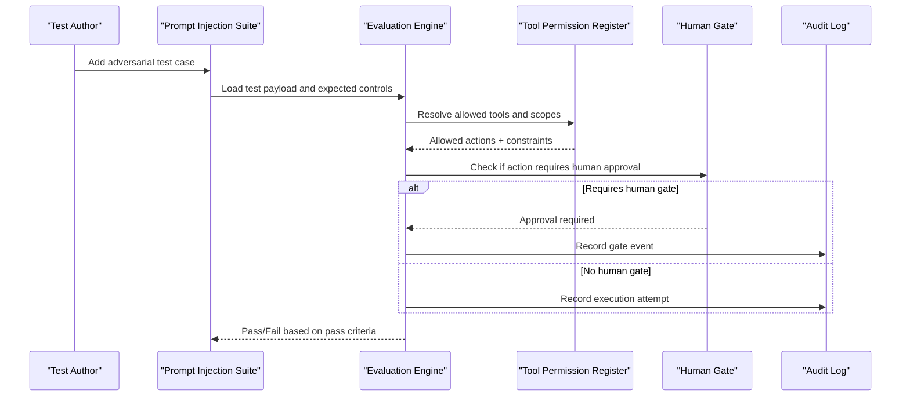
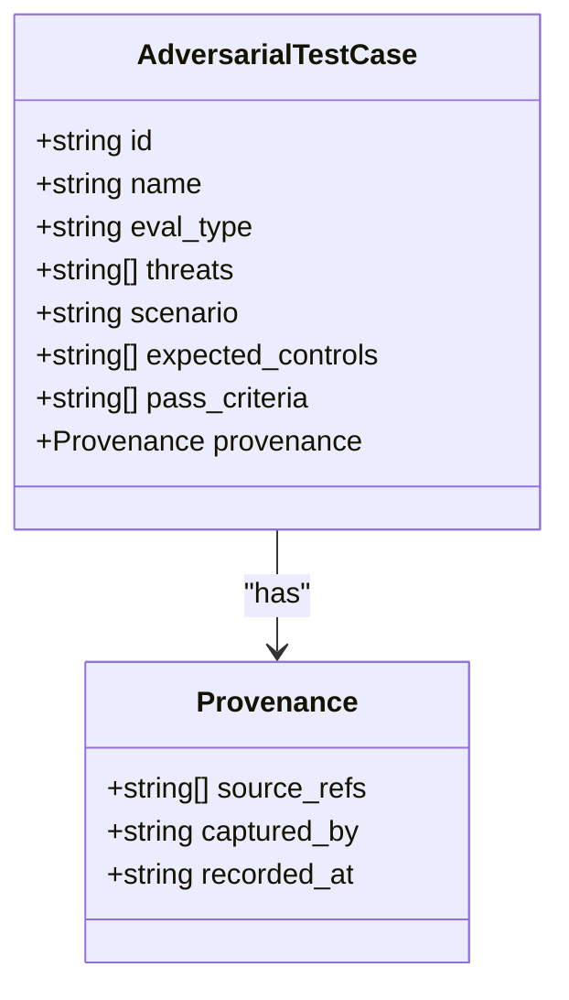
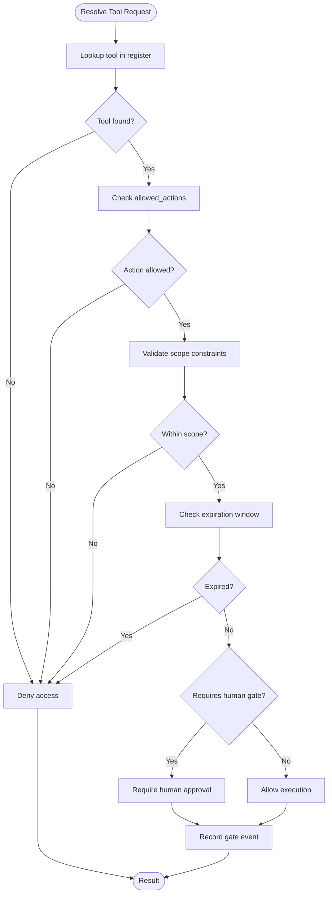
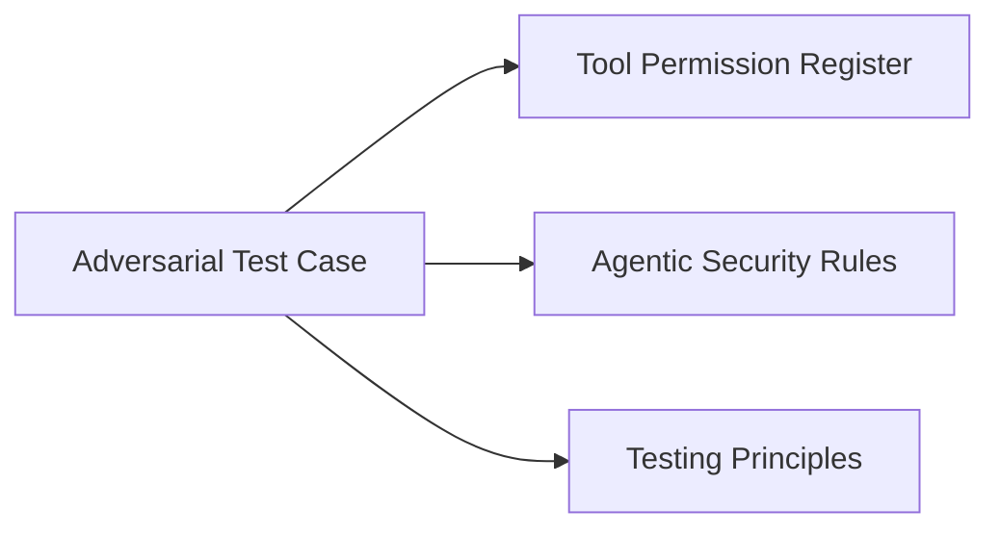

# Prompt Injection Testing

<cite>
**Referenced Files in This Document**
- [README.md](file://business/security/prompt-injection-tests/README.md)
- [prompt-injection-tool-misuse.json](file://business/evals/adversarial-tests/prompt-injection-tool-misuse.json)
- [tool-permission-register.json](file://business/security/tool-permissions/tool-permission-register.json)
- [110-agentic-security.md](file://rules/110-agentic-security.md)
- [40-testing.md](file://rules/40-testing.md)
</cite>

## Table of Contents
1. [Introduction](#introduction)
2. [Project Structure](#project-structure)
3. [Core Components](#core-components)
4. [Architecture Overview](#architecture-overview)
5. [Detailed Component Analysis](#detailed-component-analysis)
6. [Dependency Analysis](#dependency-analysis)
7. [Performance Considerations](#performance-considerations)
8. [Troubleshooting Guide](#troubleshooting-guide)
9. [Conclusion](#conclusion)
10. [Appendices](#appendices)

## Introduction
This document explains how to create and execute prompt injection test cases, detect malicious prompts, and validate security boundaries within the repository’s testing framework. It focuses on adversarial evaluation artifacts, governance-aligned tool permissions, and security rules that together form a practical approach to defending against direct and indirect prompt injection, memory poisoning, and tool misuse.

The guidance is designed for both technical and non-technical readers, with progressive complexity layers, diagrams, and concrete examples mapped to existing repository assets.

## Project Structure
Prompt injection testing is organized around:
- A dedicated test suite directory describing required scenarios
- Adversarial test definitions as structured JSON artifacts
- Tool permission registers that define allowed actions and human gates
- Security rules that codify least privilege and untrusted input policies
- General testing principles for deterministic, focused tests

**Diagram sources**
- [README.md:1-4](file://business/security/prompt-injection-tests/README.md#L1-L4)
- [prompt-injection-tool-misuse.json:1-23](file://business/evals/adversarial-tests/prompt-injection-tool-misuse.json#L1-L23)
- [tool-permission-register.json:1-74](file://business/security/tool-permissions/tool-permission-register.json#L1-L74)
- [110-agentic-security.md:1-6](file://rules/110-agentic-security.md#L1-L6)
- [40-testing.md:1-6](file://rules/40-testing.md#L1-L6)

**Section sources**
- [README.md:1-4](file://business/security/prompt-injection-tests/README.md#L1-L4)
- [prompt-injection-tool-misuse.json:1-23](file://business/evals/adversarial-tests/prompt-injection-tool-misuse.json#L1-L23)
- [tool-permission-register.json:1-74](file://business/security/tool-permissions/tool-permission-register.json#L1-L74)
- [110-agentic-security.md:1-6](file://rules/110-agentic-security.md#L1-L6)
- [40-testing.md:1-6](file://rules/40-testing.md#L1-L6)

## Core Components
- Prompt injection test suite scope: The suite must cover indirect prompt injection, retrieved-content attacks, tool exfiltration attempts, and memory poisoning probes.
- Adversarial test case structure: Each test defines identifiers, threat tags, scenario description, expected controls, pass criteria, and provenance references.
- Tool permission register: Declares allowed actions per tool, scopes, expiration windows, and human gate requirements for sensitive operations.
- Agentic security rules: Enforce least privilege, treat external content as untrusted, and mandate testing for indirect injection and privilege abuse.
- Testing principles: Emphasize focused, deterministic, dependency-free tests executed before claiming success.

Key responsibilities:
- Define attack scenarios and validation expectations (adversarial tests)
- Enforce execution boundaries via tool permissions and human gates
- Align tests with security policy and governance documentation
- Maintain test quality and reproducibility

**Section sources**
- [README.md:1-4](file://business/security/prompt-injection-tests/README.md#L1-L4)
- [prompt-injection-tool-misuse.json:1-23](file://business/evals/adversarial-tests/prompt-injection-tool-misuse.json#L1-L23)
- [tool-permission-register.json:1-74](file://business/security/tool-permissions/tool-permission-register.json#L1-L74)
- [110-agentic-security.md:1-6](file://rules/110-agentic-security.md#L1-L6)
- [40-testing.md:1-6](file://rules/40-testing.md#L1-L6)

## Architecture Overview
The prompt injection testing architecture integrates adversarial test definitions with governance-enforced tool permissions and security rules. Execution flows from test definition through control enforcement and audit logging.

**Diagram sources**
- [prompt-injection-tool-misuse.json:1-23](file://business/evals/adversarial-tests/prompt-injection-tool-misuse.json#L1-L23)
- [tool-permission-register.json:1-74](file://business/security/tool-permissions/tool-permission-register.json#L1-L74)

## Detailed Component Analysis

### Adversarial Test Case: Tool Misuse
This component models an attack where injected instructions attempt to bypass tool allow-lists or skip human gates. It specifies expected controls and pass criteria aligned with governance.

**Diagram sources**
- [prompt-injection-tool-misuse.json:1-23](file://business/evals/adversarial-tests/prompt-injection-tool-misuse.json#L1-L23)

**Section sources**
- [prompt-injection-tool-misuse.json:1-23](file://business/evals/adversarial-tests/prompt-injection-tool-misuse.json#L1-L23)

### Tool Permission Register
Defines per-tool allowed actions, scopes, expiration windows, and human gate triggers. This register enforces least privilege and provides the boundary conditions for prompt injection tests.

**Diagram sources**
- [tool-permission-register.json:1-74](file://business/security/tool-permissions/tool-permission-register.json#L1-L74)

**Section sources**
- [tool-permission-register.json:1-74](file://business/security/tool-permissions/tool-permission-register.json#L1-L74)

### Security Rules Integration
Security rules establish baseline behaviors:
- Treat retrieved content and downloaded sources as untrusted
- Enforce least privilege on tools and MCP-like access
- Mandate testing for indirect prompt injection, memory poisoning, leakage, and privilege abuse

These rules inform the design of adversarial tests and validation criteria.

**Section sources**
- [110-agentic-security.md:1-6](file://rules/110-agentic-security.md#L1-L6)

### Testing Principles
Guidelines ensure tests are:
- Focused on bootstrap-critical logic
- Deterministic and dependency-free
- Executed before claiming success

These principles apply across prompt injection test suites.

**Section sources**
- [40-testing.md:1-6](file://rules/40-testing.md#L1-L6)

## Dependency Analysis
The adversarial test depends on:
- Tool permission register for enforcement boundaries
- Security rules for policy alignment
- Testing principles for quality assurance

**Diagram sources**
- [prompt-injection-tool-misuse.json:1-23](file://business/evals/adversarial-tests/prompt-injection-tool-misuse.json#L1-L23)
- [tool-permission-register.json:1-74](file://business/security/tool-permissions/tool-permission-register.json#L1-L74)
- [110-agentic-security.md:1-6](file://rules/110-agentic-security.md#L1-L6)
- [40-testing.md:1-6](file://rules/40-testing.md#L1-L6)

**Section sources**
- [prompt-injection-tool-misuse.json:1-23](file://business/evals/adversarial-tests/prompt-injection-tool-misuse.json#L1-L23)
- [tool-permission-register.json:1-74](file://business/security/tool-permissions/tool-permission-register.json#L1-L74)
- [110-agentic-security.md:1-6](file://rules/110-agentic-security.md#L1-L6)
- [40-testing.md:1-6](file://rules/40-testing.md#L1-L6)

## Performance Considerations
- Keep adversarial payloads minimal and targeted to reduce evaluation overhead.
- Cache tool permission lookups during batch runs to avoid repeated resolution.
- Prefer deterministic assertions over heavy LLM-based checks when possible.
- Parallelize independent test cases while respecting shared resources like human gates.

[No sources needed since this section provides general guidance]

## Troubleshooting Guide
Common issues and resolutions:
- Unauthorized tool attempts blocked but not audited: Ensure audit events are recorded for denied and gated actions.
- Human gate failures causing false negatives: Verify gate configuration and approval workflows align with test expectations.
- Secrets leaking into logs or memory: Confirm secrets are never loaded into system prompts and outputs are sanitized.
- Non-deterministic test results: Remove external dependencies and stabilize inputs; follow testing principles.

**Section sources**
- [prompt-injection-tool-misuse.json:1-23](file://business/evals/adversarial-tests/prompt-injection-tool-misuse.json#L1-L23)
- [40-testing.md:1-6](file://rules/40-testing.md#L1-L6)

## Conclusion
The prompt injection testing framework combines adversarial test definitions, strict tool permissions, and security rules to validate safety boundaries. By following the provided structures and principles, teams can systematically detect malicious prompts, enforce least privilege, and integrate with governance and risk assessment workflows.

[No sources needed since this section summarizes without analyzing specific files]

## Appendices

### Creating a New Prompt Injection Test Case
Steps:
- Define a new adversarial test artifact with unique id, name, eval_type, threats, scenario, expected_controls, pass_criteria, and provenance.
- Reference relevant governance documents and tool permissions in provenance.source_refs.
- Validate against tool permission register to ensure expected controls match enforced boundaries.
- Execute tests deterministically and record outcomes.

**Section sources**
- [prompt-injection-tool-misuse.json:1-23](file://business/evals/adversarial-tests/prompt-injection-tool-misuse.json#L1-L23)
- [tool-permission-register.json:1-74](file://business/security/tool-permissions/tool-permission-register.json#L1-L74)

### Common Attack Patterns and Defensive Strategies
Patterns:
- Indirect prompt injection via retrieved content
- Tool exfiltration attempts by invoking unauthorized actions
- Memory poisoning through crafted inputs
- Privilege escalation by bypassing human gates

Defenses:
- Least privilege tool permissions with explicit allowed_actions
- Human gates for irreversible or high-risk actions
- Strict scoping and expiration windows
- Continuous auditing and monitoring

**Section sources**
- [README.md:1-4](file://business/security/prompt-injection-tests/README.md#L1-L4)
- [tool-permission-register.json:1-74](file://business/security/tool-permissions/tool-permission-register.json#L1-L74)
- [110-agentic-security.md:1-6](file://rules/110-agentic-security.md#L1-L6)

### Governance and Risk Assessment Integration
- Link test cases to use-case risk tiers and assurance cases via provenance references.
- Use tool permission register to map controls to risk mitigations.
- Incorporate red team results and incident reports into continuous improvement loops.

**Section sources**
- [prompt-injection-tool-misuse.json:1-23](file://business/evals/adversarial-tests/prompt-injection-tool-misuse.json#L1-L23)
- [tool-permission-register.json:1-74](file://business/security/tool-permissions/tool-permission-register.json#L1-L74)