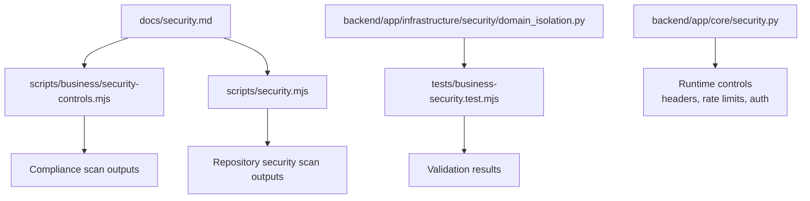
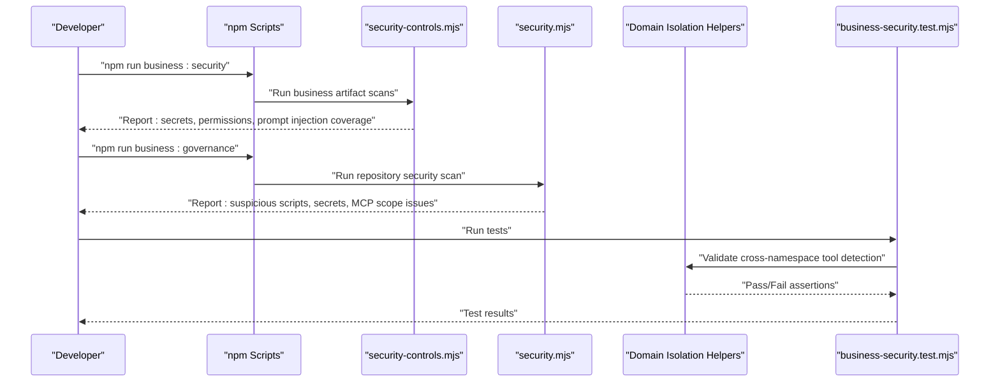
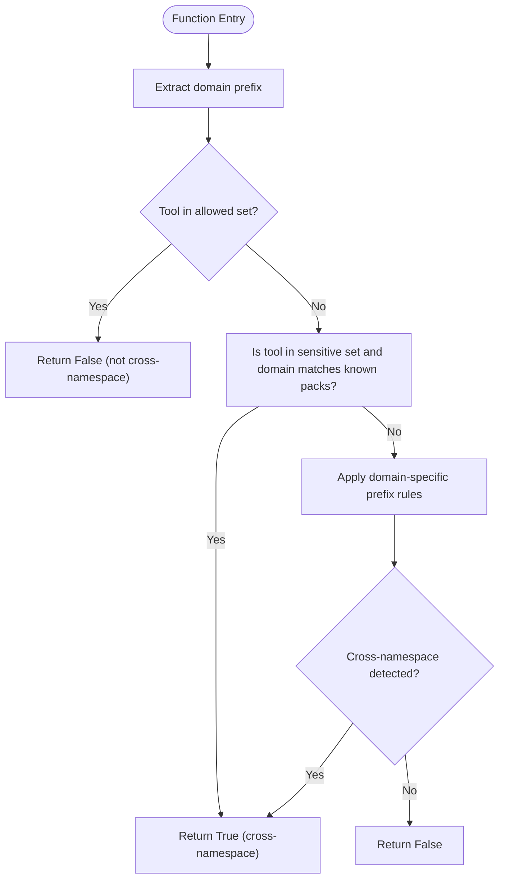
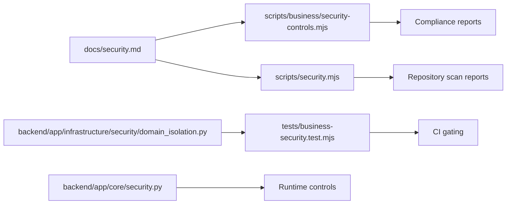

# Security Scoring & Validation

<cite>
**Referenced Files in This Document**
- [security.md](file://docs/security.md)
- [domain_isolation.py](file://backend/app/infrastructure/security/domain_isolation.py)
- [security.py](file://backend/app/core/security.py)
- [business-security.test.mjs](file://tests/business-security.test.mjs)
- [security-controls.mjs](file://scripts/business/security-controls.mjs)
- [security.mjs](file://scripts/security.mjs)
</cite>

## Table of Contents
1. [Introduction](#introduction)
2. [Project Structure](#project-structure)
3. [Core Components](#core-components)
4. [Architecture Overview](#architecture-overview)
5. [Detailed Component Analysis](#detailed-component-analysis)
6. [Dependency Analysis](#dependency-analysis)
7. [Performance Considerations](#performance-considerations)
8. [Troubleshooting Guide](#troubleshooting-guide)
9. [Conclusion](#conclusion)
10. [Appendices](#appendices)

## Introduction
This document explains the security scoring and validation framework implemented in the repository, focusing on risk tier assessment, security control evaluation, and compliance validation processes. It documents how automated checks enforce least privilege, detect cross-namespace tool usage, validate secrets and permissions, and integrate with governance workflows. The guidance includes examples for configuring security policies, running compliance scans, and interpreting reports, as well as integration points with governance frameworks and regulatory requirements.

## Project Structure
Security-related capabilities are distributed across documentation, backend infrastructure helpers, core authentication exports, scripts for scanning and validation, and tests that exercise business security rules.

**Diagram sources**
- [security.md:1-33](file://docs/security.md#L1-L33)
- [security-controls.mjs](file://scripts/business/security-controls.mjs)
- [security.mjs](file://scripts/security.mjs)
- [domain_isolation.py:1-77](file://backend/app/infrastructure/security/domain_isolation.py#L1-L77)
- [security.py:1-4](file://backend/app/core/security.py#L1-L4)
- [business-security.test.mjs](file://tests/business-security.test.mjs)

**Section sources**
- [security.md:1-33](file://docs/security.md#L1-L33)

## Core Components
- Business security controls: Automated scanning for secrets, overly broad MCP access, and policy enforcement for high-risk steps and human gates.
- Cross-pack isolation helpers: Pure functions to detect cross-namespace tool usage and assert allow-list immutability.
- Runtime security controls: Authentication, headers, rate limiting, fail-closed adapters, durable audit effects, memory scopes, and provenance.
- Compliance scanning scripts: Commands to run business and repository-level security scans.
- Tests: Validate business security rules and isolation logic.

Key responsibilities:
- Risk tier assessment: Use domain prefixing and tool namespace checks to classify potential cross-namespace or sensitive tool usage.
- Security control evaluation: Enforce least privilege by default, block wildcard scopes, and require human gates for irreversible actions.
- Compliance validation: Run automated scans and produce reports for artifacts and runtime behavior.

**Section sources**
- [security.md:1-33](file://docs/security.md#L1-L33)
- [domain_isolation.py:1-77](file://backend/app/infrastructure/security/domain_isolation.py#L1-L77)
- [security.py:1-4](file://backend/app/core/security.py#L1-L4)
- [business-security.test.mjs](file://tests/business-security.test.mjs)

## Architecture Overview
The security scoring and validation architecture combines static analysis (scripts), runtime enforcement (backend helpers and core security), and test-driven validation.

**Diagram sources**
- [security.md:27-33](file://docs/security.md#L27-L33)
- [security-controls.mjs](file://scripts/business/security-controls.mjs)
- [security.mjs](file://scripts/security.mjs)
- [domain_isolation.py:1-77](file://backend/app/infrastructure/security/domain_isolation.py#L1-L77)
- [business-security.test.mjs](file://tests/business-security.test.mjs)

## Detailed Component Analysis

### Cross-Pack Isolation and Risk Tier Assessment
Cross-pack isolation helpers provide deterministic checks for risky tool usage across domains. They support:
- Domain prefix extraction from agent identifiers or explicit domain IDs.
- Detection of cross-namespace tool references based on known domains and sensitive tool sets.
- Allow-list equality checks to ensure injection does not expand tool permissions.

**Diagram sources**
- [domain_isolation.py:31-67](file://backend/app/infrastructure/security/domain_isolation.py#L31-L67)

Operational implications:
- Risk tier classification: Tools flagged as cross-namespace may elevate risk tiers for workflow steps.
- Policy enforcement: Require explicit allow-list membership before granting sensitive tools to non-platform domains.
- Immutability guard: Ensure allow-lists cannot be expanded via injection.

**Section sources**
- [domain_isolation.py:1-77](file://backend/app/infrastructure/security/domain_isolation.py#L1-L77)

### Business Security Controls and Compliance Scanning
Business security controls automate checks against common risks:
- Secret detection in business artifacts.
- Tool permission validation ensuring least privilege and avoiding wildcard scopes.
- Prompt-injection coverage including indirect scenarios.
- Human gates for high-risk or irreversible steps.
- Sandbox-only evolution proposals with rollback plans.
- Frontend is not authority; backend RBAC, gates, and audit remain final.

Compliance commands:
- npm run business:security
- npm run business:governance

These commands orchestrate scanning and reporting for artifacts and repository-level security posture.

**Section sources**
- [security.md:1-33](file://docs/security.md#L1-L33)

### Runtime Security Controls
Runtime controls shipped with the platform include:
- PBKDF2 password authentication; static tokens for smoke testing only.
- Request IDs, structured error envelopes, and rate limits on sensitive routes.
- Security headers and CORS configuration on FastAPI.
- Tool adapters failing closed with durable tool_effects for audit.
- Memory scopes and provenance on high-impact writes to defend against poisoning.

Authentication export:
- Core security module exposes bearer token authentication helper used by API layers.

**Section sources**
- [security.md:15-26](file://docs/security.md#L15-L26)
- [security.py:1-4](file://backend/app/core/security.py#L1-L4)

### Automated Validation Checks and Test Coverage
Automated validation exercises business security rules and isolation logic:
- Tests validate cross-namespace tool detection and allow-list immutability.
- Results feed into CI pipelines to gate releases when violations are detected.

Integration points:
- Tests call isolation helpers to assert expected behavior under various inputs.
- Reports produced by scanning scripts can be consumed by dashboards or alerting systems.

**Section sources**
- [business-security.test.mjs](file://tests/business-security.test.mjs)
- [domain_isolation.py:70-77](file://backend/app/infrastructure/security/domain_isolation.py#L70-L77)

## Dependency Analysis
The following diagram shows key dependencies among security components and scripts.

**Diagram sources**
- [security.md:1-33](file://docs/security.md#L1-L33)
- [security-controls.mjs](file://scripts/business/security-controls.mjs)
- [security.mjs](file://scripts/security.mjs)
- [domain_isolation.py:1-77](file://backend/app/infrastructure/security/domain_isolation.py#L1-L77)
- [security.py:1-4](file://backend/app/core/security.py#L1-L4)
- [business-security.test.mjs](file://tests/business-security.test.mjs)

**Section sources**
- [security.md:1-33](file://docs/security.md#L1-L33)
- [domain_isolation.py:1-77](file://backend/app/infrastructure/security/domain_isolation.py#L1-L77)
- [security.py:1-4](file://backend/app/core/security.py#L1-L4)
- [business-security.test.mjs](file://tests/business-security.test.mjs)

## Performance Considerations
- Keep allow-list checks minimal and order-insensitive to avoid overhead during hot paths.
- Prefer immutable snapshots of tool lists to reduce repeated normalization costs.
- Cache domain prefix computations where appropriate to minimize string operations.
- Ensure scanning scripts operate incrementally to reduce CI times.

[No sources needed since this section provides general guidance]

## Troubleshooting Guide
Common issues and resolutions:
- Cross-namespace tool usage detected: Review allow-list membership and restrict tool exposure to the correct domain.
- Secrets found in business artifacts: Remove secrets and rotate credentials; update scanning thresholds if necessary.
- Overly broad MCP scopes: Narrow permissions to specific resources and avoid wildcards.
- Missing human gates for irreversible steps: Add approval gates in workflow definitions.
- Rate limit errors on sensitive routes: Adjust thresholds or investigate legitimate traffic spikes.

**Section sources**
- [security.md:5-26](file://docs/security.md#L5-L26)
- [domain_isolation.py:43-67](file://backend/app/infrastructure/security/domain_isolation.py#L43-L67)

## Conclusion
The repository implements a comprehensive security scoring and validation framework combining static scanning, runtime enforcement, and test-driven validation. Cross-pack isolation helpers enable precise risk tier assessments, while business security controls and compliance scans enforce least privilege, prompt injection defenses, and human oversight. Integrating these components into CI/CD ensures continuous compliance and reduces exposure to supply-chain and operational risks.

[No sources needed since this section summarizes without analyzing specific files]

## Appendices

### Configuring Security Policies
- Define tool permissions using least privilege principles; avoid wildcard scopes.
- Configure human gates for high-risk or irreversible workflow steps.
- Maintain sandbox-only evolution proposals with documented rollback plans.
- Ensure frontend UI reflects backend RBAC decisions; do not rely on client-side enforcement.

**Section sources**
- [security.md:5-14](file://docs/security.md#L5-L14)

### Running Compliance Scans
- Execute business artifact scans: npm run business:security
- Execute repository-level scans: npm run business:governance
- Review generated reports for findings and remediation steps.

**Section sources**
- [security.md:27-33](file://docs/security.md#L27-L33)

### Interpreting Security Reports
- Identify secret exposures and remove them from artifacts.
- Address overly broad MCP permissions by narrowing scopes.
- Verify prompt-injection coverage includes indirect scenarios.
- Confirm human gates exist for critical steps.
- Validate that tool adapters fail closed and durable audit effects are recorded.

**Section sources**
- [security.md:5-26](file://docs/security.md#L5-L26)

### Integration with Governance Frameworks and Regulatory Requirements
- Align tool permissions and human gates with organizational governance policies.
- Map risk tier classifications to regulatory requirements (e.g., data protection, auditability).
- Use durable tool_effects and memory provenance to satisfy audit and compliance obligations.
- Integrate scan outputs into governance dashboards and reporting pipelines.

**Section sources**
- [security.md:15-26](file://docs/security.md#L15-L26)