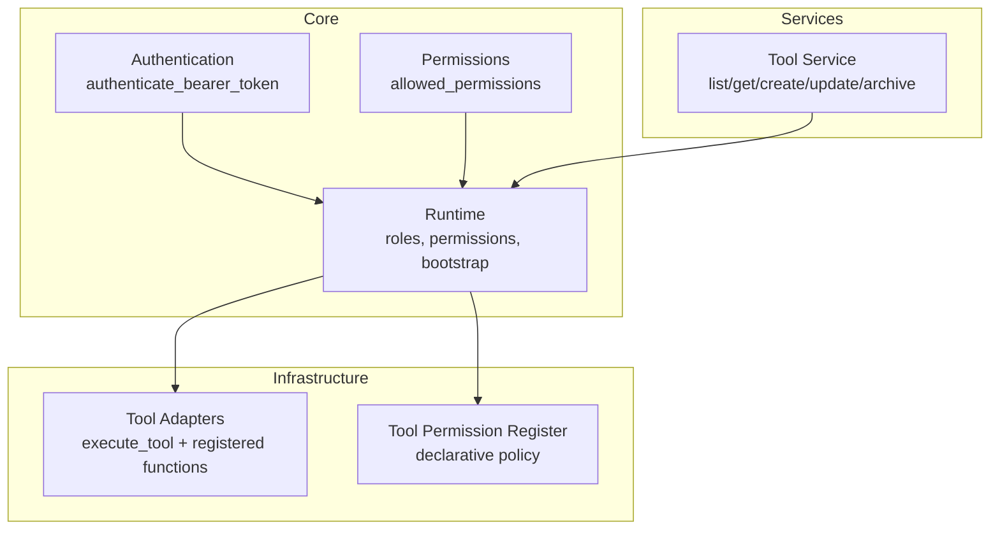
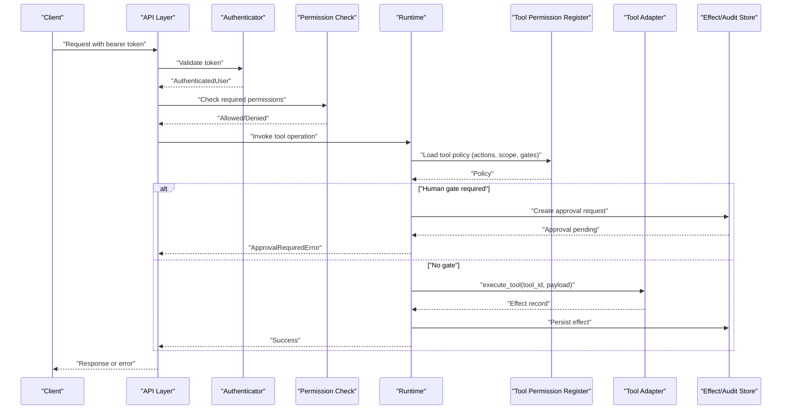
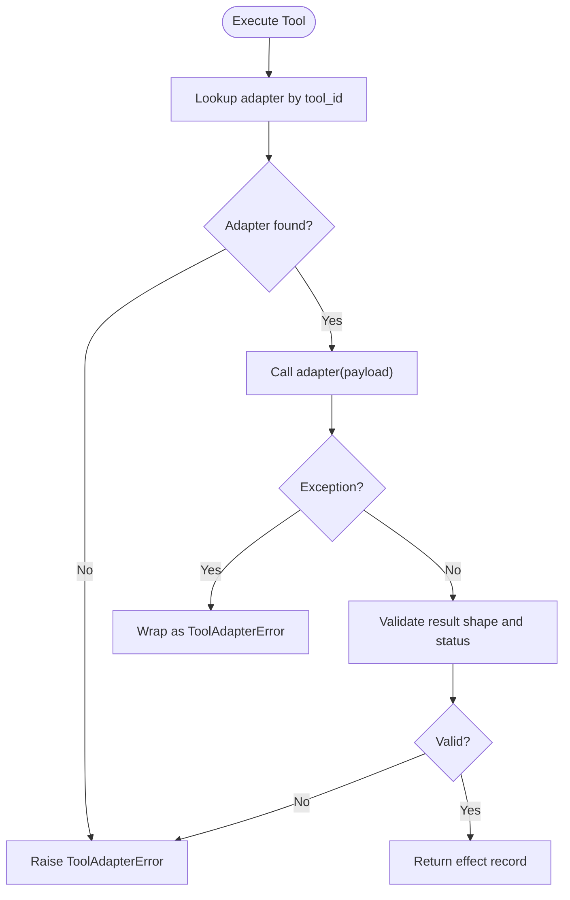
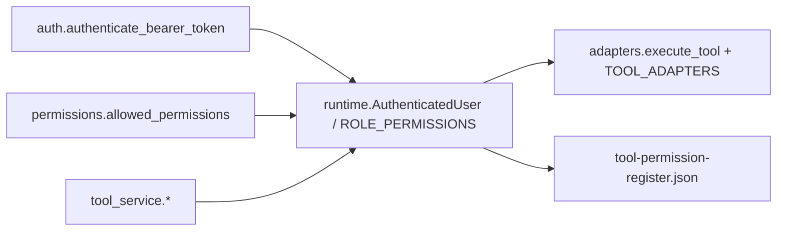

# Tool Misuse Prevention

<cite>
**Referenced Files in This Document**
- [runtime.py](file://backend/app/runtime.py)
- [auth.py](file://backend/app/core/auth.py)
- [permissions.py](file://backend/app/core/permissions.py)
- [security.py](file://backend/app/core/security.py)
- [adapters.py](file://backend/app/infrastructure/tools/adapters.py)
- [tools_init.py](file://backend/app/infrastructure/tools/__init__.py)
- [tool_service.py](file://backend/app/services/tool_service.py)
- [tool-permission-register.json](file://business/security/tool-permissions/tool-permission-register.json)
</cite>

## Table of Contents
1. [Introduction](#introduction)
2. [Project Structure](#project-structure)
3. [Core Components](#core-components)
4. [Architecture Overview](#architecture-overview)
5. [Detailed Component Analysis](#detailed-component-analysis)
6. [Dependency Analysis](#dependency-analysis)
7. [Performance Considerations](#performance-considerations)
8. [Troubleshooting Guide](#troubleshooting-guide)
9. [Conclusion](#conclusion)
10. [Appendices](#appendices)

## Introduction
This document explains how the system prevents tool misuse through permission-based access controls, security boundary enforcement, and unauthorized usage detection. It covers:
- Permission model and role-based access control (RBAC)
- Security boundaries around tool adapters and execution
- Unauthorized usage detection via effect records and audit logging
- Tool adapter security model, permission inheritance, and governance integration
- Examples for secure integrations, access controls, monitoring, approval gates, and policy enforcement

The goal is to provide both a conceptual overview and code-level guidance for building secure tool integrations that are auditable, governed, and resilient to misuse.

## Project Structure
Security-relevant components are organized across core runtime, authentication, permissions, services, and tool adapters:
- Core runtime defines roles, permissions, and bootstraps tools with risk levels and approval requirements
- Authentication validates bearer tokens and resolves authenticated users
- Permissions module exposes role-to-permission mapping helpers
- Services expose API-facing operations over runtime capabilities
- Tool adapters implement side-effecting actions and produce durable effect records
- A declarative tool permission register defines allowed actions, scopes, expiration, and human gate triggers

**Diagram sources**
- [auth.py:6-8](file://backend/app/core/auth.py#L6-L8)
- [permissions.py:4-6](file://backend/app/core/permissions.py#L4-L6)
- [runtime.py:140-222](file://backend/app/runtime.py#L140-L222)
- [tool_service.py:4-22](file://backend/app/services/tool_service.py#L4-L22)
- [adapters.py:143-177](file://backend/app/infrastructure/tools/adapters.py#L143-L177)
- [tool-permission-register.json:1-74](file://business/security/tool-permissions/tool-permission-register.json#L1-L74)

**Section sources**
- [runtime.py:140-222](file://backend/app/runtime.py#L140-L222)
- [auth.py:6-8](file://backend/app/core/auth.py#L6-L8)
- [permissions.py:4-6](file://backend/app/core/permissions.py#L4-L6)
- [tool_service.py:4-22](file://backend/app/services/tool_service.py#L4-L22)
- [adapters.py:143-177](file://backend/app/infrastructure/tools/adapters.py#L143-L177)
- [tool-permission-register.json:1-74](file://business/security/tool-permissions/tool-permission-register.json#L1-L74)

## Core Components
- Role-based permissions: The runtime defines roles and their permitted actions. Roles include owner, admin, manager, operator, reviewer, viewer, and service_account. Each role maps to a set of fine-grained permissions such as tools:read, workflows:execute, approvals:approve, etc.
- Authentication: Bearer token authentication resolves an authenticated user context used throughout the system.
- Tool registry and risk: Tools are seeded from a declarative permission register and enriched with risk levels, required permissions, approval requirements, timeouts, retry policies, allowed actions, and scope.
- Tool execution and effects: Adapters execute tool actions and return structured effect records with identifiers, inputs, results, and timestamps. These records enable auditing and misuse detection.
- Services: Tool service methods delegate to runtime for listing, retrieving, creating, updating, and archiving tools under authorization checks.

Key implementation anchors:
- Roles and permissions map
- AuthenticatedUser dataclass
- Tool registration and enrichment
- Adapter execution and error handling
- Effect record structure

**Section sources**
- [runtime.py:131-222](file://backend/app/runtime.py#L131-L222)
- [runtime.py:466-517](file://backend/app/runtime.py#L466-L517)
- [adapters.py:18-27](file://backend/app/infrastructure/tools/adapters.py#L18-L27)
- [adapters.py:164-177](file://backend/app/infrastructure/tools/adapters.py#L164-L177)
- [tool_service.py:4-22](file://backend/app/services/tool_service.py#L4-L22)

## Architecture Overview
The security architecture enforces boundaries at multiple layers:
- Identity and session: Bearer tokens authenticate requests and resolve user identity and role.
- Authorization: RBAC checks ensure callers have required permissions before invoking tool-related operations.
- Policy-driven tool configuration: Declarative permission register constrains allowed actions, scopes, expiration, and human gate triggers per tool.
- Execution isolation: Tool adapters encapsulate side effects and produce immutable effect records for auditability.
- Governance integration: Risk tiers and human gates influence workflow steps and approval flows.

**Diagram sources**
- [auth.py:6-8](file://backend/app/core/auth.py#L6-L8)
- [permissions.py:4-6](file://backend/app/core/permissions.py#L4-L6)
- [runtime.py:466-517](file://backend/app/runtime.py#L466-L517)
- [adapters.py:164-177](file://backend/app/infrastructure/tools/adapters.py#L164-L177)
- [tool-permission-register.json:1-74](file://business/security/tool-permissions/tool-permission-register.json#L1-L74)

## Detailed Component Analysis

### Authentication and Session Binding
- Bearer token authentication resolves an authenticated user object containing identity, organization, email, name, and role.
- The security module re-exports the authenticator for use by API layers and middleware.

Operational implications:
- All subsequent authorization decisions rely on the resolved role and organization context.
- Tokens must be validated before any tool-related operation proceeds.

**Section sources**
- [auth.py:6-8](file://backend/app/core/auth.py#L6-L8)
- [security.py:1-4](file://backend/app/core/security.py#L1-L4)

### Role-Based Access Control (RBAC)
- Roles define sets of permissions covering resources like agents, tools, workflows, approvals, governance, knowledge, memory, evaluations, audit, processes, and settings.
- The permissions helper returns the allowed permission set for a given role.

Security outcomes:
- Least privilege enforcement by restricting tool read/write/execute based on role.
- Clear separation between administrative, operational, review, and service account capabilities.

**Section sources**
- [runtime.py:140-222](file://backend/app/runtime.py#L140-L222)
- [permissions.py:4-6](file://backend/app/core/permissions.py#L4-L6)

### Tool Registry and Policy-Driven Configuration
- Tools are seeded from a declarative permission register that specifies allowed actions, scope, expiration, and human gate triggers.
- The runtime enriches each tool with metadata including risk level, required permissions, approval requirement, timeout, retry policy, enabled status, allowed actions, and scope.

Security outcomes:
- Centralized policy source of truth for tool capabilities and constraints.
- Consistent application of risk tiers and human gates across all tool invocations.

**Section sources**
- [tool-permission-register.json:1-74](file://business/security/tool-permissions/tool-permission-register.json#L1-L74)
- [runtime.py:466-517](file://backend/app/runtime.py#L466-L517)

### Tool Adapter Security Model and Execution
- Adapters implement specific tool actions and return standardized effect records containing id, tool_id, action, status, input, result, and created_at.
- The executor validates adapter presence, invokes it, normalizes errors, and ensures returned results conform to expected structure.

Security outcomes:
- Side effects are isolated within adapters and always produce durable effect records.
- Invalid or unexpected adapter behavior is detected and surfaced as explicit errors.

**Diagram sources**
- [adapters.py:164-177](file://backend/app/infrastructure/tools/adapters.py#L164-L177)

**Section sources**
- [adapters.py:18-27](file://backend/app/infrastructure/tools/adapters.py#L18-L27)
- [adapters.py:164-177](file://backend/app/infrastructure/tools/adapters.py#L164-L177)

### Unauthorized Usage Detection and Audit Logging
- Every successful adapter invocation produces an effect record with unique identifiers, inputs, outputs, and timestamps.
- These records can be persisted and analyzed to detect anomalies, unauthorized patterns, or policy violations.
- Human gates generate approval artifacts when required by tool policy, enabling governance oversight.

Detection strategies:
- Monitor effect records for unexpected actions or out-of-scope payloads.
- Correlate tool usage with user roles and organizational context.
- Alert on repeated failures or invalid adapter responses.

**Section sources**
- [adapters.py:18-27](file://backend/app/infrastructure/tools/adapters.py#L18-L27)
- [runtime.py:466-517](file://backend/app/runtime.py#L466-L517)

### Integration with Approval Gates and Governance Policies
- Tools may require human approval for certain actions; the runtime marks these as approval-required based on the permission register.
- Workflow governance policies reference risk tiers and human gate steps, ensuring high-risk operations receive appropriate oversight.

Integration points:
- Tool policy includes requires_human_gate_for lists mapped to approval workflows.
- Risk tiers inform evaluation and gating policies applied during workflow execution.

**Section sources**
- [tool-permission-register.json:1-74](file://business/security/tool-permissions/tool-permission-register.json#L1-L74)
- [runtime.py:466-517](file://backend/app/runtime.py#L466-L517)

### Example: Creating a Secure Tool Integration
Steps to integrate a new tool securely:
1. Define tool policy in the permission register:
   - Specify allowed_actions, scope, expires_after_minutes, and requires_human_gate_for.
2. Ensure the runtime seeds the tool with correct risk_level, required_permissions, approval_requirement, timeout, retry_policy, enabled, allowed_actions, and scope.
3. Implement an adapter function that:
   - Accepts a payload dict.
   - Returns a standardized effect record with id, tool_id, action, status, input, result, and created_at.
4. Register the adapter in the adapter registry.
5. Enforce RBAC so only authorized roles can invoke the tool’s actions.
6. Monitor effect records for misuse and adjust policy as needed.

References:
- Permission register schema and entries
- Runtime tool seeding logic
- Adapter contract and validation

**Section sources**
- [tool-permission-register.json:1-74](file://business/security/tool-permissions/tool-permission-register.json#L1-L74)
- [runtime.py:466-517](file://backend/app/runtime.py#L466-L517)
- [adapters.py:164-177](file://backend/app/infrastructure/tools/adapters.py#L164-L177)

### Example: Implementing Access Controls
- Use the permissions helper to determine allowed permissions for a user’s role.
- Gate tool operations by checking required permissions (e.g., tools:create, tools:update, workflows:execute).
- Deny access with a clear permission_denied error when checks fail.

References:
- Role-to-permission mapping
- Permissions helper

**Section sources**
- [runtime.py:140-222](file://backend/app/runtime.py#L140-L222)
- [permissions.py:4-6](file://backend/app/core/permissions.py#L4-L6)

### Example: Monitoring Tool Usage Patterns
- Collect effect records for all tool executions.
- Analyze frequency, scope adherence, and action validity.
- Flag anomalies such as:
  - Actions outside declared allowed_actions
  - Payloads violating scope constraints
  - Repeated failures indicating misconfiguration or abuse

References:
- Effect record structure
- Adapter execution flow

**Section sources**
- [adapters.py:18-27](file://backend/app/infrastructure/tools/adapters.py#L18-L27)
- [adapters.py:164-177](file://backend/app/infrastructure/tools/adapters.py#L164-L177)

## Dependency Analysis
The following diagram shows key dependencies among authentication, permissions, runtime, services, and adapters:

**Diagram sources**
- [auth.py:6-8](file://backend/app/core/auth.py#L6-L8)
- [permissions.py:4-6](file://backend/app/core/permissions.py#L4-L6)
- [runtime.py:131-222](file://backend/app/runtime.py#L131-L222)
- [tool_service.py:4-22](file://backend/app/services/tool_service.py#L4-L22)
- [adapters.py:143-177](file://backend/app/infrastructure/tools/adapters.py#L143-L177)
- [tool-permission-register.json:1-74](file://business/security/tool-permissions/tool-permission-register.json#L1-L74)

**Section sources**
- [auth.py:6-8](file://backend/app/core/auth.py#L6-L8)
- [permissions.py:4-6](file://backend/app/core/permissions.py#L4-L6)
- [runtime.py:131-222](file://backend/app/runtime.py#L131-L222)
- [tool_service.py:4-22](file://backend/app/services/tool_service.py#L4-L22)
- [adapters.py:143-177](file://backend/app/infrastructure/tools/adapters.py#L143-L177)
- [tool-permission-register.json:1-74](file://business/security/tool-permissions/tool-permission-register.json#L1-L74)

## Performance Considerations
- Keep adapter implementations lightweight and deterministic to minimize latency.
- Avoid heavy I/O inside adapters; prefer asynchronous calls where possible.
- Cache frequently accessed policy data if needed, but ensure consistency with the central permission register.
- Monitor effect record volume and retention to prevent storage bloat.

[No sources needed since this section provides general guidance]

## Troubleshooting Guide
Common issues and resolutions:
- No adapter registered for tool:
  - Ensure the tool_id exists in the adapter registry and matches the policy entry.
- Adapter failed:
  - Inspect adapter exceptions and normalize errors into ToolAdapterError with clear messages.
- Invalid adapter result:
  - Verify the adapter returns a dict with status "ok" and a unique id field.
- Permission denied:
  - Confirm the caller’s role includes required permissions for the requested action.
- Approval required:
  - If the tool action requires human gate, create and track approval artifacts before proceeding.

**Section sources**
- [adapters.py:164-177](file://backend/app/infrastructure/tools/adapters.py#L164-L177)
- [runtime.py:107-129](file://backend/app/runtime.py#L107-L129)

## Conclusion
The system enforces robust tool misuse prevention through:
- Strong RBAC and permission checks
- Policy-driven tool configuration with risk tiers and human gates
- Isolated adapter execution producing durable effect records
- Comprehensive auditability and anomaly detection
- Clear integration points for governance and approval workflows

Adhering to these patterns ensures secure, auditable, and governable tool integrations suitable for production environments.

[No sources needed since this section summarizes without analyzing specific files]

## Appendices

### Appendix A: Key Data Models and Contracts
- AuthenticatedUser fields: id, organization_id, email, name, role
- Effect record fields: id, tool_id, action, status, input, result, created_at
- Tool policy fields: allowed_actions, scope, expires_after_minutes, requires_human_gate_for

**Section sources**
- [runtime.py:131-138](file://backend/app/runtime.py#L131-L138)
- [adapters.py:18-27](file://backend/app/infrastructure/tools/adapters.py#L18-L27)
- [tool-permission-register.json:1-74](file://business/security/tool-permissions/tool-permission-register.json#L1-L74)