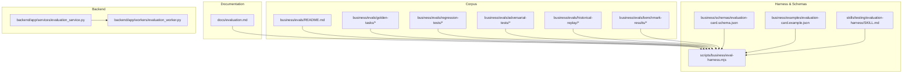
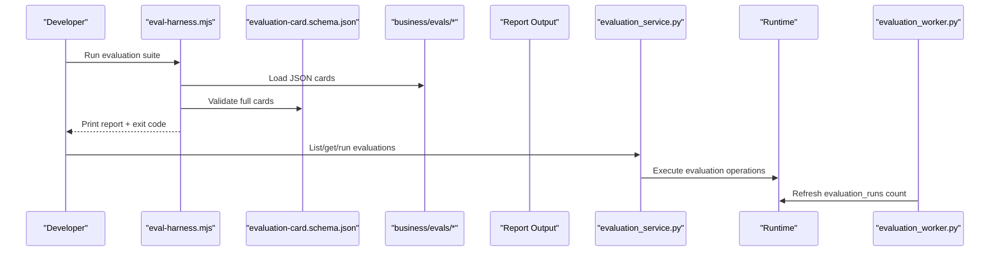
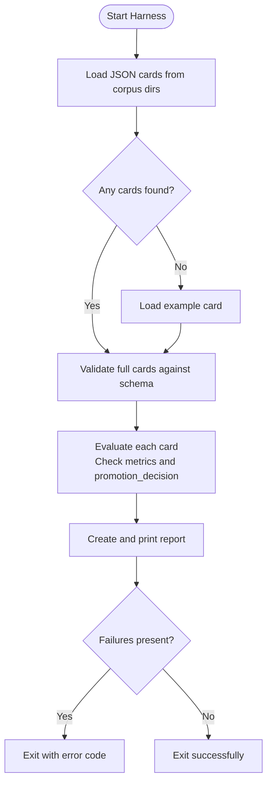
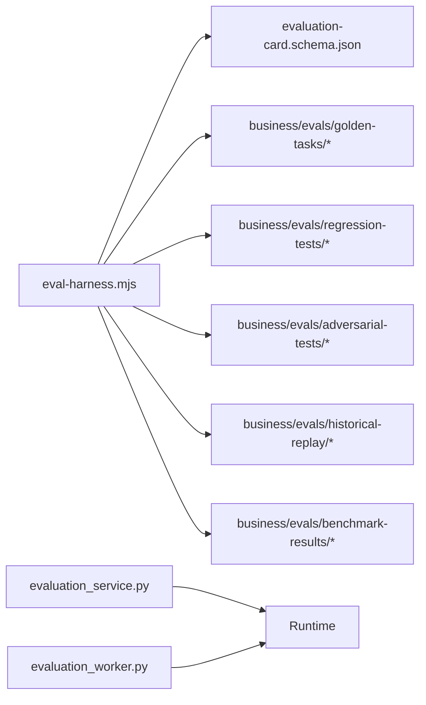

# Evaluation & Quality Assurance

<cite>
**Referenced Files in This Document**
- [evaluation.md](file://docs/evaluation.md)
- [eval-harness.mjs](file://scripts/business/eval-harness.mjs)
- [evaluation-card.schema.json](file://business/schemas/evaluation-card.schema.json)
- [evaluation-card.example.json](file://business/examples/evaluation-card.example.json)
- [README.md](file://business/evals/README.md)
- [SKILL.md](file://skills/testing/evaluation-harness/SKILL.md)
- [evaluation_service.py](file://backend/app/services/evaluation_service.py)
- [evaluation_worker.py](file://backend/app/workers/evaluation_worker.py)
</cite>

## Table of Contents
1. [Introduction](#introduction)
2. [Project Structure](#project-structure)
3. [Core Components](#core-components)
4. [Architecture Overview](#architecture-overview)
5. [Detailed Component Analysis](#detailed-component-analysis)
6. [Dependency Analysis](#dependency-analysis)
7. [Performance Considerations](#performance-considerations)
8. [Troubleshooting Guide](#troubleshooting-guide)
9. [Conclusion](#conclusion)
10. [Appendices](#appendices)

## Introduction
This document describes the evaluation and quality assurance framework for agents and workflows. It explains how to define golden tasks, run regression and adversarial tests, perform human review, and enforce quality gates. The system provides an evaluation harness that validates evaluation cards and corpus structure, a backend service layer to list and run evaluations, and a worker utility to refresh evaluation metadata. Importantly, promotion is never automatic; all promotions require manual decisions.

## Project Structure
The evaluation framework spans documentation, scripts, schemas, examples, skills, backend services, workers, and a curated corpus under business/evals.

**Diagram sources**
- [evaluation.md:1-37](file://docs/evaluation.md#L1-L37)
- [README.md:1-4](file://business/evals/README.md#L1-L4)
- [eval-harness.mjs:1-138](file://scripts/business/eval-harness.mjs#L1-L138)
- [evaluation-card.schema.json:1-121](file://business/schemas/evaluation-card.schema.json#L1-L121)
- [evaluation-card.example.json:1-27](file://business/examples/evaluation-card.example.json#L1-L27)
- [SKILL.md:1-11](file://skills/testing/evaluation-harness/SKILL.md#L1-L11)
- [evaluation_service.py:1-18](file://backend/app/services/evaluation_service.py#L1-L18)
- [evaluation_worker.py:1-6](file://backend/app/workers/evaluation_worker.py#L1-L6)

**Section sources**
- [evaluation.md:1-37](file://docs/evaluation.md#L1-L37)
- [README.md:1-4](file://business/evals/README.md#L1-L4)

## Core Components
- Evaluation Harness: Loads and validates evaluation cards from multiple corpus directories, enforces schema constraints for full cards, and prevents automatic promotion.
- Evaluation Card Schema: Defines required fields and metric ranges for structured evaluation results.
- Example Card: Provides a template for creating new evaluation artifacts.
- Backend Service Layer: Exposes endpoints to list, fetch, and run evaluations via runtime integration.
- Worker Utility: Refreshes evaluation run counts by querying the runtime collection.
- Skill Definition: Documents the purpose and scope of the evaluation harness skill.

Key responsibilities:
- Corpus ingestion and validation
- Metric presence checks and range enforcement
- Promotion policy enforcement (manual only)
- Reporting and exit codes for CI/CD
- Backend API surface for evaluation operations

**Section sources**
- [eval-harness.mjs:1-138](file://scripts/business/eval-harness.mjs#L1-L138)
- [evaluation-card.schema.json:1-121](file://business/schemas/evaluation-card.schema.json#L1-L121)
- [evaluation-card.example.json:1-27](file://business/examples/evaluation-card.example.json#L1-L27)
- [evaluation_service.py:1-18](file://backend/app/services/evaluation_service.py#L1-L18)
- [evaluation_worker.py:1-6](file://backend/app/workers/evaluation_worker.py#L1-L6)
- [SKILL.md:1-11](file://skills/testing/evaluation-harness/SKILL.md#L1-L11)

## Architecture Overview
The evaluation flow combines a CLI-driven harness with backend services and a worker process. The harness reads corpus files, validates them against the schema, and produces reports. The backend exposes APIs to manage evaluations and runs, while the worker updates evaluation metadata.

**Diagram sources**
- [eval-harness.mjs:1-138](file://scripts/business/eval-harness.mjs#L1-L138)
- [evaluation-card.schema.json:1-121](file://business/schemas/evaluation-card.schema.json#L1-L121)
- [evaluation_service.py:1-18](file://backend/app/services/evaluation_service.py#L1-L18)
- [evaluation_worker.py:1-6](file://backend/app/workers/evaluation_worker.py#L1-L6)

## Detailed Component Analysis

### Golden Task Definitions
Golden tasks are curated cases representing expected behavior for primary workflows. They reside under the golden-tasks directory and are consumed by the harness during evaluation runs. Each card should include metrics and a non-promoting decision.

Guidelines:
- Include comprehensive metrics per schema requirements.
- Use clear target identifiers tied to workflow versions or IDs.
- Provide provenance references to source materials.
- Set promotion_decision to a non-promoting value.

**Section sources**
- [evaluation.md:1-37](file://docs/evaluation.md#L1-L37)
- [README.md:1-4](file://business/evals/README.md#L1-L4)
- [evaluation-card.schema.json:1-121](file://business/schemas/evaluation-card.schema.json#L1-L121)
- [evaluation-card.example.json:1-27](file://business/examples/evaluation-card.example.json#L1-L27)

### Regression Testing
Regression tests ensure known-good behavior remains intact across changes. Place regression test cards under regression-tests. The harness will validate their structure and metrics and report failures if thresholds or expectations are not met.

Best practices:
- Reuse stable fixtures and historical replay data where applicable.
- Keep assertions focused on critical paths and compliance rules.
- Track regressions with detailed provenance and reviewer attribution.

**Section sources**
- [evaluation.md:1-37](file://docs/evaluation.md#L1-L37)
- [eval-harness.mjs:1-138](file://scripts/business/eval-harness.mjs#L1-L138)

### Adversarial Validation Strategies
Adversarial tests probe prompt injection, tool misuse, and boundary abuse. Store these under adversarial-tests. The harness enforces that no card auto-promotes, ensuring safety-first evaluation outcomes.

Recommendations:
- Cover edge inputs, malformed prompts, and unexpected tool calls.
- Measure hallucination_rate and unauthorized_tool_attempts closely.
- Pair with retrieval fixtures to validate safe knowledge access.

**Section sources**
- [evaluation.md:1-37](file://docs/evaluation.md#L1-L37)
- [eval-harness.mjs:1-138](file://scripts/business/eval-harness.mjs#L1-L138)

### Evaluation Harness for Automated Testing
The harness orchestrates loading, validating, and reporting evaluation cards. It supports dry-run mode and ensures that any attempt to auto-promote fails fast.

Highlights:
- Scans benchmark-results, golden-tasks, regression-tests, adversarial-tests, and historical-replay.
- Validates full evaluation cards against the schema.
- Produces a structured report and sets exit codes for CI/CD.

**Diagram sources**
- [eval-harness.mjs:1-138](file://scripts/business/eval-harness.mjs#L1-L138)

**Section sources**
- [eval-harness.mjs:1-138](file://scripts/business/eval-harness.mjs#L1-L138)
- [SKILL.md:1-11](file://skills/testing/evaluation-harness/SKILL.md#L1-L11)

### Performance Benchmarking and Metrics
Benchmark results are stored under benchmark-results. The evaluation card schema defines required metrics including quality_score, compliance_pass_rate, average_cycle_time_minutes, escalation_rate, hallucination_rate, unauthorized_tool_attempts, and cost_per_case_usd. These metrics enable consistent scoring and comparison across runs.

Scoring mechanisms:
- Use normalized scores between 0 and 1 for rates and quality.
- Track cycle time and cost per case for operational efficiency.
- Enforce zero tolerance for unauthorized tool attempts in safety-critical contexts.

**Section sources**
- [evaluation-card.schema.json:1-121](file://business/schemas/evaluation-card.schema.json#L1-L121)
- [evaluation-card.example.json:1-27](file://business/examples/evaluation-card.example.json#L1-L27)

### Human Review Workflows and Approval Processes
Promotion stays manual. The harness rejects any card with automatic promotion. Backend APIs support listing and running evaluations, enabling operators to review results before approving changes.

Quality gates:
- Require a valid promotion_decision that is not promote.
- Ensure reviewer attribution and provenance are complete.
- Integrate with evolution sandbox scoring and canary stages prior to production.

**Section sources**
- [evaluation.md:1-37](file://docs/evaluation.md#L1-L37)
- [eval-harness.mjs:1-138](file://scripts/business/eval-harness.mjs#L1-L138)
- [evaluation_service.py:1-18](file://backend/app/services/evaluation_service.py#L1-L18)

### Examples: Creating Evaluation Suites, Running Tests, Interpreting Results
Creating suites:
- Add cards under appropriate directories (golden-tasks, regression-tests, adversarial-tests, historical-replay).
- Follow the schema and example card structure for consistency.

Running tests:
- Use the harness entry point to execute evaluations.
- Support dry-run mode for pre-checks without altering state.

Interpreting results:
- Reports summarize status and failures per card.
- Exit codes indicate pass/fail for automation pipelines.
- Focus on metrics like hallucination_rate and unauthorized_tool_attempts for safety.

**Section sources**
- [evaluation.md:1-37](file://docs/evaluation.md#L1-L37)
- [eval-harness.mjs:1-138](file://scripts/business/eval-harness.mjs#L1-L138)
- [evaluation-card.schema.json:1-121](file://business/schemas/evaluation-card.schema.json#L1-L121)
- [evaluation-card.example.json:1-27](file://business/examples/evaluation-card.example.json#L1-L27)

## Dependency Analysis
The harness depends on schema definitions and corpus content. The backend service depends on runtime integrations, and the worker depends on runtime collections.

**Diagram sources**
- [eval-harness.mjs:1-138](file://scripts/business/eval-harness.mjs#L1-L138)
- [evaluation-card.schema.json:1-121](file://business/schemas/evaluation-card.schema.json#L1-L121)
- [evaluation_service.py:1-18](file://backend/app/services/evaluation_service.py#L1-L18)
- [evaluation_worker.py:1-6](file://backend/app/workers/evaluation_worker.py#L1-L6)

**Section sources**
- [eval-harness.mjs:1-138](file://scripts/business/eval-harness.mjs#L1-L138)
- [evaluation_service.py:1-18](file://backend/app/services/evaluation_service.py#L1-L18)
- [evaluation_worker.py:1-6](file://backend/app/workers/evaluation_worker.py#L1-L6)

## Performance Considerations
- Prefer batch loading of corpus files to minimize I/O overhead.
- Cache schema loads and reuse validation logic across cards.
- Limit heavy computations to dry-run modes when exploring large corpora.
- Monitor average_cycle_time_minutes and cost_per_case_usd to identify bottlenecks.

[No sources needed since this section provides general guidance]

## Troubleshooting Guide
Common issues and resolutions:
- Missing metrics: Ensure all required metrics are present in full evaluation cards.
- Automatic promotion detected: Remove promotion_decision set to promote; use manual_review or canary_only instead.
- Schema validation errors: Align card structure with the evaluation-card schema.
- Empty corpus: If no cards are found, the harness falls back to the example card; add real cards to proceed.

Operational tips:
- Use dry-run mode to preview failures without side effects.
- Inspect report output for per-card statuses and failure details.
- Verify provenance and reviewer fields for auditability.

**Section sources**
- [eval-harness.mjs:1-138](file://scripts/business/eval-harness.mjs#L1-L138)
- [evaluation-card.schema.json:1-121](file://business/schemas/evaluation-card.schema.json#L1-L121)
- [evaluation-card.example.json:1-27](file://business/examples/evaluation-card.example.json#L1-L27)

## Conclusion
The evaluation and quality assurance framework provides a robust foundation for assessing agent and workflow performance, safety, and compliance. By enforcing structured evaluation cards, preventing automatic promotion, and integrating with backend services and workers, teams can maintain high-quality standards through rigorous testing and human oversight.

[No sources needed since this section summarizes without analyzing specific files]

## Appendices

### Appendix A: Evaluation Card Fields Reference
- target: Identifier for the evaluated artifact.
- eval_type: Category of evaluation (e.g., workflow_regression).
- test_set: Name of the dataset or fixture used.
- metrics: Required metrics object with defined fields and ranges.
- result: Outcome of the evaluation (pass, fail, blocked).
- promotion_decision: Non-promoting decision values enforced by the harness.
- reviewer: Human responsible for reviewing the outcome.
- provenance: Source references, capture tool, and timestamp.

**Section sources**
- [evaluation-card.schema.json:1-121](file://business/schemas/evaluation-card.schema.json#L1-L121)
- [evaluation-card.example.json:1-27](file://business/examples/evaluation-card.example.json#L1-L27)