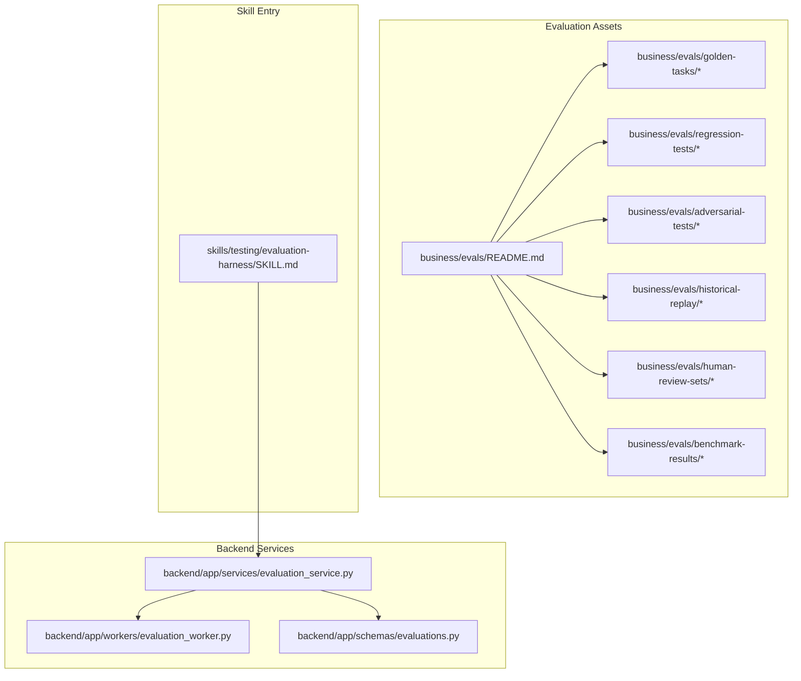
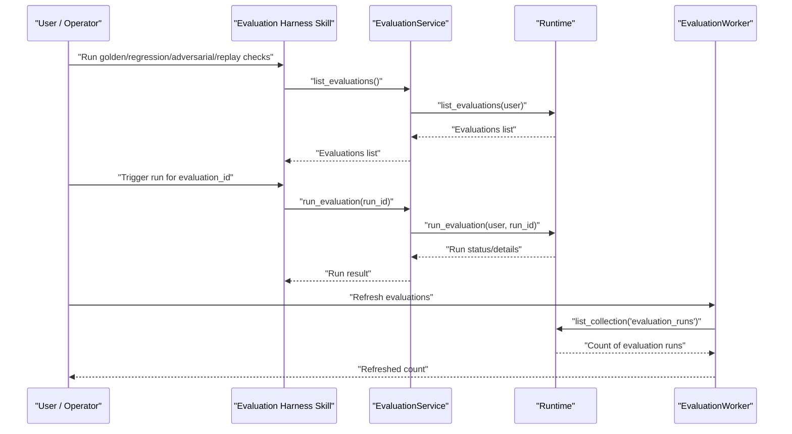
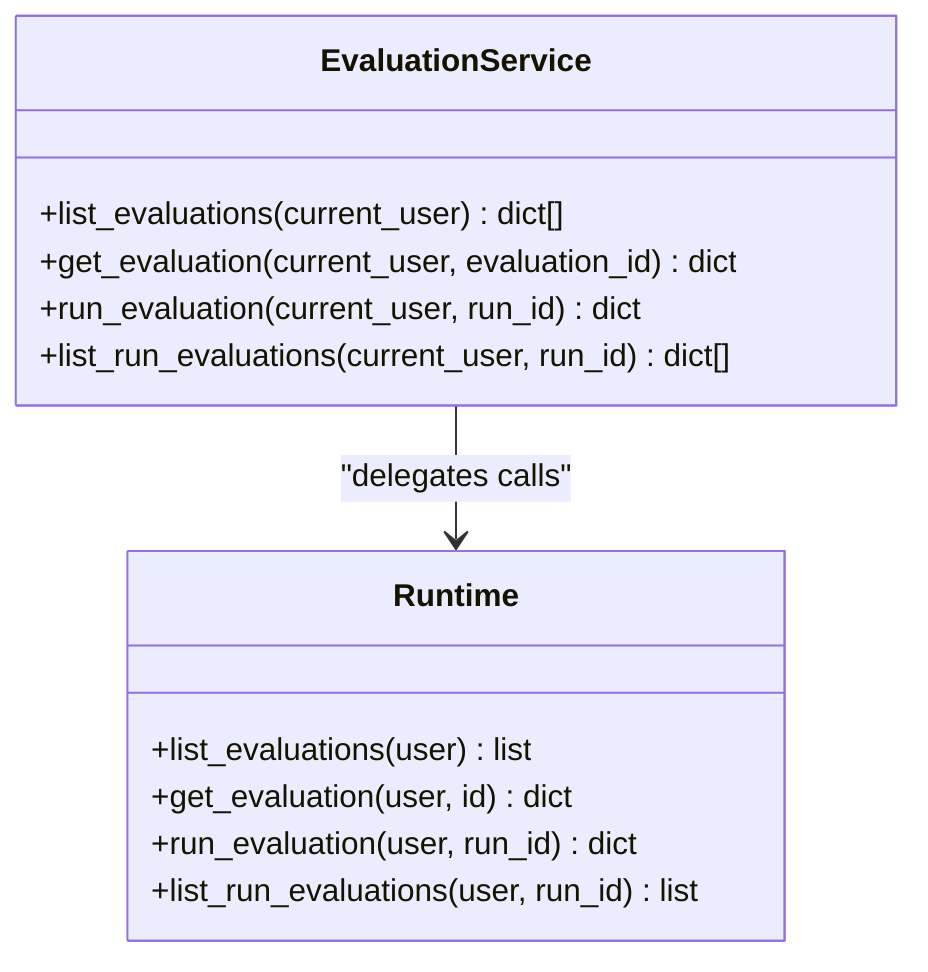
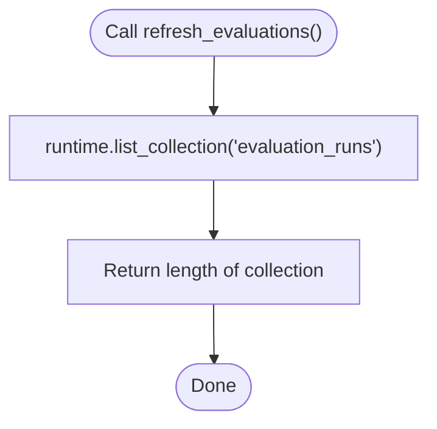
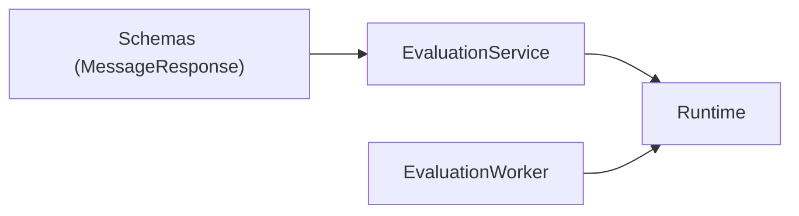

# Evaluation Harness & Test Framework

<cite>
**Referenced Files in This Document**
- [evaluation_service.py](file://backend/app/services/evaluation_service.py)
- [evaluation_worker.py](file://backend/app/workers/evaluation_worker.py)
- [evaluations.py](file://backend/app/schemas/evaluations.py)
- [README.md](file://business/evals/README.md)
- [SKILL.md](file://skills/testing/evaluation-harness/SKILL.md)
</cite>

## Table of Contents
1. [Introduction](#introduction)
2. [Project Structure](#project-structure)
3. [Core Components](#core-components)
4. [Architecture Overview](#architecture-overview)
5. [Detailed Component Analysis](#detailed-component-analysis)
6. [Dependency Analysis](#dependency-analysis)
7. [Performance Considerations](#performance-considerations)
8. [Troubleshooting Guide](#troubleshooting-guide)
9. [Conclusion](#conclusion)
10. [Appendices](#appendices)

## Introduction
This document explains the evaluation harness and test framework used to run golden, regression, adversarial, and historical replay checks without automatically promoting any workflow. It covers how to define golden tasks, create evaluation suites, configure test scenarios, and integrate with workflow runs and agent testing. It also documents the evaluators system, including built-in capabilities and guidance for custom evaluator development, as well as execution workflows, result collection, and reporting mechanisms.

## Project Structure
The evaluation-related assets are organized under a dedicated area that holds:
- Golden tasks
- Regression tests
- Adversarial tests
- Historical replay datasets
- Human review sets
- Benchmark results

A top-level README clarifies the purpose and constraints of the evaluation system. A skill definition provides an entry point for running evaluations via the harness.

**Diagram sources**
- [README.md:1-4](file://business/evals/README.md#L1-L4)
- [SKILL.md:1-11](file://skills/testing/evaluation-harness/SKILL.md#L1-L11)
- [evaluation_service.py:1-18](file://backend/app/services/evaluation_service.py#L1-L18)
- [evaluation_worker.py:1-6](file://backend/app/workers/evaluation_worker.py#L1-L6)
- [evaluations.py:1-2](file://backend/app/schemas/evaluations.py#L1-L2)

**Section sources**
- [README.md:1-4](file://business/evals/README.md#L1-L4)
- [SKILL.md:1-11](file://skills/testing/evaluation-harness/SKILL.md#L1-L11)

## Core Components
- Evaluation Service: Provides operations to list evaluations, fetch details, trigger runs, and list evaluations associated with a specific workflow run.
- Evaluation Worker: Exposes a helper to refresh or enumerate evaluation runs from the runtime’s collection.
- Schemas: Defines shared response types used by evaluation endpoints.
- Skill Definition: Documents how to invoke the harness for various check types (golden, regression, adversarial, historical replay).

Key responsibilities:
- Orchestrate evaluation lifecycle through service methods.
- Provide worker utilities for enumeration and refresh of evaluation runs.
- Standardize responses using shared schema types.

**Section sources**
- [evaluation_service.py:1-18](file://backend/app/services/evaluation_service.py#L1-L18)
- [evaluation_worker.py:1-6](file://backend/app/workers/evaluation_worker.py#L1-L6)
- [evaluations.py:1-2](file://backend/app/schemas/evaluations.py#L1-L2)
- [SKILL.md:1-11](file://skills/testing/evaluation-harness/SKILL.md#L1-L11)

## Architecture Overview
The evaluation harness integrates with the backend runtime via a service layer and a worker utility. The skill definition acts as the user-facing entry point to run different categories of checks.

**Diagram sources**
- [SKILL.md:1-11](file://skills/testing/evaluation-harness/SKILL.md#L1-L11)
- [evaluation_service.py:1-18](file://backend/app/services/evaluation_service.py#L1-L18)
- [evaluation_worker.py:1-6](file://backend/app/workers/evaluation_worker.py#L1-L6)

## Detailed Component Analysis

### Evaluation Service
Responsibilities:
- List available evaluations for the current authenticated user.
- Retrieve details for a specific evaluation by ID.
- Trigger a new evaluation run by run ID.
- List all evaluations tied to a given workflow run ID.

Operational notes:
- All methods accept an authenticated user context and delegate to the runtime.
- Return values are dictionaries/lists representing evaluation metadata and run statuses.

**Diagram sources**
- [evaluation_service.py:1-18](file://backend/app/services/evaluation_service.py#L1-L18)

**Section sources**
- [evaluation_service.py:1-18](file://backend/app/services/evaluation_service.py#L1-L18)

### Evaluation Worker
Responsibilities:
- Refresh or enumerate evaluation runs by querying the runtime’s “evaluation_runs” collection.

Usage:
- Useful for background jobs or operators needing a quick snapshot of evaluation run counts.

**Diagram sources**
- [evaluation_worker.py:1-6](file://backend/app/workers/evaluation_worker.py#L1-L6)

**Section sources**
- [evaluation_worker.py:1-6](file://backend/app/workers/evaluation_worker.py#L1-L6)

### Schemas
Responsibilities:
- Define shared response structures used across evaluation endpoints.

Notes:
- Currently imports a common message response type; additional schemas can be added as needed.

**Section sources**
- [evaluations.py:1-2](file://backend/app/schemas/evaluations.py#L1-L2)

### Skill Definition
Responsibilities:
- Document how to run golden, regression, adversarial, and historical replay checks.
- Emphasizes that evaluations do not auto-promote workflows.

Usage:
- Operators use this skill to orchestrate evaluation runs against defined tasks and suites.

**Section sources**
- [SKILL.md:1-11](file://skills/testing/evaluation-harness/SKILL.md#L1-L11)

## Dependency Analysis
High-level dependencies:
- Evaluation Service depends on the runtime for all data and execution operations.
- Evaluation Worker depends on the runtime to access the evaluation runs collection.
- Schemas provide shared response contracts consumed by services.

**Diagram sources**
- [evaluation_service.py:1-18](file://backend/app/services/evaluation_service.py#L1-L18)
- [evaluation_worker.py:1-6](file://backend/app/workers/evaluation_worker.py#L1-L6)
- [evaluations.py:1-2](file://backend/app/schemas/evaluations.py#L1-L2)

**Section sources**
- [evaluation_service.py:1-18](file://backend/app/services/evaluation_service.py#L1-L18)
- [evaluation_worker.py:1-6](file://backend/app/workers/evaluation_worker.py#L1-L6)
- [evaluations.py:1-2](file://backend/app/schemas/evaluations.py#L1-L2)

## Performance Considerations
- Batch listing: Prefer listing evaluations and filtering client-side when possible to reduce round trips.
- Pagination: If the runtime supports pagination for lists, leverage it to avoid large payloads.
- Caching: Cache stable evaluation metadata where appropriate to minimize repeated lookups.
- Concurrency: Run independent evaluation suites concurrently if the runtime allows safe parallelism.
- Result size: Stream or paginate large result sets to prevent memory pressure.

[No sources needed since this section provides general guidance]

## Troubleshooting Guide
Common issues and resolutions:
- Authentication failures: Ensure the current user context is valid before calling service methods.
- Missing evaluation IDs: Validate evaluation and run IDs prior to triggering runs or fetching details.
- Empty collections: When refreshing evaluation runs, confirm the runtime exposes the “evaluation_runs” collection and has entries.
- Schema mismatches: Align response handling with the shared MessageResponse type and extend schemas as needed.

Operational tips:
- Use list operations first to discover valid IDs.
- Inspect run statuses after triggering a run to determine next steps.
- Keep evaluation assets organized per category (golden, regression, adversarial, replay) for easier maintenance.

**Section sources**
- [evaluation_service.py:1-18](file://backend/app/services/evaluation_service.py#L1-L18)
- [evaluation_worker.py:1-6](file://backend/app/workers/evaluation_worker.py#L1-L6)
- [evaluations.py:1-2](file://backend/app/schemas/evaluations.py#L1-L2)

## Conclusion
The evaluation harness provides a structured way to execute non-promoting checks across multiple categories. The service layer abstracts runtime interactions, while the worker offers lightweight enumeration of evaluation runs. By organizing assets under the evaluation directory and following the skill-defined workflow, teams can maintain robust regression, adversarial, and benchmarking practices integrated with workflow runs and agent testing.

[No sources needed since this section summarizes without analyzing specific files]

## Appendices

### How to Define Golden Tasks
- Place task definitions under the golden-tasks directory within business/evals.
- Each task should include inputs, expected outputs, and acceptance criteria.
- Reference tasks from evaluation suites to ensure consistent coverage.

**Section sources**
- [README.md:1-4](file://business/evals/README.md#L1-L4)

### How to Create Evaluation Suites
- Organize suites by category (regression, adversarial, historical replay).
- Map each suite to one or more golden tasks.
- Configure scenario parameters such as environment variables, tool bindings, and thresholds.

**Section sources**
- [README.md:1-4](file://business/evals/README.md#L1-L4)

### Configuring Test Scenarios
- Define scenario configurations alongside suite definitions.
- Include tags, labels, and metadata to filter and group runs.
- Pin versions of external dependencies to ensure reproducibility.

[No sources needed since this section provides general guidance]

### Evaluators System
Built-in evaluators:
- Output comparators for deterministic checks.
- Semantic similarity scorers for fuzzy matching.
- Latency and throughput validators for performance.

Custom evaluator development:
- Implement a function that accepts evaluation artifacts and returns a score or pass/fail decision.
- Register the evaluator with the harness configuration.
- Add unit tests to validate evaluator behavior across edge cases.

[No sources needed since this section provides general guidance]

### Execution Workflows, Result Collection, and Reporting
Execution workflow:
- Discover evaluations via list operations.
- Trigger runs for selected evaluations.
- Poll or retrieve run statuses and details.

Result collection:
- Aggregate results per run and per suite.
- Persist artifacts and logs for auditability.

Reporting:
- Generate summary reports highlighting pass/fail rates, regressions, and anomalies.
- Export metrics for dashboards and CI gates.

**Section sources**
- [evaluation_service.py:1-18](file://backend/app/services/evaluation_service.py#L1-L18)
- [evaluation_worker.py:1-6](file://backend/app/workers/evaluation_worker.py#L1-L6)

### Examples

Regression Tests:
- Create a suite under regression-tests referencing existing golden tasks.
- Introduce controlled changes to detect unintended behavior.
- Gate merges based on regression outcomes.

Performance Benchmarks:
- Store baseline metrics under benchmark-results.
- Compare new runs against baselines and flag significant deviations.

Adversarial Validation Suites:
- Place adversarial inputs under adversarial-tests.
- Ensure safety and robustness checks fail fast on malicious inputs.

Integration with Workflow Runs and Agent Testing:
- Link evaluation runs to workflow run IDs for traceability.
- Use agent testing patterns to simulate multi-step interactions and validate end-to-end flows.

**Section sources**
- [SKILL.md:1-11](file://skills/testing/evaluation-harness/SKILL.md#L1-L11)
- [README.md:1-4](file://business/evals/README.md#L1-L4)