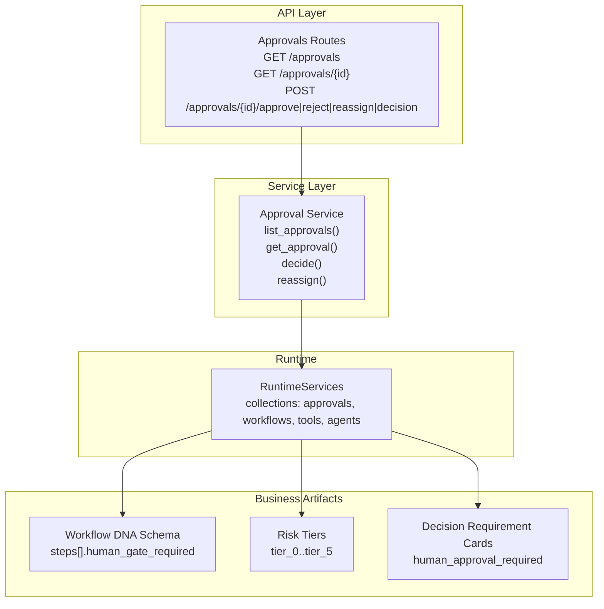
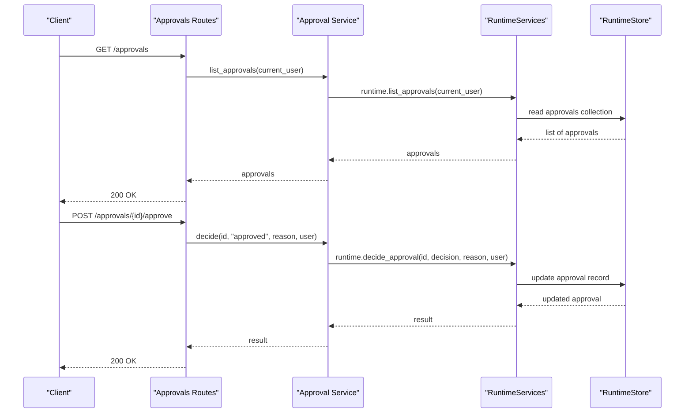
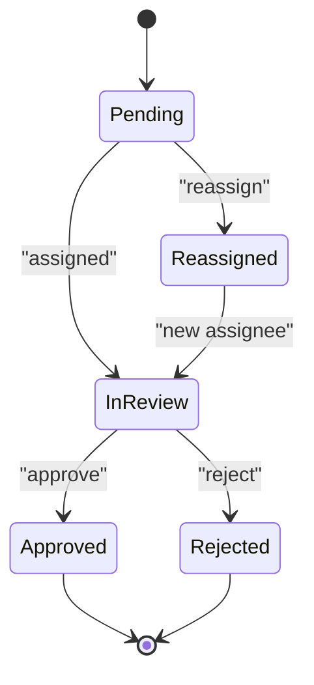
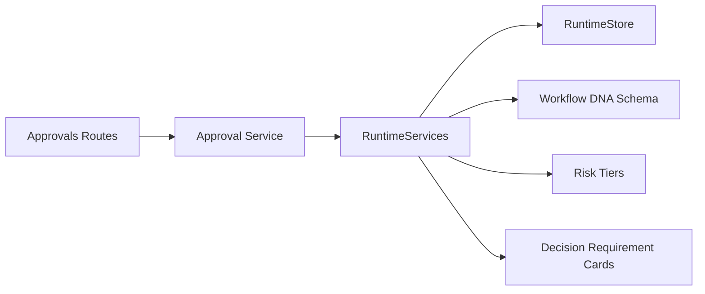

# Approval Gates Configuration

<cite>
**Referenced Files in This Document**
- [runtime.py](file://backend/app/runtime.py)
- [approval_service.py](file://backend/app/services/approval_service.py)
- [approvals.py (routes)](file://backend/app/api/v1/routes/approvals.py)
- [approvals.py (schemas)](file://backend/app/schemas/approvals.py)
- [workflow-dna.schema.json](file://business/schemas/workflow-dna.schema.json)
- [risk-tiers.json](file://business/governance/use-case-risk-tiering/risk-tiers.json)
- [decision-requirement-card.example.json](file://business/examples/decision-requirement-card.example.json)
</cite>

## Table of Contents
1. [Introduction](#introduction)
2. [Project Structure](#project-structure)
3. [Core Components](#core-components)
4. [Architecture Overview](#architecture-overview)
5. [Detailed Component Analysis](#detailed-component-analysis)
6. [Dependency Analysis](#dependency-analysis)
7. [Performance Considerations](#performance-considerations)
8. [Troubleshooting Guide](#troubleshooting-guide)
9. [Conclusion](#conclusion)
10. [Appendices](#appendices)

## Introduction
This document explains how to configure and operate approval gates within the workflow system. It covers:
- How gate conditions are defined via Workflow DNA and governance policies
- Where and how trigger points are set in workflows
- Gate types supported by the runtime (manual review, automated checks, multi-stage approvals)
- Lifecycle states, transition rules, and escalation mechanisms
- Practical examples for different risk levels and business processes
- Integration with Workflow DNA definitions and runtime execution

The goal is to enable operators and domain experts to design robust, auditable approval flows that align with organizational risk posture.

## Project Structure
Approval gates span several layers:
- API layer exposes endpoints to list, inspect, approve, reject, reassign, and decide on approvals
- Service layer orchestrates calls into the runtime
- Runtime manages state collections including approvals, workflows, tools, agents, and governance policies
- Business artifacts define Workflow DNA schemas, risk tiers, and decision requirement cards used to derive gate behavior

**Diagram sources**
- [approvals.py (routes):1-41](file://backend/app/api/v1/routes/approvals.py#L1-L41)
- [approval_service.py:1-18](file://backend/app/services/approval_service.py#L1-L18)
- [runtime.py:225-256](file://backend/app/runtime.py#L225-L256)
- [workflow-dna.schema.json:78-134](file://business/schemas/workflow-dna.schema.json#L78-L134)
- [risk-tiers.json:1-36](file://business/governance/use-case-risk-tiering/risk-tiers.json#L1-L36)
- [decision-requirement-card.example.json:1-52](file://business/examples/decision-requirement-card.example.json#L1-L52)

**Section sources**
- [approvals.py (routes):1-41](file://backend/app/api/v1/routes/approvals.py#L1-L41)
- [approval_service.py:1-18](file://backend/app/services/approval_service.py#L1-L18)
- [runtime.py:225-256](file://backend/app/runtime.py#L225-L256)
- [workflow-dna.schema.json:78-134](file://business/schemas/workflow-dna.schema.json#L78-L134)
- [risk-tiers.json:1-36](file://business/governance/use-case-risk-tiering/risk-tiers.json#L1-L36)
- [decision-requirement-card.example.json:1-52](file://business/examples/decision-requirement-card.example.json#L1-L52)

## Core Components
- Approvals API routes expose operations to manage pending approvals and decisions
- Approval service delegates to runtime for persistence and orchestration
- Runtime maintains the approvals collection and integrates with workflow/tool gating logic
- Workflow DNA schema defines where human gates are required per step
- Risk tiers define the overall risk posture and gate requirements
- Decision requirement cards provide contextual signals and expert cues to guide approvals

Key responsibilities:
- Define gate conditions at the workflow step level and tool-level approval flags
- Trigger gates during workflow execution when steps or tools require human approval
- Persist approval records and decisions in the runtime store
- Enforce permissions for listing, approving, rejecting, and reassigning approvals

**Section sources**
- [approvals.py (routes):1-41](file://backend/app/api/v1/routes/approvals.py#L1-L41)
- [approval_service.py:1-18](file://backend/app/services/approval_service.py#L1-L18)
- [runtime.py:225-256](file://backend/app/runtime.py#L225-L256)
- [workflow-dna.schema.json:78-134](file://business/schemas/workflow-dna.schema.json#L78-L134)
- [risk-tiers.json:1-36](file://business/governance/use-case-risk-tiering/risk-tiers.json#L1-L36)
- [decision-requirement-card.example.json:1-52](file://business/examples/decision-requirement-card.example.json#L1-L52)

## Architecture Overview
The approval gate architecture connects workflow definitions, runtime execution, and human-in-the-loop controls.

**Diagram sources**
- [approvals.py (routes):11-30](file://backend/app/api/v1/routes/approvals.py#L11-L30)
- [approval_service.py:4-13](file://backend/app/services/approval_service.py#L4-L13)
- [runtime.py:225-256](file://backend/app/runtime.py#L225-L256)

## Detailed Component Analysis

### Workflow DNA and Gate Conditions
Gate conditions are primarily declared in Workflow DNA:
- Each step can declare whether a human gate is required
- The runtime normalizes workflows and derives governance policy fields such as human_gate_steps based on step-level flags
- Tools can also carry an approval_requirement flag which influences whether execution requires a gate

Configuration guidance:
- Mark steps requiring human review by setting the human gate flag
- Align step-level gates with the workflow’s risk tier
- Use decision requirement cards to enrich context for reviewers

**Section sources**
- [workflow-dna.schema.json:78-134](file://business/schemas/workflow-dna.schema.json#L78-L134)
- [runtime.py:674-728](file://backend/app/runtime.py#L674-L728)
- [runtime.py:466-517](file://backend/app/runtime.py#L466-L517)

### Risk Tiers and Gate Types
Risk tiers define the overall control posture and gate expectations:
- Lower tiers may only observe or recommend
- Higher tiers require human gates before critical actions
- The runtime uses these tiers to determine enforcement and auditability

Gate types supported:
- Manual review: human approves/rejects decisions via the approvals API
- Automated checks: verification and guardrails defined in Workflow DNA
- Multi-stage approvals: multiple steps marked with human gates; each stage requires a decision

**Section sources**
- [risk-tiers.json:1-36](file://business/governance/use-case-risk-tiering/risk-tiers.json#L1-L36)
- [workflow-dna.schema.json:48-58](file://business/schemas/workflow-dna.schema.json#L48-L58)

### Approvals API and Service
The approvals API provides:
- Listing approvals
- Inspecting a specific approval
- Approving or rejecting with optional reasons
- Reassigning to another reviewer
- Submitting arbitrary decisions

The service layer delegates to runtime methods for persistence and orchestration.

Operational notes:
- Permissions are enforced at the route level
- Decisions persist in the runtime store and can be queried later for audit

**Section sources**
- [approvals.py (routes):1-41](file://backend/app/api/v1/routes/approvals.py#L1-L41)
- [approval_service.py:1-18](file://backend/app/services/approval_service.py#L1-L18)
- [approvals.py (schemas):1-2](file://backend/app/schemas/approvals.py#L1-L2)

### Runtime Integration and State Management
The runtime:
- Maintains collections including approvals, workflows, tools, and agents
- Normalizes workflow definitions from DNA artifacts into runnable forms
- Derives governance policy fields like human_gate_steps from step-level flags
- Persists changes atomically and supports JSON file or Postgres backends

Integration points:
- Workflow normalization computes human_gate_steps based on step flags
- Tool registration includes approval_requirement flags that influence gating
- Approvals collection stores pending and resolved approvals

**Section sources**
- [runtime.py:225-256](file://backend/app/runtime.py#L225-L256)
- [runtime.py:674-728](file://backend/app/runtime.py#L674-L728)
- [runtime.py:466-517](file://backend/app/runtime.py#L466-L517)

### Decision Requirement Cards
Decision requirement cards provide structured context for complex decisions:
- Identify decision points and expert sources
- Capture context signals and red flags
- Specify required evidence and exception paths
- Tie to risk tiers and human approval requirements

These cards inform reviewers and can be surfaced in UIs or notifications to streamline approvals.

**Section sources**
- [decision-requirement-card.example.json:1-52](file://business/examples/decision-requirement-card.example.json#L1-L52)

### Gate Lifecycle States and Transitions
Conceptual lifecycle:
- Pending: created when a workflow step or tool requires human approval
- In Review: assigned to a reviewer or group
- Approved: decision recorded; workflow proceeds
- Rejected: decision recorded; workflow halts or branches
- Reassigned: transferred to another reviewer while pending

Transition rules:
- Only users with appropriate permissions can approve/reject/reassign
- Reasons should be captured for auditability
- Reassignment preserves history and timestamps

[No sources needed since this diagram shows conceptual workflow, not actual code structure]

### Escalation Mechanisms
Escalation patterns:
- Auto-escalate after a timeout if no action is taken
- Escalate to a higher authority role upon rejection or repeated delays
- Route to specialized reviewers based on decision requirement card signals

Implementation guidance:
- Use workflow step next transitions to model escalation paths
- Leverage governance policies to enforce escalation thresholds
- Record all escalations in audit logs for traceability

[No sources needed since this section provides general guidance]

### Examples: Configuring Gates by Risk Level
- Low risk (tier_1_recommend): No human gate; outputs are recommendations
- Medium risk (tier_2_draft): Human approves drafts before publication
- High risk (tier_4_execute_with_gate): Critical steps require human approval; use decision requirement cards to guide reviewers
- Restricted (tier_5_restricted): Requires assurance case and explicit authorization

Practical setup:
- Set human_gate_required on high-risk steps
- Ensure tools involved have approval_requirement aligned with risk tier
- Populate decision requirement cards for complex decisions

**Section sources**
- [risk-tiers.json:1-36](file://business/governance/use-case-risk-tiering/risk-tiers.json#L1-L36)
- [workflow-dna.schema.json:78-134](file://business/schemas/workflow-dna.schema.json#L78-L134)
- [decision-requirement-card.example.json:1-52](file://business/examples/decision-requirement-card.example.json#L1-L52)

## Dependency Analysis
High-level dependencies among components:
- Approvals routes depend on the approval service
- Approval service depends on runtime methods
- Runtime depends on business artifacts (Workflow DNA, risk tiers, decision cards)
- Runtime persists data via RuntimeStore

**Diagram sources**
- [approvals.py (routes):1-41](file://backend/app/api/v1/routes/approvals.py#L1-L41)
- [approval_service.py:1-18](file://backend/app/services/approval_service.py#L1-L18)
- [runtime.py:225-256](file://backend/app/runtime.py#L225-L256)
- [workflow-dna.schema.json:78-134](file://business/schemas/workflow-dna.schema.json#L78-L134)
- [risk-tiers.json:1-36](file://business/governance/use-case-risk-tiering/risk-tiers.json#L1-L36)
- [decision-requirement-card.example.json:1-52](file://business/examples/decision-requirement-card.example.json#L1-L52)

**Section sources**
- [approvals.py (routes):1-41](file://backend/app/api/v1/routes/approvals.py#L1-L41)
- [approval_service.py:1-18](file://backend/app/services/approval_service.py#L1-L18)
- [runtime.py:225-256](file://backend/app/runtime.py#L225-L256)

## Performance Considerations
- Batch operations: Prefer listing approvals in paginated batches to reduce payload size
- Indexing: Ensure queries over approvals and workflow_runs are efficient in the chosen backend
- Concurrency: RuntimeStore uses locking to serialize writes; avoid long-running approval reviews that block updates
- Backends: Postgres offers better scalability than JSON file storage for large datasets

[No sources needed since this section provides general guidance]

## Troubleshooting Guide
Common issues and resolutions:
- Permission denied when approving/rejecting: Verify user roles and permissions
- Approval not appearing: Check approvals collection and ensure workflow normalization included human_gate_steps
- Reassignment failures: Confirm target reviewer exists and has necessary permissions
- Audit gaps: Ensure decisions include reasons and are persisted in runtime store

Diagnostic steps:
- List approvals to confirm pending items
- Inspect a specific approval to validate state and metadata
- Review workflow versions and governance_policy fields for correct human_gate_steps

**Section sources**
- [approvals.py (routes):11-30](file://backend/app/api/v1/routes/approvals.py#L11-L30)
- [runtime.py:674-728](file://backend/app/runtime.py#L674-L728)

## Conclusion
Approval gates integrate tightly with Workflow DNA and runtime execution to enforce risk-aligned controls. By marking steps and tools appropriately, leveraging risk tiers, and using decision requirement cards, organizations can implement manual, automated, and multi-stage approvals with clear lifecycle management and escalation paths. The APIs and runtime services provide the foundation for consistent, auditable gate enforcement across workflows.

[No sources needed since this section summarizes without analyzing specific files]

## Appendices

### API Reference Summary
- List approvals: GET /approvals
- Get approval detail: GET /approvals/{id}
- Approve: POST /approvals/{id}/approve
- Reject: POST /approvals/{id}/reject
- Reassign: POST /approvals/{id}/reassign
- Decide: POST /approvals/{id}/decision

**Section sources**
- [approvals.py (routes):11-41](file://backend/app/api/v1/routes/approvals.py#L11-L41)

### Workflow DNA Fields Relevant to Gates
- steps[].human_gate_required: Indicates if a step requires human approval
- risk_tier: Determines overall gate expectations
- guardrails.human_approval_required_if: Conditional triggers for human approval
- verification.required_checks: Automated checks that precede or accompany gates

**Section sources**
- [workflow-dna.schema.json:48-58](file://business/schemas/workflow-dna.schema.json#L48-L58)
- [workflow-dna.schema.json:78-134](file://business/schemas/workflow-dna.schema.json#L78-L134)
- [workflow-dna.schema.json:151-182](file://business/schemas/workflow-dna.schema.json#L151-L182)
- [workflow-dna.schema.json:183-198](file://business/schemas/workflow-dna.schema.json#L183-L198)