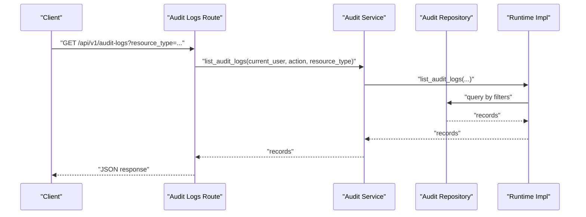
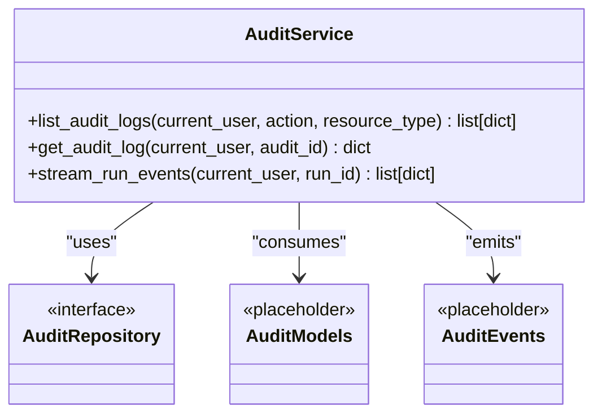
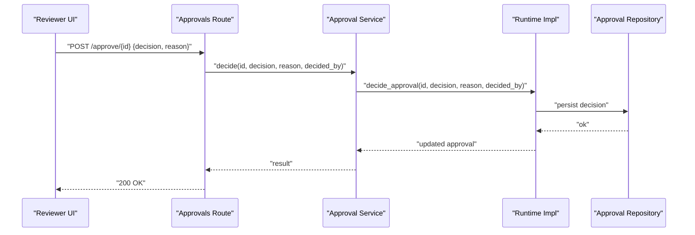
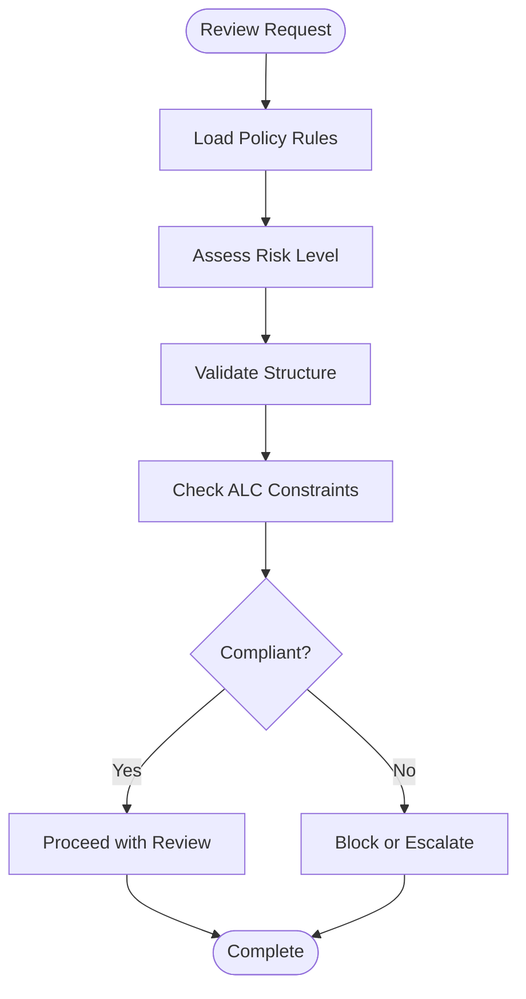
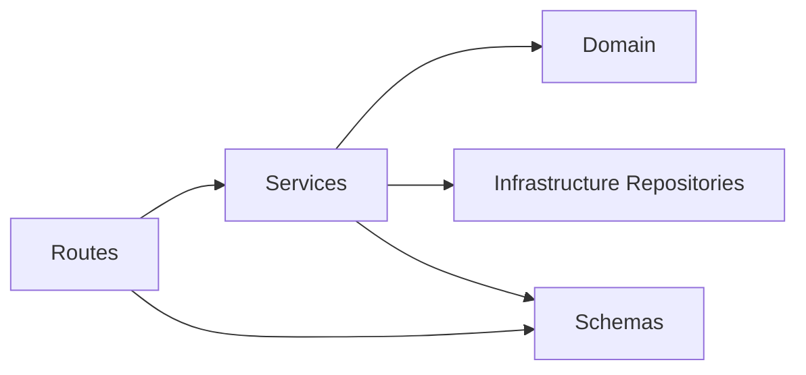

# Audit Trails & Compliance

<cite>
**Referenced Files in This Document**
- [audit_logs.py](file://backend/app/api/v1/routes/audit_logs.py)
- [models.py](file://backend/app/domain/audit/models.py)
- [events.py](file://backend/app/domain/audit/events.py)
- [audit_repository.py](file://backend/app/infrastructure/repositories/audit_repository.py)
- [audit_logs.py](file://backend/app/schemas/audit_logs.py)
- [audit_service.py](file://backend/app/services/audit_service.py)
- [approvals.py](file://backend/app/api/v1/routes/approvals.py)
- [models.py](file://backend/app/domain/approvals/models.py)
- [service.py](file://backend/app/domain/approvals/service.py)
- [approval_repository.py](file://backend/app/infrastructure/repositories/approval_repository.py)
- [approvals.py](file://backend/app/schemas/approvals.py)
- [approval_service.py](file://backend/app/services/approval_service.py)
- [governance.py](file://backend/app/api/v1/routes/governance.py)
- [models.py](file://backend/app/domain/governance/models.py)
- [policy_engine.py](file://backend/app/domain/governance/policy_engine.py)
- [risk.py](file://backend/app/domain/governance/risk.py)
- [alc_validator.py](file://backend/app/infrastructure/governance/alc_validator.py)
- [structure_validators.py](file://backend/app/infrastructure/governance/structure_validators.py)
- [governance.py](file://backend/app/schemas/governance.py)
- [governance_service.py](file://backend/app/services/governance_service.py)
</cite>

## Table of Contents
1. [Introduction](#introduction)
2. [Project Structure](#project-structure)
3. [Core Components](#core-components)
4. [Architecture Overview](#architecture-overview)
5. [Detailed Component Analysis](#detailed-component-analysis)
6. [Dependency Analysis](#dependency-analysis)
7. [Performance Considerations](#performance-considerations)
8. [Troubleshooting Guide](#troubleshooting-guide)
9. [Conclusion](#conclusion)
10. [Appendices](#appendices)

## Introduction
This document explains how audit trails and compliance tracking are implemented for human review processes. It covers how review decisions, actions, and communications are logged and tracked; the structure of audit records; retention and export considerations; compliance reporting; regulatory requirements; and legal hold procedures. It also provides examples for generating audit reports, investigating review history, and maintaining chain of custody for critical decisions.

## Project Structure
The audit and approval capabilities are organized across API routes, services, domain modules, schemas, and infrastructure repositories:
- API routes expose endpoints for listing and retrieving audit logs and approvals, and for making approval decisions.
- Services orchestrate calls to runtime components that implement persistence and retrieval.
- Domain modules define models and events (currently placeholders).
- Schemas define request/response contracts.
- Infrastructure repositories provide data access abstractions for audit and approval entities.
- Governance routes, services, and validators enforce policy and risk controls relevant to compliance.

```mermaid
graph TB
subgraph "API Layer"
A["Audit Logs Route<br/>audit_logs.py"]
B["Approvals Route<br/>approvals.py"]
C["Governance Route<br/>governance.py"]
end
subgraph "Service Layer"
D["Audit Service<br/>audit_service.py"]
E["Approval Service<br/>approval_service.py"]
F["Governance Service<br/>governance_service.py"]
end
subgraph "Domain Layer"
G["Audit Models<br/>domain/audit/models.py"]
H["Audit Events<br/>domain/audit/events.py"]
I["Approval Models<br/>domain/approvals/models.py"]
J["Approval Service<br/>domain/approvals/service.py"]
K["Governance Models<br/>domain/governance/models.py"]
L["Policy Engine<br/>domain/governance/policy_engine.py"]
M["Risk<br/>domain/governance/risk.py"]
end
subgraph "Infrastructure Layer"
N["Audit Repository<br/>repositories/audit_repository.py"]
O["Approval Repository<br/>repositories/approval_repository.py"]
P["ALC Validator<br/>infrastructure/governance/alc_validator.py"]
Q["Structure Validators<br/>infrastructure/governance/structure_validators.py"]
end
subgraph "Schemas"
R["Audit Logs Schema<br/>schemas/audit_logs.py"]
S["Approvals Schema<br/>schemas/approvals.py"]
T["Governance Schema<br/>schemas/governance.py"]
end
A --> D
B --> E
C --> F
D --> N
E --> O
F --> P
F --> Q
D --> G
D --> H
E --> I
E --> J
F --> K
F --> L
F --> M
A --> R
B --> S
C --> T
```

**Diagram sources**
- [audit_logs.py](file://backend/app/api/v1/routes/audit_logs.py)
- [approvals.py](file://backend/app/api/v1/routes/approvals.py)
- [governance.py](file://backend/app/api/v1/routes/governance.py)
- [audit_service.py](file://backend/app/services/audit_service.py)
- [approval_service.py](file://backend/app/services/approval_service.py)
- [governance_service.py](file://backend/app/services/governance_service.py)
- [models.py](file://backend/app/domain/audit/models.py)
- [events.py](file://backend/app/domain/audit/events.py)
- [models.py](file://backend/app/domain/approvals/models.py)
- [service.py](file://backend/app/domain/approvals/service.py)
- [models.py](file://backend/app/domain/governance/models.py)
- [policy_engine.py](file://backend/app/domain/governance/policy_engine.py)
- [risk.py](file://backend/app/domain/governance/risk.py)
- [audit_repository.py](file://backend/app/infrastructure/repositories/audit_repository.py)
- [approval_repository.py](file://backend/app/infrastructure/repositories/approval_repository.py)
- [alc_validator.py](file://backend/app/infrastructure/governance/alc_validator.py)
- [structure_validators.py](file://backend/app/infrastructure/governance/structure_validators.py)
- [audit_logs.py](file://backend/app/schemas/audit_logs.py)
- [approvals.py](file://backend/app/schemas/approvals.py)
- [governance.py](file://backend/app/schemas/governance.py)

**Section sources**
- [audit_logs.py](file://backend/app/api/v1/routes/audit_logs.py)
- [approvals.py](file://backend/app/api/v1/routes/approvals.py)
- [governance.py](file://backend/app/api/v1/routes/governance.py)
- [audit_service.py](file://backend/app/services/audit_service.py)
- [approval_service.py](file://backend/app/services/approval_service.py)
- [governance_service.py](file://backend/app/services/governance_service.py)
- [models.py](file://backend/app/domain/audit/models.py)
- [events.py](file://backend/app/domain/audit/events.py)
- [models.py](file://backend/app/domain/approvals/models.py)
- [service.py](file://backend/app/domain/approvals/service.py)
- [models.py](file://backend/app/domain/governance/models.py)
- [policy_engine.py](file://backend/app/domain/governance/policy_engine.py)
- [risk.py](file://backend/app/domain/governance/risk.py)
- [audit_repository.py](file://backend/app/infrastructure/repositories/audit_repository.py)
- [approval_repository.py](file://backend/app/infrastructure/repositories/approval_repository.py)
- [alc_validator.py](file://backend/app/infrastructure/governance/alc_validator.py)
- [structure_validators.py](file://backend/app/infrastructure/governance/structure_validators.py)
- [audit_logs.py](file://backend/app/schemas/audit_logs.py)
- [approvals.py](file://backend/app/schemas/approvals.py)
- [governance.py](file://backend/app/schemas/governance.py)

## Core Components
- Audit logging service exposes list and get operations for audit logs and a stream of run events. These delegate to runtime implementations for persistence and retrieval.
- Approval service supports listing approvals, fetching details, deciding on an approval with reason, and reassigning reviewers. Decisions and reassignments are recorded via runtime calls.
- Governance route and service integrate policy engine and risk evaluation, along with structural and ALC validators to enforce compliance rules during reviews.

Key responsibilities:
- Capture immutable audit entries for review-related actions.
- Provide queryable interfaces for investigations and reporting.
- Enforce governance policies and risk thresholds before or after decisions.
- Maintain reviewer identity and reasons for traceability.

**Section sources**
- [audit_service.py](file://backend/app/services/audit_service.py)
- [approval_service.py](file://backend/app/services/approval_service.py)
- [governance_service.py](file://backend/app/services/governance_service.py)
- [audit_logs.py](file://backend/app/api/v1/routes/audit_logs.py)
- [approvals.py](file://backend/app/api/v1/routes/approvals.py)
- [governance.py](file://backend/app/api/v1/routes/governance.py)

## Architecture Overview
The system follows a layered architecture:
- API routes handle HTTP requests and map them to service methods.
- Services coordinate business logic and call into runtime implementations.
- Domain modules encapsulate core concepts (models, events, policy engine, risk).
- Infrastructure repositories abstract storage and validation concerns.
- Schemas define consistent request/response contracts.

**Diagram sources**
- [audit_logs.py](file://backend/app/api/v1/routes/audit_logs.py)
- [audit_service.py](file://backend/app/services/audit_service.py)
- [audit_repository.py](file://backend/app/infrastructure/repositories/audit_repository.py)

## Detailed Component Analysis

### Audit Logging
- Purpose: Record immutable entries for review-related actions such as decisions, reassignments, and status changes.
- Access patterns: List with optional filters (e.g., action, resource type), retrieve by ID, and stream run events for real-time visibility.
- Data model: Defined in domain models and events (placeholders currently).
- Persistence: Delegated to runtime through repository abstraction.

**Diagram sources**
- [audit_service.py](file://backend/app/services/audit_service.py)
- [audit_repository.py](file://backend/app/infrastructure/repositories/audit_repository.py)
- [models.py](file://backend/app/domain/audit/models.py)
- [events.py](file://backend/app/domain/audit/events.py)

**Section sources**
- [audit_service.py](file://backend/app/services/audit_service.py)
- [audit_repository.py](file://backend/app/infrastructure/repositories/audit_repository.py)
- [models.py](file://backend/app/domain/audit/models.py)
- [events.py](file://backend/app/domain/audit/events.py)

### Approvals and Human Review
- Purpose: Manage human-in-the-loop gates where reviewers approve or reject items, optionally providing reasons and reassignment.
- Operations: List pending approvals, fetch details, decide with reason, reassign to another reviewer.
- Traceability: Each decision and reassignment is persisted via runtime calls, enabling full chain-of-custody.

**Diagram sources**
- [approvals.py](file://backend/app/api/v1/routes/approvals.py)
- [approval_service.py](file://backend/app/services/approval_service.py)
- [approval_repository.py](file://backend/app/infrastructure/repositories/approval_repository.py)

**Section sources**
- [approvals.py](file://backend/app/api/v1/routes/approvals.py)
- [approval_service.py](file://backend/app/services/approval_service.py)
- [approval_repository.py](file://backend/app/infrastructure/repositories/approval_repository.py)
- [models.py](file://backend/app/domain/approvals/models.py)
- [service.py](file://backend/app/domain/approvals/service.py)

### Governance and Policy Enforcement
- Purpose: Apply policy rules, risk assessments, and structural validations to ensure compliance during reviews.
- Components: Policy engine, risk module, ALC validator, and structure validators.
- Integration: Governance service coordinates these components and exposes endpoints for policy checks and compliance outcomes.

**Diagram sources**
- [governance_service.py](file://backend/app/services/governance_service.py)
- [policy_engine.py](file://backend/app/domain/governance/policy_engine.py)
- [risk.py](file://backend/app/domain/governance/risk.py)
- [alc_validator.py](file://backend/app/infrastructure/governance/alc_validator.py)
- [structure_validators.py](file://backend/app/infrastructure/governance/structure_validators.py)

**Section sources**
- [governance.py](file://backend/app/api/v1/routes/governance.py)
- [governance_service.py](file://backend/app/services/governance_service.py)
- [models.py](file://backend/app/domain/governance/models.py)
- [policy_engine.py](file://backend/app/domain/governance/policy_engine.py)
- [risk.py](file://backend/app/domain/governance/risk.py)
- [alc_validator.py](file://backend/app/infrastructure/governance/alc_validator.py)
- [structure_validators.py](file://backend/app/infrastructure/governance/structure_validators.py)

## Dependency Analysis
- API routes depend on services for business logic.
- Services depend on runtime implementations and domain modules.
- Infrastructure repositories abstract persistence and validation.
- Schemas define contracts used by routes and services.

**Diagram sources**
- [audit_logs.py](file://backend/app/api/v1/routes/audit_logs.py)
- [approvals.py](file://backend/app/api/v1/routes/approvals.py)
- [governance.py](file://backend/app/api/v1/routes/governance.py)
- [audit_service.py](file://backend/app/services/audit_service.py)
- [approval_service.py](file://backend/app/services/approval_service.py)
- [governance_service.py](file://backend/app/services/governance_service.py)
- [audit_repository.py](file://backend/app/infrastructure/repositories/audit_repository.py)
- [approval_repository.py](file://backend/app/infrastructure/repositories/approval_repository.py)
- [audit_logs.py](file://backend/app/schemas/audit_logs.py)
- [approvals.py](file://backend/app/schemas/approvals.py)
- [governance.py](file://backend/app/schemas/governance.py)

**Section sources**
- [audit_logs.py](file://backend/app/api/v1/routes/audit_logs.py)
- [approvals.py](file://backend/app/api/v1/routes/approvals.py)
- [governance.py](file://backend/app/api/v1/routes/governance.py)
- [audit_service.py](file://backend/app/services/audit_service.py)
- [approval_service.py](file://backend/app/services/approval_service.py)
- [governance_service.py](file://backend/app/services/governance_service.py)
- [audit_repository.py](file://backend/app/infrastructure/repositories/audit_repository.py)
- [approval_repository.py](file://backend/app/infrastructure/repositories/approval_repository.py)
- [audit_logs.py](file://backend/app/schemas/audit_logs.py)
- [approvals.py](file://backend/app/schemas/approvals.py)
- [governance.py](file://backend/app/schemas/governance.py)

## Performance Considerations
- Use filtered queries for audit logs to reduce payload size and improve latency.
- Stream run events for real-time dashboards while avoiding heavy polling.
- Cache frequently accessed approval states at the service layer if appropriate.
- Ensure indexes on commonly filtered fields (e.g., resource_type, action) in the underlying store.

## Troubleshooting Guide
Common issues and resolutions:
- Missing audit entries: Verify that runtime implementations persist events and that repository queries match expected filters.
- Approval not visible: Confirm that decisions and reassignments are persisted and that user permissions allow listing.
- Governance failures: Inspect policy engine outputs and validator results to identify non-compliance reasons.

Operational tips:
- Enable detailed logging around service calls to runtime and repository layers.
- Validate schema contracts when integrating new clients.
- Use run event streaming to diagnose transient failures during long-running reviews.

## Conclusion
The system provides foundational capabilities for audit trails and compliance tracking in human review workflows. Audit logs capture key actions, approvals record decisions and reassignments with reasons, and governance enforces policy and risk constraints. Extending domain models and repository implementations will further strengthen retention, export, and legal hold features.

## Appendices

### Audit Trail Structure
- Typical fields include: unique identifier, timestamp, actor identity, action type, target resource identifiers, outcome, and metadata.
- Immutable append-only semantics are recommended to preserve integrity.

### Retention Policies
- Define retention periods per data category (e.g., short-term operational vs. long-term compliance).
- Implement archival and deletion jobs respecting legal holds.

### Export Capabilities
- Provide batch export endpoints for audit logs and approval histories.
- Support filtering by date range, resource type, and actor.
- Output formats should be machine-readable (e.g., JSON/CSV) and include headers describing field semantics.

### Compliance Reporting
- Generate periodic reports summarizing approval rates, escalations, and policy violations.
- Include trend analysis and exception summaries for auditors.

### Regulatory Requirements
- Map controls to applicable regulations (e.g., data protection, industry-specific mandates).
- Ensure evidence collection aligns with audit standards and chain-of-custody expectations.

### Legal Hold Procedures
- Mark records subject to litigation or investigation.
- Prevent deletion or modification of held records until release.
- Log all hold actions with actor and rationale.

### Examples

#### Generating an Audit Report
- Query audit logs with filters for date range and resource types.
- Aggregate counts by action and outcome.
- Export results to CSV for submission to compliance teams.

#### Investigating Review History
- Retrieve specific approval by ID to view decision, reason, and timestamps.
- Cross-reference related audit log entries for context.
- Use run event streaming to reconstruct timeline of activities.

#### Maintaining Chain of Custody
- Record every state change with actor identity and reason.
- Preserve original artifacts alongside decisions.
- Ensure tamper-evident storage and access controls.