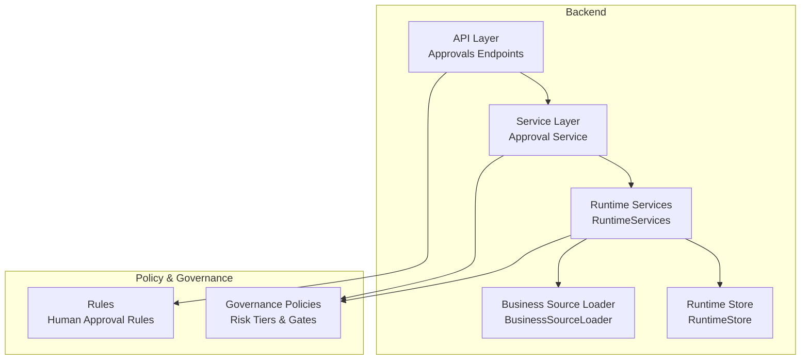
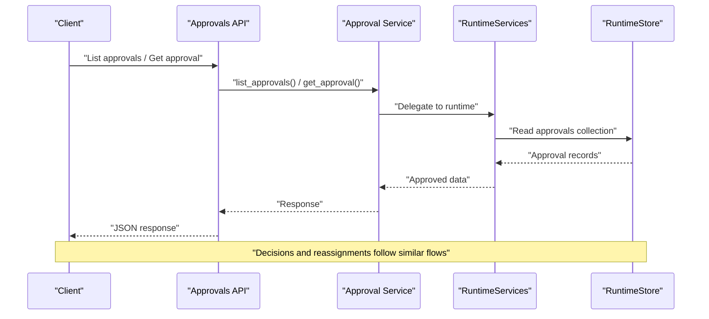
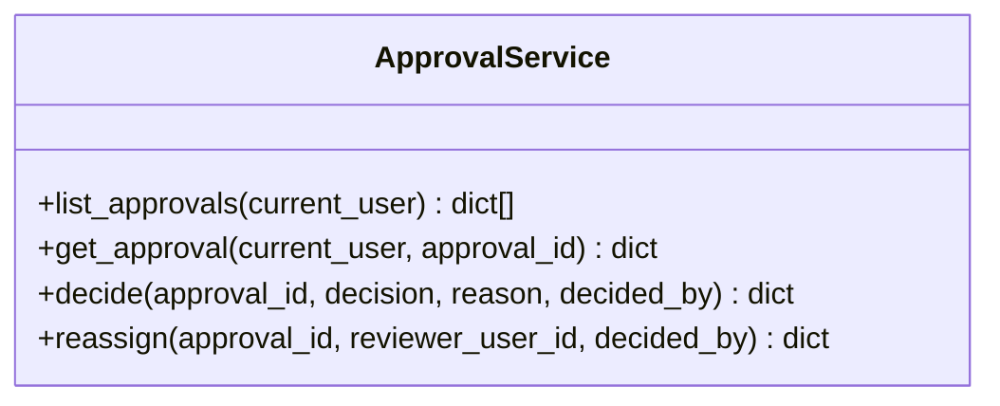
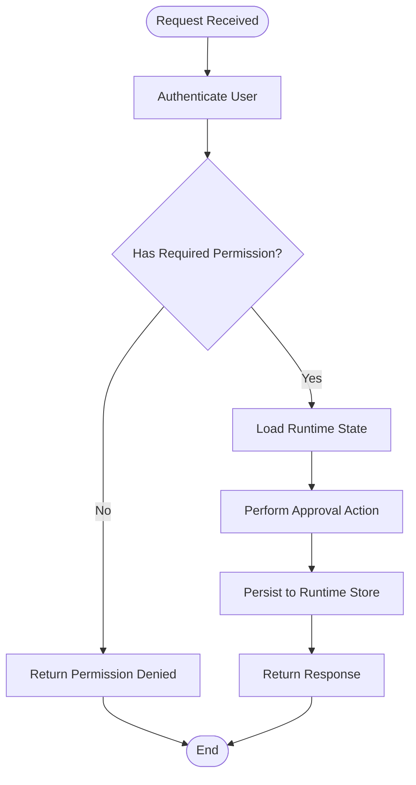
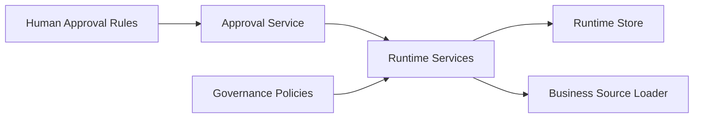

# Human Review & Approval Processes

<cite>
**Referenced Files in This Document**
- [approval_service.py](file://backend/app/services/approval_service.py)
- [approvals.py](file://backend/app/schemas/approvals.py)
- [runtime.py](file://backend/app/runtime.py)
- [60-human-approval.md](file://rules/60-human-approval.md)
</cite>

## Table of Contents
1. [Introduction](#introduction)
2. [Project Structure](#project-structure)
3. [Core Components](#core-components)
4. [Architecture Overview](#architecture-overview)
5. [Detailed Component Analysis](#detailed-component-analysis)
6. [Dependency Analysis](#dependency-analysis)
7. [Performance Considerations](#performance-considerations)
8. [Troubleshooting Guide](#troubleshooting-guide)
9. [Conclusion](#conclusion)

## Introduction
This document explains how human review and approval processes are implemented within the evaluation system. It covers:
- How to configure approval gates and define reviewer roles
- How to set up review workflows and boards
- The end-to-end lifecycle from submission to decision, including escalation paths and audit trails
- Integration with governance policies, risk assessment, and compliance requirements
- Examples for configuring automated pre-screening and handling approval outcomes

The goal is to provide both a conceptual overview and concrete implementation references so that operators can design, operate, and audit human-in-the-loop controls effectively.

## Project Structure
Human review and approvals are implemented as part of the backend runtime and services layer. Key areas include:
- Service API surface for listing, retrieving, deciding, and reassigning approvals
- Schema definitions for approval requests
- Runtime state management and role-based permissions
- Policy rules that trigger human approval for sensitive operations

[No sources needed since this diagram shows conceptual workflow, not actual code structure]

## Core Components
- Approval Service: Exposes functions to list approvals, fetch details, make decisions, and reassign tasks.
- Schemas: Defines request models used by the service (e.g., approval decision requests).
- Runtime Services: Provides core runtime capabilities, including role definitions, permission checks, and persistence via a runtime store.
- Rules: Declares when human approval is required for specific high-risk actions.

Key responsibilities:
- Approval Service orchestrates approval operations and delegates to runtime.
- Runtime Services enforces RBAC and persists approval records.
- Rules define policy triggers for requiring human approval.

**Section sources**
- [approval_service.py:1-18](file://backend/app/services/approval_service.py#L1-L18)
- [approvals.py:1-2](file://backend/app/schemas/approvals.py#L1-L2)
- [runtime.py:131-222](file://backend/app/runtime.py#L131-L222)
- [60-human-approval.md:1-12](file://rules/60-human-approval.md#L1-L12)

## Architecture Overview
The approval architecture integrates with the broader runtime and governance layers:
- Approvals are persisted in the runtime store alongside other domain collections.
- Role-based access control determines who can read, approve, or reject items.
- Governance policies and risk tiers influence whether an action requires human gate enforcement.
- Audit trails are maintained through runtime collections and related logging mechanisms.

[No sources needed since this diagram shows conceptual workflow, not actual code structure]

## Detailed Component Analysis

### Approval Service
Responsibilities:
- Provide methods to list pending approvals, retrieve details, decide on them, and reassign reviewers.
- Enforce caller identity via authenticated user context.

Operational notes:
- Decisions require a decision value and optional reason.
- Reassignment allows transferring ownership to another reviewer.

**Diagram sources**
- [approval_service.py:1-18](file://backend/app/services/approval_service.py#L1-L18)

**Section sources**
- [approval_service.py:1-18](file://backend/app/services/approval_service.py#L1-L18)

### Schemas for Approvals
Purpose:
- Define request structures for approval-related operations (e.g., decision payloads).

Usage:
- Used by the service layer to validate inputs before invoking runtime logic.

**Section sources**
- [approvals.py:1-2](file://backend/app/schemas/approvals.py#L1-L2)

### Runtime Services and Permissions
Role-based permissions:
- Roles such as owner, admin, manager, operator, reviewer, viewer, and service_account define granular capabilities.
- Approval-specific permissions include reading, approving, and rejecting.

Runtime store:
- Persists approvals and related entities in a unified runtime store backed by Postgres or JSON file fallback.

**Diagram sources**
- [runtime.py:131-222](file://backend/app/runtime.py#L131-L222)
- [runtime.py:258-393](file://backend/app/runtime.py#L258-L393)

**Section sources**
- [runtime.py:131-222](file://backend/app/runtime.py#L131-L222)
- [runtime.py:258-393](file://backend/app/runtime.py#L258-L393)

### Policy Triggers for Human Approval
When human approval is required:
- Installing global packages
- Running remote install scripts
- Enabling MCP servers with credentials
- Copying third-party repo code into active workspace configs
- Modifying hooks
- Deleting files
- Applying self-generated skill/rule changes

These triggers ensure that high-risk operations cannot proceed without explicit human authorization.

**Section sources**
- [60-human-approval.md:1-12](file://rules/60-human-approval.md#L1-L12)

## Dependency Analysis
High-level dependencies:
- Approval Service depends on Runtime Services for authentication, permissions, and persistence.
- Runtime Services depend on Runtime Store for data persistence and on Business Source Loader for seed data and normalization.
- Governance policies and risk tiers influence whether human gates are enforced during execution.

[No sources needed since this diagram shows conceptual workflow, not actual code structure]

## Performance Considerations
- Use Postgres-backed runtime store for production-scale workloads to avoid contention and improve durability.
- Batch operations where possible to reduce round-trips to the store.
- Cache frequently accessed approval lists at the service layer if appropriate, ensuring consistency with store updates.
- Monitor approval backlog metrics to detect bottlenecks and adjust reviewer capacity accordingly.

[No sources needed since this section provides general guidance]

## Troubleshooting Guide
Common issues and resolutions:
- Permission denied errors: Ensure the current user has the required approval permissions (read, approve, reject).
- Approval not found: Verify the approval ID exists and belongs to the organization context.
- Decision rejected unexpectedly: Confirm the decision payload matches expected values and includes a reason if required.
- Reassignment failures: Validate the target reviewer’s user ID and their ability to accept assignments.

Operational tips:
- Inspect runtime store contents to confirm approval records and state transitions.
- Cross-check governance policies and risk tiers to understand why a gate was triggered.
- Review audit logs for the full sequence of events around an approval item.

**Section sources**
- [runtime.py:131-222](file://backend/app/runtime.py#L131-L222)
- [runtime.py:258-393](file://backend/app/runtime.py#L258-L393)

## Conclusion
The human review and approval system integrates tightly with the runtime’s role-based permissions, governance policies, and persistent storage. By defining clear roles, enforcing policy-driven gates, and maintaining comprehensive audit trails, organizations can implement robust, compliant, and auditable approval workflows. Operators should leverage the Approval Service APIs, align with governance policies and risk tiers, and monitor performance and backlogs to maintain efficient review processes.

[No sources needed since this section summarizes without analyzing specific files]