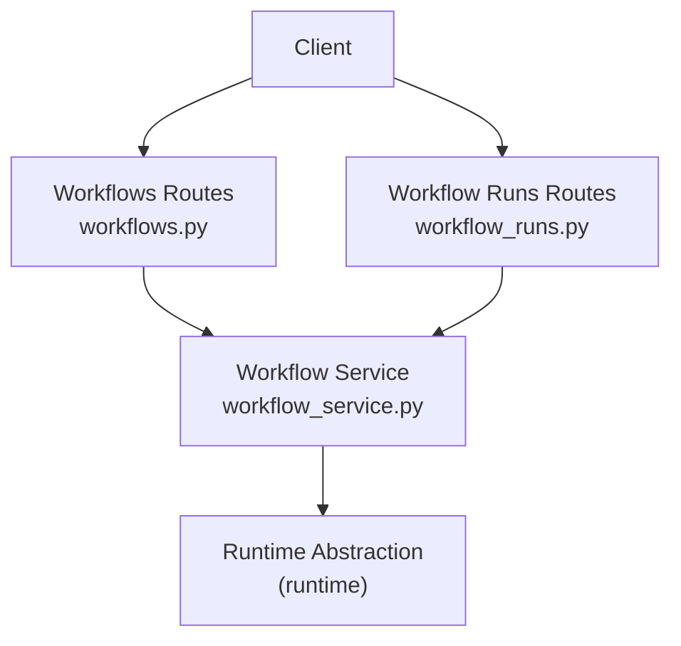
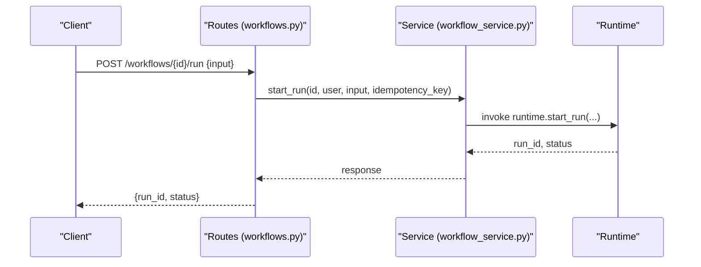
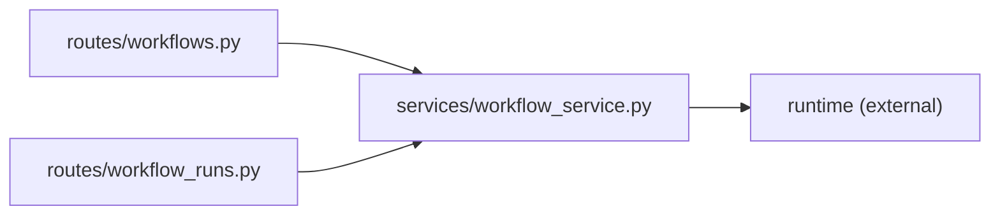
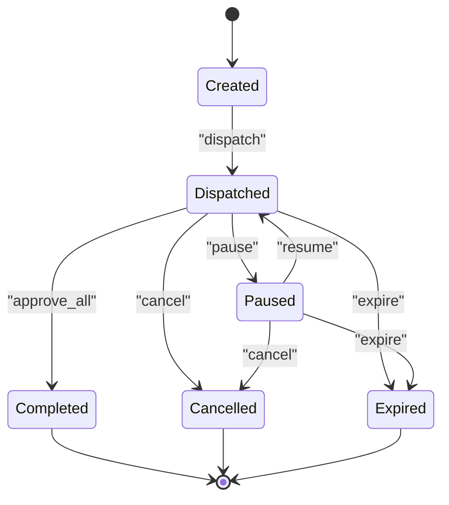

# Review Workflow Design

<cite>
**Referenced Files in This Document**
- [workflows.py](file://backend/app/api/v1/routes/workflows.py)
- [workflow_runs.py](file://backend/app/api/v1/routes/workflow_runs.py)
- [workflow_service.py](file://backend/app/services/workflow_service.py)
</cite>

## Table of Contents
1. [Introduction](#introduction)
2. [Project Structure](#project-structure)
3. [Core Components](#core-components)
4. [Architecture Overview](#architecture-overview)
5. [Detailed Component Analysis](#detailed-component-analysis)
6. [Dependency Analysis](#dependency-analysis)
7. [Performance Considerations](#performance-considerations)
8. [Troubleshooting Guide](#troubleshooting-guide)
9. [Conclusion](#conclusion)
10. [Appendices](#appendices)

## Introduction
This document explains how to design and implement review workflows using the repository’s workflow runtime. It covers common patterns such as sequential reviews, parallel reviews, conditional routing, and multi-tier approval chains. It also documents state management, decision logic, outcome handling, and integration points with governance policies, risk assessment frameworks, and compliance requirements. Practical examples include peer review, expert validation, and regulatory compliance checks.

## Project Structure
The review workflow surface is exposed via REST endpoints that delegate to services and then to a runtime abstraction. The key files are:
- API routes for workflows and workflow runs
- A thin service layer over the runtime
- Runtime capabilities (list, get, create, update, versioning, activation, disable, archive, run start, dispatch, pause/resume, retry, expire, stream events)

**Diagram sources**
- [workflows.py:1-76](file://backend/app/api/v1/routes/workflows.py#L1-L76)
- [workflow_runs.py:1-99](file://backend/app/api/v1/routes/workflow_runs.py#L1-L99)
- [workflow_service.py:1-38](file://backend/app/services/workflow_service.py#L1-L38)

**Section sources**
- [workflows.py:1-76](file://backend/app/api/v1/routes/workflows.py#L1-L76)
- [workflow_runs.py:1-99](file://backend/app/api/v1/routes/workflow_runs.py#L1-L99)
- [workflow_service.py:1-38](file://backend/app/services/workflow_service.py#L1-L38)

## Core Components
- Workflows API: CRUD, versioning, activation, disable/archive, and starting runs.
- Workflow Runs API: list, detail, steps, evaluations, dispatch, cancel, pause/resume, retry, expire, and event streaming.
- Workflow Service: thin delegation to runtime for all workflow operations.

Key responsibilities:
- Enforce permissions on each endpoint.
- Provide idempotent run creation via optional Idempotency-Key header.
- Support rate limiting on write operations.
- Stream real-time run events for UIs and observers.

**Section sources**
- [workflows.py:15-76](file://backend/app/api/v1/routes/workflows.py#L15-L76)
- [workflow_runs.py:30-99](file://backend/app/api/v1/routes/workflow_runs.py#L30-L99)
- [workflow_service.py:1-38](file://backend/app/services/workflow_service.py#L1-L38)

## Architecture Overview
The system follows a layered architecture:
- Presentation: FastAPI routers expose REST endpoints.
- Service: Thin service layer delegates to runtime.
- Runtime: Encapsulates workflow lifecycle, execution engine, persistence, and orchestration.

**Diagram sources**
- [workflows.py:68-76](file://backend/app/api/v1/routes/workflows.py#L68-L76)
- [workflow_service.py:1-38](file://backend/app/services/workflow_service.py#L1-L38)

## Detailed Component Analysis

### Workflows API
- List and get workflows and versions.
- Create/update workflows and manage versions.
- Activate a specific version or by payload.
- Disable and archive workflows.
- Start a new run with optional idempotency key.

Design notes:
- All endpoints enforce read/write permissions via runtime assertions.
- Write endpoints can be protected by rate limiting when enabled.
- Starting a run supports idempotency through an optional request header.

Operational guidance:
- Use versioning to control which workflow definition executes.
- Prefer activate_workflow_version to switch active definitions safely.
- Archive old workflows after deactivation to maintain a clean registry.

**Section sources**
- [workflows.py:15-76](file://backend/app/api/v1/routes/workflows.py#L15-L76)
- [workflow_service.py:1-38](file://backend/app/services/workflow_service.py#L1-L38)

### Workflow Runs API
- List runs and retrieve details, steps, and evaluations.
- Dispatch pending runs, cancel, pause/resume, retry, and expire.
- Stream run events for live dashboards.

Design notes:
- Read endpoints assert appropriate permissions.
- Write endpoints support rate limiting when enabled.
- Event streaming uses Server-Sent Events for low-latency updates.

Operational guidance:
- Use pause/resume to coordinate human-in-the-loop approvals.
- Use retry for transient failures; use expire to abandon stale runs.
- Consume the stream to render step-level progress and outcomes.

**Section sources**
- [workflow_runs.py:30-99](file://backend/app/api/v1/routes/workflow_runs.py#L30-L99)

### Workflow Service Layer
- Provides simple functions that forward calls to runtime.
- Keeps route handlers focused on HTTP concerns (auth, rate limit, serialization).

Best practices:
- Keep business logic in runtime; service remains a stable facade.
- Add new operations by extending both service and routes consistently.

**Section sources**
- [workflow_service.py:1-38](file://backend/app/services/workflow_service.py#L1-L38)

## Dependency Analysis
- Routes depend on service functions for domain operations.
- Service depends on runtime abstractions for execution and persistence.
- Permissions and rate limiting are applied at the route layer before delegating.

**Diagram sources**
- [workflows.py:1-76](file://backend/app/api/v1/routes/workflows.py#L1-L76)
- [workflow_runs.py:1-99](file://backend/app/api/v1/routes/workflow_runs.py#L1-L99)
- [workflow_service.py:1-38](file://backend/app/services/workflow_service.py#L1-L38)

**Section sources**
- [workflows.py:1-76](file://backend/app/api/v1/routes/workflows.py#L1-L76)
- [workflow_runs.py:1-99](file://backend/app/api/v1/routes/workflow_runs.py#L1-L99)
- [workflow_service.py:1-38](file://backend/app/services/workflow_service.py#L1-L38)

## Performance Considerations
- Enable rate limiting on write endpoints to protect against bursts.
- Use idempotency keys when creating runs to avoid duplicates under retries.
- Stream events for large runs instead of polling to reduce overhead.
- Batch dispatch where supported to improve throughput.

[No sources needed since this section provides general guidance]

## Troubleshooting Guide
Common issues and remedies:
- Permission errors: Ensure the caller has required scopes for reads/writes.
- Rate limit exceeded: Back off and retry; adjust limits if necessary.
- Duplicate runs: Provide a unique Idempotency-Key per intended run.
- Stalled runs: Inspect steps and evaluations; consider retry or expire.
- Missing events: Verify SSE consumer handles reconnects and backoff.

**Section sources**
- [workflows.py:15-76](file://backend/app/api/v1/routes/workflows.py#L15-L76)
- [workflow_runs.py:30-99](file://backend/app/api/v1/routes/workflow_runs.py#L30-L99)

## Conclusion
The repository exposes a clear, permissioned, and rate-limited surface for managing workflows and their runs. By leveraging versioning, idempotency, pause/resume, and event streaming, you can implement robust review workflows including sequential, parallel, conditional, and multi-tier approval patterns. Extend the runtime with your own decision logic and policy integrations while keeping the API and service layers stable.

[No sources needed since this section summarizes without analyzing specific files]

## Appendices

### Review Workflow Patterns

#### Sequential Reviews
- Model as a chain of steps where each step requires an explicit approval before proceeding.
- Use pause/resume to gate progression until a reviewer acts.
- Record decisions and reasons in evaluation artifacts for auditability.

Implementation pointers:
- Start a run and advance steps upon approvals.
- Persist step-level outcomes and timestamps.

[No sources needed since this diagram shows conceptual workflow, not actual code structure]

#### Parallel Reviews
- Fan-out to multiple reviewers concurrently.
- Define aggregation rules (e.g., majority approve, any reject).
- Resume the run once all required approvals are collected.

Implementation pointers:
- Track parallel branches and completion counts.
- Aggregate results deterministically.

[No sources needed since this diagram shows conceptual workflow, not actual code structure]

#### Conditional Routing
- Evaluate inputs and metadata to select the next step(s).
- Route to specialized reviewers based on content type, risk tier, or domain.

Implementation pointers:
- Implement a router step that inspects context and emits next-step instructions.
- Cache routing decisions for reproducibility.

[No sources needed since this diagram shows conceptual workflow, not actual code structure]

#### Multi-Tier Approval Chains
- Chain approvals across roles (e.g., peer → expert → compliance).
- Escalate automatically on timeouts or rejections.

Implementation pointers:
- Maintain a queue of pending approvals per tier.
- Trigger escalation timers and notifications.

[No sources needed since this diagram shows conceptual workflow, not actual code structure]

### State Management and Decision Logic
- States: created, dispatched, paused, resumed, completed, cancelled, expired.
- Transitions:
  - created → dispatched
  - dispatched → paused (human gate)
  - paused → resumed (approval)
  - any terminal state → cancelled/expired
- Decisions:
  - Approve/reject with comments and evidence.
  - Request changes with actionable feedback.
  - Escalate to higher authority.

[No sources needed since this diagram shows conceptual workflow, not actual code structure]

### Integration with Governance, Risk, and Compliance
- Governance policies:
  - Require approvals for sensitive changes.
  - Enforce data retention and access controls.
- Risk assessment:
  - Classify items by risk tier to determine required reviewers.
  - Apply stricter controls for high-risk items.
- Compliance:
  - Capture immutable audit logs for every decision.
  - Preserve provenance and rationale for traceability.

Integration approach:
- Attach policy checks as preconditions before dispatching or resuming.
- Emit standardized audit events for downstream compliance systems.

[No sources needed since this section provides general guidance]

### Example Patterns

#### Peer Review
- Two peers review independently; require both approvals.
- If disagreement, escalate to a third-party expert.

#### Expert Validation
- Domain experts validate technical correctness.
- Include checklists and acceptance criteria.

#### Regulatory Compliance Checks
- Mandatory compliance sign-off for regulated content.
- Automated checks plus human confirmation.

[No sources needed since this section provides general guidance]