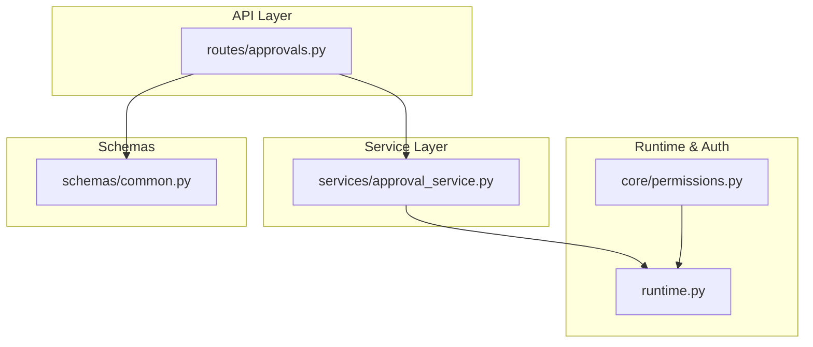
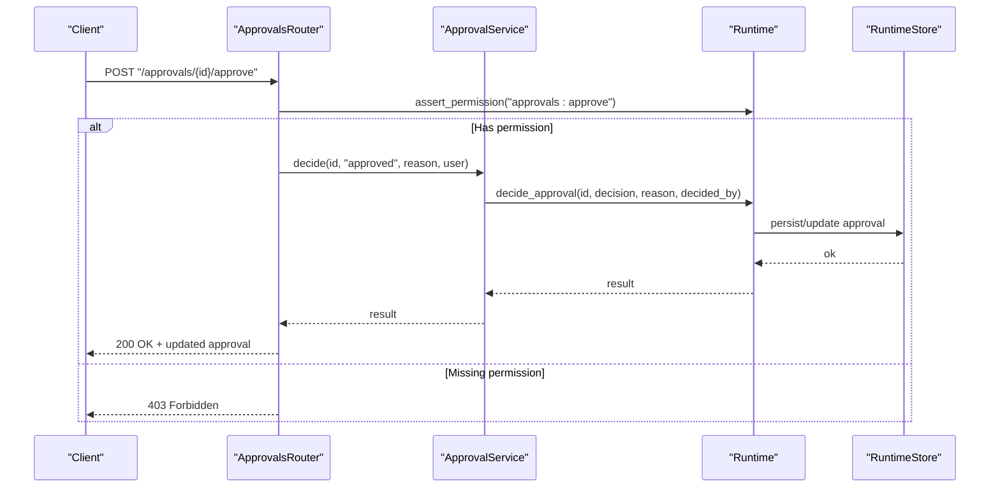
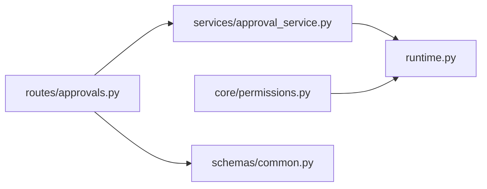

# Reviewer Roles & Permissions

<cite>
**Referenced Files in This Document**
- [runtime.py](file://backend/app/runtime.py)
- [permissions.py](file://backend/app/core/permissions.py)
- [approvals.py](file://backend/app/api/v1/routes/approvals.py)
- [approval_service.py](file://backend/app/services/approval_service.py)
- [common.py](file://backend/app/schemas/common.py)
</cite>

## Table of Contents
1. [Introduction](#introduction)
2. [Project Structure](#project-structure)
3. [Core Components](#core-components)
4. [Architecture Overview](#architecture-overview)
5. [Detailed Component Analysis](#detailed-component-analysis)
6. [Dependency Analysis](#dependency-analysis)
7. [Performance Considerations](#performance-considerations)
8. [Troubleshooting Guide](#troubleshooting-guide)
9. [Conclusion](#conclusion)

## Introduction
This document explains how reviewer roles and permissions are managed within the human review system. It covers role-based access control for reviewers, approvers, and administrators; permission hierarchies; assignment strategies; delegation mechanisms; qualification requirements; workload balancing; and conflict-of-interest handling. It also provides examples for creating custom reviewer roles, assigning permissions, and managing reviewer availability and expertise areas.

## Project Structure
The human review and approval functionality is implemented across a small set of focused modules:
- API routes expose endpoints to list approvals, view details, approve/reject, reassign, and submit decisions.
- A thin service layer delegates to runtime operations.
- The runtime module defines roles, permissions, and core authorization checks.
- Schemas define request payloads for decisions and reassignments.

**Diagram sources**
- [approvals.py:1-41](file://backend/app/api/v1/routes/approvals.py#L1-L41)
- [approval_service.py:1-18](file://backend/app/services/approval_service.py#L1-L18)
- [runtime.py:107-222](file://backend/app/runtime.py#L107-L222)
- [permissions.py:1-6](file://backend/app/core/permissions.py#L1-L6)
- [common.py:155-162](file://backend/app/schemas/common.py#L155-L162)

**Section sources**
- [approvals.py:1-41](file://backend/app/api/v1/routes/approvals.py#L1-L41)
- [approval_service.py:1-18](file://backend/app/services/approval_service.py#L1-L18)
- [runtime.py:107-222](file://backend/app/runtime.py#L107-L222)
- [permissions.py:1-6](file://backend/app/core/permissions.py#L1-L6)
- [common.py:155-162](file://backend/app/schemas/common.py#L155-L162)

## Core Components
- Role-based permissions: Centralized mapping of roles to permission sets, including reviewer-specific capabilities.
- Approval endpoints: Read-only and write operations gated by permissions.
- Service abstraction: Encapsulates runtime calls for listing, retrieving, deciding, and reassigning approvals.
- Request schemas: Typed models for decision and reassignment payloads.

Key implementation references:
- Role definitions and permission sets: [ROLE_PERMISSIONS:140-222](file://backend/app/runtime.py#L140-L222)
- Permission helper: [allowed_permissions:4-6](file://backend/app/core/permissions.py#L4-L6)
- Approval routes: [approvals router:1-41](file://backend/app/api/v1/routes/approvals.py#L1-L41)
- Approval service: [approval_service:1-18](file://backend/app/services/approval_service.py#L1-L18)
- Decision and reassignment schemas: [ApprovalDecisionRequest, ApprovalReassignRequest:155-162](file://backend/app/schemas/common.py#L155-L162)

**Section sources**
- [runtime.py:140-222](file://backend/app/runtime.py#L140-L222)
- [permissions.py:1-6](file://backend/app/core/permissions.py#L1-L6)
- [approvals.py:1-41](file://backend/app/api/v1/routes/approvals.py#L1-L41)
- [approval_service.py:1-18](file://backend/app/services/approval_service.py#L1-L18)
- [common.py:155-162](file://backend/app/schemas/common.py#L155-L162)

## Architecture Overview
End-to-end flow for an approval action:
- Client invokes an approval endpoint with an authenticated user context.
- Route asserts required permissions using runtime authorization.
- Service delegates to runtime methods that perform business logic (e.g., persisting decisions).
- Responses return updated approval state or errors when permissions are insufficient.

**Diagram sources**
- [approvals.py:23-30](file://backend/app/api/v1/routes/approvals.py#L23-L30)
- [approval_service.py:12-13](file://backend/app/services/approval_service.py#L12-L13)
- [runtime.py:107-115](file://backend/app/runtime.py#L107-L115)

## Detailed Component Analysis

### Role-Based Access Control (RBAC)
- Roles include owner, admin, manager, operator, reviewer, viewer, and service_account.
- Each role maps to a set of fine-grained permissions such as approvals:read, approvals:approve, approvals:reject.
- The reviewer role includes read and decision-making permissions on approvals, plus read access to related resources (workflows, runs, governance, knowledge, memory, evaluations, audit, processes).

Permission hierarchy highlights:
- Owner has wildcard permissions.
- Admin and Manager have broad operational and governance rights.
- Operator can execute workflows and manage runs but limited governance.
- Reviewer can read and decide on approvals without management or execution privileges.
- Viewer is read-only across most domains.
- Service accounts are scoped to automation needs.

Implementation reference:
- [ROLE_PERMISSIONS:140-222](file://backend/app/runtime.py#L140-L222)

Best practices:
- Prefer least privilege: assign reviewer role only where decision-making is needed.
- Use manager/admin roles sparingly for configuration and oversight.
- Audit all approval decisions via audit logs.

**Section sources**
- [runtime.py:140-222](file://backend/app/runtime.py#L140-L222)

### Approval Endpoints and Authorization
Endpoints:
- List approvals: requires approvals:read
- Get approval detail: requires approvals:read
- Approve: requires approvals:approve
- Reject: requires approvals:reject
- Reassign: requires appropriate authority (enforced by runtime)
- Submit decision: requires approvals:approve or approvals:reject depending on payload

Authorization enforcement:
- Routes call runtime.assert_permission before invoking services.
- Services delegate to runtime.decide_approval and runtime.reassign_approval.

Implementation references:
- [Approvals router:11-41](file://backend/app/api/v1/routes/approvals.py#L11-L41)
- [Approval service:1-18](file://backend/app/services/approval_service.py#L1-L18)

Error handling:
- Insufficient permissions result in a 403 response from runtime authorization.

**Section sources**
- [approvals.py:11-41](file://backend/app/api/v1/routes/approvals.py#L11-L41)
- [approval_service.py:1-18](file://backend/app/services/approval_service.py#L1-L18)
- [runtime.py:107-115](file://backend/app/runtime.py#L107-L115)

### Data Models and Requests
- ApprovalDecisionRequest: carries decision and optional reason.
- ApprovalReassignRequest: carries reviewer_user_id for delegation.

These schemas validate incoming requests and ensure consistent structure for downstream processing.

Implementation references:
- [ApprovalDecisionRequest:155-158](file://backend/app/schemas/common.py#L155-L158)
- [ApprovalReassignRequest:160-162](file://backend/app/schemas/common.py#L160-L162)

**Section sources**
- [common.py:155-162](file://backend/app/schemas/common.py#L155-L162)

### Delegation and Reassignment
Delegation allows transferring pending approvals to another eligible reviewer. The reassign endpoint accepts a target reviewer identifier and updates the assignment accordingly.

Operational considerations:
- Ensure the target reviewer has approvals:read at minimum.
- Log reassignment actions for auditability.
- Avoid circular reassignments and enforce limits to prevent ping-pong.

Implementation references:
- [Reassign route:33-35](file://backend/app/api/v1/routes/approvals.py#L33-L35)
- [Reassign service:16-17](file://backend/app/services/approval_service.py#L16-L17)

**Section sources**
- [approvals.py:33-35](file://backend/app/api/v1/routes/approvals.py#L33-L35)
- [approval_service.py:16-17](file://backend/app/services/approval_service.py#L16-L17)

### Creating Custom Reviewer Roles
To create a new reviewer-like role:
- Define a new role entry in the central role-permission map with a subset of permissions tailored to your use case.
- Ensure inclusion of approvals:read and optionally approvals:approve/approvals:reject based on responsibilities.
- Assign users to this role during user creation or update.

Implementation reference:
- [Role-permission map:140-222](file://backend/app/runtime.py#L140-L222)

Example steps:
- Add a new key-value pair under ROLE_PERMISSIONS with the desired permission set.
- Update user provisioning scripts to support the new role.
- Validate that routes requiring approvals:approve/approvals:reject enforce the new role correctly.

**Section sources**
- [runtime.py:140-222](file://backend/app/runtime.py#L140-L222)

### Managing Reviewer Availability and Expertise Areas
While explicit availability and expertise fields are not present in the current schemas, you can model them using metadata:
- Extend user records with availability windows and expertise tags.
- Use governance policies to require specific expertise for certain approval types.
- Implement routing logic to match pending approvals to available reviewers based on expertise and workload.

Guidance:
- Store expertise as a list of domain tags on user profiles.
- Track availability via status flags or time-bound attributes.
- Integrate with workflow orchestration to auto-assign approvals to qualified reviewers.

[No sources needed since this section provides general guidance]

### Workload Balancing Strategies
- Round-robin assignment among qualified reviewers.
- Load-aware selection based on current pending counts.
- Priority queues for high-risk approvals.
- Throttling per reviewer to prevent overload.

[No sources needed since this section provides general guidance]

### Conflict of Interest Handling
- Enforce rules that block self-approval and assignments involving conflicts.
- Maintain a conflict registry (e.g., relationships between reviewers and subjects).
- Gate approval submission if a conflict is detected.

[No sources needed since this section provides general guidance]

### Qualification Requirements for Reviewers
- Require completion of training modules before enabling approvals:approve.
- Periodic recertification tied to policy changes.
- Capability matrix mapped to expertise areas.

[No sources needed since this section provides general guidance]

## Dependency Analysis
High-level dependencies:
- API routes depend on the approval service and schemas.
- Approval service depends on runtime for authorization and persistence.
- Permissions helper reads from the centralized role-permission map.

**Diagram sources**
- [approvals.py:1-41](file://backend/app/api/v1/routes/approvals.py#L1-L41)
- [approval_service.py:1-18](file://backend/app/services/approval_service.py#L1-L18)
- [runtime.py:107-222](file://backend/app/runtime.py#L107-L222)
- [permissions.py:1-6](file://backend/app/core/permissions.py#L1-L6)
- [common.py:155-162](file://backend/app/schemas/common.py#L155-L162)

**Section sources**
- [approvals.py:1-41](file://backend/app/api/v1/routes/approvals.py#L1-L41)
- [approval_service.py:1-18](file://backend/app/services/approval_service.py#L1-L18)
- [runtime.py:107-222](file://backend/app/runtime.py#L107-L222)
- [permissions.py:1-6](file://backend/app/core/permissions.py#L1-L6)
- [common.py:155-162](file://backend/app/schemas/common.py#L155-L162)

## Performance Considerations
- Keep permission checks lightweight; they are already O(1) lookups against a role-permission map.
- Batch listing approvals efficiently and paginate large datasets.
- Cache frequently accessed approval metadata where safe.
- Avoid heavy I/O in hot paths; offload notifications and analytics to background workers.

[No sources needed since this section provides general guidance]

## Troubleshooting Guide
Common issues and resolutions:
- 403 Forbidden on approval actions: verify the user’s role includes approvals:approve or approvals:reject.
- Approval not visible: confirm approvals:read permission and organization scoping.
- Reassignment failures: ensure the target reviewer exists and has approvals:read.

Where to check:
- Permission assertions in routes: [approvals router:11-41](file://backend/app/api/v1/routes/approvals.py#L11-L41)
- Error codes and exceptions: [runtime error classes:107-129](file://backend/app/runtime.py#L107-L129)

**Section sources**
- [approvals.py:11-41](file://backend/app/api/v1/routes/approvals.py#L11-L41)
- [runtime.py:107-129](file://backend/app/runtime.py#L107-L129)

## Conclusion
The human review system implements clear RBAC with dedicated reviewer capabilities, robust authorization checks at the API layer, and a concise service abstraction over runtime operations. Extending reviewer roles, delegating approvals, and enforcing qualification and conflict-of-interest policies can be achieved by leveraging the centralized role-permission map and extending user metadata and governance policies. Adopting workload-balancing strategies ensures efficient and fair distribution of review tasks while maintaining auditability and compliance.