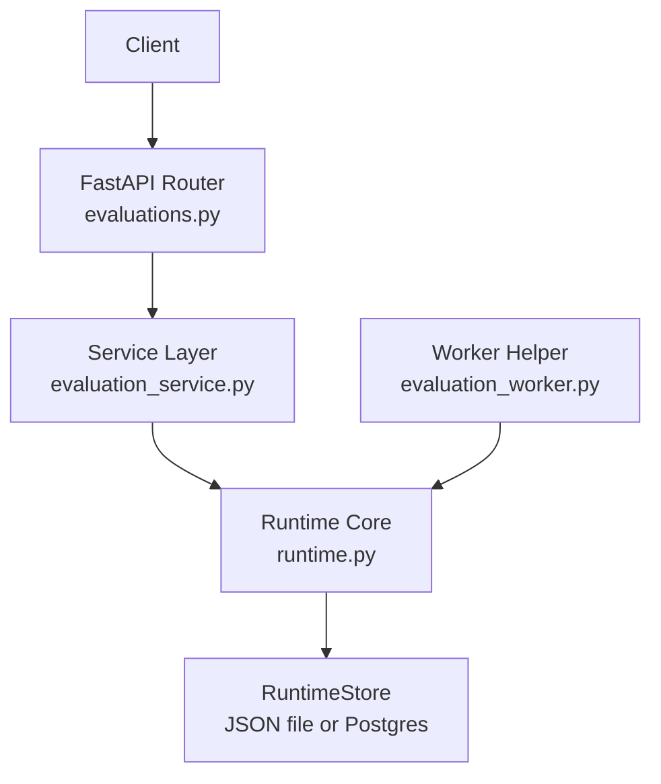
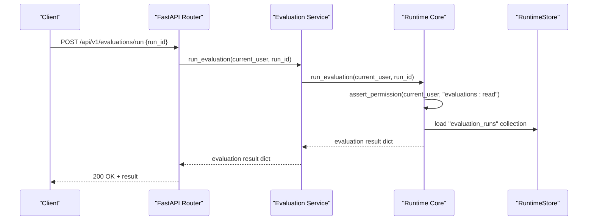
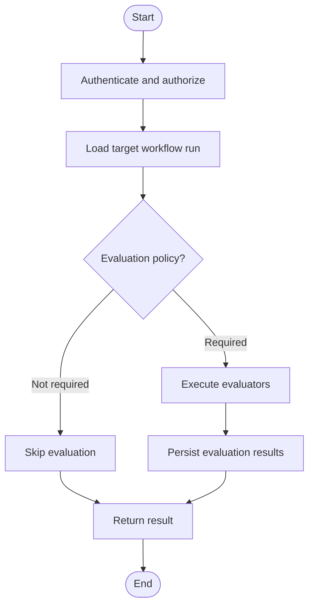
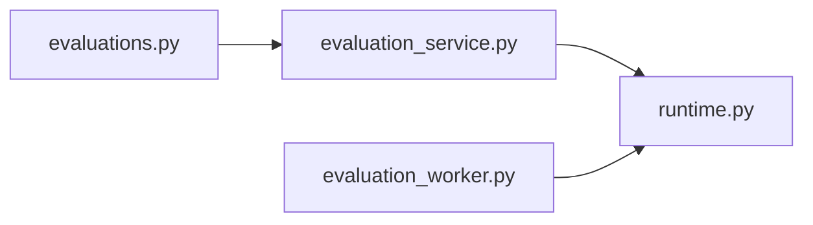

# Built-in Evaluators

<cite>
**Referenced Files in This Document**
- [evaluations.py](file://backend/app/api/v1/routes/evaluations.py)
- [evaluation_service.py](file://backend/app/services/evaluation_service.py)
- [runtime.py](file://backend/app/runtime.py)
- [evaluation_worker.py](file://backend/app/workers/evaluation_worker.py)
- [scaffold_backend.py](file://backend/scripts/scaffold_backend.py)
</cite>

## Table of Contents
1. [Introduction](#introduction)
2. [Project Structure](#project-structure)
3. [Core Components](#core-components)
4. [Architecture Overview](#architecture-overview)
5. [Detailed Component Analysis](#detailed-component-analysis)
6. [Dependency Analysis](#dependency-analysis)
7. [Performance Considerations](#performance-considerations)
8. [Troubleshooting Guide](#troubleshooting-guide)
9. [Conclusion](#conclusion)

## Introduction
This document explains the built-in evaluation evaluators and how they integrate into the system’s evaluation pipeline. It covers:
- What evaluators are and how they fit into workflow execution
- How to use default evaluators for common scenarios (code quality, performance testing, security validation)
- Input requirements and output formats for evaluator runs
- Configuration examples and parameter tuning options
- The end-to-end evaluation pipeline integration and result interpretation

The implementation exposes a minimal API surface that delegates to runtime methods which operate on an in-memory or Postgres-backed store. The current codebase does not include pre-implemented scoring algorithms; it provides the plumbing to create and run evaluations against workflow runs.

## Project Structure
Evaluation-related components are organized across API routes, services, runtime orchestration, and a worker helper:
- API layer: FastAPI router exposing endpoints to list, fetch, and run evaluations
- Service layer: Thin wrappers around runtime methods
- Runtime: Central orchestration with authorization, persistence, and data access
- Worker helper: Utility to refresh or inspect evaluation runs

**Diagram sources**
- [evaluations.py:1-32](file://backend/app/api/v1/routes/evaluations.py#L1-L32)
- [evaluation_service.py:1-18](file://backend/app/services/evaluation_service.py#L1-L18)
- [runtime.py:2669-2699](file://backend/app/runtime.py#L2669-L2699)
- [evaluation_worker.py:1-6](file://backend/app/workers/evaluation_worker.py#L1-L6)

**Section sources**
- [evaluations.py:1-32](file://backend/app/api/v1/routes/evaluations.py#L1-L32)
- [evaluation_service.py:1-18](file://backend/app/services/evaluation_service.py#L1-L18)
- [runtime.py:2669-2699](file://backend/app/runtime.py#L2669-L2699)
- [evaluation_worker.py:1-6](file://backend/app/workers/evaluation_worker.py#L1-L6)

## Core Components
- API Routes: Provide HTTP endpoints to list evaluations, get details, run an evaluation by run_id, and list evaluations for a specific workflow run.
- Service Layer: Delegates calls to runtime methods after authentication checks.
- Runtime: Implements permission checks, data scoping, and persistence. Evaluation operations read/write the “evaluation_runs” collection.
- Worker Helper: Provides a convenience method to count evaluation runs via runtime.

Key responsibilities:
- Authorization: All endpoints require “evaluations:read” permission except run_evaluation which returns results directly.
- Persistence: Uses RuntimeStore backed by JSON file or Postgres depending on configuration.
- Scoping: Data is scoped per organization based on the authenticated user.

**Section sources**
- [evaluations.py:10-31](file://backend/app/api/v1/routes/evaluations.py#L10-L31)
- [evaluation_service.py:4-17](file://backend/app/services/evaluation_service.py#L4-L17)
- [runtime.py:862-866](file://backend/app/runtime.py#L862-L866)
- [runtime.py:868-870](file://backend/app/runtime.py#L868-L870)
- [evaluation_worker.py:4-5](file://backend/app/workers/evaluation_worker.py#L4-L5)

## Architecture Overview
The evaluation flow integrates with workflow runs. A client triggers an evaluation run for a given workflow run ID. The runtime locates the run, applies any configured evaluation policy, executes evaluators (if implemented), and persists results under “evaluation_runs”.

**Diagram sources**
- [evaluations.py:23-25](file://backend/app/api/v1/routes/evaluations.py#L23-L25)
- [evaluation_service.py:12-13](file://backend/app/services/evaluation_service.py#L12-L13)
- [runtime.py:2680-2690](file://backend/app/runtime.py#L2680-L2690)
- [runtime.py:862-866](file://backend/app/runtime.py#L862-L866)

## Detailed Component Analysis

### API Endpoints
- GET /api/v1/evaluations: List all evaluations for the current user’s organization. Requires “evaluations:read”.
- GET /api/v1/evaluations/{evaluation_id}: Get a single evaluation detail. Requires “evaluations:read”.
- POST /api/v1/evaluations/run: Run an evaluation for a given workflow run. Returns the evaluation result.
- GET /api/v1/evaluations/workflow-runs/{run_id}: List evaluations associated with a specific workflow run. Requires “evaluations:read”.

Input requirements:
- Authentication via bearer token or API key.
- For run endpoint, request body must include run_id.

Output format:
- Lists return arrays of evaluation records.
- Detail and run endpoints return a single evaluation record.

**Section sources**
- [evaluations.py:11-14](file://backend/app/api/v1/routes/evaluations.py#L11-L14)
- [evaluations.py:17-20](file://backend/app/api/v1/routes/evaluations.py#L17-L20)
- [evaluations.py:23-25](file://backend/app/api/v1/routes/evaluations.py#L23-L25)
- [evaluations.py:28-31](file://backend/app/api/v1/routes/evaluations.py#L28-L31)

### Service Layer
Thin wrappers that forward calls to runtime methods:
- list_evaluations
- get_evaluation
- run_evaluation
- list_run_evaluations

These functions do not implement business logic beyond delegation and rely on runtime for permissions and persistence.

**Section sources**
- [evaluation_service.py:4-17](file://backend/app/services/evaluation_service.py#L4-L17)

### Runtime Orchestration
- Permission enforcement: All evaluation endpoints assert “evaluations:read”.
- Data access: Uses runtime.list_collection("evaluation_runs") and related helpers to persist and retrieve evaluation results.
- Organization scoping: Collections are filtered by the authenticated user’s organization.

Note: The current runtime methods referenced here provide the operational surface for listing, fetching, and running evaluations. Actual scoring algorithms are not present in this repository snapshot.

**Section sources**
- [runtime.py:2669-2699](file://backend/app/runtime.py#L2669-L2699)
- [runtime.py:862-866](file://backend/app/runtime.py#L862-L866)
- [runtime.py:868-870](file://backend/app/runtime.py#L868-L870)

### Worker Helper
- refresh_evaluations: Returns the number of evaluation runs currently stored. Useful for health checks or background tasks.

**Section sources**
- [evaluation_worker.py:4-5](file://backend/app/workers/evaluation_worker.py#L4-L5)

### Default Evaluators and Scoring Algorithms
- Status: No built-in evaluators with scoring algorithms are implemented in this repository snapshot.
- Integration points: The runtime and service layers expose hooks to execute evaluators and persist results. You can extend these paths to add custom evaluators.

Recommendation: Implement evaluators as pluggable modules invoked from the runtime’s run_evaluation path, then persist their outputs under “evaluation_runs”.

[No sources needed since this section summarizes current status without analyzing specific files]

### Using Default Evaluators for Common Scenarios
Since no default evaluators are implemented, you can wire up your own evaluators for:
- Code quality: Linting, static analysis, coverage thresholds
- Performance testing: Latency, throughput, resource usage metrics
- Security validation: Dependency vulnerability scans, secret detection, SAST/DAST

Steps:
1. Create an evaluator module that computes scores and artifacts.
2. Integrate it into the runtime’s run_evaluation flow.
3. Persist results using the same structure as other evaluation runs.
4. Expose results via the existing evaluation endpoints.

[No sources needed since this section provides general guidance]

### Configuration Examples and Parameter Tuning
- Workflow-level evaluation policy: Workflows can declare an evaluation_policy field indicating whether evaluations are required and whether failures should block execution.
- Example fields:
  - required: boolean flag to enforce evaluation
  - block_on_fail: boolean to halt workflow if evaluation fails

You can set these when creating or updating workflows. The runtime normalizes defaults if missing.

**Section sources**
- [runtime.py:1500-1501](file://backend/app/runtime.py#L1500-L1501)
- [runtime.py:712-713](file://backend/app/runtime.py#L712-L713)

### Evaluation Pipeline Integration
- Trigger: Call POST /api/v1/evaluations/run with run_id.
- Execution: Runtime asserts permissions, loads evaluation_runs, and returns the evaluation result.
- Storage: Results are persisted in the “evaluation_runs” collection.
- Querying: Use GET /api/v1/evaluations and GET /api/v1/evaluations/workflow-runs/{run_id} to view results.

[No sources needed since this diagram shows conceptual workflow, not actual code structure]

### Result Interpretation
- Each evaluation run is stored as a record in “evaluation_runs”.
- Typical fields may include:
  - id: unique identifier
  - run_id: reference to the workflow run
  - status: success/failure
  - score: numeric or categorical outcome
  - artifacts: links or payloads produced by evaluators
  - timestamps: created_at, completed_at
- Use the list and detail endpoints to retrieve and interpret these fields.

[No sources needed since this section provides general guidance]

## Dependency Analysis
The evaluation subsystem depends on:
- FastAPI router for HTTP exposure
- Service layer for delegation
- Runtime for authorization, persistence, and data scoping
- Worker helper for auxiliary operations

**Diagram sources**
- [evaluations.py:1-32](file://backend/app/api/v1/routes/evaluations.py#L1-L32)
- [evaluation_service.py:1-18](file://backend/app/services/evaluation_service.py#L1-L18)
- [runtime.py:2669-2699](file://backend/app/runtime.py#L2669-L2699)
- [evaluation_worker.py:1-6](file://backend/app/workers/evaluation_worker.py#L1-L6)

**Section sources**
- [evaluations.py:1-32](file://backend/app/api/v1/routes/evaluations.py#L1-L32)
- [evaluation_service.py:1-18](file://backend/app/services/evaluation_service.py#L1-L18)
- [runtime.py:2669-2699](file://backend/app/runtime.py#L2669-L2699)
- [evaluation_worker.py:1-6](file://backend/app/workers/evaluation_worker.py#L1-L6)

## Performance Considerations
- Keep evaluator implementations efficient and bounded in time/memory.
- Avoid heavy I/O inside hot paths; consider offloading to background workers if needed.
- Use pagination and filtering at the API layer when listing large sets of evaluations.
- Monitor “evaluation_runs” collection size and archive old results periodically.

[No sources needed since this section provides general guidance]

## Troubleshooting Guide
Common issues:
- Permission denied: Ensure the caller has “evaluations:read” permission.
- Not found: Verify the evaluation_id or run_id exists within the organization scope.
- Empty results: Confirm that evaluations have been executed and persisted.

Operational tips:
- Use the worker helper to quickly check the number of evaluation runs.
- Inspect the “evaluation_runs” collection directly via runtime.list_collection for diagnostics.

**Section sources**
- [evaluations.py:13-14](file://backend/app/api/v1/routes/evaluations.py#L13-L14)
- [evaluation_worker.py:4-5](file://backend/app/workers/evaluation_worker.py#L4-L5)
- [runtime.py:868-870](file://backend/app/runtime.py#L868-L870)

## Conclusion
The evaluation subsystem provides a clean API and runtime integration for running and querying evaluations tied to workflow runs. While no built-in scoring evaluators are implemented in this snapshot, the architecture supports adding custom evaluators for code quality, performance, and security validation. Configure workflow-level policies to enforce evaluation requirements and tune behavior. Use the provided endpoints to trigger runs and interpret results.