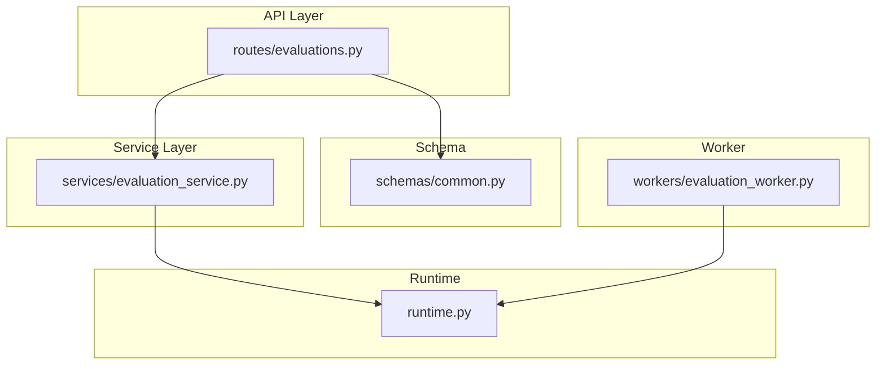
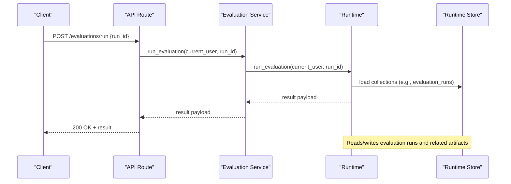
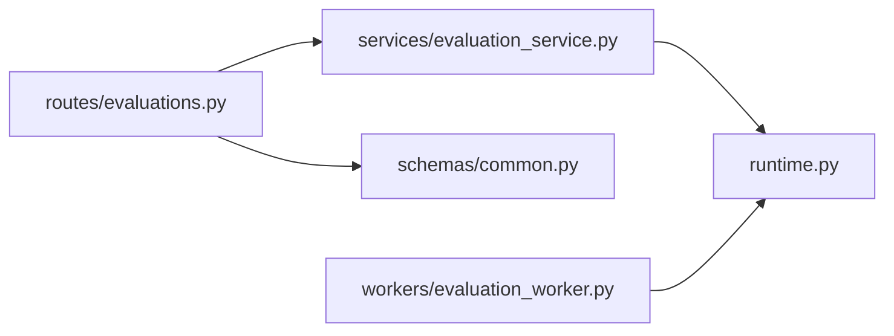
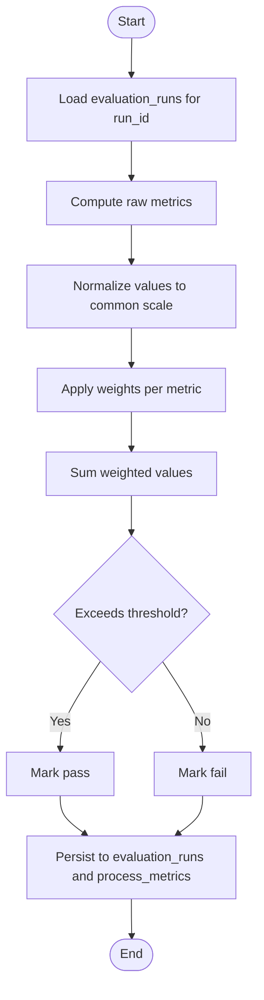

# Custom Metrics & Scoring

<cite>
**Referenced Files in This Document**
- [evaluations.py](file://backend/app/api/v1/routes/evaluations.py)
- [evaluation_service.py](file://backend/app/services/evaluation_service.py)
- [common.py](file://backend/app/schemas/common.py)
- [runtime.py](file://backend/app/runtime.py)
- [evaluation_worker.py](file://backend/app/workers/evaluation_worker.py)
</cite>

## Table of Contents
1. [Introduction](#introduction)
2. [Project Structure](#project-structure)
3. [Core Components](#core-components)
4. [Architecture Overview](#architecture-overview)
5. [Detailed Component Analysis](#detailed-component-analysis)
6. [Dependency Analysis](#dependency-analysis)
7. [Performance Considerations](#performance-considerations)
8. [Troubleshooting Guide](#troubleshooting-guide)
9. [Conclusion](#conclusion)
10. [Appendices](#appendices)

## Introduction
This document explains how to create custom metrics and scoring mechanisms within the evaluation system. It covers:
- The metric definition schema and where it is declared
- Calculation methods and aggregation strategies
- How to implement custom evaluators using provided interfaces
- Composite score calculations, weighted scoring systems, and threshold configurations
- Practical examples of domain-specific metrics
- Integration with existing evaluation workflows

The goal is to enable you to define, compute, aggregate, and persist evaluation results that integrate seamlessly with workflow runs and governance policies.

## Project Structure
Evaluation-related code spans API routes, services, schemas, runtime orchestration, and a worker utility. The key files are:
- API route for evaluations
- Service layer delegating to runtime
- Pydantic request schema for running evaluations
- Runtime implementation providing list/get/run/list-by-run operations
- Worker helper for evaluation run counts

**Diagram sources**
- [evaluations.py:1-32](file://backend/app/api/v1/routes/evaluations.py#L1-L32)
- [evaluation_service.py:1-18](file://backend/app/services/evaluation_service.py#L1-L18)
- [common.py:212-214](file://backend/app/schemas/common.py#L212-L214)
- [runtime.py:2669-2691](file://backend/app/runtime.py#L2669-L2691)
- [evaluation_worker.py:1-6](file://backend/app/workers/evaluation_worker.py#L1-L6)

**Section sources**
- [evaluations.py:1-32](file://backend/app/api/v1/routes/evaluations.py#L1-L32)
- [evaluation_service.py:1-18](file://backend/app/services/evaluation_service.py#L1-L18)
- [common.py:212-214](file://backend/app/schemas/common.py#L212-L214)
- [runtime.py:2669-2691](file://backend/app/runtime.py#L2669-L2691)
- [evaluation_worker.py:1-6](file://backend/app/workers/evaluation_worker.py#L1-L6)

## Core Components
- Evaluation Run Request Schema: A minimal request body used by the run endpoint.
- API Routes: Expose endpoints to list evaluations, get details, run an evaluation, and list evaluations for a workflow run.
- Service Layer: Thin delegation to runtime methods after permission checks.
- Runtime: Central orchestrator for evaluation data access and execution.
- Worker: Utility to refresh or inspect evaluation runs.

Key responsibilities:
- Define the input contract for running evaluations (run_id).
- Provide read-only listing and detail retrieval for evaluations.
- Execute evaluation runs and return results.
- Aggregate evaluation results per workflow run.

**Section sources**
- [common.py:212-214](file://backend/app/schemas/common.py#L212-L214)
- [evaluations.py:11-31](file://backend/app/api/v1/routes/evaluations.py#L11-L31)
- [evaluation_service.py:4-17](file://backend/app/services/evaluation_service.py#L4-L17)
- [runtime.py:2669-2691](file://backend/app/runtime.py#L2669-L2691)
- [evaluation_worker.py:4-5](file://backend/app/workers/evaluation_worker.py#L4-L5)

## Architecture Overview
The evaluation flow integrates with the runtime store and supports both synchronous invocation via API and background inspection via workers.

**Diagram sources**
- [evaluations.py:23-25](file://backend/app/api/v1/routes/evaluations.py#L23-L25)
- [evaluation_service.py:12-13](file://backend/app/services/evaluation_service.py#L12-L13)
- [runtime.py:2680-2689](file://backend/app/runtime.py#L2680-L2689)

## Detailed Component Analysis

### API Layer: Evaluations Endpoints
Responsibilities:
- Enforce permissions on all evaluation endpoints.
- Accept run requests using the EvaluationRunRequest schema.
- Delegate to service layer for business logic.

Endpoints:
- GET /evaluations: List evaluations
- GET /evaluations/{evaluation_id}: Get evaluation detail
- POST /evaluations/run: Run an evaluation by run_id
- GET /evaluations/workflow-runs/{run_id}: List evaluations for a workflow run

Permissions:
- All endpoints require evaluations:read.

Input Contract:
- POST /evaluations/run expects EvaluationRunRequest with run_id.

Output:
- Returns evaluation result payloads defined by runtime.

**Section sources**
- [evaluations.py:11-31](file://backend/app/api/v1/routes/evaluations.py#L11-L31)
- [common.py:212-214](file://backend/app/schemas/common.py#L212-L214)

### Service Layer: Evaluation Service
Responsibilities:
- Wrap runtime calls with consistent signatures.
- Keep API layer thin and focused on HTTP concerns.

Methods:
- list_evaluations(current_user) -> list[dict]
- get_evaluation(current_user, evaluation_id) -> dict
- run_evaluation(current_user, run_id) -> dict
- list_run_evaluations(current_user, run_id) -> list[dict]

**Section sources**
- [evaluation_service.py:4-17](file://backend/app/services/evaluation_service.py#L4-L17)

### Runtime: Evaluation Orchestration
Responsibilities:
- Implement core evaluation operations.
- Access persistent collections such as evaluation_runs.
- Return structured results suitable for API responses.

Key Methods:
- list_evaluations(current_user) -> list[dict]
- get_evaluation(current_user, evaluation_id) -> dict
- run_evaluation(current_user, run_id) -> dict
- list_run_evaluations(current_user, run_id) -> list[dict]

Notes:
- These methods are the canonical place to implement custom metric computations and aggregations.
- They can read from and write to runtime collections like evaluation_runs and process_metrics.

**Section sources**
- [runtime.py:2669-2691](file://backend/app/runtime.py#L2669-L2691)

### Worker: Evaluation Refresh Helper
Responsibilities:
- Provide a simple way to refresh or count evaluation runs.

Method:
- refresh_evaluations() -> int: returns length of evaluation_runs collection.

Use cases:
- Background jobs to recompute scores.
- Health checks or dashboards showing evaluation coverage.

**Section sources**
- [evaluation_worker.py:4-5](file://backend/app/workers/evaluation_worker.py#L4-L5)

### Data Model and Persistence
Collections relevant to evaluations:
- evaluation_runs: Stores individual evaluation results keyed by run_id.
- process_metrics: Aggregated metrics that may include composite scores.

Recommendation:
- Persist each evaluation result under evaluation_runs with fields such as run_id, metric_name, value, timestamp, metadata.
- Maintain aggregated summaries in process_metrics for dashboarding and thresholds.

**Section sources**
- [runtime.py:2669-2691](file://backend/app/runtime.py#L2669-L2691)
- [evaluation_worker.py:4-5](file://backend/app/workers/evaluation_worker.py#L4-L5)

## Dependency Analysis
High-level dependencies:
- API depends on Service and Schema.
- Service depends on Runtime.
- Worker depends on Runtime.

**Diagram sources**
- [evaluations.py:1-32](file://backend/app/api/v1/routes/evaluations.py#L1-L32)
- [evaluation_service.py:1-18](file://backend/app/services/evaluation_service.py#L1-L18)
- [common.py:212-214](file://backend/app/schemas/common.py#L212-L214)
- [runtime.py:2669-2691](file://backend/app/runtime.py#L2669-L2691)
- [evaluation_worker.py:1-6](file://backend/app/workers/evaluation_worker.py#L1-L6)

**Section sources**
- [evaluations.py:1-32](file://backend/app/api/v1/routes/evaluations.py#L1-L32)
- [evaluation_service.py:1-18](file://backend/app/services/evaluation_service.py#L1-L18)
- [common.py:212-214](file://backend/app/schemas/common.py#L212-L214)
- [runtime.py:2669-2691](file://backend/app/runtime.py#L2669-L2691)
- [evaluation_worker.py:1-6](file://backend/app/workers/evaluation_worker.py#L1-L6)

## Performance Considerations
- Batch computation: When implementing custom metrics in runtime.run_evaluation, batch reads from evaluation_runs and process_metrics to minimize I/O.
- Idempotency: Ensure repeated runs for the same run_id produce identical results; use deterministic keys and avoid non-deterministic randomness without seeds.
- Indexing: If using Postgres JSONB, consider indexing frequently filtered fields in evaluation_runs (e.g., run_id, metric_name).
- Caching: Cache expensive metric computations keyed by run_id and inputs to avoid recomputation during retries.
- Concurrency: Use thread-safe writes when updating process_metrics; leverage existing locks in RuntimeStore if needed.

## Troubleshooting Guide
Common issues and resolutions:
- Permission errors: Ensure the caller has evaluations:read. Verify role mappings in runtime.
- Missing run_id: Validate EvaluationRunRequest before invoking runtime.run_evaluation.
- Empty results: Confirm evaluation_runs collection contains entries for the requested run_id.
- Stale aggregates: Trigger refresh_evaluations or re-run evaluation to update process_metrics.

Operational tips:
- Use GET /evaluations/workflow-runs/{run_id} to verify evaluation coverage for a specific run.
- Inspect evaluation_runs directly via runtime.list_collection("evaluation_runs") for debugging.

**Section sources**
- [evaluations.py:11-31](file://backend/app/api/v1/routes/evaluations.py#L11-L31)
- [evaluation_service.py:4-17](file://backend/app/services/evaluation_service.py#L4-L17)
- [runtime.py:2669-2691](file://backend/app/runtime.py#L2669-L2691)
- [evaluation_worker.py:4-5](file://backend/app/workers/evaluation_worker.py#L4-L5)

## Conclusion
The evaluation subsystem provides a clear extension point for custom metrics and scoring through the runtime layer. By defining metrics in evaluation_runs and aggregating them into process_metrics, you can implement composite scores, weighted systems, and thresholds while integrating smoothly with workflow runs and governance policies.

## Appendices

### Metric Definition Schema
Recommended fields for each metric entry in evaluation_runs:
- run_id: string
- metric_name: string
- value: number
- unit: string (optional)
- timestamp: ISO datetime
- metadata: object (optional)

Aggregation strategy:
- Compute per-run metrics and append to evaluation_runs.
- Aggregate across runs into process_metrics using mean, median, min/max, percentiles as needed.

Composite Score Calculation Flow

Weighted Scoring System
- Define weights per metric ensuring they sum to 1.0.
- Normalize each metric to [0,1] before weighting.
- Composite = sum(weight_i * normalized_value_i).

Threshold Configuration
- Global thresholds: stored in process_metrics configuration.
- Per-metric thresholds: stored in metric metadata.
- Gate behavior: block_on_fail can be enforced at workflow level.

Practical Examples
- Code Quality Score: Combine static analysis, test coverage, and review completion rates.
- Security Risk Score: Weight vulnerability severity, exposure surface, and remediation time.
- Process Efficiency Score: Measure cycle time, throughput, and error rate.

Integration with Existing Workflows
- Attach fitness_metrics to workflow definitions to auto-trigger evaluations.
- Use governance policies to enforce thresholds and human gates.
- Surface results in UI via GET /evaluations and GET /evaluations/workflow-runs/{run_id}.