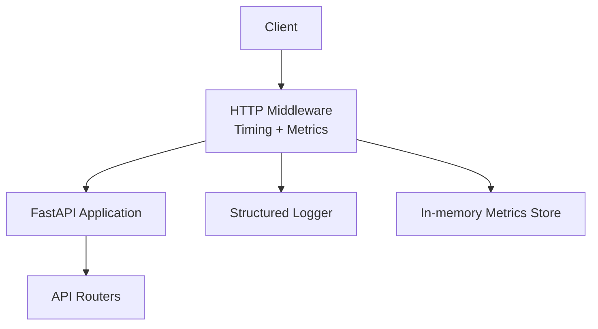
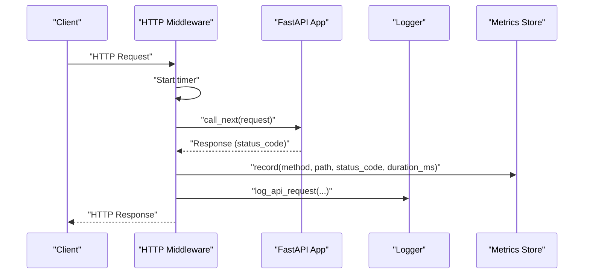
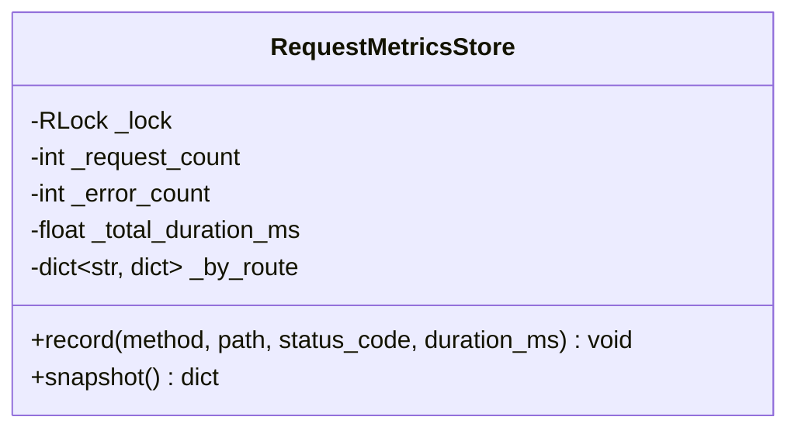
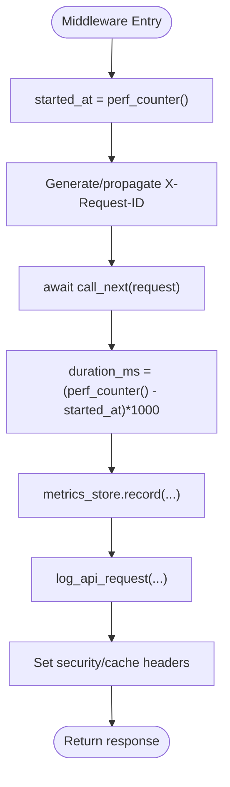
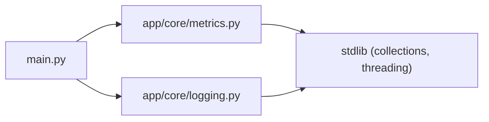

# Performance Benchmarking

<cite>
**Referenced Files in This Document**
- [metrics.py](file://backend/app/core/metrics.py)
- [main.py](file://backend/app/main.py)
- [logging.py](file://backend/app/core/logging.py)
</cite>

## Table of Contents
1. [Introduction](#introduction)
2. [Project Structure](#project-structure)
3. [Core Components](#core-components)
4. [Architecture Overview](#architecture-overview)
5. [Detailed Component Analysis](#detailed-component-analysis)
6. [Dependency Analysis](#dependency-analysis)
7. [Performance Considerations](#performance-considerations)
8. [Troubleshooting Guide](#troubleshooting-guide)
9. [Conclusion](#conclusion)
10. [Appendices](#appendices)

## Introduction
This document defines a performance benchmarking and efficiency measurement strategy for the backend service. It focuses on:
- Measuring request latency, throughput, and error rates per route
- Establishing baselines and detecting regressions
- Tracking resource utilization and cost-related metrics
- Creating and scheduling benchmark suites
- Comparing results across runs and environments
- Profiling to identify bottlenecks and plan capacity

The approach leverages existing middleware-based instrumentation and structured logging to collect actionable data without invasive changes.

## Project Structure
The performance measurement capability is implemented as an HTTP middleware that records timing and status information for each request and persists aggregated metrics in-process. Structured logs are emitted for observability and downstream analysis.

**Diagram sources**
- [main.py:27-48](file://backend/app/main.py#L27-L48)
- [metrics.py:7-49](file://backend/app/core/metrics.py#L7-L49)
- [logging.py:11-31](file://backend/app/core/logging.py#L11-L31)

**Section sources**
- [main.py:27-48](file://backend/app/main.py#L27-L48)
- [metrics.py:7-49](file://backend/app/core/metrics.py#L7-L49)
- [logging.py:11-31](file://backend/app/core/logging.py#L11-L31)

## Core Components
- RequestMetricsStore: Thread-safe aggregator tracking total requests, errors, durations, and per-route breakdowns. Provides snapshots with computed averages.
- HTTP Middleware: Measures end-to-end request duration using high-resolution timers, assigns a request ID, updates metrics, emits structured logs, and sets security headers.
- Structured Logger: Emits JSON-formatted request logs including method, path, status code, duration, and client IP.

Key responsibilities:
- Latency measurement at the HTTP boundary
- Error counting by status code thresholds
- Per-route aggregation for granular insights
- Stable snapshot interface for exporters or dashboards

**Section sources**
- [metrics.py:7-49](file://backend/app/core/metrics.py#L7-L49)
- [main.py:27-48](file://backend/app/main.py#L27-L48)
- [logging.py:11-31](file://backend/app/core/logging.py#L11-L31)

## Architecture Overview
The runtime flow captures timing around each request, aggregates metrics, and writes structured logs. The metrics store is process-scoped; externalization can be added via periodic snapshots.

**Diagram sources**
- [main.py:27-48](file://backend/app/main.py#L27-L48)
- [metrics.py:15-45](file://backend/app/core/metrics.py#L15-L45)
- [logging.py:11-31](file://backend/app/core/logging.py#L11-L31)

## Detailed Component Analysis

### RequestMetricsStore
- Purpose: In-process, thread-safe aggregation of request counts, errors, and durations with per-route breakdowns.
- Data model:
  - Global counters: request_count, error_count, total_duration_ms
  - Per-route map keyed by "METHOD /path" with count, errors, duration_ms
- Operations:
  - record(method, path, status_code, duration_ms): increments counters and per-route stats; treats status >= 400 as error
  - snapshot(): returns a dict with global averages and per-route summaries including average_duration_ms
- Concurrency: Uses a reentrant lock to ensure safe concurrent updates and consistent snapshots
- Complexity:
  - record: O(1)
  - snapshot: O(R) where R is number of unique routes observed since last reset

**Diagram sources**
- [metrics.py:7-49](file://backend/app/core/metrics.py#L7-L49)

**Section sources**
- [metrics.py:7-49](file://backend/app/core/metrics.py#L7-L49)

### HTTP Middleware
- Responsibilities:
  - High-resolution timing around request processing
  - Assign and propagate X-Request-ID
  - Update metrics via RequestMetricsStore.record
  - Emit structured JSON log via log_api_request
  - Set security and cache-control response headers
- Timing source: perf_counter for sub-millisecond precision
- Integration: Registered as FastAPI HTTP middleware and includes API routers under configured prefix

**Diagram sources**
- [main.py:27-48](file://backend/app/main.py#L27-L48)

**Section sources**
- [main.py:27-48](file://backend/app/main.py#L27-L48)

### Structured Logger
- Emits JSON lines with fields: request_id, method, path, status_code, duration_ms, client_ip
- Useful for log aggregation systems and post-processing into dashboards or alerting

**Section sources**
- [logging.py:11-31](file://backend/app/core/logging.py#L11-L31)

## Dependency Analysis
- main.py depends on:
  - app.core.metrics.RequestMetricsStore for aggregation
  - app.core.logging.log_api_request for structured output
  - FastAPI middleware and router inclusion
- metrics.py is self-contained with only stdlib dependencies
- logging.py is self-contained with stdlib logging and json

**Diagram sources**
- [main.py:1-52](file://backend/app/main.py#L1-L52)
- [metrics.py:1-49](file://backend/app/core/metrics.py#L1-L49)
- [logging.py:1-46](file://backend/app/core/logging.py#L1-46)

**Section sources**
- [main.py:1-52](file://backend/app/main.py#L1-L52)
- [metrics.py:1-49](file://backend/app/core/metrics.py#L1-L49)
- [logging.py:1-46](file://backend/app/core/logging.py#L1-46)

## Performance Considerations
- Measurement overhead:
  - perf_counter has minimal overhead; suitable for per-request timing
  - Avoid heavy work inside middleware; keep it focused on timing, IDs, and metric recording
- Aggregation strategy:
  - Use snapshot() periodically to export metrics externally (e.g., Prometheus, OpenTelemetry, or file sinks)
  - Consider resetting counters after export if you need windowed metrics
- Concurrency:
  - The store uses a reentrant lock; ensure snapshot frequency does not contend excessively under high load
- Observability:
  - Ensure X-Request-ID propagation across workers/services for correlation
  - Centralize logs to enable percentile computations (p50/p95/p99) and anomaly detection

[No sources needed since this section provides general guidance]

## Troubleshooting Guide
Common issues and resolutions:
- Missing latency data:
  - Verify middleware registration and that all routes pass through it
  - Confirm perf_counter usage and duration calculation
- Incorrect error counts:
  - Check status code threshold logic (>= 400 treated as error)
- No logs or malformed entries:
  - Validate logger configuration and JSON serialization
- High contention on metrics store:
  - Reduce snapshot frequency or shard metrics by worker/process
- Correlation gaps:
  - Ensure X-Request-ID is present in upstream/downstream calls and persisted in logs

**Section sources**
- [main.py:27-48](file://backend/app/main.py#L27-L48)
- [metrics.py:15-45](file://backend/app/core/metrics.py#L15-L45)
- [logging.py:11-31](file://backend/app/core/logging.py#L11-L31)

## Conclusion
The backend implements lightweight, accurate request-level performance instrumentation via middleware and structured logging. With these building blocks, teams can establish baselines, detect regressions, profile hotspots, and plan capacity effectively. Extending the system with periodic exports and external collectors will unlock advanced analytics and alerting.

[No sources needed since this section summarizes without analyzing specific files]

## Appendices

### Benchmark Suite Creation and Execution
- Define scenarios:
  - Read-heavy, write-heavy, mixed workloads
  - Target endpoints and payload sizes
  - Concurrency levels and ramp-up profiles
- Tools:
  - Use any HTTP load generator compatible with your environment
  - Configure target URLs, headers (including X-Request-ID), and authentication
- Scheduling:
  - Run benchmarks on CI for every change and nightly for drift detection
  - Tag runs with commit SHA, branch, and environment metadata

### Baseline Establishment and Regression Detection
- Baselines:
  - Capture p50/p95/p99 latency, throughput (RPS), and error rate per route
  - Store results with run metadata (commit, date, environment, config)
- Regression rules:
  - Alert if p95 latency increases beyond a threshold compared to baseline
  - Alert if error rate exceeds acceptable limits
  - Require manual approval for intentional regressions

### Cost Analysis Metrics
- Map resource usage to cost drivers:
  - CPU time proportional to compute cost
  - I/O and network bandwidth costs
  - External API calls and database queries
- Track:
  - Requests per dollar (throughput/cost)
  - Average cost per request (derived from resource usage and pricing)
  - Cost by route or feature area

### Resource Utilization Tracking
- Collect:
  - Process CPU and memory usage
  - OS-level metrics (CPU, memory, disk I/O, network)
  - Database query latency and connection pool saturation
- Integrate:
  - Exporters to monitoring systems
  - Correlate with request metrics and logs using X-Request-ID

### Optimization Insights
- Identify hotspots:
  - Routes with highest p95 latency or error rates
  - Long-tail outliers correlated with slow downstream calls
- Actions:
  - Cache frequently accessed data
  - Optimize database queries and indexes
  - Parallelize independent operations
  - Tune concurrency limits and timeouts

### Capacity Planning
- Use historical trends:
  - Forecast growth in traffic and resource consumption
  - Size autoscaling policies based on latency SLOs and error budgets
- Stress testing:
  - Validate scaling behavior under projected peak loads
  - Measure degradation points and recovery times

### Example: Profiling and Bottleneck Identification
- Steps:
  - Instrument key services and DB calls
  - Profile CPU/memory hotspots during representative workloads
  - Correlate with request traces using X-Request-ID
- Outputs:
  - Flame graphs, trace spans, and per-route latency distributions
  - Actionable recommendations for optimization

[No sources needed since this section provides general guidance]