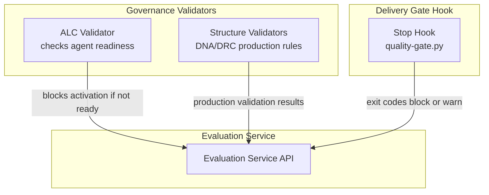
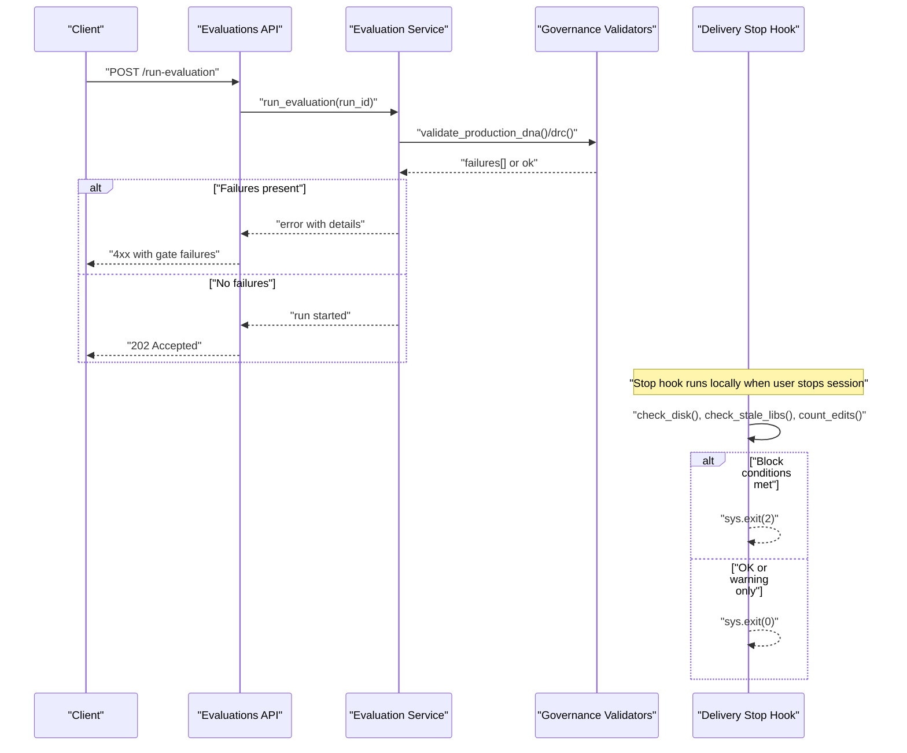
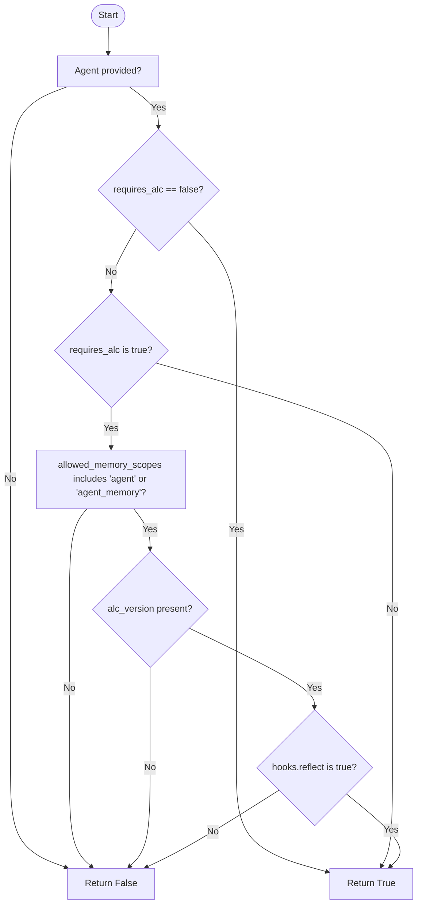
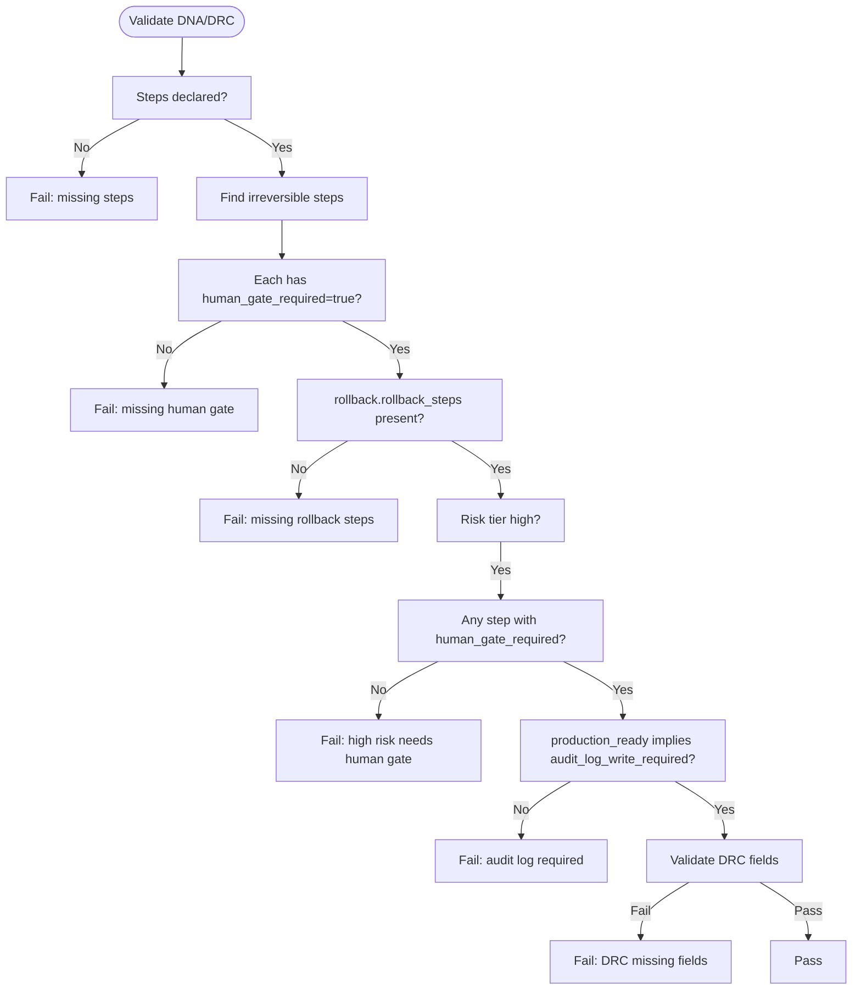
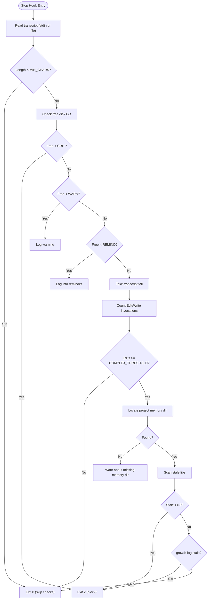
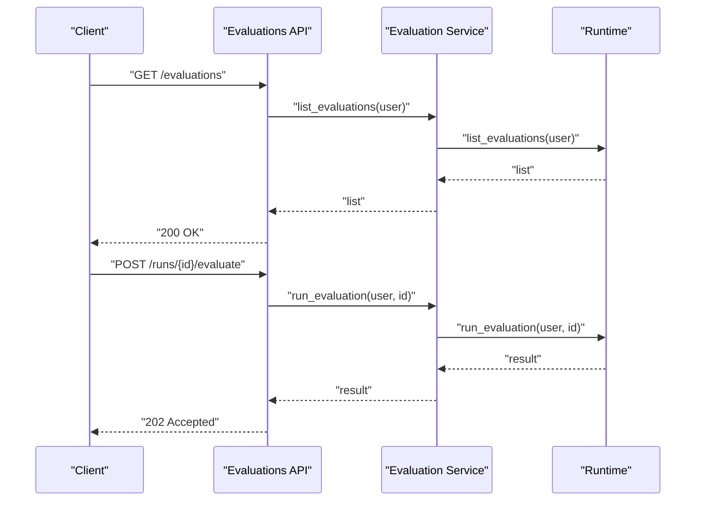
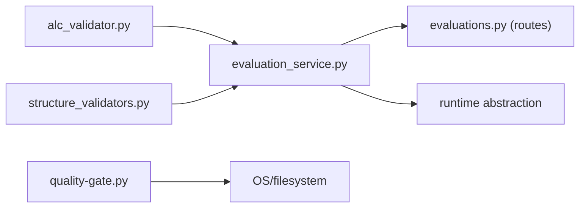

# Quality Gates & Thresholds

<cite>
**Referenced Files in This Document**
- [alc_validator.py](file://backend/app/infrastructure/governance/alc_validator.py)
- [structure_validators.py](file://backend/app/infrastructure/governance/structure_validators.py)
- [quality-gate.py](file://external/sources/ecc/skills/delivery-gate/hooks/quality-gate.py)
- [evaluation_service.py](file://backend/app/services/evaluation_service.py)
- [evaluations.py (API routes)](file://backend/app/api/v1/routes/evaluations.py)
- [governance.py (API routes)](file://backend/app/api/v1/routes/governance.py)
</cite>

## Table of Contents
1. Introduction
2. Project Structure
3. Core Components
4. Architecture Overview
5. Detailed Component Analysis
6. Dependency Analysis
7. Performance Considerations
8. Troubleshooting Guide
9. Conclusion

## Introduction
This document explains how quality gates and thresholds are defined, enforced, and monitored within the evaluation system. It covers:
- How to configure pass/fail criteria and quality thresholds
- How automated decision rules evaluate artifacts and runs
- Gate enforcement mechanisms, including blocking behaviors and escalation
- Override procedures for exceptional cases
- Examples of business rule definitions, compliance checks, and deployment approval gates
- Monitoring and alerting strategies for gate violations

The content is grounded in the repository’s governance validators, delivery gate hook, and evaluation service integration points.

## Project Structure
Quality gates span multiple layers:
- Governance validators enforce structural and policy requirements on artifacts (e.g., workflow DNA, decision requirement cards).
- A delivery gate stop hook enforces local development hygiene and learning capture before stopping a session.
- Evaluation services expose endpoints to list, run, and inspect evaluations that can be used as inputs to gates.

**Diagram sources**
- [alc_validator.py:1-50](file://backend/app/infrastructure/governance/alc_validator.py#L1-L50)
- [structure_validators.py:1-62](file://backend/app/infrastructure/governance/structure_validators.py#L1-L62)
- [quality-gate.py:1-221](file://external/sources/ecc/skills/delivery-gate/hooks/quality-gate.py#L1-L221)
- [evaluation_service.py:1-18](file://backend/app/services/evaluation_service.py#L1-L18)

**Section sources**
- [alc_validator.py:1-50](file://backend/app/infrastructure/governance/alc_validator.py#L1-L50)
- [structure_validators.py:1-62](file://backend/app/infrastructure/governance/structure_validators.py#L1-L62)
- [quality-gate.py:1-221](file://external/sources/ecc/skills/delivery-gate/hooks/quality-gate.py#L1-L221)
- [evaluation_service.py:1-18](file://backend/app/services/evaluation_service.py#L1-L18)
- [evaluations.py (API routes)](file://backend/app/api/v1/routes/evaluations.py)
- [governance.py (API routes)](file://backend/app/api/v1/routes/governance.py)

## Core Components
- ALC Readiness Gate: Ensures agents meet minimum safety and memory-scoping requirements before activation.
- Production DNA/DRC Gate: Validates workflow DNA and decision requirement cards against production policies.
- Delivery Stop Hook Gate: Enforces local development hygiene, disk space, and learning capture before stopping a session.
- Evaluation Service Integration: Provides APIs to list/run evaluations; gate outcomes can be surfaced via these endpoints.

Key responsibilities:
- Define thresholds (e.g., disk space levels, number of stale libraries, edit counts).
- Produce deterministic pass/fail signals (boolean checks, exit codes, error types).
- Surface results through APIs for monitoring and dashboards.

**Section sources**
- [alc_validator.py:1-50](file://backend/app/infrastructure/governance/alc_validator.py#L1-L50)
- [structure_validators.py:1-62](file://backend/app/infrastructure/governance/structure_validators.py#L1-L62)
- [quality-gate.py:1-221](file://external/sources/ecc/skills/delivery-gate/hooks/quality-gate.py#L1-L221)
- [evaluation_service.py:1-18](file://backend/app/services/evaluation_service.py#L1-L18)

## Architecture Overview
The following sequence shows how a typical evaluation run interacts with governance and delivery gates.

**Diagram sources**
- [evaluation_service.py:1-18](file://backend/app/services/evaluation_service.py#L1-L18)
- [evaluations.py (API routes)](file://backend/app/api/v1/routes/evaluations.py)
- [structure_validators.py:1-62](file://backend/app/infrastructure/governance/structure_validators.py#L1-L62)
- [quality-gate.py:1-221](file://external/sources/ecc/skills/delivery-gate/hooks/quality-gate.py#L1-L221)

## Detailed Component Analysis

### ALC Readiness Gate
Purpose: Prevent activation of agents that do not satisfy required memory scoping, versioning, and reflection hooks.

Behavior highlights:
- Opt-out path for platform seed agents without requires_alc.
- Requires explicit requires_alc=true, alc_version set, allowed_memory_scopes includes agent scope, and hooks.reflect enabled.
- Raises a specific exception type to signal blocking condition.

Configuration knobs:
- Agent fields: requires_alc, alc_version, allowed_memory_scopes, hooks.reflect.

Override procedure:
- Explicitly set requires_alc=false for legacy seed agents where appropriate.

**Diagram sources**
- [alc_validator.py:1-50](file://backend/app/infrastructure/governance/alc_validator.py#L1-L50)

**Section sources**
- [alc_validator.py:1-50](file://backend/app/infrastructure/governance/alc_validator.py#L1-L50)

### Production DNA and Decision Requirement Card Gates
Purpose: Ensure workflow DNA and decision requirement cards meet production-readiness policies.

Business rules enforced:
- Workflow DNA must declare steps.
- Irreversible steps require human_gate_required=true and rollback.rollback_steps.
- High-risk workflows must include at least one human-gated step.
- Production-ready DNA must require audit log writes.
- Decision requirement cards must have expert_sources, provenance.source_refs, last_reviewed, and validation_tests for production.

Thresholds and decisions:
- Risk tier detection triggers additional human-gating requirements.
- Boolean flags drive whether checks apply (e.g., for_production).

**Diagram sources**
- [structure_validators.py:1-62](file://backend/app/infrastructure/governance/structure_validators.py#L1-L62)

**Section sources**
- [structure_validators.py:1-62](file://backend/app/infrastructure/governance/structure_validators.py#L1-L62)

### Delivery Stop Hook Gate
Purpose: Enforce local development hygiene and learning capture before allowing a session to stop.

Thresholds and behavior:
- Disk space:
  - Critical threshold blocks stop (exit code 2).
  - Warning threshold logs a warning.
  - Reminder threshold logs an info message.
- Complexity detection:
  - Counts Edit/Write tool invocations in transcript tail.
  - If edits >= threshold, treats task as complex.
- Learning capture:
  - Checks staleness of library files/directories updated today.
  - Blocks stop if too many libraries are stale or growth-log is missing after code changes.

Override procedure:
- No hard override; users must update stale libraries or growth-log to proceed.
- If no project memory directory exists, warnings are logged but stop is not blocked to avoid deadlocking new setups.

**Diagram sources**
- [quality-gate.py:1-221](file://external/sources/ecc/skills/delivery-gate/hooks/quality-gate.py#L1-L221)

**Section sources**
- [quality-gate.py:1-221](file://external/sources/ecc/skills/delivery-gate/hooks/quality-gate.py#L1-L221)

### Evaluation Service Integration
Purpose: Provide APIs to list, retrieve, and run evaluations; gate results can be surfaced through these endpoints.

Typical flow:
- Clients call evaluation endpoints to start runs.
- Services may invoke governance validators to ensure preconditions.
- Results and statuses are returned to clients for dashboards and automation.

**Diagram sources**
- [evaluation_service.py:1-18](file://backend/app/services/evaluation_service.py#L1-L18)
- [evaluations.py (API routes)](file://backend/app/api/v1/routes/evaluations.py)

**Section sources**
- [evaluation_service.py:1-18](file://backend/app/services/evaluation_service.py#L1-L18)
- [evaluations.py (API routes)](file://backend/app/api/v1/routes/evaluations.py)

## Dependency Analysis
- Governance validators are independent utilities consumed by services or orchestrators.
- The delivery stop hook is executed by the local environment and uses filesystem operations and regex scanning.
- Evaluation service depends on runtime abstractions and exposes HTTP endpoints.

**Diagram sources**
- [evaluation_service.py:1-18](file://backend/app/services/evaluation_service.py#L1-L18)
- [evaluations.py (API routes)](file://backend/app/api/v1/routes/evaluations.py)
- [alc_validator.py:1-50](file://backend/app/infrastructure/governance/alc_validator.py#L1-L50)
- [structure_validators.py:1-62](file://backend/app/infrastructure/governance/structure_validators.py#L1-L62)
- [quality-gate.py:1-221](file://external/sources/ecc/skills/delivery-gate/hooks/quality-gate.py#L1-L221)

**Section sources**
- [evaluation_service.py:1-18](file://backend/app/services/evaluation_service.py#L1-L18)
- [evaluations.py (API routes)](file://backend/app/api/v1/routes/evaluations.py)
- [alc_validator.py:1-50](file://backend/app/infrastructure/governance/alc_validator.py#L1-L50)
- [structure_validators.py:1-62](file://backend/app/infrastructure/governance/structure_validators.py#L1-L62)
- [quality-gate.py:1-221](file://external/sources/ecc/skills/delivery-gate/hooks/quality-gate.py#L1-L221)

## Performance Considerations
- Governance validators operate on small JSON-like structures; complexity is linear in artifact size.
- Delivery stop hook scans recent transcript tail and walks memory directories; keep memory directories shallow and prune old files to minimize overhead.
- Disk usage checks are O(1) per invocation.
- Regex matching is applied to a bounded transcript slice to avoid excessive CPU usage.

[No sources needed since this section provides general guidance]

## Troubleshooting Guide
Common issues and resolutions:
- ALC readiness failure:
  - Ensure requires_alc is explicitly set as intended, alc_version is present, allowed_memory_scopes includes agent scope, and hooks.reflect is enabled.
  - For legacy seed agents, consider setting requires_alc=false if appropriate.
- Production DNA/DRC validation failure:
  - Add human_gate_required to irreversible steps and define rollback.rollback_steps.
  - For high-risk tiers, include at least one human-gated step.
  - Enable audit log write requirement for production-ready DNA.
  - Populate DRC fields: expert_sources, provenance.source_refs, last_reviewed, validation_tests.
- Delivery stop hook blocking:
  - Free disk space above critical threshold.
  - Update stale libraries or growth-log to satisfy learning capture requirements.
  - If no project memory directory exists, create it to enable enforcement.

**Section sources**
- [alc_validator.py:1-50](file://backend/app/infrastructure/governance/alc_validator.py#L1-L50)
- [structure_validators.py:1-62](file://backend/app/infrastructure/governance/structure_validators.py#L1-L62)
- [quality-gate.py:1-221](file://external/sources/ecc/skills/delivery-gate/hooks/quality-gate.py#L1-L221)

## Conclusion
Quality gates in this system combine policy validators and a local delivery hook to enforce pass/fail criteria across agent readiness, production artifacts, and development hygiene. Thresholds are configurable via constants and artifact fields, while enforcement is deterministic and auditable. Integrate gate outcomes into evaluation service responses and dashboards to monitor compliance and trigger escalations when necessary.

[No sources needed since this section summarizes without analyzing specific files]