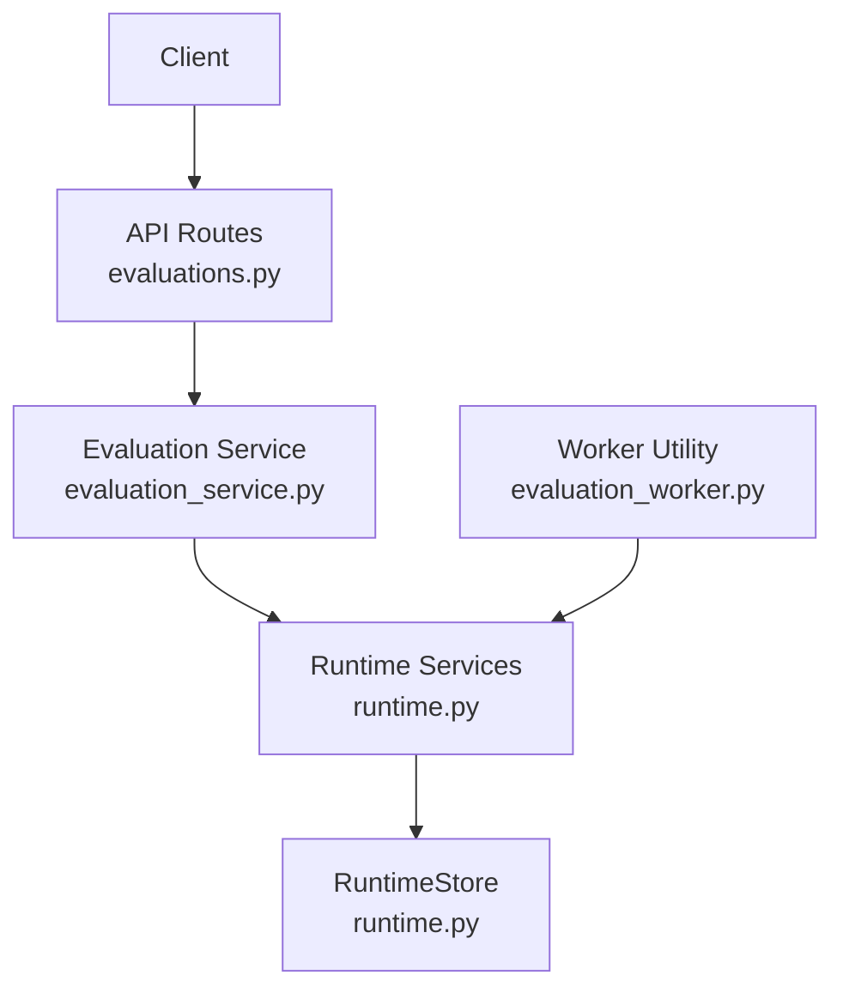
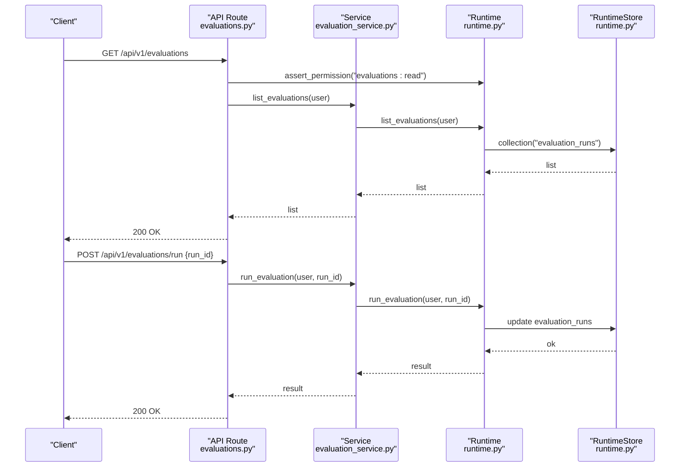
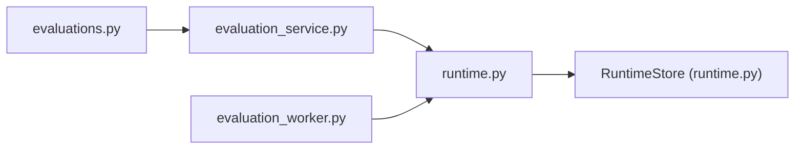
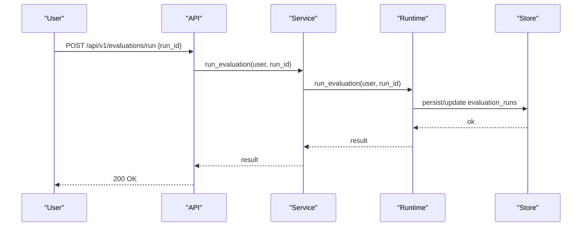

# Scoring & Quality Metrics

<cite>
**Referenced Files in This Document**
- [runtime.py](file://backend/app/runtime.py)
- [evaluation_service.py](file://backend/app/services/evaluation_service.py)
- [evaluations.py](file://backend/app/api/v1/routes/evaluations.py)
- [evaluation_worker.py](file://backend/app/workers/evaluation_worker.py)
- [harsh_score_v1.py](file://scripts/business/harsh_score_v1.py)
</cite>

## Table of Contents
1. [Introduction](#introduction)
2. [Project Structure](#project-structure)
3. [Core Components](#core-components)
4. [Architecture Overview](#architecture-overview)
5. [Detailed Component Analysis](#detailed-component-analysis)
6. [Dependency Analysis](#dependency-analysis)
7. [Performance Considerations](#performance-considerations)
8. [Troubleshooting Guide](#troubleshooting-guide)
9. [Conclusion](#conclusion)
10. [Appendices](#appendices)

## Introduction
This document explains the scoring mechanisms and quality metrics used by the evaluation system, including built-in scoring algorithms, custom metric definitions, aggregation strategies, quality gates, threshold configurations, pass/fail criteria, performance benchmarking, cost analysis, efficiency metrics, and how evaluation results influence deployment decisions. It also provides examples for defining custom evaluators, calculating composite scores, and interpreting quality reports.

## Project Structure
The evaluation subsystem is implemented as a thin API surface backed by a runtime store and worker utilities. The key pieces are:
- API routes that expose listing, detail retrieval, running evaluations, and querying per-run evaluations.
- A service layer that delegates to the runtime.
- A runtime that persists state (Postgres or JSON file), seeds workflows with evaluation policies, and exposes list/get/run operations.
- A worker utility that enumerates evaluation runs.
- A standalone script that implements a “harsh” recalibration scoring algorithm over agent materials.

**Diagram sources**
- [evaluations.py:1-32](file://backend/app/api/v1/routes/evaluations.py#L1-L32)
- [evaluation_service.py:1-18](file://backend/app/services/evaluation_service.py#L1-L18)
- [runtime.py:258-393](file://backend/app/runtime.py#L258-L393)
- [evaluation_worker.py:1-6](file://backend/app/workers/evaluation_worker.py#L1-L6)

**Section sources**
- [evaluations.py:1-32](file://backend/app/api/v1/routes/evaluations.py#L1-L32)
- [evaluation_service.py:1-18](file://backend/app/services/evaluation_service.py#L1-L18)
- [runtime.py:258-393](file://backend/app/runtime.py#L258-L393)
- [evaluation_worker.py:1-6](file://backend/app/workers/evaluation_worker.py#L1-L6)

## Core Components
- API Layer: Provides endpoints to list evaluations, fetch details, run an evaluation by run_id, and list evaluations associated with a workflow run. All endpoints enforce read permissions via runtime authorization.
- Service Layer: Thin wrappers around runtime methods for listing, retrieving, and running evaluations.
- Runtime: Central orchestrator and persistence layer. It manages collections such as evaluation_runs, normalizes workflow records (including evaluation_policy defaults), and exposes list/get/run/list_run_evaluations operations.
- Worker Utility: Enumerates evaluation_runs from the runtime store.
- Harsh Scoring Script: Implements a multi-dimension scoring algorithm over agent artifacts to produce calibrated quality grades and gap diagnostics.

Key responsibilities:
- Evaluation lifecycle exposure (list/detail/run).
- Default evaluation policy seeding for workflows.
- Persistence abstraction (Postgres or JSON file).
- External scoring calibration for agent materials.

**Section sources**
- [evaluations.py:1-32](file://backend/app/api/v1/routes/evaluations.py#L1-L32)
- [evaluation_service.py:1-18](file://backend/app/services/evaluation_service.py#L1-L18)
- [runtime.py:258-393](file://backend/app/runtime.py#L258-L393)
- [runtime.py:674-728](file://backend/app/runtime.py#L674-L728)
- [evaluation_worker.py:1-6](file://backend/app/workers/evaluation_worker.py#L1-L6)
- [harsh_score_v1.py:1-374](file://scripts/business/harsh_score_v1.py#L1-L374)

## Architecture Overview
The evaluation flow integrates API requests with runtime-backed storage and optional workers. Workflows can carry an evaluation_policy that dictates whether evaluations are required and whether failures block execution.

**Diagram sources**
- [evaluations.py:11-25](file://backend/app/api/v1/routes/evaluations.py#L11-L25)
- [evaluation_service.py:4-13](file://backend/app/services/evaluation_service.py#L4-L13)
- [runtime.py:258-393](file://backend/app/runtime.py#L258-L393)

## Detailed Component Analysis

### Built-in Scoring Algorithms
- Workflow-level evaluation policy: When workflows are normalized, default evaluation_policy fields are set if missing. These include flags indicating whether evaluation is required and whether failure should block execution. This acts as a gate for downstream processes.
- Harsh recalibration scorer: A standalone script computes a multi-dimensional score across six dimensions (S1–S6) based on artifact characteristics, content depth, integration signals, and structural completeness. It produces totals, grades, and gap diagnostics, and can stamp provenance metadata into agent specs.

Highlights:
- Dimensions S1–S6 capture different aspects of material quality and integration.
- Totals map to grades such as strong_structural_not_done, usable_structural, partial_materials, thin_draft.
- Gaps identify specific areas needing improvement (e.g., thin SPEC, weak topic embodiment, lack of independent critic).

**Section sources**
- [runtime.py:674-728](file://backend/app/runtime.py#L674-L728)
- [harsh_score_v1.py:88-238](file://scripts/business/harsh_score_v1.py#L88-L238)
- [harsh_score_v1.py:241-374](file://scripts/business/harsh_score_v1.py#L241-L374)

### Custom Metric Definitions
Custom metrics can be defined by extending the harsh scoring approach:
- Define new dimensions (e.g., S7, S8) capturing additional quality attributes.
- Implement thresholds and caps per dimension.
- Aggregate into a composite score using weighted sums or other functions.
- Persist metrics alongside evaluation runs or in agent provenance.

Example pattern:
- Add a new function computing a dimension score.
- Integrate it into the main scoring routine.
- Update grade mapping and gap detection logic.
- Optionally write back provenance fields for traceability.

**Section sources**
- [harsh_score_v1.py:88-238](file://scripts/business/harsh_score_v1.py#L88-L238)
- [harsh_score_v1.py:342-359](file://scripts/business/harsh_score_v1.py#L342-L359)

### Aggregation Strategies
- Composite Score: Sum of dimension scores with hard caps per dimension to prevent dominance by any single factor.
- Grade Mapping: Total score maps to categorical grades for quick interpretation.
- Gap Detection: Rules identify underperforming dimensions and material characteristics to guide remediation.

Aggregation considerations:
- Use caps to bound individual contributions.
- Normalize inputs where necessary (e.g., hit rates, sizes).
- Maintain transparency by recording raw dimension scores and gaps.

**Section sources**
- [harsh_score_v1.py:197-206](file://scripts/business/harsh_score_v1.py#L197-L206)
- [harsh_score_v1.py:207-238](file://scripts/business/harsh_score_v1.py#L207-L238)

### Quality Gates and Threshold Configurations
- Workflow evaluation_policy: Defaults ensure evaluations are required and failures can block execution when not overridden.
- Gate behavior: If evaluation fails and block_on_fail is true, downstream steps should be prevented from proceeding.
- Thresholds: Dimension-specific caps and total-grade thresholds define pass/fail categories.

Configuration guidance:
- Set evaluation_policy.required = True for critical workflows.
- Set evaluation_policy.block_on_fail = True to enforce strict gating.
- Adjust thresholds per domain needs while maintaining auditability.

**Section sources**
- [runtime.py:674-728](file://backend/app/runtime.py#L674-L728)

### Pass/Fail Criteria
- Hard pass: Composite score meets or exceeds a configured threshold and no critical gaps remain.
- Conditional pass: Score meets threshold but has non-critical gaps; requires review before release.
- Fail: Score below threshold or presence of critical gaps (e.g., missing primary research, absent independent critic).

Operationalization:
- Map grades to operational statuses (e.g., ready_for_production, needs_review, blocked).
- Enforce gates at workflow execution boundaries.

**Section sources**
- [harsh_score_v1.py:197-206](file://scripts/business/harsh_score_v1.py#L197-L206)

### Performance Benchmarking, Cost Analysis, Efficiency Metrics
- Performance: Evaluate latency and throughput of evaluation runs; track counts of evaluation_runs and durations if recorded.
- Cost: Measure resource usage per evaluation (e.g., tokens, compute time) and aggregate across runs.
- Efficiency: Track success rate, re-evaluation frequency, and time-to-decision.

Implementation pointers:
- Record timing and resource counters in evaluation run payloads.
- Periodically summarize metrics for dashboards and alerts.
- Use worker utilities to enumerate runs for batch reporting.

**Section sources**
- [evaluation_worker.py:4-5](file://backend/app/workers/evaluation_worker.py#L4-L5)

### Examples: Defining Custom Evaluators and Composite Scores
- Define a new evaluator module that computes one or more metrics against artifacts or outputs.
- Integrate with the runtime by persisting results under evaluation_runs or related collections.
- Compute composite scores by aggregating metrics with weights and caps.
- Emit pass/fail decisions based on thresholds and gate rules.

Traceability:
- Store provenance metadata linking evaluator versions, inputs, and outputs.
- Stamp scores into relevant entities for auditing and rollbacks.

**Section sources**
- [harsh_score_v1.py:342-359](file://scripts/business/harsh_score_v1.py#L342-L359)

### Interpreting Quality Reports
- Review dimension breakdowns to understand strengths and weaknesses.
- Examine gaps to prioritize improvements.
- Compare soft vs. harsh scores to detect overestimation risks.
- Track trends over time to measure progress.

Report elements:
- Dimension scores (S1–S6).
- Total score and grade.
- Gap list and severity.
- Provenance metadata (evaluator version, timestamps).

**Section sources**
- [harsh_score_v1.py:221-238](file://scripts/business/harsh_score_v1.py#L221-L238)
- [harsh_score_v1.py:256-334](file://scripts/business/harsh_score_v1.py#L256-L334)

### Relationship Between Evaluation Results and Deployment Decisions
- Gate enforcement: If evaluation fails and block_on_fail is true, deployments are blocked until issues are resolved.
- Risk-based gating: Higher-risk workflows may require stricter thresholds and human approval.
- Auditability: Evaluation outcomes and decisions are persisted for compliance and rollback.

Operational flow:
- Run evaluation prior to promotion.
- Check evaluation_policy and outcome.
- Block or allow progression based on pass/fail and risk tier.

**Section sources**
- [runtime.py:674-728](file://backend/app/runtime.py#L674-L728)

## Dependency Analysis
The evaluation subsystem exhibits low coupling between API, service, and runtime layers, with clear separation of concerns. The runtime encapsulates persistence and normalization, while the API enforces permissions and the service abstracts runtime calls. The worker utility depends only on the runtime’s collection accessors.

**Diagram sources**
- [evaluations.py:1-32](file://backend/app/api/v1/routes/evaluations.py#L1-L32)
- [evaluation_service.py:1-18](file://backend/app/services/evaluation_service.py#L1-L18)
- [runtime.py:258-393](file://backend/app/runtime.py#L258-L393)
- [evaluation_worker.py:1-6](file://backend/app/workers/evaluation_worker.py#L1-L6)

**Section sources**
- [evaluations.py:1-32](file://backend/app/api/v1/routes/evaluations.py#L1-L32)
- [evaluation_service.py:1-18](file://backend/app/services/evaluation_service.py#L1-L18)
- [runtime.py:258-393](file://backend/app/runtime.py#L258-L393)
- [evaluation_worker.py:1-6](file://backend/app/workers/evaluation_worker.py#L1-L6)

## Performance Considerations
- Prefer Postgres backend for concurrent writes and query performance; fallback to JSON file for local/dev scenarios.
- Minimize payload sizes for evaluation runs; record only essential metrics and references.
- Batch report generation using worker utilities to avoid blocking API responses.
- Cache frequently accessed configuration (e.g., evaluation policies) within runtime sessions.

[No sources needed since this section provides general guidance]

## Troubleshooting Guide
Common issues and resolutions:
- Permission errors: Ensure the caller has evaluations:read permission.
- Missing evaluation runs: Verify runtime initialization and collection seeding.
- Evaluation policy misconfiguration: Confirm workflow evaluation_policy fields are set correctly.
- Scoring discrepancies: Review harsh recalibration logs and provenance metadata.

Diagnostic steps:
- List evaluation_runs to confirm data availability.
- Fetch evaluation details to inspect outcomes and metadata.
- Re-run evaluations with updated policies or thresholds.

**Section sources**
- [evaluations.py:11-20](file://backend/app/api/v1/routes/evaluations.py#L11-L20)
- [evaluation_service.py:4-13](file://backend/app/services/evaluation_service.py#L4-L13)
- [runtime.py:258-393](file://backend/app/runtime.py#L258-L393)

## Conclusion
The evaluation system combines a lightweight API/service layer with a robust runtime store and a flexible scoring approach. Built-in workflow evaluation policies provide quality gates, while the harsh recalibration script offers a transparent, multi-dimensional scoring model. By defining custom metrics, configuring thresholds, and enforcing gates, teams can make informed deployment decisions grounded in measurable quality signals.

[No sources needed since this section summarizes without analyzing specific files]

## Appendices

### Example: Sequence of Running an Evaluation

**Diagram sources**
- [evaluations.py:23-25](file://backend/app/api/v1/routes/evaluations.py#L23-L25)
- [evaluation_service.py:12-13](file://backend/app/services/evaluation_service.py#L12-L13)
- [runtime.py:258-393](file://backend/app/runtime.py#L258-L393)