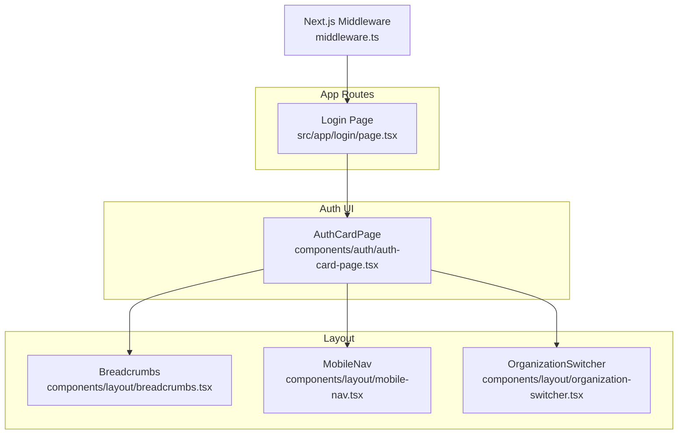
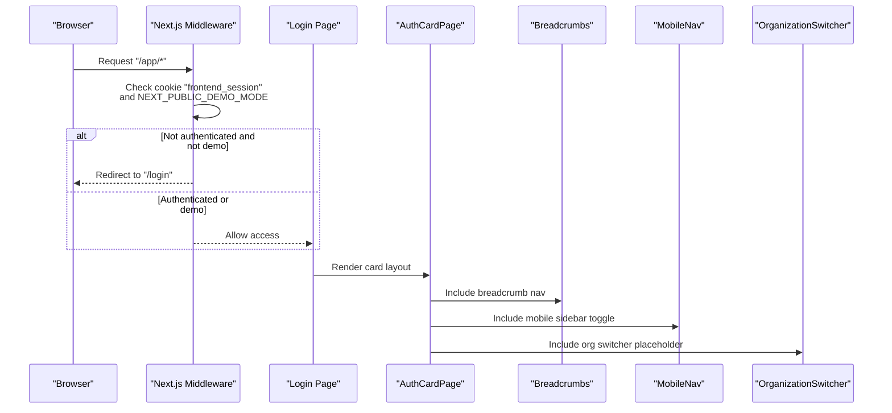
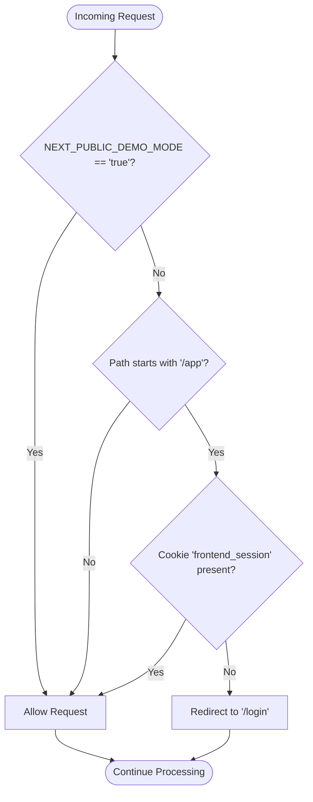
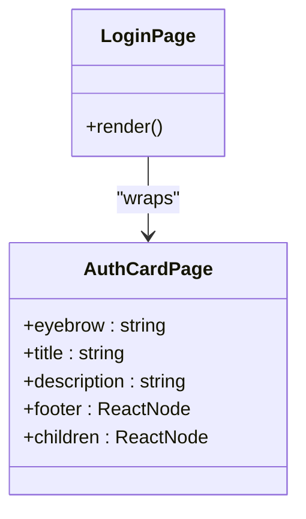
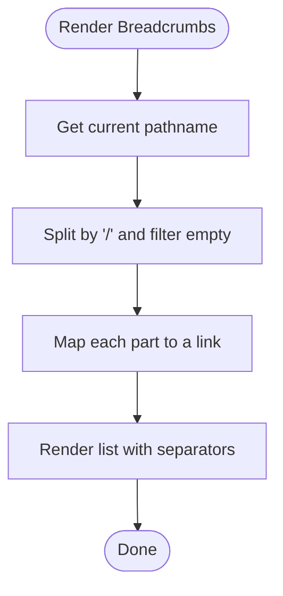
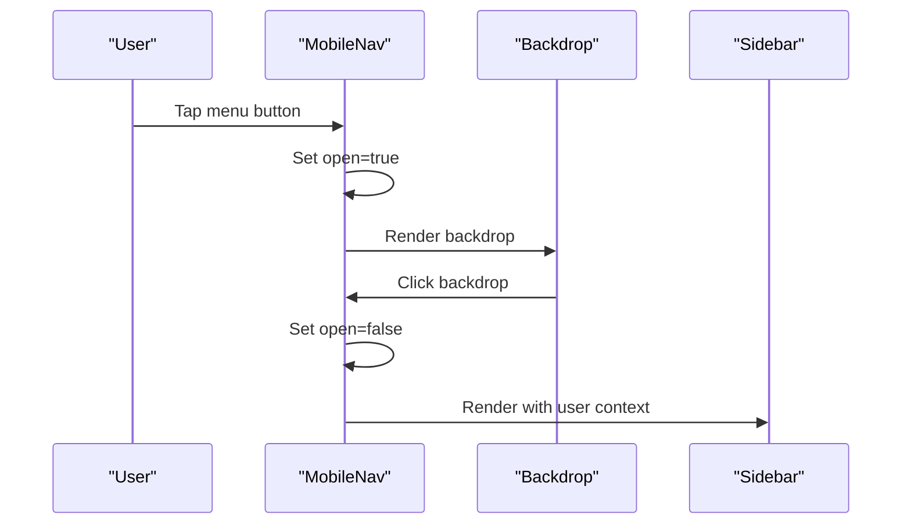
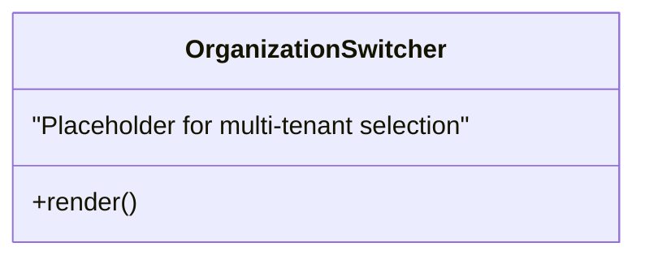
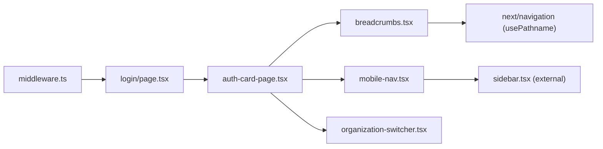

# Authentication & Navigation

<cite>
**Referenced Files in This Document**
- [middleware.ts](file://frontend/middleware.ts)
- [page.tsx](file://frontend/src/app/login/page.tsx)
- [auth-card-page.tsx](file://frontend/src/components/auth/auth-card-page.tsx)
- [breadcrumbs.tsx](file://frontend/src/components/layout/breadcrumbs.tsx)
- [mobile-nav.tsx](file://frontend/src/components/layout/mobile-nav.tsx)
- [organization-switcher.tsx](file://frontend/src/components/layout/organization-switcher.tsx)
</cite>

## Table of Contents
1. Introduction
2. Project Structure
3. Core Components
4. Architecture Overview
5. Detailed Component Analysis
6. Dependency Analysis
7. Performance Considerations
8. Troubleshooting Guide
9. Conclusion

## Introduction
This document explains the authentication flows and navigation systems implemented in the frontend, focusing on:
- Auth forms and card-based authentication pages
- Breadcrumb navigation
- Mobile-responsive navigation
- Organization switching capabilities
- Session management and route protection
- User context sharing and multi-tenant navigation patterns
- How to add new authenticated routes, implement role-based navigation, and handle authentication errors

The goal is to provide both a high-level understanding and actionable guidance for extending these features safely and consistently.

## Project Structure
Authentication and navigation are primarily implemented under:
- App-level route protection via Next.js middleware
- Card-based auth pages with reusable form components
- Layout components for breadcrumbs, mobile navigation, and organization switcher

**Diagram sources**
- [middleware.ts:1-13](file://frontend/middleware.ts#L1-L13)
- [page.tsx:1-26](file://frontend/src/app/login/page.tsx#L1-L26)
- [auth-card-page.tsx:1-35](file://frontend/src/components/auth/auth-card-page.tsx#L1-L35)
- [breadcrumbs.tsx:1-5](file://frontend/src/components/layout/breadcrumbs.tsx#L1-L5)
- [mobile-nav.tsx:1-7](file://frontend/src/components/layout/mobile-nav.tsx#L1-L7)
- [organization-switcher.tsx:1-2](file://frontend/src/components/layout/organization-switcher.tsx#L1-L2)

**Section sources**
- [middleware.ts:1-13](file://frontend/middleware.ts#L1-L13)
- [page.tsx:1-26](file://frontend/src/app/login/page.tsx#L1-L26)
- [auth-card-page.tsx:1-35](file://frontend/src/components/auth/auth-card-page.tsx#L1-L35)
- [breadcrumbs.tsx:1-5](file://frontend/src/components/layout/breadcrumbs.tsx#L1-L5)
- [mobile-nav.tsx:1-7](file://frontend/src/components/layout/mobile-nav.tsx#L1-L7)
- [organization-switcher.tsx:1-2](file://frontend/src/components/layout/organization-switcher.tsx#L1-L2)

## Core Components
- Route protection middleware enforces session presence for protected paths.
- Card-based auth page provides consistent branding and layout for login/register/forgot-password/reset-password flows.
- Breadcrumbs derive from the current URL path for simple hierarchical navigation.
- Mobile navigation renders a responsive sidebar overlay.
- Organization switcher placeholder indicates multi-tenant context selection.

Key responsibilities:
- Enforce access control at the edge (middleware).
- Provide reusable UI primitives for auth experiences.
- Offer navigational aids (breadcrumbs, mobile nav).
- Prepare for multi-tenant operations (organization switcher).

**Section sources**
- [middleware.ts:1-13](file://frontend/middleware.ts#L1-L13)
- [auth-card-page.tsx:1-35](file://frontend/src/components/auth/auth-card-page.tsx#L1-L35)
- [breadcrumbs.tsx:1-5](file://frontend/src/components/layout/breadcrumbs.tsx#L1-L5)
- [mobile-nav.tsx:1-7](file://frontend/src/components/layout/mobile-nav.tsx#L1-L7)
- [organization-switcher.tsx:1-2](file://frontend/src/components/layout/organization-switcher.tsx#L1-L2)

## Architecture Overview
The authentication and navigation architecture combines server-side route protection with client-side UI composition.

**Diagram sources**
- [middleware.ts:1-13](file://frontend/middleware.ts#L1-L13)
- [page.tsx:1-26](file://frontend/src/app/login/page.tsx#L1-L26)
- [auth-card-page.tsx:1-35](file://frontend/src/components/auth/auth-card-page.tsx#L1-L35)
- [breadcrumbs.tsx:1-5](file://frontend/src/components/layout/breadcrumbs.tsx#L1-L5)
- [mobile-nav.tsx:1-7](file://frontend/src/components/layout/mobile-nav.tsx#L1-L7)
- [organization-switcher.tsx:1-2](file://frontend/src/components/layout/organization-switcher.tsx#L1-L2)

## Detailed Component Analysis

### Route Protection and Session Management
- The middleware intercepts requests to protected paths and enforces session presence via a cookie.
- A demo mode flag allows bypassing checks when enabled.
- Unauthenticated requests to protected routes are redirected to the login page.

Implementation highlights:
- Matcher restricts enforcement to specific route prefixes.
- Cookie name used for session validation is explicit.
- Redirect target is constructed relative to the incoming request.

**Diagram sources**
- [middleware.ts:1-13](file://frontend/middleware.ts#L1-L13)

**Section sources**
- [middleware.ts:1-13](file://frontend/middleware.ts#L1-L13)

### Card-Based Authentication Pages
- The login page composes a reusable card layout that standardizes branding, title, description, footer links, and form content.
- Footer includes common actions like password recovery and account creation.

Usage pattern:
- Wrap any auth flow with the card component to maintain consistency.
- Pass contextual text and footer elements per flow.

**Diagram sources**
- [page.tsx:1-26](file://frontend/src/app/login/page.tsx#L1-L26)
- [auth-card-page.tsx:1-35](file://frontend/src/components/auth/auth-card-page.tsx#L1-L35)

**Section sources**
- [page.tsx:1-26](file://frontend/src/app/login/page.tsx#L1-L26)
- [auth-card-page.tsx:1-35](file://frontend/src/components/auth/auth-card-page.tsx#L1-L35)

### Breadcrumb Navigation
- Breadcrumbs are derived from the current pathname segments.
- Each segment becomes a clickable link to its parent path.
- Provides lightweight hierarchical navigation without additional configuration.

Behavior notes:
- Segments are split by slashes and filtered for empty parts.
- Hyphenated segments are humanized by replacing hyphens with spaces.

**Diagram sources**
- [breadcrumbs.tsx:1-5](file://frontend/src/components/layout/breadcrumbs.tsx#L1-L5)

**Section sources**
- [breadcrumbs.tsx:1-5](file://frontend/src/components/layout/breadcrumbs.tsx#L1-L5)

### Mobile-Responsive Navigation
- Mobile navigation toggles a full-screen overlay containing the sidebar.
- Uses a stateful open/close mechanism and prevents background clicks from closing prematurely.
- Integrates with the existing sidebar component and user context.

Interaction details:
- Button opens the overlay; clicking backdrop closes it.
- Sidebar receives the current user object for rendering.

**Diagram sources**
- [mobile-nav.tsx:1-7](file://frontend/src/components/layout/mobile-nav.tsx#L1-L7)

**Section sources**
- [mobile-nav.tsx:1-7](file://frontend/src/components/layout/mobile-nav.tsx#L1-L7)

### Organization Switching (Multi-Tenant)
- The organization switcher currently displays a static label indicating the active organization.
- It serves as a placeholder for future multi-tenant switching logic.

Guidance for extension:
- Replace static label with a dropdown listing available organizations.
- Persist selected organization in a store or cookies.
- Update API calls and navigation to include tenant context.

**Diagram sources**
- [organization-switcher.tsx:1-2](file://frontend/src/components/layout/organization-switcher.tsx#L1-L2)

**Section sources**
- [organization-switcher.tsx:1-2](file://frontend/src/components/layout/organization-switcher.tsx#L1-L2)

## Dependency Analysis
The following diagram shows how key components depend on each other and external utilities.

**Diagram sources**
- [middleware.ts:1-13](file://frontend/middleware.ts#L1-L13)
- [page.tsx:1-26](file://frontend/src/app/login/page.tsx#L1-L26)
- [auth-card-page.tsx:1-35](file://frontend/src/components/auth/auth-card-page.tsx#L1-L35)
- [breadcrumbs.tsx:1-5](file://frontend/src/components/layout/breadcrumbs.tsx#L1-L5)
- [mobile-nav.tsx:1-7](file://frontend/src/components/layout/mobile-nav.tsx#L1-L7)
- [organization-switcher.tsx:1-2](file://frontend/src/components/layout/organization-switcher.tsx#L1-L2)

**Section sources**
- [middleware.ts:1-13](file://frontend/middleware.ts#L1-L13)
- [page.tsx:1-26](file://frontend/src/app/login/page.tsx#L1-L26)
- [auth-card-page.tsx:1-35](file://frontend/src/components/auth/auth-card-page.tsx#L1-L35)
- [breadcrumbs.tsx:1-5](file://frontend/src/components/layout/breadcrumbs.tsx#L1-L5)
- [mobile-nav.tsx:1-7](file://frontend/src/components/layout/mobile-nav.tsx#L1-L7)
- [organization-switcher.tsx:1-2](file://frontend/src/components/layout/organization-switcher.tsx#L1-L2)

## Performance Considerations
- Keep middleware minimal and fast; avoid heavy computations inside the matcher.
- Prefer client-side lazy loading for non-critical UI like overlays.
- Use memoization for computed breadcrumbs if path segments become complex.
- Avoid unnecessary re-renders in mobile navigation by stabilizing event handlers.

[No sources needed since this section provides general guidance]

## Troubleshooting Guide
Common issues and resolutions:
- Protected routes redirect unexpectedly:
  - Verify the session cookie name matches the middleware expectation.
  - Ensure demo mode is disabled unless intended.
- Breadcrumbs show unexpected segments:
  - Confirm route structure aligns with expected path segments.
  - Normalize slugs and dynamic segments before rendering.
- Mobile overlay does not close:
  - Check event propagation and backdrop click handlers.
- Organization switcher not functional:
  - Implement selection state and persistence.
  - Integrate with backend APIs to fetch available organizations.

**Section sources**
- [middleware.ts:1-13](file://frontend/middleware.ts#L1-L13)
- [breadcrumbs.tsx:1-5](file://frontend/src/components/layout/breadcrumbs.tsx#L1-L5)
- [mobile-nav.tsx:1-7](file://frontend/src/components/layout/mobile-nav.tsx#L1-L7)
- [organization-switcher.tsx:1-2](file://frontend/src/components/layout/organization-switcher.tsx#L1-L2)

## Conclusion
The frontend implements a clear separation between route protection and UI composition:
- Middleware secures app routes using a session cookie and supports a demo bypass.
- Card-based auth pages standardize user-facing authentication experiences.
- Breadcrumbs and mobile navigation enhance usability across devices.
- The organization switcher is a placeholder ready for multi-tenant expansion.

To extend:
- Add new authenticated routes under protected prefixes and rely on middleware.
- Compose auth flows with the card component for consistency.
- Enhance breadcrumbs with custom labels where needed.
- Implement role-based visibility in navigation components.
- Expand the organization switcher to support real multi-tenant workflows.

[No sources needed since this section summarizes without analyzing specific files]