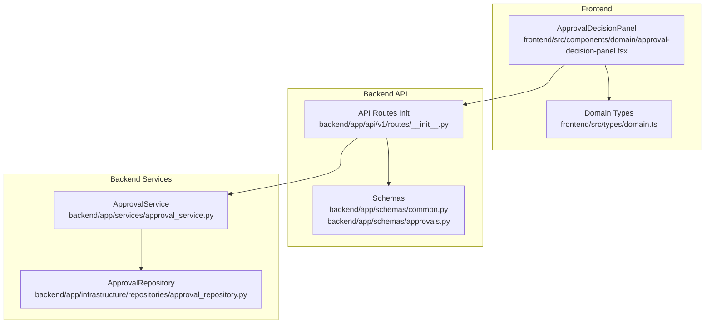
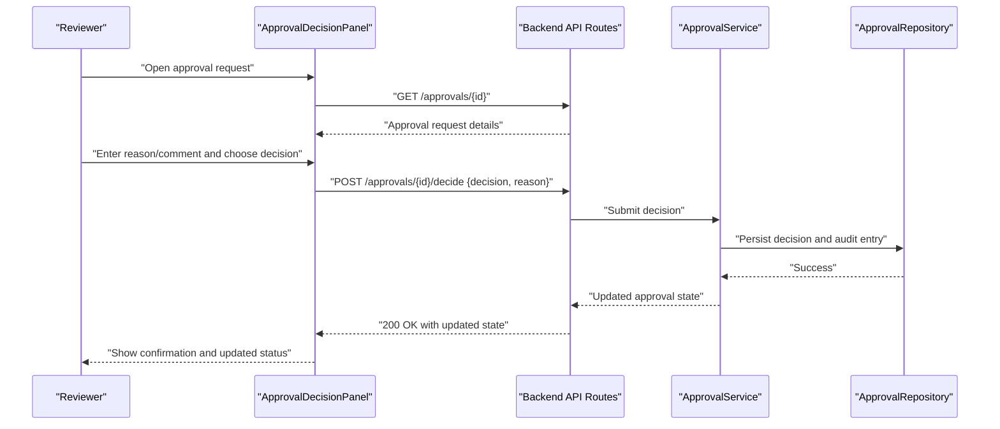
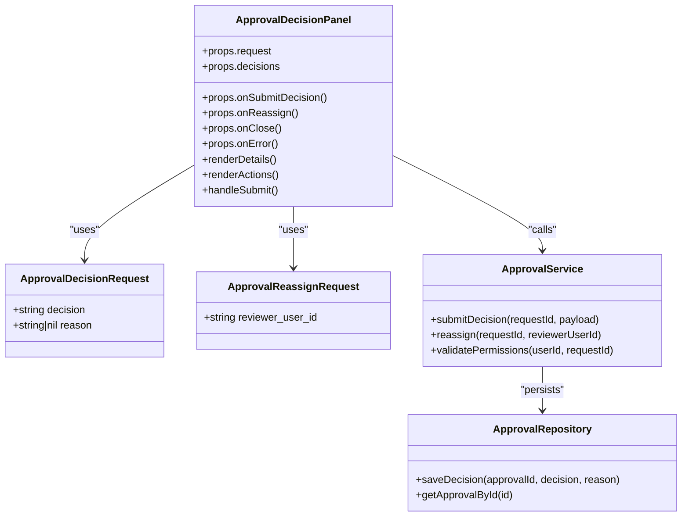
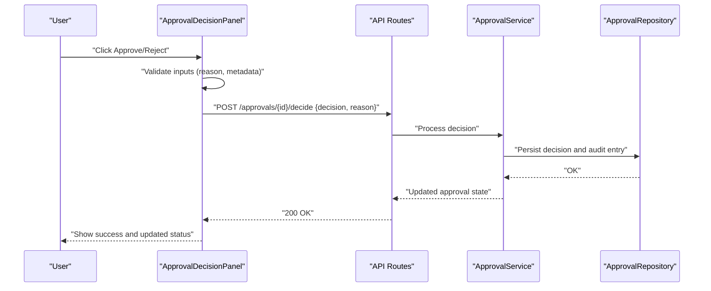
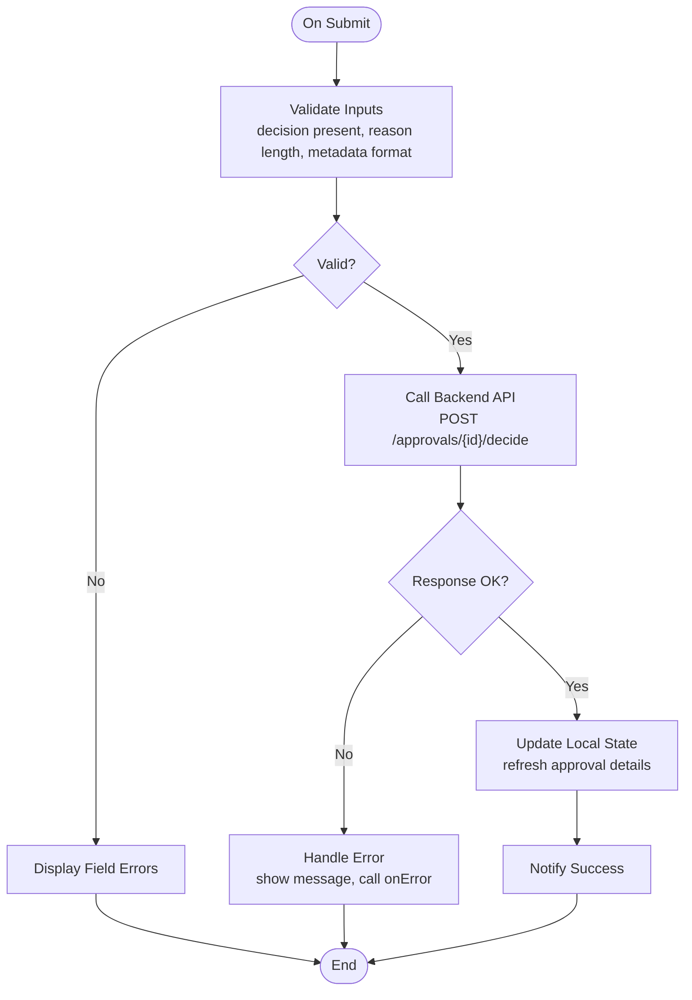
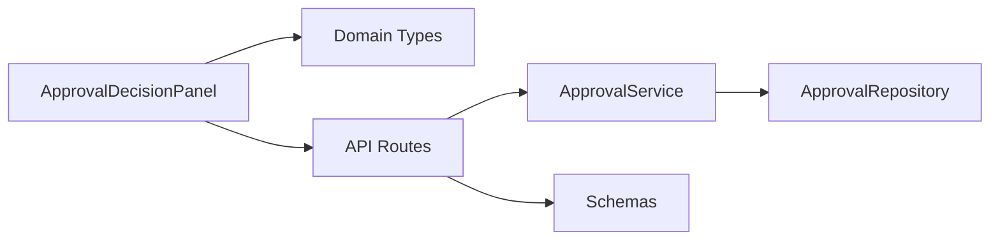

# Approval Decision Panel

<cite>
**Referenced Files in This Document**
- [approval-decision-panel.tsx](file://frontend/src/components/domain/approval-decision-panel.tsx)
- [common.py](file://backend/app/schemas/common.py)
- [approvals.py](file://backend/app/schemas/approvals.py)
- [approval_service.py](file://backend/app/services/approval_service.py)
- [approval_repository.py](file://backend/app/infrastructure/repositories/approval_repository.py)
- [routes/__init__.py](file://backend/app/api/v1/routes/__init__.py)
- [domain.ts](file://frontend/src/types/domain.ts)
</cite>

## Table of Contents
1. [Introduction](#introduction)
2. [Project Structure](#project-structure)
3. [Core Components](#core-components)
4. [Architecture Overview](#architecture-overview)
5. [Detailed Component Analysis](#detailed-component-analysis)
6. [Dependency Analysis](#dependency-analysis)
7. [Performance Considerations](#performance-considerations)
8. [Troubleshooting Guide](#troubleshooting-guide)
9. [Conclusion](#conclusion)
10. [Appendices](#appendices)

## Introduction
The ApprovalDecisionPanel is a human-in-the-loop UI component that presents an approval request to a reviewer and captures their decision (approve or reject), optional reason/comment, and any additional metadata required by the workflow. It integrates with backend approval APIs to persist decisions and trigger downstream workflow transitions while maintaining auditability.

Key goals:
- Present clear context about the approval request
- Provide safe, auditable decision actions
- Support comments and optional metadata
- Integrate with backend services for persistence and workflow orchestration
- Enable extension for different approval types and custom decision fields

## Project Structure
This documentation focuses on the frontend ApprovalDecisionPanel component and its integration points with backend schemas and services. The relevant files are located under:
- Frontend component: frontend/src/components/domain/approval-decision-panel.tsx
- Backend schemas: backend/app/schemas/common.py, backend/app/schemas/approvals.py
- Backend service and repository: backend/app/services/approval_service.py, backend/app/infrastructure/repositories/approval_repository.py
- API routes registration: backend/app/api/v1/routes/__init__.py
- Frontend domain types: frontend/src/types/domain.ts

**Diagram sources**
- [approval-decision-panel.tsx](file://frontend/src/components/domain/approval-decision-panel.tsx)
- [domain.ts](file://frontend/src/types/domain.ts)
- [routes/__init__.py](file://backend/app/api/v1/routes/__init__.py)
- [common.py](file://backend/app/schemas/common.py)
- [approvals.py](file://backend/app/schemas/approvals.py)
- [approval_service.py](file://backend/app/services/approval_service.py)
- [approval_repository.py](file://backend/app/infrastructure/repositories/approval_repository.py)

**Section sources**
- [approval-decision-panel.tsx](file://frontend/src/components/domain/approval-decision-panel.tsx)
- [domain.ts](file://frontend/src/types/domain.ts)
- [common.py](file://backend/app/schemas/common.py)
- [approvals.py](file://backend/app/schemas/approvals.py)
- [approval_service.py](file://backend/app/services/approval_service.py)
- [approval_repository.py](file://backend/app/infrastructure/repositories/approval_repository.py)
- [routes/__init__.py](file://backend/app/api/v1/routes/__init__.py)

## Core Components
- ApprovalDecisionPanel (frontend): Renders the approval request details, decision buttons, comment input, and optional metadata fields. It calls backend endpoints to submit decisions and updates local state accordingly.
- ApprovalDecisionRequest (backend schema): Defines the payload for submitting a decision including decision type and optional reason.
- ApprovalReassignRequest (backend schema): Supports reassignment of the approval task to another reviewer.
- ApprovalService (backend): Orchestrates approval logic, validates inputs, persists decisions, and triggers workflow transitions.
- ApprovalRepository (backend): Persists approval entities and related audit records.

Typical props for ApprovalDecisionPanel include:
- Request data: id, title/description, requester info, risk tier, step context, current status, allowed decisions
- Decision options: list of available decisions (e.g., approve, reject)
- Callback handlers: onSubmitDecision, onReassign, onClose, onError
- UI flags: showComments, allowMetadata, readOnly, loading states

Integration points:
- Submit decision via backend API using ApprovalDecisionRequest
- Optionally reassign via ApprovalReassignRequest
- Update UI state based on success/error responses
- Record audit trail entries through backend services

**Section sources**
- [approval-decision-panel.tsx](file://frontend/src/components/domain/approval-decision-panel.tsx)
- [common.py](file://backend/app/schemas/common.py)
- [approvals.py](file://backend/app/schemas/approvals.py)
- [approval_service.py](file://backend/app/services/approval_service.py)
- [approval_repository.py](file://backend/app/infrastructure/repositories/approval_repository.py)

## Architecture Overview
The ApprovalDecisionPanel participates in a human-in-the-loop gate within workflows. When a workflow reaches a governance-required step, it creates an approval request. The panel displays the request and allows the reviewer to make a decision. The backend validates permissions, persists the decision, logs audit events, and resumes or terminates the workflow run.

**Diagram sources**
- [approval-decision-panel.tsx](file://frontend/src/components/domain/approval-decision-panel.tsx)
- [routes/__init__.py](file://backend/app/api/v1/routes/__init__.py)
- [approval_service.py](file://backend/app/services/approval_service.py)
- [approval_repository.py](file://backend/app/infrastructure/repositories/approval_repository.py)

## Detailed Component Analysis

### ApprovalDecisionPanel Component
Responsibilities:
- Display approval request details (title, description, requester, risk tier, step context)
- Render decision buttons based on allowed decisions
- Capture optional reason/comment and additional metadata
- Handle submission flow and error states
- Trigger callbacks for parent components (e.g., refresh lists, navigate)

Props overview:
- request: Approval request object (id, title, description, requester, risk_tier, step_id, status, allowed_decisions)
- decisions: Array of decision options (labels, values, icons if applicable)
- onSubmitDecision: Handler invoked with decision payload
- onReassign: Optional handler for reassignment
- onClose: Close panel callback
- onError: Error handling callback
- showComments: Boolean to toggle comment field visibility
- allowMetadata: Boolean to enable extra metadata fields
- readOnly: Disable interactions when needed
- loading: Indicate async operations

UI sections:
- Header: Title and status badge
- Details: Description, requester, risk tier, step context
- Actions: Decision buttons with validation
- Comments: Text area for reason/comment
- Metadata: Optional key-value fields
- Footer: Save/Cancel actions and error messages

Error handling:
- Network errors: Show toast/alert and call onError
- Validation errors: Highlight invalid fields and display messages
- Permission errors: Disable actions and inform user

Accessibility:
- Keyboard navigation for decision buttons
- ARIA labels for form controls
- Clear focus management during submission

**Section sources**
- [approval-decision-panel.tsx](file://frontend/src/components/domain/approval-decision-panel.tsx)
- [domain.ts](file://frontend/src/types/domain.ts)

### Backend Schemas and Contracts
ApprovalDecisionRequest:
- decision: string (required)
- reason: string | null (optional)

ApprovalReassignRequest:
- reviewer_user_id: string (required)

These schemas define the payloads used by the API routes and services to process approvals and reassignments.

**Section sources**
- [common.py](file://backend/app/schemas/common.py)
- [approvals.py](file://backend/app/schemas/approvals.py)

### Approval Service and Repository
ApprovalService:
- Validates user permissions and request context
- Applies business rules for allowed decisions
- Persists decision and reason
- Triggers workflow transitions based on outcome
- Records audit log entries

ApprovalRepository:
- Stores approval entities and decision history
- Retrieves approval requests and related metadata
- Ensures referential integrity with audit logs

**Section sources**
- [approval_service.py](file://backend/app/services/approval_service.py)
- [approval_repository.py](file://backend/app/infrastructure/repositories/approval_repository.py)

### API Integration Flow
The panel interacts with backend routes registered in the API module. Typical endpoints:
- GET /approvals/{id}: Fetch approval request details
- POST /approvals/{id}/decide: Submit decision with reason
- PATCH /approvals/{id}/reassign: Reassign to another reviewer

The routes delegate to ApprovalService, which coordinates persistence and workflow orchestration.

**Section sources**
- [routes/__init__.py](file://backend/app/api/v1/routes/__init__.py)
- [approval_service.py](file://backend/app/services/approval_service.py)

### Class Diagram (Conceptual Mapping)

**Diagram sources**
- [approval-decision-panel.tsx](file://frontend/src/components/domain/approval-decision-panel.tsx)
- [common.py](file://backend/app/schemas/common.py)
- [approvals.py](file://backend/app/schemas/approvals.py)
- [approval_service.py](file://backend/app/services/approval_service.py)
- [approval_repository.py](file://backend/app/infrastructure/repositories/approval_repository.py)

### Sequence Diagram (Submit Decision)

**Diagram sources**
- [approval-decision-panel.tsx](file://frontend/src/components/domain/approval-decision-panel.tsx)
- [routes/__init__.py](file://backend/app/api/v1/routes/__init__.py)
- [approval_service.py](file://backend/app/services/approval_service.py)
- [approval_repository.py](file://backend/app/infrastructure/repositories/approval_repository.py)

### Flowchart (Validation and Submission)

**Diagram sources**
- [approval-decision-panel.tsx](file://frontend/src/components/domain/approval-decision-panel.tsx)

## Dependency Analysis
Component dependencies:
- ApprovalDecisionPanel depends on domain types for request structure and decision options
- Backend schemas define contracts for decision and reassignment payloads
- ApprovalService orchestrates business logic and uses ApprovalRepository for persistence
- API routes register endpoints consumed by the panel

**Diagram sources**
- [approval-decision-panel.tsx](file://frontend/src/components/domain/approval-decision-panel.tsx)
- [domain.ts](file://frontend/src/types/domain.ts)
- [routes/__init__.py](file://backend/app/api/v1/routes/__init__.py)
- [approval_service.py](file://backend/app/services/approval_service.py)
- [approval_repository.py](file://backend/app/infrastructure/repositories/approval_repository.py)
- [common.py](file://backend/app/schemas/common.py)

**Section sources**
- [approval-decision-panel.tsx](file://frontend/src/components/domain/approval-decision-panel.tsx)
- [domain.ts](file://frontend/src/types/domain.ts)
- [routes/__init__.py](file://backend/app/api/v1/routes/__init__.py)
- [approval_service.py](file://backend/app/services/approval_service.py)
- [approval_repository.py](file://backend/app/infrastructure/repositories/approval_repository.py)
- [common.py](file://backend/app/schemas/common.py)

## Performance Considerations
- Debounce rapid submissions to prevent duplicate decisions
- Use optimistic UI updates where appropriate, with rollback on failure
- Minimize re-renders by memoizing decision options and request details
- Paginate or lazy-load approval history if displaying audit trails
- Cache approval request details briefly to reduce network calls

## Troubleshooting Guide
Common issues and resolutions:
- Missing decision value: Ensure decision option is selected before submission
- Empty reason when required: Enforce minimum length or mandatory field rules
- Permission denied: Verify user roles and scope; disable actions if unauthorized
- Network failures: Implement retry logic and user-friendly error messages
- Audit trail gaps: Confirm backend service writes audit entries on success

**Section sources**
- [approval-decision-panel.tsx](file://frontend/src/components/domain/approval-decision-panel.tsx)
- [approval_service.py](file://backend/app/services/approval_service.py)

## Conclusion
The ApprovalDecisionPanel provides a robust, extensible interface for human-in-the-loop approvals. By clearly separating UI concerns from backend contracts and leveraging well-defined schemas and services, it supports secure, auditable decision-making across critical workflow steps. Extensibility points include additional decision metadata, custom approval types, and enhanced audit integrations.

## Appendices

### Example Integration Patterns
- Integrating with backend approval APIs:
  - Use POST /approvals/{id}/decide with ApprovalDecisionRequest
  - Handle success by updating local state and notifying users
  - Handle errors by showing actionable feedback
- Handling approval state changes:
  - Listen for status updates and refresh details
  - Disable actions once a decision is finalized
- Implementing custom approval workflows:
  - Extend decision options and metadata fields
  - Add custom validation rules in the panel and backend service
  - Integrate with external systems via service hooks

[No sources needed since this section provides general guidance]