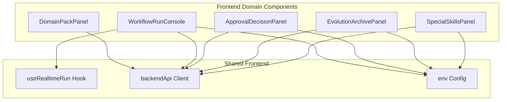
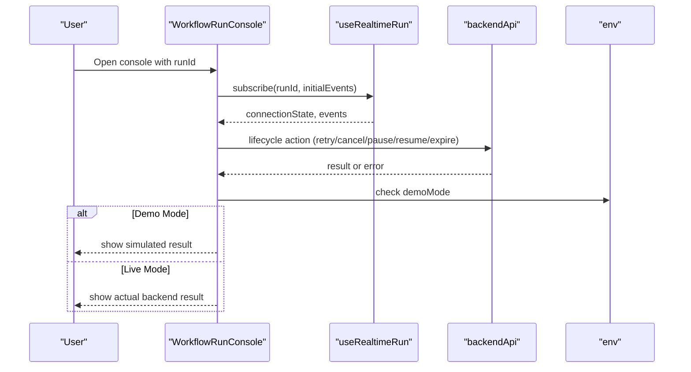
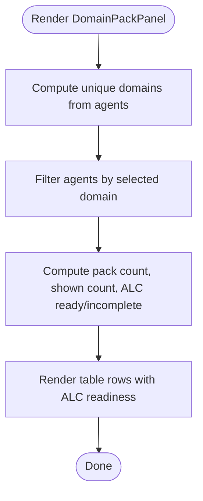
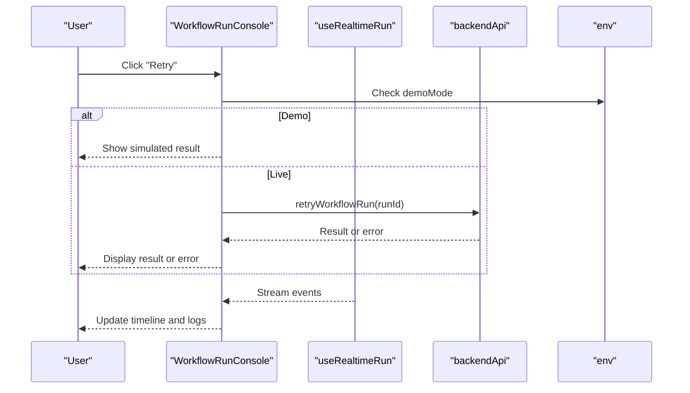
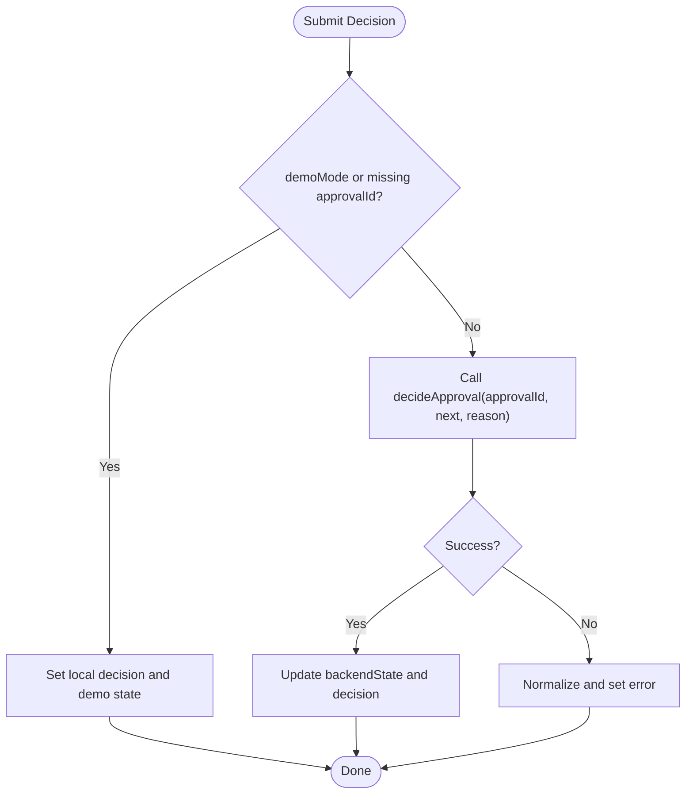
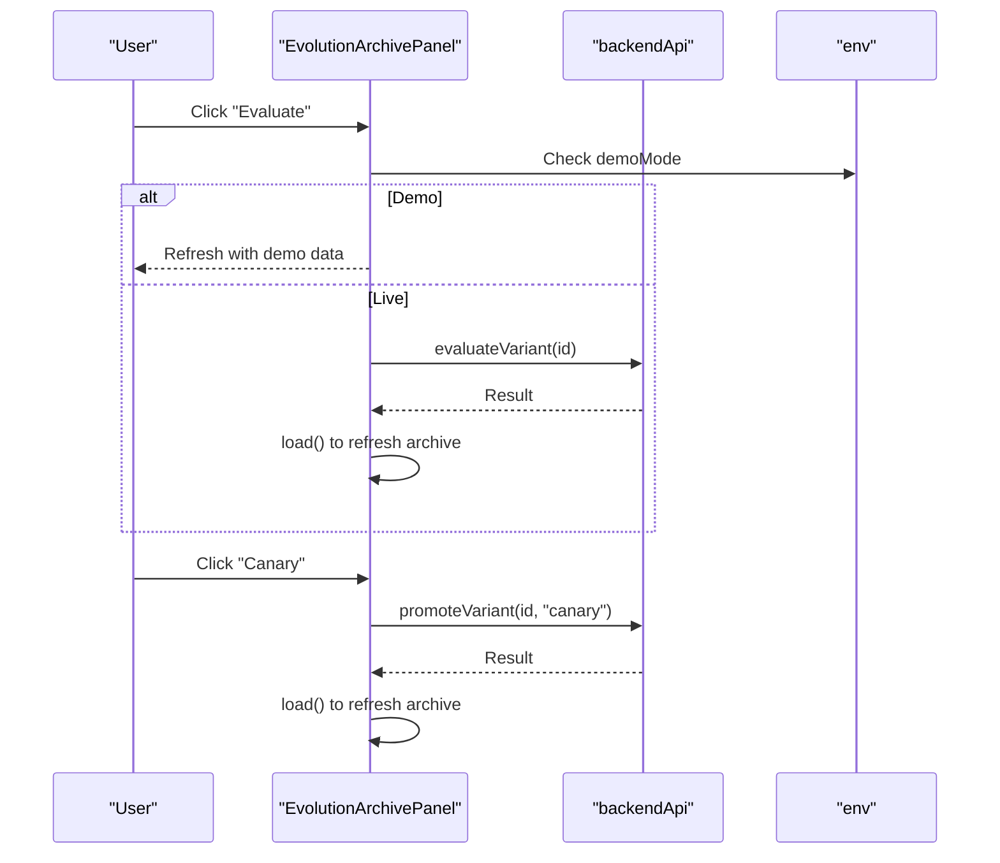
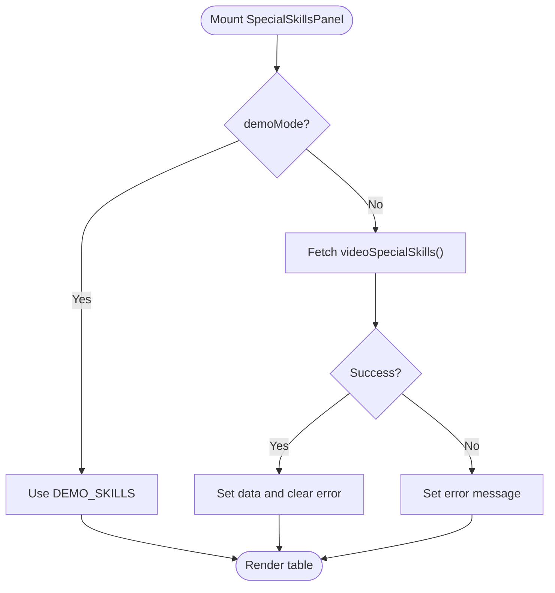
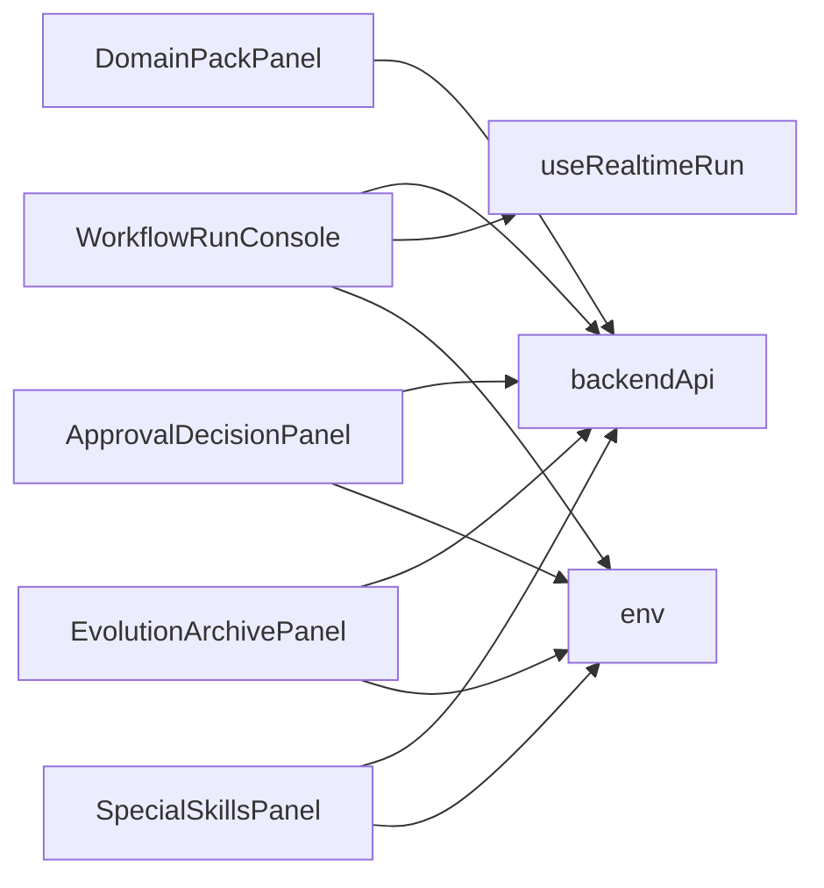

# Dashboard & Domain Components

<cite>
**Referenced Files in This Document**
- [domain-pack-panel.tsx](file://frontend/src/components/domain/domain-pack-panel.tsx)
- [workflow-run-console.tsx](file://frontend/src/components/domain/workflow-run-console.tsx)
- [approval-decision-panel.tsx](file://frontend/src/components/domain/approval-decision-panel.tsx)
- [evolution-archive-panel.tsx](file://frontend/src/components/domain/evolution-archive-panel.tsx)
- [special-skills-panel.tsx](file://frontend/src/components/domain/special-skills-panel.tsx)
- [use-realtime-run.ts](file://frontend/src/hooks/use-realtime-run.ts)
- [client.ts](file://frontend/src/lib/api/client.ts)
- [env.ts](file://frontend/src/lib/config/env.ts)
</cite>

## Table of Contents
1. [Introduction](#introduction)
2. [Project Structure](#project-structure)
3. [Core Components](#core-components)
4. [Architecture Overview](#architecture-overview)
5. [Detailed Component Analysis](#detailed-component-analysis)
6. [Dependency Analysis](#dependency-analysis)
7. [Performance Considerations](#performance-considerations)
8. [Troubleshooting Guide](#troubleshooting-guide)
9. [Conclusion](#conclusion)

## Introduction
This document provides detailed documentation for dashboard and domain-specific UI components that power agent and workflow management, live execution monitoring, human-in-the-loop approvals, evolution archive variant management, and special skills catalog display. It covers component props, events, data binding patterns, integration with backend services, and guidance for extending existing components or creating new domain interfaces.

## Project Structure
The relevant components are located under the frontend domain components directory and integrate with shared UI primitives, API client, environment configuration, and a real-time hook for live run monitoring.

**Diagram sources**
- [domain-pack-panel.tsx:1-131](file://frontend/src/components/domain/domain-pack-panel.tsx#L1-L131)
- [workflow-run-console.tsx:1-149](file://frontend/src/components/domain/workflow-run-console.tsx#L1-L149)
- [approval-decision-panel.tsx:1-72](file://frontend/src/components/domain/approval-decision-panel.tsx#L1-L72)
- [evolution-archive-panel.tsx:1-206](file://frontend/src/components/domain/evolution-archive-panel.tsx#L1-L206)
- [special-skills-panel.tsx:1-175](file://frontend/src/components/domain/special-skills-panel.tsx#L1-L175)
- [use-realtime-run.ts](file://frontend/src/hooks/use-realtime-run.ts)
- [client.ts](file://frontend/src/lib/api/client.ts)
- [env.ts](file://frontend/src/lib/config/env.ts)

**Section sources**
- [domain-pack-panel.tsx:1-131](file://frontend/src/components/domain/domain-pack-panel.tsx#L1-L131)
- [workflow-run-console.tsx:1-149](file://frontend/src/components/domain/workflow-run-console.tsx#L1-L149)
- [approval-decision-panel.tsx:1-72](file://frontend/src/components/domain/approval-decision-panel.tsx#L1-L72)
- [evolution-archive-panel.tsx:1-206](file://frontend/src/components/domain/evolution-archive-panel.tsx#L1-L206)
- [special-skills-panel.tsx:1-175](file://frontend/src/components/domain/special-skills-panel.tsx#L1-L175)
- [use-realtime-run.ts](file://frontend/src/hooks/use-realtime-run.ts)
- [client.ts](file://frontend/src/lib/api/client.ts)
- [env.ts](file://frontend/src/lib/config/env.ts)

## Core Components
This section summarizes each component’s purpose, props, internal state, events, and backend integrations.

- Domain Pack Panel
  - Purpose: Displays registered agents grouped by domain packs and shows ALC readiness status.
  - Props: agents (array of agent records).
  - State: selected domain filter; derived counts for packs, shown agents, ALC ready/incomplete.
  - Events: user selects a domain to filter the table.
  - Data binding: filters agents by domain_id/domainId; computes ALC readiness based on memory scopes, version, and hooks.
  - Backend integration: none directly; intended to be fed by a pack registry endpoint.

- Workflow Run Console
  - Purpose: Live monitoring and lifecycle control of a workflow run.
  - Props: runId, initialEvents.
  - State: connectionState, events, actionState, error, busy action.
  - Events: retry, cancel, pause, resume, expire actions; real-time event stream updates.
  - Data binding: maps events to log lines; renders timeline and logs.
  - Backend integration: calls backendApi methods for lifecycle actions; uses env.demoMode for local simulation.

- Approval Decision Panel
  - Purpose: Human-in-the-loop decision interface for high-risk actions.
  - Props: approvalId (optional).
  - State: decision, backendState, error, busy.
  - Events: approve/reject submission.
  - Data binding: displays decision and backend response details.
  - Backend integration: submits decisions via backendApi.decideApproval; supports demo mode.

- Evolution Archive Panel
  - Purpose: Variant population archive viewer with evaluation and promotion workflows.
  - Props: none.
  - State: archive data, loading, error, busy action.
  - Events: refresh, evaluate, canary, evaluate-then-canary.
  - Data binding: renders archive size, elite, variants list with actions.
  - Backend integration: fetches archive, evaluates variants, promotes to canary; supports demo mode.

- Special Skills Panel
  - Purpose: Catalog view of special skills from the business pack registry.
  - Props: none.
  - State: skills data, loading, error.
  - Events: refresh.
  - Data binding: renders skills table with metadata and summary.
  - Backend integration: fetches skills catalog; supports demo mode.

**Section sources**
- [domain-pack-panel.tsx:1-131](file://frontend/src/components/domain/domain-pack-panel.tsx#L1-L131)
- [workflow-run-console.tsx:1-149](file://frontend/src/components/domain/workflow-run-console.tsx#L1-L149)
- [approval-decision-panel.tsx:1-72](file://frontend/src/components/domain/approval-decision-panel.tsx#L1-L72)
- [evolution-archive-panel.tsx:1-206](file://frontend/src/components/domain/evolution-archive-panel.tsx#L1-L206)
- [special-skills-panel.tsx:1-175](file://frontend/src/components/domain/special-skills-panel.tsx#L1-L175)

## Architecture Overview
The components follow a consistent pattern:
- Read-only or interactive panels render lists and actions.
- Data is loaded either from an API client or demo fixtures when env.demoMode is enabled.
- Real-time updates for workflow runs are handled by a dedicated hook.
- Errors are normalized using a shared formatter.

**Diagram sources**
- [workflow-run-console.tsx:1-149](file://frontend/src/components/domain/workflow-run-console.tsx#L1-L149)
- [use-realtime-run.ts](file://frontend/src/hooks/use-realtime-run.ts)
- [client.ts](file://frontend/src/lib/api/client.ts)
- [env.ts](file://frontend/src/lib/config/env.ts)

## Detailed Component Analysis

### Domain Pack Panel
- Props
  - agents: array of agent records including identifiers, domain tags, status, and ALC-related fields.
- Internal Logic
  - Computes unique domains and filters agents accordingly.
  - Determines ALC readiness by checking required flags, allowed memory scopes, version presence, and reflect hook.
- Rendering
  - Summary metrics: number of packs, shown agents, ALC ready/incomplete counts.
  - Table columns: Agent, Domain, Status, ALC readiness badge.
- Extensibility
  - Add new columns by extending the agent type and mapping fields in the table rows.
  - Integrate with a backend registry by replacing the static agents prop with fetched data.

**Diagram sources**
- [domain-pack-panel.tsx:1-131](file://frontend/src/components/domain/domain-pack-panel.tsx#L1-L131)

**Section sources**
- [domain-pack-panel.tsx:1-131](file://frontend/src/components/domain/domain-pack-panel.tsx#L1-L131)

### Workflow Run Console
- Props
  - runId: identifier of the workflow run.
  - initialEvents: preloaded events for immediate rendering.
- Real-time Integration
  - Uses useRealtimeRun to maintain a live connection and receive incremental events.
- Lifecycle Actions
  - Supports retry, cancel, pause, resume, expire operations via backendApi.
  - In demo mode, simulates outcomes without network calls.
- Error Handling
  - Normalizes errors using formatMutationError and displays them inline.
- Visualization
  - Timeline of events and a log viewer showing timestamped entries.

**Diagram sources**
- [workflow-run-console.tsx:1-149](file://frontend/src/components/domain/workflow-run-console.tsx#L1-L149)
- [use-realtime-run.ts](file://frontend/src/hooks/use-realtime-run.ts)
- [client.ts](file://frontend/src/lib/api/client.ts)
- [env.ts](file://frontend/src/lib/config/env.ts)

**Section sources**
- [workflow-run-console.tsx:1-149](file://frontend/src/components/domain/workflow-run-console.tsx#L1-L149)

### Approval Decision Panel
- Props
  - approvalId: optional identifier for the approval instance.
- Submission Flow
  - Approve or Reject triggers a backend call unless in demo mode or no approvalId is provided.
- State Management
  - Tracks decision, backend response, error, and busy state.
- Feedback
  - Displays decision outcome and backend status details.

**Diagram sources**
- [approval-decision-panel.tsx:1-72](file://frontend/src/components/domain/approval-decision-panel.tsx#L1-L72)
- [client.ts](file://frontend/src/lib/api/client.ts)
- [env.ts](file://frontend/src/lib/config/env.ts)

**Section sources**
- [approval-decision-panel.tsx:1-72](file://frontend/src/components/domain/approval-decision-panel.tsx#L1-L72)

### Evolution Archive Panel
- Data Loading
  - On mount, loads archive data unless in demo mode; supports manual refresh.
- Variant Operations
  - Evaluate: triggers evaluation for a variant.
  - Canary: promotes a variant to canary after ensuring evaluation.
  - Evaluate → Canary: pipeline step that gates promotion on evaluation result.
- Error Handling
  - Normalizes errors and surfaces messages to the user.
- Demo Mode
  - Provides sample archive and disables live API calls.

**Diagram sources**
- [evolution-archive-panel.tsx:1-206](file://frontend/src/components/domain/evolution-archive-panel.tsx#L1-L206)
- [client.ts](file://frontend/src/lib/api/client.ts)
- [env.ts](file://frontend/src/lib/config/env.ts)

**Section sources**
- [evolution-archive-panel.tsx:1-206](file://frontend/src/components/domain/evolution-archive-panel.tsx#L1-L206)

### Special Skills Panel
- Data Loading
  - Fetches skills catalog on mount unless in demo mode; supports manual refresh.
- Rendering
  - Displays skills table with skill_id, kind, status, score, and summary.
- Demo Mode
  - Returns a fixed set of demo skills and notes about registry path.

**Diagram sources**
- [special-skills-panel.tsx:1-175](file://frontend/src/components/domain/special-skills-panel.tsx#L1-L175)
- [client.ts](file://frontend/src/lib/api/client.ts)
- [env.ts](file://frontend/src/lib/config/env.ts)

**Section sources**
- [special-skills-panel.tsx:1-175](file://frontend/src/components/domain/special-skills-panel.tsx#L1-L175)

## Dependency Analysis
Components depend on shared utilities and APIs consistently:
- API client: backendApi encapsulates HTTP calls for all domain features.
- Environment config: env.demoMode toggles between live and simulated behavior.
- Real-time hook: useRealtimeRun manages WebSocket-like streaming for workflow runs.
- Error formatting: formatMutationError normalizes mutation errors across components.

**Diagram sources**
- [domain-pack-panel.tsx:1-131](file://frontend/src/components/domain/domain-pack-panel.tsx#L1-L131)
- [workflow-run-console.tsx:1-149](file://frontend/src/components/domain/workflow-run-console.tsx#L1-L149)
- [approval-decision-panel.tsx:1-72](file://frontend/src/components/domain/approval-decision-panel.tsx#L1-L72)
- [evolution-archive-panel.tsx:1-206](file://frontend/src/components/domain/evolution-archive-panel.tsx#L1-L206)
- [special-skills-panel.tsx:1-175](file://frontend/src/components/domain/special-skills-panel.tsx#L1-L175)
- [use-realtime-run.ts](file://frontend/src/hooks/use-realtime-run.ts)
- [client.ts](file://frontend/src/lib/api/client.ts)
- [env.ts](file://frontend/src/lib/config/env.ts)

**Section sources**
- [domain-pack-panel.tsx:1-131](file://frontend/src/components/domain/domain-pack-panel.tsx#L1-L131)
- [workflow-run-console.tsx:1-149](file://frontend/src/components/domain/workflow-run-console.tsx#L1-L149)
- [approval-decision-panel.tsx:1-72](file://frontend/src/components/domain/approval-decision-panel.tsx#L1-L72)
- [evolution-archive-panel.tsx:1-206](file://frontend/src/components/domain/evolution-archive-panel.tsx#L1-L206)
- [special-skills-panel.tsx:1-175](file://frontend/src/components/domain/special-skills-panel.tsx#L1-L175)
- [use-realtime-run.ts](file://frontend/src/hooks/use-realtime-run.ts)
- [client.ts](file://frontend/src/lib/api/client.ts)
- [env.ts](file://frontend/src/lib/config/env.ts)

## Performance Considerations
- Avoid unnecessary re-renders by memoizing derived data where possible (e.g., filtered lists, computed metrics).
- Debounce or throttle frequent UI interactions like refresh buttons if backend calls are expensive.
- For large tables (e.g., domain pack panel), consider virtualization to improve scrolling performance.
- Use pagination or lazy loading for evolving archives and special skills catalogs when datasets grow.
- Ensure real-time event streams are efficiently processed; batch updates if needed to prevent UI jank.

## Troubleshooting Guide
- Demo Mode Behavior
  - If env.demoMode is enabled, components simulate responses instead of calling the backend. Verify environment configuration when testing integrations.
- Error Normalization
  - All mutation errors are formatted using a shared utility. Inspect the displayed error messages for actionable details.
- Real-time Connection Issues
  - The workflow run console shows a connection state badge. If disconnected, verify network connectivity and backend availability.
- Missing Data States
  - Empty states are surfaced for archives and skills panels. Confirm that backend endpoints return expected payloads or that demo fixtures are active.

**Section sources**
- [workflow-run-console.tsx:1-149](file://frontend/src/components/domain/workflow-run-console.tsx#L1-L149)
- [approval-decision-panel.tsx:1-72](file://frontend/src/components/domain/approval-decision-panel.tsx#L1-L72)
- [evolution-archive-panel.tsx:1-206](file://frontend/src/components/domain/evolution-archive-panel.tsx#L1-L206)
- [special-skills-panel.tsx:1-175](file://frontend/src/components/domain/special-skills-panel.tsx#L1-L175)

## Conclusion
These domain components provide a cohesive dashboard experience for managing agents, workflows, approvals, evolution variants, and special skills. They share consistent patterns for data fetching, error handling, and demo-mode simulation, making them straightforward to extend and integrate with backend services. By following the documented props, events, and data binding strategies, developers can confidently add new capabilities or customize existing interfaces.