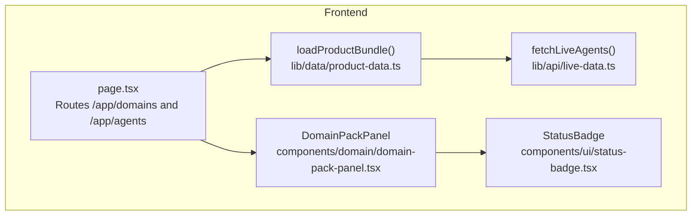
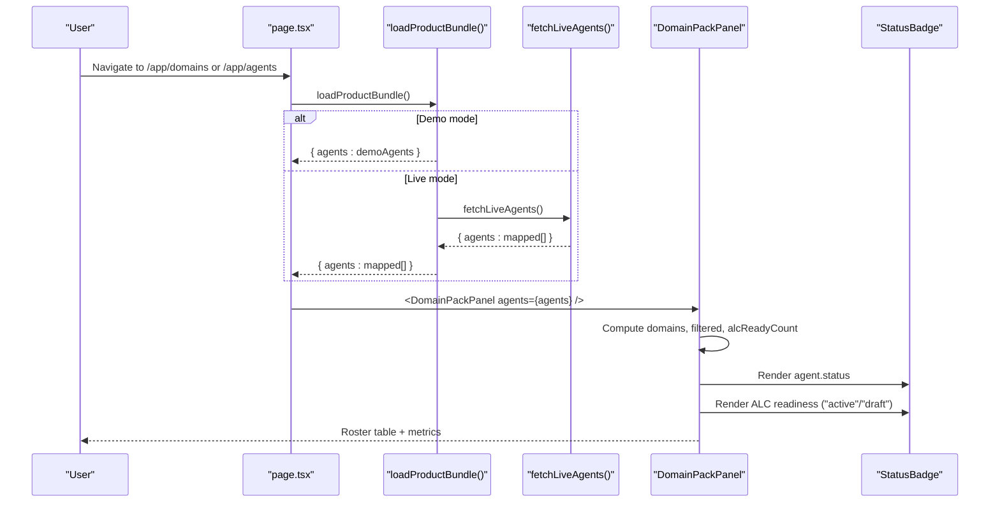
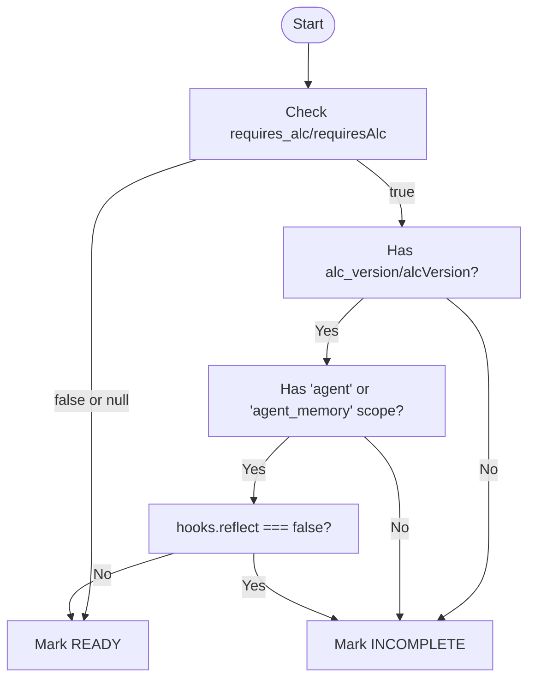
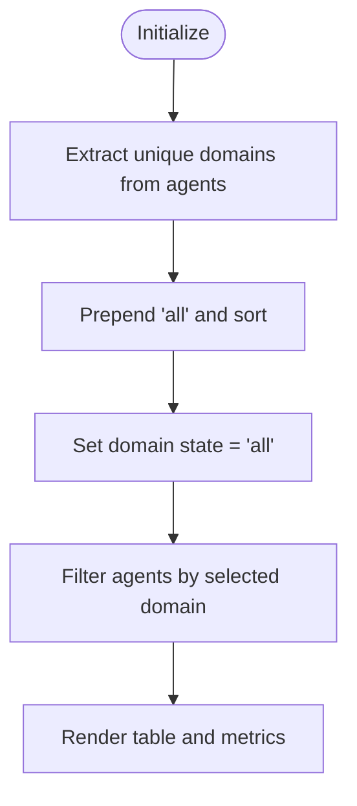
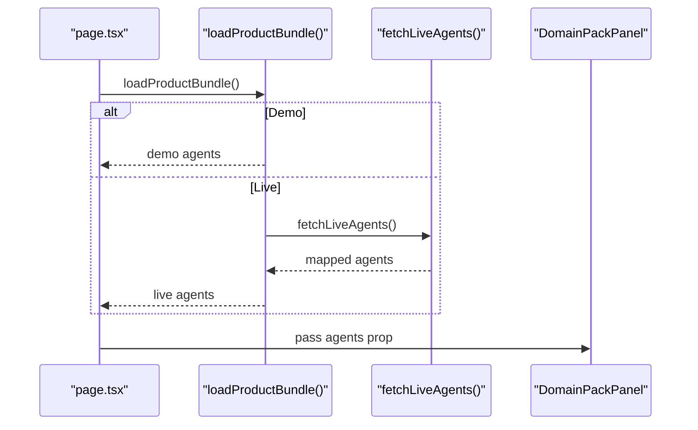
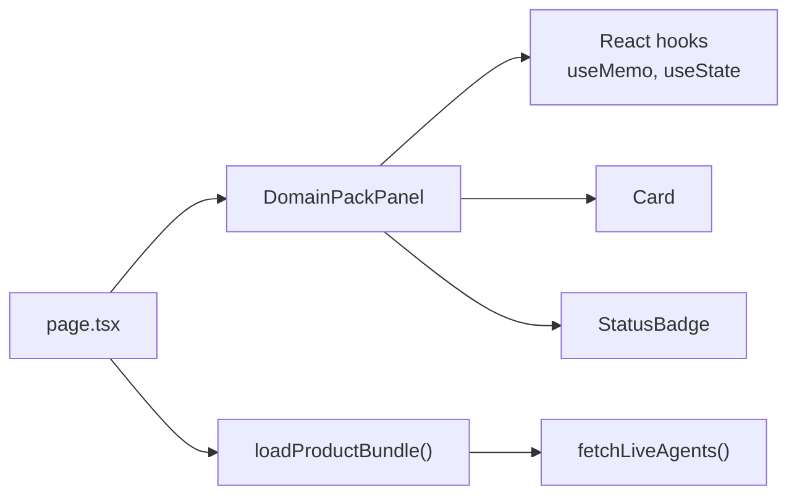

# Domain Pack Panel

<cite>
**Referenced Files in This Document**
- [domain-pack-panel.tsx](file://frontend/src/components/domain/domain-pack-panel.tsx)
- [page.tsx](file://frontend/src/app/app/[...slug]/page.tsx)
- [product-data.ts](file://frontend/src/lib/data/product-data.ts)
- [live-data.ts](file://frontend/src/lib/api/live-data.ts)
- [status-badge.tsx](file://frontend/src/components/ui/status-badge.tsx)
</cite>

## Table of Contents
1. [Introduction](#introduction)
2. [Project Structure](#project-structure)
3. [Core Components](#core-components)
4. [Architecture Overview](#architecture-overview)
5. [Detailed Component Analysis](#detailed-component-analysis)
6. [Dependency Analysis](#dependency-analysis)
7. [Performance Considerations](#performance-considerations)
8. [Troubleshooting Guide](#troubleshooting-guide)
9. [Conclusion](#conclusion)
10. [Appendices](#appendices)

## Introduction
DomainPackPanel is a multi-domain agent roster interface that helps operators view and filter agents by domain, inspect their operational status, and assess ALC (Agent Lifecycle Control) readiness. It provides:
- A compact summary of pack counts, isolation hints, and ALC readiness metrics
- A table listing Agent name, Domain, Status, and ALC readiness indicators
- Client-side filtering by domain with an “All” default view
- A simple readiness assessment based on agent metadata such as required ALC version, memory scopes, and hooks

This component is used within the application’s domains and agents pages to present a consolidated view of registered domain packs and their agents.

## Project Structure
The component lives under the frontend components directory and is consumed by the app routing page for both the domains and agents sections. Data is sourced either from demo fixtures or live backend APIs via a product data facade.

**Diagram sources**
- [page.tsx:340-370](file://frontend/src/app/app/[...slug]/page.tsx#L340-L370)
- [domain-pack-panel.tsx:1-131](file://frontend/src/components/domain/domain-pack-panel.tsx#L1-L131)
- [product-data.ts:37-108](file://frontend/src/lib/data/product-data.ts#L37-L108)
- [live-data.ts:27-39](file://frontend/src/lib/api/live-data.ts#L27-L39)
- [status-badge.tsx:1-6](file://frontend/src/components/ui/status-badge.tsx#L1-L6)

**Section sources**
- [page.tsx:340-370](file://frontend/src/app/app/[...slug]/page.tsx#L340-L370)
- [domain-pack-panel.tsx:1-131](file://frontend/src/components/domain/domain-pack-panel.tsx#L1-L131)
- [product-data.ts:37-108](file://frontend/src/lib/data/product-data.ts#L37-L108)
- [live-data.ts:27-39](file://frontend/src/lib/api/live-data.ts#L27-L39)
- [status-badge.tsx:1-6](file://frontend/src/components/ui/status-badge.tsx#L1-L6)

## Core Components
- DomainPackPanel
  - Purpose: Render a multi-domain agent roster with ALC readiness assessment and domain filtering.
  - Props:
    - agents: Array of agent objects conforming to the DomainPackAgent type.
  - Internal state:
    - domain: Current selected domain filter; defaults to “all”.
  - Derived values:
    - domains: Unique list of domains extracted from agents plus “all”.
    - filtered: Agents filtered by selected domain.
    - alcReadyCount: Number of agents considered ALC-ready among filtered results.
    - packCount: Number of distinct non-empty domains.
  - UI:
    - Summary header with pack count and isolation hint.
    - Domain selector dropdown.
    - Metrics row showing Packs, Shown, ALC ready, and ALC gaps.
    - Table columns: Agent, Domain, Status, ALC.
    - Pagination note when more than 50 rows are present.
    - Empty state guidance when no agents match the filter.

- StatusBadge
  - Purpose: Display a styled badge for any string-based status value.
  - Usage in DomainPackPanel:
    - For agent.status
    - For ALC readiness mapped to “active” (ready) or “draft” (incomplete)

**Section sources**
- [domain-pack-panel.tsx:1-131](file://frontend/src/components/domain/domain-pack-panel.tsx#L1-L131)
- [status-badge.tsx:1-6](file://frontend/src/components/ui/status-badge.tsx#L1-L6)

## Architecture Overview
Data flow from backend to UI:
- The app page loads agents using loadProductBundle(), which chooses between demo fixtures or live API calls.
- In live mode, fetchLiveAgents() retrieves agents from the backend and maps them into the UI shape.
- The page passes the agents array to DomainPackPanel.
- DomainPackPanel computes domains, filters, and ALC readiness, then renders the table and metrics.

**Diagram sources**
- [page.tsx:340-370](file://frontend/src/app/app/[...slug]/page.tsx#L340-L370)
- [product-data.ts:37-108](file://frontend/src/lib/data/product-data.ts#L37-L108)
- [live-data.ts:27-39](file://frontend/src/lib/api/live-data.ts#L27-L39)
- [domain-pack-panel.tsx:1-131](file://frontend/src/components/domain/domain-pack-panel.tsx#L1-L131)
- [status-badge.tsx:1-6](file://frontend/src/components/ui/status-badge.tsx#L1-L6)

## Detailed Component Analysis

### DomainPackPanel Props and Data Model
- Prop:
  - agents: DomainPackAgent[]
- DomainPackAgent fields:
  - id: string
  - name: string
  - status: string
  - domain_id?: string | null
  - domainId?: string | null
  - requires_alc?: boolean | null
  - requiresAlc?: boolean | null
  - alc_version?: string | null
  - alcVersion?: string | null
  - allowed_memory_scopes?: string[] | null
  - allowedMemoryScopes?: string[] | null
  - hooks?: { reflect?: boolean } | null
  - owner?: string
  - knowledgeAccess?: string

Notes:
- The component supports both snake_case and camelCase field names for compatibility with different payload shapes.

**Section sources**
- [domain-pack-panel.tsx:7-22](file://frontend/src/components/domain/domain-pack-panel.tsx#L7-L22)

### ALC Readiness Calculation Logic
Readiness is determined by:
- If requires_alc/requiresAlc is false or absent, treat as ready.
- Otherwise, require:
  - A non-empty alc_version/alcVersion
  - At least one of the memory scopes “agent” or “agent_memory” in allowed_memory_scopes/allowedMemoryScopes
  - hooks.reflect not explicitly set to false

If any requirement fails, the agent is marked incomplete.

**Diagram sources**
- [domain-pack-panel.tsx:24-34](file://frontend/src/components/domain/domain-pack-panel.tsx#L24-L34)

**Section sources**
- [domain-pack-panel.tsx:24-34](file://frontend/src/components/domain/domain-pack-panel.tsx#L24-L34)

### Domain Filtering Functionality
- Domains extraction:
  - Collect unique domain identifiers from agents using domain_id or domainId.
  - Prepend “all” to the sorted list of domains.
- State management:
  - useState<string> holds the current selection; default is “all”.
- Filtering:
  - If “all”, show all agents.
  - Otherwise, filter agents where domain matches the selected value.

**Diagram sources**
- [domain-pack-panel.tsx:36-51](file://frontend/src/components/domain/domain-pack-panel.tsx#L36-L51)

**Section sources**
- [domain-pack-panel.tsx:36-51](file://frontend/src/components/domain/domain-pack-panel.tsx#L36-L51)

### Table Display Columns
- Agent: Displays agent.name if available, otherwise falls back to agent.id.
- Domain: Displays domain_id or domainId; shows “—” if missing.
- Status: Uses StatusBadge to render agent.status.
- ALC: Uses StatusBadge to render readiness (“active” for ready, “draft” for incomplete), followed by a text label indicating “ready” or “incomplete”.

**Section sources**
- [domain-pack-panel.tsx:91-127](file://frontend/src/components/domain/domain-pack-panel.tsx#L91-L127)
- [status-badge.tsx:1-6](file://frontend/src/components/ui/status-badge.tsx#L1-L6)

### Data Binding Patterns and Integration
- Data source:
  - The app page uses loadProductBundle() to obtain agents.
  - In live mode, fetchLiveAgents() maps backend responses into the UI shape.
- Binding:
  - The page passes the agents array directly to DomainPackPanel as props.
- Backend integration:
  - Live mode relies on backendApi.listAgents() through fetchLiveAgents().
  - Demo mode uses static fixtures for development and testing.

**Diagram sources**
- [page.tsx:340-370](file://frontend/src/app/app/[...slug]/page.tsx#L340-L370)
- [product-data.ts:37-108](file://frontend/src/lib/data/product-data.ts#L37-L108)
- [live-data.ts:27-39](file://frontend/src/lib/api/live-data.ts#L27-L39)
- [domain-pack-panel.tsx:36-51](file://frontend/src/components/domain/domain-pack-panel.tsx#L36-L51)

**Section sources**
- [page.tsx:340-370](file://frontend/src/app/app/[...slug]/page.tsx#L340-L370)
- [product-data.ts:37-108](file://frontend/src/lib/data/product-data.ts#L37-L108)
- [live-data.ts:27-39](file://frontend/src/lib/api/live-data.ts#L27-L39)
- [domain-pack-panel.tsx:36-51](file://frontend/src/components/domain/domain-pack-panel.tsx#L36-L51)

### Extending the Component
- Custom domain views:
  - Add new computed metrics or groupings derived from agents (e.g., per-domain readiness breakdown).
  - Introduce additional selectors or tabs to switch between views while preserving the core filtering logic.
- New filtering capabilities:
  - Extend the filter state to include additional criteria (e.g., status, ALC readiness).
  - Update the filtered computation to combine multiple predicates.
- Rendering enhancements:
  - Replace or augment the table with a grid or card layout for large datasets.
  - Implement client-side pagination or virtualization for performance at scale.
- ALC readiness extension:
  - Expand the readiness function to incorporate additional policy checks (e.g., minimum tool permissions, risk tier).
  - Surface detailed reasons for incompleteness in tooltips or a dedicated column.

[No sources needed since this section provides general guidance]

## Dependency Analysis
- Direct dependencies:
  - React hooks: useMemo, useState
  - UI primitives: Card, StatusBadge
- Indirect dependencies:
  - App page supplies agents via loadProductBundle() and fetchLiveAgents()
  - StatusBadge depends on design tokens and formatting utilities

**Diagram sources**
- [domain-pack-panel.tsx:1-131](file://frontend/src/components/domain/domain-pack-panel.tsx#L1-L131)
- [page.tsx:340-370](file://frontend/src/app/app/[...slug]/page.tsx#L340-L370)
- [product-data.ts:37-108](file://frontend/src/lib/data/product-data.ts#L37-L108)
- [live-data.ts:27-39](file://frontend/src/lib/api/live-data.ts#L27-L39)
- [status-badge.tsx:1-6](file://frontend/src/components/ui/status-badge.tsx#L1-L6)

**Section sources**
- [domain-pack-panel.tsx:1-131](file://frontend/src/components/domain/domain-pack-panel.tsx#L1-L131)
- [page.tsx:340-370](file://frontend/src/app/app/[...slug]/page.tsx#L340-L370)
- [product-data.ts:37-108](file://frontend/src/lib/data/product-data.ts#L37-L108)
- [live-data.ts:27-39](file://frontend/src/lib/api/live-data.ts#L27-L39)
- [status-badge.tsx:1-6](file://frontend/src/components/ui/status-badge.tsx#L1-L6)

## Performance Considerations
- Memoization:
  - domains and filtered lists are memoized to avoid recomputation on every render.
- Rendering cap:
  - The table slices the first 50 rows to limit DOM size; consider pagination or virtualization for larger datasets.
- Filtering cost:
  - Filtering is O(n) over agents; acceptable for moderate sizes but may need optimization for very large lists.
- ALC readiness:
  - Computed inline per row; can be precomputed into a derived array if needed for further optimizations.

[No sources needed since this section provides general guidance]

## Troubleshooting Guide
- No agents shown:
  - Ensure agents array is populated by loadProductBundle(); verify backend connectivity in live mode.
  - Confirm domain_id/domainId values exist on agents to populate the domain filter.
- Incorrect ALC readiness:
  - Verify presence of alc_version/alcVersion and correct memory scopes.
  - Ensure hooks.reflect is not explicitly false when ALC is required.
- StatusBadge rendering:
  - Confirm agent.status values map to expected tones and labels via the underlying mapping utilities.

**Section sources**
- [domain-pack-panel.tsx:24-34](file://frontend/src/components/domain/domain-pack-panel.tsx#L24-L34)
- [status-badge.tsx:1-6](file://frontend/src/components/ui/status-badge.tsx#L1-L6)

## Conclusion
DomainPackPanel offers a focused, extensible view of multi-domain agent rosters with clear ALC readiness signals. Its simple props contract, client-side filtering, and straightforward readiness logic make it easy to integrate and extend for custom domain views and advanced filtering needs.

[No sources needed since this section summarizes without analyzing specific files]

## Appendices

### Example Data Binding Pattern
- Load agents:
  - Use loadProductBundle() to get agents in either demo or live mode.
- Pass to panel:
  - Provide the agents array as the agents prop to DomainPackPanel.
- Observe metrics:
  - Use the summary metrics to track pack counts, shown agents, and ALC readiness.

**Section sources**
- [product-data.ts:37-108](file://frontend/src/lib/data/product-data.ts#L37-L108)
- [page.tsx:340-370](file://frontend/src/app/app/[...slug]/page.tsx#L340-L370)
- [domain-pack-panel.tsx:56-90](file://frontend/src/components/domain/domain-pack-panel.tsx#L56-L90)