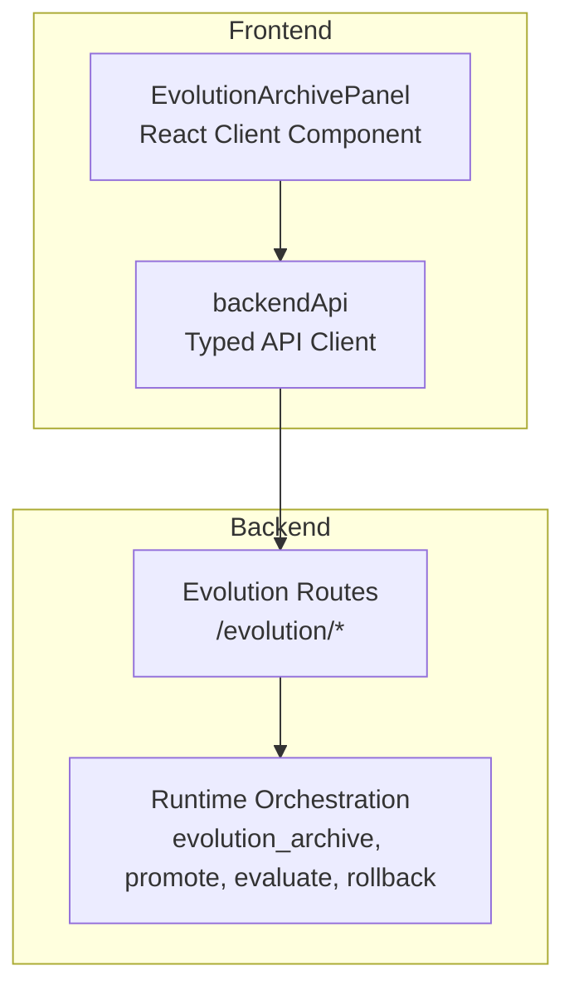
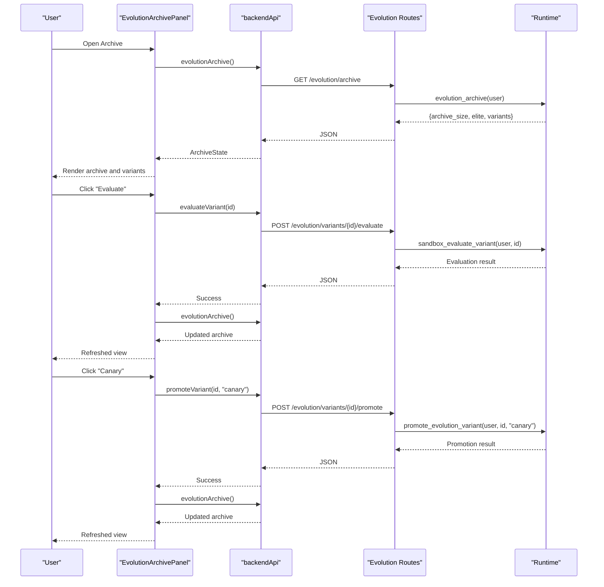
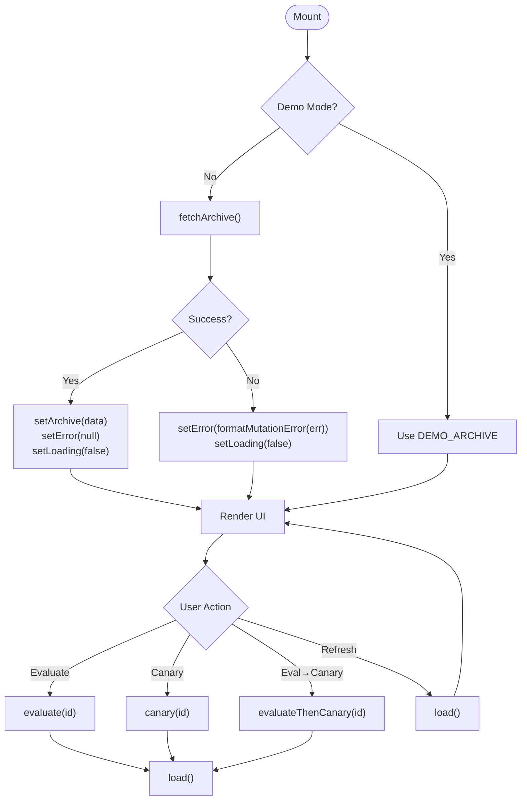
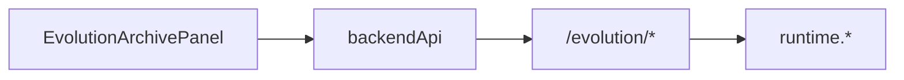

# Evolution Archive Panel

<cite>
**Referenced Files in This Document**
- [evolution-archive-panel.tsx](file://frontend/src/components/domain/evolution-archive-panel.tsx)
- [client.ts](file://frontend/src/lib/api/client.ts)
- [evolution.py](file://backend/app/api/v1/routes/evolution.py)
- [runtime.py](file://backend/app/runtime.py)
</cite>

## Table of Contents
1. [Introduction](#introduction)
2. [Project Structure](#project-structure)
3. [Core Components](#core-components)
4. [Architecture Overview](#architecture-overview)
5. [Detailed Component Analysis](#detailed-component-analysis)
6. [Dependency Analysis](#dependency-analysis)
7. [Performance Considerations](#performance-considerations)
8. [Troubleshooting Guide](#troubleshooting-guide)
9. [Conclusion](#conclusion)
10. [Appendices](#appendices)

## Introduction
The EvolutionArchivePanel is a client-side React component that provides an interface for browsing the evolution sandbox archive, viewing variant metadata and fitness rankings, and initiating deployment workflow actions such as evaluation, canary promotion, and a combined evaluate-then-canary flow. It integrates with backend evolution APIs to fetch archive data and execute mutations, while supporting a demo mode for local development without a running backend.

Key capabilities:
- Browse population archive size and elite variant summary
- Inspect variants with base workflow references, fitness scores, and evaluation results
- Trigger evaluation, canary promotion, or an end-to-end evaluate-then-canary pipeline
- Handle loading, error, and busy states consistently across actions
- Support refresh operations to re-sync with backend state

## Project Structure
The EvolutionArchivePanel lives in the frontend domain components and consumes a typed API client that wraps HTTP calls to the backend evolution endpoints. The backend exposes REST routes under /evolution which delegate to runtime orchestration methods.

**Diagram sources**
- [evolution-archive-panel.tsx:1-206](file://frontend/src/components/domain/evolution-archive-panel.tsx#L1-L206)
- [client.ts:106-245](file://frontend/src/lib/api/client.ts#L106-L245)
- [evolution.py:1-61](file://backend/app/api/v1/routes/evolution.py#L1-L61)
- [runtime.py:1-200](file://backend/app/runtime.py#L1-L200)

**Section sources**
- [evolution-archive-panel.tsx:1-206](file://frontend/src/components/domain/evolution-archive-panel.tsx#L1-L206)
- [client.ts:106-245](file://frontend/src/lib/api/client.ts#L106-L245)
- [evolution.py:1-61](file://backend/app/api/v1/routes/evolution.py#L1-L61)
- [runtime.py:1-200](file://backend/app/runtime.py#L1-L200)

## Core Components
- EvolutionArchivePanel (React client component)
  - Responsibilities:
    - Load archive data on mount (unless demo mode)
    - Render archive summary cards (size, elite)
    - Render variant list with metadata and action buttons
    - Manage loading, error, and busy states
    - Call backend APIs via backendApi for evaluate, promote, and combined flows
  - Key props/state:
    - No external props; uses internal state for archive, error, busy, and loading
    - Demo mode support via environment configuration
- Typed API Client (backendApi)
  - Provides strongly-typed wrappers for evolution endpoints:
    - evolutionArchive()
    - listEvolutionVariants()
    - evaluateVariant(variantId)
    - promoteVariant(variantId, mode)
    - runCoevolution(payload)
    - governanceReview()
- Backend Evolution Routes
  - Exposes REST endpoints:
    - GET /evolution/archive
    - POST /evolution/variants/{id}/evaluate
    - POST /evolution/variants/{id}/promote
    - POST /evolution/variants/{id}/rollback
    - Additional endpoints for listing variants, proposing variants, coevolution runs, and governance review
- Runtime Orchestration
  - Implements business logic behind routes (e.g., evolution_archive, promote_evolution_variant, sandbox_evaluate_variant, rollback_evolution_variant)

**Section sources**
- [evolution-archive-panel.tsx:1-206](file://frontend/src/components/domain/evolution-archive-panel.tsx#L1-L206)
- [client.ts:106-245](file://frontend/src/lib/api/client.ts#L106-L245)
- [evolution.py:1-61](file://backend/app/api/v1/routes/evolution.py#L1-L61)
- [runtime.py:1-200](file://backend/app/runtime.py#L1-L200)

## Architecture Overview
The panel follows a simple client-server architecture:
- The React component requests archive data from the backend when mounted (unless demo mode).
- Actions like Evaluate, Canary, and Eval → Canary trigger corresponding mutation endpoints.
- The backend routes authenticate requests and delegate to runtime methods that perform evaluation, promotion, and rollback operations.

**Diagram sources**
- [evolution-archive-panel.tsx:40-139](file://frontend/src/components/domain/evolution-archive-panel.tsx#L40-L139)
- [client.ts:200-211](file://frontend/src/lib/api/client.ts#L200-L211)
- [evolution.py:14-38](file://backend/app/api/v1/routes/evolution.py#L14-L38)
- [runtime.py:1-200](file://backend/app/runtime.py#L1-L200)

## Detailed Component Analysis

### EvolutionArchivePanel Component
- State management:
  - archive: current archive snapshot (demo or fetched)
  - error: formatted error message string
  - busy: tracks active operation IDs to disable buttons during async work
  - loading: indicates initial load status
- Data fetching:
  - On mount, if not in demo mode, fetches archive via backendApi.evolutionArchive()
  - Error handling uses formatMutationError to normalize backend errors
- Actions:
  - Evaluate: triggers evaluation for a variant, then reloads archive
  - Canary: optionally evaluates first (if needed), promotes to canary, then reloads archive
  - Eval → Canary: enforces evaluation pass before promoting to canary
  - Refresh: reloads archive data
- Rendering:
  - Summary cards for archive size and elite variant
  - Variant list with metadata fields: base_workflow_id, fitness, evaluation_result
  - StatusBadge displays variant status
  - Empty state guidance when no variants exist

**Diagram sources**
- [evolution-archive-panel.tsx:40-139](file://frontend/src/components/domain/evolution-archive-panel.tsx#L40-L139)

**Section sources**
- [evolution-archive-panel.tsx:1-206](file://frontend/src/components/domain/evolution-archive-panel.tsx#L1-L206)

### API Client Integration
- Methods used by the panel:
  - evolutionArchive(): GET /evolution/archive
  - evaluateVariant(id): POST /evolution/variants/{id}/evaluate
  - promoteVariant(id, mode): POST /evolution/variants/{id}/promote
- Authentication:
  - Requests include Authorization Bearer token resolved from cookies/sessionStorage
- Error normalization:
  - AppError thrown with message, status code, request ID, and optional error code
  - FastAPI validation errors are flattened into a single message string

**Section sources**
- [client.ts:68-104](file://frontend/src/lib/api/client.ts#L68-L104)
- [client.ts:200-211](file://frontend/src/lib/api/client.ts#L200-L211)

### Backend Endpoints and Orchestration
- Routes:
  - GET /evolution/archive returns population archive
  - POST /evolution/variants/{id}/evaluate performs sandbox evaluation
  - POST /evolution/variants/{id}/promote supports promotion modes including canary
  - POST /evolution/variants/{id}/rollback supports rollback operations
- Orchestration:
  - Route handlers call runtime methods to implement business logic
  - AuthenticatedUser dependency ensures authorization context

**Section sources**
- [evolution.py:14-38](file://backend/app/api/v1/routes/evolution.py#L14-L38)
- [runtime.py:1-200](file://backend/app/runtime.py#L1-L200)

## Dependency Analysis
- Frontend dependencies:
  - EvolutionArchivePanel depends on:
    - backendApi for network calls
    - env for demo mode flag
    - UI primitives (Button, Card, StatusBadge)
- Backend dependencies:
  - Routes depend on:
    - AuthenticatedUser via dependency injection
    - runtime for business logic
- Coupling:
  - Component is loosely coupled to backend through typed API client
  - Clear separation between UI state and server state

**Diagram sources**
- [evolution-archive-panel.tsx:1-206](file://frontend/src/components/domain/evolution-archive-panel.tsx#L1-L206)
- [client.ts:200-211](file://frontend/src/lib/api/client.ts#L200-L211)
- [evolution.py:1-61](file://backend/app/api/v1/routes/evolution.py#L1-L61)
- [runtime.py:1-200](file://backend/app/runtime.py#L1-L200)

**Section sources**
- [evolution-archive-panel.tsx:1-206](file://frontend/src/components/domain/evolution-archive-panel.tsx#L1-L206)
- [client.ts:200-211](file://frontend/src/lib/api/client.ts#L200-L211)
- [evolution.py:1-61](file://backend/app/api/v1/routes/evolution.py#L1-L61)
- [runtime.py:1-200](file://backend/app/runtime.py#L1-L200)

## Performance Considerations
- Avoid redundant requests:
  - Debounce refresh actions if users click rapidly
  - Consider caching recent archive snapshots in component state or local storage for faster re-renders
- Optimize rendering:
  - Memoize variant rows using React.memo to prevent unnecessary re-renders
  - Virtualize long variant lists if archive grows large
- Network efficiency:
  - Batch operations where possible (e.g., bulk evaluate)
  - Use optimistic updates with rollback on failure for better UX
- Error resilience:
  - Implement retry with exponential backoff for transient failures
  - Surface actionable error messages to users

[No sources needed since this section provides general guidance]

## Troubleshooting Guide
Common issues and resolutions:
- Authentication failures:
  - Ensure access token is present in cookies/sessionStorage
  - Verify Authorization header is attached to requests
- Validation errors:
  - FastAPI validation errors are normalized into a single message; check payload structure for propose/promote operations
- Demo mode behavior:
  - In demo mode, no network calls are made; archive data is static
- Busy state conflicts:
  - Multiple concurrent actions may set busy flags; ensure unique keys per action to avoid button state collisions

**Section sources**
- [client.ts:68-104](file://frontend/src/lib/api/client.ts#L68-L104)
- [evolution-archive-panel.tsx:40-139](file://frontend/src/components/domain/evolution-archive-panel.tsx#L40-L139)

## Conclusion
The EvolutionArchivePanel provides a focused, user-friendly interface for managing evolution sandbox variants and their deployment lifecycle. By integrating with backend evolution APIs, it enables evaluation, canary promotion, and rollback workflows while maintaining clear state management and error handling. The design supports extensibility for additional analysis features and customization of the archive view.

[No sources needed since this section summarizes without analyzing specific files]

## Appendices

### Props and Data Model
- Internal types:
  - ArchiveVariant: id, name, status, fitness, base_workflow_id, evaluation_result, sandbox_only
  - ArchiveState: archive_size, elite, variants
- Environment:
  - demoMode: boolean flag to enable mock data

**Section sources**
- [evolution-archive-panel.tsx:11-31](file://frontend/src/components/domain/evolution-archive-panel.tsx#L11-L31)

### Backend API Reference
- Endpoints:
  - GET /evolution/archive
  - POST /evolution/variants/{id}/evaluate
  - POST /evolution/variants/{id}/promote
  - POST /evolution/variants/{id}/rollback
- Request/response contracts:
  - Responses return structured JSON objects representing archive state and operation outcomes

**Section sources**
- [evolution.py:14-38](file://backend/app/api/v1/routes/evolution.py#L14-L38)

### Customization Guidance
- To add new variant analysis features:
  - Extend ArchiveVariant type with new fields
  - Add new backend endpoints if necessary
  - Integrate new actions in the panel with appropriate busy/error handling
- To customize archive view:
  - Replace or extend variant row rendering
  - Add filters/sorting based on fitness or evaluation_result
  - Integrate charts or timelines for deployment history visualization

[No sources needed since this section provides general guidance]