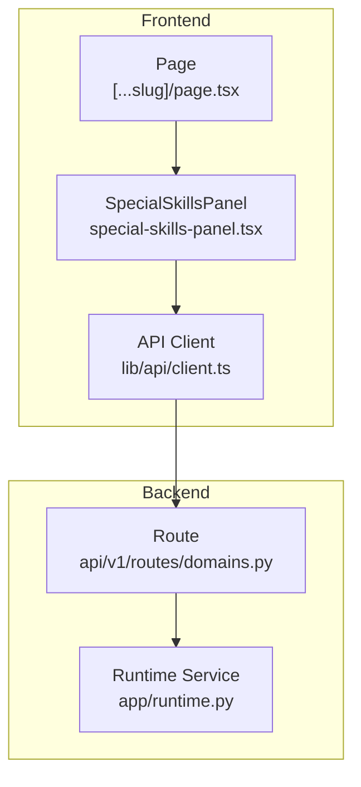
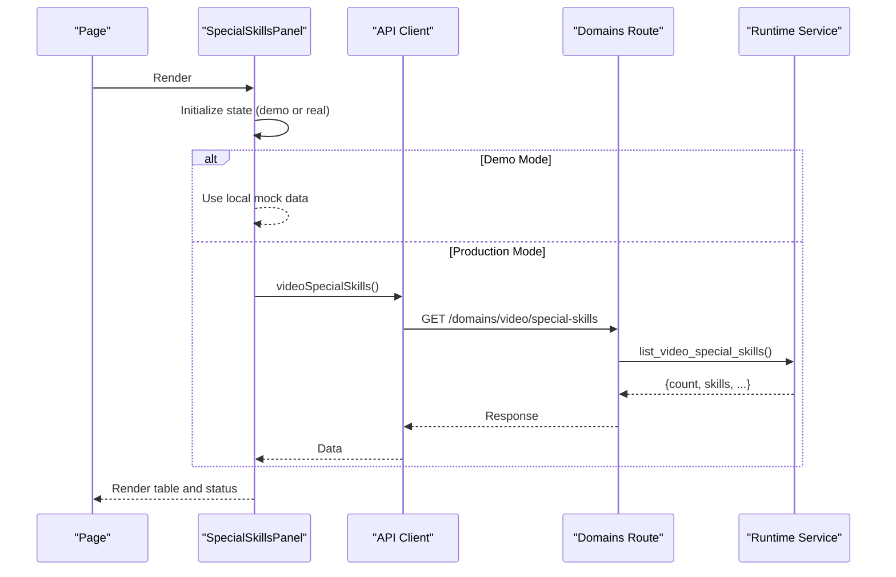
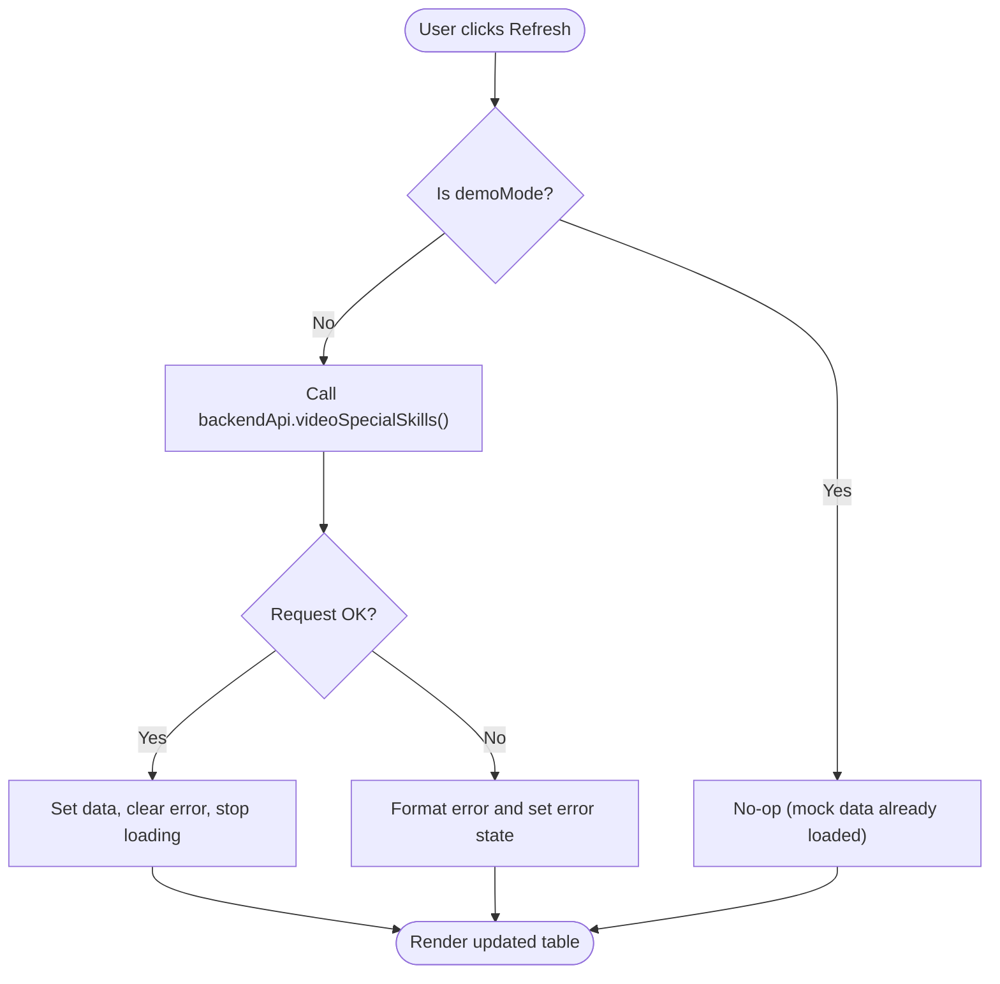
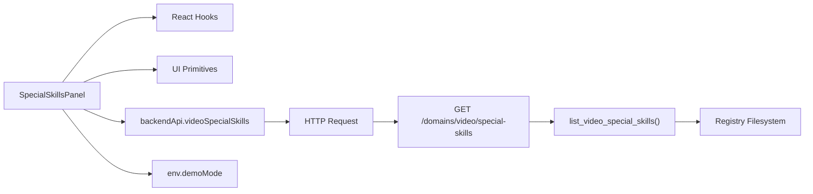

# Special Skills Panel

<cite>
**Referenced Files in This Document**
- [special-skills-panel.tsx](file://frontend/src/components/domain/special-skills-panel.tsx)
- [client.ts](file://frontend/src/lib/api/client.ts)
- [page.tsx](file://frontend/src/app/app/[...slug]/page.tsx)
- [domains.py](file://backend/app/api/v1/routes/domains.py)
- [runtime.py](file://backend/app/runtime.py)
</cite>

## Table of Contents
1. [Introduction](#introduction)
2. [Project Structure](#project-structure)
3. [Core Components](#core-components)
4. [Architecture Overview](#architecture-overview)
5. [Detailed Component Analysis](#detailed-component-analysis)
6. [Dependency Analysis](#dependency-analysis)
7. [Performance Considerations](#performance-considerations)
8. [Troubleshooting Guide](#troubleshooting-guide)
9. [Conclusion](#conclusion)
10. [Appendices](#appendices)

## Introduction
The SpecialSkillsPanel is a client-side React component that provides an interface for browsing and understanding specialized agent skills and capabilities exposed by the video domain pack. It displays a catalog of registered special skills, their metadata (such as kind, status, score, and summary), and indicates whether live execution is supported. The panel supports both demo mode (local mock data) and production mode (fetching from the backend API). It also exposes a refresh action to reload the catalog when not in demo mode.

This documentation explains the component’s purpose, props, data model, UI behaviors, integration points with the backend, and guidance for extending the panel to support new skill types and advanced management features.

## Project Structure
The SpecialSkillsPanel is part of the frontend application and integrates with:
- A typed API client that calls backend endpoints
- A Next.js route page that renders the panel within the app shell
- A backend API endpoint that reads a registry of special skills from disk and returns structured metadata

**Diagram sources**
- [page.tsx](file://frontend/src/app/app/[...slug]/page.tsx)
- [special-skills-panel.tsx](file://frontend/src/components/domain/special-skills-panel.tsx)
- [client.ts](file://frontend/src/lib/api/client.ts)
- [domains.py](file://backend/app/api/v1/routes/domains.py)
- [runtime.py](file://backend/app/runtime.py)

**Section sources**
- [special-skills-panel.tsx](file://frontend/src/components/domain/special-skills-panel.tsx)
- [client.ts](file://frontend/src/lib/api/client.ts)
- [page.tsx](file://frontend/src/app/app/[...slug]/page.tsx)
- [domains.py](file://backend/app/api/v1/routes/domains.py)
- [runtime.py](file://backend/app/runtime.py)

## Core Components
- SpecialSkillsPanel: Renders a table of special skills with columns for skill_id, kind, status, score, and summary. It shows loading, error, and empty states, and includes a Refresh button in non-demo mode.
- API Client: Provides a typed method videoSpecialSkills() that GETs /domains/video/special-skills.
- Backend Route: Exposes GET /domains/video/special-skills and delegates to runtime.list_video_special_skills().
- Runtime Service: Reads the special skills registry from disk and returns a structured response including count, skills list, and optional notes/paths.

Key responsibilities:
- Data fetching and state management (loading, error, data)
- Demo mode fallback using local mock data
- Rendering a tabular view with status indicators and counts
- Providing a refresh action to re-fetch the catalog

**Section sources**
- [special-skills-panel.tsx](file://frontend/src/components/domain/special-skills-panel.tsx)
- [client.ts](file://frontend/src/lib/api/client.ts)
- [domains.py](file://backend/app/api/v1/routes/domains.py)
- [runtime.py](file://backend/app/runtime.py)

## Architecture Overview
The component follows a simple client-server pattern:
- The page mounts SpecialSkillsPanel
- On mount (or via user action), the component fetches the special skills catalog
- In demo mode, it uses local mock data; otherwise, it calls the backend API
- The backend reads a registry file and returns metadata about each skill
- The UI renders the catalog and highlights completion status based on count thresholds

**Diagram sources**
- [special-skills-panel.tsx](file://frontend/src/components/domain/special-skills-panel.tsx)
- [client.ts](file://frontend/src/lib/api/client.ts)
- [domains.py](file://backend/app/api/v1/routes/domains.py)
- [runtime.py](file://backend/app/runtime.py)

## Detailed Component Analysis

### Purpose and Scope
- Displays a read-only catalog of special skills from the video domain pack
- Indicates integration readiness via status and score fields
- Clarifies that this is catalog visibility only, not live media execution
- Supports refreshing the catalog in production mode

**Section sources**
- [special-skills-panel.tsx](file://frontend/src/components/domain/special-skills-panel.tsx)

### Props and Configuration
- The component currently has no external props; behavior is controlled by environment flags (demoMode) and internal state
- To extend with props, consider adding:
  - title/description overrides
  - filter/search controls
  - selection callbacks for future execution flows
  - custom rendering hooks for rows/columns

**Section sources**
- [special-skills-panel.tsx](file://frontend/src/components/domain/special-skills-panel.tsx)

### Data Model
- SpecialSkill fields include:
  - skill_id: unique identifier
  - kind: category/type hint
  - status: integration status
  - summary: short description
  - score: numeric score
  - full_mark: boolean indicating maximum score
  - agents, dna, has_skill_md: additional metadata (optional)
- SpecialSkillsResponse includes:
  - count: total number of skills
  - skills: array of SpecialSkill
  - residuals_note: informational note (e.g., demo mode)
  - registry_path: source path reference

Complexity:
- Time complexity for render: O(n) where n is the number of skills
- Space complexity: O(n) for storing the skills array

**Section sources**
- [special-skills-panel.tsx](file://frontend/src/components/domain/special-skills-panel.tsx)

### State Management and Lifecycle
- States:
  - data: current catalog payload
  - error: formatted error message
  - loading: boolean indicating fetch progress
- Initialization:
  - If demoMode is enabled, set initial data to mock dataset
  - Otherwise, set loading to true and fetch from backend
- Fetch logic:
  - Uses useCallback to memoize load function
  - useEffect triggers initial fetch in production mode with cancellation guard
  - Error handling formats mutation errors for display

**Section sources**
- [special-skills-panel.tsx](file://frontend/src/components/domain/special-skills-panel.tsx)

### UI Behaviors
- Header:
  - Eyebrow label “Special skills”
  - Description clarifying catalog-only visibility
- Status and Count:
  - StatusBadge reflects completion threshold (>= 17 considered completed)
  - Count text shows loading indicator or total skills
- Actions:
  - Refresh button visible only in production mode
- Table:
  - Columns: skill_id, kind, status, score, summary
  - Empty state row when no skills are present
- Footer:
  - Optional residuals_note and registry_path displayed if provided

**Section sources**
- [special-skills-panel.tsx](file://frontend/src/components/domain/special-skills-panel.tsx)

### Integration Points
- API Client:
  - videoSpecialSkills() calls GET /domains/video/special-skills
  - Handles authentication headers and error formatting
- Backend Route:
  - GET /domains/video/special-skills returns structured catalog
- Runtime Service:
  - Reads registry from business/video/special_skills/REGISTRY.json
  - Augments entries with paths and scoring references

**Section sources**
- [client.ts](file://frontend/src/lib/api/client.ts)
- [domains.py](file://backend/app/api/v1/routes/domains.py)
- [runtime.py](file://backend/app/runtime.py)

### Execution Flow (Refresh Action)

**Diagram sources**
- [special-skills-panel.tsx](file://frontend/src/components/domain/special-skills-panel.tsx)
- [client.ts](file://frontend/src/lib/api/client.ts)

### Example Usage in App Shell
- The page imports and renders SpecialSkillsPanel inside a card layout
- It appears alongside other domain panels such as RecommendWorkflowPanel and VideoN3RosterPanel

**Section sources**
- [page.tsx](file://frontend/src/app/app/[...slug]/page.tsx)

## Dependency Analysis
- Frontend dependencies:
  - React hooks: useState, useEffect, useCallback
  - UI primitives: Button, Card, StatusBadge
  - API client: backendApi.videoSpecialSkills()
  - Environment config: env.demoMode
  - Error formatting: formatMutationError
- Backend dependencies:
  - FastAPI router under domains.py
  - Runtime service reading filesystem registry

**Diagram sources**
- [special-skills-panel.tsx](file://frontend/src/components/domain/special-skills-panel.tsx)
- [client.ts](file://frontend/src/lib/api/client.ts)
- [domains.py](file://backend/app/api/v1/routes/domains.py)
- [runtime.py](file://backend/app/runtime.py)

**Section sources**
- [special-skills-panel.tsx](file://frontend/src/components/domain/special-skills-panel.tsx)
- [client.ts](file://frontend/src/lib/api/client.ts)
- [domains.py](file://backend/app/api/v1/routes/domains.py)
- [runtime.py](file://backend/app/runtime.py)

## Performance Considerations
- Memoization:
  - load function is wrapped in useCallback to avoid unnecessary re-renders
- Initial Fetch:
  - useEffect performs a single fetch in production mode with a cancellation guard to prevent stale updates
- Rendering:
  - Table rendering is linear in the number of skills; consider virtualization if the catalog grows significantly
- Network:
  - Requests use cache: "no-store" to ensure fresh data; consider pagination or filtering if the dataset becomes large

[No sources needed since this section provides general guidance]

## Troubleshooting Guide
Common issues and resolutions:
- No skills displayed:
  - Verify backend registry exists at business/video/special_skills/REGISTRY.json
  - Confirm the route returns a valid response and count > 0
- Errors shown in UI:
  - Check network requests and response payloads
  - Ensure authentication token is present and valid
- Demo mode behavior:
  - When env.demoMode is true, the panel uses mock data and does not call the backend
  - Disable demo mode to test real API integration

**Section sources**
- [special-skills-panel.tsx](file://frontend/src/components/domain/special-skills-panel.tsx)
- [client.ts](file://frontend/src/lib/api/client.ts)
- [runtime.py](file://backend/app/runtime.py)

## Conclusion
The SpecialSkillsPanel provides a clear, extensible interface for displaying the video domain pack’s special skills catalog. It balances simplicity with robustness through demo mode, error handling, and a straightforward refresh mechanism. Extending the panel to support execution workflows, dynamic loading, and advanced management features can be achieved by adding props, integrating execution APIs, and enhancing the UI with selection and parameter configuration forms.

[No sources needed since this section summarizes without analyzing specific files]

## Appendices

### Extending the Panel for New Skill Types
- Add new columns to the table by updating the header and row rendering logic
- Introduce filters or search inputs to narrow down skills by kind, status, or tags
- Implement selection state to enable subsequent actions (e.g., launching a workflow or invoking a tool)

**Section sources**
- [special-skills-panel.tsx](file://frontend/src/components/domain/special-skills-panel.tsx)

### Integrating with Backend Skill Execution APIs
- Define a new API client method for skill execution (e.g., executeSpecialSkill(skillId, params))
- Add a form to collect parameters based on the selected skill’s schema
- Trigger execution on submit and stream or poll for results
- Display execution status and outputs in a dedicated result visualization area

**Section sources**
- [client.ts](file://frontend/src/lib/api/client.ts)
- [special-skills-panel.tsx](file://frontend/src/components/domain/special-skills-panel.tsx)

### Handling Dynamic Skill Loading
- Support lazy-loading of skill definitions by skill_id
- Cache fetched definitions locally to reduce repeated requests
- Provide a loading skeleton while definitions are being retrieved

**Section sources**
- [special-skills-panel.tsx](file://frontend/src/components/domain/special-skills-panel.tsx)

### Implementing Custom Skill Interfaces
- Standardize a skill definition contract (id, kind, parameters, outputs, status)
- Extend the backend registry to include parameter schemas and output formats
- Update the UI to render dynamic forms based on parameter schemas and visualize outputs accordingly

**Section sources**
- [runtime.py](file://backend/app/runtime.py)
- [special-skills-panel.tsx](file://frontend/src/components/domain/special-skills-panel.tsx)