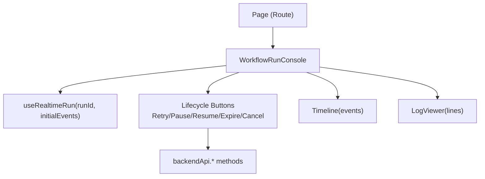
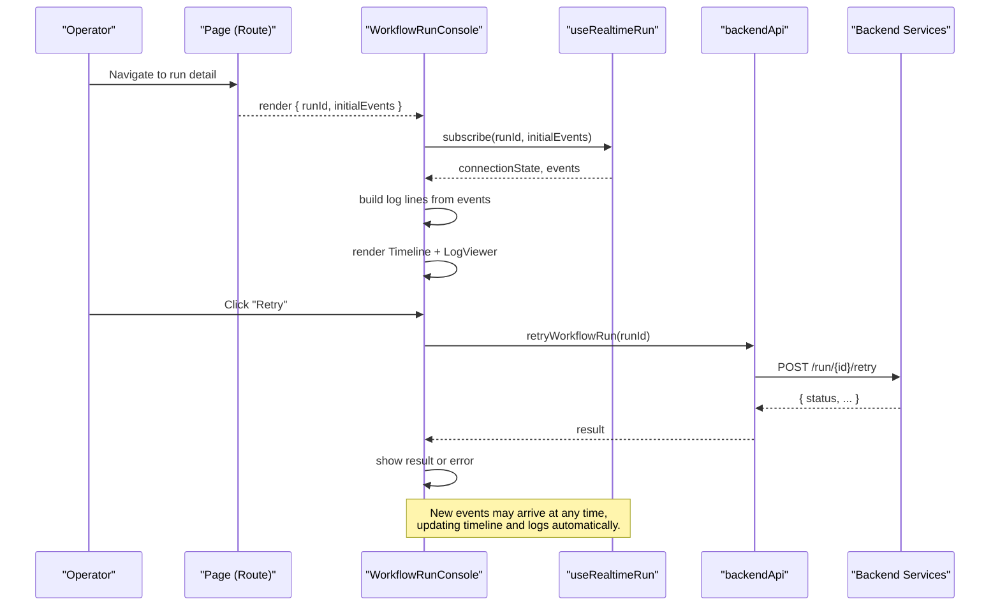
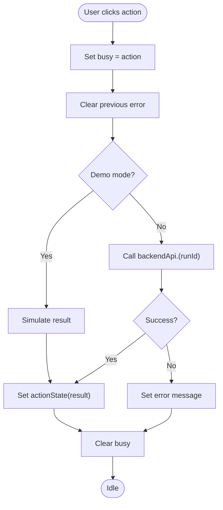
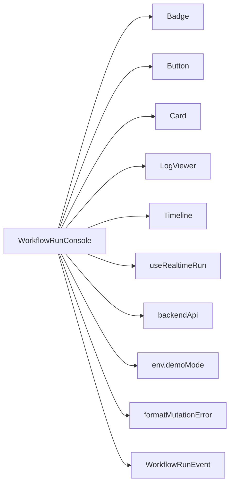

# Workflow Run Console

<cite>
**Referenced Files in This Document**
- [workflow-run-console.tsx](file://frontend/src/components/domain/workflow-run-console.tsx)
- [page.tsx](file://frontend/src/app/app/[...slug]/page.tsx)
- [live-ops-surfaces.ts](file://frontend/src/lib/api/live-ops-surfaces.ts)
</cite>

## Table of Contents
1. [Introduction](#introduction)
2. [Project Structure](#project-structure)
3. [Core Components](#core-components)
4. [Architecture Overview](#architecture-overview)
5. [Detailed Component Analysis](#detailed-component-analysis)
6. [Dependency Analysis](#dependency-analysis)
7. [Performance Considerations](#performance-considerations)
8. [Troubleshooting Guide](#troubleshooting-guide)
9. [Conclusion](#conclusion)
10. [Appendices](#appendices)

## Introduction
The WorkflowRunConsole component provides a real-time operational interface for monitoring and controlling an active workflow run. It displays live execution events, renders a timeline of steps, shows a scrolling log view, and exposes lifecycle controls such as retry, pause, resume, expire, and cancel. The component binds to a specific run via props, subscribes to real-time updates through a hook, and dispatches mutations against backend APIs exposed by the client library.

## Project Structure
The WorkflowRunConsole is a client-side React component integrated into the application’s routing layer. It is rendered within a page that supplies the run identifier and initial event snapshot. A manifest file documents the live operations surface, ensuring each UI action maps to a backend API method.

**Diagram sources**
- [workflow-run-console.tsx:17-149](file://frontend/src/components/domain/workflow-run-console.tsx#L17-L149)
- [page.tsx:740-742](file://frontend/src/app/app/[...slug]/page.tsx#L740-L742)
- [live-ops-surfaces.ts:17-40](file://frontend/src/lib/api/live-ops-surfaces.ts#L17-L40)

**Section sources**
- [workflow-run-console.tsx:17-149](file://frontend/src/components/domain/workflow-run-console.tsx#L17-L149)
- [page.tsx:740-742](file://frontend/src/app/app/[...slug]/page.tsx#L740-L742)
- [live-ops-surfaces.ts:17-40](file://frontend/src/lib/api/live-ops-surfaces.ts#L17-L40)

## Core Components
- WorkflowRunConsole
  - Role: Real-time console for a single workflow run with control actions, timeline visualization, and log streaming.
  - Props:
    - runId: string — Identifies the workflow run instance.
    - initialEvents: WorkflowRunEvent[] — Initial snapshot of events used to bootstrap the timeline and logs before real-time updates arrive.
  - Behavior:
    - Subscribes to live updates using useRealtimeRun.
    - Renders connection state badge.
    - Provides lifecycle buttons with busy/error states.
    - Displays a timeline of events and a log viewer built from event payloads.

- Integration Points
  - useRealtimeRun: Manages real-time event stream for a given runId and returns connectionState and events.
  - backendApi: Exposes mutation methods for lifecycle actions (retry, cancel, pause, resume, expire).
  - Live Ops Surface Manifest: Documents which UI components call which backendApi methods for auditability and testing.

**Section sources**
- [workflow-run-console.tsx:17-149](file://frontend/src/components/domain/workflow-run-console.tsx#L17-L149)
- [live-ops-surfaces.ts:17-40](file://frontend/src/lib/api/live-ops-surfaces.ts#L17-L40)

## Architecture Overview
The console orchestrates three primary flows:
- Event ingestion: Initial events are provided by the parent page; subsequent events arrive via the real-time hook.
- Control actions: User interactions trigger backend mutations through backendApi.
- Visualization: Events feed both a timeline and a log viewer.

**Diagram sources**
- [workflow-run-console.tsx:33-60](file://frontend/src/components/domain/workflow-run-console.tsx#L33-L60)
- [workflow-run-console.tsx:24-28](file://frontend/src/components/domain/workflow-run-console.tsx#L24-L28)
- [page.tsx:740-742](file://frontend/src/app/app/[...slug]/page.tsx#L740-L742)

## Detailed Component Analysis

### Props and Data Binding
- runId: string
  - Used to identify the target workflow run for both real-time subscription and lifecycle mutations.
- initialEvents: WorkflowRunEvent[]
  - Seed data for immediate rendering while the real-time connection establishes.

These props enable deterministic initial rendering and seamless transition to live updates.

**Section sources**
- [workflow-run-console.tsx:17-23](file://frontend/src/components/domain/workflow-run-console.tsx#L17-L23)

### Real-Time Event Streaming
- useRealtimeRun(runId, initialEvents)
  - Returns connectionState and events.
  - Drives the timeline and log viewer.
- Connection State Badge
  - Displays current connection state for operator awareness.

Implementation guidance:
- Ensure initialEvents are ordered consistently so the timeline and logs reflect chronological progression.
- Handle transient connection drops gracefully; the hook should manage reconnection and event deduplication.

**Section sources**
- [workflow-run-console.tsx:24-28](file://frontend/src/components/domain/workflow-run-console.tsx#L24-L28)
- [workflow-run-console.tsx:68-72](file://frontend/src/components/domain/workflow-run-console.tsx#L68-L72)

### User Interaction Handling
- Lifecycle actions: retry, cancel, pause, resume, expire
- Busy/Error States
  - Prevents concurrent actions via a busy flag.
  - Displays errors using a formatted message utility.
- Demo Mode
  - When enabled, simulates outcomes without calling the backend.

Action flow:
- On click, set busy and clear previous errors.
- Call corresponding backendApi method.
- Update local state with result or error.
- Clear busy after completion.

**Diagram sources**
- [workflow-run-console.tsx:33-60](file://frontend/src/components/domain/workflow-run-console.tsx#L33-L60)

**Section sources**
- [workflow-run-console.tsx:33-60](file://frontend/src/components/domain/workflow-run-console.tsx#L33-L60)

### Console Output Display
- Timeline
  - Visualizes step-by-step execution using the events array.
- Live Logs
  - Transforms events into timestamped lines for the log viewer.
- Selected Step Details
  - Placeholder area for expanded details when a timeline item is selected.

Best practices:
- Keep log lines concise; avoid excessively large payloads.
- Use consistent formatting for timestamps and event types to aid scanning.

**Section sources**
- [workflow-run-console.tsx:129-144](file://frontend/src/components/domain/workflow-run-console.tsx#L129-L144)

### Error Handling Visualization
- Errors from lifecycle actions are displayed below the control buttons.
- Uses a dedicated formatter to normalize error messages.

Recommendations:
- Surface actionable hints in error messages where possible.
- Provide a way to dismiss or retry failed actions.

**Section sources**
- [workflow-run-console.tsx:115-127](file://frontend/src/components/domain/workflow-run-console.tsx#L115-L127)

### Progress Indicators
- Connection state badge indicates real-time connectivity.
- Button labels reflect ongoing actions (e.g., “Retrying…”).
- Busy state disables all action buttons during processing.

**Section sources**
- [workflow-run-console.tsx:68-72](file://frontend/src/components/domain/workflow-run-console.tsx#L68-L72)
- [workflow-run-console.tsx:74-114](file://frontend/src/components/domain/workflow-run-console.tsx#L74-L114)

### Connecting to Backend Workflow Execution APIs
- The component calls backendApi methods for lifecycle actions.
- The live ops surface manifest documents these mappings for traceability and tests.

Example mapping:
- Retry → backendApi.retryWorkflowRun
- Cancel → backendApi.cancelWorkflowRun
- Pause → backendApi.pauseWorkflowRun
- Resume → backendApi.resumeWorkflowRun
- Expire → backendApi.expireWorkflowRun

Ensure your backend implements these endpoints and that the client library routes them correctly.

**Section sources**
- [workflow-run-console.tsx:49-54](file://frontend/src/components/domain/workflow-run-console.tsx#L49-L54)
- [live-ops-surfaces.ts:17-40](file://frontend/src/lib/api/live-ops-surfaces.ts#L17-L40)

### Handling Real-Time Updates
- Use the provided hook to subscribe to run events.
- Pass initialEvents to avoid blank screens on first render.
- Render both timeline and logs reactively as events update.

If you need to customize transport (e.g., Server-Sent Events or WebSocket), implement or configure the underlying hook accordingly.

**Section sources**
- [workflow-run-console.tsx:24-28](file://frontend/src/components/domain/workflow-run-console.tsx#L24-L28)

### Implementing User Controls for Workflow Management
- Add new lifecycle actions by:
  - Extending the action type union.
  - Adding a button and handler in the component.
  - Calling the appropriate backendApi method.
  - Updating the live ops surface manifest to document the new operation.

**Section sources**
- [workflow-run-console.tsx:15-16](file://frontend/src/components/domain/workflow-run-console.tsx#L15-L16)
- [workflow-run-console.tsx:33-60](file://frontend/src/components/domain/workflow-run-console.tsx#L33-L60)
- [live-ops-surfaces.ts:17-40](file://frontend/src/lib/api/live-ops-surfaces.ts#L17-L40)

### Customizing the Console Display
- Replace or wrap the Timeline and LogViewer components to change visual presentation.
- Adjust layout grid and card sections to fit different screen sizes.
- Introduce additional panels for step-level diagnostics or tool-call inspection.

**Section sources**
- [workflow-run-console.tsx:129-144](file://frontend/src/components/domain/workflow-run-console.tsx#L129-L144)

### Adding New Workflow-Specific Features
- Extend the events model if needed and ensure the hook can deliver new event types.
- Add conditional rendering logic based on event.type or payload fields.
- Wire new user actions to backendApi and document them in the live ops surface manifest.

**Section sources**
- [workflow-run-console.tsx:24-28](file://frontend/src/components/domain/workflow-run-console.tsx#L24-L28)
- [live-ops-surfaces.ts:17-40](file://frontend/src/lib/api/live-ops-surfaces.ts#L17-L40)

## Dependency Analysis
The console depends on:
- UI primitives (Badge, Button, Card, LogViewer, Timeline)
- Real-time hook (useRealtimeRun)
- API client (backendApi)
- Environment configuration (env.demoMode)
- Error formatting utility (formatMutationError)
- Types (WorkflowRunEvent)

**Diagram sources**
- [workflow-run-console.tsx:1-14](file://frontend/src/components/domain/workflow-run-console.tsx#L1-L14)
- [workflow-run-console.tsx:24-28](file://frontend/src/components/domain/workflow-run-console.tsx#L24-L28)
- [workflow-run-console.tsx:33-60](file://frontend/src/components/domain/workflow-run-console.tsx#L33-L60)

**Section sources**
- [workflow-run-console.tsx:1-14](file://frontend/src/components/domain/workflow-run-console.tsx#L1-L14)
- [workflow-run-console.tsx:24-28](file://frontend/src/components/domain/workflow-run-console.tsx#L24-L28)
- [workflow-run-console.tsx:33-60](file://frontend/src/components/domain/workflow-run-console.tsx#L33-L60)

## Performance Considerations
- Minimize log line size: Avoid serializing very large payloads directly into log lines.
- Debounce heavy computations: If adding derived views, compute only when necessary.
- Virtualize long lists: If timelines or logs grow large, consider virtualization in the underlying components.
- Efficient subscriptions: Ensure the real-time hook batches or coalesces events to reduce re-renders.

[No sources needed since this section provides general guidance]

## Troubleshooting Guide
- No events appear
  - Verify runId is correct and initialEvents are provided.
  - Check connectionState badge for connectivity issues.
- Action buttons do nothing
  - Confirm demo mode is disabled if expecting real backend calls.
  - Inspect network requests to backendApi methods.
- Errors not shown
  - Ensure error formatting utility is invoked and error state is rendered.
- Duplicate or out-of-order logs
  - Validate event ordering and deduplication in the real-time hook.

**Section sources**
- [workflow-run-console.tsx:68-72](file://frontend/src/components/domain/workflow-run-console.tsx#L68-L72)
- [workflow-run-console.tsx:115-127](file://frontend/src/components/domain/workflow-run-console.tsx#L115-L127)
- [workflow-run-console.tsx:33-60](file://frontend/src/components/domain/workflow-run-console.tsx#L33-L60)

## Conclusion
The WorkflowRunConsole offers a focused, real-time operational experience for workflow runs. By binding to run-specific data, subscribing to live events, and exposing lifecycle controls, it enables operators to monitor progress, diagnose issues, and take corrective actions efficiently. Its modular design allows customization of visuals and extension with domain-specific features while maintaining clear integration points with backend APIs.

[No sources needed since this section summarizes without analyzing specific files]

## Appendices

### Usage Example: Rendering the Console in a Route
- Pass runId and initialEvents to the component from the route page.

**Section sources**
- [page.tsx:740-742](file://frontend/src/app/app/[...slug]/page.tsx#L740-L742)

### Live Ops Surface Mapping Reference
- Maps UI actions to backendApi methods for auditability and automated checks.

**Section sources**
- [live-ops-surfaces.ts:17-40](file://frontend/src/lib/api/live-ops-surfaces.ts#L17-L40)